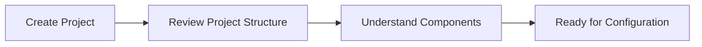

# Project Structure

## 🚀 Get Started

Setelah project berhasil dibuat, langkah berikutnya adalah memahami struktur direktori dan file yang digunakan oleh MkDocs. Memahami struktur project akan memudahkan proses pengembangan, pemeliharaan, dan deployment dokumentasi.

---

## 🎯 Learning Objectives

Setelah menyelesaikan panduan ini, Anda akan mampu:

- Memahami struktur project MkDocs.
- Menjelaskan fungsi setiap direktori dan file.
- Membedakan source documentation dan build output.
- Menggunakan struktur project yang mudah dipelihara.

---

## 🔄 Workflow



---

## 📋 Prerequisites

Pastikan:

| Component | Description |
|-----------|-------------|
| MkDocs | Telah terinstal |
| Project MkDocs | Sudah dibuat |
| Terminal | Bash atau shell lainnya |

---

## ▶️ Procedure

### Step 1 — Review the Default Project Structure

Masuk ke direktori project.

```bash
cd ~/git/my-project
```

Lihat struktur project.

```bash
tree
```

Contoh output.

```text
my-project/
├── docs/
│   └── index.md
└── mkdocs.yml
```

Struktur tersebut merupakan project minimal yang diperlukan untuk menjalankan MkDocs.

---

### Step 2 — Understand the Source Directory

Direktori `docs/` digunakan untuk menyimpan seluruh dokumentasi dalam format Markdown.

Contoh.

```text
docs/
├── index.md
├── installation.md
├── configuration.md
└── deployment.md
```

Seluruh file Markdown pada direktori ini akan diproses saat menjalankan proses build.

---

### Step 3 — Understand the Configuration File

File konfigurasi utama MkDocs adalah:

```text
mkdocs.yml
```

File ini digunakan untuk mengatur berbagai konfigurasi website, seperti:

- Site Information
- Navigation
- Theme
- Plugins
- Markdown Extensions
- Repository Information
- Extra Configuration

Seluruh konfigurasi website dikelola melalui file ini.

---

### Step 4 — Understand the Build Output

Jalankan proses build.

```bash
mkdocs build
```

MkDocs akan membuat direktori baru.

```text
my-project/
├── docs/
├── site/
└── mkdocs.yml
```

Direktori `site/` berisi website statis yang siap dipublikasikan.

Sebagai contoh.

```text
site/
├── index.html
├── assets/
├── css/
├── js/
└── search/
```

Direktori ini dibuat secara otomatis setiap kali menjalankan proses build.

---

### Step 5 — Review the Recommended Project Structure

Seiring bertambahnya jumlah dokumentasi, struktur project dapat disusun menjadi lebih terorganisir.

Sebagai contoh.

```text
my-project/
├── docs/
│   ├── index.md
│   ├── how-to/
│   │   ├── git/
│   │   ├── mkdocs/
│   │   ├── hugo/
│   │   └── podman/
│   ├── projects/
│   ├── adr/
│   └── assets/
│
├── overrides/
├── site/
└── mkdocs.yml
```

Struktur tersebut memudahkan pengelolaan dokumentasi ketika jumlah halaman semakin banyak.

---

## ✅ Verification

Pastikan struktur project tersedia.

```bash
tree
```

Pastikan file konfigurasi tersedia.

```text
mkdocs.yml
```

Pastikan direktori source tersedia.

```text
docs/
```

Jalankan proses build.

```bash
mkdocs build
```

Pastikan direktori berikut berhasil dibuat.

```text
site/
```

!!! success "Verification"

    Struktur project dinyatakan berhasil apabila:

    - Direktori `docs/` tersedia.
    - File `mkdocs.yml` tersedia.
    - Direktori `site/` berhasil dibuat.
    - Seluruh struktur project dapat dikenali dengan baik.

---

## 💡 Technology Notes

- Direktori `docs/` merupakan sumber utama dokumentasi.
- File `mkdocs.yml` merupakan pusat konfigurasi MkDocs.
- Direktori `site/` merupakan hasil proses build dan tidak disarankan untuk diedit secara langsung.
- Perubahan sebaiknya selalu dilakukan pada source documentation, kemudian dibangun kembali menggunakan `mkdocs build`.

---

## ▶️ Next Steps

Setelah memahami struktur project, tahap berikutnya adalah mengonfigurasi website menggunakan file `mkdocs.yml`.

---

## 🔗 Related Documents

| Document | Description |
|----------|-------------|
| **Configuration** | Mengonfigurasi website MkDocs. |
| **Writing Documentation** | Menulis dokumentasi menggunakan Markdown. |

---

## 📝 Summary

Pada panduan ini Anda telah mempelajari:

- Struktur project MkDocs.
- Fungsi direktori `docs/`.
- Fungsi file `mkdocs.yml`.
- Fungsi direktori `site/`.
- Struktur project yang direkomendasikan.

Project sekarang siap untuk dikonfigurasi sesuai kebutuhan.