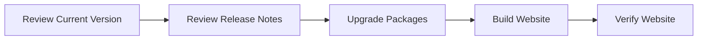

# Upgrade

## 🚀 Get Started

Seiring waktu, MkDocs, Material for MkDocs, dan paket Python lainnya akan terus mengalami pembaruan untuk menghadirkan fitur baru, peningkatan performa, perbaikan bug, serta pembaruan keamanan.

Sebelum melakukan upgrade, penting untuk memahami dampaknya terhadap proyek yang sedang digunakan. Proses upgrade yang direncanakan dengan baik dapat mengurangi risiko incompatibility dan memastikan website tetap dapat dibangun dan dipublikasikan dengan baik.

---

## 🎯 Learning Objectives

Setelah menyelesaikan panduan ini, Anda akan mampu:

- Memahami proses upgrade MkDocs dan dependensinya.
- Memeriksa versi yang sedang digunakan.
- Melakukan upgrade dengan aman.
- Memverifikasi hasil upgrade.
- Mengidentifikasi perubahan yang memerlukan penyesuaian konfigurasi.

---

## 🔄 Workflow



---

## 📋 Prerequisites

Pastikan:

| Component | Description |
|-----------|-------------|
| Python Virtual Environment | Activated |
| MkDocs Project | Available |
| Source Repository | Up to date |
| Backup | Completed |

---

## ▶️ Procedure

### Step 1 — Review the Current Version

Periksa versi MkDocs.

```bash
mkdocs --version
```

Periksa versi Material.

```bash
pip show mkdocs-material
```

Catat versi yang sedang digunakan sebagai referensi apabila diperlukan proses rollback.

---

### Step 2 — Review the Release Notes

Sebelum melakukan upgrade, baca release notes dari proyek yang akan diperbarui.

Perhatikan informasi berikut:

- New Features
- Bug Fixes
- Breaking Changes
- Deprecated Features
- Upgrade Notes

Langkah ini membantu mengidentifikasi perubahan yang mungkin memerlukan penyesuaian konfigurasi atau dokumentasi.

---

### Step 3 — Upgrade the Packages

Upgrade MkDocs.

```bash
pip install --upgrade mkdocs
```

Upgrade Material for MkDocs.

```bash
pip install --upgrade mkdocs-material
```

Apabila proyek menggunakan plugin tambahan, lakukan upgrade sesuai kebutuhan.

---

### Step 4 — Build the Website

Setelah upgrade selesai, bangun kembali website.

```bash
mkdocs build
```

Pastikan proses build selesai tanpa error.

---

### Step 5 — Verify the Website

Jalankan development server.

```bash
mkdocs serve
```

Periksa:

- Navigation
- Theme
- Search
- Mermaid Diagram
- Admonitions
- Images
- Hyperlinks
- Custom CSS
- Custom JavaScript

Pastikan seluruh komponen berfungsi sebagaimana mestinya.

---

## ✅ Verification

Pastikan:

- Seluruh package berhasil di-upgrade.
- Website berhasil dibangun.
- Tidak ada warning atau error baru.
- Tampilan website sesuai harapan.
- Seluruh fitur tetap berfungsi.

!!! success "Verification"

    Upgrade dinyatakan berhasil apabila website dapat dibangun dan dijalankan tanpa perubahan perilaku yang tidak diharapkan.

---

## 💡 Technology Notes

- Selalu lakukan backup sebelum upgrade.
- Gunakan Python Virtual Environment untuk mengisolasi dependensi.
- Baca release notes sebelum melakukan upgrade mayor.
- Lakukan pengujian sebelum mempublikasikan hasil upgrade ke lingkungan produksi.
- Hindari melakukan upgrade beberapa komponen sekaligus apabila tidak diperlukan agar lebih mudah melakukan troubleshooting.

---

## ▶️ Next Steps

Apabila setelah upgrade ditemukan masalah, gunakan panduan **Troubleshooting** untuk mengidentifikasi penyebab dan langkah penyelesaiannya.

---

## 🔗 Related Documents

| Document | Description |
|----------|-------------|
| Backup and Recovery | Protect project data before upgrading |
| Build Static Website | Rebuild the website after upgrading |
| Troubleshooting | Resolve upgrade issues |

---

## 🌐 External References

- [MkDocs Documentation](https://www.mkdocs.org/){: target="_blank" rel="noopener noreferrer" }
- [Material for MkDocs Documentation](https://squidfunk.github.io/mkdocs-material/){: target="_blank" rel="noopener noreferrer" }
- [Python Packaging User Guide](https://packaging.python.org/){: target="_blank" rel="noopener noreferrer" }

---

## 📝 Summary

Pada panduan ini Anda telah mempelajari cara:

- Memeriksa versi MkDocs dan dependensi yang digunakan.
- Meninjau release notes sebelum upgrade.
- Melakukan upgrade MkDocs dan Material for MkDocs.
- Membangun kembali website setelah upgrade.
- Memverifikasi hasil upgrade untuk memastikan website tetap berfungsi dengan baik.