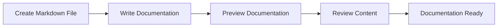

# Writing Documentation

## 🚀 Get Started

Setelah website berhasil dikonfigurasi, langkah berikutnya adalah mulai menulis dokumentasi.

MkDocs menggunakan **Markdown** sebagai format penulisan utama, sedangkan **Material for MkDocs** menyediakan berbagai komponen tambahan untuk menghasilkan dokumentasi yang lebih informatif, konsisten, dan mudah dibaca.

Panduan ini memperkenalkan komponen-komponen yang paling umum digunakan dalam dokumentasi teknis.

---

## 🎯 Learning Objectives

Setelah menyelesaikan panduan ini, Anda akan mampu:

- Menulis dokumentasi menggunakan Markdown.
- Menggunakan komponen yang umum digunakan pada dokumentasi teknis.
- Menambahkan diagram, tabel, gambar, dan code block.
- Membuat dokumentasi yang konsisten dan mudah dipelihara.

---

## 🔄 Workflow



---

## 📋 Prerequisites

Pastikan:

| Component | Description |
|-----------|-------------|
| MkDocs Project | Created |
| Configuration | Completed |
| Development Server | Running |
| Text Editor | Visual Studio Code (Recommended) |

---

## ▶️ Procedure

### Step 1 — Create a Markdown File

Seluruh dokumentasi ditulis menggunakan file Markdown (`.md`) yang berada di dalam direktori `docs/`.

Contoh.

```text
docs/
├── index.md
├── installation.md
├── configuration.md
└── deployment.md
```

---

### Step 2 — Organize the Document

Gunakan struktur dokumen yang konsisten.

Sebagai contoh.

```markdown
# Title

## Overview

## Procedure

## Verification

## Summary
```

Dokumen yang memiliki struktur konsisten akan lebih mudah dipahami dan dipelihara.

---

### Step 3 — Use Common Components

Gunakan komponen yang sesuai dengan kebutuhan dokumentasi.

| Component | Purpose |
|-----------|---------|
| Headings | Menyusun struktur dokumen |
| Lists | Menyajikan langkah-langkah |
| Tables | Menampilkan informasi terstruktur |
| Code Blocks | Menampilkan command, konfigurasi, atau output |
| Images | Menampilkan ilustrasi |
| Hyperlinks | Menghubungkan dokumen |
| Admonitions | Menampilkan informasi penting |
| Mermaid Diagrams | Membuat diagram |
| Icons | Mempermudah identifikasi informasi |

---

### Step 4 — Preview the Documentation

Jalankan development server.

```bash
mkdocs serve
```

Buka browser.

```text
http://127.0.0.1:8000
```

Setiap perubahan pada file Markdown akan langsung diperbarui secara otomatis.

---

### Step 5 — Review the Content

Sebelum dipublikasikan, lakukan peninjauan terhadap dokumentasi.

Pastikan:

- Struktur dokumen konsisten.
- Tidak terdapat kesalahan penulisan.
- Hyperlink berfungsi.
- Diagram dapat dirender.
- Gambar ditampilkan dengan benar.
- Tabel mudah dibaca.

---

## ✅ Verification

Jalankan development server.

```bash
mkdocs serve
```

Pastikan:

- Heading ditampilkan dengan benar.
- Code block menggunakan syntax highlighting.
- Gambar dapat ditampilkan.
- Hyperlink berfungsi.
- Mermaid Diagram berhasil dirender.
- Admonition ditampilkan dengan benar.

!!! success "Verification"

    Dokumentasi dinyatakan berhasil apabila seluruh komponen dapat dirender dengan benar pada browser.

---

## 💡 Technology Notes

- Gunakan Markdown sebagai format utama dokumentasi.
- Gunakan hanya komponen yang benar-benar membantu pembaca.
- Hindari penggunaan warna, ikon, atau diagram secara berlebihan.
- Terapkan struktur dokumen yang konsisten agar mudah dipelihara.

---

## ▶️ Next Steps

Setelah dokumentasi selesai ditulis, tahap berikutnya adalah membangun website statis menggunakan MkDocs.

---

## 🔗 Related Documents

| Document | Description |
|----------|-------------|
| Build Website | Generate static website |
| Deploy Website | Publish static website |

---

## 🌐 External References

- [Markdown Guide](https://www.markdownguide.org/){: target="_blank" rel="noopener noreferrer" }
- [Python Markdown](https://python-markdown.github.io/){: target="_blank" rel="noopener noreferrer" }
- [MkDocs – Writing Your Docs](https://www.mkdocs.org/user-guide/writing-your-docs/){: target="_blank" rel="noopener noreferrer" }
- [Material for MkDocs – Reference](https://squidfunk.github.io/mkdocs-material/reference/){: target="_blank" rel="noopener noreferrer" }

---

## 📝 Summary

Pada panduan ini Anda telah mempelajari cara:

- Menulis dokumentasi menggunakan Markdown.
- Menggunakan komponen yang umum digunakan pada dokumentasi teknis.
- Meninjau hasil dokumentasi menggunakan development server.
- Menyiapkan dokumentasi sebelum proses build.