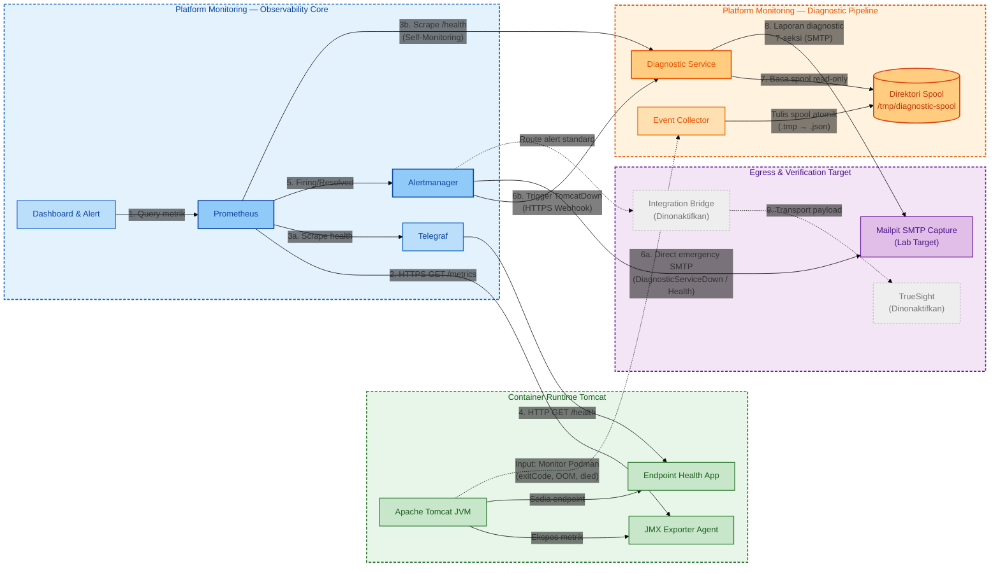
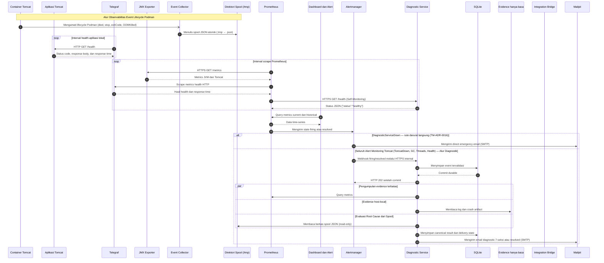
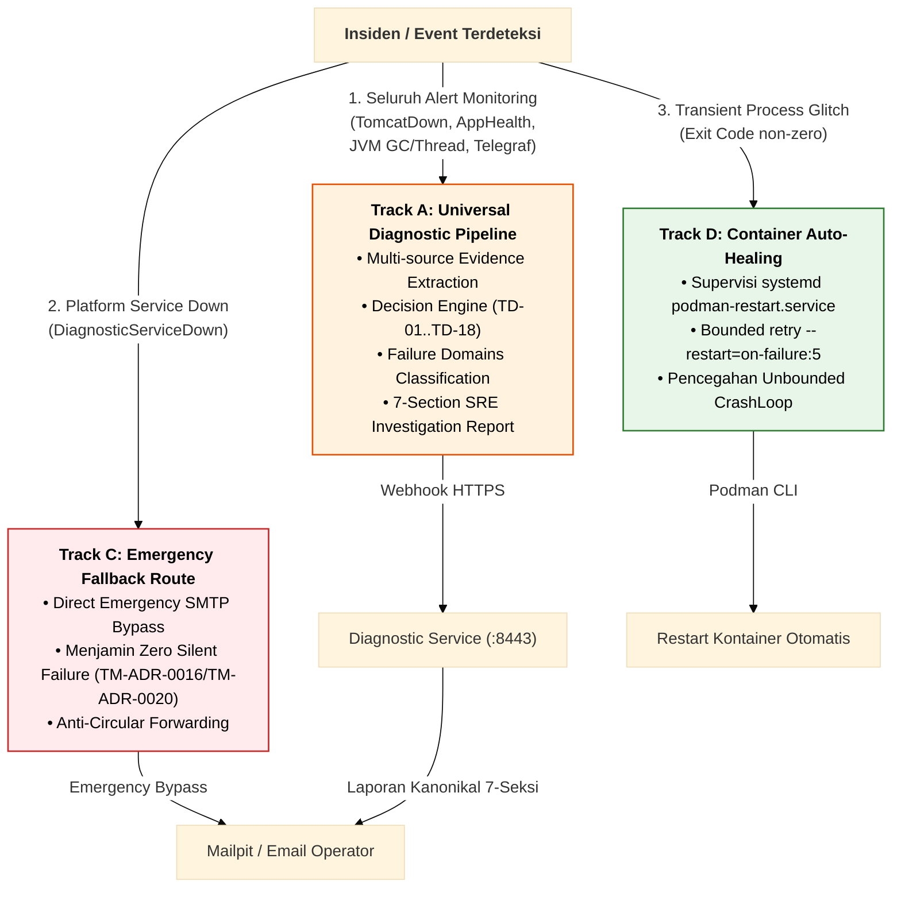
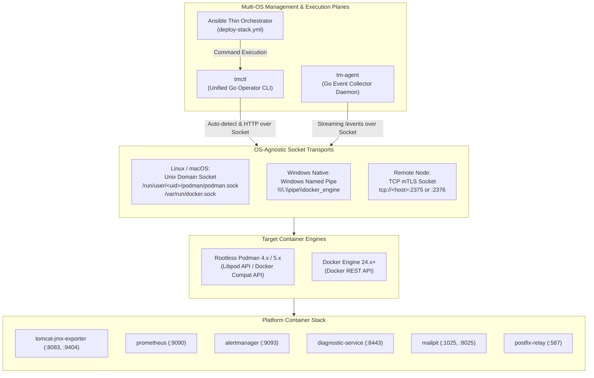
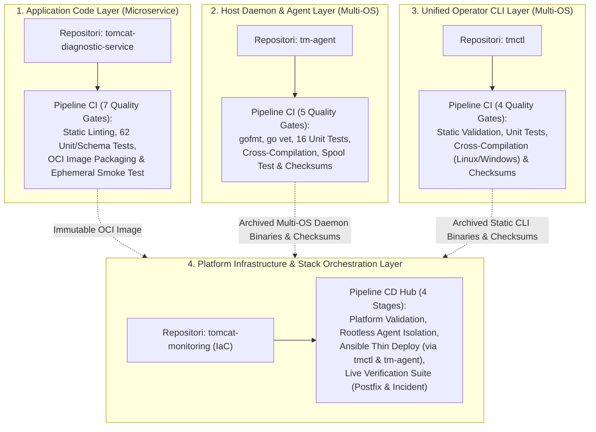

# Architecture

## Overview

Arsitektur Tomcat Monitoring menempatkan JMX Exporter sebagai Java Agent di
dalam JVM Tomcat. Prometheus berjalan sebagai container terpisah di dalam
monitoring stack project dan mengambil metrics melalui endpoint HTTPS. Telegraf
memeriksa HTTP health endpoint aplikasi melalui container network yang sama
dengan Tomcat. Mailpit lokal menjadi persistent lab-only email capture target
tanpa external delivery. TrueSight berada di luar deployment boundary project
sebagai future event-management integration dan tidak tersedia pada lab saat
ini.

Diagnostic MVP menyediakan kapabilitas diagnosis deterministik otomatis untuk
alur `TomcatDown`. Seluruh komponen Diagnostic Service, Restricted Event Collector,
volume persisten SQLite (`diagnostic_data`), bind-mount spool/log hanya-baca, pohon
keputusan `TD-01` s/d `TD-08`, Declarative Rulepack Engine (`TD-09`), alur pengayaan AI,
dan pengiriman laporan diagnosis terstruktur ke Mailpit telah diimplementasikan
100% dan terverifikasi secara live pada lingkungan persisten `devops-lab`.

## Deployment Topology

### A. Topology Utama



Nomor pada diagram menunjukkan hubungan komunikasi, bukan urutan startup
container. Garis penuh menunjukkan alur persistent lab yang sudah diverifikasi;
garis putus-putus menunjukkan target external integration (Integration Bridge dan
TrueSight) yang saat ini dinonaktifkan. Topology utama menempatkan Diagnostic
Service setelah Alertmanager untuk memproses seluruh alert monitoring secara
universal melalui **Multi-Domain Diagnostic Dispatcher** (TM-ADR-0016, TM-ADR-0023),
dilengkapi jalur self-monitoring Prometheus terhadap `/health` dan emergency direct
SMTP Alertmanager jika Diagnostic Service mengalami gangguan. Container runtime
disupervisi oleh `podman-restart.service` dengan kebijakan auto-healing
`--restart=on-failure:5` (TM-ADR-0021).

### B. Detail Alur Diagnostic

```mermaid
%%{init: {
  'theme': 'base',
  'themeVariables': {
    'edgeLabelBackground': '#ffffff',
    'tertiaryBorderColor': '#cccccc',
    'lineColor': '#555555'
  },
  'flowchart': {
    'nodeSpacing': 30,
    'rankSpacing': 50
  }
}}%%
flowchart LR
    %% 1. Platform Monitoring Core (Kiri)
    subgraph CORE["Platform Monitoring"]
        direction TB
        PM["Prometheus"]
        AM["Alertmanager"]
        DS["Diagnostic Service"]
    end

    %% 2. Host Tomcat: Event, Spool, & Storage (Tengah)
    subgraph HOST["Host Tomcat"]
        direction TB
        HE["Event host dan container"]
        HC["Restricted Event Collector"]
        SP["Spool event ternormalisasi"]
        LOG["Log dan crash artifact"]
        SQ[("SQLite diagnostic_data")]
    end

    %% 3. Utility & Integrasi Eksternal (Kanan)
    subgraph EGRESS["Egress & Target"]
        direction TB
        NC["Mailpit SMTP Capture"]
        BR["Integration Bridge<br/>(Disabled)"]
        TS["TrueSight<br/>(Disabled)"]
    end

    %% ================= RELASI ANTAR KOMPONEN =================
    %% Alur Trigger & Webhook
    PM -->|"1. TomcatDown firing/resolved"| AM
    AM -->|"2. HTTPS webhook internal"| DS

    %% Alur Diagnostic Context Gathering
    DS -->|"3. Event dan state"| SQ
    DS -->|"4. Query metrics"| PM
    LOG -->|"5a. Read-only"| DS

    %% Alur Event Collector & Spool
    HE -->|"5b. Input allowlist"| HC
    HC -->|"5c. Record normal"| SP
    SP -->|"5d. Spool read-only"| DS

    %% Alur Egress / Notifikasi
    DS -->|"6. Email canonical"| NC
    AM -.->|"Route alert standard"| BR
    BR -.->|"Dinonaktifkan"| TS

    %% ================= STYLING SUBGRAPH =================
    style CORE fill:#f0f7ff,stroke:#1565c0,stroke-width:1.5px,stroke-dasharray: 4 2,color:#000000
    style HOST fill:#fff8f0,stroke:#e65100,stroke-width:1.5px,stroke-dasharray: 4 2,color:#000000
    style EGRESS fill:#fbf5fd,stroke:#6a1b9a,stroke-width:1.5px,color:#000000

    %% ================= STYLING NODES (FONT HITAM) =================
    %% Core Monitoring (Biru)
    style PM fill:#90caf9,stroke:#0d47a1,stroke-width:2px,color:#000000
    style AM fill:#90caf9,stroke:#0d47a1,stroke-width:2px,color:#000000
    style DS fill:#ffcc80,stroke:#e65100,stroke-width:2px,color:#000000

    %% Host Tomcat (Oranye / Amber)
    style SQ fill:#ffe0b2,stroke:#ef6c00,stroke-width:1.5px,color:#000000
    style LOG fill:#ffe0b2,stroke:#ef6c00,stroke-width:1.5px,color:#000000
    style HE fill:#ffe0b2,stroke:#ef6c00,stroke-width:1.5px,color:#000000
    style HC fill:#ffe0b2,stroke:#ef6c00,stroke-width:1.5px,color:#000000
    style SP fill:#ffe0b2,stroke:#ef6c00,stroke-width:1.5px,color:#000000

    %% Egress (Ungu & Abu-abu Disabled)
    style NC fill:#e1bee7,stroke:#6a1b9a,stroke-width:1.5px,color:#000000
    style BR fill:#eeeeee,stroke:#9e9e9e,stroke-width:1px,stroke-dasharray: 3 3,color:#000000
    style TS fill:#eeeeee,stroke:#9e9e9e,stroke-width:1px,stroke-dasharray: 3 3,color:#000000
```



Seluruh alur pada topology detail telah diimplementasikan dan terverifikasi secara
live pada lingkungan persisten `devops-lab`. Satu Diagnostic Service dan satu local
state volume (`diagnostic_data`) beroperasi per host Tomcat. Sesuai prinsip **Universal Diagnostic Ingestion** yang ditetapkan pada
[TM-ADR-0016](../../../adr/tomcat-monitoring/adr-records/TM-ADR-0016.md), seluruh alert
monitoring operasional (baik insiden fatal `TomcatDown`, kegagalan HTTP `TomcatApplicationHealthFailed`,
degradasi beban kerja JVM GC/Thread, maupun kehilangan sinyal `TelegrafHealthScrapeUnavailable`)
dialirkan ke Diagnostic Service. Diagnostic Service bertindak sebagai **Otoritas Tunggal Notifikasi Insiden**,
menyusun bukti multi-sumber, dan menerbitkan laporan investigasi 7-seksi SRE yang terstandarisasi.
Alertmanager tidak lagi mengirimkan email insiden langsung ke Mailpit, kecuali pada jalur darurat
ketika Diagnostic Service sendiri mati (`DiagnosticServiceDown` emergency bypass).

## Monitoring and Diagnostic Flow



Sequence diagram menegaskan bahwa Prometheus dan Telegraf menggunakan model
pull. Telegraf memulai HTTP health check terhadap aplikasi, sedangkan Prometheus
melakukan scrape terhadap JMX Exporter dan Telegraf. Cabang Diagnostic Service
menunjukkan alur asinkron di mana webhook mengembalikan HTTP `202 Accepted`
hanya setelah event berhasil di-commit secara durable ke SQLite, dilanjutkan
dengan pemrosesan worker, evaluasi rule engine, persistensi canonical result,
dan pengiriman laporan ke Mailpit.

## Operational Scenarios & Diagnostic Routing Architecture

Desain arsitektur menegakkan prinsip **Universal Diagnostic Ingestion & Single Canonical Notification Authority** ([TM-ADR-0016](../../../adr/tomcat-monitoring/adr-records/TM-ADR-0016.md)). Seluruh alert monitoring operasional dialirkan ke Diagnostic Service guna memastikan standardisasi laporan investigasi:



### Matriks Pemisahan Skenario: Universal Diagnostic vs. Emergency Fallback

| Jalur Penanganan (*Track*) | Kriteria & Alert Rules Terkait | Mengapa Memerlukan / Tidak Memerlukan Diagnostic Service? | Target Eskalasi & Output |
| :--- | :--- | :--- | :--- |
| **Track A: Universal Diagnostic Pipeline (Canonical Authority)** | `TomcatDown`<br/>`TomcatApplicationHealthFailed`<br/>`TomcatApplicationHealthMetricsMissing`<br/>`TelegrafHealthScrapeUnavailable`<br/>`TomcatGCPauseHigh`<br/>`TomcatThreadPoolSaturated`<br/>`TomcatGCOverheadHigh`<br/>`TomcatOldGenMemoryPressure` | **Wajib Melalui Diagnostic Service.** Sesuai TM-ADR-0016, seluruh alert monitoring (ketersediaan runtime, degradasi performa JVM, kesehatan servlet aplikasi, hingga sinyal agent pemantau) wajib dianalisis secara terpadu oleh Diagnostic Service guna menyajikan bukti terkorelasi, klasifikasi domain, dan format laporan 7-seksi SRE yang seragam bagi operator. | Laporan Investigasi Diagnostik Terstruktur 7-Seksi via SMTP ke Mailpit / On-call SRE. |
| **Track C: Emergency Direct Route (Zero Silent Failure)** | `DiagnosticServiceDown` (`up{job="tomcat-diagnostic-service"} == 0`) | **TIDAK Boleh Melalui Diagnostic Service.** Engine diagnostik itu sendiri yang sedang mengalami kegagalan. Alertmanager melakukan *emergency bypass* langsung via SMTP ke Mailpit untuk mencegah *silent failure* ([TM-ADR-0016](../../../adr/tomcat-monitoring/adr-records/TM-ADR-0016.md) / [TM-ADR-0020](../../../adr/tomcat-monitoring/adr-records/TM-ADR-0020.md)). | Direct Emergency Alert ke On-call SRE / Sysadmin. |
| **Track D: Infrastructure Auto-Healing** | Transient crash / exit code non-zero | **Ditangani di Level Infrastruktur.** Kegagalan transien disembuhkan otomatis oleh `podman-restart.service` (`--restart=on-failure:5`) tanpa memicu kebisingan alert ke operator kecuali jika kuota retry habis ([TM-ADR-0021](../../../adr/tomcat-monitoring/adr-records/TM-ADR-0021.md)). | Restart kontainer lokal otomatis oleh Podman runtime. |

### Detail Spesifikasi Desain 6 Skenario Operasional

#### 🔴 Skenario 1 (Track A): Tomcat Runtime Crash / Outage (`TomcatDown` — Autonomous Diagnostic)
* **Kondisi Pemicu (*Trigger*):** Proses Tomcat berhenti, container crash, OOMKilled oleh kernel Linux (exit code 137), fatal JVM crash (`hs_err_pid*.log`), konflik port socket, atau shutdown bersih (`SIGTERM`/`SIGINT`).
* **Deteksi Telemetri:** Prometheus mendeteksi hilangnya scrape JMX Exporter:
  ```promql
  up{job="tomcat-jmx-exporter"} == 0  # for: 2m, severity: critical
  ```
* **Alur Eksekusi Arsitektural:**
  1. Prometheus mengirimkan alert `TomcatDown` berstatus *firing* ke Alertmanager.
  2. Alertmanager meneruskan webhook HTTPS ke Diagnostic Service (`:8443/api/v1/alerts/alertmanager`).
  3. Ingestion Guard memvalidasi token dan skema JSON v4, menyimpan event secara persisten ke SQLite `events` (transaksi ACID), lalu mengembalikan `HTTP 202 Accepted` ([TM-ADR-0015](../../../adr/tomcat-monitoring/adr-records/TM-ADR-0015.md)).
  4. Worker mengambil event dari antrean berkapasitas 50, mengumpulkan bukti terkorelasi dari mount hanya-baca:
     * Cuplikan log `catalina.out` (maks 500 baris / 512 KiB dengan sensor data rahasia).
     * Spool record Podman dari Restricted Collector (`exitCode`, `oomKilled`, timestamp crash).
     * Metrik Prometheus terkini dan health probe.
  5. Engine mengevaluasi cabang keputusan deterministik (`TD-01` s/d `TD-18`), memetakan ke Failure Domains, menghitung *Confidence Score*, dan menyusun rekomendasi SOP operator (*Zero Automatic Remediation*, [TM-ADR-0014](../../../adr/tomcat-monitoring/adr-records/TM-ADR-0014.md)).
  6. Menerbitkan **Laporan Diagnosis 7-Seksi** via SMTP ke Mailpit / Email On-call.
  7. Ketika Tomcat hidup kembali (`up == 1`), event *resolved* masuk ke pipeline, dikorelasikan dengan insiden awal, dan menerbitkan email *Incident Resolved* otomatis ([TM-ADR-0016](../../../adr/tomcat-monitoring/adr-records/TM-ADR-0016.md)).

#### 🟠 Skenario 2 (Track A): HTTP Application Health Check Gagal (`TomcatApplicationHealthFailed` — Diagnostic Ingestion)
* **Kondisi Pemicu (*Trigger*):** Aplikasi Tomcat mengalami kegagalan internal servlet, unhandled exception, mengembalikan HTTP status `500`/`503`, response JSON bukan `{"status":"UP"}`, atau response timeout $> 5\text{s}$, sementara container Tomcat dan JVM-nya sendiri masih berjalan normal.
* **Deteksi Telemetri:** Telegraf probe gagal memeriksa `:8080/health`, menghasilkan metrik yang di-scrape Prometheus:
  ```promql
  max by (job, instance, service, check) (http_response_result_code{job="telegraf-health", service="tomcat", check="application-health"}) != 0  # for: 2m
  ```
* **Alur Eksekusi Arsitektural:**
  1. Prometheus mendeteksi `result_code != 0` dan mengirimkan alert `TomcatApplicationHealthFailed` ke Alertmanager.
  2. Alertmanager merutekan webhook HTTPS ke Diagnostic Service sesuai kewenangan notifikasi tunggal (TM-ADR-0016).
  3. Diagnostic Service mengumpulkan bukti respon HTTP Telegraf dan log servlet `catalina.out`, mengevaluasi status kesehatan aplikasi, dan menerbitkan laporan investigasi 7-seksi ke Mailpit/SRE.
  4. Saat health probe aplikasi kembali mengembalikan HTTP `200` dan body `{"status":"UP"}`, Diagnostic Service menerima event resolved dan mengirimkan notifikasi pemulihan kanonikal.

#### 🟡 Skenario 3 (Track A): Kehilangan Sinyal Monitoring Telegraf (`TelegrafHealthScrapeUnavailable` / `MetricsMissing`)
* **Kondisi Pemicu (*Trigger*):** Container Telegraf mati, konfigurasi network terputus, atau plugin Telegraf tidak menghasilkan metrik.
* **Deteksi Telemetri:** Prometheus mendeteksi target Telegraf tidak dapat diakses:
  ```promql
  up{job="telegraf-health"} == 0  # for: 2m, severity: critical
  ```
* **Alur Eksekusi Arsitektural:**
  1. Prometheus mengirimkan alert `TelegrafHealthScrapeUnavailable` ke Alertmanager.
  2. Alertmanager merutekan webhook ke Diagnostic Service.
  3. Diagnostic Service mencatat anomali telemetri dan menerbitkan laporan diagnostik bahwa **sinyal observabilitas kesehatan aplikasi terputus**, memisahkan secara tegas antara "kegagalan aplikasi" vs "kegagalan alat pemantau" sesuai prinsip [TM-ADR-0004](../../../adr/tomcat-monitoring/adr-records/TM-ADR-0004.md).

#### 🚨 Skenario 4 (Track C): Diagnostic Service Down / Self-Monitoring Outage (`DiagnosticServiceDown` — Emergency Fallback)
* **Kondisi Pemicu (*Trigger*):** Container Diagnostic Service mati, crash, atau SQLite terkunci.
* **Deteksi Telemetri:** Prometheus mendeteksi kegagalan scrape endpoint `/health` Diagnostic Service:
  ```promql
  up{job="tomcat-diagnostic-service"} == 0  # for: 1m, severity: critical
  ```
* **Alur Eksekusi Arsitektural (*Zero Silent Failure*):**
  1. Prometheus mengirimkan alert `DiagnosticServiceDown` ke Alertmanager.
  2. Sub-route khusus Alertmanager mencocokkan `alertname = "DiagnosticServiceDown"` dan mengeksekusi **Direct Emergency SMTP Bypass** langsung ke Mailpit/Operator ([TM-ADR-0016](../../../adr/tomcat-monitoring/adr-records/TM-ADR-0016.md) / [TM-ADR-0020](../../../adr/tomcat-monitoring/adr-records/TM-ADR-0020.md)).
  3. Jalur ini memotong perutean webhook ke Diagnostic Service untuk mencegah ketergantungan melingkar (*circular routing*) dan menjamin operator segera tahu bahwa sistem diagnosis otomatis sedang tidak beroperasi.

#### 🛡️ Skenario 5 (Track D): Auto-Healing Kontainer dari Transient Crash
* **Kondisi Pemicu (*Trigger*):** Kontainer monitoring atau workload mengalami crash transien (misal SIGKILL acak, lonjakan memori sementara, atau exit non-zero).
* **Alur Eksekusi Arsitektural:**
  1. Daemonless supervisor `systemd --user podman-restart.service` mendeteksi status exit kontainer.
  2. Podman secara otomatis me-restart kontainer sesuai kebijakan `--restart=on-failure:5` ([TM-ADR-0021](../../../adr/tomcat-monitoring/adr-records/TM-ADR-0021.md)).
  3. Jika restart berhasil (transient issue), layanan kembali `up=1` tanpa menimbulkan kebisingan alert ke operator (*zero alert fatigue*).
  4. Jika kegagalan permanen (misal berkas konfigurasi korup atau storage rusak), kontainer akan berhenti setelah 5 kali percobaan, memicu alert ketiadaan target (`TomcatDown` atau `DiagnosticServiceDown`) ke operator dan mencegah *unbounded CrashLoop*.

#### 🧠 Skenario 6 (Knowledge Track): Safe Hot-Reloading Aturan Diagnosis Baru (AI & SRE)
* **Kondisi Pemicu (*Trigger*):** SRE atau AI Knowledge Agent mengimpor aturan diagnosis deklaratif baru hasil sintesis insiden baru via Rules API (`POST /api/v1/rules`).
* **Alur Eksekusi Arsitektural:**
  1. Payload JSON rulepack divalidasi oleh **5-Layer Ingestion Defense** (Bearer Auth, JSON Schema validation dengan category enum wajib, ID Collision check, Size limit 64 KiB, dan Safety inspection anti-code execution) ([TM-ADR-0018](../../../adr/tomcat-monitoring/adr-records/TM-ADR-0018.md)).
  2. Aturan baru disimpan secara persisten ke tabel SQLite `custom_rules`.
  3. Worker memuat ulang (*hot-reload*) aturan ke memori secara atomik tanpa memerlukan restart kontainer Diagnostic Service (*zero-downtime knowledge enrichment*, [TM-ADR-0019](../../../adr/tomcat-monitoring/adr-records/TM-ADR-0019.md)).

> [!NOTE]
> Laporan status operasional komprehensif dan ringkasan eksekutif dapat dilihat pada dokumen:
> 📄 **[Operational Scenarios and System Status Report](operational-scenarios-and-system-status-report.md)**.

## Architecture Components

| Component | Responsibility |
| --- | --- |
| Tomcat Container | Menjalankan application runtime dan JVM yang dimonitor |
| JMX Exporter | Membaca MBean secara lokal dan menyajikan Prometheus metrics |
| Prometheus | Melakukan scrape, menyimpan time-series, dan mengevaluasi alert rules |
| Telegraf | Memeriksa HTTP status, response time, timeout, dan response body aplikasi |
| Dashboard and Alert | Melakukan query ke Prometheus serta menampilkan metrics dan status alert |
| Alertmanager | Mengelompokkan, melakukan deduplication, dan meneruskan alert |
| Mailpit | Menangkap email firing, diagnostic report, dan resolved pada topology persistent lab |
| Diagnostic Service | Menerima seluruh alert operasional Tomcat melalui webhook HTTPS, memvalidasi skema payload, mengumpulkan evidence terbatas, mendistribusikan evaluasi melalui Multi-Domain Diagnostic Dispatcher dengan 20 built-in decision branches (TD, AH, GC, TH) serta custom rules (TD-09..TD-18), mengelompokkan kategori domain, menghasilkan canonical result, dan bertindak sebagai otoritas tunggal pengirim notifikasi insiden (TM-ADR-0016, TM-ADR-0023); beroperasi murni sebagai read-only advisory engine tanpa wewenang auto-remediation (TM-ADR-0014); image `0.1.5` terverifikasi live di `devops-lab` |
| SQLite | Menyimpan event secara durable sebelum membalas HTTP 202 (TM-ADR-0015), menyimpan incident, deduplication, canonical result, custom rules (dengan kolom category), dan delivery state lokal pada volume persisten `diagnostic_data` (TM-ADR-0009) |
| Restricted Event Collector | Mengumpulkan event host dan status container yang telah dinormalisasi ke spool terbatas (`/tmp/diagnostic-spool`) dengan penulisan atomik `.tmp` -> `.json` (TM-ADR-0008) |
| `tmctl` (Unified Operator CLI) | Kakas baris perintah tunggal berbasis Go (`CGO_ENABLED=0`) untuk orkestrasi armada kontainer, manajemen aturan AI, autentikasi registri, dan validasi platform via Container Engine Socket API lintas Linux dan Windows (TM-ADR-0027, TN-012) |
| `tm-agent` (Event Collector Daemon) | Agen latar belakang berbasis Go (`CGO_ENABLED=0`) yang berlangganan streaming event Container Engine Socket API secara real-time dan menuliskan bukti spool atomik sesuai skema kanonikal `event-record-v1` (TM-ADR-0008, TM-ADR-0027, TN-013) |
| Integration Bridge | Mengubah webhook menjadi event yang diterima TrueSight (dinonaktifkan pada lab; TM-ADR-0012) |

## Failure Domain & Rule Categorization Taxonomy

Untuk mempermudah manajemen aturan deklaratif dan mempercepat eskalasi insiden ke tim spesialis terkait, platform menerapkan taksonomi **8 Kategori Domain Kegagalan (*Failure Domains*)**:

| Kategori Domain (*Category Enum*) | Definisi & Cakupan Kegagalan | Pola & Gejala Tipikal (*Typical Patterns*) | Tim Eskalasi / Triage Target |
| :--- | :--- | :--- | :--- |
| **`jvm_memory`** | Kegagalan alokasi memori internal JVM, class metadata, atau batas garbage collector. | `OutOfMemoryError: Java heap space`, `Metaspace`, `GC overhead limit exceeded`, `Direct buffer memory`. | Tim Backend / Java Developer |
| **`concurrency_threading`** | Kejenuhan worker thread pool Tomcat, thread starvation, atau kondisi saling kunci (*deadlock*). | `RejectedExecutionException: Thread pool is exhausted`, `Java-level deadlock`, thread saturation. | Tim Backend / Platform Engineer |
| **`database_persistence`** | Kegagalan konektivitas, exhaustion connection pool database, timeout query, atau deadlock database. | `CannotGetJdbcConnectionException`, `HikariPool timeout`, `SQLTimeoutException`, connection leak. | Tim DBA / Database Administrator |
| **`network_integration`** | Kegagalan jabat tangan TLS/SSL, timeout komunikasi microservice upstream, atau DNS/socket failure. | `SSLHandshakeException`, `SocketTimeoutException: Read timed out`, `ConnectException: Connection refused`. | Tim Network / Cloud Infrastructure |
| **`application_lifecycle`** | Kegagalan startup container, deployment WAR, inisialisasi context aplikasi, atau runtime servlet error. | `LifecycleException: Failed to start component`, `BeanCreationException`, `ClassNotFoundException`. | Tim Application Developer |
| **`storage_os_limits`** | Batasan resource OS host, exhaustion file descriptor / process limit (ulimit), atau kapasitas disk. | `Too many open files`, `No space left on device`, `Read-only file system`, exit code container tanpa dump. | Tim Sysadmin / Infrastructure |
| **`security_session`** | Kegagalan autentikasi eksternal, otorisasi, validasi token, replikasi sesi cluster, atau filter crash. | `LDAPException`, `SessionReplicationException`, `InvalidTokenException`, CORS filter crash. | Tim Security / IAM & Middleware |
| **`general`** | Kondisi cross-domain, telemetri anomali saling bertentangan, atau klasifikasi *fallback* yang belum terpetakan. | `Contradicting state`, `Undetermined evidence`, pola kegagalan baru yang memerlukan analisis AI. | SRE / Incident Commander |

## Security Controls

- Remote JMX tidak diaktifkan atau diekspos melalui jaringan.
- JMX Exporter menyajikan endpoint metrics menggunakan server-side TLS.
- Prometheus memverifikasi sertifikat JMX Exporter menggunakan Certificate
  Authority yang dipercaya.
- JMX Exporter tidak meminta client certificate dari Prometheus.
- Endpoint metrics hanya menerima koneksi dari network source Prometheus yang
  diizinkan.
- Telegraf hanya memeriksa HTTP health endpoint melalui container network lokal
  yang diizinkan.
- Certificate, private key, dan trust material dipasang sebagai read-only
  secret dan tidak disimpan di dalam image atau repository.
- Target webhook Diagnostic Service menggunakan strict TLS, bearer
  authentication, dedicated internal network, dan tidak memublikasikan host
  port.
- Identity target berasal dari local allowlist; payload webhook tidak boleh
  memilih path, command, container, atau evidence source.
- Diagnostic Service tidak memiliki akses ke broad Podman socket, host
  namespace, arbitrary command, runtime control, atau arbitrary path.
- Tomcat evidence mounts dan normalized collector spool hanya dapat dibaca oleh
  Diagnostic Service (`:ro,z`). Secret serta TLS material tetap berada di non-Git storage
  dan dipasang read-only.
- Penambahan aturan deklaratif (`POST /api/v1/rules`) dilindungi oleh **5-Layer Ingestion Guard** (Auth, Schema, Collision, Size Limit 64 KiB, Safety Guard) dan immutabilitas *append-only* (penolakan mutasi `PUT`/`DELETE` dengan HTTP 405).
- Diterapkan kebijakan **Zero Automatic Remediation** ([TM-ADR-0014](../../../adr/tomcat-monitoring/adr-records/TM-ADR-0014.md)): Diagnostic Service beroperasi murni sebagai *read-only advisory engine* tanpa wewenang eksekusi perbaikan aktif, melindungi runtime dari ancaman eskalasi privilege dan risiko *flapping loop*.
- Ingestion webhook menerapkan pola **Durable Acceptance** ([TM-ADR-0015](../../../adr/tomcat-monitoring/adr-records/TM-ADR-0015.md)): respons HTTP `202 Accepted` hanya dikirim setelah transaksi penulisan event berhasil di-commit secara persisten ke SQLite.
- Diagnostic Service bertindak sebagai **Otoritas Tunggal Notifikasi Insiden** ([TM-ADR-0016](../../../adr/tomcat-monitoring/adr-records/TM-ADR-0016.md)) untuk siklus hidup `TomcatDown`, menghilangkan duplikasi dan inkonsistensi (*split alerting*), serta dilengkapi mitigasi *Zero Silent Failure* (rute darurat Alertmanager jika Diagnostic Service down).
- Seluruh arsitektur pilot dipagari oleh strategi **Vertical Slice MVP** ([TM-ADR-0017](../../../adr/tomcat-monitoring/adr-records/TM-ADR-0017.md)), mengisolasi pembuktian nilai (*Proof of Value*) pada alert `TomcatDown` sebelum memperluas sistem ke skala enterprise.
- Rule engine diagnosis menerapkan **Declarative Rulepack Engine** ([TM-ADR-0018](../../../adr/tomcat-monitoring/adr-records/TM-ADR-0018.md)) dan taksonomi 8 Kategori Domain Kegagalan (*Failure Domains*) yang aman terhadap *hot-reloading* via 5-Layer Ingestion Defense.
- Pengetahuan diagnosis diperkaya melalui **AI-Augmented Knowledge Enrichment Workflow** ([TM-ADR-0019](../../../adr/tomcat-monitoring/adr-records/TM-ADR-0019.md)) dengan prinsip *Human-in-the-Loop Governance*.
- Observabilitas platform menerapkan **Diagnostic Service Self-Monitoring & Emergency Fallback Routing** ([TM-ADR-0020](../../../adr/tomcat-monitoring/adr-records/TM-ADR-0020.md)) untuk menjamin *Zero Silent Failure*.
- Ketahanan kontainer menerapkan **Layered Resilience, Container Auto-Healing, and Monitoring Domain Separation** ([TM-ADR-0021](../../../adr/tomcat-monitoring/adr-records/TM-ADR-0021.md)) menggunakan bounded retry `--restart=on-failure:5` yang disupervisi oleh `systemd --user podman-restart.service`.
- Evaluasi beban kerja dan kesehatan JVM menerapkan **JVM Garbage Collection and Concurrency Saturation Signals over Static Raw Thresholds** ([TM-ADR-0022](../../../adr/tomcat-monitoring/adr-records/TM-ADR-0022.md)), menolak ambang batas naif mentah (`Heap > 80%` atau `Threads > 80%`) demi sinyal emas berkeandalan tinggi (GC Pause, GC Overhead/Thrashing, Old Gen Retention, dan Sustained Saturation).

## Related Architecture Decisions

| ADR | Decision Summary |
| --- | --- |
| [TM-ADR-0001](../../../adr/tomcat-monitoring/adr-records/TM-ADR-0001.md) | Menggunakan embedded JMX instrumentation dan containerized monitoring stack. |
| [TM-ADR-0002](../../../adr/tomcat-monitoring/adr-records/TM-ADR-0002.md) | Memisahkan image runtime generik dari konfigurasi integrasi project. |
| [TM-ADR-0003](../../../adr/tomcat-monitoring/adr-records/TM-ADR-0003.md) | Menyimpan material TLS persistent lab di luar Git dan image. |
| [TM-ADR-0004](../../../adr/tomcat-monitoring/adr-records/TM-ADR-0004.md) | Memisahkan application failure dari kehilangan signal monitoring. |
| [TM-ADR-0005](../../../adr/tomcat-monitoring/adr-records/TM-ADR-0005.md) | Menggunakan Mailpit sebagai target verifikasi notifikasi persistent lab. |
| [TM-ADR-0006](../../../adr/tomcat-monitoring/adr-records/TM-ADR-0006.md) | Menggunakan deterministic multi-source evidence. |
| [TM-ADR-0007](../../../adr/tomcat-monitoring/adr-records/TM-ADR-0007.md) | Memperlakukan `TomcatDown` sebagai composite trigger. |
| [TM-ADR-0008](../../../adr/tomcat-monitoring/adr-records/TM-ADR-0008.md) | Membatasi host evidence melalui normalized collector spool. |
| [TM-ADR-0009](../../../adr/tomcat-monitoring/adr-records/TM-ADR-0009.md) | Menggunakan SQLite untuk local diagnostic state. |
| [TM-ADR-0010](../../../adr/tomcat-monitoring/adr-records/TM-ADR-0010.md) | Menempatkan satu bounded service per Tomcat host. |
| [TM-ADR-0011](../../../adr/tomcat-monitoring/adr-records/TM-ADR-0011.md) | Menetapkan confidence melalui per-rule decision table. |
| [TM-ADR-0012](../../../adr/tomcat-monitoring/adr-records/TM-ADR-0012.md) | Menjaga Integration Bridge dan TrueSight disabled serta terpisah. |
| [TM-ADR-0013](../../../adr/tomcat-monitoring/adr-records/TM-ADR-0013.md) | Menggunakan Node.js 24 ESM dan built-in SQLite terisolasi untuk Diagnostic Service. |
| [TM-ADR-0014](../../../adr/tomcat-monitoring/adr-records/TM-ADR-0014.md) | Menerapkan kebijakan Zero Automatic Remediation sebagai keputusan arsitektur tingkat tinggi. |
| [TM-ADR-0015](../../../adr/tomcat-monitoring/adr-records/TM-ADR-0015.md) | Menerapkan pola asynchronous ingestion dengan durable SQLite acceptance sebelum HTTP 202. |
| [TM-ADR-0016](../../../adr/tomcat-monitoring/adr-records/TM-ADR-0016.md) | Menetapkan Diagnostic Service sebagai otoritas tunggal pengiriman notifikasi siklus insiden. |
| [TM-ADR-0017](../../../adr/tomcat-monitoring/adr-records/TM-ADR-0017.md) | Mengadopsi strategi Vertical Slice Minimum Viable Product (MVP) untuk Diagnostic Pilot. |
| [TM-ADR-0018](../../../adr/tomcat-monitoring/adr-records/TM-ADR-0018.md) | Mengadopsi Declarative Rulepack Engine dengan Dynamic Loading & Hot-Reloading. |
| [TM-ADR-0019](../../../adr/tomcat-monitoring/adr-records/TM-ADR-0019.md) | Mengadopsi AI-Augmented Knowledge Enrichment Workflow dengan Human-in-the-Loop Governance. |
| [TM-ADR-0020](../../../adr/tomcat-monitoring/adr-records/TM-ADR-0020.md) | Mengadopsi Self-Monitoring Diagnostic Service dan Emergency Fallback Routing (Zero Silent Failure). |
| [TM-ADR-0021](../../../adr/tomcat-monitoring/adr-records/TM-ADR-0021.md) | Mengadopsi Layered Resilience, Container Auto-Healing (`--restart=on-failure:5`), dan Pemisahan Domain Monitoring. |
| [TM-ADR-0022](../../../adr/tomcat-monitoring/adr-records/TM-ADR-0022.md) | Mengadopsi Sinyal Emas GC dan Kejenuhan Konkurensi Menggantikan Ambang Batas Statis Mentah. |
| [TM-ADR-0024](../../../adr/tomcat-monitoring/adr-records/TM-ADR-0024.md) | Mengadopsi Pola Arsitektur Decoupled Component CI dan Orchestrated Stack CD Pipeline. |
| [TM-ADR-0025](../../../adr/tomcat-monitoring/adr-records/TM-ADR-0025.md) | Memisahkan Batas Tanggung Jawab antara Jenkins Release Orchestration dan Ansible Configuration Provisioning. |
| [TM-ADR-0026](../../../adr/tomcat-monitoring/adr-records/TM-ADR-0026.md) | Mengadopsi Portabilitas Multi-Engine Container Runtime Adaptif untuk Lingkungan Podman dan Docker. |
| [TM-ADR-0027](../../../adr/tomcat-monitoring/adr-records/TM-ADR-0027.md) | Mengadopsi Container Engine Socket API dan Kakas Terpadu Cross-Platform untuk Orkestrasi Multi-OS. |

## Cross-Platform Container Engine Socket API Architecture

Untuk meniadakan keterikatan pada shell spesifik sistem operasi (seperti Bash di Linux atau PowerShell di Windows), platform mengadopsi arsitektur orkestrasi berbasis **Container Engine Socket REST API** ([TM-ADR-0027](../../../adr/tomcat-monitoring/adr-records/TM-ADR-0027.md)). Seluruh interaksi siklus hidup kontainer (`tmctl`) dan penyerapan bukti insiden (`tm-agent`) berkomunikasi langsung dengan soket engine:



### Karakteristik Transport Soket Multi-OS

1. **Auto-Discovery Socket Transparan:** `tmctl` dan `tm-agent` mendeteksi soket yang aktif secara mandiri dengan urutan evaluasi variabel lingkungan `$CONTAINER_HOST` $\rightarrow$ `$XDG_RUNTIME_DIR/podman/podman.sock` $\rightarrow$ `/var/run/docker.sock` $\rightarrow$ Named Pipe `\\.\pipe\docker_engine`.
2. **Kompilasi Statis Nir-Dependensi (`CGO_ENABLED=0`):** Menghasilkan biner mandiri untuk arsitektur `linux/amd64`, `linux/arm64`, dan `windows/amd64` tanpa memerlukan pustaka dinamis sistem operasi.
3. **Pemisahan Batas Keamanan Bukti Spool:** `tm-agent` adalah satu-satunya komponen yang memiliki akses ke socket runtime, menulis berkas bukti berformat `event-record-v1` ke direktori spool persisten berizin `0700` (`0600` per berkas), dan Diagnostic Service mengonsumsi spool secara *read-only* (`:ro,z`).

## 4-Layer CI/CD Pipeline Architecture

Siklus pengiriman platform Tomcat Monitoring diatur melalui **4 Lapisan Arsitektur CI/CD** yang terintegrasi pada peladen Jenkins Controller (`http://localhost:8080`) di atas agen DooD `builder-01`:



| Lapisan (*Layer*) | Repositori & Pipeline | Tanggung Jawab & Gerbang Mutu (*Quality Gates*) | Artefak Rilis (*Release Artifact*) |
| :--- | :--- | :--- | :--- |
| **1. Application** | `tomcat-diagnostic-service` | 7 Quality Gates: Linting, 62 Unit Tests, OCI Image Digest Pinning, Smoke Test | OCI Container Image (`sha256:...`) |
| **2. Host Daemon** | `tm-agent` | 5 Quality Gates: Linting, 16 Unit Tests, Deterministic Build, Spool Test, Archiving | `tm-agent` (Linux amd64/arm64, Windows amd64) + `checksums.txt` |
| **3. Operator CLI** | `tmctl` | 4 Quality Gates: Linting, Go Unit Tests, Deterministic Cross-Compilation, Archiving | `tmctl` (Linux amd64/arm64, Windows amd64) + `checksums.txt` |
| **4. Stack CD Hub** | `tomcat-monitoring` | 4 Stages: Platform Validation, Runtime Isolation, Ansible Deployment, Live Verification Suite | Verified Multi-Container Stack Deployment & Live Incident Audit |

## Container Auto-Healing & Resilience Architecture

Platform menerapkan arsitektur ketahanan berlapis (*Layered Failure Resilience*) sesuai [TM-ADR-0021](../../../adr/tomcat-monitoring/adr-records/TM-ADR-0021.md):

1. **Auto-Healing Lokal Berbatas (`--restart=on-failure:5`)**:
   - Seluruh container monitoring (`prometheus`, `alertmanager`, `diagnostic-service`, `tomcat-jmx-exporter`) dikonfigurasi dengan kebijakan restart berbatas 5 kali.
   - Kebijakan ini menyembuhkan transient glitch (seperti OOM sementara atau SIGKILL acak) tanpa intervensi manusia, tetapi mencegah *unbounded CrashLoop* yang dapat merusak WAL/storage atau memboroskan CPU saat terjadi kegagalan fatal/korupsi permanen.
2. **Supervisor Daemonless Rootless Podman**:
   - Dikelola oleh systemd user service `podman-restart.service` (`systemctl --user enable --now podman-restart.service`).
3. **Pemisahan Domain Monitoring & Observabilitas**:
   - Layer Host / OS / Hardware / VM dimonitor oleh NMS/Infrastruktur Enterprise eksternal (SolarWinds/Zabbix/NOC).
   - Layer Workload / JVM / Application dimonitor secara otonom oleh Prometheus + Alertmanager + Diagnostic Service.
   - Kegagalan permanen container memicu alert `DiagnosticServiceDown` atau `TomcatDown` ke operator setelah batas retry habis (*exhausted*).

## Current Status

Deployment topology dan alur monitoring end-to-end telah diimplementasikan dan
terverifikasi secara penuh pada lingkungan persisten `devops-lab`. Prometheus
mengambil metrics via strict HTTPS scrape terhadap JMX Exporter dan mempertahankan
volume TSDB `prometheus_data`. Telegraf memeriksa HTTP health endpoint aplikasi
dan Prometheus membaca series `telegraf-health`.

Prometheus juga melakukan scrape rutin ke endpoint self-monitoring Diagnostic Service
`https://diagnostic-service:8443/health`. Jika Diagnostic Service mati atau down,
Prometheus memicu alert `DiagnosticServiceDown` yang diteruskan Alertmanager langsung
melalui *direct emergency SMTP route* ke Mailpit, mencegah *Silent Failure* (TM-ADR-0020).

Alertmanager mengelola deduplikasi dan routing alert secara persisten (`group_wait: 10s`, `group_interval: 15s`). Seluruh
alert operasional Tomcat diteruskan melalui HTTPS internal ke Diagnostic Service (`0.1.5`).
Diagnostic Service memproses webhook secara asinkron, membaca metrik Prometheus,
spool `/tmp/diagnostic-spool`, dan log Tomcat via Named Volume persisten `tomcat_logs` secara read-only,
mengevaluasi pohon keputusan multi-domain (20 built-in branches `TD`, `AH`, `GC`, `TH` dan curated custom branches `TD-09` s/d `TD-18`), menyimpan riwayat audit ke
SQLite `diagnostic_data`, dan mengirimkan laporan diagnosis 7-seksi ke Mailpit.
Siklus pemulihan (*resolved*) memicu korelasi insiden otomatis dan mengirimkan
notifikasi pemulihan.

Seluruh container stack disupervisi secara persisten dengan kebijakan auto-healing
`--restart=on-failure:5` via systemd `podman-restart.service` (TM-ADR-0021 / TN-002).
Kapabilitas *Declarative Rulepack Engine* dan *AI Enrichment Workflow* telah
terbukti live (TN-018 & TN-019), memungkinkan penambahan aturan diagnosis baru
secara hot-loaded tanpa restart container. Integration Bridge dan TrueSight
tetap dinonaktifkan sebagai future enterprise target.

## Alert Notification Presentation Contract

Internal Prometheus alert identity tetap stabil selama firing/resolved
lifecycle untuk menjaga grouping, deduplication, dan correlation. Email
operator menerjemahkan lifecycle tersebut menjadi `normal`, `warning`, atau
`critical` tanpa mengubah source labels.

| Internal State | Operator Severity | Visual |
| --- | --- | --- |
| Resolved | `normal` | Green |
| Firing dengan rule severity warning | `warning` | Orange |
| Firing dengan rule severity critical | `critical` | Red |

Subject wajib mengikuti format Enterprise SRE `[<RESOLVED|CRITICAL|WARNING>]
[LAB] Tomcat Service: <presentation-alert-name> (Instance: <instance>)`.
Sebagai contoh, internal `TelegrafHealthScrapeUnavailable` ditampilkan dengan
nama yang sama saat critical, tetapi menjadi `TelegrafHealthScrapeAvailable` saat
normal / recovery.

Body mengadopsi format Modern SRE & Incident Operations yang terstruktur dalam
beberapa bagian:

1. **Header Banner**: Menampilkan level status, judul layanan, dan badge
   `LAB Environment`.
2. **Alert / Recovery Summary**: Kotak ringkasan insiden atau pemulihan dengan
   aksen warna status.
3. **Technical Details**: Grid key-value rapi untuk `Alert Name`, `Service / Check`,
   `Target Instance`, `Severity`, dan `Status` (`FIRING / ACTIVE` atau
   `RESOLVED / HEALTHY`).
4. **Impact & Recommended Actions**: Informasi dampak operasional dan langkah
   penanganan/diagnosis cepat bagi operator on-call.
5. **Footer Metadata**: Keterangan notifikasi otomatis platform tanpa link
   internal yang tidak dapat diakses.

Source contract menetapkan Telegraf scrape unavailable sebagai critical karena
monitoring target mati dan application-health state tidak dapat ditentukan.
Seluruh application-health rules menyediakan stable `service` dan `check` labels
agar email tidak memiliki field kosong. Disposable template rendering dan
Prometheus config/rule tests telah lulus. Contract dipromosikan ke persistent
runtime dan real scrape-down/recovery cycle menghasilkan matching
critical/resolved email enterprise baru. Project owner menerima exact
Enterprise SRE visual evidence pada 2026-08-28 setelah critical dan resolved
rendering diperiksa melalui Mailpit.

Project owner sempat menetapkan direct Gmail email sebagai next lab
notification path, kemudian menggantinya dengan Mailpit lokal pada 2026-08-27
agar email capture tidak memerlukan Google credential atau external delivery.
Mailpit menjadi persistent lab-only verification utility dan tidak menggantikan
future notification-channel architecture. Direct-upstream exception,
immutable `v1.31.0` pin, no-volume storage boundary, loopback-only API, dan
exact persistent resources telah diterima. SMTP tetap internal pada
`mailpit:1025`; message history bukan source of truth dan host-reboot recovery
belum diklaim.
