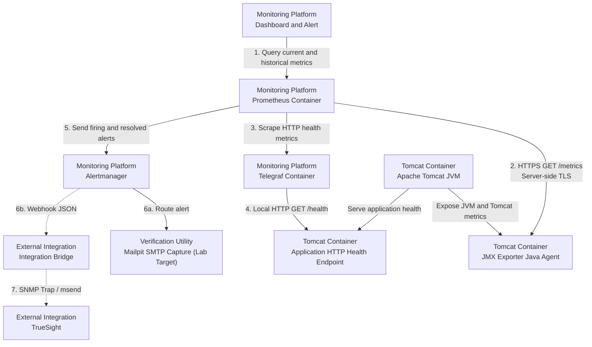
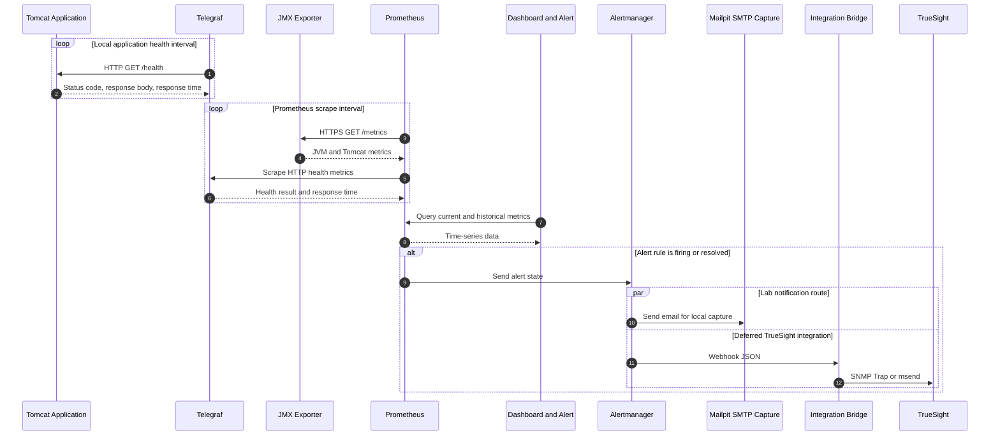

# Architecture

## Overview

Arsitektur Tomcat Monitoring menempatkan JMX Exporter sebagai Java Agent di
dalam JVM Tomcat. Prometheus berjalan sebagai container terpisah di dalam
monitoring stack project dan mengambil metrics melalui endpoint HTTPS. Telegraf
memeriksa HTTP health endpoint aplikasi melalui container network yang sama
dengan Tomcat. Mailpit lokal menjadi persistent lab-only email capture target
tanpa external delivery. TrueSight berada di luar deployment boundary project
sebagai future event-management integration dan tidak tersedia pada lab saat
ini.

## Deployment Topology

Nomor pada diagram menunjukkan hubungan komunikasi, bukan urutan startup
container. Nama lokasi ditulis langsung pada setiap komponen agar arah
komunikasi tidak bergantung pada posisi atau batas subgraph. Prometheus dan
Telegraf menjalankan pemeriksaan secara berkala sesuai interval yang akan
ditetapkan.

## Monitoring Flow

Sequence diagram menegaskan bahwa Prometheus dan Telegraf menggunakan model
pull. Telegraf memulai HTTP health check terhadap aplikasi, sedangkan Prometheus
melakukan scrape terhadap JMX Exporter dan Telegraf.

## Architecture Components

| Component | Responsibility |
| --- | --- |
| Tomcat Container | Menjalankan application runtime dan JVM yang dimonitor |
| JMX Exporter | Membaca MBean secara lokal dan menyajikan Prometheus metrics |
| Prometheus | Melakukan scrape, menyimpan time-series, dan mengevaluasi alert rules |
| Telegraf | Memeriksa HTTP status, response time, timeout, dan response body aplikasi |
| Dashboard and Alert | Melakukan query ke Prometheus serta menampilkan metrics dan status alert |
| Alertmanager | Mengelompokkan, melakukan deduplication, dan meneruskan alert |
| Mailpit | Menangkap email firing dan resolved pada persistent lab-only topology tanpa external delivery |
| Integration Bridge | Mengubah webhook menjadi event yang diterima TrueSight |

## Security Controls

- Remote JMX tidak diaktifkan atau diekspos melalui jaringan.
- JMX Exporter menyajikan endpoint metrics menggunakan server-side TLS.
- Prometheus memverifikasi sertifikat JMX Exporter menggunakan Certificate
  Authority yang dipercaya.
- JMX Exporter tidak meminta client certificate dari Prometheus.
- Endpoint metrics hanya menerima koneksi dari network source Prometheus yang
  diizinkan.
- Telegraf hanya memeriksa HTTP health endpoint melalui container network lokal
  yang diizinkan.
- Certificate, private key, dan trust material dipasang sebagai read-only
  secret dan tidak disimpan di dalam image atau repository.

## Current Status

Deployment topology belum diverifikasi melalui implementasi end-to-end.
Persistent lab Prometheus telah memverifikasi strict HTTPS scrape terhadap JMX
Exporter dan mempertahankan named data volume selama controlled replacement.
Persistent Telegraf memeriksa lab-only Tomcat JSP health endpoint melalui
container network; Prometheus menerima application-health metrics melalui
internal target `telegraf:9273`. Application dan metrics ports tidak
dipublikasikan pada host, sedangkan dashboard Prometheus lab tersedia melalui
host port `9090`.

Tiga application-health alert rules telah diimplementasikan, dimuat pada
persistent Prometheus, dan lulus `promtool`, synthetic rule-unit test, serta
isolated firing/resolved verification. Application failed, missing metric, dan
Telegraf scrape unavailable terbukti menjadi state yang terpisah. Production
application semantics, actual Integration Bridge, TrueSight integration, serta
external end-to-end notification flow belum diverifikasi.

Alertmanager runtime dimiliki repository generik terpisah, sedangkan
configuration, routing, validation, Prometheus delivery, dan orchestration
tetap dimiliki `tomcat-monitoring`. Lab contract menggunakan internal
`alertmanager:9093`, stable alert labels, grouping baseline, dan active
`send_resolved: true` email receiver menuju Mailpit lokal. Generic runtime
source telah dibentuk dengan upstream pin
`v0.34.0`; local image build, Alertmanager dan `amtool` version, serta official
non-root contract telah diverifikasi. Non-secret routing configuration dan
Prometheus API v2 reference telah diimplementasikan dan lulus `amtool` serta
`promtool`. Historical webhook receiver menangkap payload firing dan resolved
dengan lima stable group labels. Active Mailpit receiver kemudian menangkap
email firing dan resolved dengan sender serta recipient synthetic pada
2026-08-27. Pada 2026-08-28, persistent Prometheus mengirim real
`TelegrafHealthScrapeUnavailable` firing/resolved state ke persistent
Alertmanager dan Mailpit menangkap kedua matching email. Prometheus serta
Alertmanager kembali ready setelah controlled replacement dan restart;
Telegraf, JMX scrape, rules, dan health metric juga pulih ke baseline. Actual
Integration Bridge dan external flow belum diimplementasikan atau
diverifikasi.

## Alert Notification Presentation Contract

Internal Prometheus alert identity tetap stabil selama firing/resolved
lifecycle untuk menjaga grouping, deduplication, dan correlation. Email
operator menerjemahkan lifecycle tersebut menjadi `normal`, `warning`, atau
`critical` tanpa mengubah source labels.

| Internal State | Operator Severity | Visual |
| --- | --- | --- |
| Resolved | `normal` | Green |
| Firing dengan rule severity warning | `warning` | Orange |
| Firing dengan rule severity critical | `critical` | Red |

Subject wajib mengikuti format Enterprise SRE `[<RESOLVED|CRITICAL|WARNING>]
[LAB] Tomcat Service: <presentation-alert-name> (Instance: <instance>)`.
Sebagai contoh, internal `TelegrafHealthScrapeUnavailable` ditampilkan dengan
nama yang sama saat critical, tetapi menjadi `TelegrafHealthScrapeAvailable` saat
normal / recovery.

Body mengadopsi format Modern SRE & Incident Operations yang terstruktur dalam
beberapa bagian:

1. **Header Banner**: Menampilkan level status, judul layanan, dan badge
   `LAB Environment`.
2. **Alert / Recovery Summary**: Kotak ringkasan insiden atau pemulihan dengan
   aksen warna status.
3. **Technical Details**: Grid key-value rapi untuk `Alert Name`, `Service / Check`,
   `Target Instance`, `Severity`, dan `Status` (`FIRING / ACTIVE` atau
   `RESOLVED / HEALTHY`).
4. **Impact & Recommended Actions**: Informasi dampak operasional dan langkah
   penanganan/diagnosis cepat bagi operator on-call.
5. **Footer Metadata**: Keterangan notifikasi otomatis platform tanpa link
   internal yang tidak dapat diakses.

Source contract menetapkan Telegraf scrape unavailable sebagai critical karena
monitoring target mati dan application-health state tidak dapat ditentukan.
Seluruh application-health rules menyediakan stable `service` dan `check` labels
agar email tidak memiliki field kosong. Disposable template rendering dan
Prometheus config/rule tests telah lulus. Contract dipromosikan ke persistent
runtime dan real scrape-down/recovery cycle menghasilkan matching
critical/resolved email enterprise baru. Project owner menerima exact
Enterprise SRE visual evidence pada 2026-08-28 setelah critical dan resolved
rendering diperiksa melalui Mailpit.

Project owner sempat menetapkan direct Gmail email sebagai next lab
notification path, kemudian menggantinya dengan Mailpit lokal pada 2026-08-27
agar email capture tidak memerlukan Google credential atau external delivery.
Mailpit menjadi persistent lab-only verification utility dan tidak menggantikan
future notification-channel architecture. Direct-upstream exception,
immutable `v1.31.0` pin, no-volume storage boundary, loopback-only API, dan
exact persistent resources telah diterima. SMTP tetap internal pada
`mailpit:1025`; message history bukan source of truth dan host-reboot recovery
belum diklaim.
