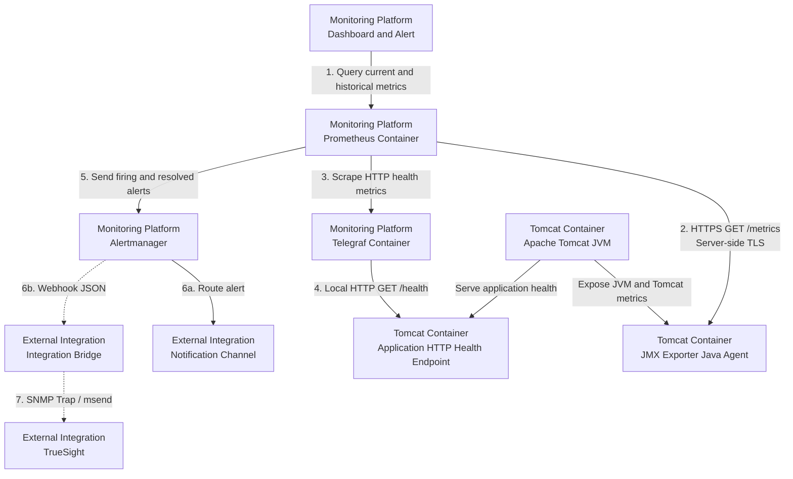
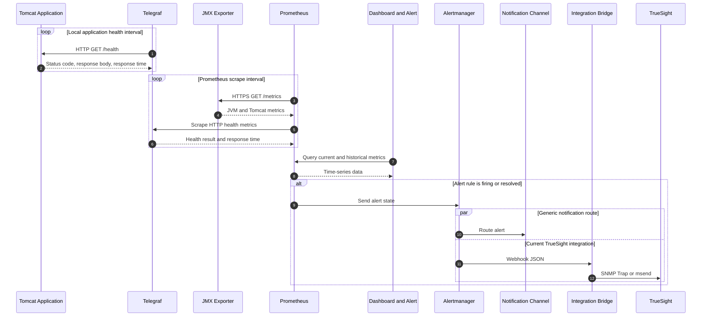

# Architecture

## Overview

Arsitektur Tomcat Monitoring menempatkan JMX Exporter sebagai Java Agent di
dalam JVM Tomcat. Prometheus berjalan sebagai container terpisah di dalam
monitoring stack project dan mengambil metrics melalui endpoint HTTPS. Telegraf
memeriksa HTTP health endpoint aplikasi melalui container network yang sama
dengan Tomcat. TrueSight berada di luar deployment boundary project sebagai
event management integration.

## Deployment Topology

Nomor pada diagram menunjukkan hubungan komunikasi, bukan urutan startup
container. Nama lokasi ditulis langsung pada setiap komponen agar arah
komunikasi tidak bergantung pada posisi atau batas subgraph. Prometheus dan
Telegraf menjalankan pemeriksaan secara berkala sesuai interval yang akan
ditetapkan.

## Monitoring Flow

Sequence diagram menegaskan bahwa Prometheus dan Telegraf menggunakan model
pull. Telegraf memulai HTTP health check terhadap aplikasi, sedangkan Prometheus
melakukan scrape terhadap JMX Exporter dan Telegraf.

## Architecture Components

| Component | Responsibility |
| --- | --- |
| Tomcat Container | Menjalankan application runtime dan JVM yang dimonitor |
| JMX Exporter | Membaca MBean secara lokal dan menyajikan Prometheus metrics |
| Prometheus | Melakukan scrape, menyimpan time-series, dan mengevaluasi alert rules |
| Telegraf | Memeriksa HTTP status, response time, timeout, dan response body aplikasi |
| Dashboard and Alert | Melakukan query ke Prometheus serta menampilkan metrics dan status alert |
| Alertmanager | Mengelompokkan, melakukan deduplication, dan meneruskan alert |
| Integration Bridge | Mengubah webhook menjadi event yang diterima TrueSight |

## Security Controls

- Remote JMX tidak diaktifkan atau diekspos melalui jaringan.
- JMX Exporter menyajikan endpoint metrics menggunakan server-side TLS.
- Prometheus memverifikasi sertifikat JMX Exporter menggunakan Certificate
  Authority yang dipercaya.
- JMX Exporter tidak meminta client certificate dari Prometheus.
- Endpoint metrics hanya menerima koneksi dari network source Prometheus yang
  diizinkan.
- Telegraf hanya memeriksa HTTP health endpoint melalui container network lokal
  yang diizinkan.
- Certificate, private key, dan trust material dipasang sebagai read-only
  secret dan tidak disimpan di dalam image atau repository.

## Current Status

Deployment topology belum diverifikasi melalui implementasi end-to-end.
Persistent lab Prometheus telah memverifikasi strict HTTPS scrape terhadap JMX
Exporter dan mempertahankan named data volume selama controlled replacement.
Persistent Telegraf memeriksa lab-only Tomcat JSP health endpoint melalui
container network; Prometheus menerima application-health metrics melalui
internal target `telegraf:9273`. Application dan metrics ports tidak
dipublikasikan pada host, sedangkan dashboard Prometheus lab tersedia melalui
host port `9090`.

Tiga application-health alert rules telah diimplementasikan, dimuat pada
persistent Prometheus, dan lulus `promtool`, synthetic rule-unit test, serta
isolated firing/resolved verification. Application failed, missing metric, dan
Telegraf scrape unavailable terbukti menjadi state yang terpisah. Production
application semantics, persistent Alertmanager, receiver behavior, TrueSight
integration, serta end-to-end notification flow belum diverifikasi.

Alertmanager runtime akan dimiliki repository generik terpisah, sedangkan
configuration, routing, validation, Prometheus delivery, dan orchestration
tetap dimiliki `tomcat-monitoring`. Lab contract menggunakan internal
`alertmanager:9093`, stable alert labels, grouping baseline, dan webhook
`send_resolved: true` menuju Integration Bridge dengan endpoint dari runtime
secret file. Generic runtime source telah dibentuk dengan upstream pin
`v0.34.0`; local image build, Alertmanager dan `amtool` version, serta official
non-root contract telah diverifikasi. Non-secret routing configuration dan
Prometheus API v2 reference telah diimplementasikan dan lulus `amtool` serta
`promtool`. Receiver behavior, persistent runtime, dan external flow belum
diimplementasikan atau diverifikasi.
