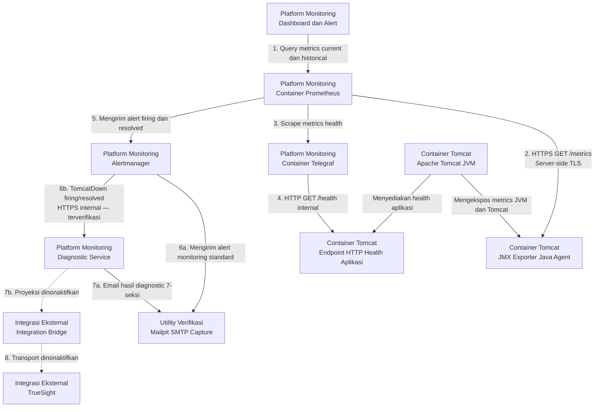
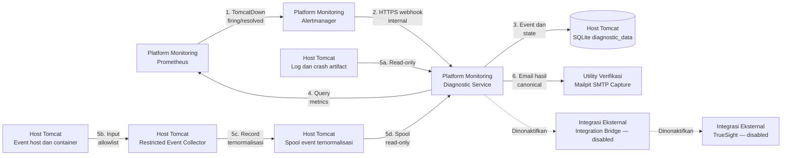
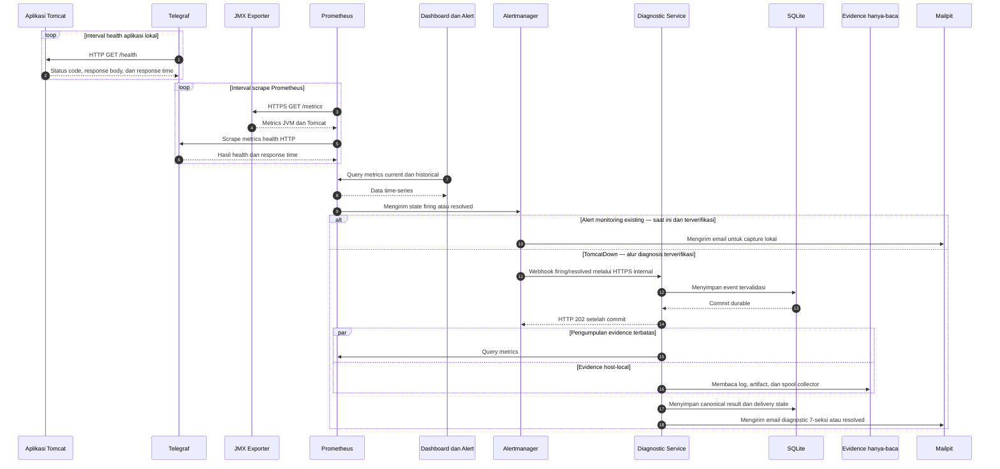

# Architecture

## Overview

Arsitektur Tomcat Monitoring menempatkan JMX Exporter sebagai Java Agent di
dalam JVM Tomcat. Prometheus berjalan sebagai container terpisah di dalam
monitoring stack project dan mengambil metrics melalui endpoint HTTPS. Telegraf
memeriksa HTTP health endpoint aplikasi melalui container network yang sama
dengan Tomcat. Mailpit lokal menjadi persistent lab-only email capture target
tanpa external delivery. TrueSight berada di luar deployment boundary project
sebagai future event-management integration dan tidak tersedia pada lab saat
ini.

Diagnostic MVP menyediakan kapabilitas diagnosis deterministik otomatis untuk
alur `TomcatDown`. Seluruh komponen Diagnostic Service, Restricted Event Collector,
volume persisten SQLite (`diagnostic_data`), bind-mount spool/log hanya-baca, pohon
keputusan `TD-01` s/d `TD-08`, Declarative Rulepack Engine (`TD-09`), alur pengayaan AI,
dan pengiriman laporan diagnosis terstruktur ke Mailpit telah diimplementasikan
100% dan terverifikasi secara live pada lingkungan persisten `devops-lab`.

## Deployment Topology

### A. Topology Utama

Nomor pada diagram menunjukkan hubungan komunikasi, bukan urutan startup
container. Garis penuh menunjukkan alur persistent lab yang sudah diverifikasi;
garis putus-putus menunjukkan target external integration (Integration Bridge dan
TrueSight) yang saat ini dinonaktifkan. Topology utama menempatkan Diagnostic
Service setelah Alertmanager untuk memproses alert `TomcatDown`.

### B. Detail Alur Diagnostic

Seluruh alur pada topology detail telah diimplementasikan dan terverifikasi secara
live pada lingkungan persisten `devops-lab`. Satu Diagnostic Service dan satu local
state volume (`diagnostic_data`) beroperasi per host Tomcat. Target `TomcatDown`
masuk ke diagnostic routing, sedangkan application-health dan high-heap alert tetap
berada pada monitoring routing Alertmanager standard.

## Monitoring and Diagnostic Flow

Sequence diagram menegaskan bahwa Prometheus dan Telegraf menggunakan model
pull. Telegraf memulai HTTP health check terhadap aplikasi, sedangkan Prometheus
melakukan scrape terhadap JMX Exporter dan Telegraf. Cabang Diagnostic Service
menunjukkan alur asinkron di mana webhook mengembalikan HTTP `202 Accepted`
hanya setelah event berhasil di-commit secara durable ke SQLite, dilanjutkan
dengan pemrosesan worker, evaluasi rule engine, persistensi canonical result,
dan pengiriman laporan ke Mailpit.

## Architecture Components

| Component | Responsibility |
| --- | --- |
| Tomcat Container | Menjalankan application runtime dan JVM yang dimonitor |
| JMX Exporter | Membaca MBean secara lokal dan menyajikan Prometheus metrics |
| Prometheus | Melakukan scrape, menyimpan time-series, dan mengevaluasi alert rules |
| Telegraf | Memeriksa HTTP status, response time, timeout, dan response body aplikasi |
| Dashboard and Alert | Melakukan query ke Prometheus serta menampilkan metrics dan status alert |
| Alertmanager | Mengelompokkan, melakukan deduplication, dan meneruskan alert |
| Mailpit | Menangkap email firing, diagnostic report, dan resolved pada topology persistent lab |
| Diagnostic Service | Menerima alert `TomcatDown`, memvalidasi skema payload, mengumpulkan evidence terbatas, mengevaluasi rule engine 18 cabang (TD-01..TD-18), mengelompokkan kategori domain, menghasilkan canonical result, dan bertindak sebagai otoritas tunggal pengirim notifikasi insiden (TM-ADR-0016); beroperasi murni sebagai read-only advisory engine tanpa wewenang auto-remediation (TM-ADR-0014); image `0.1.4` terverifikasi live di `devops-lab` |
| SQLite | Menyimpan event secara durable sebelum membalas HTTP 202 (TM-ADR-0015), menyimpan incident, deduplication, canonical result, custom rules (dengan kolom category), dan delivery state lokal pada volume persisten `diagnostic_data` (TM-ADR-0009) |
| Restricted Event Collector | Mengumpulkan event host dan status container yang telah dinormalisasi ke spool terbatas (`/tmp/diagnostic-spool`) dengan penulisan atomik `.tmp` -> `.json` (TM-ADR-0008) |
| Integration Bridge | Mengubah webhook menjadi event yang diterima TrueSight (dinonaktifkan pada lab; TM-ADR-0012) |

## Failure Domain & Rule Categorization Taxonomy

Untuk mempermudah manajemen aturan deklaratif dan mempercepat eskalasi insiden ke tim spesialis terkait, platform menerapkan taksonomi **8 Kategori Domain Kegagalan (*Failure Domains*)**:

| Kategori Domain (*Category Enum*) | Definisi & Cakupan Kegagalan | Pola & Gejala Tipikal (*Typical Patterns*) | Tim Eskalasi / Triage Target |
| :--- | :--- | :--- | :--- |
| **`jvm_memory`** | Kegagalan alokasi memori internal JVM, class metadata, atau batas garbage collector. | `OutOfMemoryError: Java heap space`, `Metaspace`, `GC overhead limit exceeded`, `Direct buffer memory`. | Tim Backend / Java Developer |
| **`concurrency_threading`** | Kejenuhan worker thread pool Tomcat, thread starvation, atau kondisi saling kunci (*deadlock*). | `RejectedExecutionException: Thread pool is exhausted`, `Java-level deadlock`, thread saturation. | Tim Backend / Platform Engineer |
| **`database_persistence`** | Kegagalan konektivitas, exhaustion connection pool database, timeout query, atau deadlock database. | `CannotGetJdbcConnectionException`, `HikariPool timeout`, `SQLTimeoutException`, connection leak. | Tim DBA / Database Administrator |
| **`network_integration`** | Kegagalan jabat tangan TLS/SSL, timeout komunikasi microservice upstream, atau DNS/socket failure. | `SSLHandshakeException`, `SocketTimeoutException: Read timed out`, `ConnectException: Connection refused`. | Tim Network / Cloud Infrastructure |
| **`application_lifecycle`** | Kegagalan startup container, deployment WAR, inisialisasi context aplikasi, atau runtime servlet error. | `LifecycleException: Failed to start component`, `BeanCreationException`, `ClassNotFoundException`. | Tim Application Developer |
| **`storage_os_limits`** | Batasan resource OS host, exhaustion file descriptor / process limit (ulimit), atau kapasitas disk. | `Too many open files`, `No space left on device`, `Read-only file system`, exit code container tanpa dump. | Tim Sysadmin / Infrastructure |
| **`security_session`** | Kegagalan autentikasi eksternal, otorisasi, validasi token, replikasi sesi cluster, atau filter crash. | `LDAPException`, `SessionReplicationException`, `InvalidTokenException`, CORS filter crash. | Tim Security / IAM & Middleware |
| **`general`** | Kondisi cross-domain, telemetri anomali saling bertentangan, atau klasifikasi *fallback* yang belum terpetakan. | `Contradicting state`, `Undetermined evidence`, pola kegagalan baru yang memerlukan analisis AI. | SRE / Incident Commander |

## Security Controls

- Remote JMX tidak diaktifkan atau diekspos melalui jaringan.
- JMX Exporter menyajikan endpoint metrics menggunakan server-side TLS.
- Prometheus memverifikasi sertifikat JMX Exporter menggunakan Certificate
  Authority yang dipercaya.
- JMX Exporter tidak meminta client certificate dari Prometheus.
- Endpoint metrics hanya menerima koneksi dari network source Prometheus yang
  diizinkan.
- Telegraf hanya memeriksa HTTP health endpoint melalui container network lokal
  yang diizinkan.
- Certificate, private key, dan trust material dipasang sebagai read-only
  secret dan tidak disimpan di dalam image atau repository.
- Target webhook Diagnostic Service menggunakan strict TLS, bearer
  authentication, dedicated internal network, dan tidak memublikasikan host
  port.
- Identity target berasal dari local allowlist; payload webhook tidak boleh
  memilih path, command, container, atau evidence source.
- Diagnostic Service tidak memiliki akses ke broad Podman socket, host
  namespace, arbitrary command, runtime control, atau arbitrary path.
- Tomcat evidence mounts dan normalized collector spool hanya dapat dibaca oleh
  Diagnostic Service (`:ro,z`). Secret serta TLS material tetap berada di non-Git storage
  dan dipasang read-only.
- Penambahan aturan deklaratif (`POST /api/v1/rules`) dilindungi oleh **5-Layer Ingestion Guard** (Auth, Schema, Collision, Size Limit 64 KiB, Safety Guard) dan immutabilitas *append-only* (penolakan mutasi `PUT`/`DELETE` dengan HTTP 405).
- Diterapkan kebijakan **Zero Automatic Remediation** ([TM-ADR-0014](../../../adr/tomcat-monitoring/adr-records/TM-ADR-0014.md)): Diagnostic Service beroperasi murni sebagai *read-only advisory engine* tanpa wewenang eksekusi perbaikan aktif, melindungi runtime dari ancaman eskalasi privilege dan risiko *flapping loop*.
- Ingestion webhook menerapkan pola **Durable Acceptance** ([TM-ADR-0015](../../../adr/tomcat-monitoring/adr-records/TM-ADR-0015.md)): respons HTTP `202 Accepted` hanya dikirim setelah transaksi penulisan event berhasil di-commit secara persisten ke SQLite.
- Diagnostic Service bertindak sebagai **Otoritas Tunggal Notifikasi Insiden** ([TM-ADR-0016](../../../adr/tomcat-monitoring/adr-records/TM-ADR-0016.md)) untuk siklus hidup `TomcatDown`, menghilangkan duplikasi dan inkonsistensi (*split alerting*).
- Seluruh arsitektur pilot dipagari oleh strategi **Vertical Slice MVP** ([TM-ADR-0017](../../../adr/tomcat-monitoring/adr-records/TM-ADR-0017.md)), mengisolasi pembuktian nilai (*Proof of Value*) pada alert `TomcatDown` sebelum memperluas sistem ke skala enterprise.

## Related Architecture Decisions

| ADR | Decision Summary |
| --- | --- |
| [TM-ADR-0001](../../../adr/tomcat-monitoring/adr-records/TM-ADR-0001.md) | Menggunakan embedded JMX instrumentation dan containerized monitoring stack. |
| [TM-ADR-0002](../../../adr/tomcat-monitoring/adr-records/TM-ADR-0002.md) | Memisahkan image runtime generik dari konfigurasi integrasi project. |
| [TM-ADR-0003](../../../adr/tomcat-monitoring/adr-records/TM-ADR-0003.md) | Menyimpan material TLS persistent lab di luar Git dan image. |
| [TM-ADR-0004](../../../adr/tomcat-monitoring/adr-records/TM-ADR-0004.md) | Memisahkan application failure dari kehilangan signal monitoring. |
| [TM-ADR-0005](../../../adr/tomcat-monitoring/adr-records/TM-ADR-0005.md) | Menggunakan Mailpit sebagai target verifikasi notifikasi persistent lab. |
| [TM-ADR-0006](../../../adr/tomcat-monitoring/adr-records/TM-ADR-0006.md) | Menggunakan deterministic multi-source evidence. |
| [TM-ADR-0007](../../../adr/tomcat-monitoring/adr-records/TM-ADR-0007.md) | Memperlakukan `TomcatDown` sebagai composite trigger. |
| [TM-ADR-0008](../../../adr/tomcat-monitoring/adr-records/TM-ADR-0008.md) | Membatasi host evidence melalui normalized collector spool. |
| [TM-ADR-0009](../../../adr/tomcat-monitoring/adr-records/TM-ADR-0009.md) | Menggunakan SQLite untuk local diagnostic state. |
| [TM-ADR-0010](../../../adr/tomcat-monitoring/adr-records/TM-ADR-0010.md) | Menempatkan satu bounded service per Tomcat host. |
| [TM-ADR-0011](../../../adr/tomcat-monitoring/adr-records/TM-ADR-0011.md) | Menetapkan confidence melalui per-rule decision table. |
| [TM-ADR-0012](../../../adr/tomcat-monitoring/adr-records/TM-ADR-0012.md) | Menjaga Integration Bridge dan TrueSight disabled serta terpisah. |
| [TM-ADR-0013](../../../adr/tomcat-monitoring/adr-records/TM-ADR-0013.md) | Menggunakan Node.js 24 ESM dan built-in SQLite terisolasi untuk Diagnostic Service. |
| [TM-ADR-0014](../../../adr/tomcat-monitoring/adr-records/TM-ADR-0014.md) | Menerapkan kebijakan Zero Automatic Remediation sebagai keputusan arsitektur tingkat tinggi. |
| [TM-ADR-0015](../../../adr/tomcat-monitoring/adr-records/TM-ADR-0015.md) | Menerapkan pola asynchronous ingestion dengan durable SQLite acceptance sebelum HTTP 202. |
| [TM-ADR-0016](../../../adr/tomcat-monitoring/adr-records/TM-ADR-0016.md) | Menetapkan Diagnostic Service sebagai otoritas tunggal pengiriman notifikasi siklus insiden. |
| [TM-ADR-0017](../../../adr/tomcat-monitoring/adr-records/TM-ADR-0017.md) | Mengadopsi strategi Vertical Slice Minimum Viable Product (MVP) untuk Diagnostic Pilot. |

## Current Status

Deployment topology dan alur monitoring end-to-end telah diimplementasikan dan
terverifikasi secara penuh pada lingkungan persisten `devops-lab`. Prometheus
mengambil metrics via strict HTTPS scrape terhadap JMX Exporter dan mempertahankan
volume TSDB `prometheus_data`. Telegraf memeriksa HTTP health endpoint aplikasi
dan Prometheus membaca series `telegraf-health`.

Alertmanager mengelola deduplikasi dan routing alert secara persisten. Rule
`TomcatDown` diteruskan melalui HTTPS internal ke Diagnostic Service (`0.1.3`).
Diagnostic Service memproses webhook secara asinkron, membaca metrik Prometheus,
spool `/tmp/diagnostic-spool`, dan log Tomcat `/tmp/tomcat-logs` secara read-only,
mengevaluasi pohon keputusan `TD-01` s/d `TD-09`, menyimpan riwayat audit ke
SQLite `diagnostic_data`, dan mengirimkan laporan diagnosis 7-seksi ke Mailpit.
Siklus pemulihan (*resolved*) memicu korelasi insiden otomatis dan mengirimkan
notifikasi pemulihan.

Kapabilitas *Declarative Rulepack Engine* dan *AI Enrichment Workflow* telah
terbukti live (TN-018 & TN-019), memungkinkan penambahan aturan diagnosis baru
secara hot-loaded tanpa restart container. Integration Bridge dan TrueSight
tetap dinonaktifkan sebagai future enterprise target.

## Alert Notification Presentation Contract

Internal Prometheus alert identity tetap stabil selama firing/resolved
lifecycle untuk menjaga grouping, deduplication, dan correlation. Email
operator menerjemahkan lifecycle tersebut menjadi `normal`, `warning`, atau
`critical` tanpa mengubah source labels.

| Internal State | Operator Severity | Visual |
| --- | --- | --- |
| Resolved | `normal` | Green |
| Firing dengan rule severity warning | `warning` | Orange |
| Firing dengan rule severity critical | `critical` | Red |

Subject wajib mengikuti format Enterprise SRE `[<RESOLVED|CRITICAL|WARNING>]
[LAB] Tomcat Service: <presentation-alert-name> (Instance: <instance>)`.
Sebagai contoh, internal `TelegrafHealthScrapeUnavailable` ditampilkan dengan
nama yang sama saat critical, tetapi menjadi `TelegrafHealthScrapeAvailable` saat
normal / recovery.

Body mengadopsi format Modern SRE & Incident Operations yang terstruktur dalam
beberapa bagian:

1. **Header Banner**: Menampilkan level status, judul layanan, dan badge
   `LAB Environment`.
2. **Alert / Recovery Summary**: Kotak ringkasan insiden atau pemulihan dengan
   aksen warna status.
3. **Technical Details**: Grid key-value rapi untuk `Alert Name`, `Service / Check`,
   `Target Instance`, `Severity`, dan `Status` (`FIRING / ACTIVE` atau
   `RESOLVED / HEALTHY`).
4. **Impact & Recommended Actions**: Informasi dampak operasional dan langkah
   penanganan/diagnosis cepat bagi operator on-call.
5. **Footer Metadata**: Keterangan notifikasi otomatis platform tanpa link
   internal yang tidak dapat diakses.

Source contract menetapkan Telegraf scrape unavailable sebagai critical karena
monitoring target mati dan application-health state tidak dapat ditentukan.
Seluruh application-health rules menyediakan stable `service` dan `check` labels
agar email tidak memiliki field kosong. Disposable template rendering dan
Prometheus config/rule tests telah lulus. Contract dipromosikan ke persistent
runtime dan real scrape-down/recovery cycle menghasilkan matching
critical/resolved email enterprise baru. Project owner menerima exact
Enterprise SRE visual evidence pada 2026-08-28 setelah critical dan resolved
rendering diperiksa melalui Mailpit.

Project owner sempat menetapkan direct Gmail email sebagai next lab
notification path, kemudian menggantinya dengan Mailpit lokal pada 2026-08-27
agar email capture tidak memerlukan Google credential atau external delivery.
Mailpit menjadi persistent lab-only verification utility dan tidak menggantikan
future notification-channel architecture. Direct-upstream exception,
immutable `v1.31.0` pin, no-volume storage boundary, loopback-only API, dan
exact persistent resources telah diterima. SMTP tetap internal pada
`mailpit:1025`; message history bukan source of truth dan host-reboot recovery
belum diklaim.
