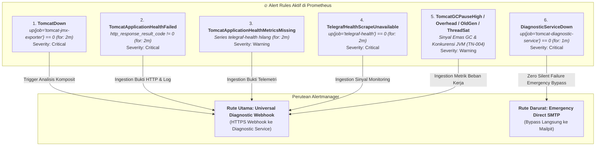

# Operational Scenarios and System Status Report

## 📋 Executive Summary

Laporan ini menyajikan status operasional komprehensif dari platform **Tomcat Monitoring & Autonomous Diagnostics** pada lingkungan persisten `devops-lab`. Dokumen ini merangkum seluruh komponen aktif, konfigurasi alert rules di Prometheus, taksonomi perutean insiden (*Diagnostic vs. Non-Diagnostic*), serta detail 6 skenario operasional yang telah terverifikasi secara *live*.

---

## 🏛️ 1. Runtime Components Status (`devops-lab`)

Seluruh komponen berjalan di atas **Rootless Podman**, terhubung pada dedicated container network `devops-lab`, dan disupervisi oleh systemd user service `podman-restart.service` dengan kebijakan auto-healing berbatas `--restart=on-failure:5` ([TM-ADR-0021](../../../adr/tomcat-monitoring/adr-records/TM-ADR-0021.md)):

| Komponen Container | Base Image / Versi | Port & Interface | Tanggung Jawab Utama | Status Runtime |
| :--- | :--- | :--- | :--- | :---: |
| **`tomcat-jmx-exporter`** | `localhost/tomcat-jmx-exporter:1.0.0` | `https://:9404/metrics` `http://:8080/health` | * Menjalankan Tomcat 9 JVM + Java Agent JMX Exporter. * Menyajikan metrik internal JVM & Tomcat via server-side TLS. * Menyajikan endpoint aplikasi untuk health probe. | 🟢 **Running (`up=1`)** |
| **`telegraf`** | `docker.io/library/telegraf:1.30.0` | `http://:9273/metrics` | * Melakukan active polling HTTP health probe ke Tomcat `:8080/health`. * Mengevaluasi HTTP status `200` dan JSON body `{"status":"UP"}`. * Menyajikan metrik kesehatan aplikasi ke Prometheus. | 🟢 **Running (`up=1`)** |
| **`prometheus`** | `localhost/prometheus:v3.13.2` | `http://:9090` | * Scrape targets JMX (:9404), Telegraf (:9273), dan Diagnostic Service (:8443). * Evaluasi alert rules time-series secara periodik. * Mengirim state alert *firing / resolved* ke Alertmanager. | 🟢 **Running (`up=1`)** |
| **`alertmanager`** | `localhost/alertmanager:v0.34.0` | `http://:9093` | * Deduplikasi, grouping, dan routing alert (`group_wait: 10s`, `group_interval: 15s`). * Merutekan seluruh alert operasional Tomcat ke Diagnostic Service (Webhook HTTPS). * Direct emergency SMTP ke Mailpit saat Diagnostic Service down (TM-ADR-0020). | 🟢 **Running (`up=1`)** |
| **`diagnostic-service`** | `localhost/tomcat-diagnostic-service:0.1.5` | `https://:8443` | * **Autonomous Diagnostic Engine & Decision Authority**. * Multi-Domain Diagnostic Dispatcher (20 built-in branches: `TD`, `AH`, `GC`, `TH` & custom rules `TD-09`..`TD-18`). * Single worker queue (50 capacity), SQLite persisten (`diagnostic_data`). * Menerbitkan laporan investigasi 7-seksi via SMTP ke Mailpit. | 🟢 **Running (`up=1`)** |
| **`mailpit`** | `docker.io/axllent/mailpit:v1.31.0` | `http://:8025` (UI) `mailpit:1025` (SMTP) | * Target penangkap email notifikasi (alert standar & laporan diagnosis SRE). | 🟢 **Running (`up=1`)** |

---

## 🚨 2. Active Alert Rules Catalog

Prometheus mengevaluasi alert rules aktif pada berkas konfigurasi `application-health.yml` dan `jvm-workload-performance.yml`:

---

## 🔀 3. Incident & Scenario Classification Matrix

Sistem menegakkan prinsip **Universal Diagnostic Ingestion** ([TM-ADR-0016](../../../adr/tomcat-monitoring/adr-records/TM-ADR-0016.md)), di mana seluruh alert monitoring aplikasi dialirkan ke Diagnostic Service untuk standarisasi format laporan 7-seksi SRE:

| Kategori Skenario | Alert Rule Terkait | Karakteristik Masalah | Jalur Penanganan (*Handling Path*) | Alasan Desain Arsitektural |
| :--- | :--- | :--- | :--- | :--- |
| **Track 1: Universal Diagnostic Pipeline (Canonical Authority)** | `TomcatDown` `TomcatApplicationHealthFailed` `TomcatApplicationHealthMetricsMissing` `TelegrafHealthScrapeUnavailable` `TomcatGCPauseHigh` `TomcatThreadPoolSaturated` `TomcatGCOverheadHigh` `TomcatOldGenMemoryPressure` | Seluruh spektrum anomali ketersediaan runtime, degradasi performa JVM GC/Thread, dan kegagalan servlet aplikasi. | Alertmanager $\rightarrow$ Diagnostic Service $\rightarrow$ Multi-source Evidence $\rightarrow$ Evaluasi Aturan $\rightarrow$ Format Kanonikal 7-Seksi SRE. | Menegakkan otoritas tunggal notifikasi insiden (TM-ADR-0016) dan menjamin laporan investigasi yang konsisten bagi tim SRE tanpa email mentah Alertmanager. |
| **Track 2: Self-Monitoring Emergency Fallback** | `DiagnosticServiceDown` | Kegagalan pada engine diagnostik itu sendiri. | Alertmanager $\rightarrow$ Direct Emergency SMTP Bypass (Mailpit). | Menjamin prinsip **Zero Silent Failure** ([TM-ADR-0016](../../../adr/tomcat-monitoring/adr-records/TM-ADR-0016.md) / [TM-ADR-0020](../../../adr/tomcat-monitoring/adr-records/TM-ADR-0020.md)). Mencegah perutean sirkular ke service yang sedang mati. |
| **Track 3: Container Auto-Healing** | Transient crash / exit non-zero | Kegagalan proses transien (glitch / spike memori sesaat). | `systemd --user podman-restart.service` $\rightarrow$ restart otomatis (`--restart=on-failure:5`). | Menyembuhkan insiden transien tanpa intervensi manusia, tetapi membatasi restart (maks 5x) untuk mencegah *unbounded CrashLoop*. |

---

## 🔬 4. Detail Skenario Operasional Live

### 🔴 Skenario 1: Tomcat Runtime / Container Mati (`TomcatDown`)
* **Pemicu:** Proses Tomcat mati, container crash, OOMKilled oleh kernel Linux, fatal JVM crash (`hs_err`), port bind conflict, atau shutdown bersih.
* **Deteksi:** Prometheus mendeteksi target JMX Exporter tidak merespons (`up{job="tomcat-jmx-exporter"} == 0` selama 2 menit).
* **Alur Eksekusi:**
  1. Prometheus mengirim alert `TomcatDown` ke Alertmanager.
  2. Alertmanager mengirimkan webhook HTTPS ke `https://diagnostic-service:8443/api/v1/alerts/alertmanager`.
  3. Diagnostic Service menyimpan event secara persisten ke SQLite dan mengembalikan `HTTP 202 Accepted` ([TM-ADR-0015](../../../adr/tomcat-monitoring/adr-records/TM-ADR-0015.md)).
  4. Worker mengambil antrean, mengumpulkan evidence terbatas (`catalina.out`, spool collector Podman, Prometheus metrics).
  5. Evaluasi pohon keputusan 18 cabang (`TD-01` s/d `TD-18`) dan pengelompokan ke salah satu dari 8 Failure Domain.
  6. Mengirimkan **Laporan Investigasi Diagnostik Terstruktur 7-Seksi** ke Mailpit.
  7. Saat Tomcat pulih, mengirimkan notifikasi pemulihan (*RESOLVED*) otomatis.

### 🟠 Skenario 2: HTTP Application Health Check Gagal (`TomcatApplicationHealthFailed`)
* **Pemicu:** Aplikasi Tomcat mengalami servlet error, internal context crash, mengembalikan HTTP `500`/`503`, body bukan `{"status":"UP"}`, atau response timeout $> 5\text{s}$, sementara JVM Tomcat masih berjalan normal.
* **Deteksi:** Telegraf probe gagal (`http_response_result_code != 0` selama 2 menit).
* **Alur Eksekusi:**
  1. Prometheus mendeteksi kegagalan health check dan mengirimkan alert ke Alertmanager.
  2. Alertmanager meneruskan webhook HTTPS ke Diagnostic Service (TM-ADR-0016).
  3. Diagnostic Service mengumpulkan bukti respon Telegraf dan cuplikan log `catalina.out`, lalu menerbitkan laporan investigasi 7-seksi ke Mailpit.
  4. Saat aplikasi kembali normal (HTTP `200 OK` `{"status":"UP"}`), Diagnostic Service mengirimkan email pemulihan *RESOLVED*.

### 🟡 Skenario 3: Kehilangan Sinyal Monitoring Telegraf (`TelegrafHealthScrapeUnavailable` / `MetricsMissing`)
* **Pemicu:** Container Telegraf mati, konfigurasi network terputus, atau plugin Telegraf tidak menghasilkan metrik.
* **Deteksi:** Prometheus mendeteksi target Telegraf tidak dapat di-scrape (`up{job="telegraf-health"} == 0` selama 2 menit).
* **Alur Eksekusi:**
  1. Prometheus mengirimkan alert `TelegrafHealthScrapeUnavailable` ke Alertmanager.
  2. Alertmanager meneruskan webhook ke Diagnostic Service.
  3. Diagnostic Service menerbitkan laporan diagnostik bahwa **sinyal observabilitas kesehatan aplikasi terputus** (membedakan antara "aplikasi rusak" vs "alat monitor yang mati" sesuai [TM-ADR-0004](../../../adr/tomcat-monitoring/adr-records/TM-ADR-0004.md)).

### 🚨 Skenario 4: Diagnostic Service Mati / Self-Monitoring Outage (`DiagnosticServiceDown`)
* **Pemicu:** Container Diagnostic Service mati, crash, atau SQLite terkunci.
* **Deteksi:** Prometheus mendeteksi endpoint `/health` Diagnostic Service mati (`up{job="tomcat-diagnostic-service"} == 0` selama 1 menit).
* **Alur Eksekusi (*Zero Silent Failure*):**
  * Alertmanager mengeksekusi **Direct Emergency Email** ke Mailpit untuk memberi tahu operator bahwa engine diagnosis otomatis sedang tidak aktif ([TM-ADR-0016](../../../adr/tomcat-monitoring/adr-records/TM-ADR-0016.md) / [TM-ADR-0020](../../../adr/tomcat-monitoring/adr-records/TM-ADR-0020.md)).

### 🛡️ Skenario 5: Auto-Healing Kontainer dari Transient Crash
* **Pemicu:** Glitch transien (misal kill sinyal acak atau lonjakan memori sementara).
* **Alur Eksekusi:**
  * `systemd --user podman-restart.service` otomatis me-restart kontainer (`--restart=on-failure:5`) hingga maksimal 5 kali tanpa intervensi manusia.
  * Jika kegagalan bersifat permanen (misal kerusakan berkas/storage), container akan berhenti di restart ke-5 untuk mencegah pemborosan CPU / *unbounded CrashLoop*.

### 🧠 Skenario 6: Safe Hot-Reloading Aturan Diagnosis Baru (AI / SRE)
* **Pemicu:** SRE atau AI meng-ingest rulepack baru via `POST /api/v1/rules`.
* **Alur Eksekusi:**
  * Dipagari oleh **5-Layer Ingestion Defense** (Auth, Schema, Collision, Size Limit 64 KiB, Immutability Guard).
  * Aturan langsung aktif secara *zero-downtime* tanpa perlu restart container.

---

### ⚡ Skenario 7: Degradasi Performa Memori & Garbage Collection JVM (`TomcatGCPauseHigh` / `TomcatGCOverheadHigh` / `TomcatOldGenMemoryPressure`)
* **Pemicu:** JVM mengalami jeda Stop-The-World ekstrem ($> 1.5\text{s}$), waktu CPU terbuang untuk GC ($> 15\%$), atau retensi memori Tenured/Old Gen tetap tinggi ($> 90\%$) secara persisten selama 10 menit (indikasi kebocoran memori).
* **Deteksi:** Prometheus mengevaluasi aturan di `jvm-workload-performance.yml` ([TM-ADR-0022](../../../adr/tomcat-monitoring/adr-records/TM-ADR-0022.md)).
* **Alur Eksekusi:**
  1. Prometheus mengirimkan alert JVM ke Alertmanager.
  2. Alertmanager merutekan alert secara universal ke Diagnostic Service (TM-ADR-0016).
  3. Diagnostic Service melalui **Multi-Domain Diagnostic Dispatcher** ([TM-ADR-0023](../../../adr/tomcat-monitoring/adr-records/TM-ADR-0023.md)) merutekan event ke **JVM Memory & GC Engine** (Cabang `GC-01` s/d `GC-04`).
  4. Laporan investigasi 7-seksi SRE diterbitkan ke Mailpit dengan subjek spesifik `[WARNING] [LAB] Tomcat Service: <AlertName>` dan rekomendasi mitigasi memori/GC (misal: analisis heap dump, tuning parameter GC `-XX:+UseG1GC`, atau peningkatan kapasitas Xmx).
  5. Saat metrik GC/memori kembali normal, Diagnostic Service menerbitkan laporan pemulihan *RESOLVED*.

### 🚦 Skenario 8: Saturasi Konkurensi & Antrean Thread Pool (`TomcatThreadPoolSaturated`)
* **Pemicu:** Seluruh worker thread pada connector HTTP Tomcat (`http-nio-8080`) berada dalam kondisi sibuk 100% secara terus-menerus selama 5 menit, berisiko menyebabkan penolakan koneksi (*request starvation*).
* **Deteksi:** Rasio `tomcat_threads_busy_threads / tomcat_threads_current_threads >= 1.0` bertahan selama `5m`.
* **Alur Eksekusi:**
  1. Prometheus mengirim alert `TomcatThreadPoolSaturated` ke Alertmanager.
  2. Diagnostic Dispatcher merutekan event ke **Concurrency Saturation Engine** (Cabang `TH-01` s/d `TH-03`).
  3. Laporan diagnostik diterbitkan ke Mailpit dengan rekomendasi audit thread dump, identifikasi slow query/external dependency bottleneck, atau penyesuaian `maxThreads` pada `server.xml`.
  4. Saat beban koneksi mereda, notifikasi *RESOLVED* diterbitkan secara otomatis.

---

## 🌲 5. Matriks Lengkap Pohon Keputusan Multi-Domain (Decision Trees)

Sesuai kebijakan tata kelola **Zero Undecided Alerts** ([TM-ADR-0023](../../../adr/tomcat-monitoring/adr-records/TM-ADR-0023.md)), seluruh alert dipetakan ke pohon keputusan resmi berikut:

| Domain Insiden | Alert Rules | Branch ID | Klasifikasi & Confidence | Asesmen Diagnosis Utama | Rekomendasi Tindakan Operator (SOP) |
| :--- | :--- | :---: | :---: | :--- | :--- |
| **Runtime Availability** | `TomcatDown` | `TD-01` | `probable_cause` (Medium) | JMX Exporter / TLS scrape path gagal, proses Tomcat tetap berjalan | Periksa port 9404, validitas sertifikat TLS JMX, dan jaringan scraper. |
| | | `TD-02` | `confirmed_cause` (High) | Kontainer dimatikan paksa oleh Linux cgroup OOM Killer | Periksa log kernel `dmesg`, batas cgroup container, dan heap dump JVM. |
| | | `TD-03` | `confirmed_cause` (High) | JVM mengalami fatal crash tak terduga | Analisis berkas crash dump `hs_err_pid.log` di direktori kerja Tomcat. |
| | | `TD-04` | `confirmed_cause` (High) | Kegagalan startup akibat konflik port binding | Periksa port collision pada `server.xml` (port 8080/8443/8005). |
| | | `TD-05` | `confirmed_cause` (High) | Penghentian layanan terencana (*orderly shutdown*) | Konfirmasi apakah pemeliharaan atau deploy berkala sedang berlangsung. |
| | | `TD-06` | `undetermined` (null) | Kontainer keluar dengan status tidak diketahui | Periksa exit code Podman dan log konsol `catalina.out`. |
| | | `TD-07` | `possible_cause` (Medium) | Proses tidak responsif / mengalami freeze panjang | Periksa STW GC pause atau thread deadlock pada JVM. |
| | | `TD-08` | `undetermined` (null) | Bukti forensik tidak mencukupi / saling bertentangan | Lakukan inspeksi manual menyeluruh terhadap host dan kontainer. |
| **Application Health** | `TomcatApplicationHealthFailed` | `AH-01` | `confirmed_cause` (High) | Endpoint HTTP `/health` merespons status tidak sehat (HTTP 5xx) | Periksa log servlet aplikasi, connection pool database, dan status backend. |
| | | `AH-02` | `probable_cause` (Medium) | Endpoint HTTP `/health` mengalami timeout (> 5 detik) | Analisis latensi I/O backend dan thread contention pada servlet. |
| | `TomcatApplicationHealthMetricsMissing` | `AH-03` | `probable_cause` (Medium) | Metrik `http_response` Telegraf hilang dari serial eksposur | Periksa konfigurasi input plugin Telegraf dan URL probe `/health`. |
| | `TelegrafHealthScrapeUnavailable` | `AH-04` | `confirmed_cause` (High) | Daemon kolektor Telegraf tidak dapat di-scrape / mati | Periksa container Telegraf dan jaringan internal `devops-lab`. |
| | | `AH-05` | `undetermined` (null) | Status kesehatan aplikasi tidak dapat ditentukan | Lakukan verifikasi curl manual ke endpoint `:8080/health`. |
| **JVM Memory & GC** | `TomcatGCPauseHigh` | `GC-01` | `confirmed_cause` (High) | Jeda Stop-The-World GC ekstrem (> 1.5s) menyebabkan freeze | Tuning parameter GC JVM (misal: `-XX:MaxGCPauseMillis=200`, `-XX:+UseG1GC`). |
| | `TomcatGCOverheadHigh` | `GC-02` | `confirmed_cause` (High) | CPU Thrashing: > 15% waktu komputasi habis untuk Garbage Collection | Alokasikan heap `-Xmx` lebih besar atau reduksi laju alokasi objek pendek. |
| | `TomcatOldGenMemoryPressure` | `GC-03` | `probable_cause` (High) | Retensi memori Old Generation > 90% persisten (Indikasi Memory Leak) | Lakukan capture heap dump (`jmap`) dan profiling memori untuk mencari leak. |
| | | `GC-04` | `undetermined` (null) | Sinyal telemetri GC/memori tidak konklusif | Analisis log GC interaktif (`-Xlog:gc*`). |
| **Concurrency Saturation** | `TomcatThreadPoolSaturated` | `TH-01` | `confirmed_cause` (High) | Thread pool HTTP Connector 100% jenuh secara persisten (> 5m) | Naikkan `maxThreads` pada `server.xml` atau optimasi waktu eksekusi handler. |
| | | `TH-02` | `probable_cause` (Medium) | Antrean request penuh berisiko penolakan koneksi (*starvation*) | Periksa `acceptCount` connector dan bottleneck downstream. |
| | | `TH-03` | `undetermined` (null) | Sinyal konkurensi tidak konklusif | Lakukan thread dump (`jstack`) untuk mengidentifikasi thread locks. |
