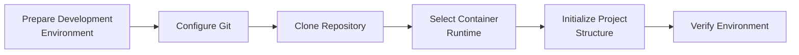

# Development Environment Setup

## Overview

Halaman ini menjelaskan kondisi dan kebutuhan setup development environment
Tomcat Monitoring. Setup mempersiapkan workstation, repository, dan tools yang
dibutuhkan sebelum implementasi dimulai.

## Setup at a Glance

| Activity | Purpose | Status |
| --- | --- | --- |
| Prepare development environment | Menyiapkan Linux workstation | Available |
| Configure source control | Menyiapkan Git dan koneksi repository | Completed |
| Clone project repository | Membentuk working directory lokal | Completed |
| Select container runtime | Menetapkan runtime untuk development dan validation | Completed |
| Initialize project structure | Membuat struktur awal source project | Not started |
| Verify environment | Memastikan project dapat dijalankan dan diuji | Not started |

## Setup Workflow



## Prepare Development Environment

Development environment menggunakan Linux workstation. Software minimum yang
telah tersedia dan yang masih perlu ditetapkan dicatat berikut ini.

| Component | Project Usage | Status |
| --- | --- | --- |
| Linux workstation | Development environment | Available |
| Git | Version control | Available |
| Gitea | Source repository | Available |
| Rootless Podman `4.9.3` | Menjalankan dan menguji container | Available |
| Configuration validation tools | Memvalidasi configuration artifacts | Not determined |

## Initialize Repository

Repository `tomcat-monitoring` telah dibuat di Gitea dan di-clone ke lokasi
berikut:

```text
/home/eddywiyatno/git/tomcat-monitoring
```

Kondisi repository saat ini:

```text
Branch       : main
Local commit : none
Remote       : origin configured
Project file : none
```

Struktur project belum dibuat. Inisialisasi struktur akan dilakukan sebagai
aktivitas engineering tersendiri setelah requirements dan keputusan teknis
yang diperlukan tersedia.

Podman telah diverifikasi menggunakan temporary Tomcat container. Container
tersebut bukan target runtime project dan akan dibuat ulang melalui proses
provisioning yang direncanakan.

## Verify Environment

Setup dinyatakan selesai setelah kriteria berikut terpenuhi:

- Repository dapat diakses dari development environment.
- Container runtime yang dipilih tersedia dan dapat dijalankan.
- Struktur project telah dibuat pada repository.
- Konfigurasi dapat divalidasi menggunakan command yang terdokumentasi.
- Local test dapat menjalankan komponen dalam scope tanpa menyimpan secret pada
  repository.

Saat ini akses repository dan container runtime telah diverifikasi. Struktur
project dan validation workflow belum tersedia sehingga setup belum dinyatakan
completed.

## Setup Output

| Artifact | Description | Status |
| --- | --- | --- |
| Development working directory | Clone lokal repository `tomcat-monitoring` | Available |
| Container runtime | Rootless Podman `4.9.3` | Available |
| Project structure | Struktur source dan konfigurasi | Not started |
| Validation workflow | Command dan expected result untuk local validation | Not started |

## Related Documentation

- [Development](index.md)
- [Architecture](../architecture/index.md)
- [Infrastructure](../infrastructure/index.md)
- [CI/CD](../ci-cd/index.md)
- [Engineering Journal](../engineering-journal/index.md)
