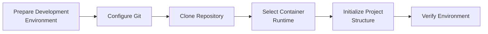

# Development Environment Setup

## Overview

Halaman ini menjelaskan kondisi dan kebutuhan setup development environment
Tomcat Monitoring. Setup mempersiapkan workstation, repository, dan tools yang
dibutuhkan sebelum implementasi dimulai.

## Setup at a Glance

| Activity | Purpose | Status |
| --- | --- | --- |
| Prepare development environment | Menyiapkan Linux workstation | Available |
| Configure source control | Menyiapkan Git dan koneksi repository | Completed |
| Clone project repository | Membentuk working directory lokal | Completed |
| Select container runtime | Menetapkan runtime untuk development dan validation | Completed |
| Initialize project structure | Membuat layout baseline non-secret dan validation contract | Completed locally; pending commit |
| Verify environment | Memastikan project dapat dijalankan dan diuji | Baseline static validation passed; component validation not started |

## Setup Workflow



## Prepare Development Environment

Development environment menggunakan Linux workstation. Software minimum yang
telah tersedia dan yang masih perlu ditetapkan dicatat berikut ini.

| Component | Project Usage | Status |
| --- | --- | --- |
| Linux workstation | Development environment | Available |
| Git | Version control | Available |
| Gitea | Source repository | Available |
| Rootless Podman `4.9.3` | Menjalankan dan menguji container | Available |
| Configuration validation tools | Memvalidasi configuration artifacts | Not determined |

## Initialize Repository

Repository `tomcat-monitoring` telah dibuat di Gitea dan di-clone ke lokasi
berikut:

```text
/home/eddywiyatno/git/tomcat-monitoring
```

Kondisi repository saat ini:

```text
Branch       : main
Local commit : `5cff160` (repository governance)
Remote       : origin configured
Project file : `AGENTS.md`; implementation source belum dibuat
```

Struktur implementation baseline telah dibuat secara lokal setelah
implementation plan disetujui. Repository memiliki `AGENTS.md`, documentation
contract di `config/` dan `validation/`, serta `scripts/validate.sh`. Baseline
ini belum memuat configuration monitoring executable dan masih menunggu commit
serta publication authorization.

Podman telah diverifikasi menggunakan temporary Tomcat container. Container
tersebut bukan target runtime project dan akan dibuat ulang melalui proses
provisioning yang direncanakan.

## Verify Environment

Setup dinyatakan selesai setelah kriteria berikut terpenuhi:

- Repository dapat diakses dari development environment.
- Container runtime yang dipilih tersedia dan dapat dijalankan.
- Struktur project telah dibuat pada repository.
- Konfigurasi dapat divalidasi menggunakan command yang terdokumentasi.
- Local test dapat menjalankan komponen dalam scope tanpa menyimpan secret pada
  repository.

Saat ini akses repository dan container runtime telah diverifikasi. Layout
baseline dan static validation tersedia secara lokal, tetapi component
configuration, component validation, dan local integration test belum ada;
setup belum dinyatakan completed.

## Setup Output

| Artifact | Description | Status |
| --- | --- | --- |
| Development working directory | Clone lokal repository `tomcat-monitoring` | Available |
| Container runtime | Rootless Podman `4.9.3` | Available |
| Project structure | Layout baseline non-secret dan documentation contract | Completed locally; pending commit |
| Validation workflow | `scripts/validate.sh` untuk baseline repository | Available; component validation not started |

## Related Documentation

- [Development](index.md)
- [Architecture](../architecture/index.md)
- [Infrastructure](../infrastructure/index.md)
- [CI/CD](../ci-cd/index.md)
- [Engineering Journal](../engineering-journal/index.md)
