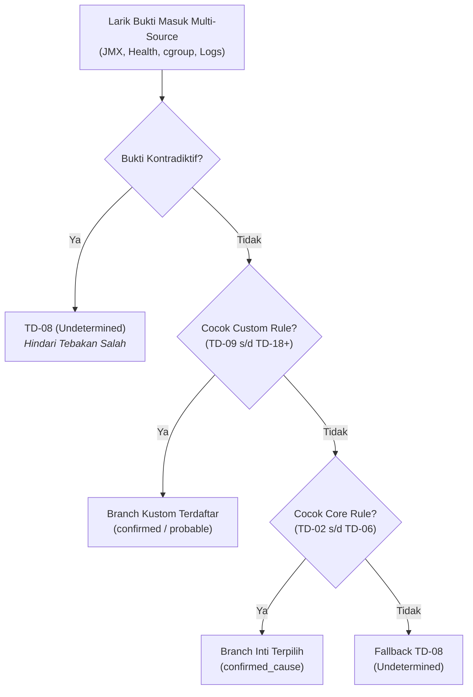

# Diagnostic Result and Confidence Contract

## 🔍 Overview

Satu canonical result version `1` menjadi sumber tunggal bagi persistence,
plain-text email, HTML email, dan future integration projection. Renderer tidak
boleh memperkuat atau menafsirkan ulang assessment.

## 📦 Required Structure

Canonical result memuat:

- `schema_version`, `diagnostic_id`, `rule_id`, dan `rule_version`;
- alert fingerprint, lifecycle status, start/end time, dan event key;
- canonical target identity dan runtime generation bila tersedia;
- processing status dan timing;
- normalized evidence, observations, unavailable sources, dan contradictions;
- primary assessment, contributing factors, dan recommended actions;
- delivery-independent result hash dan redaction metadata.

Processing status adalah `completed`, `partially_completed`, `failed`,
`unsupported`, `skipped`, atau `resolved_without_previous_firing`. Status ini
berbeda dari assessment classification.

## ⚖️ Assessment and Confidence Taxonomy

Decision Engine menggunakan taksonomi klasifikasi formal yang memisahkan **akar masalah (*root cause*)** dari **gejala sampingan (*symptoms*)** dan **faktor pendukung (*contributing factors*)**. Tingkat keyakinan (*confidence*) ditentukan secara deterministik oleh cabang pohon keputusan (*decision branch*) yang cocok, bukan dari skor probabilitas acak atau penjumlahan bukti generik.

| Klasifikasi (*Classification*) | Tingkat Keyakinan (*Allowed Confidence*) | Definisi & Kriteria Bukti (*Description & Evidence Criteria*) | Contoh Kasus Riil (*Typical Failure Pattern*) |
| :--- | :---: | :--- | :--- |
| **`confirmed_cause`** | `high` *(wajib)* | **Akar Masalah Pasti:** Bukti langsung (*direct evidence*) dan tak terbantahkan yang membuktikan peristiwa inilah yang mematikan atau melumpuhkan proses Tomcat. Membutuhkan korelasi temporal yang presisi. | • Linux kernel cgroup OOM Kill (`exit 137`) • Fatal JVM Crash (`hs_err_pid*.log` / SIGSEGV) • Port binding collision (`BindException`) • Java Thread Deadlock terdeteksi di dump |
| **`probable_cause`** | `medium` atau `high` | **Akar Masalah Berpeluang Tinggi:** Bukti kuat menunjukkan peristiwa ini sebagai pemicu utama kegagalan, meskipun ada kemungkinan dipicu oleh anomali upstream atau infrastruktur eksternal. | • Database pool exhausted (`CannotGetJdbcConnectionException`) • HikariCP connection timeout • TLS certificate verification failure |
| **`possible_cause`** | `low` atau `medium` | **Dugaan Akar Masalah:** Bukti menunjukkan adanya anomali signifikan yang berpotensi melumpuhkan layanan, tetapi proses JVM masih terdeteksi berjalan dan bukti langsung belum lengkap. | • Tomcat unresponsive disertai jeda panjang (*long pause/freeze*) dan HTTP health timeout • Lonjakan drastis error rate pada upstream gateway |
| **`contributing_factor`** | `low`, `medium`, atau `high` | **Faktor Kontributor:** Peristiwa atau anomali sekunder yang memperparah kegagalan sistem, tetapi bukan merupakan pemicu awal (*trigger* utama) insiden. | • Beban CPU host tinggi selama thread dump terjadi • Tingginya disk I/O latency saat memory swapping berlangsung |
| **`symptom`** | `low`, `medium`, atau `high` | **Gejala Turunan (*Domino Effect*):** Dampak hilir yang muncul akibat adanya akar masalah utama. Dicatat dalam larik bukti (*evidence array*) sebagai konteks forensik pelengkap. | • HTTP `/health` check timeout akibat thread pool telah habis • Prometheus scrape failed akibat port 9404 macet |
| **`not_supported`** | *None* (`null`) | **Target/Kondisi Tidak Didukung:** Telemetri berasal dari target yang tidak ada pada allowlist atau skenario di luar cakupan kontrak diagnostik. | • Alert diterima untuk target container di luar `targets.json` |
| **`undetermined`** | *None* (`null`) | **Penyebab Belum Diketahui:** Bukti log/metrik yang terkumpul tidak memadai, tidak cocok dengan pola manapun di katalog aturan, atau bukti telemetri saling bertentangan. | • Container mati tanpa exit code dan tanpa log error • Bukti status container saling kontradiktif (running vs exited) |

### 🧬 Logika Penanganan Multi-Error & Urutan Prioritas (*Precedence Rules*)

Dalam insiden riil, satu kegagalan sering kali memicu serangkaian error beruntun (*multi-error / cascading events*). Engine menerapkan aturan prioritas deterministik:

1. **Prioritas Bukti Primer:** Bukti log langsung (*fatal crash*, *cgroup OOM*, *deadlock*) selalu mengalahkan gejala turunan (*scrape timeout*).
2. **Kekebalan Negatif (*No Negative Proof*):** Ketiadaan bukti (*missing evidence*) tidak pernah dianggap sebagai bukti bahwa kondisi tersebut tidak terjadi.
3. **Pencatatan Konteks Menyeluruh:** Walaupun hanya satu akar masalah yang dipilih sebagai `primary assessment`, seluruh gejala sekunder tetap dipertahankan di dalam blok `evidence` dan `observations` pada Canonical Result untuk audit SRE.

## 🔁 Determinism and Material Change

Normalized evidence yang sama dengan `rule_version` yang sama harus
menghasilkan canonical result yang sama. Result hash mengecualikan volatile
delivery timestamp.

Perubahan disebut material hanya jika classification, confidence, processing
status, primary assessment, atau evidence availability berubah. Pilot
mengizinkan maksimum satu material-update notification per incident.

## 🔐 Safety

Result hanya menyimpan bounded sanitized excerpts. Credential, token, cookie,
request body, complete crash report, dan unbounded stack trace dilarang.
Recommended action bersifat instruksi operator dan tidak pernah dieksekusi.

## 📌 Status

**Implemented & Verified in Runtime (`tomcat-diagnostic-service` v0.1.5).**
Mekanisme validasi skema canonical result, arsitektur Multi-Domain Diagnostic Dispatcher dengan 20 decision branches built-in (`TD`, `AH`, `GC`, `TH` sesuai [TM-ADR-0023](../../../adr/tomcat-monitoring/adr-records/TM-ADR-0023.md)), evaluasi aturan dinamis terkurasi (`TD-09` s/d `TD-18`), serta pertahanan ingest 5-layer telah teruji 100% pada lingkungan *DevOps Lab*.
