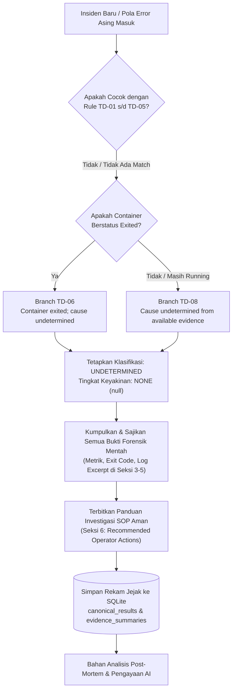

# Knowledge Base and AI Enrichment Architecture

## 🔍 Overview

Dokumen ini mendefinisikan arsitektur pengelolaan *Knowledge Base* (basis pengetahuan diagnostik) pada **Diagnostic Service**, mencakup struktur penyimpanan multi-lapisan, protokol penanganan insiden yang belum memiliki basis aturan (*unknown / unmapped issue*), serta mekanisme integrasi dan pengayaan basis pengetahuan secara terpadu memanfaatkan Artificial Intelligence (AI) eksternal secara aman (*AI-Augmented SRE/DevOps*).

---

## 🏛️ Arsitektur 5-Layer Knowledge Base

Knowledge base pada sistem ini tidak disimpan dalam satu file monolitik, melainkan dibagi ke dalam **5 lapisan (*layers*) fungsional** yang terisolasi dan memiliki tanggung jawab yang jelas:

```text
┌────────────────────────────────────────────────────────────────────────┐
│ Layer 1: Logic & Decision Engine (Code & Rule Specification)           │
│ • Lokasi: `src/domain/tomcat-down-engine.js`                          │
│ • Spesifikasi: `tomcat-down-rule-specification.md`                     │
│ • Isi: Logika pohon keputusan deterministik TD-01 s/d TD-08, pola      │
│   pencocokan bukti (evidence pattern), klasifikasi, & keyakinan.       │
├────────────────────────────────────────────────────────────────────────┤
│ Layer 2: Operational Playbook & Actions (Renderer & Runbook Catalog)   │
│ • Lokasi: `src/application/result-renderer.js` & `troubleshooting/`   │
│ • Isi: Rekomendasi tindakan mitigasi operator (SOP) per branch insiden.│
├────────────────────────────────────────────────────────────────────────┤
│ Layer 3: Target Topology & Mapping Catalog (Configuration Allowlist)   │
│ • Lokasi: `/run/tomcat-diagnostic/config/targets.json`                 │
│ • Isi: Metadata pemetaan identitas container, path spool, log, & health│
├────────────────────────────────────────────────────────────────────────┤
│ Layer 4: Persistent Incident History (SQLite Database)                 │
│ • Lokasi: `/var/lib/tomcat-diagnostic/diagnostic.db` (diagnostic_data) │
│ • Isi: Canonical results JSON, hash SHA-256, snapshot bukti mentah,   │
│   dan riwayat siklus firing/resolved untuk keperluan audit & postmortem│
├────────────────────────────────────────────────────────────────────────┤
│ Layer 5: Enterprise Governance & ADR (DevOps Handbook)                 │
│ • Lokasi: `devops-handbook/docs/projects/tomcat-monitoring/`           │
│ • Isi: Single source of truth untuk kontrak arsitektur & tata kelola.  │
└────────────────────────────────────────────────────────────────────────┘
```

---

## 🛡️ Protokol Penanganan Masalah Tanpa Knowledge Base (*Unknown Issue Protocol*)

Ketika terjadi kegagalan aplikasi atau runtime Tomcat yang **belum memiliki aturan spesifik (*unmapped failure pattern*)**, Diagnostic Service memberlakukan prinsip **"Deterministic Honesty" (Kejujuran Deterministik Tanpa Halusinasi)** melalui 5 langkah:



1. **Fallback Deterministik ke Branch TD-06 atau TD-08:**
   - Jika container terhenti tanpa bukti penyebab spesifik $\rightarrow$ **TD-06** (*Container exited; cause undetermined*).
   - Jika container masih berjalan atau bukti tidak mencukupi $\rightarrow$ **TD-08** (*Cause undetermined from available evidence*).
   - Jika ditemukan bukti yang saling bertentangan $\rightarrow$ **TD-08** (*Cause undetermined from contradicting evidence*).
2. **Penegasan Klasifikasi `UNDETERMINED`:**
   - Sistem secara eksplisit menetapkan klasifikasi `undetermined` dengan tingkat keyakinan `none` (`confidence: null`).
   - Sistem dilarang keras menebak akar masalah tanpa bukti langsung.
3. **Penyajian Bukti Forensik Mentah (*Evidence-First*):**
   - Seluruh data telemetri aktual (exit code, metrik scrape terakhir, status endpoint health, potongan log) tetap ditampilkan transparan di email 7-seksi guna memandu investigasi operator.
4. **Instruksi Mitigasi yang Aman (*Safe Action Guidelines*):**
   - Memberikan SOP investigasi manual standar untuk mencegah eksekusi tindakan berisiko secara membabi-buta.
5. **Pencatatan Persisten untuk *Continuous Improvement*:**
   - Insiden tercatat lengkap di SQLite sebagai kandidat utama untuk dianalisis pada sesi *post-mortem*.

---

## 🤖 Strategi Pengayaan Knowledge Base Berbasis AI Eksternal (*AI Enrichment Strategy*)

Untuk memperluas cakupan deteksi dan memperkaya basis pengetahuan secara berkelanjutan, sistem memanfaatkan **AI / LLM eksternal yang beroperasi di luar jalur kritis (*out-of-band / offline analysis*)**:

```mermaid
sequenceDiagram
    autonumber
    participant Runtime as Diagnostic Runtime (SQLite)
    participant SRE as Tim SRE / DevOps Operator
    participant AI as External AI / LLM Analyzer
    participant Codebase as Diagnostic Service Repository

    Note over Runtime: Terjadi insiden baru berstatus UNDETERMINED
    Runtime->>SRE: Laporan notifikasi & log insiden tersimpan di SQLite
    SRE->>AI: Input: Snapshot bukti, stack trace log, & histori insiden
    Note over AI: AI menganalisis akar masalah, pola error, & mitigasi
    AI-->>SRE: Output: Rekomendasi Rule Baru (Branch, Pattern, & SOP Actions)
    SRE->>Codebase: Review & Import Rule ke Knowledge Base
    Note over Codebase: Unit test & validation (npm test & validate.sh)
    Codebase->>Runtime: Deploy versi rilis baru (Automated Investigation Aktif)
```



### 1. Titik Pembaruan (*Update Touchpoints*) Saat Ini (Code-Level)

Hasil analisis AI eksternal diimpor ke dalam repositori [`tomcat-diagnostic-service`](file:///home/eddywiyatno/git/tomcat-diagnostic-service) melalui 2 berkas utama:

#### A. Logika Deteksi Masalah (`src/domain/tomcat-down-engine.js`)
Menambahkan branch baru (misal: `TD-09` untuk *Database Connection Pool Exhaustion* atau `TD-10` untuk *Garbage Collection Thrashing*):

```javascript
// Aturan Baru Hasil Rekomendasi AI: Deteksi DB Connection Pool Exhaustion
if (found(evidence, "orderly_shutdown", (value) => value?.excerpt?.includes("CannotGetJdbcConnectionException"))) {
  return result("TD-09", "Tomcat unresponsive: Database connection pool exhausted", "confirmed_cause", "high");
}
```

#### B. Rekomendasi Tindakan Operator (`src/application/result-renderer.js`)
Menambahkan instruksi SOP terstruktur pada fungsi `getRecommendedActions(result)`:

```javascript
case "TD-09":
  return [
    "Periksa utilisasi koneksi dan beban aktif pada server Database backend.",
    "Tinjau parameter maxTotal dan maxWaitMillis pada Resource DataSource (/conf/context.xml).",
    "Periksa stack trace thread dump untuk mendeteksi potensi connection leak pada aplikasi.",
    "Lakukan restart layanan Tomcat secara terkontrol setelah koneksi database stabil."
  ];
```

---

### 2. Roadmap Desain Masa Depan: Impor Deklaratif (`diagnostic-rules.json`)

Sebagai pengembangan ke depan, sistem dapat dilengkapi dengan *Rulepack Loader* deklaratif (`config/diagnostic-rules.json`) sehingga hasil keluaran AI dalam format JSON dapat langsung diimpor ke runtime tanpa perlu modifikasi kode JavaScript:

```json
[
  {
    "branch": "TD-09",
    "ruleName": "DatabaseConnectionPoolExhausted",
    "targetSource": "local_file",
    "pattern": "CannotGetJdbcConnectionException",
    "assessment": "Tomcat unresponsive: Database connection pool exhausted",
    "classification": "confirmed_cause",
    "confidence": "high",
    "recommendedActions": [
      "Periksa status dan kapasitas koneksi database backend.",
      "Tinjau parameter maxTotal pada DataSource Context Tomcat.",
      "Periksa thread dump untuk mendeteksi kebocoran koneksi database."
    ]
  }
]
```

---

## 📌 Kesimpulan & Standar Tata Kelola

1. **Pemisahan Peran:** AI eksternal berfungsi sebagai analis *post-mortem* dan perumus pola; Diagnostic Service bertindak sebagai eksekutor deterministik yang cepat, aman, dan tanpa halusinasi saat insiden terjadi secara *real-time*.
2. **Review Manusia (Human-in-the-Loop):** Setiap aturan baru hasil rekomendasi AI wajib melalui verifikasi insinyur DevOps/SRE dan pengujian unit (*test suite*) sebelum di-deploy ke lingkungan produksi.
3. **Auditability:** Setiap diagnosis yang diputuskan sistem dapat dilacak kembali ke spesifikasi aturan formal dan bukti snapshot historis di SQLite.
