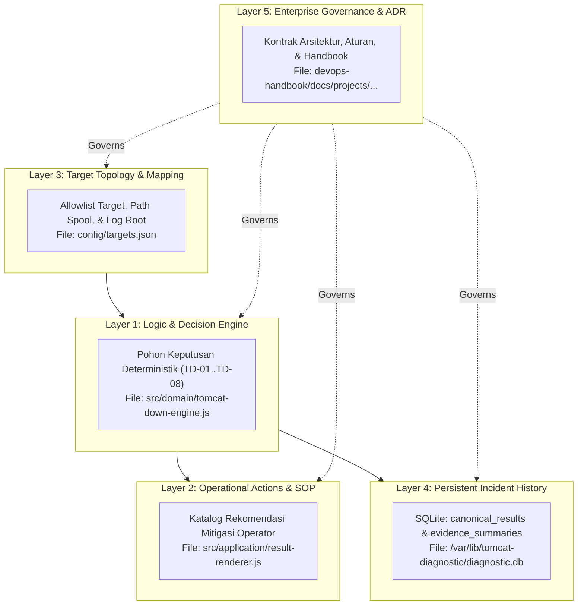
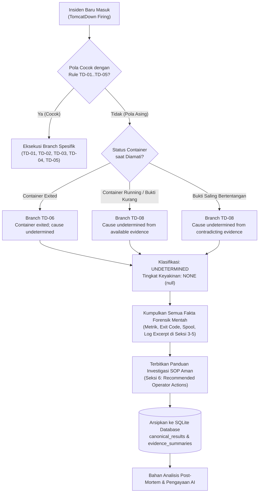
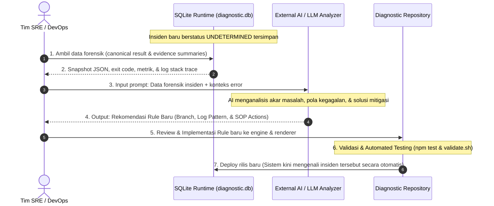

# Knowledge Base and AI Enrichment Architecture

## 🔍 Overview

Dokumen ini mendefinisikan arsitektur pengelolaan *Knowledge Base* (basis pengetahuan diagnostik) pada **Diagnostic Service**, mencakup struktur penyimpanan multi-lapisan, protokol penanganan insiden yang belum memiliki basis aturan (*unknown / unmapped issue*), serta mekanisme integrasi dan pengayaan basis pengetahuan secara terpadu memanfaatkan Artificial Intelligence (AI) eksternal secara aman (*AI-Augmented SRE/DevOps*).

---

## 🏛️ Arsitektur 5-Layer Knowledge Base

Knowledge base pada platform Tomcat Monitoring dibagi ke dalam **5 lapisan fungsional (*functional layers*)** yang terpisah untuk menjaga isolasi, keamanan, dan determinisme sistem:



### 📋 Matriks Komponen 5-Layer Knowledge Base

| Layer | Nama Lapisan | Lokasi Berkas / Sumber | Tanggung Jawab & Isi |
| :---: | :--- | :--- | :--- |
| **1** | **Logic & Decision Engine** | [`src/domain/tomcat-down-engine.js`](file:///home/eddywiyatno/git/tomcat-diagnostic-service/src/domain/tomcat-down-engine.js) | Logika pohon keputusan deterministik (TD-01 s/d TD-08), aturan pencocokan pola bukti (*evidence pattern*), penetapan klasifikasi insiden, dan penentuan tingkat keyakinan (*confidence*). |
| **2** | **Operational Actions & Runbook** | [`src/application/result-renderer.js`](file:///home/eddywiyatno/git/tomcat-diagnostic-service/src/application/result-renderer.js) & [`troubleshooting/`](file:///home/eddywiyatno/git/devops-handbook/docs/projects/tomcat-monitoring/troubleshooting/) | Katalog instruksi mitigasi dan panduan investigasi standar (SOP) bagi operator yang terikat pada masing-masing branch diagnosis. |
| **3** | **Target Topology & Mapping** | `/run/tomcat-diagnostic/config/targets.json` | Konfigurasi allowlist target yang memetakan identitas logis (`environment`, `host`, `tomcat_instance`) ke lokasi fisik partisi spool, direktori log, URL health check, dan crash dump. |
| **4** | **Persistent Incident History** | Database SQLite persisten (`diagnostic.db`) | Penyimpanan permanen seluruh *canonical result JSON*, hash SHA-256, snapshot bukti mentah, dan riwayat siklus insiden untuk keperluan audit dan analisis *post-mortem*. |
| **5** | **Enterprise Governance & ADR** | Repositori [`devops-handbook`](file:///home/eddywiyatno/git/devops-handbook) | *Single Source of Truth* (SSOT) yang memuat spesifikasi aturan formal, batas-batas keamanan (*security boundaries*), dan catatan keputusan arsitektur. |

---

## 🛡️ Protokol Penanganan Masalah Tanpa Knowledge Base (*Unknown Issue Protocol*)

Ketika terjadi insiden kegagalan yang **belum terpetakan dalam basis aturan (*unmapped failure pattern*)**, Diagnostic Service memberlakukan prinsip **"Deterministic Honesty" (Kejujuran Deterministik Tanpa Halusinasi)**:



### 📋 Matriks Penanganan Insiden Belum Terpetakan (*Unmapped Handling Matrix*)

| Skenario Insiden | Branch Terpilih | Hasil Diagnosis (*Assessment*) | Klasifikasi & Keyakinan | Tindakan Sistem & Rekomendasi Operator |
| :--- | :---: | :--- | :---: | :--- |
| **Container Mati Tanpa Bukti Spesifik** | `TD-06` | *Container exited; cause undetermined* | `undetermined`<br/>*(confidence: none)* | Sajikan exit code aktual (misal: 143/137) di Seksi 3; berikan rekomendasi SOP pemeriksaan log container dan start ulang layanan di Seksi 6. |
| **Container Hidup / Bukti Tidak Cukup** | `TD-08` | *Cause undetermined from available evidence* | `undetermined`<br/>*(confidence: none)* | Sajikan status ketersediaan sumber data di Seksi 5; instruksikan operator melakukan investigasi manual terhadap endpoint dan jaringan. |
| **Ditemukan Bukti Bertentangan** | `TD-08` | *Cause undetermined from contradicting evidence* | `undetermined`<br/>*(confidence: none)* | Tampilkan anomali kontradiksi bukti di Seksi 5; rekomendasikan verifikasi status container dan health probe secara langsung. |

---

## 🤖 Strategi Pengayaan Knowledge Base Berbasis AI Eksternal (*AI Enrichment Strategy*)

Untuk memperkaya basis pengetahuan secara berkelanjutan tanpa mengorbankan stabilitas dan keamanan runtime, integrasi AI dilakukan secara **di luar jalur kritis (*out-of-band / offline post-mortem*)**:



---

### 🛠️ Perbandingan Metode Pembaruan Knowledge Base

| Kategori | Metode Saat Ini (Code-Level Implementation) | Roadmap Masa Depan (Declarative Rulepack) |
| :--- | :--- | :--- |
| **Media Berkas** | [`src/domain/tomcat-down-engine.js`](file:///home/eddywiyatno/git/tomcat-diagnostic-service/src/domain/tomcat-down-engine.js)<br/>[`src/application/result-renderer.js`](file:///home/eddywiyatno/git/tomcat-diagnostic-service/src/application/result-renderer.js) | File konfigurasi terpisah:<br/>`/run/tomcat-diagnostic/config/diagnostic-rules.json` |
| **Format Masukan** | Kode JavaScript (fungsi deterministik). | File JSON terstruktur hasil *export* langsung dari AI. |
| **Workflow Update** | 1. Tambah branch logic (misal `TD-09`).<br/>2. Tambah SOP text di renderer.<br/>3. Jalankan unit test & rebuild image. | 1. Letakkan file JSON baru ke folder konfigurasi.<br/>2. Restart / reload container tanpa *rebuild image*. |
| **Keunggulan** | Validasi tipe data ketat, performa tinggi, dan teruji penuh melalui *unit test suite*. | Memungkinkan integrasi pipeline otomatis (*auto-ingestion*) hasil analisis AI tanpa *code changes*. |
| **Status** | **Aktif & Terverifikasi (Current Production Baseline).** | **Tahap Desain & Roadmap Integrasi.** |

---

### 📝 Contoh Format Impor Deklaratif (`diagnostic-rules.json`)

Berikut adalah struktur baku yang disiapkan untuk menerima hasil generasi AI secara langsung:

```json
[
  {
    "branch": "TD-09",
    "ruleName": "DatabaseConnectionPoolExhausted",
    "targetSource": "local_file",
    "pattern": "CannotGetJdbcConnectionException",
    "assessment": "Tomcat unresponsive: Database connection pool exhausted",
    "classification": "confirmed_cause",
    "confidence": "high",
    "recommendedActions": [
      "Periksa utilisasi koneksi dan beban aktif pada server Database PostgreSQL/MySQL backend.",
      "Tinjau parameter maxTotal dan maxWaitMillis pada Resource DataSource (/conf/context.xml).",
      "Periksa stack trace thread dump untuk mendeteksi potensi connection leak pada aplikasi.",
      "Lakukan restart layanan Tomcat secara terkontrol setelah koneksi database stabil."
    ]
  }
]
```

---

## 📌 Standar Tata Kelola dan Keamanan

1. **Deterministic Execution:** Runtime Diagnostic Service murni mengeksekusi logika pencocokan berbasis aturan; tidak ada *prompting* atau inferensi LLM langsung di jalur penanganan insiden *real-time*.
2. **Human-in-the-Loop Verification:** Setiap *rule* dan *action* yang dirumuskan oleh AI wajib ditinjau dan disetujui oleh insinyur DevOps/SRE sebelum diintegrasikan ke lingkungan produksi.
3. **Auditability & Traceability:** Setiap keputusan insiden selalu memiliki referensi silang ke *rule version*, *evidence hash*, dan data historis di SQLite.
