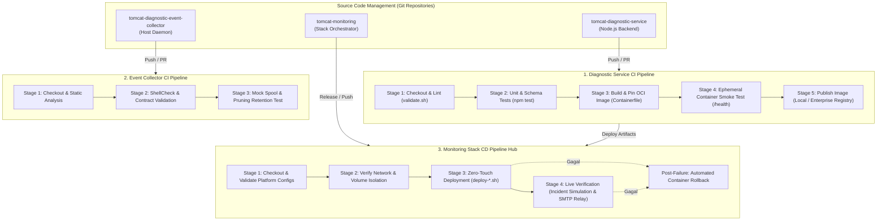
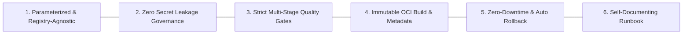
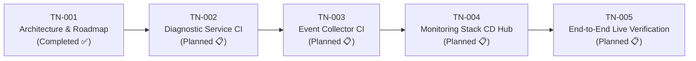

# TN-001 — Design Production-Ready Jenkins CI/CD Pipeline Architecture and Implementation Roadmap

| Field | Value |
| --- | --- |
| Status | Completed |
| Activity Type | Discovery, Assessment, and Architecture Design |
| Record Type | Live |
| Project | Tomcat Monitoring |
| Phase | Continuous Integration and Deployment |
| Activity Date | 2026-09-12 |
| Recorded Date | 2026-09-12 |
| Owner | Eddy Wiyatno |
| Working Mode | Read-only — documentation and architecture design |
| Authorization Status | Approved |
| Approved By | Eddy Wiyatno |
| Approval Date | 2026-09-12 |

## 🎯 Objective

Menetapkan fondasi dan spesifikasi arsitektur resmi **Continuous Integration and Continuous Deployment (CI/CD) Pipeline berbasis Jenkins** untuk seluruh ekosistem Tomcat Monitoring.

Tujuan utama Technical Note ini adalah:
1. **Architecture Baseline:** Merancang topologi pipeline CI/CD modular (*Decoupled Component CI + Orchestrated Stack CD Hub*) yang memisahkan siklus hidup pengembangan komponen mikro dari orkestrasi deployment stack multi-kontainer.
2. **Enterprise Production-Readiness:** Menegakkan 6 pilar kesiapan produksi (portabilitas registry, eliminasi kebocoran rahasia via Jenkins Credentials Store, gerbang kualitas bertingkat *fail-fast*, kemasan kontainer OCI yang *immutable*, *zero-downtime deployment* dengan *automated rollback*, serta tata kelola runbook SRE).
3. **Implementation Roadmap:** Menyusun peta jalan rekayasa bertahap (TN-002 s.d. TN-005) sebagai acuan pelaksanaan implementasi teknis yang aman, terukur, dan langsung siap diterapkan (*Plug-and-Play*) di lingkungan enterprise target.

---

## 🌍 Background

Platform Tomcat Monitoring telah berhasil menyelesaikan fase fondasi pemantauan runtime, integrasi platform observabilitas, penegakan siklus hidup spool daemon host ([TN-011](../monitoring-platform-integration/TN-011-implement-and-verify-spool-lifecycle-and-log-retention.md)), dan validasi pengiriman laporan investigasi 7-seksi SRE melalui *Enterprise SMTP Relay* terenkripsi STARTTLS ([TN-010](../monitoring-platform-integration/TN-010-implement-and-verify-enterprise-smtp-configuration-and-headers.md)).

Meskipun fungsionalitas sistem telah terbukti handal di runtime, proses pengujian kode, pembangunan kontainer, dan deployment stack multi-kontainer saat ini masih dijalankan secara manual melalui skrip shell ad-hoc. Untuk mengoperasikan platform ini pada skala produksi enterprise, diperlukan sistem otomasi pengiriman perangkat lunak (*Software Delivery Automation*) yang terstandarisasi melalui Jenkins Pipeline as Code.

Otomasi ini harus dirancang sejak awal agar memenuhi standar keamanan dan operabilitas enterprise:
- Menghindari keterikatan terhadap jalur direktori statis pada host (*Path Agnostic*).
- Menghilangkan penyimpanan rahasia (*credentials*) dalam repositori Git atau berkas konfigurasi statis.
- Memastikan setiap perubahan kode diverifikasi secara otomatis melalui serangkaian gerbang kualitas (*quality gates*) sebelum dideploy ke runtime produksi.

---

## 📚 Scope

| Kategori | Batasan Pekerjaan |
| :--- | :--- |
| **Pekerjaan yang Disetujui (*In-Scope*)** | • Analisis kebutuhan dan inventarisasi repositori komponen platform. • Penetapan topologi pipeline (*Decoupled Component CI + Orchestrated Stack CD Hub*). • Perumusan 6 Pilar Standar Kesiapan Produksi Enterprise. • Spesifikasi detail tahapan dan kontrak gerbang kualitas (*Quality Gates Specification*). • Penetapan tata kelola runtime: DooD (*Docker-out-of-Docker*) via Rootless Podman dan Dedicated Jenkins Agent. • Perancangan mekanisme *Zero-Downtime Deployment* dan *Automated Rollback*. • Penyusunan Peta Jalan Implementasi (TN-002 s.d. TN-005). |
| **Pekerjaan yang Dikecualikan (*Out-of-Scope*)** | • Penulisan berkas `Jenkinsfile` fisik pada repositori (dijadwalkan pada TN-002 s.d. TN-004). • Eksekusi build live dan pendaftaran job pada Jenkins Controller (dijadwalkan pada TN-005). • Modifikasi kode logika aplikasi atau skema database eksisting. |

---

## 🔍 Current Environment & Architectural Assessment

Evaluasi kondisi terkini komponen platform menunjukkan karakteristik multi-repositori yang membutuhkan strategi CI/CD terdesentralisasi:

| Komponen / Repositori | Karakteristik Layanan | Toolchain & Test Suite | Peran dalam CI/CD |
| :--- | :--- | :--- | :--- |
| **`tomcat-diagnostic-service`** | Layanan backend mikro (Node.js 24 ESM, SQLite, AJV, Nodemailer) | • Unit & component tests (`npm test` / 62 tests) • Schema validator (`scripts/validate.sh`) • OCI Buildah (`Containerfile`) | **Component CI:** Linting, Unit Testing, OCI Image Build & Tagging, Ephemeral Container Smoke Test. |
| **`tomcat-diagnostic-event-collector`** | Daemon pengawas event Podman host (Bash script & `systemd --user`) | • Baseline validator (`scripts/validate.sh`) • Spool lifecycle & pruning test (`test/test-collector.sh`) | **Component CI:** ShellCheck static analysis, syntax validation, dan mock spool retention test. |
| **`tomcat-monitoring`** | Orkestrator platform multi-kontainer (Prometheus, Alertmanager, Postfix, JMX Exporter) | • Platform validator (`scripts/validate.sh`) • Live test suite (`test-tomcatdown-live.sh`, `verify-postfix-relay.sh`) | **Stack CD Hub:** Integrasi network/volume, deployment multi-kontainer, live incident simulation, dan automated rollback. |
| **`jenkins-podman`** | Infrastruktur orkestrasi CI/CD controller | • Jenkins LTS • Rootless Podman runtime | **CI/CD Controller:** Mengelola job deklaratif, trigger webhook, dan credential store terisolasi. |
| **Dedicated Agent (`builder-01`)** | Runner eksekusi pipeline pada host runtime | • SSH Launcher • Rootless Podman UID 1000 | **Execution Runner:** Menjalankan build, container packaging, dan manipulasi volume runtime secara lokal. |

---

## 🏛️ Production-Ready Pipeline Architecture

Arsitektur CI/CD Tomcat Monitoring dirancang memadukan model **Component CI** terdistribusi dengan **Stack CD Hub** terpusat:

### Pemisahan Lapisan Tanggung Jawab (*Separation of Concerns*):
1. **Lapisan Komponen Mikro (*Component Layer*):** Memungkinkan pengembang melakukan iterasi fitur diagnostik secara mandiri dengan *feedback loop* instan (hitungan detik).
2. **Lapisan Artefak Kontainer (*Artifact Layer*):** Menjamin artefak rilis berstatus *immutable* (dibangun sekali dengan OCI metadata lengkap dan SHA-256 digest terpin).
3. **Lapisan Orkestrasi & Verifikasi (*Deployment & Verification Layer*):** Menjamin stabilitas lingkungan operasional dengan menguji integrasi multi-kontainer secara live sebelum rilis dinyatakan `SUCCESS`.

---

## ⚖️ 6 Pilar Standar Kesiapan Produksi Enterprise

Untuk memastikan seluruh skrip dan definisi pipeline langsung dapat digunakan (*Plug-and-Play*) pada infrastruktur kantor/enterprise target, arsitektur ini menerapkan 6 pilar utama:

### 1. Parameterized & Registry-Agnostic Portability
- Pipeline tidak mengunci dependensi pada nama host atau registry statis.
- Dilengkapi parameter deklaratif:
  - `REGISTRY_HOST`: Mendukung local runtime (`localhost`) maupun Enterprise Registry (Harbor, Nexus OSS, JFrog Artifactory, AWS ECR).
  - `DEPLOY_ENV`: Pilihan target deployment (`STAGING` / `PRODUCTION`).
  - `IMAGE_TAG`: Otomatis menyusun identitas rilis berformat `<VERSION>-b<BUILD_NUMBER>-<GIT_COMMIT_SHORT>`.

### 2. Zero Secret Leakage & Security Isolation Governance
- Dilarang menyimpan kata sandi SMTP SASL, token bearer, atau private key di repositori Git atau berkas konfigurasi teks datar.
- Seluruh rahasia dikelola terpusat pada **Jenkins Credentials Store** dan diinjeksi saat runtime pipeline menggunakan direktif `withCredentials`.
- Pipeline dieksekusi oleh user non-root (`eddywiyatno`) melalui Rootless Podman pada dedicated agent node (`builder-01`), menegakkan *Zero `/tmp` Policy* dan hak akses direktori ketat `0700`/`0400`.

### 3. Strict Multi-Stage Quality Gates
Pipeline menerapkan prinsip *fail-fast* melalui 4 gerbang pengujian bertingkat:
1. **Gate 1 — Static Analysis & Linting:** Memvalidasi konsistensi kontrak non-secret (`CONFIG`) dan sintaks shell script.
2. **Gate 2 — Automated Unit & Schema Tests:** Menjalankan unit tests Node.js (`npm test`) dan validasi schema JSON (AJV).
3. **Gate 3 — Ephemeral Smoke Test:** Menjalankan kontainer sementara untuk menguji respons endpoint `/health` dan `/metrics` sebelum deployment ke runtime aktif.
4. **Gate 4 — Live Verification Suite:** Menguji simulasi insiden live (`test-tomcatdown-live.sh`) dan transmisi email relay (`verify-postfix-relay.sh`).

### 4. Immutable OCI Packaging & Metadata Pinning
- Kontainer dibangun menggunakan runtime Podman/Buildah dengan OCI Image Specification.
- Metadata traceability disematkan langsung ke label image:
  - `org.opencontainers.image.title`: Nama proyek.
  - `org.opencontainers.image.version`: Versi semantik dari berkas `VERSION`.
  - `org.opencontainers.image.revision`: Git commit hash SHA-1 lengkap.
  - `org.opencontainers.image.created`: Timestamp build ISO-8601 UTC.
- Pengecekan SHA-256 digest base image lokal menjamin integritas rantai pasok kontainer (*Supply Chain Integrity*).

### 5. Atomic Zero-Downtime Deployment & Automated Rollback
- Skrip deployment (`deploy-*.sh`) menerapkan mekanisme *Atomic Container Replacement*: kontainer aktif yang sedang berjalan diubah namanya menjadi snapshot cadangan (`diagnostic-service-rollback-*`) sebelum kontainer versi baru diluncurkan.
- Apabila validasi pasca-deploy (*post-deploy healthcheck*) atau simulasi insiden live gagal, blok `post.failure` Jenkins otomatis memicu prosedur rollback untuk mengaktifkan kembali kontainer snapshot tanpa intervensi manual operator.

### 6. Self-Documenting Pipeline & SRE Runbook
- Seluruh definisi pipeline ditulis menggunakan **Declarative Pipeline v2** (`Jenkinsfile`) yang tersimpan di dalam repositori (*Pipeline as Code*).
- Setiap pipeline dilengkapi dokumentasi Technical Note, panduan registrasi Job pada Jenkins GUI langkah demi langkah, dan SOP penanganan kegagalan (*troubleshooting runbook*).

---

## 📋 Quality Gates & Stage Contracts Specification

### 1. Spesifikasi Pipeline CI Komponen (`tomcat-diagnostic-service`)

| Stage Name | Tujuan & Tindakan Eksekusi | Kriteria Keberhasilan (*Exit Criteria*) |
| :--- | :--- | :--- |
| **Stage 1: Checkout Source** | Mengambil kode sumber dari branch target Git. | Workspace bersih dan commit hash teridentifikasi. |
| **Stage 2: Static Lint & Validation** | Menjalankan `./scripts/validate.sh` untuk validasi shell syntax dan konsistensi parameter non-secret. | Tidak ada error sintaks dan berkas konfigurasi memenuhi schema. |
| **Stage 3: Automated Unit Testing** | Menjalankan rangkaian 62 unit/integration tests Node.js via container runtime. | 100% tests lulus (`pass 62, fail 0`) dalam waktu $< 2\text{ detik}$. |
| **Stage 4: OCI Image Build & Tagging** | Mengeksekusi `./scripts/build.sh` dan menyematkan tag rilis serta OCI labels. | Image kontainer terbentuk dengan SHA-256 digest valid. |
| **Stage 5: Ephemeral Smoke Test** | Meluncurkan container sementara dan memvalidasi endpoint `/health` serta `/metrics`. | HTTP 200 OK diterima dari health check endpoint. |
| **Stage 6: Publish Image (Optional)** | Mendorong image ke Enterprise Container Registry jika parameter `PUSH_IMAGE=true`. | Image tersedia pada remote registry target. |
| **Post Action: Workspace Cleanup** | Membersihkan direktori staging dan artefak sementara (`cleanWs`). | Workspace kembali bersih bebas residu. |

### 2. Spesifikasi Pipeline CI Komponen (`tomcat-diagnostic-event-collector`)

| Stage Name | Tujuan & Tindakan Eksekusi | Kriteria Keberhasilan (*Exit Criteria*) |
| :--- | :--- | :--- |
| **Stage 1: Checkout Source** | Mengambil kode sumber dari repositori event collector. | Workspace terinisialisasi. |
| **Stage 2: Static Validation** | Menjalankan `./scripts/validate.sh` dan static check terhadap skrip collector. | Skrip bash valid dan izin eksekusi terpenuhi. |
| **Stage 3: Spool & Pruning Test** | Menjalankan `test/test-collector.sh` untuk menguji pemangkasan berkas dan retensi spool. | Seluruh skenario pengujian siklus hidup spool lulus 100%. |

### 3. Spesifikasi Pipeline CD Orkestrasi Stack (`tomcat-monitoring`)

| Stage Name | Tujuan & Tindakan Eksekusi | Kriteria Keberhasilan (*Exit Criteria*) |
| :--- | :--- | :--- |
| **Stage 1: Platform Validation** | Menjalankan `./scripts/validate.sh` untuk memeriksa konfigurasi Prometheus, Alertmanager, dan Postfix. | Seluruh konfigurasi monitoring stack valid. |
| **Stage 2: Runtime Isolation Prep** | Memastikan network Podman `devops-lab` dan Named Volumes terpasang dengan izin `0700`. | Network dan volume persisten siap digunakan. |
| **Stage 3: Zero-Touch Deployment** | Menjalankan skrip `deploy-*.sh` untuk memperbarui layanan kontainer secara atomik. | Kontainer baru aktif dan berstatus `running`. |
| **Stage 4: Live Verification Suite** | Mengeksekusi `verify-postfix-relay.sh` dan `test-tomcatdown-live.sh`. | Simulasi insiden live berhasil memicu diagnosa otonom dan laporan 7-seksi diterima via relay. |
| **Post-Failure: Automated Rollback** | Memulihkan kontainer versi sebelumnya jika Stage 3 atau 4 mengalami kegagalan. | Layanan kembali normal menggunakan versi stabil sebelumnya. |

---

## 🗺️ Implementation Roadmap

Pelaksanaan implementasi pipeline CI/CD dibagi menjadi 4 Technical Notes (TN) terstruktur dalam fase ini:

| ID Dokumen | Judul Technical Note & Sasaran Rekayasa | Deliverables Utama |
| :--- | :--- | :--- |
| **TN-001** | **Design Production-Ready Jenkins CI/CD Pipeline Architecture and Implementation Roadmap** | Dokumen arsitektur resmi, standar 6 pilar produksi, spesifikasi quality gates, dan roadmap implementasi. *(Dokumen Ini - Selesai)* |
| **TN-002** | **Implement Production-Ready CI Pipeline for `tomcat-diagnostic-service`** | Declarative `Jenkinsfile`, parameterisasi registry, skrip build berversi, automated test runner, ephemeral smoke testing, dan verifikasi OCI image. |
| **TN-003** | **Implement CI Pipeline for `tomcat-diagnostic-event-collector`** | Declarative `Jenkinsfile`, static analysis, lint contract validation, dan mock event spool test. |
| **TN-004** | **Implement Stack Orchestration CD Pipeline for `tomcat-monitoring`** | Declarative `Jenkinsfile` orkestrasi stack, automated deployment, integrasi network `devops-lab`, dan automated rollback logic. |
| **TN-005** | **Execute and Verify End-to-End CI/CD Pipelines in Jenkins Controller** | Registrasi jobs di Jenkins Controller, pengujian build live (`SUCCESS`), pembuktian incident injection, dan konsolidasi dokumentasi buku petunjuk SRE di Handbook. |

---

## 🧾 Outcome

1. **Spesifikasi Arsitektur Ditetapkan:** Pola *Decoupled Component CI + Orchestrated Stack CD Hub* resmi menjadi arsitektur standar CI/CD Tomcat Monitoring.
2. **Standar Kesiapan Produksi Ditegakkan:** Dirumuskan 6 Pilar Standar Produksi Enterprise untuk menjamin seluruh kode dan pipeline bersifat *Plug-and-Play* (*Tinggal Pakai*) di lingkungan kantor target.
3. **Peta Jalan Terstruktur Disahkan:** Roadmap implementasi 4 tahap (**TN-002 s.d. TN-005**) telah didefinisikan secara jelas dengan deliverables dan kriteria keberhasilan yang terukur.

---

## 🎓 Lessons Learned

1. **Pentingnya Memisahkan CI Komponen dari CD Orkestrator:** Menggabungkan seluruh komponen ke satu pipeline monolitik memperlambat siklus pengembangan dan menyulitkan pelacakan kegagalan. Model decoupled memberikan fleksibilitas penuh untuk evolusi independen setiap microservice.
2. **Kesiapan Produksi Ditentukan Sejak Perancangan Awal:** Menambahkan parameterisasi registry, penegakan isolasi secret, dan mekanisme rollback otomatis sejak fase desain mencegah timbulnya *technical debt* saat kode dipindahkan dari lab ke server produksi enterprise.

---

## ⏭️ Next Steps

- Memulai pelaksanaan **TN-002 — Implement Production-Ready CI Pipeline for `tomcat-diagnostic-service`**.

---

## 🔗 Related Documentation

- [Monitoring Platform Integration Engineering Journal](../monitoring-platform-integration/index.md)
- [TN-010 — Implement and Verify Enterprise SMTP Configuration and Headers](../monitoring-platform-integration/TN-010-implement-and-verify-enterprise-smtp-configuration-and-headers.md)
- [TN-011 — Implement and Verify Host Spool Lifecycle and Runtime Log Retention Governance](../monitoring-platform-integration/TN-011-implement-and-verify-spool-lifecycle-and-log-retention.md)
- [Follow-up Tasks Backlog](../../follow-up-tasks.md)
- [Personal Site Continuous Integration Engineering Journal](../../../web-platform/personal-site/engineering-journal/continuous-integration/index.md)
- [PS-ADR-0007 — Use Pipeline as Code](../../../../adr/personal-site/adr-records/PS-ADR-0007.md)
- [PS-ADR-0008 — Adopt Stage-Based CI Pipeline](../../../../adr/personal-site/adr-records/PS-ADR-0008.md)
