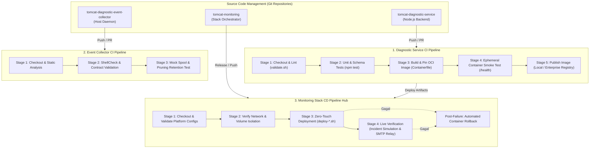
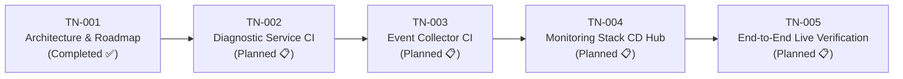

# TN-001 — Design Production-Ready Jenkins CI/CD Pipeline Architecture and Implementation Roadmap

| Field | Value |
| --- | --- |
| Status | Completed |
| Activity Type | Discovery and Assessment |
| Record Type | Live |
| Project | Tomcat Monitoring |
| Phase | Continuous Integration and Deployment |
| Activity Date | 2026-09-12 |
| Recorded Date | 2026-09-12 |
| Owner | Eddy Wiyatno |
| Working Mode | Read-only |
| Authorization Status | Approved |
| Approved By | Eddy Wiyatno |
| Approval Date | 2026-09-12 |

## 🎯 Objective

Menuntaskan backlog **`TASK-TM-019` (Perancangan Arsitektur Jenkins CI/CD Pipeline & Implementation Roadmap)** dengan merumuskan arsitektur resmi *Continuous Integration and Continuous Deployment* (CI/CD) berbasis Jenkins Pipeline as Code untuk seluruh ekosistem Tomcat Monitoring (`tomcat-diagnostic-service`, `tomcat-diagnostic-event-collector`, dan `tomcat-monitoring`), menetapkan standar kesiapan produksi enterprise (*production-ready*), serta menyusun peta jalan implementasi (*implementation roadmap*) bertahap (TN-002 s.d. TN-005).

**Target Utama & Kriteria Keberhasilan:**

1. **Decoupled Architecture:** Menetapkan batas tanggung jawab pemisahan antara Component CI pada repositori mikrokomponen dan Stack CD Hub pada repositori orkestrator platform.
2. **Production-Ready Baseline:** Membakukan 6 pilar standar kesiapan produksi enterprise mencakup portabilitas registry (*registry-agnostic*), tata kelola rahasia (*zero secret leakage*), isolasi keamanan non-root DooD Podman, gerbang kualitas bertingkat, automated rollback, dan runbook SRE.
3. **Stage Contracts & Quality Gates:** Mendefinisikan kontrak tahapan pipeline secara rinci dari verifikasi statis, pengujian unit Node.js (62 tests), pembangunan OCI image, ephemeral container smoke test, hingga live verification pasca-deploy.
4. **Agent & Secret Governance:** Menetapkan tata kelola eksekusi non-root DooD via Podman socket pada Jenkins Agent (`builder-01`) dan injeksi rahasia terisolasi via Jenkins Credentials Store (`withCredentials`).
5. **Implementation Roadmap:** Menyusun urutan implementasi teknis dan target deliverable terukur untuk fase CI/CD (TN-002 s.d. TN-005).

---

## 🌍 Background

Pekerjaan rekayasa platform Tomcat Monitoring telah menyelesaikan fase fondasi observabilitas runtime, persistensi database SQLite lokal, pemantauan mandiri (*self-monitoring*), penegakan siklus hidup direktori spool host ([TN-011](../monitoring-platform-integration/TN-011-implement-and-verify-spool-lifecycle-and-log-retention.md)), dan pembuktian pengiriman laporan investigasi 7-seksi SRE melalui *Enterprise SMTP Relay* terotentikasi dan terenkripsi STARTTLS ([TN-010](../monitoring-platform-integration/TN-010-implement-and-verify-enterprise-smtp-configuration-and-headers.md)).

Meskipun keandalan fungsional telah terbukti di runtime, proses pengujian kode, pembangunan kontainer, dan deployment stack multi-kontainer saat ini masih dijalankan secara manual menggunakan skrip ad-hoc pada terminal pengembang. Untuk mengoperasikan platform ini pada skala produksi enterprise dan memastikan implementasi di kantor dapat langsung digunakan secara *plug-and-play*, evaluasi operasional mengidentifikasi sejumlah celah kesiapan produksi (*production readiness gaps*):

1. **Ketiadaan Otomasi CI/CD Terstandarisasi (*Manual Delivery Overhead*):**
   Pengujian unit, validasi skema JSON, pembangunan image kontainer, dan peluncuran layanan masih dijalankan secara manual. Pendekatan ini meningkatkan risiko kelalaian manusia (*human error*), memperlambat siklus rilis, dan tidak menjamin reproduksibilitas artefak rilis.
2. **Keterikatan Jalur Direktori dan Registry Statis (*Path & Registry Hardcoding*):**
   Skrip build lokal sebelumnya mengasumsikan eksekusi pada direktori pengguna tertentu dan memprogram tag image ke `localhost/...`. Di lingkungan kantor/enterprise, pipeline harus mampu mendorong image ke *Enterprise Container Registry* internal (seperti Harbor, Nexus, atau JFrog Artifactory) melalui parameterisasi yang fleksibel.
3. **Kepatuhan Keamanan & Tata Kelola Rahasia (*Zero Secret Leakage & Non-Root Execution*):**
   Standar keamanan enterprise melarang penyimpanan kata sandi (seperti SMTP SASL password) atau token dalam repositori Git maupun berkas teks statis. Kredensial harus diinjeksi secara dinamis saat runtime melalui Jenkins Credentials Store. Selain itu, proses build wajib berjalan di bawah akun non-root (Rootless Podman) untuk mencegah eskalasi privilese ke host OS.
4. **Kebutuhan Gerbang Kualitas Bertingkat (*Multi-Stage Quality Gates*):**
   Belum adanya mekanisme otomatis yang memverifikasi integritas kode secara *fail-fast* sebelum menyentuh runtime aktif. Pipeline membutuhkan gerbang bertahap: *Static Linting* $\rightarrow$ *Unit & Schema Testing* $\rightarrow$ *OCI Image Packaging* $\rightarrow$ *Ephemeral Container Smoke Testing* $\rightarrow$ *Live Stack Integration*.
5. **Ketiadaan Mekanisme Atomic Deployment & Automated Rollback:**
   Proses deployment manual berisiko menimbulkan *downtime* pemantauan apabila kontainer versi baru gagal beroperasi pasca-deploy. Diperlukan otomasi *pre-flight snapshot* dan *automated rollback* ke status stabil sebelumnya jika pengujian pasca-deploy mengalami kegagalan.

---

## 📚 Scope

Pekerjaan perancangan arsitektur dan penyusunan roadmap CI/CD mencakup:

- Identifikasi karakteristik arsitektur, batasan teknis, dan dependensi pipeline pada 3 repositori platform (`tomcat-diagnostic-service`, `tomcat-diagnostic-event-collector`, dan `tomcat-monitoring`).
- Penetapan model arsitektur *Decoupled Component CI + Orchestrated Stack CD Hub*.
- Perumusan 6 Pilar Standar Kesiapan Produksi Enterprise (*Enterprise Production-Ready Baseline*).
- Perumusan spesifikasi gerbang kualitas (*Quality Gates Specification*) dan kontrak tahapan pipeline (*stage contracts*).
- Perancangan tata kelola eksekusi DooD (*Docker-out-of-Docker*) berbasis Rootless Podman pada dedicated Jenkins Agent (`builder-01`).
- Perancangan mekanisme penggantian kontainer atomik (*Atomic Container Replacement*) dan pemulihan otomatis (*Automated Rollback*).
- Penyusunan Peta Jalan Implementasi bertahap (TN-002 s.d. TN-005) beserta sasaran deliverable.
- *Exclusions*: Penulisan berkas fisik `Jenkinsfile` pada repositori dan eksekusi job runtime live di Jenkins Controller (dijadwalkan pada Technical Note implementasi berikutnya).

---

## 📥 Inputs

1. **Sumber Konfigurasi dan Repositori Eksisting:**
   - Repositori [`tomcat-monitoring`](file:///home/eddywiyatno/git/tomcat-monitoring): skrip orkestrasi platform, konfigurasi Prometheus, Alertmanager, Postfix relay, dan rangkaian uji integrasi live ([`scripts/validate.sh`](file:///home/eddywiyatno/git/tomcat-monitoring/scripts/validate.sh), [`scripts/test-tomcatdown-live.sh`](file:///home/eddywiyatno/git/tomcat-monitoring/scripts/test-tomcatdown-live.sh), [`scripts/verify-postfix-relay.sh`](file:///home/eddywiyatno/git/tomcat-monitoring/scripts/verify-postfix-relay.sh)).
   - Repositori [`tomcat-diagnostic-service`](file:///home/eddywiyatno/git/tomcat-diagnostic-service): kode sumber layanan backend Node.js 24 ESM, unit/integration test suites 62 tests ([`package.json`](file:///home/eddywiyatno/git/tomcat-diagnostic-service/package.json)), skema validator AJV Draft 2020-12, dan [`Containerfile`](file:///home/eddywiyatno/git/tomcat-diagnostic-service/Containerfile).
   - Repositori [`tomcat-diagnostic-event-collector`](file:///home/eddywiyatno/git/tomcat-diagnostic-event-collector): skrip daemon bash ([`src/collector.sh`](file:///home/eddywiyatno/git/tomcat-diagnostic-event-collector/src/collector.sh)), unit test siklus hidup spool ([`test/test-collector.sh`](file:///home/eddywiyatno/git/tomcat-diagnostic-event-collector/test/test-collector.sh)), dan service definition `systemd --user`.
2. **Standar Rekayasa dan Pipeline as Code di Handbook:**
   - Standar Pipeline as Code pada Personal Site ([PS-ADR-0007 — Use Pipeline as Code](../../../../adr/personal-site/adr-records/PS-ADR-0007.md)).
   - Standar Stage-Based CI Pipeline ([PS-ADR-0008 — Adopt Stage-Based CI Pipeline](../../../../adr/personal-site/adr-records/PS-ADR-0008.md)).
   - Image Jenkins Controller kustom dengan toolchain Podman ([`jenkins-podman`](file:///home/eddywiyatno/git/jenkins-podman)).
3. **Standar Dokumentasi Handbook:**
   - [Engineering Journal Standards](../../../standards/engineering-journal-standards.md) (Activity Type: *Discovery and Assessment*).
   - [Writing Standards](../../../standards/writing-standards.md).

---

## ⚖️ Execution Decision

### PS-ADR-0007 — Use Pipeline as Code

Refer to:

- **[PS-ADR-0007 — Use Pipeline as Code](../../../../adr/personal-site/adr-records/PS-ADR-0007.md)**

**Decision**

Menyimpan seluruh definisi pipeline dalam repositori Git masing-masing komponen dan orkestrator (`Jenkinsfile`) menggunakan pendekatan *Pipeline as Code*.

**Reason**

- Menjadikan seluruh definisi workflow dan otomatisasi sebagai bagian integral dari version control Git.
- Memungkinkan pipeline direview, diaudit, dan direproduksi secara konsisten langsung dari repositori.
- Mengeliminasi konfigurasi skrip manual pada antarmuka web Jenkins (*Pipeline script from SCM*).

### PS-ADR-0008 — Adopt Stage-Based CI Pipeline

Refer to:

- **[PS-ADR-0008 — Adopt Stage-Based CI Pipeline](../../../../adr/personal-site/adr-records/PS-ADR-0008.md)**

**Decision**

Menerapkan pembagian tahapan pipeline berbasis stage berurutan (*stage-based quality gates*) dengan prinsip *fail-fast*.

**Reason**

- Memberikan umpan balik cepat (*fast feedback loop*) saat terjadi kegagalan pada stage awal sebelum memicu build kontainer.
- Memisahkan tahapan verifikasi statis, pengujian unit, packaging OCI image, hingga ephemeral container smoke test secara terisolasi dan deterministik.

---

## 🔍 Findings

### 1. Karakteristik Multi-Repositori Platform
Platform Tomcat Monitoring tersusun atas 3 repositori mandiri dengan siklus rilis, toolchain, dan cakupan tanggung jawab yang berbeda:

| Repositori | Karakteristik Layanan | Toolchain & Test Suite | Peran dalam CI/CD |
| :--- | :--- | :--- | :--- |
| **`tomcat-diagnostic-service`** | Layanan backend mikro (Node.js 24 ESM, SQLite, AJV, Nodemailer) | • Unit & component tests (`npm test` / 62 tests) • Schema validator (`scripts/validate.sh`) • OCI Buildah (`Containerfile`) | **Component CI:** Static Linting, Unit Testing, OCI Image Build & Tagging, Ephemeral Container Smoke Test, Registry Publishing. |
| **`tomcat-diagnostic-event-collector`** | Daemon pengawas event Podman host (Bash script & `systemd --user`) | • Baseline validator (`scripts/validate.sh`) • Spool lifecycle & pruning test (`test/test-collector.sh`) | **Component CI:** ShellCheck static analysis, syntax validation, dan mock spool retention test. |
| **`tomcat-monitoring`** | Orkestrator platform multi-kontainer (Prometheus, Alertmanager, Postfix, JMX Exporter) | • Platform validator (`scripts/validate.sh`) • Live test suite (`test-tomcatdown-live.sh`, `verify-postfix-relay.sh`) | **Stack CD Hub:** Integrasi network/volume, deployment multi-kontainer atomik, live incident simulation, dan automated rollback. |

### 2. Kebutuhan Kesiapan Produksi Enterprise (*Production-Ready Baseline*)
Untuk menjamin seluruh komponen dan pipeline dapat langsung digunakan (*plug-and-play*) di lingkungan kerja target tanpa hambatan operasional, arsitektur CI/CD wajib memenuhi kriteria enterprise:

1. **Portabilitas Registry (*Registry-Agnostic*):** Mendukung fleksibilitas deployment ke local Podman storage maupun remote Enterprise Container Registry internal (Harbor, Nexus OSS, JFrog Artifactory) melalui parameterisasi terstandarisasi (`REGISTRY_HOST`, `IMAGE_TAG`, `PUSH_IMAGE`).
2. **Kepatuhan Zero Secret Leakage:** Seluruh kata sandi SASL SMTP, token akses, dan sertifikat TLS diinjeksi saat runtime melalui Jenkins Credentials Store (`withCredentials`). Tidak ada rahasia yang disimpan dalam workspace Git atau berkas statis.
3. **Isolasi Keamanan Rootless (*Non-Root DooD*):** Eksekusi pipeline pada dedicated Jenkins Agent (`builder-01`) berjalan sepenuhnya di bawah user non-root (`eddywiyatno`) melalui Rootless Podman socket, mengeliminasi risiko eskalasi hak akses ke host OS.
4. **Verifikasi Kualitas Berlapis (*Quality Gates*):** Setiap perubahan diverifikasi secara otomatis dari tingkat unit test, linting, validasi skema JSON, pembangunan image kontainer, hingga pengujian asap kontainer (*ephemeral container smoke test*).
5. **Ketahanan Deployment (*Zero-Downtime & Automated Rollback*):** Penggantian kontainer dilakukan secara atomik dengan pembuatan snapshot cadangan (*pre-flight snapshot*) dan pemulihan otomatis (*automated rollback*) jika health check pasca-deploy gagal.

### 3. Evaluasi Pola Eksekusi Jenkins Agent: DooD via Rootless Podman
Evaluasi terhadap metode eksekusi kontainer di dalam pipeline Jenkins:

- **Docker-in-Docker (DinD):** Memerlukan kontainer Jenkins berjalan dengan mode `--privileged` yang membuka celah keamanan serius pada host server. *(Ditolak)*
- **Docker-out-of-Docker (DooD) via Rootless Podman:** Jenkins Agent mengakses Podman socket milik user non-root (`unix:///run/user/$UID/podman/podman.sock`). Pola ini aman, berkinerja tinggi, dan memanfaatkan cache image host secara efisien tanpa hak akses root. *(Terpilih ⭐)*

---

## 📋 Assumptions

| Item | Asumsi Arsitektur | Validasi / Keterangan |
| :--- | :--- | :--- |
| **A1 — Jenkins Infrastructure** | Jenkins Controller dan Dedicated Agent (`builder-01`) tersedia dan terhubung via SSH Launcher. | Jenkins Controller siap di `jenkins-podman` dan agent berjalan sebagai user host. |
| **A2 — Rootless Podman Runtime** | Agent eksekusi memiliki hak akses lokal ke daemon Rootless Podman tanpa eskalasi `sudo`. | User `eddywiyatno` terkonfigurasi subuid/subgid dan runtime Podman socket aktif. |
| **A3 — Storage & Permission Boundary** | Host runtime menyediakan direktori persisten dengan izin `0700` untuk spool dan `0400` untuk berkas rahasia sertifikat. | Sesuai *Zero `/tmp` Policy* yang telah dibuktikan pada TN-010 dan TN-011. |
| **A4 — Credential Isolation** | Rahasia operasional (seperti kredensial SASL) dikelola terpusat di Jenkins Credentials Store. | Injeksi rahasia dilakukan saat runtime via direktif `withCredentials`. |

---

## ⚠️ Risks

| Risiko Operasional | Dampak | Mitigasi Arsitektural |
| :--- | :--- | :--- |
| **Kebocoran Kredensial Sensitif** | Pelanggaran keamanan data enterprise | Injeksi rahasia terisolasi via Jenkins Credentials Store (`withCredentials`); tidak ada penulisan rahasia ke workspace Git. |
| **Kegagalan Runtime Pasca-Deployment** | Gangguan layanan pemantauan | Pembuatan snapshot kontainer aktif (`diagnostic-service-rollback-*`) sebelum deploy dan pemulihan otomatis pada blok `post.failure`. |
| **Penumpukan Artefak & Disk Exhaustion** | Kehabisan ruang disk server build | Penggunaan direktif `cleanWs` pada blok `post.always` dan pruning image dangling secara berkala. |

---

## ❓ Open Questions

| Pertanyaan | Status | Resolusi Arsitektur |
| :--- | :--- | :--- |
| Kebutuhan remote registry enterprise spesifik di kantor | Resolved | Diakomodasi melalui parameter deklaratif `REGISTRY_HOST` dan `PUSH_IMAGE` pada `Jenkinsfile`. |
| Strategi trigger pipeline otomatis | Resolved | Menggunakan SCM webhook trigger untuk Component CI dan downstream build trigger untuk Stack CD Hub. |

---

## 💡 Recommendation

Berdasarkan hasil asesmen, direkomendasikan penerapan arsitektur CI/CD menyeluruh yang ditegakkan di atas **6 Pilar Produksi Enterprise**:

### 1. Enam Pilar Kesiapan Produksi Enterprise
1. **Parameterized & Registry-Agnostic Portability:** Parameter `REGISTRY_HOST`, `DEPLOY_ENV`, dan `IMAGE_TAG` mendukung local Podman maupun Enterprise Registry (Harbor/Nexus).
2. **Zero Secret Leakage Governance:** Injeksi rahasia via Jenkins Credentials Store, runtime non-root (`eddywiyatno`), dan *Zero `/tmp` Policy*.
3. **Strict Multi-Stage Quality Gates:** Rangkaian gerbang pengujian berlapis (*Static Linting* $\rightarrow$ *Unit & Schema Tests* $\rightarrow$ *Ephemeral Smoke Test* $\rightarrow$ *Live Incident Verification*).
4. **Immutable OCI Packaging & Metadata Pinning:** Pembangunan kontainer berstandar OCI dengan metadata lengkap (`org.opencontainers.image.*`) dan SHA-256 digest pinning.
5. **Atomic Zero-Downtime Deployment & Automated Rollback:** Snapshot kontainer sebelum deployment dan otomatisasi rollback pada blok `post.failure`.
6. **Self-Documenting Pipeline & SRE Runbook:** Definisi deklaratif (*Pipeline as Code*) dan panduan konfigurasi GUI lengkap di handbook.

### 2. Spesifikasi Tahapan Pipeline (*Stage Contracts*)

#### A. Component CI Pipeline (`tomcat-diagnostic-service`)
- **Stage 1 — Checkout Source:** Mengambil kode sumber dari target branch.
- **Stage 2 — Static Lint & Validation:** Menjalankan `./scripts/validate.sh` untuk validasi shell syntax dan konsistensi parameter non-secret.
- **Stage 3 — Automated Unit Testing:** Menjalankan 62 unit/integration tests Node.js via runtime container (`npm test`).
- **Stage 4 — OCI Image Build & Tagging:** Mengeksekusi `./scripts/build.sh` dan menyematkan tag versi semantik serta OCI labels.
- **Stage 5 — Ephemeral Smoke Test:** Meluncurkan container sementara dan memvalidasi respons HTTP 200 pada `/health` dan `/metrics`.
- **Stage 6 — Publish Image (Optional):** Mendorong image ke Enterprise Registry jika parameter `PUSH_IMAGE=true`.
- **Post Actions:** Membersihkan direktori staging dan artefak sementara (`cleanWs`).

#### B. Component CI Pipeline (`tomcat-diagnostic-event-collector`)
- **Stage 1 — Checkout Source:** Mengambil kode sumber dari repositori event collector.
- **Stage 2 — Static Validation:** Menjalankan `./scripts/validate.sh` dan ShellCheck terhadap skrip collector.
- **Stage 3 — Spool & Pruning Test:** Menjalankan `test/test-collector.sh` untuk menguji siklus pemangkasan berkas dan retensi spool.

#### C. Stack Orchestration CD Pipeline (`tomcat-monitoring`)
- **Stage 1 — Platform Validation:** Menjalankan `./scripts/validate.sh` untuk memeriksa konfigurasi Prometheus, Alertmanager, dan Postfix.
- **Stage 2 — Runtime Isolation Prep:** Memastikan network Podman `devops-lab` dan Named Volumes terpasang dengan izin `0700`.
- **Stage 3 — Zero-Touch Deployment:** Menjalankan skrip `deploy-*.sh` untuk memperbarui layanan kontainer secara atomik.
- **Stage 4 — Live Verification Suite:** Mengeksekusi `verify-postfix-relay.sh` dan `test-tomcatdown-live.sh`.
- **Post-Failure Action:** Memulihkan kontainer snapshot sebelumnya jika Stage 3 atau 4 mengalami kegagalan.

### 3. Peta Jalan Implementasi (*Implementation Roadmap*)

| ID Dokumen | Judul Technical Note & Sasaran Rekayasa | Deliverables Utama |
| :--- | :--- | :--- |
| **TN-001** | **Design Production-Ready Jenkins CI/CD Pipeline Architecture and Implementation Roadmap** | Dokumen arsitektur resmi, standar 6 pilar produksi, spesifikasi quality gates, dan roadmap implementasi. *(Dokumen Ini - Selesai)* |
| **TN-002** | **Implement Production-Ready CI Pipeline for `tomcat-diagnostic-service`** | Declarative `Jenkinsfile`, parameterisasi registry, skrip build berversi, automated test runner, ephemeral smoke testing, dan verifikasi OCI image. |
| **TN-003** | **Implement CI Pipeline for `tomcat-diagnostic-event-collector`** | Declarative `Jenkinsfile`, static analysis, lint contract validation, dan mock event spool test. |
| **TN-004** | **Implement Stack Orchestration CD Pipeline for `tomcat-monitoring`** | Declarative `Jenkinsfile` orkestrasi stack, automated deployment, integrasi network `devops-lab`, dan automated rollback logic. |
| **TN-005** | **Execute and Verify End-to-End CI/CD Pipelines in Jenkins Controller** | Registrasi jobs di Jenkins Controller, pengujian build live (`SUCCESS`), pembuktian incident injection, dan konsolidasi dokumentasi buku petunjuk SRE di Handbook. |

---

## 🧾 Outcome

1. **Arsitektur CI/CD Disahkan:** Model *Decoupled Component CI + Orchestrated Stack CD Hub* resmi disahkan sebagai standar arsitektur otomasi pengiriman perangkat lunak untuk platform Tomcat Monitoring.
2. **Standar Kesiapan Produksi Dibakukan:** Enam Pilar Kesiapan Produksi Enterprise telah ditetapkan guna menjamin portabilitas kode dan pipeline di lingkungan kerja target (*Plug-and-Play*).
3. **Peta Jalan Implementasi Terstruktur:** Roadmap bertahap 4 langkah (**TN-002 s.d. TN-005**) telah dirumuskan dengan sasaran deliverable teknis yang jelas dan terukur.

---

## 🎓 Lessons Learned

1. **Pemisahan Tanggung Jawab Komponen dan Orkestrator:** Memisahkan CI komponen dari orkestrator stack memberikan siklus feedback instan bagi developer microservices tanpa mengorbankan integritas pengujian integrasi platform multi-kontainer.
2. **Kesiapan Produksi Sejak Fase Desain:** Menetapkan parameterisasi registry dan tata kelola injeksi rahasia (*zero secret leakage*) sejak awal menghindarkan sistem dari refaktor arsitektur saat transisi dari lab ke produksi enterprise.

---

## ⏭️ Next Steps

- Melaksanakan implementasi **TN-002 — Implement Production-Ready CI Pipeline for `tomcat-diagnostic-service`**.

---

## 🔗 Related Documentation

- [Monitoring Platform Integration Engineering Journal](../monitoring-platform-integration/index.md)
- [TN-010 — Implement and Verify Enterprise SMTP Configuration and Headers](../monitoring-platform-integration/TN-010-implement-and-verify-enterprise-smtp-configuration-and-headers.md)
- [TN-011 — Implement and Verify Host Spool Lifecycle and Runtime Log Retention Governance](../monitoring-platform-integration/TN-011-implement-and-verify-spool-lifecycle-and-log-retention.md)
- [Follow-up Tasks Backlog](../../follow-up-tasks.md)
- [Personal Site Continuous Integration Engineering Journal](../../../web-platform/personal-site/engineering-journal/continuous-integration/index.md)
- [PS-ADR-0007 — Use Pipeline as Code](../../../../adr/personal-site/adr-records/PS-ADR-0007.md)
- [PS-ADR-0008 — Adopt Stage-Based CI Pipeline](../../../../adr/personal-site/adr-records/PS-ADR-0008.md)
