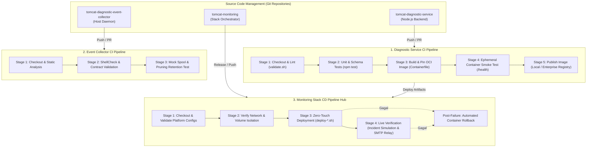
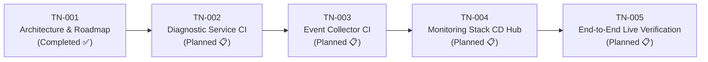

# TN-001 — Design Production-Ready Jenkins CI/CD Pipeline Architecture and Implementation Roadmap

| Field | Value |
| --- | --- |
| Status | Completed |
| Activity Type | Discovery and Assessment |
| Record Type | Live |
| Project | Tomcat Monitoring |
| Phase | Continuous Integration and Deployment |
| Activity Date | 2026-09-12 |
| Recorded Date | 2026-09-12 |
| Owner | Eddy Wiyatno |
| Working Mode | Read-only |
| Authorization Status | Approved |
| Approved By | Eddy Wiyatno |
| Approval Date | 2026-09-12 |

## 🎯 Objective

Menetapkan arsitektur resmi dan spesifikasi alur kerja **Continuous Integration and Continuous Deployment (CI/CD) Pipeline berbasis Jenkins** untuk seluruh ekosistem Tomcat Monitoring, serta menyusun peta jalan implementasi (*implementation roadmap*) bertahap (TN-002 s.d. TN-005) berstandar kesiapan produksi enterprise (*production-ready*).

---

## 🌍 Background

Pekerjaan rekayasa platform monitoring Tomcat telah menyelesaikan fase fondasi observabilitas runtime, persistensi database SQLite lokal, pemantauan mandiri (*self-monitoring*), penegakan siklus hidup direktori spool host ([TN-011](../monitoring-platform-integration/TN-011-implement-and-verify-spool-lifecycle-and-log-retention.md)), dan pembuktian pengiriman laporan investigasi 7-seksi SRE melalui *Enterprise SMTP Relay* terotentikasi dan terenkripsi STARTTLS ([TN-010](../monitoring-platform-integration/TN-010-implement-and-verify-enterprise-smtp-configuration-and-headers.md)).

Meskipun keandalan fungsional telah terbukti di runtime, proses pengujian kode, pembangunan kontainer, dan deployment stack multi-kontainer saat ini masih dijalankan secara manual menggunakan skrip ad-hoc. Untuk mengoperasikan platform ini pada skala produksi enterprise, diperlukan sistem otomasi pengiriman perangkat lunak (*software delivery automation*) terstandarisasi berbasis Jenkins Pipeline as Code.

Otomasi ini dirancang agar memenuhi kepatuhan standar industri:
1. Menghindari keterikatan terhadap jalur direktori statis pada host (*path-agnostic*).
2. Menghilangkan penyimpanan rahasia (*credentials*) dalam repositori Git atau berkas konfigurasi teks datar (*zero secret leakage*).
3. Memastikan setiap perubahan kode diverifikasi melalui gerbang kualitas (*quality gates*) bertingkat secara otomatis sebelum dideploy ke runtime aktif.

---

## 📚 Scope

- Identifikasi kebutuhan, batasan, dan dependensi pipeline CI/CD pada ketiga repositori komponen platform (`tomcat-diagnostic-service`, `tomcat-diagnostic-event-collector`, dan `tomcat-monitoring`).
- Penetapan model arsitektur *Decoupled Component CI + Orchestrated Stack CD Hub*.
- Penetapan 6 Pilar Standar Kesiapan Produksi Enterprise.
- Perumusan spesifikasi gerbang kualitas (*Quality Gates Specification*) dan kontrak tahapan pipeline.
- Tata kelola keamanan eksekusi DooD (*Docker-out-of-Docker*) via Rootless Podman pada dedicated Jenkins Agent (`builder-01`).
- Perancangan mekanisme *Zero-Downtime Deployment* dan *Automated Rollback*.
- Penyusunan Peta Jalan Implementasi bertahap (TN-002 s.d. TN-005).
- *Exclusions*: Penulisan berkas fisik `Jenkinsfile` dan eksekusi job runtime live (dijadwalkan pada Technical Note berikutnya).

---

## 📥 Inputs

1. **Sumber Konfigurasi Repositori Eksisting:**
   - Repositori [`tomcat-monitoring`](file:///home/eddywiyatno/git/tomcat-monitoring): skrip orkestrasi platform, konfigurasi Prometheus, Alertmanager, Postfix relay, dan rangkaian uji integrasi live.
   - Repositori [`tomcat-diagnostic-service`](file:///home/eddywiyatno/git/tomcat-diagnostic-service): kode sumber layanan backend Node.js 24 ESM, unit/integration test suites (`npm test`), skema validator AJV, dan `Containerfile`.
   - Repositori [`tomcat-diagnostic-event-collector`](file:///home/eddywiyatno/git/tomcat-diagnostic-event-collector): skrip daemon bash dan rangkaian uji siklus hidup spool.
2. **Standar Rekayasa dan Pipeline as Code di Handbook:**
   - Standar Pipeline as Code pada Personal Site ([PS-ADR-0007](../../../../adr/personal-site/adr-records/PS-ADR-0007.md), [PS-ADR-0008](../../../../adr/personal-site/adr-records/PS-ADR-0008.md)).
   - Image Jenkins Controller kustom dengan runtime Podman ([`jenkins-podman`](file:///home/eddywiyatno/git/jenkins-podman)).
3. **Standar Dokumentasi Handbook:**
   - [Engineering Journal Standards](../../../standards/engineering-journal-standards.md) dan [Writing Standards](../../../standards/writing-standards.md).

---

## 🔍 Findings

### 1. Karakteristik Multi-Repositori Platform
Platform Tomcat Monitoring tersusun atas 3 repositori mandiri dengan siklus rilis dan tanggung jawab yang berbeda:

| Repositori | Karakteristik Layanan | Toolchain & Test Suite | Peran dalam CI/CD |
| :--- | :--- | :--- | :--- |
| **`tomcat-diagnostic-service`** | Layanan backend mikro (Node.js 24 ESM, SQLite, AJV, Nodemailer) | • Unit & component tests (`npm test` / 62 tests) • Schema validator (`scripts/validate.sh`) • OCI Buildah (`Containerfile`) | **Component CI:** Linting, Unit Testing, OCI Image Build & Tagging, Ephemeral Container Smoke Test. |
| **`tomcat-diagnostic-event-collector`** | Daemon pengawas event Podman host (Bash script & `systemd --user`) | • Baseline validator (`scripts/validate.sh`) • Spool lifecycle & pruning test (`test/test-collector.sh`) | **Component CI:** ShellCheck static analysis, syntax validation, dan mock spool retention test. |
| **`tomcat-monitoring`** | Orkestrator platform multi-kontainer (Prometheus, Alertmanager, Postfix, JMX Exporter) | • Platform validator (`scripts/validate.sh`) • Live test suite (`test-tomcatdown-live.sh`, `verify-postfix-relay.sh`) | **Stack CD Hub:** Integrasi network/volume, deployment multi-kontainer, live incident simulation, dan automated rollback. |

### 2. Kebutuhan Kesiapan Produksi Enterprise
Implementasi skala enterprise mewajibkan pipeline memenuhi kriteria:
- **Portabilitas Registry:** Mendukung registry lokal (`localhost`) maupun Enterprise Container Registry internal (Harbor, Nexus OSS, JFrog Artifactory) melalui parameter build.
- **Kepatuhan Zero Secret Leakage:** Tidak ada password SMTP SASL, token bearer, atau private key yang dicatat dalam Git atau file konfigurasi statis. Seluruh secret diinjeksi via Jenkins Credentials Store.
- **Isolasi Keamanan Rootless:** Eksekusi pipeline berjalan di bawah user non-root (`eddywiyatno`) melalui Rootless Podman pada dedicated agent (`builder-01`), mencegah eskalasi privilege ke host OS.
- **Pengujian Bertingkat (*Quality Gates*):** Verifikasi kode secara *fail-fast* melalui static linting, unit test, schema validation, dan ephemeral smoke test sebelum menyentuh kontainer live.
- **Ketahanan Deployment (*Zero-Downtime & Rollback*):** Penerapan penggantian kontainer atomik (*atomic container replacement*) dan pemulihan otomatis (*automated rollback*) ke snapshot sebelumnya jika validasi pasca-deploy gagal.

---

## 📋 Assumptions

| Item | Asumsi Arsitektur | Validasi / Keterangan |
| :--- | :--- | :--- |
| **A1 — Jenkins Infrastructure** | Jenkins Controller dan Dedicated Agent (`builder-01`) tersedia dan terhubung via SSH Launcher. | Jenkins Controller siap di `jenkins-podman` dan agent berjalan sebagai user host. |
| **A2 — Rootless Podman Runtime** | Agent eksekusi memiliki hak akses lokal ke daemon Rootless Podman tanpa eskalasi `sudo`. | User `eddywiyatno` terkonfigurasi subuid/subgid dan runtime Podman aktif. |
| **A3 — Storage & Permission Boundary** | Host runtime menyediakan direktori persisten dengan izin `0700` untuk spool dan `0400` untuk berkas rahasia sertifikat. | Sesuai *Zero `/tmp` Policy* yang telah dibuktikan pada TN-010 dan TN-011. |
| **A4 — Credential Isolation** | Rahasia operasional (seperti kredensial SASL) dikelola terpusat di Jenkins Credentials Store. | Injeksi rahasia dilakukan saat runtime via direktif `withCredentials`. |

---

## ⚖️ Alternatives

### Alternatif 1: Monolithic Single Pipeline di `tomcat-monitoring`
Seluruh proses build dan pengujian ketiga repositori digabungkan ke dalam satu file `Jenkinsfile` tunggal.
- **Kelebihan:** Hanya perlu mengelola satu job Jenkins.
- **Kekurangan:** Menciptakan kopling erat antar repositori (*tight coupling*), memperlambat siklus feedback bagi developer komponen mikro, dan melanggar prinsip *Single Responsibility*.
- **Status:** Ditolak ❌

### Alternatif 2: Decoupled Component CI + Orchestrated Stack CD Hub (Terpilih ⭐)
Memisahkan CI pada masing-masing repositori komponen dan memusatkan CD pada repositori orkestrator stack.
- **Kelebihan:** Memisahkan tanggung jawab secara bersih, memberikan feedback cepat (hitungan detik) untuk perubahan unit, dan mendukung pengujian integrasi multi-kontainer menyeluruh secara independen.
- **Kekurangan:** Memerlukan konfigurasi terstruktur untuk masing-masing job pipeline.
- **Status:** Diterima ✅

---

## ⚠️ Risks

| Risiko Operasional | Dampak | Mitigasi Arsitektural |
| :--- | :--- | :--- |
| **Kebocoran Kredensial Sensitif** | Pelanggaran keamanan data enterprise | Injeksi rahasia terisolasi via Jenkins Credentials Store (`withCredentials`); tidak ada penulisan rahasia ke workspace Git. |
| **Kegagalan Runtime Pasca-Deployment** | Gangguan layanan pemantauan | Pembuatan snapshot kontainer aktif (`diagnostic-service-rollback-*`) sebelum deploy dan pemulihan otomatis pada blok `post.failure`. |
| **Penumpukan Artefak & Disk Exhaustion** | Kehabisan ruang disk server build | Penggunaan direktif `cleanWs` pada blok `post.always` dan pruning image dangling secara berkala. |

---

## ❓ Open Questions

| Pertanyaan | Status | Resolusi Arsitektur |
| :--- | :--- | :--- |
| Kebutuhan remote registry enterprise spesifik di kantor | Resolved | Diakomodasi melalui parameter deklaratif `REGISTRY_HOST` dan `PUSH_IMAGE` pada `Jenkinsfile`. |
| Strategi trigger pipeline otomatis | Resolved | Menggunakan SCM webhook trigger untuk Component CI dan downstream build trigger untuk Stack CD Hub. |

---

## 💡 Recommendation

Berdasarkan hasil asesmen, direkomendasikan penerapan arsitektur CI/CD menyeluruh yang ditegakkan di atas **6 Pilar Produksi Enterprise**:

### 1. Enam Pilar Kesiapan Produksi Enterprise
1. **Parameterized & Registry-Agnostic Portability:** Parameter `REGISTRY_HOST`, `DEPLOY_ENV`, dan `IMAGE_TAG` mendukung local Podman maupun Enterprise Registry (Harbor/Nexus).
2. **Zero Secret Leakage Governance:** Injeksi rahasia via Jenkins Credentials Store, runtime non-root (`eddywiyatno`), dan *Zero `/tmp` Policy*.
3. **Strict Multi-Stage Quality Gates:** Rangkaian gerbang pengujian berlapis (*Static Linting* $\rightarrow$ *Unit & Schema Tests* $\rightarrow$ *Ephemeral Smoke Test* $\rightarrow$ *Live Incident Verification*).
4. **Immutable OCI Packaging & Metadata Pinning:** Pembangunan kontainer berstandar OCI dengan metadata lengkap (`org.opencontainers.image.*`) dan SHA-256 digest pinning.
5. **Atomic Zero-Downtime Deployment & Automated Rollback:** Snapshot kontainer sebelum deployment dan otomatisasi rollback pada blok `post.failure`.
6. **Self-Documenting Pipeline & SRE Runbook:** Definisi deklaratif (*Pipeline as Code*) dan panduan konfigurasi GUI lengkap di handbook.

### 2. Spesifikasi Tahapan Pipeline (*Stage Contracts*)

#### A. Component CI Pipeline (`tomcat-diagnostic-service`)
- **Stage 1 — Checkout Source:** Mengambil kode sumber dari target branch.
- **Stage 2 — Static Lint & Validation:** Menjalankan `./scripts/validate.sh` untuk validasi shell syntax dan konsistensi parameter non-secret.
- **Stage 3 — Automated Unit Testing:** Menjalankan 62 unit/integration tests Node.js via runtime container (`npm test`).
- **Stage 4 — OCI Image Build & Tagging:** Mengeksekusi `./scripts/build.sh` dan menyematkan tag versi semantik serta OCI labels.
- **Stage 5 — Ephemeral Smoke Test:** Meluncurkan container sementara dan memvalidasi respons HTTP 200 pada `/health` dan `/metrics`.
- **Stage 6 — Publish Image (Optional):** Mendorong image ke Enterprise Registry jika parameter `PUSH_IMAGE=true`.
- **Post Actions:** Membersihkan direktori staging dan artefak sementara (`cleanWs`).

#### B. Component CI Pipeline (`tomcat-diagnostic-event-collector`)
- **Stage 1 — Checkout Source:** Mengambil kode sumber dari repositori event collector.
- **Stage 2 — Static Validation:** Menjalankan `./scripts/validate.sh` dan ShellCheck terhadap skrip collector.
- **Stage 3 — Spool & Pruning Test:** Menjalankan `test/test-collector.sh` untuk menguji siklus pemangkasan berkas dan retensi spool.

#### C. Stack Orchestration CD Pipeline (`tomcat-monitoring`)
- **Stage 1 — Platform Validation:** Menjalankan `./scripts/validate.sh` untuk memeriksa konfigurasi Prometheus, Alertmanager, dan Postfix.
- **Stage 2 — Runtime Isolation Prep:** Memastikan network Podman `devops-lab` dan Named Volumes terpasang dengan izin `0700`.
- **Stage 3 — Zero-Touch Deployment:** Menjalankan skrip `deploy-*.sh` untuk memperbarui layanan kontainer secara atomik.
- **Stage 4 — Live Verification Suite:** Mengeksekusi `verify-postfix-relay.sh` dan `test-tomcatdown-live.sh`.
- **Post-Failure Action:** Memulihkan kontainer snapshot sebelumnya jika Stage 3 atau 4 mengalami kegagalan.

### 3. Peta Jalan Implementasi (*Implementation Roadmap*)

| ID Dokumen | Judul Technical Note & Sasaran Rekayasa | Deliverables Utama |
| :--- | :--- | :--- |
| **TN-001** | **Design Production-Ready Jenkins CI/CD Pipeline Architecture and Implementation Roadmap** | Dokumen arsitektur resmi, standar 6 pilar produksi, spesifikasi quality gates, dan roadmap implementasi. *(Dokumen Ini - Selesai)* |
| **TN-002** | **Implement Production-Ready CI Pipeline for `tomcat-diagnostic-service`** | Declarative `Jenkinsfile`, parameterisasi registry, skrip build berversi, automated test runner, ephemeral smoke testing, dan verifikasi OCI image. |
| **TN-003** | **Implement CI Pipeline for `tomcat-diagnostic-event-collector`** | Declarative `Jenkinsfile`, static analysis, lint contract validation, dan mock event spool test. |
| **TN-004** | **Implement Stack Orchestration CD Pipeline for `tomcat-monitoring`** | Declarative `Jenkinsfile` orkestrasi stack, automated deployment, integrasi network `devops-lab`, dan automated rollback logic. |
| **TN-005** | **Execute and Verify End-to-End CI/CD Pipelines in Jenkins Controller** | Registrasi jobs di Jenkins Controller, pengujian build live (`SUCCESS`), pembuktian incident injection, dan konsolidasi dokumentasi buku petunjuk SRE di Handbook. |

---

## ⚖️ Execution Decision

### PS-ADR-0007 — Use Pipeline as Code
Mengadopsi prinsip penyimpanan seluruh definisi pipeline dalam repositori Git (`Jenkinsfile`) agar konfigurasi dapat ditinjau, diverifikasi, dan dikelola bersama siklus rilis kode sumber.

### PS-ADR-0008 — Adopt Stage-Based CI Pipeline
Mengadopsi pembagian tahapan pipeline berbasis stage berurutan (*stage-based quality gates*) dengan prinsip *fail-fast* sebelum rilis diterapkan ke runtime aktif.

---

## 🧾 Outcome

1. **Arsitektur CI/CD Disahkan:** Model *Decoupled Component CI + Orchestrated Stack CD Hub* resmi menjadi standar arsitektur otomasi Tomcat Monitoring.
2. **Standar Kesiapan Produksi Dibakukan:** Enam Pilar Kesiapan Produksi Enterprise telah ditetapkan untuk menjamin portabilitas kode dan pipeline di lingkungan kerja target (*Plug-and-Play*).
3. **Peta Jalan Implementasi Terstruktur:** Roadmap 4 langkah (**TN-002 s.d. TN-005**) telah dirumuskan dengan sasaran deliverables yang terukur.

---

## 🎓 Lessons Learned

1. **Pemisahan Tanggung Jawab Komponen dan Orkestrator:** Memisahkan CI komponen dari orkestrator stack memberikan siklus feedback instan bagi developer microservices tanpa mengorbankan integritas pengujian integrasi platform.
2. **Kesiapan Produksi Sejak Fase Desain:** Menetapkan parameterisasi registry dan tata kelola injeksi secret sejak awal menghindarkan sistem dari refactor saat transisi dari lab ke produksi enterprise.

---

## ⏭️ Next Steps

- Memulai eksekusi tahap **TN-002 — Implement Production-Ready CI Pipeline for `tomcat-diagnostic-service`**.

---

## 🔗 Related Documentation

- [Monitoring Platform Integration Engineering Journal](../monitoring-platform-integration/index.md)
- [TN-010 — Implement and Verify Enterprise SMTP Configuration and Headers](../monitoring-platform-integration/TN-010-implement-and-verify-enterprise-smtp-configuration-and-headers.md)
- [TN-011 — Implement and Verify Host Spool Lifecycle and Runtime Log Retention Governance](../monitoring-platform-integration/TN-011-implement-and-verify-spool-lifecycle-and-log-retention.md)
- [Follow-up Tasks Backlog](../../follow-up-tasks.md)
- [Personal Site Continuous Integration Engineering Journal](../../../web-platform/personal-site/engineering-journal/continuous-integration/index.md)
- [PS-ADR-0007 — Use Pipeline as Code](../../../../adr/personal-site/adr-records/PS-ADR-0007.md)
- [PS-ADR-0008 — Adopt Stage-Based CI Pipeline](../../../../adr/personal-site/adr-records/PS-ADR-0008.md)
