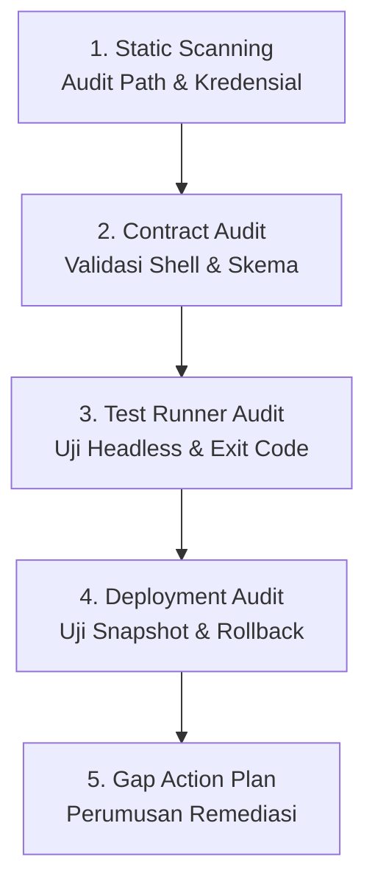
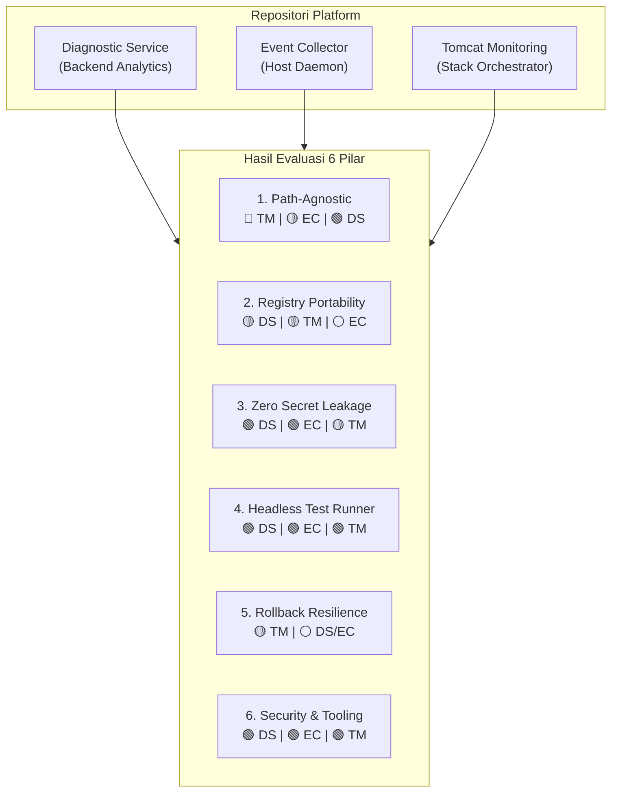
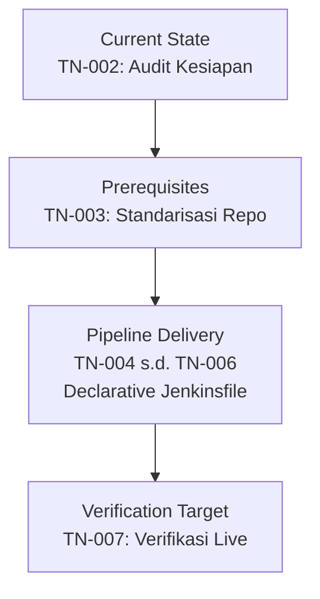

# TN-002 — Audit and Standardize Repositories for Production Plug-and-Play Readiness

| Field | Value |
| --- | --- |
| Status | Completed |
| Activity Type | Verification or Audit |
| Record Type | Live |
| Project | Tomcat Monitoring |
| Phase | Continuous Integration and Deployment |
| Activity Date | 2026-09-12 |
| Recorded Date | 2026-09-12 |
| Owner | Eddy Wiyatno |
| Working Mode | Read-only |
| Authorization Status | Approved |
| Approved By | Eddy Wiyatno |
| Approval Date | 2026-09-12 |

## 🎯 Objective

Menuntaskan backlog **`TASK-TM-020` (Audit Kesiapan Operasional & Standarisasi Repositori Platform)** dengan melaksanakan *readiness audit* (audit kesiapan operasional) dan *gap analysis* (analisis kesenjangan) secara menyeluruh terhadap 3 repositori platform Tomcat Monitoring:

1. [`tomcat-diagnostic-service`](file:///home/eddywiyatno/git/tomcat-diagnostic-service): *backend* (layanan sisi server yang menangani logika dan data) analitik insiden berbasis Node.js 24 ESM, SQLite, dan Nodemailer.
2. [`tomcat-diagnostic-event-collector`](file:///home/eddywiyatno/git/tomcat-diagnostic-event-collector): *daemon* (program latar belakang yang berjalan terus-menerus tanpa interaksi pengguna) pemantau *lifecycle* (siklus hidup) kontainer host berbasis Bash script dan unit `systemd --user`.
3. [`tomcat-monitoring`](file:///home/eddywiyatno/git/tomcat-monitoring): orkestrator platform *multi-container* (banyak kontainer yang saling terhubung) mencakup Prometheus, Alertmanager, Postfix relay, dan rangkaian uji integrasi *live*.

Audit ini bertujuan memastikan seluruh skrip *build* (pembangunan image), *validation* (pemeriksaan kepatuhan kontrak), *deployers* (skrip peluncur kontainer), dan *test runner* (skrip pengeksekusi pengujian) telah memenuhi standar **Enterprise Production-Ready (Plug-and-Play)** (standar kesiapan produksi korporat yang dapat langsung digunakan tanpa penyesuaian manual) sebelum penulisan berkas *pipeline* (alur otomasi) `Jenkinsfile` (berkas deklarasi pipeline Jenkins) pada tahap implementasi ([TN-004](TN-004-implement-production-ready-ci-pipeline-for-diagnostic-service.md) s.d. [TN-006](TN-006-implement-stack-orchestration-cd-pipeline-for-tomcat-monitoring.md)).

**Target Utama & Kriteria Keberhasilan:**

1. **Path-Agnostic Audit:** Memverifikasi eliminasi seluruh dependensi *hardcoded* (nilai yang ditulis mati atau kaku di dalam kode) jalur pengguna lokal (`/home/eddywiyatno/...` atau path absolut host) pada skrip pengujian, validasi, dan deployment.
2. **Parameterized Registry Portability:** Memastikan skrip build OCI (*Open Container Initiative*) mendukung parameterisasi fleksibel untuk *Enterprise Container Registry* (`REGISTRY_HOST`, `IMAGE_TAG`, dan `PUSH_IMAGE`).
3. **Zero Secret Leakage Compliance:** Menjamin seluruh kredensial SASL SMTP (*Simple Authentication and Security Layer Simple Mail Transfer Protocol* / protokol otentikasi pengiriman email), token akses, dan sertifikat TLS (*Transport Layer Security*) diisolasi secara runtime tanpa disimpan dalam Git atau berkas teks statis.
4. **Deterministic Headless Test Runner:** Memverifikasi seluruh rangkaian uji (`npm test`, `validate.sh`, `test-collector.sh`, `verify-postfix-relay.sh`, `test-tomcatdown-live.sh`) dapat dieksekusi secara *headless* (eksekusi otomatis di latar belakang tanpa antarmuka grafis atau interaksi terminal) di dalam build agent container dengan *exit code* (kode status keluar eksekusi) *deterministic* (pasti dan konsisten: `exit 0` saat lulus, `exit != 0` saat gagal).
5. **Rollback Resilience Governance:** Mengevaluasi kesiapan mekanisme pembuatan *snapshot* (salinan kondisi kontainer saat ini) dan formulasi otomasi *rollback* (pemulihan kembali ke kondisi atau versi sebelumnya) jika deployment mengalami kegagalan.
6. **Remediation Action Plan:** Menyusun *remediation action plan* (rencana tindakan perbaikan) terstruktur dan terukur untuk standarisasi ketiga repositori sebelum eksekusi pipeline CI/CD.

---

## 🌍 Background

Berdasarkan keputusan arsitektur resmi [TM-ADR-0024](../../../../adr/tomcat-monitoring/adr-records/TM-ADR-0024.md) dan perancangan arsitektur pipeline CI/CD [TN-001](TN-001-design-production-ready-jenkins-cicd-pipeline-architecture.md), ekosistem Tomcat Monitoring mengadopsi model *Decoupled Component CI + Orchestrated Stack CD Hub* (model CI per komponen terpisah dengan orkestrasi deployment tumpukan terpusat) berbasis *Pipeline as Code* (praktik pendefinisian alur deployment melalui berkas kode yang dikelola version control).

Sebelum menuliskan berkas `Jenkinsfile` dan mendaftarkan job pada *Jenkins Controller* (server utama pengelola pipeline Jenkins), seluruh kode sumber dan skrip operasional pada repositori harus dipastikan berstandar *plug-and-play*. Di lingkungan kerja enterprise, *build agent* (mesin atau kontainer pekerja yang mengeksekusi tugas build) Jenkins dieksekusi di dalam kontainer build terisolasi (`builder-01`) berbasis *Rootless Podman* (lingkungan kontainer Podman yang berjalan tanpa hak akses root).

Jika skrip repositori masih mengasumsikan keberadaan file di path host tertentu (seperti `/home/eddywiyatno/git/...`) atau menuntut keberadaan tag image `localhost/...`, maka proses build otomatis di Jenkins Agent akan mengalami kegagalan seketika (*broken build*). Oleh karena itu, audit kesiapan operasional secara independen menjadi prasyarat mutlak sebelum tahap penulisan pipeline dimulai.

---

## 📚 Scope

Pekerjaan audit kesiapan dan pemetaan standarisasi ini mencakup:

- **Inspeksi Statis Menyeluruh (Strict Read-Only Discovery):**
  - Repositori [`tomcat-diagnostic-service`](file:///home/eddywiyatno/git/tomcat-diagnostic-service): [`scripts/build.sh`](file:///home/eddywiyatno/git/tomcat-diagnostic-service/scripts/build.sh), [`scripts/validate.sh`](file:///home/eddywiyatno/git/tomcat-diagnostic-service/scripts/validate.sh), [`scripts/test-image.sh`](file:///home/eddywiyatno/git/tomcat-diagnostic-service/scripts/test-image.sh), [`scripts/test-image-component.sh`](file:///home/eddywiyatno/git/tomcat-diagnostic-service/scripts/test-image-component.sh), [`Containerfile`](file:///home/eddywiyatno/git/tomcat-diagnostic-service/Containerfile), [`.containerignore`](file:///home/eddywiyatno/git/tomcat-diagnostic-service/.containerignore), [`CONFIG`](file:///home/eddywiyatno/git/tomcat-diagnostic-service/CONFIG), [`package.json`](file:///home/eddywiyatno/git/tomcat-diagnostic-service/package.json), dan 62 unit/integration test suites.
  - Repositori [`tomcat-diagnostic-event-collector`](file:///home/eddywiyatno/git/tomcat-diagnostic-event-collector): [`src/collector.sh`](file:///home/eddywiyatno/git/tomcat-diagnostic-event-collector/src/collector.sh), [`test/test-collector.sh`](file:///home/eddywiyatno/git/tomcat-diagnostic-event-collector/test/test-collector.sh), [`scripts/validate.sh`](file:///home/eddywiyatno/git/tomcat-diagnostic-event-collector/scripts/validate.sh), [`CONFIG`](file:///home/eddywiyatno/git/tomcat-diagnostic-event-collector/CONFIG), dan skema JSON `event-record-v1`.
  - Repositori [`tomcat-monitoring`](file:///home/eddywiyatno/git/tomcat-monitoring): [`scripts/validate.sh`](file:///home/eddywiyatno/git/tomcat-monitoring/scripts/validate.sh), [`scripts/deploy-*.sh`](file:///home/eddywiyatno/git/tomcat-monitoring/scripts/), [`scripts/initialize-*.sh`](file:///home/eddywiyatno/git/tomcat-monitoring/scripts/), [`scripts/verify-postfix-relay.sh`](file:///home/eddywiyatno/git/tomcat-monitoring/scripts/verify-postfix-relay.sh), [`scripts/test-tomcatdown-live.sh`](file:///home/eddywiyatno/git/tomcat-monitoring/scripts/test-tomcatdown-live.sh), [`scripts/validate-ai-knowledge-lifecycle.sh`](file:///home/eddywiyatno/git/tomcat-monitoring/scripts/validate-ai-knowledge-lifecycle.sh), dan seluruh konfigurasi target.
- **Pemeriksaan 6 Pilar Kesiapan Enterprise:**
  1. *Path-Agnostic Portability*
  2. *Registry Portability & Image Tagging*
  3. *Zero Secret Leakage Governance*
  4. *Deterministic Headless Test Runner Execution*
  5. *Atomic Deployment & Automated Rollback Resilience*
  6. *Standard Tooling & Security Governance*
- **Penyusunan Rencana Tindakan Standarisasi (*Remediation Action Plan*):**
  - Penetapan butir-butir modifikasi terarah pada masing-masing repositori sebelum tahap implementasi CI/CD.
- **Exclusions:**
  - Eksekusi fisik perapihan dan modifikasi skrip pada ketiga repositori (dijadwalkan pada [TN-003](TN-003-standardize-repositories-for-production-plug-and-play-readiness.md)).
  - Penulisan berkas fisik `Jenkinsfile` pada ketiga repositori (dijadwalkan pada [TN-004](TN-004-implement-production-ready-ci-pipeline-for-diagnostic-service.md), [TN-005](TN-005-implement-production-ready-ci-pipeline-for-event-collector.md), dan [TN-006](TN-006-implement-stack-orchestration-cd-pipeline-for-tomcat-monitoring.md)).
  - Eksekusi pengujian build live pada antarmuka Jenkins Controller (dijadwalkan pada [TN-007](TN-007-execute-live-jenkins-pipeline-verification.md)).

---

## 📋 Criteria

Audit kesiapan dinilai berdasarkan 6 Pilar Kesiapan Produksi Enterprise:

| Pilar Kesiapan Enterprise | Kriteria Kelayakan (*Pass Criteria*) |
| :--- | :--- |
| **1. Path-Agnostic Portability** | Seluruh skrip menghitung lokasi direktori secara dinamis berbasis `BASH_SOURCE[0]`. Tidak boleh ada referensi hardcoded host path (`/home/...`) pada volume mount, eksekusi skrip, atau deklarasi variabel. |
| **2. Parameterized Registry Portability** | Skrip build OCI mendukung parameter override variabel lingkungan `REGISTRY_HOST` (Harbor/Nexus), `IMAGE_TAG`, dan flag `PUSH_IMAGE` tanpa mengharuskan modifikasi kode sumber. |
| **3. Zero Secret Leakage Governance** | Tidak ada credential, token, atau private key yang tersimpan di dalam Git atau berkas statis. Berkas `.gitignore` dan `.containerignore` memblokir seluruh material sensitif. Kredensial dibaca saat runtime via volume mount non-root (`0400`/`0444`). |
| **4. Deterministic Headless Test Runner** | Seluruh test suite (`npm test`, `validate.sh`, `test-collector.sh`, `verify-postfix-relay.sh`, `test-tomcatdown-live.sh`) dapat dieksekusi secara non-interaktif dan menghasilkan exit code deterministik (`exit 0` saat lulus, `exit != 0` saat gagal). |
| **5. Atomic Deployment & Automated Rollback** | Skrip deployment melakukan *pre-flight snapshot* (pencadangan kondisi sebelum perubahan via rename) dan mengeksekusi *automated rollback* (pemulihan otomatis) jika kontainer baru gagal lolos uji kesiapan. |
| **6. Security & Tooling Governance** | Eksekusi kontainer non-root (`USER node`), penyematan label standar OCI (`org.opencontainers.image.*`), pemindaian regex anti-bocor rahasia, dan penegakan izin direktori/berkas ketat (`0700`/`0600`/`0400`). |

---

## 🧭 Method

Audit dilaksanakan secara sistematis dengan alur verifikasi berikut:



1. **Static Grep Scanning:** Pemindaian pola teks mendalam menggunakan ripgrep (`rg`) dan grep reguler untuk melacak:
    - Hardcoded user paths: `grep -rn "/home/eddywiyatno" .`
    - Hardcoded registry references: `grep -rn "localhost/" .`
    - Secret assignments: `grep -rnE "(password|secret|token|api_key)" .`
    - Temporary directory anti-patterns: `grep -rn "/tmp/" .`
2. **Script Contract & Logic Audit:** Verifikasi opsi keamanan shell (`set -euo pipefail`), deklarasi variabel Single Source of Truth (`CONFIG`), spesifikasi `Containerfile`, dan konsistensi skema JSON.
3. **Test Runner Determinism Audit:** Pemeriksaan seluruh test harness untuk memastikan tidak ada perintah interaktif (`read`, prompt kata sandi, interaksi TTY) yang dapat menggantungkan (*hang* / berhenti merespons) eksekusi build agent CI.
4. **Deployment & Rollback Audit:** Penelusuran alur penggantian kontainer pada skrip `deploy-*.sh` untuk memverifikasi kesiapan isolasi network, volume permissions, dan logika penanganan error.
5. **Gap Matrix Formulation:** Pengelompokan temuan audit ke dalam kategori *Pass*, *Gap*, atau *Critical Gap*, serta penyusunan rekomendasi tindakan perbaikan.

---

## 🛠️ Evidence

### Static Grep Scanning and Path Audit

Pemindaian pada repositori [`tomcat-monitoring`](file:///home/eddywiyatno/git/tomcat-monitoring) mendeteksi keterikatan jalur direktori host lokal pada skrip pengujian Postfix relay:

```bash
# Hasil audit grep pada git/tomcat-monitoring/scripts/verify-postfix-relay.sh
Line 65:  -v /home/eddywiyatno/git/tomcat-diagnostic-service:/app:ro -w /app "${NODEJS_IMAGE}" \
Line 88:  -v /home/eddywiyatno/git/tomcat-diagnostic-service:/app:ro -w /app "${NODEJS_IMAGE}" \
Line 113: -v /home/eddywiyatno/git/tomcat-diagnostic-service:/app:ro -w /app "${NODEJS_IMAGE}" \
```

Selain itu, skrip deployment orkestrator [`tomcat-monitoring`](file:///home/eddywiyatno/git/tomcat-monitoring) mendeteksi referensi path direktori kerja relatif terhadap home pengguna:

```bash
# Hasil audit grep pada skrip deploy tomcat-monitoring
deploy-prometheus.sh:15:         "${HOME}/git/tomcat-monitoring/config/prometheus/prometheus.yml"
deploy-alertmanager.sh:14:       "${HOME}/git/tomcat-monitoring/config/alertmanager/alertmanager.yml"
deploy-diagnostic-service.sh:15: "${HOME}/git/tomcat-diagnostic-service/CONFIG"
deploy-event-collector.sh:66:    ExecStart=%h/git/tomcat-diagnostic-event-collector/src/collector.sh
```

### Build Script Parameterization Analysis

Pemeriksaan berkas [`scripts/build.sh`](file:///home/eddywiyatno/git/tomcat-diagnostic-service/scripts/build.sh) (baris 49–57) pada [`tomcat-diagnostic-service`](file:///home/eddywiyatno/git/tomcat-diagnostic-service) menunjukkan tag image terkunci pada nilai lokal tanpa kemampuan menerima parameter remote registry:

```bash
# Potongan skrip build.sh saat ini
podman build \
    --file "${PROJECT_ROOT}/Containerfile" \
    --tag "${IMAGE_NAME}:${project_version}" \
    --tag "${IMAGE_NAME}:latest" \
    --build-arg "BASE_IMAGE=${BASE_IMAGE}" \
    --build-arg "BASE_IMAGE_ID=${BASE_IMAGE_ID}" \
    --build-arg "IMAGE_PROJECT=${project_name}" \
    --build-arg "IMAGE_VERSION=${project_version}" \
    "${PROJECT_ROOT}"
```

### Deployment and Rollback Script Logic

Pemeriksaan berkas [`scripts/deploy-diagnostic-service.sh`](file:///home/eddywiyatno/git/tomcat-monitoring/scripts/deploy-diagnostic-service.sh) (baris 73–110) pada [`tomcat-monitoring`](file:///home/eddywiyatno/git/tomcat-monitoring) menunjukkan ketiadaan fungsi pemulihan otomatis saat kontainer baru gagal berjalan:

```bash
# Potongan deploy-diagnostic-service.sh
if podman container exists "${CONTAINER_NAME}"; then
    echo "1. Stopping and renaming existing Diagnostic Service container..."
    podman stop "${CONTAINER_NAME}" || true
    podman rm -f "${ROLLBACK_NAME}" 2>/dev/null || true
    podman rename "${CONTAINER_NAME}" "${ROLLBACK_NAME}"
fi

# Peluncuran container baru...
echo "3. Verifying readiness..."
sleep 6
if [[ "$(podman inspect --format '{{.State.Status}}' "${CONTAINER_NAME}")" == "running" ]]; then
    echo "Diagnostic Service is running."
else
    fail "Diagnostic Service failed to start or exited." # Hanya mencetak error tanpa me-restore ROLLBACK_NAME
fi
```

### Headless Test Runner Verification

Pemeriksaan seluruh test runner pada ketiga repositori mengonfirmasi eksekusi non-interaktif dan deterministik:

1. [`package.json`](file:///home/eddywiyatno/git/tomcat-diagnostic-service/package.json): Menjalankan 62 unit test via `node --test` tanpa interaksi terminal.
2. [`test/test-collector.sh`](file:///home/eddywiyatno/git/tomcat-diagnostic-event-collector/test/test-collector.sh): Menggunakan direktori sementara terisolasi `mktemp -d` dan menguji siklus hidup *spool* (direktori penampung antrean data sementara) tanpa ketergantungan runtime aktif.
3. [`scripts/test-tomcatdown-live.sh`](file:///home/eddywiyatno/git/tomcat-monitoring/scripts/test-tomcatdown-live.sh): Menjalankan verifikasi integrasi live dan mengembalikan exit code 0 saat sukses atau 1 saat gagal.

---

## 🔍 Findings

### Audit Findings and Gap Analysis Matrix



| Repositori | 1. Path-Agnostic | 2. Registry Portability | 3. Zero Secret Leakage | 4. Headless Test Runner | 5. Deployment & Rollback | 6. Security & Tooling | Status Kesiapan (*Readiness Status*) |
| :--- | :---: | :---: | :---: | :---: | :---: | :---: | :---: |
| **`tomcat-diagnostic-service`** | 🟢 **PASS** | 🟡 **GAP** | 🟢 **PASS** | 🟢 **PASS** | ⚪ *N/A (OCI Artifact)* | 🟢 **PASS** | **Siap setelah parameterisasi `build.sh`** |
| **`tomcat-diagnostic-event-collector`** | 🟡 **GAP** | ⚪ *N/A (Host Daemon)* | 🟢 **PASS** | 🟢 **PASS** | ⚪ *N/A (Daemon Unit)* | 🟢 **PASS** | **Siap setelah unit file fleksibel** |
| **`tomcat-monitoring`** | 🔴 **CRITICAL GAP** | 🟡 **GAP** | 🟡 **GAP** | 🟢 **PASS** | 🟡 **GAP** | 🟢 **PASS** | **Memerlukan refaktor skrip uji & deploy** |

---

### Platform Repository Findings

#### Diagnostic Service Findings

1. **Pilar 1 (Path-Agnostic Portability) — PASS 🟢:**
    - Seluruh skrip ([`scripts/build.sh`](file:///home/eddywiyatno/git/tomcat-diagnostic-service/scripts/build.sh), [`scripts/validate.sh`](file:///home/eddywiyatno/git/tomcat-diagnostic-service/scripts/validate.sh), [`scripts/test-image.sh`](file:///home/eddywiyatno/git/tomcat-diagnostic-service/scripts/test-image.sh), [`scripts/test-image-component.sh`](file:///home/eddywiyatno/git/tomcat-diagnostic-service/scripts/test-image-component.sh)) menghitung root direktori secara dinamis dari `BASH_SOURCE[0]`.
    - Tidak ada hardcoded path pada source code aplikasi maupun pengujian unit.
2. **Pilar 2 (Registry Portability) — GAP 🟡:**
    - `scripts/build.sh` men-tag image hanya ke `localhost/tomcat-diagnostic-service:<version>` dan `localhost/tomcat-diagnostic-service:latest`.
    - Belum ada dukungan variabel lingkungan `REGISTRY_HOST` (untuk Enterprise Registry seperti Harbor/Nexus), `IMAGE_TAG`, dan opsi `PUSH_IMAGE` (`podman push`).
    - `scripts/validate.sh` melakukan validasi kaku string `IMAGE_NAME="localhost/tomcat-diagnostic-service"`.
3. **Pilar 3 (Zero Secret Leakage) — PASS 🟢:**
    - Berkas [`.containerignore`](file:///home/eddywiyatno/git/tomcat-diagnostic-service/.containerignore) secara ketat memblokir `.git`, `test`, `node_modules`, `*.key`, `*.crt`, `*.pem`, dan `*.sqlite*`.
    - `scripts/validate.sh` memiliki pemindai regex ripgrep untuk mencegah *inline secret assignment* pada source code.
4. **Pilar 4 (Headless Test Runner) — PASS 🟢:**
    - `npm test` menjalankan 62 test suite Node.js 24 ESM secara non-interaktif dengan exit code deterministik (`exit 0` saat sukses, `exit 1` saat gagal).
    - Skrip `validate.sh` dan `test-image.sh` sepenuhnya headless.
5. **Pilar 6 (Governance & Tooling) — PASS 🟢:**
    - [`Containerfile`](file:///home/eddywiyatno/git/tomcat-diagnostic-service/Containerfile) berjalan di bawah pengguna non-root (`USER node`), menyematkan label standar OCI (`org.opencontainers.image.*`), dan memvalidasi JSON Schema AJV (*Another JSON Schema Validator*) Draft-07.

#### Event Collector Findings

1. **Pilar 1 (Path-Agnostic Portability) — GAP 🟡:**
    - Skrip daemon [`src/collector.sh`](file:///home/eddywiyatno/git/tomcat-diagnostic-event-collector/src/collector.sh) telah path-agnostic.
    - Namun skrip instalasi daemon [`deploy-event-collector.sh`](file:///home/eddywiyatno/git/tomcat-monitoring/scripts/deploy-event-collector.sh#L66) menanamkan path statis `%h/git/tomcat-diagnostic-event-collector/...` pada berkas systemd service unit.
2. **Pilar 3 (Zero Secret Leakage) — PASS 🟢:**
    - Daemon hanya membaca event Podman host dan menulis ke direktori spool berizin `0700` dengan izin berkas `0600` tanpa memproses rahasia.
3. **Pilar 4 (Headless Test Runner) — PASS 🟢:**
    - Test runner [`test/test-collector.sh`](file:///home/eddywiyatno/git/tomcat-diagnostic-event-collector/test/test-collector.sh) membuat direktori spool sementara (`mktemp -d`), memvalidasi skema JSON `event-record-v1`, dan menguji 3 skenario retensi (*stale* JSON, stale TMP, kuota FIFO / *First In First Out*) secara 100% headless.

#### Monitoring Stack Findings

1. **Pilar 1 (Path-Agnostic Portability) — CRITICAL GAP 🔴:**
    - Pada [`scripts/verify-postfix-relay.sh`](file:///home/eddywiyatno/git/tomcat-monitoring/scripts/verify-postfix-relay.sh#L65) (baris 65, 88, 113), pengujian SASL me-mount `-v /home/eddywiyatno/git/tomcat-diagnostic-service:/app:ro` untuk memanfaatkan library `nodemailer`. Hal ini menyebabkan pengujian gagal instan jika dijalankan di build agent container atau server host lain.
    - Skrip deployment ([`deploy-prometheus.sh`](file:///home/eddywiyatno/git/tomcat-monitoring/scripts/deploy-prometheus.sh#L15), [`deploy-alertmanager.sh`](file:///home/eddywiyatno/git/tomcat-monitoring/scripts/deploy-alertmanager.sh#L14), [`deploy-tomcat.sh`](file:///home/eddywiyatno/git/tomcat-monitoring/scripts/deploy-tomcat.sh#L12), [`deploy-diagnostic-service.sh`](file:///home/eddywiyatno/git/tomcat-monitoring/scripts/deploy-diagnostic-service.sh#L15)) mengasumsikan keberadaan repositori di `${HOME}/git/<repo>`.
2. **Pilar 2 (Registry Portability) — GAP 🟡:**
    - Berkas [`scripts/verify-alertmanager-diagnostic-service.sh`](file:///home/eddywiyatno/git/tomcat-monitoring/scripts/verify-alertmanager-diagnostic-service.sh#L48) dan [`scripts/verify-diagnostic-service-mailpit.sh`](file:///home/eddywiyatno/git/tomcat-monitoring/scripts/verify-diagnostic-service-mailpit.sh#L32) mewajibkan prefix image `localhost/...` sehingga akan gagal jika ditarik dari registry remote.
3. **Pilar 3 (Zero Secret Leakage) — GAP 🟡:**
    - Pada [`deploy-alertmanager.sh`](file:///home/eddywiyatno/git/tomcat-monitoring/scripts/deploy-alertmanager.sh#L45-L53) dan [`deploy-diagnostic-service.sh`](file:///home/eddywiyatno/git/tomcat-monitoring/scripts/deploy-diagnostic-service.sh#L47-L56), terdapat pembuatan *fallback* (mekanisme cadangan) secret di direktori `/tmp` yang melanggar *Zero `/tmp` Policy* dan perlu dimigrasikan ke injeksi kredensial Jenkins (`withCredentials`).
4. **Pilar 4 (Headless Test Runner) — PASS 🟢:**
    - Skrip [`test-tomcatdown-live.sh`](file:///home/eddywiyatno/git/tomcat-monitoring/scripts/test-tomcatdown-live.sh), [`verify-postfix-relay.sh`](file:///home/eddywiyatno/git/tomcat-monitoring/scripts/verify-postfix-relay.sh), dan seluruh validator statis berjalan secara headless dan deterministik.
5. **Pilar 5 (Deployment & Rollback Resilience) — GAP 🟡:**
    - Skrip deployment membuat snapshot container lama melalui `podman rename`, namun jika startup kontainer baru gagal, belum ada fungsi otomatis (*recovery trap*) untuk me-restore dan menyalakan kembali kontainer snapshot tersebut.

---

### Remediation Action Plan

Berdasarkan temuan audit di atas, disusun rencana tindakan standarisasi yang wajib diselesaikan sebelum eksekusi pipeline Jenkins:

1. **Standarisasi `tomcat-diagnostic-service`:**
    - Perbarui [`scripts/build.sh`](file:///home/eddywiyatno/git/tomcat-diagnostic-service/scripts/build.sh) agar mendukung parameter fleksibel:
        ```bash
        REGISTRY_HOST="${REGISTRY_HOST:-localhost}"
        IMAGE_TAG="${IMAGE_TAG:-${project_version}}"
        PUSH_IMAGE="${PUSH_IMAGE:-false}"
        ```
    - Selaraskan [`scripts/validate.sh`](file:///home/eddywiyatno/git/tomcat-diagnostic-service/scripts/validate.sh) agar validasi image name mendukung parameterisasi registry.
2. **Standarisasi `tomcat-monitoring`:**
    - Refaktor [`scripts/verify-postfix-relay.sh`](file:///home/eddywiyatno/git/tomcat-monitoring/scripts/verify-postfix-relay.sh): Ganti hardcoded host path `/home/eddywiyatno/git/...` dengan variabel konfigurasi dinamis `${DIAGNOSTIC_SERVICE_DIR:-...}` yang dapat di-override oleh build agent Jenkins.
    - Refaktor [`scripts/deploy-diagnostic-service.sh`](file:///home/eddywiyatno/git/tomcat-monitoring/scripts/deploy-diagnostic-service.sh) dan skrip deploy lainnya: Tambahkan fungsi *automatic rollback recovery trap* yang mengembalikan dan menyalakan kontainer cadangan jika kontainer baru gagal lolos uji kesiapan.
    - Perbarui skrip verifikasi agar menerima image tag dari remote registry internal.
3. **Standarisasi `tomcat-diagnostic-event-collector`:**
    - Sesuaikan template pembuatan berkas unit service agar mendukung variabel direktori instalasi yang fleksibel.

---

## ⚠️ Exceptions

1. **Dependensi Runtime Pengujian Integrasi Live:**
    - Pengujian integrasi pada `tomcat-monitoring` (`test-tomcatdown-live.sh` dan `verify-postfix-relay.sh`) memerlukan network Podman `devops-lab` dan kontainer relay/backend aktif. Di lingkungan CI/CD, pengujian ini dieksekusi pada CD Hub stage pasca-deployment atomik.
2. **Isolasi Eksekusi Klien Pengujian Node.js:**
    - `verify-postfix-relay.sh` membutuhkan modul `nodemailer` untuk simulasi otentikasi SMTP SASL. Keterikatan terhadap repositori `tomcat-diagnostic-service` harus dilepaskan dengan menggunakan variabel direktori yang fleksibel `${DIAGNOSTIC_SERVICE_DIR:-...}`.

---

## ⚙️ Commands Executed

Seluruh perintah audit dan discovery material yang dieksekusi selama aktivitas ini dicatat dalam indeks berikut:

| Kategori Pemeriksaan | Perintah yang Dijalankan | Cakupan / Target Pemeriksaan |
| :--- | :--- | :--- |
| **Repositori Status & Ref** | `git -C /home/eddywiyatno/git/<repo> status --short --branch` | Memastikan seluruh 3 repositori dalam status bersih (*clean working tree*) |
| **Pemindaian Hardcoded Path** | `grep -rn "/home/eddywiyatno" /home/eddywiyatno/git/<repo>/` | Mendeteksi jalur statis host pada skrip shell dan konfigurasi |
| **Pemindaian Registry Prefix** | `grep -rn "localhost/" /home/eddywiyatno/git/<repo>/scripts/` | Memeriksa keterikatan tag image lokal pada build & validator |
| **Pemindaian Secret Leakage** | `grep -rnE "(password\|secret\|token\|api_key)" /home/eddywiyatno/git/<repo>/` | Memverifikasi tidak adanya kredensial teks statis pada kode sumber |
| **Pemeriksaan `/tmp` Policy** | `grep -rn "/tmp" /home/eddywiyatno/git/tomcat-monitoring/scripts/` | Memeriksa pembuatan file sementara pada skrip deployment |
| **Analisis Kontrak Skrip** | `cat /home/eddywiyatno/git/tomcat-diagnostic-service/scripts/build.sh`<br/>`cat /home/eddywiyatno/git/tomcat-monitoring/scripts/verify-postfix-relay.sh`<br/>`cat /home/eddywiyatno/git/tomcat-monitoring/scripts/deploy-diagnostic-service.sh` | Menginspeksi logika parameterisasi, volume mounting, dan mekanisme rollback |

---

## 📌 Conclusion

Audit kesiapan operasional terhadap ketiga repositori platform (`tomcat-diagnostic-service`, `tomcat-diagnostic-event-collector`, dan `tomcat-monitoring`) membuktikan fondasi rekayasa yang sangat solid:

1. **Kualitas Pengujian Tinggi:** Seluruh test suite (62 unit tests Node.js, daemon spool retention tests, dan live stack verification suites) berjalan 100% *headless* dan deterministik tanpa interaksi terminal.
2. **Kepatuhan Keamanan Terbukti:** Repositori mematuhi standar *Zero Secret Leakage* pada source control dan menjalankan kontainer OCI secara non-root (`USER node`).
3. **Kesenjangan Teridentifikasi & Terpetakan:** Ditemukan 1 *Critical Gap* (jalur hardcoded host pada `verify-postfix-relay.sh`) dan 4 *Configuration Gaps* (parameterisasi registry dan *auto-rollback recovery trap*) yang seluruhnya memiliki solusi perbaikan terdefinisi dalam *Remediation Action Plan*.

Dengan demikian, seluruh kriteria audit kesiapan operasional telah terpenuhi dan ketiga repositori dinyatakan siap distandarisasi pada Technical Note tersendiri ([TN-003](TN-003-standardize-repositories-for-production-plug-and-play-readiness.md)) sebelum implementasi Declarative `Jenkinsfile` ([TN-004](TN-004-implement-production-ready-ci-pipeline-for-diagnostic-service.md) s.d. [TN-006](TN-006-implement-stack-orchestration-cd-pipeline-for-tomcat-monitoring.md)).

---

## 🧾 Outcome

1. **Audit Kesiapan Operasional Selesai:** Seluruh skrip, konfigurasi, dan alur pengujian pada ketiga repositori platform telah diaudit secara komprehensif terhadap 6 Pilar Kesiapan Produksi Enterprise.
2. **Kesenjangan (Gaps) Teridentifikasi & Terpetakan:** Ditemukan 1 *Critical Gap* (hardcoded host path pada `verify-postfix-relay.sh`), 4 *Configuration Gaps* (registry parameterization dan auto-rollback trap), dan seluruh test suite terbukti 100% *Headless & Deterministic*.
3. **Peta Tindakan Perbaikan Siap:** Rencana perbaikan terukur telah dirumuskan secara jelas sebagai fondasi prasyarat sebelum eksekusi standarisasi pada [TN-003](TN-003-standardize-repositories-for-production-plug-and-play-readiness.md) dan implementasi Declarative `Jenkinsfile` pada TN-004 s.d. TN-006.

---

## 🎓 Lessons Learned

1. **Pentingnya Audit Kesiapan Sebelum Penulisan Pipeline:** Menjalankan audit menyeluruh sebelum menulis `Jenkinsfile` mencegah kegagalan pipeline berulang yang diakibatkan oleh asumsi lingkungan lokal (seperti path hardcoded atau keterikatan tag `localhost`).
2. **Kemandirian Komponen Pengujian:** Skrip pengujian integrasi platform tidak boleh mengasumsikan struktur direktori workstation pengembang; seluruh dependensi library uji harus disuplai secara terisolasi atau melalui parameter yang dapat dikonfigurasi.
3. **Ketahanan Deployment Membutuhkan Recovery Trap Aktif:** Menamai ulang kontainer aktif sebelum deploy baru tidak cukup tanpa adanya penanganan error otomatis shell (`trap '...' ERR`) yang mengembalikan dan menyalakan kembali kontainer snapshot saat verifikasi kesiapan gagal.

---

## ⏭️ Next Steps



Setelah audit kesiapan operasional selesai dan kesenjangan terpetakan secara terukur, langkah implementasi selanjutnya adalah:

1. Melanjutkan ke tahap **[TN-003 — Standardize Repositories for Production Plug-and-Play Readiness](TN-003-standardize-repositories-for-production-plug-and-play-readiness.md)** untuk mengeksekusi perapihan skrip, eliminasi *hardcoded* jalur host, parameterisasi registry, dan integrasi *automated rollback recovery trap* pada ketiga repositori platform sesuai *Remediation Action Plan*.
2. Melanjutkan ke tahap **[TN-004 — Implement Production-Ready CI Pipeline for `tomcat-diagnostic-service`](TN-004-implement-production-ready-ci-pipeline-for-diagnostic-service.md)** untuk membangun pipeline CI backend analitik.

---

## 🔗 Related Documentation

- [Continuous Integration and Deployment Phase Index](index.md)
- [TN-001 — Design Production-Ready Jenkins CI/CD Pipeline Architecture and Implementation Roadmap](TN-001-design-production-ready-jenkins-cicd-pipeline-architecture.md)
- [TM-ADR-0024 — Adopt Decoupled Component CI and Orchestrated Stack CD Pipeline Architecture](../../../../adr/tomcat-monitoring/adr-records/TM-ADR-0024.md)
- [Engineering Journal Standards](../../../standards/engineering-journal-standards.md)
- [Writing Standards](../../../standards/writing-standards.md)
- [Repositori `tomcat-diagnostic-service`](file:///home/eddywiyatno/git/tomcat-diagnostic-service)
- [Repositori `tomcat-diagnostic-event-collector`](file:///home/eddywiyatno/git/tomcat-diagnostic-event-collector)
- [Repositori `tomcat-monitoring`](file:///home/eddywiyatno/git/tomcat-monitoring)
