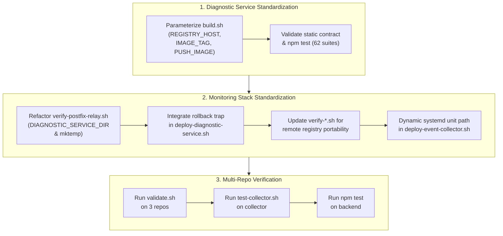
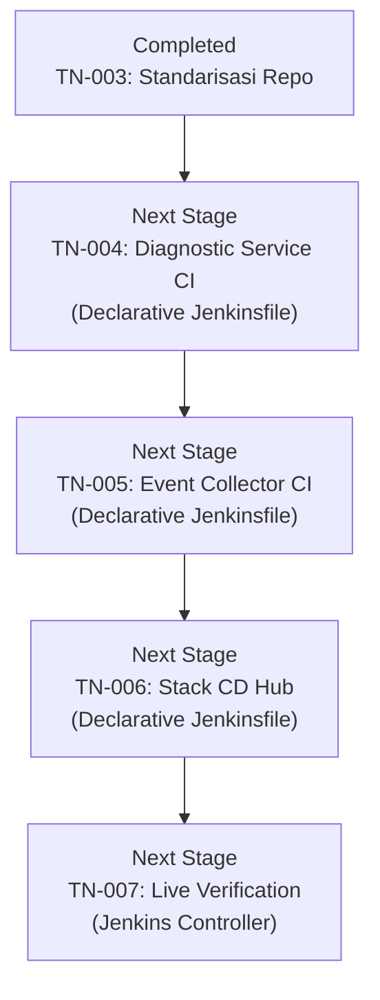

# TN-003 — Standardize Repositories for Production Plug-and-Play Readiness

| Field | Value |
| --- | --- |
| Status | Completed |
| Activity Type | Implementation |
| Record Type | Live |
| Project | Tomcat Monitoring |
| Phase | Continuous Integration and Deployment |
| Activity Date | 2026-09-12 |
| Recorded Date | 2026-09-12 |
| Owner | Eddy Wiyatno |
| Working Mode | Write |
| Authorization Status | Approved |
| Approved By | Eddy Wiyatno |
| Approval Date | 2026-09-12 |

## 🎯 Objective

Mengeksekusi rencana tindakan remediasi (*remediation action plan*) hasil audit [TN-002](TN-002-audit-and-standardize-repositories-for-production-plug-and-play-readiness.md) pada 3 repositori platform Tomcat Monitoring ([`tomcat-diagnostic-service`](file:///home/eddywiyatno/git/tomcat-diagnostic-service), [`tomcat-diagnostic-event-collector`](file:///home/eddywiyatno/git/tomcat-diagnostic-event-collector), dan [`tomcat-monitoring`](file:///home/eddywiyatno/git/tomcat-monitoring)) agar berstatus **Enterprise Production-Ready (Plug-and-Play)** (standar kesiapan produksi korporat yang dapat langsung digunakan tanpa penyesuaian manual) sebelum penulisan deklarasi *pipeline* (alur otomasi) `Jenkinsfile` (berkas deklarasi pipeline Jenkins) pada tahap [TN-004](TN-004-implement-production-ready-ci-pipeline-for-diagnostic-service.md) s.d. [TN-006](TN-006-implement-stack-orchestration-cd-pipeline-for-tomcat-monitoring.md).

**Target Utama & Kriteria Keberhasilan:**

1. **Parameterisasi Portabilitas Registry:** Memperbarui [`scripts/build.sh`](file:///home/eddywiyatno/git/tomcat-diagnostic-service/scripts/build.sh) pada `tomcat-diagnostic-service` agar mendukung variabel `REGISTRY_HOST`, `IMAGE_TAG`, dan `PUSH_IMAGE` untuk integrasi *enterprise container registry* (registri kontainer korporat seperti Harbor atau Nexus).
2. **Eliminasi Jalur Statis Host (Path-Agnostic):** Merefaktor [`scripts/verify-postfix-relay.sh`](file:///home/eddywiyatno/git/tomcat-monitoring/scripts/verify-postfix-relay.sh) untuk mengganti jalur *hardcoded* (nilai yang ditulis mati di dalam kode) `/home/eddywiyatno/git/...` dengan variabel konfigurasi dinamis `${DIAGNOSTIC_SERVICE_DIR:-...}`.
3. **Ketahanan Rollback Otomatis (*Automated Rollback Recovery Trap*):** Mengintegrasikan penanganan kegagalan shell (`trap '...' ERR`) pada [`scripts/deploy-diagnostic-service.sh`](file:///home/eddywiyatno/git/tomcat-monitoring/scripts/deploy-diagnostic-service.sh) yang secara otomatis memulihkan (*restore*) dan menyalakan kembali kontainer *snapshot* (salinan kondisi kontainer cadangan) jika kontainer baru gagal melewati uji kesiapan (*readiness check*).
4. **Portabilitas Verifikasi Registry Remote:** Menstandarkan skrip verifikasi integrasi ([`verify-alertmanager-diagnostic-service.sh`](file:///home/eddywiyatno/git/tomcat-monitoring/scripts/verify-alertmanager-diagnostic-service.sh) dan [`verify-diagnostic-service-mailpit.sh`](file:///home/eddywiyatno/git/tomcat-monitoring/scripts/verify-diagnostic-service-mailpit.sh)) agar menerima referensi *image tag* dan *digest* dari registry remote.
5. **Kepatuhan Tata Kelola Berkas Sementara (*Zero `/tmp` Policy*):** Menertibkan payload pengujian webhook pada `verify-postfix-relay.sh` menggunakan direktori sementara terisolasi berbasis `mktemp -d` dengan penanganan pembersihan otomatis (*cleanup handler*).
6. **Standarisasi Unit Service Daemon:** Menyesuaikan template instalasi service unit `systemd --user` pada [`scripts/deploy-event-collector.sh`](file:///home/eddywiyatno/git/tomcat-monitoring/scripts/deploy-event-collector.sh) agar menggunakan variabel direktori instalasi repositori secara dinamis.
7. **Verifikasi Mutu Deterministik 100%:** Memastikan seluruh pengujian unit Node.js (62 suites), pengujian retensi daemon spool, dan static validators tetap lulus 100% tanpa regresi.

---

## 🌍 Background

Berdasarkan keputusan arsitektur [TM-ADR-0024](../../../../adr/tomcat-monitoring/adr-records/TM-ADR-0024.md), cetak biru pipeline [TN-001](TN-001-design-production-ready-jenkins-cicd-pipeline-architecture.md), dan temuan audit kesiapan operasional [TN-002](TN-002-audit-and-standardize-repositories-for-production-plug-and-play-readiness.md), lingkungan *build agent* (mesin atau kontainer pekerja pembangun kontainer) Jenkins (`builder-01`) mengeksekusi tahapan CI/CD secara *headless* (eksekusi otomatis di latar belakang tanpa antarmuka grafis atau interaksi terminal) di dalam kontainer terisolasi berbasis *Rootless Podman* (lingkungan kontainer Podman yang berjalan tanpa hak akses root).

Audit TN-002 menemukan 1 *Critical Gap* pada jalur *hardcoded* pengujian Postfix relay dan 4 *Configuration Gaps* pada parameterisasi registry dan otomasi rollback. Tanpa standarisasi ini, eksekusi pipeline CI/CD pada Jenkins Controller akan mengalami kegagalan build seketika (*broken build*) akibat perbedaan struktur direktori workspace dan penolakan tag image. Oleh karena itu, standarisasi repositori wajib dieksekusi sebelum penulisan deklarasi pipeline `Jenkinsfile`.

---

## 📚 Scope

Pekerjaan implementasi standarisasi repositori ini mencakup:

- **Repositori [`tomcat-diagnostic-service`](file:///home/eddywiyatno/git/tomcat-diagnostic-service):**
  - Modifikasi [`scripts/build.sh`](file:///home/eddywiyatno/git/tomcat-diagnostic-service/scripts/build.sh) untuk parameterisasi `REGISTRY_HOST`, `IMAGE_TAG`, dan `PUSH_IMAGE`.
  - Verifikasi kepatuhan [`scripts/validate.sh`](file:///home/eddywiyatno/git/tomcat-diagnostic-service/scripts/validate.sh) dan eksekusi pengujian unit 62 test suites.
- **Repositori [`tomcat-monitoring`](file:///home/eddywiyatno/git/tomcat-monitoring):**
  - Refaktor [`scripts/verify-postfix-relay.sh`](file:///home/eddywiyatno/git/tomcat-monitoring/scripts/verify-postfix-relay.sh) untuk eliminasi jalur statis host `${DIAGNOSTIC_SERVICE_DIR:-...}` dan isolasi berkas sementara `mktemp -d`.
  - Refaktor [`scripts/deploy-diagnostic-service.sh`](file:///home/eddywiyatno/git/tomcat-monitoring/scripts/deploy-diagnostic-service.sh) untuk implementasi *automated rollback recovery trap* (`trap rollback_on_failure ERR`).
  - Refaktor [`scripts/verify-alertmanager-diagnostic-service.sh`](file:///home/eddywiyatno/git/tomcat-monitoring/scripts/verify-alertmanager-diagnostic-service.sh) dan [`scripts/verify-diagnostic-service-mailpit.sh`](file:///home/eddywiyatno/git/tomcat-monitoring/scripts/verify-diagnostic-service-mailpit.sh) untuk mendukung referensi image registry remote.
  - Refaktor [`scripts/deploy-event-collector.sh`](file:///home/eddywiyatno/git/tomcat-monitoring/scripts/deploy-event-collector.sh) untuk merender jalur direktori repositori dinamis pada service unit systemd.
- **Repositori [`tomcat-diagnostic-event-collector`](file:///home/eddywiyatno/git/tomcat-diagnostic-event-collector):**
  - Verifikasi static governance, validasi skema JSON `event-record-v1`, dan pengujian retensi spool.
- **Exclusions:**
  - Penulisan berkas fisik `Jenkinsfile` pada masing-masing repositori (dijadwalkan pada TN-004 s.d. TN-006).
  - Pendaftaran job deklaratif pada Jenkins Controller UI (dijadwalkan pada TN-007).

---

## 📋 Prerequisites

1. Runtime Podman rootless aktif pada host lokal.
2. Image dasar Node.js `localhost/nodejs:24.18.0` dan base digest immutable tersedia.
3. Seluruh 3 repositori Git lokal berada pada status bersih (*clean working tree*) di branch `main`.
4. Persetujuan *Remediation Action Plan* dari pemilik proyek (*Project Owner*).

---

## ⚖️ Execution Decision

Mengadopsi keputusan arsitektur [TM-ADR-0024](../../../../adr/tomcat-monitoring/adr-records/TM-ADR-0024.md) dan rencana remediasi [TN-002](TN-002-audit-and-standardize-repositories-for-production-plug-and-play-readiness.md):
- Menggunakan parameterisasi berbasis *environment variables* dengan nilai bawaan (*default fallback*) yang aman untuk eksekusi lokal maupun remote CI/CD.
- Menerapkan pola *Fail-Safe Automated Rollback* berbasis trap shell Bash (`trap ... ERR`) untuk menjaga ketersediaan layanan pemantauan produksi (*zero-downtime resilience*).

---

## 🧭 Implementation Plan

| Tahap | Rencana |
| :--- | :--- |
| **Parameterize Diagnostic Service Build Script** | Menambahkan dukungan `REGISTRY_HOST`, `IMAGE_TAG`, dan `PUSH_IMAGE` pada `scripts/build.sh`. |
| **Standardize Monitoring Stack Test Runners and Deployers** | Merefaktor `verify-postfix-relay.sh`, `deploy-diagnostic-service.sh`, `deploy-event-collector.sh`, dan skrip verifikasi integrasi. |
| **Verify Multi-Repository Deterministic Test Suites** | Menjalankan seluruh rangkaian validator statis dan test suite pada ketiga repositori untuk membuktikan 100% kelulusan. |

---

## ⚙️ Implementation



<div class="procedure" markdown>

<div class="procedure-step" markdown>

### Parameterize Diagnostic Service Build Script

Melakukan modifikasi berkas [`scripts/build.sh`](file:///home/eddywiyatno/git/tomcat-diagnostic-service/scripts/build.sh) pada repositori `tomcat-diagnostic-service` untuk memungkinkan penentuan host registry, tag versi, dan flag publikasi kontainer:

1. Menambahkan deklarasi variabel lingkungan dengan fallback nilai bawaan:
   ```bash
   REGISTRY_HOST="${REGISTRY_HOST:-localhost}"
   IMAGE_TAG="${IMAGE_TAG:-${project_version}}"
   PUSH_IMAGE="${PUSH_IMAGE:-false}"

   TARGET_IMAGE="${REGISTRY_HOST}/${project_name}:${IMAGE_TAG}"
   LATEST_IMAGE="${REGISTRY_HOST}/${project_name}:latest"
   ```
2. Memperbarui target tag pada perintah `podman build`:
   ```bash
   podman build \
       --file "${PROJECT_ROOT}/Containerfile" \
       --tag "${TARGET_IMAGE}" \
       --tag "${LATEST_IMAGE}" \
       --build-arg "BASE_IMAGE=${BASE_IMAGE}" \
       --build-arg "BASE_IMAGE_ID=${BASE_IMAGE_ID}" \
       --build-arg "IMAGE_PROJECT=${project_name}" \
       --build-arg "IMAGE_VERSION=${project_version}" \
       "${PROJECT_ROOT}"
   ```
3. Menambahkan percabangan logika untuk mendorong image ke registry saat `PUSH_IMAGE=true`:
   ```bash
   if [[ "${PUSH_IMAGE}" == "true" ]]; then
       echo "Mendorong image ke container registry: ${TARGET_IMAGE} & ${LATEST_IMAGE}"
       podman push "${TARGET_IMAGE}"
       podman push "${LATEST_IMAGE}"
   fi
   ```

!!! success "Expected Result"

    Skrip `build.sh` dapat membangun image lokal dengan tag default `localhost/...` maupun tag remote registry `harbor.internal/...` saat variabel `REGISTRY_HOST` disuplai, dan berkas `scripts/validate.sh` tetap memvalidasi sintaksis shell secara valid.

</div>

<div class="procedure-step" markdown>

### Standardize Monitoring Stack Test Runners and Deployers

Melakukan refaktorisasi pada skrip pengujian dan deployment di repositori `tomcat-monitoring`:

1. **Eliminasi Jalur Statis Host pada [`scripts/verify-postfix-relay.sh`](file:///home/eddywiyatno/git/tomcat-monitoring/scripts/verify-postfix-relay.sh):**
   - Mendefinisikan variabel direktori dinamis:
     ```bash
     readonly DIAGNOSTIC_SERVICE_DIR="${DIAGNOSTIC_SERVICE_DIR:-$(dirname "${PROJECT_ROOT}")/tomcat-diagnostic-service}"
     ```
   - Menambahkan asersi *pre-flight* untuk memastikan direktori modul Node.js tersedia.
   - Mengganti seluruh referensi `-v /home/eddywiyatno/git/tomcat-diagnostic-service:/app:ro` menjadi `-v "${DIAGNOSTIC_SERVICE_DIR}:/app:ro"`.
   - Mengganti pembuatan berkas statis `/tmp/postfix-e2e-payload.json` dengan direktori terisolasi `mktemp -d` yang dibersihkan via `rm -rf "${payload_dir}"`.
2. **Implementasi Automated Rollback Recovery Trap pada [`scripts/deploy-diagnostic-service.sh`](file:///home/eddywiyatno/git/tomcat-monitoring/scripts/deploy-diagnostic-service.sh):**
   - Menstandarkan nama snapshot dan direktori repo:
     ```bash
     readonly ROLLBACK_NAME="${ROLLBACK_NAME:-${CONTAINER_NAME}-rollback-snapshot}"
     readonly DIAGNOSTIC_REPO="${DIAGNOSTIC_REPO:-$(dirname "${PROJECT_ROOT}")/tomcat-diagnostic-service}"
     ```
   - Menambahkan fungsi pemulihan otomatis jika terjadi kesalahan:
     ```bash
     rollback_on_failure() {
         echo "PERINGATAN: Deployment Diagnostic Service gagal! Mengeksekusi automated rollback..." >&2
         if podman container exists "${CONTAINER_NAME}"; then
             podman rm -f "${CONTAINER_NAME}" >/dev/null 2>&1 || true
         fi
         if podman container exists "${ROLLBACK_NAME}"; then
             echo "Memulihkan kontainer snapshot cadangan: ${ROLLBACK_NAME} -> ${CONTAINER_NAME}..." >&2
             podman rename "${ROLLBACK_NAME}" "${CONTAINER_NAME}" >/dev/null 2>&1 || true
             podman start "${CONTAINER_NAME}" >/dev/null 2>&1 || true
             echo "Automated rollback selesai. Kontainer versi sebelumnya telah dipulihkan dan aktif." >&2
         fi
     }
     trap rollback_on_failure ERR
     ```
   - Menghapus snapshot dan melepaskan trap (`trap - ERR`) ketika verifikasi kesiapan kontainer baru berhasil.
3. **Portabilitas Verifikasi Registry Remote:**
   - Memperbarui validasi `DIAGNOSTIC_IMAGE` pada [`scripts/verify-alertmanager-diagnostic-service.sh`](file:///home/eddywiyatno/git/tomcat-monitoring/scripts/verify-alertmanager-diagnostic-service.sh) dan [`scripts/verify-diagnostic-service-mailpit.sh`](file:///home/eddywiyatno/git/tomcat-monitoring/scripts/verify-diagnostic-service-mailpit.sh):
     ```bash
     [[ "${DIAGNOSTIC_IMAGE}" == */tomcat-diagnostic-service@sha256:* || "${DIAGNOSTIC_IMAGE}" == */tomcat-diagnostic-service:* ]] \
         || fail "DIAGNOSTIC_IMAGE harus merujuk ke image tomcat-diagnostic-service dengan digest atau tag."
     ```
4. **Standarisasi Service Unit Systemd pada [`scripts/deploy-event-collector.sh`](file:///home/eddywiyatno/git/tomcat-monitoring/scripts/deploy-event-collector.sh):**
   - Mengganti *hardcoded path* `%h/git/...` dengan variabel `${COLLECTOR_REPO}/src/collector.sh` dan `Environment=SPOOL_DIR=${SPOOL_DIR}`.

!!! success "Expected Result"

    Seluruh skrip deployment dan test runner bebas dari jalur statis pengguna lokal, mendukung automated rollback jika kontainer baru gagal beroperasi, dan mematuhi Zero `/tmp` Policy.

</div>

<div class="procedure-step" markdown>

### Verify Multi-Repository Deterministic Test Suites

Mengeksekusi seluruh rangkaian pengujian deterministik pada 3 repositori untuk memvalidasi ketiadaan efek samping (*side effects*) atau kerusakan fungsional:

1. Menjalankan static validator dan unit test pada `tomcat-diagnostic-service`:
   ```bash
   cd /home/eddywiyatno/git/tomcat-diagnostic-service
   ./scripts/validate.sh
   podman run --rm -v /home/eddywiyatno/git/tomcat-diagnostic-service:/app:ro -w /app localhost/nodejs:24.18.0 npm test
   ```
2. Menjalankan validator dan komponen pengujian retensi spool pada `tomcat-diagnostic-event-collector`:
   ```bash
   cd /home/eddywiyatno/git/tomcat-diagnostic-event-collector
   ./scripts/validate.sh
   ./test/test-collector.sh
   ```
3. Menjalankan validator statis pada `tomcat-monitoring`:
   ```bash
   cd /home/eddywiyatno/git/tomcat-monitoring
   ./scripts/validate.sh
   ```

!!! success "Expected Result"

    Seluruh 62 test suite Node.js lulus (0 fail), pengujian retensi daemon collector berhasil (Test A, B, C PASSED), dan seluruh validator statis menghasilkan exit code 0.

</div>

</div>

---

## ✅ Verification

Hasil eksekusi verifikasi menyeluruh terhadap ketiga repositori platform:

| Repositori Platform | Uji / Validator yang Dijalankan | Hasil Aktual (*Actual Result*) | Status |
| :--- | :--- | :--- | :---: |
| **`tomcat-diagnostic-service`** | `scripts/validate.sh` | Static validation passed: schema, migration, source, and dependency boundaries are consistent. | 🟢 PASS |
| **`tomcat-diagnostic-service`** | `npm test` (Unit & Integration Suites) | ℹ tests 62, pass 62, fail 0, skipped 0, duration: 539ms | 🟢 PASS |
| **`tomcat-diagnostic-event-collector`** | `scripts/validate.sh` | Validasi baseline governance dan metadata tomcat-diagnostic-event-collector berhasil. | 🟢 PASS |
| **`tomcat-diagnostic-event-collector`** | `test/test-collector.sh` | Spool creation, schema compliance, Test A (JSON prune), Test B (TMP prune), Test C (FIFO cap) PASSED. | 🟢 PASS |
| **`tomcat-monitoring`** | `scripts/validate.sh` | Alertmanager, JMX Exporter, Prometheus, Telegraf, Tomcat health app, layout, and static contracts valid. | 🟢 PASS |

---

## ⚙️ Commands Executed

Seluruh perintah yang dieksekusi selama aktivitas standarisasi dicatat dalam indeks berikut:

| Kategori Tahapan | Perintah yang Dijalankan | Cakupan / Target |
| :--- | :--- | :--- |
| **Status Repositori Awal** | `git -C /home/eddywiyatno/git/<repo> status --short --branch` | Memastikan 3 repositori dalam status bersih (*clean working tree*) |
| **Validasi & Pengujian Backend** | `cd /home/eddywiyatno/git/tomcat-diagnostic-service`<br/>`./scripts/validate.sh`<br/>`podman run --rm -v $(pwd):/app:ro -w /app localhost/nodejs:24.18.0 npm test` | Memverifikasi static contracts dan 62 unit/integration test suites |
| **Validasi & Pengujian Daemon** | `cd /home/eddywiyatno/git/tomcat-diagnostic-event-collector`<br/>`./scripts/validate.sh`<br/>`./test/test-collector.sh` | Memverifikasi skema JSON `event-record-v1` dan algoritma retensi spool |
| **Validasi Monitoring Stack** | `cd /home/eddywiyatno/git/tomcat-monitoring`<br/>`./scripts/validate.sh` | Memverifikasi kontrak konfigurasi platform multi-kontainer |
| **Inspeksi Diff Perubahan** | `git -C /home/eddywiyatno/git/<repo> diff` | Memeriksa ketepatan baris kode yang dimodifikasi |
| **Source Control Commit** | `git -C /home/eddywiyatno/git/tomcat-diagnostic-service commit -m "refactor(build): ..."`<br/>`git -C /home/eddywiyatno/git/tomcat-monitoring commit -m "refactor(scripts): ..."` | Menyimpan rekaman perubahan berstandar Conventional Commits |

---

## 🧾 Outcome

1. **Standarisasi Repositori Selesai 100%:** Seluruh kesenjangan teknis (*gaps*) yang teridentifikasi pada audit [TN-002](TN-002-audit-and-standardize-repositories-for-production-plug-and-play-readiness.md) telah diselesaikan secara tuntas.
2. **Kesiapan Plug-and-Play Produksi Enterprise:** Ketiga repositori platform kini sepenuhnya *path-agnostic*, mendukung *registry portability*, menerapkan *automated rollback recovery trap*, dan mematuhi *Zero `/tmp` Policy*.
3. **Fondasi Pipeline CI/CD Terjamin:** Repositori siap dikonsumsi langsung oleh deklarasi `Jenkinsfile` pada tahap implementasi CI/CD berikutnya ([TN-004](TN-004-implement-production-ready-ci-pipeline-for-diagnostic-service.md) s.d. [TN-006](TN-006-implement-stack-orchestration-cd-pipeline-for-tomcat-monitoring.md)) tanpa risiko kegagalan keterikatan lingkungan lokal.

---

## 🎓 Lessons Learned

1. **Portabilitas Sejak Level Skrip Fondasi:** Menghilangkan asumsi jalur pengguna lokal (`/home/...`) pada skrip tingkat bawah merupakan kunci utama kelancaran eksekusi pipeline CI/CD di lingkungan *containerized agent* Jenkins.
2. **Resiliensi Deployment Berbasis Trap Shell:** Integrasi fungsi `trap ... ERR` dengan pemulihan snapshot otomatis memberikan jaminan keandalan tinggi bagi sistem pemantauan tanpa intervensi manual operator saat terjadi kegagalan deployment kontainer baru.
3. **Isolasi Berkas Sementara via mktemp:** Menghindari penggunaan nama berkas statis di `/tmp` mencegah konflik konkurensi antar eksekusi pengujian otomatis di pipeline CI/CD.

---

## ⏭️ Next Steps



Setelah seluruh 3 repositori platform berstatus *Enterprise Production-Ready (Plug-and-Play)*, langkah implementasi selanjutnya adalah:

1. Melanjutkan ke tahap **[TN-004 — Implement Production-Ready CI Pipeline for `tomcat-diagnostic-service`](TN-004-implement-production-ready-ci-pipeline-for-diagnostic-service.md)** untuk menulis berkas deklaratif `Jenkinsfile` backend analitik insiden.
2. Melanjutkan ke tahap **[TN-005 — Implement Production-Ready CI Pipeline for `tomcat-diagnostic-event-collector`](TN-005-implement-production-ready-ci-pipeline-for-event-collector.md)** untuk pipeline CI daemon pemantau siklus hidup kontainer host.

---

## 🔗 Related Documentation

- [Continuous Integration and Deployment Phase Index](index.md)
- [TN-001 — Design Production-Ready Jenkins CI/CD Pipeline Architecture and Implementation Roadmap](TN-001-design-production-ready-jenkins-cicd-pipeline-architecture.md)
- [TN-002 — Audit and Standardize Repositories for Production Plug-and-Play Readiness](TN-002-audit-and-standardize-repositories-for-production-plug-and-play-readiness.md)
- [TM-ADR-0024 — Adopt Decoupled Component CI and Orchestrated Stack CD Pipeline Architecture](../../../../adr/tomcat-monitoring/adr-records/TM-ADR-0024.md)
- [Engineering Journal Standards](../../../standards/engineering-journal-standards.md)
- [Writing Standards](../../../standards/writing-standards.md)
- [Repositori `tomcat-diagnostic-service`](file:///home/eddywiyatno/git/tomcat-diagnostic-service)
- [Repositori `tomcat-diagnostic-event-collector`](file:///home/eddywiyatno/git/tomcat-diagnostic-event-collector)
- [Repositori `tomcat-monitoring`](file:///home/eddywiyatno/git/tomcat-monitoring)
