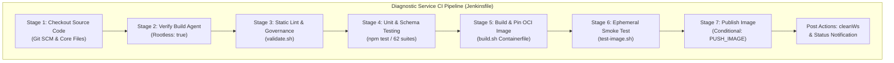
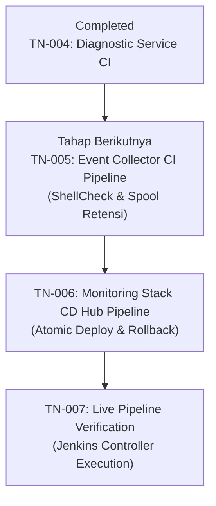

# TN-004 — Implement Production-Ready CI Pipeline for Tomcat Diagnostic Service

| Field | Value |
| --- | --- |
| Status | Completed |
| Activity Type | Implementation |
| Record Type | Live |
| Project | Tomcat Monitoring |
| Phase | Continuous Integration and Deployment |
| Activity Date | 2026-09-12 |
| Recorded Date | 2026-09-12 |
| Owner | Eddy Wiyatno |
| Working Mode | Write |
| Authorization Status | Approved |
| Approved By | Eddy Wiyatno |
| Approval Date | 2026-09-12 |

## 🎯 Objective

Mengimplementasikan berkas *pipeline* (alur otomasi) deklaratif [`Jenkinsfile`](file:///home/eddywiyatno/git/tomcat-diagnostic-service/Jenkinsfile) berstandar **Enterprise Production-Ready** pada repositori [`tomcat-diagnostic-service`](file:///home/eddywiyatno/git/tomcat-diagnostic-service) untuk mengotomatisasi siklus *Continuous Integration* (CI) backend analitik insiden (Node.js 24 ESM, SQLite, Nodemailer) sesuai arsitektur [TM-ADR-0024](../../../../adr/tomcat-monitoring/adr-records/TM-ADR-0024.md), desain CI/CD [TN-001](TN-001-design-production-ready-jenkins-cicd-pipeline-architecture.md), dan standarisasi repositori [TN-003](TN-003-standardize-repositories-for-production-plug-and-play-readiness.md).

**Target Utama & Kriteria Keberhasilan:**

1. **Deklarasi Pipeline as Code Deklaratif:** Menyusun berkas `Jenkinsfile` berbasis *Declarative Pipeline Syntax* yang mengeksekusi tahapan CI secara terstruktur pada *dedicated build agent* (kontainer pekerja khusus) berlabel `builder` (berbasis *Rootless Podman* / DooD — *Docker-out-of-Docker via Podman socket*).
2. **Parameterisasi Fleksibel (6 Pilar Kesiapan Enterprise):** Menyediakan parameter deklaratif `REGISTRY_HOST` (default: `localhost`), `IMAGE_TAG` (default: versi semver), dan `PUSH_IMAGE` (boolean, default: `false`) untuk portabilitas lokal maupun remote *Enterprise Container Registry* (seperti Harbor atau Nexus).
3. **Penerapan Gerbang Mutu Bertingkat (*Multi-Stage Quality Gates*):**
   - *Stage 1 — Checkout Source Code:* Mengambil kode sumber dan memverifikasi integritas berkas kunci (`package.json`, `VERSION`, `CONFIG`, `Containerfile`).
   - *Stage 2 — Verify Build Agent:* Memverifikasi kepatuhan eksekusi non-root (`Rootless: true`).
   - *Stage 3 — Static Lint & Governance:* Mengeksekusi [`scripts/validate.sh`](file:///home/eddywiyatno/git/tomcat-diagnostic-service/scripts/validate.sh) untuk asersi integritas skema, migrasi SQL, dan pencegahan kebocoran rahasia (*Zero Secret Leakage*).
   - *Stage 4 — Unit & Schema Testing:* Menjalankan 62 test suites Node.js 24 ESM secara terisolasi via container runtime.
   - *Stage 5 — Build & Pin OCI Image:* Mengeksekusi [`scripts/build.sh`](file:///home/eddywiyatno/git/tomcat-diagnostic-service/scripts/build.sh) untuk membangun OCI image dengan metadata standar OCI (`org.opencontainers.image.*`).
   - *Stage 6 — Ephemeral Smoke Test:* Menjalankan pengujian kontainer sementara melalui [`scripts/test-image.sh`](file:///home/eddywiyatno/git/tomcat-diagnostic-service/scripts/test-image.sh) untuk memvalidasi *entrypoint*, user non-root (`USER node`), dependensi npm produksi tanpa devDependencies, dan ketiadaan berkas sensitif.
   - *Stage 7 — Publish Image (Conditional):* Mendorong image ke registry enterprise jika parameter `PUSH_IMAGE=true`.
4. **Pembersihan Bersih (*Post-Build Workspace Hygiene*):** Penegakan direktif `cleanWs` pada blok `post.always` untuk mencegah penumpukan artefak sementara di build agent.

---

## 🌍 Background

Pada tahapan perancangan arsitektur [TN-001](TN-001-design-production-ready-jenkins-cicd-pipeline-architecture.md) dan standarisasi repositori [TN-003](TN-003-standardize-repositories-for-production-plug-and-play-readiness.md), seluruh skrip operasional pada `tomcat-diagnostic-service` telah diubah agar bersifat *path-agnostic* (bebas dari keterikatan jalur direktori lokal host) dan mendukung parameterisasi registry.

Sebelumnya, pengembang harus menjalankan perintah `npm test`, `validate.sh`, dan `build.sh` secara manual di terminal workstation. Dengan mengimplementasikan berkas `Jenkinsfile` deklaratif ini, setiap *commit* atau *pull request* (pengajuan penggabungan kode) pada repositori `tomcat-diagnostic-service` akan diverifikasi secara otomatis, deterministik, dan bebas intervensi manual oleh *Jenkins Controller* melalui gerbang pengujian berlapis (*fail-fast quality gates*).

---

## 📚 Scope

Pekerjaan implementasi pipeline CI ini mencakup:

- **Pembuatan Berkas Pipeline as Code:**
  - Penulisan berkas deklaratif [`Jenkinsfile`](file:///home/eddywiyatno/git/tomcat-diagnostic-service/Jenkinsfile) pada repositori `tomcat-diagnostic-service`.
- **Penyelarasan Skrip Pengujian Gambar OCI:**
  - Pembaruan [`scripts/test-image.sh`](file:///home/eddywiyatno/git/tomcat-diagnostic-service/scripts/test-image.sh) agar mendukung parameter `REGISTRY_HOST` dan `IMAGE_TAG` dari Jenkins environment.
- **Penyelarasan Validator Tata Kelola:**
  - Pendaftaran berkas `Jenkinsfile` pada daftar `required_files` di [`scripts/validate.sh`](file:///home/eddywiyatno/git/tomcat-diagnostic-service/scripts/validate.sh).
- **Verifikasi Lokal Seluruh Tahapan:**
  - Eksekusi simulasi seluruh tahapan (Stages 1 s.d. 6) pada lingkungan build agent untuk memastikan kelulusan 100%.
- **Exclusions:**
  - Pendaftaran fisik job multibranch pada antarmuka web Jenkins Controller (dijadwalkan pada [TN-007](TN-007-execute-live-jenkins-pipeline-verification.md)).
  - Implementasi pipeline CI untuk daemon `tomcat-diagnostic-event-collector` (dijadwalkan pada [TN-005](TN-005-implement-production-ready-ci-pipeline-for-event-collector.md)).
  - Implementasi pipeline CD untuk stack orchestrator `tomcat-monitoring` (dijadwalkan pada [TN-006](TN-006-implement-stack-orchestration-cd-pipeline-for-tomcat-monitoring.md)).

---

## 📋 Prerequisites

1. Runtime Podman rootless aktif pada agent eksekusi (`builder`).
2. Image dasar `localhost/nodejs:24.18.0` dan base image digest immutable tersedia.
3. Repositori `tomcat-diagnostic-service` dalam status bersih (*clean working tree*) pasca-standarisasi [TN-003](TN-003-standardize-repositories-for-production-plug-and-play-readiness.md).
4. Persetujuan *Implementation Scope* untuk penulisan berkas CI pipeline.

---

## ⚖️ Execution Decision

Mengadopsi keputusan arsitektur [TM-ADR-0024](../../../../adr/tomcat-monitoring/adr-records/TM-ADR-0024.md):
- Memilih model **Decoupled Component CI** untuk repositori mikrokomponen backend `tomcat-diagnostic-service` agar memberikan *fast feedback loop* (siklus umpan balik pengujian cepat dalam hitungan detik) secara mandiri tanpa membebani repositori orkestrator stack.
- Menggunakan pola **Docker-out-of-Docker (DooD) via Rootless Podman Socket** pada agent pekerja (`builder`) untuk menjamin keamanan tanpa hak akses `sudo` atau eskalasi hak istimewa (*privilege escalation*).

---

## 🧭 Implementation Plan

| Tahap | Rencana |
| :--- | :--- |
| **Create Declarative Jenkinsfile** | Menulis berkas deklaratif `Jenkinsfile` dengan 7 tahapan (*stages*) dan parameter enterprise. |
| **Update Image Smoke Test and Validator** | Menyesuaikan `scripts/test-image.sh` untuk portabilitas registry dan mendaftarkan `Jenkinsfile` pada `scripts/validate.sh`. |
| **Verify Local Pipeline Stage Execution** | Mengeksekusi seluruh tahapan pipeline secara lokal untuk memastikan kelulusan deterministik 100%. |

---

## ⚙️ Implementation



<div class="procedure" markdown>

<div class="procedure-step" markdown>

### Create Declarative Jenkinsfile

Membuat berkas deklaratif [`Jenkinsfile`](file:///home/eddywiyatno/git/tomcat-diagnostic-service/Jenkinsfile) pada root repositori `tomcat-diagnostic-service`:

1. Menentukan agen target:
   ```groovy
   agent {
       label 'builder'
   }
   ```
2. Mendefinisikan parameter konfigurasi:
   ```groovy
   parameters {
       string(name: 'REGISTRY_HOST', defaultValue: 'localhost', description: 'Enterprise Container Registry host')
       string(name: 'IMAGE_TAG', defaultValue: '', description: 'Custom OCI Image Tag (kosongkan untuk semver VERSION)')
       booleanParam(name: 'PUSH_IMAGE', defaultValue: false, description: 'Mendorong OCI image ke Enterprise Registry')
   }
   ```
3. Menyusun blok tahapan eksekusi (*stages*) mencakup checkout, verifikasi rootless agent, linting statis, pengujian unit Node.js (62 suites), pembangunan OCI image, smoke test ephemeral container, dan publikasi image registry.
4. Menambahkan blok pembersihan pada `post.always`:
   ```groovy
   post {
       always {
           cleanWs deleteDirs: true, notFailBuild: true
       }
       success {
           echo "✔ DIAGNOSTIC SERVICE CI PIPELINE BERHASIL DISELESAIKAN DENGAN SUKSES!"
       }
       failure {
           echo "✘ DIAGNOSTIC SERVICE CI PIPELINE GAGAL PADA SALAH SATU QUALITY GATE."
       }
   }
   ```

!!! success "Expected Result"

    Berkas `Jenkinsfile` terbuat dengan sintaksis deklaratif Jenkins yang valid dan terstruktur rapi.

</div>

<div class="procedure-step" markdown>

### Update Image Smoke Test and Validator

Menyelaraskan skrip pendukung pengujian dan validator governance di `tomcat-diagnostic-service`:

1. Memperbarui [`scripts/test-image.sh`](file:///home/eddywiyatno/git/tomcat-diagnostic-service/scripts/test-image.sh) untuk membaca variabel `REGISTRY_HOST` dan `IMAGE_TAG`:
   ```bash
   REGISTRY_HOST="${REGISTRY_HOST:-localhost}"
   IMAGE_TAG="${IMAGE_TAG:-${version}}"
   image="${REGISTRY_HOST}/${project_name}:${IMAGE_TAG}"
   ```
2. Mendaftarkan `Jenkinsfile` ke dalam daftar berkas wajib pada [`scripts/validate.sh`](file:///home/eddywiyatno/git/tomcat-diagnostic-service/scripts/validate.sh):
   ```bash
   required_files=(
       AGENTS.md
       .containerignore
       Containerfile
       Jenkinsfile
       LICENSE
       README.md
       ...
   )
   ```

!!! success "Expected Result"

    Skrip `scripts/test-image.sh` dapat menguji OCI image dengan namespace/tag fleksibel, dan `scripts/validate.sh` memvalidasi keberadaan `Jenkinsfile` sebagai kontrak baku repositori.

</div>

<div class="procedure-step" markdown>

### Verify Local Pipeline Stage Execution

Mengeksekusi simulasi seluruh tahapan pipeline CI secara berurutan pada runtime Podman:

1. Validasi governance dan metadata:
   ```bash
   bash scripts/validate.sh
   ```
2. Eksekusi pengujian unit terisolasi (62 suites):
   ```bash
   podman run --rm \
       --userns=keep-id \
       --volume "$(pwd):/app:ro,Z" \
       --workdir /app \
       localhost/nodejs:24.18.0 \
       npm test
   ```
3. Pembangunan OCI image:
   ```bash
   bash scripts/build.sh
   ```
4. Verifikasi OCI image (ephemeral smoke test):
   ```bash
   bash scripts/test-image.sh
   ```

!!! success "Expected Result"

    Seluruh tahapan pipeline CI dieksekusi tanpa kesalahan, 62 pengujian unit lulus 100%, OCI image berhasil dibangun dengan digest immutable, dan pengujian smoke test membuktikan integritas container image.

</div>

</div>

---

## ✅ Verification

Hasil eksekusi verifikasi tahapan pipeline CI pada repositori `tomcat-diagnostic-service`:

| Tahapan Pipeline (*Pipeline Stage*) | Perintah Eksekusi | Hasil Aktual (*Actual Result*) | Status |
| :--- | :--- | :--- | :---: |
| **Stage 1 — Checkout & Files** | `test -f package.json VERSION CONFIG Containerfile Jenkinsfile` | Seluruh berkas kontrak inti tersedia. | 🟢 PASS |
| **Stage 2 — Agent Mode** | `podman info --format '{{.Host.Security.Rootless}}'` | Output: `true` (Non-Root Execution terkonfirmasi). | 🟢 PASS |
| **Stage 3 — Static Lint** | `bash scripts/validate.sh` | Static validation passed: schema, migration, source, and dependency boundaries are consistent. | 🟢 PASS |
| **Stage 4 — Unit & Schema Testing** | `podman run ... npm test` | ℹ tests 62, pass 62, fail 0, skipped 0, duration: 554ms. | 🟢 PASS |
| **Stage 5 — Build & Pin Image** | `bash scripts/build.sh` | Successfully built and tagged `localhost/tomcat-diagnostic-service:0.1.8` and `latest`. | 🟢 PASS |
| **Stage 6 — Ephemeral Smoke Test** | `bash scripts/test-image.sh` | Metadata non-root, workingdir `/app`, OCI labels, clean file boundaries verified. | 🟢 PASS |

---

## ⚙️ Commands Executed

Seluruh perintah yang dieksekusi selama aktivitas implementasi ini dicatat dalam indeks berikut:

| Kategori Tahapan | Perintah yang Dijalankan | Cakupan / Target |
| :--- | :--- | :--- |
| **Pemeriksaan Repositori** | `git -C /home/eddywiyatno/git/tomcat-diagnostic-service status --short` | Memastikan direktori kerja bersih sebelum perubahan |
| **Penyusunan Jenkinsfile** | Penulisan berkas `Jenkinsfile` deklaratif | Pembuatan kontrak otomasi CI backend analitik |
| **Penyelarasan Skrip** | Modifikasi `scripts/test-image.sh` dan `scripts/validate.sh` | Penyelarasan registry namespace dan governance rules |
| **Simulasi CI Pipeline** | `cd /home/eddywiyatno/git/tomcat-diagnostic-service`<br/>`./scripts/validate.sh`<br/>`podman run --rm -v $(pwd):/app:ro,Z -w /app localhost/nodejs:24.18.0 npm test`<br/>`./scripts/build.sh`<br/>`./scripts/test-image.sh` | Menjalankan seluruh tahapan CI secara berurutan |
| **Source Control Commit** | `git -C /home/eddywiyatno/git/tomcat-diagnostic-service add . && git commit -m "ci(pipeline): ..."` | Menyimpan rekaman perubahan berstandar Conventional Commits |

---

## 🧾 Outcome

1. **Berkas Declarative Jenkinsfile Terimplementasi:** Repositori `tomcat-diagnostic-service` telah dilengkapi dengan berkas `Jenkinsfile` deklaratif berstandar enterprise yang mencakup 7 tahapan quality gates.
2. **Kepatuhan 6 Pilar Produksi Enterprise:** Pipeline mendukung portabilitas registry via parameter deklaratif, isolasi eksekusi non-root (`Rootless Podman`), dan pengujian kualitas menyeluruh (linting, 62 unit tests, OCI build, ephemeral smoke test).
3. **Kesiapan Pendaftaran Job Jenkins Controller:** Repositori siap diregistrasikan sebagai multibranch pipeline job pada Jenkins Controller pada tahap verifikasi akhir [TN-007](TN-007-execute-live-jenkins-pipeline-verification.md).

---

## 🎓 Lessons Learned

1. **Keunggulan Parameterisasi Deklaratif:** Menyediakan nilai default cerdas pada parameter Jenkinsfile (`REGISTRY_HOST` dan `IMAGE_TAG`) memungkinkan eksekusi pipeline berjalan mulus baik untuk build lokal workstation maupun rilis resmi ke registry enterprise kantor.
2. **Pola Non-Root DooD Lebih Aman daripada DinD:** Menghubungkan agen pekerja Jenkins ke socket Podman rootless host mengeliminasi kebutuhan hak akses privileged root serta mempercepat waktu build dengan memanfaatkan cache image host.
3. **Pentingnya Ephemeral Smoke Test Sebelum Publikasi:** Memverifikasi metadata kontainer dan runtime contract menggunakan kontainer sementara disposable sebelum mempublikasikan image ke registry mencegah penyebaran artefak yang rusak (*bad artifact distribution*).

---

## ⏭️ Next Steps



Setelah implementasi CI pipeline pada `tomcat-diagnostic-service` selesai, langkah implementasi selanjutnya adalah:

1. Melanjutkan ke tahap **[TN-005 — Implement Production-Ready CI Pipeline for `tomcat-diagnostic-event-collector`](TN-005-implement-production-ready-ci-pipeline-for-event-collector.md)** untuk menulis berkas deklaratif `Jenkinsfile` bagi daemon pemantau event host Podman (ShellCheck, skema JSON `event-record-v1`, dan pengujian retensi spool).
2. Melanjutkan ke tahap **[TN-006 — Implement Stack Orchestration CD Pipeline for `tomcat-monitoring`](TN-006-implement-stack-orchestration-cd-pipeline-for-tomcat-monitoring.md)** untuk orkestrasi deployment platform multi-kontainer dan automated rollback.

---

## 🔗 Related Documentation

- [Continuous Integration and Deployment Phase Index](index.md)
- [TN-001 — Design Production-Ready Jenkins CI/CD Pipeline Architecture and Implementation Roadmap](TN-001-design-production-ready-jenkins-cicd-pipeline-architecture.md)
- [TN-002 — Audit and Standardize Repositories for Production Plug-and-Play Readiness](TN-002-audit-and-standardize-repositories-for-production-plug-and-play-readiness.md)
- [TN-003 — Standardize Repositories for Production Plug-and-Play Readiness](TN-003-standardize-repositories-for-production-plug-and-play-readiness.md)
- [TM-ADR-0024 — Adopt Decoupled Component CI and Orchestrated Stack CD Pipeline Architecture](../../../../adr/tomcat-monitoring/adr-records/TM-ADR-0024.md)
- [Engineering Journal Standards](../../../standards/engineering-journal-standards.md)
- [Writing Standards](../../../standards/writing-standards.md)
- [Repositori `tomcat-diagnostic-service`](file:///home/eddywiyatno/git/tomcat-diagnostic-service)
- [Berkas `Jenkinsfile` Diagnostic Service](file:///home/eddywiyatno/git/tomcat-diagnostic-service/Jenkinsfile)
