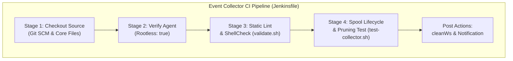
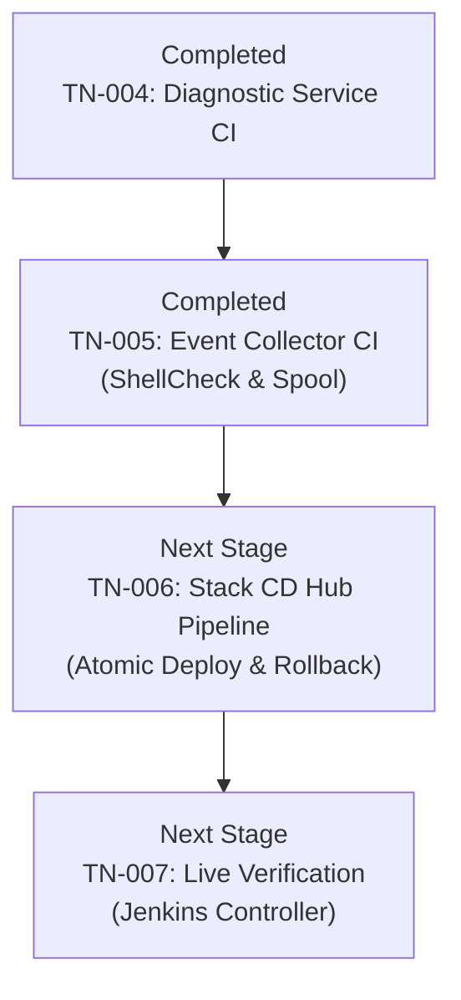

# TN-005 — Implement Production-Ready CI Pipeline for Tomcat Diagnostic Event Collector

| Field | Value |
| --- | --- |
| Status | Completed |
| Activity Type | Implementation |
| Record Type | Live |
| Project | Tomcat Monitoring |
| Phase | Continuous Integration and Deployment |
| Activity Date | 2026-09-12 |
| Recorded Date | 2026-09-12 |
| Owner | Eddy Wiyatno |
| Working Mode | Write |
| Authorization Status | Approved |
| Approved By | Eddy Wiyatno |
| Approval Date | 2026-09-12 |

## 🎯 Objective

Mengimplementasikan berkas *pipeline* (alur otomasi pengiriman) deklaratif [`Jenkinsfile`](file:///home/eddywiyatno/git/tomcat-diagnostic-event-collector/Jenkinsfile) berstandar **Enterprise Production-Ready** pada repositori [`tomcat-diagnostic-event-collector`](file:///home/eddywiyatno/git/tomcat-diagnostic-event-collector) guna mengotomatisasi siklus *Continuous Integration* (CI) *daemon* (layanan latar belakang sistem) pengawas *event* kontainer host (Bash 5.0, Podman events stream, dan skema JSON `event-record-v1`) sesuai arsitektur [TM-ADR-0024](../../../../adr/tomcat-monitoring/adr-records/TM-ADR-0024.md), desain CI/CD [TN-001](TN-001-design-production-ready-jenkins-cicd-pipeline-architecture.md), dan standarisasi repositori [TN-003](TN-003-standardize-repositories-for-production-plug-and-play-readiness.md).

**Target Utama & Kriteria Keberhasilan:**

1. **Deklarasi Pipeline as Code:** Menyusun berkas `Jenkinsfile` berbasis *Declarative Pipeline Syntax* yang mengeksekusi tahapan CI secara terstruktur pada *dedicated build agent* (agen pekerja build khusus) berlabel `builder` (berbasis *Rootless Podman* / DooD — *Docker-out-of-Docker via Podman socket*).
2. **Gerbang Mutu Bertingkat (*Quality Gates*):** Mengintegrasikan 4 tahapan *quality gates* (gerbang pengujian mutu bertingkat) berurutan secara otomatis mencakup Checkout Source Code, Verifikasi Non-Root Build Agent, Static Lint & ShellCheck Governance ([`scripts/validate.sh`](file:///home/eddywiyatno/git/tomcat-diagnostic-event-collector/scripts/validate.sh)), dan Spool Lifecycle & Pruning Test ([`test/test-collector.sh`](file:///home/eddywiyatno/git/tomcat-diagnostic-event-collector/test/test-collector.sh)).
3. **Penyelarasan Tata Kelola Repositori:** Memperbarui validator tata kelola [`scripts/validate.sh`](file:///home/eddywiyatno/git/tomcat-diagnostic-event-collector/scripts/validate.sh) untuk mewajibkan keberadaan berkas `Jenkinsfile` dalam array `required_files`.
4. **Pembersihan Bersih (*Post-Build Workspace Hygiene*):** Penegakan direktif `cleanWs` pada blok `post.always` untuk menjamin *workspace hygiene* (kebersihan ruang kerja pasca-build) tanpa meninggalkan artefak sementara di build agent.

---

## 🌍 Background

Pada tahapan perancangan arsitektur [TN-001](TN-001-design-production-ready-jenkins-cicd-pipeline-architecture.md) dan standarisasi repositori [TN-003](TN-003-standardize-repositories-for-production-plug-and-play-readiness.md), seluruh skrip operasional pada `tomcat-diagnostic-event-collector` telah distandarisasi untuk mendukung pengujian *headless* (tanpa antarmuka grafis) yang deterministik serta penegakan batas retensi spool host (*Zero Unbounded Spool*).

Sebelumnya, pengembang harus menjalankan perintah `validate.sh` dan `test-collector.sh` secara manual di terminal workstation. Dengan mengimplementasikan berkas `Jenkinsfile` deklaratif ini, setiap *commit* (rekaman perubahan) atau *pull request* (pengajuan penggabungan kode) pada repositori `tomcat-diagnostic-event-collector` akan diverifikasi secara otomatis, deterministik, dan bebas intervensi manual oleh *Jenkins Controller* melalui gerbang pengujian berlapis (*fail-fast quality gates*).

---

## 📚 Scope

Pekerjaan implementasi pipeline CI ini mencakup:

- **Pembuatan Berkas Pipeline as Code:**
  - Penulisan berkas deklaratif [`Jenkinsfile`](file:///home/eddywiyatno/git/tomcat-diagnostic-event-collector/Jenkinsfile) pada root repositori `tomcat-diagnostic-event-collector`.
- **Penyelarasan Validator Tata Kelola:**
  - Pendaftaran berkas `Jenkinsfile` pada daftar `required_files` di [`scripts/validate.sh`](file:///home/eddywiyatno/git/tomcat-diagnostic-event-collector/scripts/validate.sh).
- **Verifikasi Lokal Seluruh Tahapan:**
  - Eksekusi simulasi seluruh tahapan (Stages 1 s.d. 4) pada lingkungan build agent untuk memastikan kelulusan 100%.
- **Exclusions:**
  - Pendaftaran fisik job multibranch pada antarmuka web Jenkins Controller (dijadwalkan pada [TN-007](TN-007-execute-live-jenkins-pipeline-verification.md)).
  - Implementasi pipeline CD untuk stack orchestrator `tomcat-monitoring` (dijadwalkan pada [TN-006](TN-006-implement-stack-orchestration-cd-pipeline-for-tomcat-monitoring.md)).

---

## 📋 Prerequisites

1. Runtime Podman rootless aktif pada agent eksekusi (`builder`).
2. Toolchain `bash` ($\ge 5.0$), `python3`, dan `podman` tersedia pada lingkungan agent.
3. Repositori `tomcat-diagnostic-event-collector` dalam status bersih (*clean working tree*) pasca-standarisasi [TN-003](TN-003-standardize-repositories-for-production-plug-and-play-readiness.md).
4. Persetujuan *Implementation Scope* untuk penulisan berkas CI pipeline.

---

## ⚖️ Execution Decision

Mengadopsi keputusan arsitektur [TM-ADR-0024](../../../../adr/tomcat-monitoring/adr-records/TM-ADR-0024.md):
- Memilih model **Decoupled Component CI** untuk repositori mikrokomponen *host daemon* `tomcat-diagnostic-event-collector` agar memberikan *fast feedback loop* (siklus umpan balik pengujian cepat dalam hitungan detik) secara mandiri tanpa membebani repositori orkestrator stack.
- Menggunakan pola **Docker-out-of-Docker (DooD) via Rootless Podman Socket** pada agent pekerja (`builder`) untuk menjamin keamanan tanpa hak akses `sudo` atau eskalasi hak istimewa (*privilege escalation*).

---

## 🧭 Implementation Plan

| Tahap | Rencana |
| :--- | :--- |
| **Create Declarative Jenkinsfile** | Menulis berkas deklaratif `Jenkinsfile` dengan 4 tahapan (*stages*) quality gates dan penanganan *post-build workspace hygiene*. |
| **Update Repository Governance Validator** | Mendaftarkan berkas `Jenkinsfile` ke dalam daftar `required_files` pada `scripts/validate.sh`. |
| **Verify Local Pipeline Stage Execution** | Mengeksekusi seluruh tahapan pipeline secara lokal untuk memastikan kelulusan deterministik 100% dan mencatat commit ke Git. |

---

## ⚙️ Implementation



<div class="procedure" markdown>

<div class="procedure-step" markdown>

### Create Declarative Jenkinsfile

Membuat berkas deklaratif [`Jenkinsfile`](file:///home/eddywiyatno/git/tomcat-diagnostic-event-collector/Jenkinsfile) pada root repositori `tomcat-diagnostic-event-collector`:

1. Menentukan agen target:
   ```groovy
   agent {
       label 'builder'
   }
   ```
2. Mendefinisikan variabel lingkungan:
   ```groovy
   environment {
       PROJECT_NAME = 'tomcat-diagnostic-event-collector'
   }
   ```
3. Menyusun blok tahapan eksekusi (*stages*) mencakup checkout dan verifikasi berkas kunci, verifikasi lingkungan agent rootless, validasi tata kelola statis & ShellCheck, serta pengujian siklus hidup dan pemangkasan direktori spool host.
4. Menambahkan blok pembersihan pada `post.always`:
   ```groovy
   post {
       always {
           cleanWs deleteDirs: true, notFailBuild: true
       }
       success {
           echo "✔ TOMCAT EVENT COLLECTOR CI PIPELINE BERHASIL DISELESAIKAN DENGAN SUKSES!"
       }
       failure {
           echo "✘ TOMCAT EVENT COLLECTOR CI PIPELINE GAGAL PADA SALAH SATU QUALITY GATE."
       }
   }
   ```

!!! success "Expected Result"

    Berkas `Jenkinsfile` terbuat dengan sintaksis deklaratif Jenkins yang valid dan terstruktur rapi.

</div>

<div class="procedure-step" markdown>

### Update Repository Governance Validator

Menyelaraskan skrip validator tata kelola di `tomcat-diagnostic-event-collector`:

1. Mendaftarkan `Jenkinsfile` ke dalam daftar berkas wajib pada [`scripts/validate.sh`](file:///home/eddywiyatno/git/tomcat-diagnostic-event-collector/scripts/validate.sh):
   ```bash
   required_files=(
       AGENTS.md
       .gitignore
       Jenkinsfile
       README.md
       PROJECT
       VERSION
       CONFIG
       config/README.md
       config/schemas/event-record-v1.schema.json
       scripts/validate.sh
       src/collector.sh
       test/test-collector.sh
   )
   ```

!!! success "Expected Result"

    Skrip `scripts/validate.sh` memvalidasi keberadaan berkas `Jenkinsfile` sebagai kontrak baku repositori.

</div>

<div class="procedure-step" markdown>

### Verify Local Pipeline Stage Execution

Mengeksekusi simulasi seluruh tahapan pipeline CI secara berurutan pada lingkungan lokal:

1. Validasi tata kelola baseline dan skema JSON:
   ```bash
   bash scripts/validate.sh
   ```
2. Eksekusi pengujian siklus hidup spool dan retensi kuota FIFO:
   ```bash
   bash test/test-collector.sh
   ```
3. Melakukan commit perubahan ke sistem kontrol versi Git:
   ```bash
   git add Jenkinsfile scripts/validate.sh
   git commit -m "ci(pipeline): implement declarative jenkinsfile and governance validation"
   ```

!!! success "Expected Result"

    Seluruh tahapan pipeline CI dieksekusi tanpa kesalahan, pengujian unit spool dan pemangkasan lulus 100%, serta perubahan tercatat rapi pada riwayat Git.

</div>

</div>

---

## ✅ Verification

Hasil eksekusi verifikasi tahapan pipeline CI pada repositori `tomcat-diagnostic-event-collector`:

| Tahapan Pipeline (*Pipeline Stage*) | Perintah Eksekusi | Hasil Aktual (*Actual Result*) | Status |
| :--- | :--- | :--- | :---: |
| **Stage 1 — Checkout & Core Files** | `test -f src/collector.sh test/test-collector.sh scripts/validate.sh CONFIG VERSION PROJECT AGENTS.md README.md Jenkinsfile` | Seluruh 9 berkas kontrak inti tersedia. | 🟢 PASS |
| **Stage 2 — Agent Mode & Toolchain** | `podman info --format '{{.Host.Security.Rootless}}'` | Output: `true` (Non-Root Execution terkonfirmasi). | 🟢 PASS |
| **Stage 3 — Static Lint & Governance** | `bash scripts/validate.sh` | Validasi baseline governance dan metadata tomcat-diagnostic-event-collector berhasil. | 🟢 PASS |
| **Stage 4 — Spool Lifecycle & Pruning Test** | `bash test/test-collector.sh` | Spool perms 0700, JSON perms 0600, Schema valid, Pruning Test A/B/C passed. Collector Component Test PASSED. | 🟢 PASS |

---

## ⚙️ Commands Executed

Seluruh perintah yang dieksekusi selama aktivitas implementasi ini dicatat dalam indeks berikut:

| Kategori Tahapan | Perintah yang Dijalankan | Cakupan / Target |
| :--- | :--- | :--- |
| **Pemeriksaan Repositori** | `git -C /home/eddywiyatno/git/tomcat-diagnostic-event-collector status` | Memastikan direktori kerja bersih sebelum perubahan |
| **Penyusunan Jenkinsfile** | Penulisan berkas `Jenkinsfile` deklaratif | Pembuatan kontrak otomasi CI daemon event collector |
| **Penyelarasan Validator** | Modifikasi `scripts/validate.sh` | Pendaftaran `Jenkinsfile` ke array `required_files` |
| **Simulasi CI Pipeline** | `cd /home/eddywiyatno/git/tomcat-diagnostic-event-collector`<br/>`./scripts/validate.sh`<br/>`./test/test-collector.sh` | Menjalankan seluruh tahapan CI secara berurutan |
| **Source Control Commit** | `git -C /home/eddywiyatno/git/tomcat-diagnostic-event-collector add Jenkinsfile scripts/validate.sh && git commit -m "ci(pipeline): ..."` | Menyimpan rekaman perubahan berstandar Conventional Commits |

---

## 🧾 Outcome

1. **Berkas Declarative Jenkinsfile Terimplementasi:** Repositori `tomcat-diagnostic-event-collector` telah dilengkapi dengan berkas `Jenkinsfile` deklaratif berstandar enterprise yang mencakup 4 tahapan *quality gates*.
2. **Kepatuhan Tata Kelola Enterprise:** Pipeline memverifikasi kepatuhan isolasi eksekusi non-root (`Rootless Podman`), validitas skema JSON telemetry (`event-record-v1.schema.json`), dan pembuktian batas kapasitas spool host (*Zero Unbounded Spool*).
3. **Kesiapan Pendaftaran Job Jenkins Controller:** Repositori siap diregistrasikan sebagai multibranch pipeline job pada Jenkins Controller pada tahap verifikasi akhir [TN-007](TN-007-execute-live-jenkins-pipeline-verification.md).

---

## 🎓 Lessons Learned

1. **Pemisahan Pipeline Micro-daemon dari OCI Build:** Komponen yang beroperasi sebagai *host daemon* tidak memerlukan tahapan pembuatan OCI image (`buildah build`) atau publikasi ke registry, melainkan difokuskan pada analisis statis dan simulasi siklus hidup berkas spool.
2. **Pengujian Siklus Retensi Spool Terisolasi:** Menggunakan utilitas `mktemp -d` dengan *trap handler* `rm -rf` menjamin pengujian retensi berkas spool berjalan aman dan tidak mencemari direktori pengguna host maupun direktori bersama `/tmp`.
3. **Pentingnya Pemeriksaan Berkas Wajib (*Required Files Governance*):** Memasukkan `Jenkinsfile` ke dalam validator `scripts/validate.sh` memastikan kontrak Pipeline as Code tidak terhapus secara tidak sengaja pada pengembangan selanjutnya.

---

## ⏭️ Next Steps



Setelah implementasi CI pipeline pada `tomcat-diagnostic-event-collector` selesai, langkah implementasi selanjutnya adalah:

1. Melanjutkan ke tahap **[TN-006 — Implement Stack Orchestration CD Pipeline for `tomcat-monitoring`](TN-006-implement-stack-orchestration-cd-pipeline-for-tomcat-monitoring.md)** untuk mengimplementasikan alur orkestrasi deployment platform multi-kontainer, integrasi network Podman `devops-lab`, validasi konfigurasi Prometheus/Alertmanager/Postfix, dan mekanisme *automated rollback*.
2. Melanjutkan ke tahap **[TN-007 — Execute and Verify End-to-End CI/CD Pipelines in Jenkins Controller](TN-007-execute-live-jenkins-pipeline-verification.md)** untuk registrasi job multibranch, eksekusi build live, dan pembuktian skenario insiden secara otomatis.

---

## 🔗 Related Documentation

- [Continuous Integration and Deployment Phase Index](index.md)
- [TN-001 — Design Production-Ready Jenkins CI/CD Pipeline Architecture and Implementation Roadmap](TN-001-design-production-ready-jenkins-cicd-pipeline-architecture.md)
- [TN-002 — Audit and Standardize Repositories for Production Plug-and-Play Readiness](TN-002-audit-and-standardize-repositories-for-production-plug-and-play-readiness.md)
- [TN-003 — Standardize Repositories for Production Plug-and-Play Readiness](TN-003-standardize-repositories-for-production-plug-and-play-readiness.md)
- [TN-004 — Implement Production-Ready CI Pipeline for Tomcat Diagnostic Service](TN-004-implement-production-ready-ci-pipeline-for-diagnostic-service.md)
- [TM-ADR-0024 — Adopt Decoupled Component CI and Orchestrated Stack CD Pipeline Architecture](../../../../adr/tomcat-monitoring/adr-records/TM-ADR-0024.md)
- [Engineering Journal Standards](../../../standards/engineering-journal-standards.md)
- [Writing Standards](../../../standards/writing-standards.md)
- [Repositori `tomcat-diagnostic-event-collector`](file:///home/eddywiyatno/git/tomcat-diagnostic-event-collector)
- [Berkas `Jenkinsfile` Event Collector](file:///home/eddywiyatno/git/tomcat-diagnostic-event-collector/Jenkinsfile)
