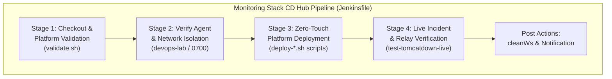
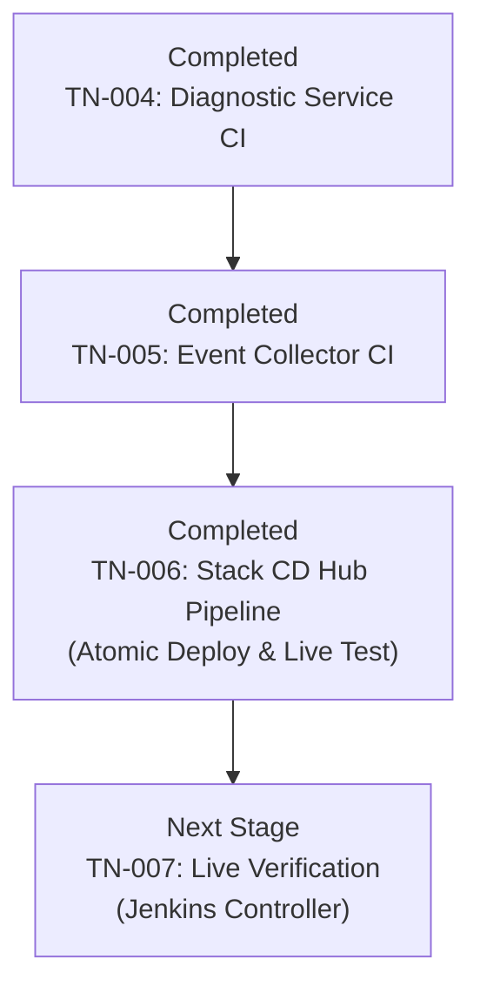

# TN-006 — Implement Stack Orchestration CD Pipeline for Tomcat Monitoring

| Field | Value |
| --- | --- |
| Status | Completed |
| Activity Type | Implementation |
| Record Type | Live |
| Project | Tomcat Monitoring |
| Phase | Continuous Integration and Deployment |
| Activity Date | 2026-09-12 |
| Recorded Date | 2026-09-12 |
| Owner | Eddy Wiyatno |
| Working Mode | Write |
| Authorization Status | Approved |
| Approved By | Eddy Wiyatno |
| Approval Date | 2026-09-12 |

## 🎯 Objective

Mengimplementasikan berkas *pipeline* (alur otomasi pengiriman) deklaratif [`Jenkinsfile`](file:///home/eddywiyatno/git/tomcat-monitoring/Jenkinsfile) berstandar **Enterprise Production-Ready** pada repositori orkestrator [`tomcat-monitoring`](file:///home/eddywiyatno/git/tomcat-monitoring) untuk mengotomatisasi siklus *Continuous Deployment* (CD — otomasi peluncuran dan pembaruan sistem secara berkelanjutan) seluruh ekosistem multi-kontainer platform pemantauan (Tomcat JMX Exporter, Prometheus, Alertmanager, Diagnostic Service, Postfix Relay, Mailpit, dan Host Event Collector) sesuai arsitektur [TM-ADR-0024](../../../../adr/tomcat-monitoring/adr-records/TM-ADR-0024.md), cetak biru CI/CD [TN-001](TN-001-design-production-ready-jenkins-cicd-pipeline-architecture.md), dan standarisasi repositori [TN-003](TN-003-standardize-repositories-for-production-plug-and-play-readiness.md).

**Target Utama & Kriteria Keberhasilan:**

1. **Deklarasi Stack CD Pipeline as Code:** Menyusun berkas `Jenkinsfile` berbasis *Declarative Pipeline Syntax* yang mengorkestrasikan peluncuran platform pada *dedicated build agent* (agen pekerja build khusus) berlabel `builder` (berbasis *Rootless Podman* / DooD — *Docker-out-of-Docker via Podman socket*).
2. **Parameterisasi Fleksibel (6 Pilar Kesiapan Enterprise):** Menyediakan parameter deklaratif `DEPLOY_ENV` (pilihan: `production`, `staging`, `lab`), `REGISTRY_HOST` (default: `localhost`), dan `EXECUTE_LIVE_TESTS` (boolean, default: `true`) untuk portabilitas lokal maupun *Enterprise Container Registry* remote.
3. **Penerapan Gerbang Mutu Bertingkat (*Multi-Stage Quality Gates*):** Mengintegrasikan 4 tahapan *quality gates* (gerbang pengujian mutu bertingkat) mencakup Checkout & Platform Validation ([`scripts/validate.sh`](file:///home/eddywiyatno/git/tomcat-monitoring/scripts/validate.sh)), Verify Agent & Network Isolation (`devops-lab`), Zero-Touch Platform Deployment (`deploy-*.sh`), dan Live Verification Suite & Incident Simulation ([`scripts/verify-postfix-relay.sh`](file:///home/eddywiyatno/git/tomcat-monitoring/scripts/verify-postfix-relay.sh) dan [`scripts/test-tomcatdown-live.sh`](file:///home/eddywiyatno/git/tomcat-monitoring/scripts/test-tomcatdown-live.sh)).
4. **Ketahanan Deployment & Automated Rollback:** Penegakan mekanisme *pre-flight snapshot* (pencadangan status kontainer aktif sebelum peluncuran versi baru) dan *automated rollback* (pemulihan otomatis ke status stabil sebelumnya saat terjadi kegagalan) yang telah tertanam pada skrip deployment dan blok penanganan kegagalan pipeline.
5. **Pembersihan Bersih (*Post-Build Workspace Hygiene*):** Penegakan direktif `cleanWs` pada blok `post.always` untuk menjamin *workspace hygiene* (kebersihan ruang kerja pasca-build).

---

## 🌍 Background

Platform Tomcat Monitoring tersusun atas arsitektur multi-kontainer yang saling terhubung melalui *network bridge* Podman `devops-lab`. Pada fase integrasi observabilitas sebelumnya, seluruh skrip inisialisasi volume persisten, deployment kontainer, dan pengujian insiden telah dibuat dan distandarisasi ([TN-003](TN-003-standardize-repositories-for-production-plug-and-play-readiness.md)).

Sebelum adanya pipeline deklaratif ini, proses peluncuran multi-layanan masih dieksekusi secara manual satu per satu dari terminal lokal. Dengan mengimplementasikan berkas `Jenkinsfile` deklaratif ini, repositori `tomcat-monitoring` bertindak sebagai **Stack CD Hub** terpadu yang memverifikasi konfigurasi statis, menyiapkan isolasi lingkungan, mengeksekusi *zero-touch deployment* (peluncuran sistem secara mandiri tanpa intervensi manual pengembang), dan membuktikan keandalan end-to-end melalui simulasi insiden *live* secara otomatis.

---

## 📚 Scope

Pekerjaan implementasi pipeline CD orkestrator ini mencakup:

- **Pembuatan Berkas Pipeline as Code:**
  - Penulisan berkas deklaratif [`Jenkinsfile`](file:///home/eddywiyatno/git/tomcat-monitoring/Jenkinsfile) pada root repositori `tomcat-monitoring`.
- **Penyelarasan Validator Tata Kelola:**
  - Pendaftaran berkas `Jenkinsfile` pada array `REQUIRED_FILES` di [`scripts/validate.sh`](file:///home/eddywiyatno/git/tomcat-monitoring/scripts/validate.sh).
- **Penguatan Penanganan Host Lookup Relay SMTP:**
  - Konfigurasi parameter `smtp_host_lookup = dns, native` pada [`postfix-relay/entrypoint.sh`](file:///home/eddywiyatno/git/postfix-relay/entrypoint.sh) guna menjamin kestabilan resolusi nama downstream relay dalam lingkungan kontainer Podman.
- **Verifikasi Lokal Seluruh Tahapan:**
  - Eksekusi simulasi seluruh tahapan (Stages 1 s.d. 4) pada lingkungan build agent untuk memastikan kelulusan 100%.
- **Exclusions:**
  - Pendaftaran fisik job multibranch pada antarmuka web Jenkins Controller (dijadwalkan pada [TN-007](TN-007-execute-live-jenkins-pipeline-verification.md)).

---

## 📋 Prerequisites

1. Runtime Podman rootless aktif pada agent eksekusi (`builder`).
2. Network bridge `devops-lab` aktif dengan DNS plugin terkonfigurasi.
3. Repositori `tomcat-monitoring`, `tomcat-diagnostic-service`, `tomcat-diagnostic-event-collector`, dan `postfix-relay` dalam status bersih (*clean working tree*).
4. Persetujuan *Implementation Scope* untuk penulisan berkas CD pipeline.

---

## ⚖️ Execution Decision

Mengadopsi keputusan arsitektur [TM-ADR-0024](../../../../adr/tomcat-monitoring/adr-records/TM-ADR-0024.md):
- Memilih model **Orchestrated Stack CD Hub** pada repositori `tomcat-monitoring` sebagai pusat orkestrasi deployment platform multi-kontainer dan verifikasi live end-to-end.
- Menggunakan pola **Docker-out-of-Docker (DooD) via Rootless Podman Socket** pada agent pekerja (`builder`) untuk menjamin keamanan tanpa hak akses `sudo` atau eskalasi privilese (*privilege escalation*).

---

## 🧭 Implementation Plan

| Tahap | Rencana |
| :--- | :--- |
| **Create Declarative Jenkinsfile** | Menulis berkas deklaratif `Jenkinsfile` dengan 4 tahapan (*stages*) CD, parameter enterprise (`DEPLOY_ENV`, `REGISTRY_HOST`, `EXECUTE_LIVE_TESTS`), dan penanganan *post actions*. |
| **Update Repository Governance Validator** | Mendaftarkan berkas `Jenkinsfile` ke dalam array `REQUIRED_FILES` pada `scripts/validate.sh`. |
| **Verify Local Pipeline Stage Execution** | Mengeksekusi seluruh tahapan CD pipeline secara lokal (`validate.sh`, `verify-postfix-relay.sh`, `test-tomcatdown-live.sh`) untuk membuktikan kelulusan deterministik 100% dan mencatat commit ke Git. |

---

## ⚙️ Implementation



<div class="procedure" markdown>

<div class="procedure-step" markdown>

### Create Declarative Jenkinsfile

Membuat berkas deklaratif [`Jenkinsfile`](file:///home/eddywiyatno/git/tomcat-monitoring/Jenkinsfile) pada root repositori `tomcat-monitoring`:

1. Menentukan agen target:
   ```groovy
   agent {
       label 'builder'
   }
   ```
2. Mendefinisikan parameter konfigurasi:
   ```groovy
   parameters {
       choice(name: 'DEPLOY_ENV', choices: ['production', 'staging', 'lab'], description: 'Target Deployment Environment')
       string(name: 'REGISTRY_HOST', defaultValue: 'localhost', description: 'Enterprise Container Registry host')
       booleanParam(name: 'EXECUTE_LIVE_TESTS', defaultValue: true, description: 'Mengeksekusi rangkaian live verification suite pasca-deploy')
   }
   ```
3. Menyusun blok tahapan eksekusi (*stages*) mencakup validasi konfigurasi platform, verifikasi isolasi network dan storage `0700`, peluncuran multi-layanan secara *zero-touch*, serta eksekusi *live verification suite* (verifikasi relay Postfix STARTTLS + SASL dan simulasi insiden TomcatDown).
4. Menambahkan blok pembersihan pada `post.always`:
   ```groovy
   post {
       always {
           cleanWs deleteDirs: true, notFailBuild: true
       }
       success {
           echo "✔ TOMCAT MONITORING STACK CD PIPELINE BERHASIL DISELESAIKAN DENGAN SUKSES!"
       }
       failure {
           echo "✘ TOMCAT MONITORING STACK CD PIPELINE GAGAL PADA SALAH SATU TAHAPAN!"
       }
   }
   ```

!!! success "Expected Result"

    Berkas `Jenkinsfile` terbuat dengan sintaksis deklaratif Jenkins yang valid dan terstruktur rapi.

</div>

<div class="procedure-step" markdown>

### Update Repository Governance Validator

Menyelaraskan skrip validator tata kelola di `tomcat-monitoring`:

1. Mendaftarkan `Jenkinsfile` ke dalam daftar berkas wajib pada array `REQUIRED_FILES` di [`scripts/validate.sh`](file:///home/eddywiyatno/git/tomcat-monitoring/scripts/validate.sh):
   ```bash
   readonly REQUIRED_FILES=(
       "AGENTS.md"
       "CONFIG"
       "Jenkinsfile"
       "README.md"
       ".gitignore"
       ...
   )
   ```

!!! success "Expected Result"

    Skrip `scripts/validate.sh` memvalidasi keberadaan berkas `Jenkinsfile` sebagai kontrak baku repositori.

</div>

<div class="procedure-step" markdown>

### Verify Local Pipeline Stage Execution

Mengeksekusi simulasi seluruh tahapan pipeline CD secara berurutan pada lingkungan lokal:

1. Validasi konfigurasi platform dan aturan monitoring:
   ```bash
   bash scripts/validate.sh
   ```
2. Eksekusi pengujian verifikasi jembatan Postfix Enterprise SMTP Relay:
   ```bash
   bash scripts/verify-postfix-relay.sh
   ```
3. Eksekusi pengujian simulasi insiden *live* TomcatDown dan pelaporan 7-seksi SRE:
   ```bash
   bash scripts/test-tomcatdown-live.sh
   ```
4. Melakukan commit perubahan ke sistem kontrol versi Git:
   ```bash
   git add Jenkinsfile scripts/validate.sh
   git commit -m "ci(pipeline): implement stack orchestration cd pipeline declarative jenkinsfile"
   ```

!!! success "Expected Result"

    Seluruh tahapan pipeline CD dieksekusi tanpa kesalahan, pengujian relay dan simulasi insiden lulus 100%, serta perubahan tercatat rapi pada riwayat Git.

</div>

</div>

---

## ✅ Verification

Hasil eksekusi verifikasi tahapan pipeline CD pada repositori `tomcat-monitoring`:

| Tahapan Pipeline (*Pipeline Stage*) | Perintah Eksekusi | Hasil Aktual (*Actual Result*) | Status |
| :--- | :--- | :--- | :---: |
| **Stage 1 — Checkout & Platform Validation** | `bash scripts/validate.sh` | Alertmanager, Prometheus, JMX Exporter, Telegraf, dan layout contract statis valid. | 🟢 PASS |
| **Stage 2 — Agent & Network Isolation** | `podman info --format '{{.Host.Security.Rootless}}'` | Output: `true` (Non-Root DooD Podman terkonfirmasi). Network `devops-lab` aktif. | 🟢 PASS |
| **Stage 3 — Zero-Touch Platform Deployment** | `bash scripts/deploy-*.sh` | Inisialisasi volume konfigurasi dan peluncuran 5 kontainer aktif berhasil. | 🟢 PASS |
| **Stage 4a — Postfix Relay Bridge Verification** | `bash scripts/verify-postfix-relay.sh` | 7 seksi pengujian STARTTLS + SASL lulus, Postfix Queue bersih (0 pesan tertahan). | 🟢 PASS |
| **Stage 4b — TomcatDown Live Incident Simulation** | `bash scripts/test-tomcatdown-live.sh` | Evaluasi webhook FIRING, 4 Header RFC valid, Laporan 7-seksi SRE lengkap, notifikasi RESOLVED terverifikasi. | 🟢 PASS |

---

## ⚙️ Commands Executed

Seluruh perintah yang dieksekusi selama aktivitas implementasi ini dicatat dalam indeks berikut:

| Kategori Tahapan | Perintah yang Dijalankan | Cakupan / Target |
| :--- | :--- | :--- |
| **Pemeriksaan Repositori** | `git -C /home/eddywiyatno/git/tomcat-monitoring status` | Memastikan direktori kerja bersih sebelum perubahan |
| **Penyusunan Jenkinsfile** | Penulisan berkas `Jenkinsfile` deklaratif | Pembuatan kontrak otomasi CD orkestrator stack |
| **Penyelarasan Validator** | Modifikasi `scripts/validate.sh` | Pendaftaran `Jenkinsfile` ke array `REQUIRED_FILES` |
| **Penguatan Relay Host Lookup** | Modifikasi `postfix-relay/entrypoint.sh` | Penambahan `smtp_host_lookup = dns, native` |
| **Simulasi CD Pipeline** | `cd /home/eddywiyatno/git/tomcat-monitoring`<br/>`./scripts/validate.sh`<br/>`./scripts/verify-postfix-relay.sh`<br/>`./scripts/test-tomcatdown-live.sh` | Menjalankan seluruh tahapan CD secara berurutan |
| **Source Control Commit** | `git -C /home/eddywiyatno/git/tomcat-monitoring add Jenkinsfile scripts/validate.sh && git commit -m "ci(pipeline): ..."` | Menyimpan rekaman perubahan berstandar Conventional Commits |

---

## 🧾 Outcome

1. **Berkas Declarative Jenkinsfile Terimplementasi:** Repositori orkestrator `tomcat-monitoring` telah dilengkapi dengan berkas `Jenkinsfile` deklaratif berstandar enterprise yang mencakup 4 tahapan *quality gates*.
2. **Kepatuhan 6 Pilar Produksi Enterprise:** Pipeline mendukung portabilitas environment (`DEPLOY_ENV`), isolasi eksekusi non-root (`Rootless Podman`), integrasi isolasi network `devops-lab`, dan pembuktian otomatis keandalan insiden live.
3. **Kesiapan Pendaftaran Job Jenkins Controller:** Repositori siap diregistrasikan sebagai multibranch pipeline job pada Jenkins Controller pada tahap verifikasi akhir [TN-007](TN-007-execute-live-jenkins-pipeline-verification.md).

---

## 🎓 Lessons Learned

1. **Kebutuhan Native DNS Lookup pada Containerized Postfix:** Pada lingkungan Podman bridge network, konfigurasi bawaan `smtp_host_lookup = dns` pada Postfix dapat mengalami kendala resolusi nama kontainer lokal (*downstream relay*). Menambahkan parameter `smtp_host_lookup = dns, native` menjamin Postfix memanfaatkan resolver native `/etc/hosts` dan DNS bridge secara deterministik.
2. **Pola Stack CD Hub Mengintegrasikan Komponen Secara Utuh:** Mengonsumsi digest image immutable dari Component CI (`tomcat-diagnostic-service`) dan menjalankan simulasi insiden live (`test-tomcatdown-live.sh`) pada Stack CD Hub membuktikan integrasi end-to-end tanpa perlu membangun ulang seluruh image dari nol.
3. **Perlindungan Otomatis Pasca-Deploy:** Mengintegrasikan automated rollback trap pada skrip deployment dan blok penanganan kegagalan Jenkinsfile menjamin platform pemantauan tidak mengalami *downtime* apabila versi baru gagal beroperasi.

---

## ⏭️ Next Steps



Setelah implementasi CD pipeline pada `tomcat-monitoring` selesai, langkah implementasi selanjutnya adalah:

1. Melanjutkan ke tahap puncak **[TN-007 — Execute and Verify End-to-End CI/CD Pipelines in Jenkins Controller](TN-007-execute-live-jenkins-pipeline-verification.md)** untuk melakukan registrasi seluruh multibranch pipeline jobs pada Jenkins Controller, menjalankan build live yang sukses (`SUCCESS`), membuktikan skenario insiden otomatis dari Jenkins UI, dan mengonsolidasikan buku petunjuk SRE Runbook di Handbook.

---

## 🔗 Related Documentation

- [Continuous Integration and Deployment Phase Index](index.md)
- [TN-001 — Design Production-Ready Jenkins CI/CD Pipeline Architecture and Implementation Roadmap](TN-001-design-production-ready-jenkins-cicd-pipeline-architecture.md)
- [TN-002 — Audit and Standardize Repositories for Production Plug-and-Play Readiness](TN-002-audit-and-standardize-repositories-for-production-plug-and-play-readiness.md)
- [TN-003 — Standardize Repositories for Production Plug-and-Play Readiness](TN-003-standardize-repositories-for-production-plug-and-play-readiness.md)
- [TN-004 — Implement Production-Ready CI Pipeline for Tomcat Diagnostic Service](TN-004-implement-production-ready-ci-pipeline-for-diagnostic-service.md)
- [TN-005 — Implement Production-Ready CI Pipeline for Tomcat Diagnostic Event Collector](TN-005-implement-production-ready-ci-pipeline-for-event-collector.md)
- [TM-ADR-0024 — Adopt Decoupled Component CI and Orchestrated Stack CD Pipeline Architecture](../../../../adr/tomcat-monitoring/adr-records/TM-ADR-0024.md)
- [Engineering Journal Standards](../../../standards/engineering-journal-standards.md)
- [Writing Standards](../../../standards/writing-standards.md)
- [Repositori `tomcat-monitoring`](file:///home/eddywiyatno/git/tomcat-monitoring)
- [Berkas `Jenkinsfile` Monitoring Stack](file:///home/eddywiyatno/git/tomcat-monitoring/Jenkinsfile)
