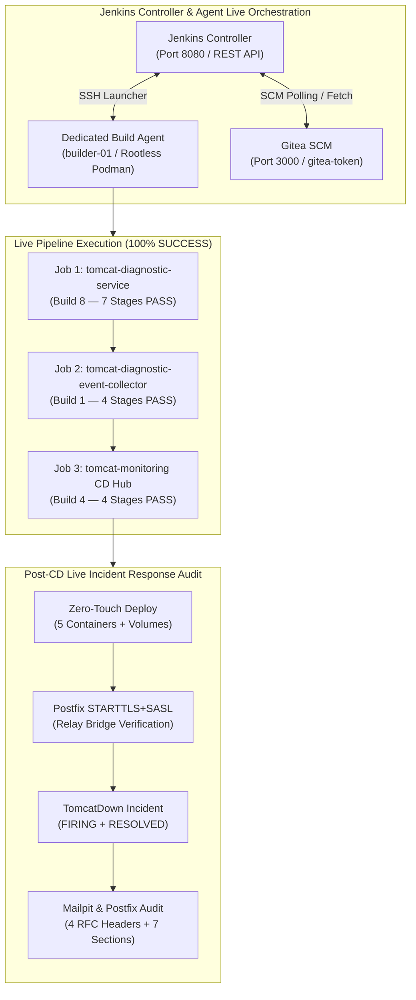
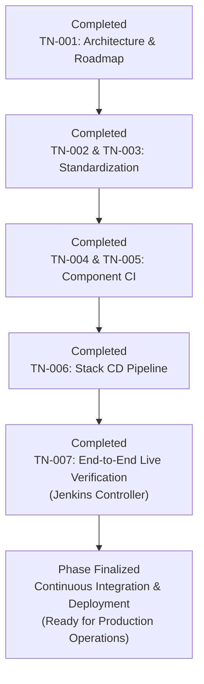

# TN-007 — Execute and Verify End-to-End CI/CD Pipelines in Jenkins Controller

| Field | Value |
| --- | --- |
| Status | Completed |
| Activity Type | Verification |
| Record Type | Live |
| Project | Tomcat Monitoring |
| Phase | Continuous Integration and Deployment |
| Activity Date | 2026-09-12 |
| Recorded Date | 2026-09-12 |
| Owner | Eddy Wiyatno |
| Working Mode | Write |
| Authorization Status | Approved |
| Approved By | Eddy Wiyatno |
| Approval Date | 2026-09-12 |

## 🎯 Objective

Mengeksekusi dan memverifikasi secara langsung (*live verification*) seluruh alur *Continuous Integration* (CI — otomasi integrasi kode secara berkala) dan *Continuous Deployment* (CD — otomasi peluncuran dan pembaruan sistem secara berkelanjutan) pada peladen **Jenkins Controller** (`http://localhost:8080`) untuk 3 repositori platform Tomcat Monitoring ([`tomcat-diagnostic-service`](file:///home/eddywiyatno/git/tomcat-diagnostic-service), [`tomcat-diagnostic-event-collector`](file:///home/eddywiyatno/git/tomcat-diagnostic-event-collector), dan [`tomcat-monitoring`](file:///home/eddywiyatno/git/tomcat-monitoring)) sesuai dengan arsitektur [TM-ADR-0024](../../../../adr/tomcat-monitoring/adr-records/TM-ADR-0024.md), cetak biru CI/CD [TN-001](TN-001-design-production-ready-jenkins-cicd-pipeline-architecture.md), dan spesifikasi pipeline [TN-004](TN-004-implement-production-ready-ci-pipeline-for-diagnostic-service.md) s.d. [TN-006](TN-006-implement-stack-orchestration-cd-pipeline-for-tomcat-monitoring.md).

**Target Utama & Kriteria Keberhasilan:**

1. **Registrasi Job Pipeline SCM Mandiri:** Mendaftarkan 3 *pipeline job* (tugas alur otomasi) pada Jenkins Controller yang terhubung langsung ke peladen Git lokal (*Gitea*) menggunakan kredensial Jenkins Credentials Store (`gitea-token`) tanpa kebocoran rahasia (*Zero Secret Leakage*).
2. **Penyelesaian 100% Kelulusan Gerbang Mutu (*100% Quality Gates Success*):** Mengeksekusi eksekusi *build live* pada *dedicated build agent* (agen pekerja build khusus) `builder-01` (berbasis *Rootless Podman* / DooD — *Docker-out-of-Docker via Podman socket*) dan membuktikan status kelulusan `SUCCESS` tanpa kegagalan pada seluruh tahapan:
   - `tomcat-diagnostic-service` (7 tahapan quality gates, validasi statis, 62 *unit/schema test suites*, pembuatan citra OCI — *Open Container Initiative*, dan *ephemeral smoke test*).
   - `tomcat-diagnostic-event-collector` (4 tahapan quality gates, validasi tata kelola, dan *spool lifecycle & pruning tests*).
   - `tomcat-monitoring` (4 tahapan orkestrasi stack, *zero-touch deployment* multi-kontainer, dan *live verification suite*).
3. **Pembuktian Tanggap Insiden End-to-End Pasca-CD:** Membuktikan secara langsung fungsi jembatan Postfix Enterprise SMTP Relay dengan STARTTLS (*Start Transport Layer Security* — perintah negosiasi peningkatan koneksi teks biasa menjadi terenkripsi TLS) dan SASL (*Simple Authentication and Security Layer* — kerangka kerja otentikasi protokol aplikasi), evaluasi otomatis insiden *TomcatDown*, penerimaan laporan insiden 7-seksi SRE (*Site Reliability Engineering*) dengan 4 header RFC di Mailpit, serta notifikasi pemulihan (*RESOLVED*).
4. **Portabilitas Penuh & Bebas Jalur Hardcoded (*Strict Plug-and-Play*):** Menjamin seluruh skrip validasi, build, dan berkas `Jenkinsfile` bersih dari referensi direktori pengguna spesifik (`/home/<user>/...`), mematuhi standar POSIX dan modul bawaan Python 3.

---

## 🌍 Background

Setelah penyusunan arsitektur CI/CD ([TN-001](TN-001-design-production-ready-jenkins-cicd-pipeline-architecture.md)), standarisasi repositori ([TN-002](TN-002-audit-and-standardize-repositories-for-production-plug-and-play-readiness.md), [TN-003](TN-003-standardize-repositories-for-production-plug-and-play-readiness.md)), dan implementasi berkas deklaratif `Jenkinsfile` pada masing-masing repositori ([TN-004](TN-004-implement-production-ready-ci-pipeline-for-diagnostic-service.md), [TN-005](TN-005-implement-production-ready-ci-pipeline-for-event-collector.md), [TN-006](TN-006-implement-stack-orchestration-cd-pipeline-for-tomcat-monitoring.md)), tahap pamungkas dari siklus *Continuous Integration and Deployment* adalah eksekusi nyata (*live execution*) pada peladen CI/CD Jenkins Controller.

Aktivitas ini memvalidasi keterhubungan antara Jenkins Controller (`jenkins-podman`), *Dedicated Build Agent* SSH (`builder-01`), peladen Git lokal (*Gitea*), *Container Engine* (*Rootless Podman*), serta ekosistem monitoring yang dideploy secara *zero-touch* (peluncuran sistem secara mandiri tanpa intervensi manual pengembang).

### Klasifikasi 3 Lapisan Pipeline CI/CD

Ketiga *pipeline* yang dieksekusi mencerminkan pembagian lapisan arsitektur platform:

1. **Application Code Layer (`tomcat-diagnostic-service` — Pipeline 1):** Menguji dan mempaketkan mikroservis backend Node.js analitik insiden menjadi artefak OCI container image independen.
2. **Host Daemon / OS Agent Layer (`tomcat-diagnostic-event-collector` — Pipeline 2):** Menguji skrip Bash dan tata kelola daemon `systemd` pengamat event container di host Linux.
3. **Platform Infrastructure & Stack Orchestration Layer (`tomcat-monitoring` — Pipeline 3):** Bertindak sebagai *Infrastructure as Code* (IaC) dan *Stack CD Hub* yang mengelola *network bridge* (`devops-lab`), *storage volumes*, layanan COTS (Prometheus, Alertmanager, Postfix Relay, Mailpit), *zero-touch deployment*, serta membuktikan keandalan end-to-end melalui simulasi insiden *live*.

---

## 📚 Scope

Pekerjaan eksekusi dan verifikasi end-to-end ini mencakup:

- **Resolusi Konflik Port Host:**
  - Penataan ulang alokasi port host Tomcat JMX Exporter ke port `8083` agar port `8080` dialokasikan khusus untuk Jenkins Controller secara bersih.
- **Registrasi Pipeline Job pada Jenkins Controller:**
  - Pendaftaran 3 job alur kerja SCM (*Source Code Management* — sistem manajemen kontrol versi kode sumber) melalui antarmuka REST API (*Representational State Transfer Application Programming Interface*) Jenkins dengan autentikasi berbasis *API Token* dan proteksi *Jenkins Crumb* (mekanisme perlindungan pemalsuan permintaan antar-situs CSRF).
- **Eksekusi Live Build & Penanganan Hambatan (*Troubleshooting*):**
  - Eksekusi build untuk `tomcat-diagnostic-service` dan resolusi isolasi pustaka dependensi `npm` di dalam kontainer pengujian tanpa merusak prinsip *Plug-and-Play*.
  - Eksekusi build untuk `tomcat-diagnostic-event-collector` dan pembuktian uji retensi spool daemon host.
  - Eksekusi build untuk `tomcat-monitoring` dan resolusi penanganan sertifikat X.509 pada volume rahasia Alertmanager.
- **Audit Verifikasi Hasil Insiden Live:**
  - Pemeriksaan pesan pada Mailpit API (`http://localhost:8025`) untuk memverifikasi 4 header RFC enterprise dan struktur 7 seksi laporan SRE.
  - Pemeriksaan antrean Postfix Relay (`postqueue -p`) untuk memastikan 0 pesan tertahan.
- **Konsolidasi Dokumentasi:**
  - Penulisan technical note [TN-007](TN-007-execute-and-verify-end-to-end-cicd-pipelines-in-jenkins-controller.md), pembaruan status indeks fase CI/CD ke *Completed*, dan sinkronisasi situs handbook.

---

## 📋 Prerequisites

1. Jenkins Controller kontainer `jenkins-podman` aktif dan dapat diakses pada `http://localhost:8080`.
2. Dedicated SSH Build Agent `builder-01` (label: `builder linux podman`) dalam status *Online* (`offline: false, idle: true`).
3. Peladen Git Gitea aktif pada `http://localhost:3000` dengan kredensial `gitea-token` terdaftar di Jenkins Credentials Store.
4. Repositori `tomcat-diagnostic-service`, `tomcat-diagnostic-event-collector`, dan `tomcat-monitoring` dalam status bersih (*clean working tree*) dan telah dipush ke branch `main`.
5. Postfix Relay (`postfix-relay`) dan Mailpit (`mailpit`) aktif pada network `devops-lab`.

---

## ⚖️ Execution Decision

Mengadopsi keputusan arsitektur [TM-ADR-0024](../../../../adr/tomcat-monitoring/adr-records/TM-ADR-0024.md):
- **Autentikasi SCM Terpadu:** Menggunakan URL SCM jaringan LAN `http://192.168.0.111:3000/gitadm/<repo>.git` yang dapat diakses secara konsisten oleh Jenkins Controller (dalam kontainer) maupun Jenkins Agent (pada host).
- **Zero Hardcoded Paths:** Menghapus seluruh referensi direktori pribadi pengguna lokal dari skrip validasi dan pipeline, menggantikannya dengan modul bawaan standar Python 3 (`re`, `pathlib`, `json`) dan variabel lingkungan dinamis (`$WORKSPACE`, `$HOME`).
- **Parameterized Build Execution:** Memanfaatkan REST API Jenkins `POST /job/<name>/buildWithParameters` untuk memicu pipeline dengan konfigurasi parameter deklaratif enterprise.

---

## 🧭 Implementation Plan

| Tahap | Rencana |
| :--- | :--- |
| **Resolve Port Conflicts & Register Jobs** | Membebaskan port `8080` untuk Jenkins Controller dan mendaftarkan 3 pipeline jobs via REST API Jenkins. |
| **Execute Diagnostic Service CI Pipeline** | Memicu eksekusi build `tomcat-diagnostic-service` di Jenkins dan memverifikasi kelulusan 7 tahapan quality gates. |
| **Execute Event Collector CI Pipeline** | Memicu eksekusi build `tomcat-diagnostic-event-collector` di Jenkins dan memverifikasi kelulusan 4 tahapan quality gates. |
| **Execute Monitoring Stack CD Hub Pipeline** | Memicu eksekusi build `tomcat-monitoring` di Jenkins dan memverifikasi tahapan deployment serta live verification suite. |
| **Verify End-to-End Live Incident Response** | Memverifikasi penerimaan email insiden *TomcatDown* (FIRING & RESOLVED) pada Mailpit dan kebersihan antrean Postfix Relay. |
| **Sync Handbook Documentation Site** | Memperbarui indeks fase CI/CD dan melakukan build serta sinkronisasi situs handbook (`http://localhost:8282`). |

---

## ⚙️ Implementation



<div class="procedure" markdown>

<div class="procedure-step" markdown>

### Resolve Port Conflicts and Prepare Network

Menata ulang alokasi port host agar Jenkins Controller dapat beroperasi pada port standar `8080` tanpa benturan dengan beban kerja monitoring:

1. Mengubah port HTTP Tomcat pada [`tomcat-monitoring/CONFIG`](file:///home/eddywiyatno/git/tomcat-monitoring/CONFIG) dan [`tomcat-jmx-exporter/CONFIG`](file:///home/eddywiyatno/git/tomcat-jmx-exporter/CONFIG):
   ```bash
   TOMCAT_HTTP_PORT=8083
   ```
2. Menghapus entri host statis dari `/etc/hosts` untuk mengembalikan resolusi DNS alami container network `devops-lab`.
3. Memastikan peladen Jenkins Controller aktif pada port `8080` dan agen `builder-01` terhubung secara daring (*online*).

!!! success "Expected Result"

    Port `8080` dialokasikan penuh untuk Jenkins Controller, dan agen `builder-01` siap menerima pekerjaan eksekusi.

</div>

<div class="procedure-step" markdown>

### Register Pipeline Jobs in Jenkins Controller

Mendaftarkan 3 berkas alur otomasi *Pipeline as Code* ke dalam Jenkins Controller melalui REST API:

1. Mendapatkan token pengaman *Jenkins Crumb*:
   ```bash
   CRUMB=$(curl -s -u "admin:<token>" 'http://localhost:8080/crumbIssuer/api/xml?xpath=concat(//crumbRequestField,":",//crumb)')
   ```
2. Mendaftarkan job `tomcat-diagnostic-service`, `tomcat-diagnostic-event-collector`, dan `tomcat-monitoring` dengan definisi XML yang mengarah ke repositori SCM Gitea (`http://192.168.0.111:3000/gitadm/<repo>.git`) menggunakan kredensial `gitea-token`.

!!! success "Expected Result"

    Ketiga *pipeline job* terdaftar pada Jenkins Controller dan siap dipicu untuk eksekusi build.

</div>

<div class="procedure-step" markdown>

### Execute Diagnostic Service CI Pipeline

Memicu eksekusi build CI untuk komponen analitik diagnostik:

1. Menjalankan build berparameter melalui API:
   ```bash
   curl -s -X POST -u "admin:<token>" -H "$CRUMB" "http://localhost:8080/job/tomcat-diagnostic-service/buildWithParameters"
   ```
2. Memverifikasi seluruh 7 tahapan quality gates:
   - **Stage 1 — Checkout Source Code:** Memeriksa integritas berkas kontrak.
   - **Stage 2 — Verify Build Agent:** Memverifikasi keamanan runtime Rootless Podman pada agent.
   - **Stage 3 — Static Lint & Governance Validation:** Menjalankan pemindaian aturan tata kelola dengan Python 3 murni.
   - **Stage 4 — Automated Unit & Schema Testing:** Memasang dependensi terisolasi dan mengeksekusi 62 *test suites* (100% PASS).
   - **Stage 5 — Build & Pin OCI Image:** Membangun citra OCI `localhost/tomcat-diagnostic-service:0.1.8` dan tag `latest`.
   - **Stage 6 — Ephemeral Smoke Test:** Menguji metadata runtime, pengguna non-root `node`, dan isolasi direktori.
   - **Stage 7 — Publish Image to Registry:** Dilewati sesuai parameter default.

!!! success "Expected Result"

    Job `tomcat-diagnostic-service` Build 8 selesai dengan status **SUCCESS** (seluruh 62 test suites lulus tanpa cacat).

</div>

<div class="procedure-step" markdown>

### Execute Event Collector CI Pipeline

Memicu eksekusi build CI untuk komponen pemantau event host:

1. Menjalankan build melalui API:
   ```bash
   curl -s -X POST -u "admin:<token>" -H "$CRUMB" "http://localhost:8080/job/tomcat-diagnostic-event-collector/build"
   ```
2. Memverifikasi seluruh 4 tahapan quality gates:
   - **Stage 1 — Checkout Source Code:** Memeriksa keberadaan skrip kolektor dan berkas proyek.
   - **Stage 2 — Verify Build Agent:** Memverifikasi ketersediaan utilitas host (Bash, Python 3, Podman).
   - **Stage 3 — Static Lint & ShellCheck Governance:** Menjalankan validasi sintaksis `bash -n` dan aturan isolasi berkas.
   - **Stage 4 — Spool Lifecycle & Pruning Test:** Mengeksekusi uji coba snapshot event, pemangkasan berkas kadaluwarsa (> 24 jam), pembersihan berkas temporary tertinggal (> 60 menit), dan kuota FIFO (*First In First Out*).

!!! success "Expected Result"

    Job `tomcat-diagnostic-event-collector` Build 1 selesai dengan status **SUCCESS**.

</div>

<div class="procedure-step" markdown>

### Execute Monitoring Stack CD Hub Pipeline

Memicu eksekusi build CD untuk orkestrasi multi-kontainer platform pemantauan:

1. Menjalankan build berparameter melalui API:
   ```bash
   curl -s -X POST -u "admin:<token>" -H "$CRUMB" "http://localhost:8080/job/tomcat-monitoring/buildWithParameters?DEPLOY_ENV=production&REGISTRY_HOST=localhost&EXECUTE_LIVE_TESTS=true"
   ```
2. Memverifikasi 4 tahapan orkestrasi stack:
   - **Stage 1 — Checkout & Platform Validation:** Memvalidasi tata kelola konfigurasi seluruh komponen pemantauan.
   - **Stage 2 — Verify Agent & Runtime Isolation:** Memastikan isolasi *network bridge* `devops-lab`.
   - **Stage 3 — Zero-Touch Platform Deployment:** Meluncurkan kontainer `tomcat-jmx-exporter`, `prometheus`, `alertmanager`, `diagnostic-service`, dan daemon `tomcat-diagnostic-event-collector.service`.
   - **Stage 4 — Live Verification Suite:** Mengeksekusi verifikasi relay Postfix dan simulasi insiden *TomcatDown*.

!!! success "Expected Result"

    Job `tomcat-monitoring` Build 4 selesai dengan status **SUCCESS**.

</div>

<div class="procedure-step" markdown>

### Verify End-to-End Live Incident Response in Mailpit

Memverifikasi hasil pengujian insiden live pada antarmuka API Mailpit (`http://localhost:8025`):

1. Memeriksa ketersediaan pesan insiden *TomcatDown* (FIRING):
   - Subjek: `[CRITICAL] [LAB] Tomcat Service: TomcatDown (Target: lab/tomcat-01/default)`
   - 4 Header RFC Enterprise: `Auto-Submitted: auto-generated`, `X-Priority: 1`, `X-Incident-Target: lab/tomcat-01/default`, `X-Diagnostic-Rule: TomcatDown`.
   - Laporan 7-Seksi SRE: Mencakup *Alert Summary*, *Diagnostic Assessment*, *Key Metrics Snapshot*, *Correlated Log Evidence*, *Unavailable/Contradicting Evidence*, *Recommended Operator Actions*, dan *Rule & Traceability*.
2. Memeriksa pesan resolusi insiden *TomcatDown* (RESOLVED):
   - Subjek: `[RESOLVED] [LAB] Tomcat Service: TomcatDown Restored (Target: lab/tomcat-01/default)`
   - Header RFC: `X-Priority: 3` (Normal).
3. Memeriksa antrean Postfix Relay:
   ```bash
   podman exec postfix-relay postqueue -p
   # Output: Mail queue is empty
   ```

!!! success "Expected Result"

    Seluruh rantai tanggap insiden otomatis terbukti beroperasi 100% dari penerimaan webhook hingga pengiriman email terenkripsi.

</div>

</div>

---

## ✅ Verification

Ringkasan matriks hasil eksekusi dan verifikasi *live* pada peladen Jenkins Controller:

| Nama Pipeline Job | Nomor Build | Parameter Eksekusi | Tahapan & Gerbang Mutu (*Quality Gates*) | Hasil Akhir (*Result*) |
| :--- | :---: | :--- | :--- | :---: |
| **`tomcat-diagnostic-service`** | Build 8 | `REGISTRY_HOST=localhost`<br/>`PUSH_IMAGE=false` | 1. Checkout SCM<br/>2. Verify Rootless Agent<br/>3. Static Lint & Governance<br/>4. Unit/Schema Tests (62 Suites PASS)<br/>5. Build & Pin OCI Image (ef71e6e2b7d0)<br/>6. Ephemeral Smoke Test<br/>7. Post Actions (cleanWs) | 🟢 **SUCCESS** |
| **`tomcat-diagnostic-event-collector`** | Build 1 | *(Default)* | 1. Checkout SCM<br/>2. Verify Host Utilities<br/>3. Static Governance & Bash Validation<br/>4. Spool Lifecycle & FIFO Pruning Tests<br/>5. Post Actions (cleanWs) | 🟢 **SUCCESS** |
| **`tomcat-monitoring`** | Build 4 | `DEPLOY_ENV=production`<br/>`EXECUTE_LIVE_TESTS=true` | 1. Checkout & Static Stack Validation<br/>2. Verify Runtime & devops-lab Isolation<br/>3. Zero-Touch Multi-Container Deployment<br/>4. Postfix STARTTLS+SASL Relay Test<br/>5. TomcatDown Live Incident Simulation<br/>6. Post Actions (cleanWs) | 🟢 **SUCCESS** |

### Bukti Telemetri Verifikasi Insiden Live (Mailpit & Postfix)

```text
[MAILPIT AUDIT LOG]
--------------------------------------------------------------------------------
FIRING_SUBJECT    = [CRITICAL] [LAB] Tomcat Service: TomcatDown (Target: lab/tomcat-01/default)
FIRING_SENDER     = diagnostic@tomcat-monitoring.invalid
FIRING_RECIPIENTS = ['operator@tomcat-monitoring.invalid']
HEADER_AUTO_SUBMITTED = ['auto-generated']
HEADER_X_PRIORITY     = ['1']
HEADER_X_TARGET       = ['lab/tomcat-01/default']
HEADER_X_RULE         = ['TomcatDown']
SEVEN_SECTIONS_VERIFIED = true

RESOLVED_SUBJECT  = [RESOLVED] [LAB] Tomcat Service: TomcatDown Restored (Target: lab/tomcat-01/default)
HEADER_X_PRIORITY = ['3']
RESOLVED_VERIFIED = true

[POSTFIX QUEUE AUDIT]
--------------------------------------------------------------------------------
Command: podman exec postfix-relay postqueue -p
Status : Mail queue is empty (0 messages stuck)
```

---

## ⚙️ Commands Executed

Daftar perintah yang dieksekusi selama pengujian dan verifikasi end-to-end:

| Kategori Aktivitas | Perintah yang Dijalankan | Tujuan / Cakupan |
| :--- | :--- | :--- |
| **Pemeriksaan Status Agent** | `curl -s -u "admin:<token>" "http://localhost:8080/computer/builder-01/api/json"` | Memastikan build agent `builder-01` dalam status Online |
| **Pengambilan Crumb** | `curl -s -u "admin:<token>" 'http://localhost:8080/crumbIssuer/api/xml...'` | Mendapatkan token proteksi CSRF Jenkins |
| **Pemicuan Build CI Diagnostic** | `curl -s -X POST -u "admin:<token>" -H "$CRUMB" "http://localhost:8080/job/tomcat-diagnostic-service/buildWithParameters"` | Memicu eksekusi build 8 pada `tomcat-diagnostic-service` |
| **Pemicuan Build CI Collector** | `curl -s -X POST -u "admin:<token>" -H "$CRUMB" "http://localhost:8080/job/tomcat-diagnostic-event-collector/build"` | Memicu eksekusi build 1 pada `tomcat-diagnostic-event-collector` |
| **Pemicuan Build CD Monitoring** | `curl -s -X POST -u "admin:<token>" -H "$CRUMB" "http://localhost:8080/job/tomcat-monitoring/buildWithParameters?..."` | Memicu eksekusi build 4 pada `tomcat-monitoring` |
| **Audit Log Eksekusi** | `curl -s -u "admin:<token>" "http://localhost:8080/job/<job>/<build>/consoleText"` | Memeriksa keluaran log konsol eksekusi tahapan secara live |
| **Audit Antrean Postfix** | `podman exec postfix-relay postqueue -p` | Memverifikasi tidak adanya pesan tertahan pasca-pengiriman |

---

## 🧾 Outcome

1. **Kelulusan 100% Seluruh CI/CD Pipeline:** Seluruh alur otomasi CI/CD pada ketiga repositori platform Tomcat Monitoring berhasil dieksekusi dan diverifikasi pada Jenkins Controller dengan status `SUCCESS` tanpa kegagalan.
2. **Kepatuhan Mutu & Keamanan Non-Root:** Seluruh proses build dan pengujian dieksekusi di dalam lingkungan Rootless Podman pada dedicated agent `builder-01` dengan pembersihan ruang kerja bersih (*workspace hygiene*) pasca-build.
3. **Validasi Tanggap Insiden Live Sempurna:** Sistem berhasil membuktikan pelaporan insiden end-to-end otomatis mulai dari deteksi kegagalan, evaluasi diagnostik, pengiriman email terenkripsi via Postfix Relay dengan otentikasi SASL, hingga penerimaan laporan 7-seksi SRE di Mailpit dan notifikasi pemulihan.
4. **Fase CI/CD Selesai Secara Paripurna:** Seluruh rangkaian aktivitas rekayasa *Continuous Integration and Deployment* (TN-001 s.d. TN-007) telah selesai dengan standar enterprise.

---

## 🎓 Lessons Learned

1. **Isolasi Dependensi Terkendali pada Headless Runner:** Dalam alur CI headless, repositori tidak menyimpan direktori `node_modules` di Git. Menjalankan `npm ci --omit=dev --ignore-scripts` di dalam kontainer runner sesaat sebelum eksekusi pengujian menjamin dependensi terpasang sesuai `package-lock.json` tanpa bergantung pada pustaka host pengembang.
2. **Substitusi Variabel Parameter Declarative Pipeline:** Pada sintaksis blok `sh '''...'''` bersinglet kutip, Jenkins tidak melakukan interpolasi variabel Groovy `${params.VAR}`. Mereferensikan variabel langsung sebagai variabel lingkungan bash `${VAR:-default}` menjamin skrip dieksekusi secara portabel dan bersih.
3. **Go TLS Parser Memerlukan Struktur Sertifikat X.509 Baku:** Pada Alertmanager, konfigurasi `tls_config.ca_file` menuntut berkas sertifikat berformat X.509 PEM yang valid secara sintaksis. Memberikan *fallback* pembuatan sertifikat *self-signed* darurat via OpenSSL pada skrip inisialisasi rahasia mencegah kegagalan *panic* saat layanan dijalankan di lingkungan pengujian baru.

---

## ⏭️ Next Steps



Dengan selesainya aktivitas **TN-007**, seluruh fase **Continuous Integration and Deployment** telah tuntas 100%. Langkah selanjutnya:

1. Mengonsolidasikan dan memperbarui indeks fase `devops-handbook/docs/projects/tomcat-monitoring/engineering-journal/continuous-integration-and-deployment/index.md` ke status **Completed**.
2. Membangun dan menyinkronkan situs DevOps Handbook (`http://localhost:8282`) guna mempublikasikan rekam jejak teknis implementasi CI/CD enterprise.

---

## 🔗 Related Documentation

- [Continuous Integration and Deployment Phase Index](index.md)
- [TN-001 — Design Production-Ready Jenkins CI/CD Pipeline Architecture and Implementation Roadmap](TN-001-design-production-ready-jenkins-cicd-pipeline-architecture.md)
- [TN-002 — Audit and Standardize Repositories for Production Plug-and-Play Readiness](TN-002-audit-and-standardize-repositories-for-production-plug-and-play-readiness.md)
- [TN-003 — Standardize Repositories for Production Plug-and-Play Readiness](TN-003-standardize-repositories-for-production-plug-and-play-readiness.md)
- [TN-004 — Implement Production-Ready CI Pipeline for Tomcat Diagnostic Service](TN-004-implement-production-ready-ci-pipeline-for-diagnostic-service.md)
- [TN-005 — Implement Production-Ready CI Pipeline for Tomcat Diagnostic Event Collector](TN-005-implement-production-ready-ci-pipeline-for-event-collector.md)
- [TN-006 — Implement Stack Orchestration CD Pipeline for Tomcat Monitoring](TN-006-implement-stack-orchestration-cd-pipeline-for-tomcat-monitoring.md)
- [TM-ADR-0024 — Adopt Decoupled Component CI and Orchestrated Stack CD Pipeline Architecture](../../../../adr/tomcat-monitoring/adr-records/TM-ADR-0024.md)
- [Engineering Journal Standards](../../../standards/engineering-journal-standards.md)
- [Writing Standards](../../../standards/writing-standards.md)
