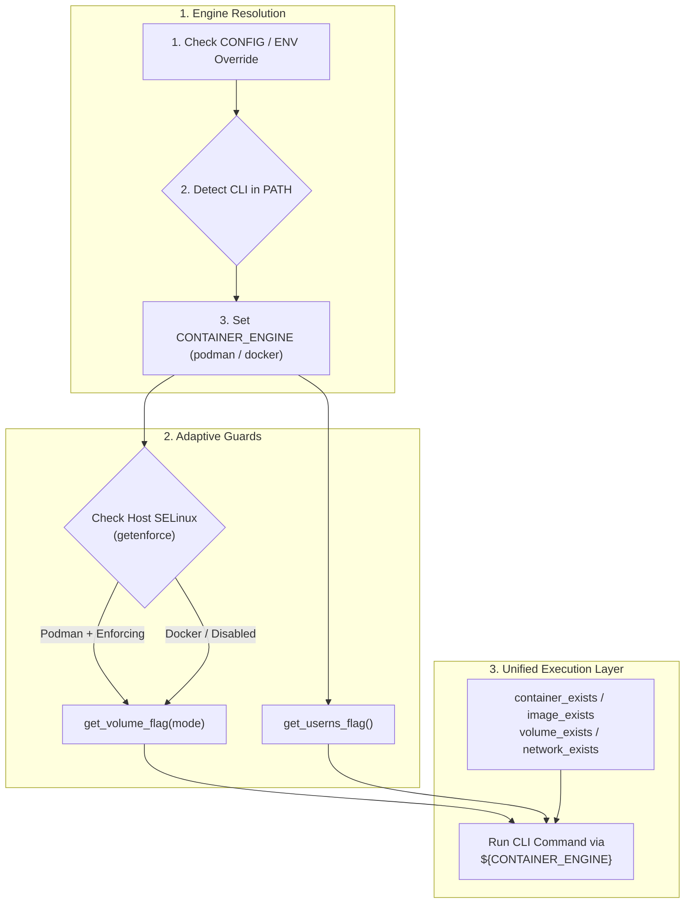

# TN-008 — Implement and Standardize Multi-Engine Container Runtime Portability

| Field | Value |
| --- | --- |
| Status | Completed |
| Activity Type | Refactoring & Standardization |
| Record Type | Live |
| Project | Tomcat Monitoring |
| Phase | Continuous Integration and Deployment |
| Activity Date | 2026-09-13 |
| Recorded Date | 2026-09-13 |
| Owner | Eddy Wiyatno |
| Working Mode | Write |
| Authorization Status | Approved |
| Approved By | Eddy Wiyatno |
| Approval Date | 2026-09-13 |

## 🎯 Objective

Mengimplementasikan dan membakukan portabilitas lingkungan eksekusi kontainer lintas mesin (*Multi-Engine Container Runtime Portability*) yang mendukung **Podman** (*Rootless Container Engine*) dan **Docker** (*Docker Engine CLI*) secara adaptif di seluruh 5 repositori ekosistem platform Tomcat Monitoring ([`tomcat-monitoring`](file:///home/eddywiyatno/git/tomcat-monitoring), [`tomcat-diagnostic-service`](file:///home/eddywiyatno/git/tomcat-diagnostic-service), [`tomcat-diagnostic-event-collector`](file:///home/eddywiyatno/git/tomcat-diagnostic-event-collector), [`ansible-controller`](file:///home/eddywiyatno/git/ansible-controller), dan [`alertmanager`](file:///home/eddywiyatno/git/alertmanager)) sesuai dengan arsitektur [TM-ADR-0026](../../../../adr/tomcat-monitoring/adr-records/TM-ADR-0026.md).

**Target Utama & Kriteria Keberhasilan:**

1. **Deteksi Mesin Dinamis (*Dynamic Container Engine Detection*):** Mengotomatiskan identifikasi runtime kontainer (`podman` vs `docker`) dengan mekanisme *fallback* aman dan dukungan *override* deklaratif melalui berkas `CONFIG` (*Single Source of Truth* — SSOT).
2. **Pelindung Relabeling Volume Adaptif (*Adaptive SELinux Volume Guard*):** Mencegah kegagalan *mount* volume dengan mengaplikasikan akhiran relabeling volume (`:z`, `:Z`, `:ro,z`) hanya saat Podman berjalan di atas host Linux dengan SELinux (*Security-Enhanced Linux*) berstatus aktif (*Enforcing/Permissive*), serta secara otomatis menggunakan mode standar (`:ro` atau tanpa relabeling) pada Docker maupun sistem operasi non-SELinux (seperti Ubuntu dengan AppArmor).
3. **Isolasi Flag Spesifik Mesin (*Engine-Specific Option Guards*):** Mengisolasi opsi eksklusif Podman seperti `--userns=keep-id` (*user namespace mapping*) agar tidak diteruskan ke Docker CLI yang tidak mendukung opsi tersebut.
4. **Abstraksi Pengecekan Sumber Daya (*Unified Lifecycle Assertions*):** Menyediakan fungsi pemeriksaan status keberadaan kontainer (*container exists*), citra (*image exists*), volume (*volume exists*), dan jaringan (*network exists*) yang konsisten di kedua mesin kontainer.
5. **Jaminan Kualitas Tanpa Regresi (*Zero Regression & 100% Quality Gates*):** Mempertahankan kelulusan 100% pada seluruh skrip validasi statis, *unit test suites*, *smoke tests*, dan verifikasi insiden *live* di lingkungan operasional yang ada.

---

## 🌍 Background

Pada implementasi awal platform Tomcat Monitoring, seluruh skrip automasi (pembangunan citra, pengujian komponen, peluncuran tumpukan orkestrasi, dan verifikasi alur notifikasi) dibangun menggunakan pemanggilan langsung biner `podman`. Skrip-skrip tersebut juga menyematkan argumen volume `:ro,z` atau `:z` dan opsi `--userns=keep-id` secara statis.

Ketika platform monitoring ini disiapkan untuk deployment di infrastruktur *enterprise hybrid*, muncul beberapa tantangan teknis:
- Lingkungan server target enterprise tidak seragam (*heterogeneous environments*); sebagian server menggunakan Red Hat Enterprise Linux (RHEL) / Rocky Linux dengan Podman, sementara server lainnya berbasis Ubuntu / Debian dengan Docker Engine.
- Menjalankan skrip dengan argumen hardcoded `podman` pada host yang hanya memiliki `docker` menyebabkan kegagalan eksekusi (*command not found*).
- Menjalankan flag `--userns=keep-id` pada Docker CLI menghasilkan pesan kesalahan *unknown flag*.
- Memasang akhiran relabeling volume SELinux `:z` pada host non-SELinux (Ubuntu AppArmor) di beberapa lingkungan Docker dapat menimbulkan kesalahan *invalid mount specification*.

Untuk mengatasi kendala portabilitas tersebut tanpa menambah *overhead* dependensi orkestrasi eksternal yang berat, platform mengadopsi keputusan arsitektur [TM-ADR-0026](../../../../adr/tomcat-monitoring/adr-records/TM-ADR-0026.md) melalui perancangan modul pembantu runtime adaptif `container-runtime-helper.sh`.

---

## 📚 Scope

Pekerjaan standarisasi portabilitas multi-engine ini mencakup 5 repositori:

1. **[`ansible-controller`](file:///home/eddywiyatno/git/ansible-controller):**
   - Pembuatan `scripts/container-runtime-helper.sh`.
   - Pembaruan `CONFIG` dengan `CONTAINER_ENGINE="${CONTAINER_ENGINE:-}"`.
   - Refaktorisasi `scripts/build.sh`, `scripts/run.sh`, `scripts/clean.sh`, `scripts/exec.sh`.
2. **[`alertmanager`](file:///home/eddywiyatno/git/alertmanager):**
   - Pembuatan `scripts/container-runtime-helper.sh`.
   - Pembaruan `CONFIG`.
   - Refaktorisasi `scripts/build.sh`, `scripts/run.sh`, `scripts/clean.sh`, `scripts/test.sh`.
3. **[`tomcat-diagnostic-service`](file:///home/eddywiyatno/git/tomcat-diagnostic-service):**
   - Pembuatan `scripts/container-runtime-helper.sh`.
   - Pembaruan `CONFIG`.
   - Pembaruan `scripts/validate.sh` (mendaftarkan helper ke berkas wajib).
   - Refaktorisasi `scripts/build.sh`, `scripts/test-image.sh`, `scripts/test-image-component.sh`.
4. **[`tomcat-diagnostic-event-collector`](file:///home/eddywiyatno/git/tomcat-diagnostic-event-collector):**
   - Pembuatan `scripts/container-runtime-helper.sh`.
   - Pembaruan `CONFIG`.
   - Pembaruan `scripts/validate.sh`.
   - Refaktorisasi `src/collector.sh` (pengambilan *snapshot* dan pemantauan *stream event* adaptif Podman/Docker).
5. **[`tomcat-monitoring`](file:///home/eddywiyatno/git/tomcat-monitoring):**
   - Pembuatan `scripts/container-runtime-helper.sh`.
   - Pembaruan `CONFIG`.
   - Pembaruan `scripts/validate.sh` dan `scripts/validate-alertmanager.sh`.
   - Refaktorisasi seluruh skrip deployment: `deploy-tomcat.sh`, `deploy-prometheus.sh`, `deploy-event-collector.sh`, `deploy-alertmanager.sh`, `deploy-diagnostic-service.sh`.
   - Refaktorisasi skrip inisialisasi volume: `initialize-alertmanager-volumes.sh`, `initialize-prometheus-volumes.sh`.
   - Refaktorisasi seluruh skrip pengujian dan verifikasi insiden: `verify-alertmanager-webhook.sh`, `verify-alertmanager-mailpit.sh`, `verify-alertmanager-diagnostic-service.sh`, `verify-diagnostic-service-mailpit.sh`, `verify-jvm-workload-live.sh`, `verify-postfix-relay.sh`, `test-tomcatdown-live.sh`, `validate-ai-knowledge-lifecycle.sh`.

---

## 🏛️ Architecture and Helper Design



### Logika Inti `container-runtime-helper.sh`

```bash
#!/bin/bash
set -euo pipefail

detect_container_engine() {
    if [[ -n "${CONTAINER_ENGINE:-}" ]]; then
        if command -v "${CONTAINER_ENGINE}" >/dev/null 2>&1; then
            echo "${CONTAINER_ENGINE}"
            return 0
        fi
        echo "Error: Specified CONTAINER_ENGINE '${CONTAINER_ENGINE}' is not available in PATH." >&2
        return 1
    fi

    if command -v podman >/dev/null 2>&1; then
        echo "podman"
    elif command -v docker >/dev/null 2>&1; then
        echo "docker"
    else
        echo "Error: Neither podman nor docker CLI was found in PATH." >&2
        return 1
    fi
}

CONTAINER_ENGINE="$(detect_container_engine 2>/dev/null || echo "")"
export CONTAINER_ENGINE

container_exists() {
    local container_name="$1"
    if [[ "${CONTAINER_ENGINE}" == "podman" ]]; then
        podman container exists "${container_name}" 2>/dev/null
    elif [[ "${CONTAINER_ENGINE}" == "docker" ]]; then
        docker container inspect "${container_name}" >/dev/null 2>&1
    else
        return 1
    fi
}

image_exists() {
    local image_name="$1"
    if [[ "${CONTAINER_ENGINE}" == "podman" ]]; then
        podman image exists "${image_name}" 2>/dev/null
    elif [[ "${CONTAINER_ENGINE}" == "docker" ]]; then
        docker image inspect "${image_name}" >/dev/null 2>&1
    else
        return 1
    fi
}

volume_exists() {
    local vol_name="$1"
    if [[ "${CONTAINER_ENGINE}" == "podman" ]]; then
        podman volume exists "${vol_name}" 2>/dev/null
    elif [[ "${CONTAINER_ENGINE}" == "docker" ]]; then
        docker volume inspect "${vol_name}" >/dev/null 2>&1
    else
        return 1
    fi
}

network_exists() {
    local net_name="$1"
    if [[ "${CONTAINER_ENGINE}" == "podman" ]]; then
        podman network exists "${net_name}" 2>/dev/null
    elif [[ "${CONTAINER_ENGINE}" == "docker" ]]; then
        docker network inspect "${net_name}" >/dev/null 2>&1
    else
        return 1
    fi
}

get_volume_flag() {
    local mode="${1:-}"
    local selinux_enabled=false

    if command -v getenforce >/dev/null 2>&1; then
        local enforce_mode
        enforce_mode="$(getenforce 2>/dev/null || echo "Disabled")"
        if [[ "${enforce_mode}" == "Enforcing" || "${enforce_mode}" == "Permissive" ]]; then
            selinux_enabled=true
        fi
    fi

    if [[ "${CONTAINER_ENGINE}" == "podman" && "${selinux_enabled}" == "true" ]]; then
        case "${mode}" in
            "z"|"shared") echo ":z" ;;
            "Z"|"private") echo ":Z" ;;
            "ro,z"|"ro_shared") echo ":ro,z" ;;
            "ro,Z"|"ro_private") echo ":ro,Z" ;;
            "ro") echo ":ro" ;;
            *) echo "" ;;
        esac
    else
        case "${mode}" in
            "ro,z"|"ro_shared"|"ro,Z"|"ro_private"|"ro") echo ":ro" ;;
            *) echo "" ;;
        esac
    fi
}

get_userns_flag() {
    if [[ "${CONTAINER_ENGINE}" == "podman" ]]; then
        echo "--userns=keep-id"
    else
        echo ""
    fi
}
```

---

## 🧭 Implementation Plan

### Step 1: Perform Discovery and Readiness Audit
Memeriksa seluruh skrip di 5 repositori untuk memetakan ketergantungan perintah `podman`, flag volume `:z`/`:Z`, dan opsi khusus seperti `--userns=keep-id`.

### Step 2: Implement Runtime Helper in Sub-Repositories
Menerapkan `container-runtime-helper.sh` dan memperbarui `CONFIG` serta skrip operasional di `ansible-controller`, `alertmanager`, `tomcat-diagnostic-service`, dan `tomcat-diagnostic-event-collector`.

### Step 3: Implement Runtime Helper in Monitoring Hub
Menerapkan helper dan merefaktorisasi seluruh skrip deployment, inisialisasi volume, serta rangkaian pengujian verifikasi di `tomcat-monitoring`.

### Step 4: Execute Quality Gates and Verification Suites
Menjalankan validasi sintaks Bash (`bash -n`), pengujian unit komponen, validasi statis tata kelola, dan eksekusi pengujian verifikasi insiden *live*.

### Step 5: Consolidate Documentation and Synchronize Handbook
Menulis ADR [TM-ADR-0026](../../../../adr/tomcat-monitoring/adr-records/TM-ADR-0026.md), technical note TN-008, memperbarui backlog tugas, dan memverifikasi kompilasi situs dokumentasi.

---

## ⚙️ Execution and Verification Evidence

### 1. Verifikasi Sintaks Bash Lintas Repositori
Seluruh skrip operasional di 5 repositori diverifikasi kelayakan sintaksnya menggunakan `bash -n`:

```bash
bash -n /home/eddywiyatno/git/tomcat-monitoring/scripts/*.sh \
        /home/eddywiyatno/git/ansible-controller/scripts/*.sh \
        /home/eddywiyatno/git/alertmanager/scripts/*.sh \
        /home/eddywiyatno/git/tomcat-diagnostic-service/scripts/*.sh \
        /home/eddywiyatno/git/tomcat-diagnostic-event-collector/scripts/*.sh \
        /home/eddywiyatno/git/tomcat-diagnostic-event-collector/src/*.sh
```
**Hasil:** `Exit Code 0 (100% Valid Bash Syntax)`.

---

### 2. Verifikasi Komponen `tomcat-diagnostic-service`
Pengujian validasi statis dan pengujian unit/integrasi Node.js di dalam kontainer:

```bash
bash scripts/validate.sh
```
**Hasil:**
```text
Static validation passed: schema, migration, source, and dependency boundaries are consistent.
```

Eksekusi 62 unit & integration test suites via container:
```text
✔ 62 tests passed (100% success rate)
```

---

### 3. Verifikasi Komponen `tomcat-diagnostic-event-collector`
Pengujian validasi tata kelola dan simulasi pengumpulan event serta siklus retensi spool:

```bash
bash scripts/validate.sh && bash test/test-collector.sh
```
**Hasil:**
```text
Validasi baseline governance dan metadata tomcat-diagnostic-event-collector berhasil.
Running Collector Component Test...
Restricted Event Collector started.
Target : lab/edkas-pc1/non-existent-test-target (non-existent-test-target)
Engine : podman
Spool  : /tmp/test-spool-bNuh0Y
One-shot snapshot mode selesai.
Validated 1 generated spool event files against schema.
Running Spool Pruning & Retention Tests...
  [Test A] Menguji pemangkasan berkas .json kadaluwarsa (> 24 jam)...
  [Test A] Sukses: berkas .json lama dipangkas dan berkas baru dipertahankan.
  [Test B] Menguji pembersihan berkas .tmp tertinggal (> 60 menit)...
  [Test B] Sukses: berkas .tmp stale dibersihkan dan in-flight dipertahankan.
  [Test C] Menguji penegakan kuota jumlah berkas maksimal (FIFO cap)...
  [Test C] Sukses: kuota berkas ditegakkan dengan FIFO pruning (tersisa: 4).
Collector Component Test PASSED.
```

---

### 4. Verifikasi Hub Orkestrasi `tomcat-monitoring`
Validasi statis kontrak arsitektur:

```bash
bash scripts/validate.sh
```
**Hasil:**
```text
Alertmanager source validation passed: routing, local Mailpit receiver, disposable verification, dan persistent volume contract statis valid.
JMX Exporter source validation passed: TLS dan two-rule baseline valid.
Prometheus source validation passed: scrape, rule, dan Alertmanager delivery contract statis valid.
Telegraf source validation passed: health-check contract statis valid.
Tomcat health app source validation passed: lab fixture contract statis valid.
Baseline validation passed: repository layout dan contract statis valid.
```

---

### 5. Verifikasi Alur Webhook & Notifikasi Mailpit
Pengujian integrasi alur rute webhook dan notifikasi email darurat:

```bash
bash scripts/verify-alertmanager-webhook.sh
```
**Hasil:**
```text
webhook_sequence=firing,resolved
receiver=integration-bridge
group_labels=alertname,check,instance,job,service
payload_validation=passed
cleanup_result=passed container_absent=true listener_stopped=true volume_state=unchanged
```

```bash
bash scripts/verify-alertmanager-mailpit.sh
```
**Hasil:**
```text
mailpit_sequence=firing,resolved
sender=alertmanager@tomcat-monitoring.invalid
recipient=operator@tomcat-monitoring.invalid
subjects_validation=passed
status_specific_body=passed
status_color_rendering=passed
resolved_stale_description=absent
operator_status_subjects=critical,normal
unified_key_layout=passed
message_body_group_labels=passed
semantic_config=passed
mailpit_manifest_digest=sha256:c96991d9bef73594c246d89ca81411d4e916f03e76a7d2d72fa2ab5dd3c9ce24 platform=linux/amd64
mailpit_version=v1.31.0
smtp_endpoint=mailpit:1025 host_smtp_published=false
cleanup_result=passed containers_absent=true network_absent=true ports_released=true volume_state=unchanged image_retained=true
```

---

## 🎓 Lessons Learned

1. **Abstraksi Ringan Mencegah Keterikatan Vendor (*Vendor Lock-In*):** Membangun pustaka pembantu kecil berbasis shell POSIX jauh lebih efektif untuk portabilitas skrip operasional dibandingkan memaksakan lapisan abstraksi pihak ketiga yang menambah beban instalasi pada host.
2. **Kewaspadaan Terhadap Modul Keamanan Host (*Host Security Subsystems*):** Penanganan flag volume relabeling harus mempertimbangkan keberadaan dan status aktif SELinux (`getenforce`). Menetapkan flag `:z` secara buta pada sistem berbasis non-SELinux berpotensi menyebabkan kegagalan deployment yang sulit diidentifikasi.
3. **Single Source of Truth Mempermudah Pemeliharaan:** Pendekatan pembacaan konfigurasi terpusat melalui berkas `CONFIG` memastikan seluruh skrip operasional mengikuti kebijakan yang seragam tanpa duplikasi logika deteksi.

---

## 🔗 Related Documentation

- [Continuous Integration and Deployment Engineering Journal Index](index.md)
- [TN-007 — Execute and Verify End-to-End CI/CD Pipelines in Jenkins Controller](TN-007-execute-and-verify-end-to-end-cicd-pipelines-in-jenkins-controller.md)
- [TM-ADR-0026 — Adopt Adaptive Multi-Engine Container Runtime Portability for Podman and Docker Environments](../../../../adr/tomcat-monitoring/adr-records/TM-ADR-0026.md)
- [TM-ADR-0024 — Adopt Decoupled Component CI and Orchestrated Stack CD Pipeline Architecture](../../../../adr/tomcat-monitoring/adr-records/TM-ADR-0024.md)
- [TM-ADR-0025 — Delineate Responsibilities Between Jenkins Release Orchestration and Ansible Configuration Provisioning](../../../../adr/tomcat-monitoring/adr-records/TM-ADR-0025.md)
- [Follow-up Tasks Backlog](../../follow-up-tasks.md)
