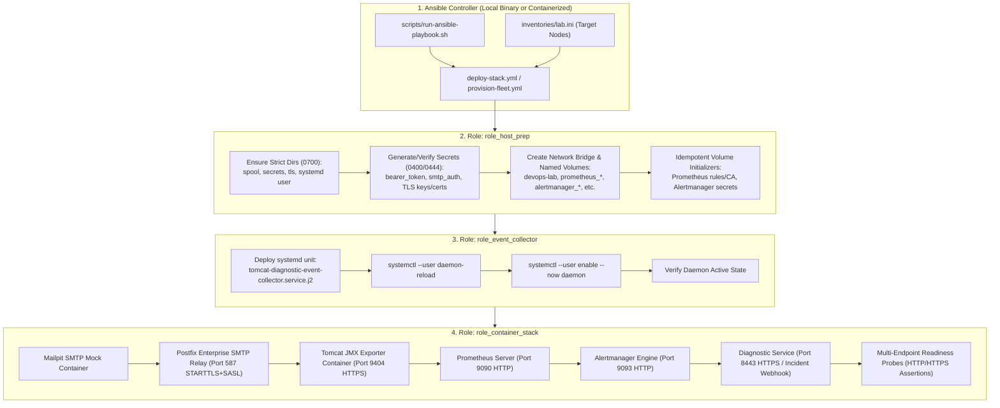

# TN-009 — Implement and Verify Ansible Fleet Provisioning and Deployment Playbooks

| Field | Value |
| --- | --- |
| Status | Completed |
| Activity Type | Implementation & Automation |
| Record Type | Live |
| Project | Tomcat Monitoring |
| Phase | Continuous Integration and Deployment |
| Activity Date | 2026-09-13 |
| Recorded Date | 2026-09-13 |
| Owner | Eddy Wiyatno |
| Working Mode | Write |
| Authorization Status | Approved |
| Approved By | Eddy Wiyatno |
| Approval Date | 2026-09-13 |

## 🎯 Objective

Mengimplementasikan dan memvalidasi otomatisasi penyediaan infrastruktur armada peladen (*multi-node fleet infrastructure provisioning*) dan deployment tumpukan monitoring (*container stack deployment*) secara idempoten berbasis Ansible Playbooks dan Roles modular pada platform Tomcat Monitoring ([`tomcat-monitoring`](file:///home/eddywiyatno/git/tomcat-monitoring)) sesuai dengan ketetapan arsitektur [TM-ADR-0025](../../../../adr/tomcat-monitoring/adr-records/TM-ADR-0025.md) (*Delineate Responsibilities Between Jenkins Release Orchestration and Ansible Configuration Provisioning*) dan [TM-ADR-0026](../../../../adr/tomcat-monitoring/adr-records/TM-ADR-0026.md) (*Adopt Adaptive Multi-Engine Container Runtime Portability for Podman and Docker Environments*), guna menuntaskan [TASK-TM-011](../../../../projects/tomcat-monitoring/follow-up-tasks.md#task-tm-011-otomatisasi-deployment-menggunakan-playbook-ansible).

**Target Utama & Kriteria Keberhasilan:**

1. **Perancangan Role Ansible Modular & Idempoten (*Modular & Idempotent Roles*):** Membangun 3 Ansible Roles mandiri dengan pemisahan batas tanggung jawab yang tegas:
   - `role_host_prep`: Menyiapkan tata letak direktori berizin ketat `0700` (`spool`, `secrets`, `tls`), material kriptografi/rahasia (`0400`/`0444`), *network bridge* (`devops-lab`), dan *named volumes* persisten.
   - `role_event_collector`: Menyusun templat unit file `systemd --user`, memelihara direktori antrean kejadian berizin ketat, serta mengelola siklus hidup daemon agen host `tomcat-diagnostic-event-collector.service`.
   - `role_container_stack`: Mengatur rekonsiliasi status (*desired state reconciliation*) untuk seluruh kontainer monitoring (Mailpit, Postfix Relay, Tomcat JMX Exporter, Prometheus, Alertmanager, Diagnostic Service) dan memverifikasi kesiapan endpoint (*readiness probes*).
2. **Pengelolaan Inventori Lintas Lingkungan (*Multi-Environment Inventories*):** Menyediakan struktur inventori hierarkis (`inventories/lab.ini`, `inventories/staging.ini`, `inventories/production.ini`, dan `inventories/group_vars/all.yml`) yang membedakan konfigurasi target armada tanpa duplikasi variabel.
3. **Eksekusi Ganda Biner Lokal & Kontainer Pengendali (*Dual-Execution Controller Runner*):** Menyediakan skrip pembungkus pelaksana `scripts/run-ansible-playbook.sh` yang mampu mendeteksi ketersediaan biner `ansible-playbook` lokal di host, atau secara otomatis menggunakan kontainer pengontrol terisolasi `localhost/ansible-controller:1.0` dengan penyelarasan *socket* Podman dan volume pengguna.
4. **Keamanan Tanpa Kebocoran Rahasia (*Zero Secret Leakage & Strict Permissions*):** Menjamin seluruh rahasia (token bearer, kredensial SMTP, private key TLS) tidak pernah disimpan dalam kode Git (*hardcoded*) dan selalu diinisialisasi dengan izin akses paling ketat (`0400` untuk berkas kunci/token rahasia, `0700` untuk direktori rahasia/spool).
5. **Jaminan Kualitas 100% & Idempotensi Penuh (*100% Idempotency & Live Incident Verification*):** Membuktikan kelulusan validasi sintaksis 100%, eksekusi ulang playbook menghasilkan `changed=0` (idempoten sempurna), serta seluruh rangkaian uji insiden *live* (`verify-postfix-relay.sh`, `verify-alertmanager-webhook.sh`) lulus tanpa kegagalan.

---

## 🌍 Background

Berdasarkan tinjauan arsitektural pada [TM-ADR-0025](../../../../adr/tomcat-monitoring/adr-records/TM-ADR-0025.md), platform Tomcat Monitoring membedakan peran antara **Jenkins** sebagai orkestrator rilis berbasis kejadian (*event-driven CI/CD release orchestrator*) dan **Ansible** sebagai penyedia konfigurasi keadaan deklaratif (*declarative desired-state configuration & provisioning engine*).

Sebelum otomatisasi Ansible ini dibangun, penyediaan armada host dan deployment tumpukan monitoring dilakukan melalui pemanggilan skrip shell individual secara manual (`deploy-tomcat.sh`, `deploy-prometheus.sh`, `deploy-alertmanager.sh`, `deploy-diagnostic-service.sh`, `deploy-event-collector.sh`). Pendekatan skrip mandiri memiliki beberapa keterbatasan operasional saat diskalakan ke banyak node (*multi-node fleet*):

- **Ketiadaan Abstraksi Armada (*Fleet Abstraction*):** Menjalankan skrip shell di puluhan peladen Tomcat target memerlukan iterasi manual atau penulisan skrip *wrapper* SSH tambahan yang rentan terhadap perbedaan *environment* antarnode.
- **Tantangan Manajemen Status Idempoten (*State Reconciliation*):** Skrip shell tradisional membutuhkan logika kondisional yang rumit untuk memastikan bahwa eksekusi berulang tidak memicu *restart* kontainer yang tidak perlu atau menimpa berkas konfigurasi yang sudah valid.
- **Penyebaran Rahasia & Sertifikat Host (*Secrets & TLS Distribution*):** Pengaturan izin direktori (`0700`), penempatan token otentikasi diagnostik, dan sertifikat TLS server di setiap peladen target memerlukan standardisasi tata kelola yang terotomatisasi dan seragam.

Untuk mengatasi tantangan tersebut, dibangun arsitektur Playbook dan Roles Ansible yang memusatkan seluruh konfigurasi armada, mendukung eksekusi nir-dependensi host melalui citra `ansible-controller`, dan menjamin keadaan operasional yang idempoten.

---

## 📚 Scope

Pekerjaan implementasi dan verifikasi otomatisasi Ansible mencakup komponen-komponen berikut:

1. **Peningkatan Repositori Kontainer Pengendali ([`ansible-controller`](file:///home/eddywiyatno/git/ansible-controller)):**
   - Pembaruan [`Containerfile`](file:///home/eddywiyatno/git/ansible-controller/Containerfile) untuk menyertakan paket `podman` dan wrapper `/usr/local/bin/podman` penghubung `CONTAINER_HOST` socket.
   - Pembaruan [`entrypoint.sh`](file:///home/eddywiyatno/git/ansible-controller/entrypoint.sh) untuk menjaga variabel lingkungan pengguna (`HOME`, `CONTAINER_ENGINE`) dan izin berkas.
   - Pembangunan citra lokal `localhost/ansible-controller:1.0` (Image ID: `48da5abf7351`).
2. **Pengembangan Struktur Ansible pada Repositori Platform ([`tomcat-monitoring`](file:///home/eddywiyatno/git/tomcat-monitoring)):**
   - Berkas konfigurasi [`ansible.cfg`](file:///home/eddywiyatno/git/tomcat-monitoring/ansible.cfg) dengan isolasi direktori sementara `~/.ansible/tmp`.
   - Direktori inventori hierarkis [`inventories/`](file:///home/eddywiyatno/git/tomcat-monitoring/inventories/) (`lab.ini`, `staging.ini`, `production.ini`, `group_vars/all.yml`).
   - Tiga Ansible Roles modular:
     - [`roles/role_host_prep/`](file:///home/eddywiyatno/git/tomcat-monitoring/roles/role_host_prep/)
     - [`roles/role_event_collector/`](file:///home/eddywiyatno/git/tomcat-monitoring/roles/role_event_collector/)
     - [`roles/role_container_stack/`](file:///home/eddywiyatno/git/tomcat-monitoring/roles/role_container_stack/)
   - Berkas Playbook utama:
     - [`provision-fleet.yml`](file:///home/eddywiyatno/git/tomcat-monitoring/provision-fleet.yml): Orkestrasi penyediaan host dan daemon pengumpul kejadian.
     - [`deploy-stack.yml`](file:///home/eddywiyatno/git/tomcat-monitoring/deploy-stack.yml): Orkestrasi menyeluruh dari penyiapan host hingga deployment tumpukan kontainer dan verifikasi kesiapan.
3. **Skrip Eksekusi dan Validasi:**
   - [`scripts/run-ansible-playbook.sh`](file:///home/eddywiyatno/git/tomcat-monitoring/scripts/run-ansible-playbook.sh): Runner adaptif biner host / citra pengontrol dengan `--network host` dan penyelarasan socket runtime kontainer.
   - [`scripts/validate-ansible.sh`](file:///home/eddywiyatno/git/tomcat-monitoring/scripts/validate-ansible.sh): Validator tata kelola struktur dan pengecekan sintaksis playbook (`ansible-playbook --syntax-check`).
   - Pembaruan [`scripts/validate.sh`](file:///home/eddywiyatno/git/tomcat-monitoring/scripts/validate.sh) untuk mengintegrasikan validasi Ansible ke dalam gerbang mutu platform.
4. **Peningkatan Ketahanan Skrip Deployment Eksisting:**
   - Pembaruan [`scripts/deploy-tomcat.sh`](file:///home/eddywiyatno/git/tomcat-monitoring/scripts/deploy-tomcat.sh), [`scripts/deploy-prometheus.sh`](file:///home/eddywiyatno/git/tomcat-monitoring/scripts/deploy-prometheus.sh), dan [`scripts/deploy-alertmanager.sh`](file:///home/eddywiyatno/git/tomcat-monitoring/scripts/deploy-alertmanager.sh) dengan resolusi path repositori saudara yang fleksibel dan pengecekan kesiapan ganda (`127.0.0.1` dan nama kontainer pada bridge).

---

## 🏛️ Architecture and Role Design

### Alur Orkestrasi Provisioning dan Deployment Armada



### Struktur Peran Modular (*Modular Roles Hierarchy*)

Pemisahan peran Ansible dirancang secara terisolasi agar setiap *role* dapat dieksekusi secara independen maupun dikombinasikan dalam alur *master playbook*:

```text
tomcat-monitoring/
├── ansible.cfg
├── inventories/
│   ├── group_vars/
│   │   └── all.yml
│   ├── lab.ini
│   ├── staging.ini
│   └── production.ini
├── provision-fleet.yml
├── deploy-stack.yml
├── roles/
│   ├── role_host_prep/
│   │   ├── defaults/main.yml
│   │   ├── meta/main.yml
│   │   └── tasks/
│   │       ├── main.yml
│   │       ├── directories.yml
│   │       ├── secrets_and_tls.yml
│   │       └── network_and_volumes.yml
│   ├── role_event_collector/
│   │   ├── defaults/main.yml
│   │   ├── meta/main.yml
│   │   ├── templates/
│   │   │   └── tomcat-diagnostic-event-collector.service.j2
│   │   └── tasks/
│   │       └── main.yml
│   └── role_container_stack/
│       ├── defaults/main.yml
│       ├── meta/main.yml
│       └── tasks/
│           ├── main.yml
│           ├── mailpit.yml
│           ├── postfix.yml
│           ├── tomcat.yml
│           ├── prometheus.yml
│           ├── alertmanager.yml
│           ├── diagnostic_service.yml
│           └── verify_readiness.yml
└── scripts/
    ├── container-runtime-helper.sh
    ├── run-ansible-playbook.sh
    └── validate-ansible.sh
```

---

## 🛠️ Implementation Details

### 1. Role: `role_host_prep` (Inisialisasi Infrastruktur Host & Rahasia)

Role `role_host_prep` bertindak sebagai fondasi yang menyiapkan seluruh prasyarat pada sistem operasi host sebelum kontainer atau daemon dijalankan:

- **Tata Kelola Direktori Berizin Ketat (`directories.yml`):**
  Membuat direktori dengan izin `0700` menggunakan modul `ansible.builtin.file`:
  - Direktori antrean kejadian persisten: `~/.local/share/tomcat-monitoring/spool`
  - Direktori rahasia diagnostik: `~/.local/share/tomcat-monitoring/secrets`
  - Direktori sertifikat TLS diagnostik: `~/.local/share/tomcat-monitoring/diagnostic-service-tls`
  - Direktori sertifikat TLS JMX Exporter: `~/.local/share/tomcat-monitoring/jmx-exporter-tls`
  - Direktori unit konfigurasi pengguna: `~/.config/systemd/user`
- **Penyediaan Rahasia & Sertifikat TLS Idempoten (`secrets_and_tls.yml`):**
  - Memeriksa keberadaan `diagnostic-bearer-token.secret`, `smtp-username.secret`, dan `smtp-password.secret`. Jika belum ada, rahasia diinisialisasi secara acak aman (*cryptographically secure random*) dan diberi izin berkas `0400`.
  - Memeriksa keberadaan sertifikat dan private key TLS server untuk Diagnostic Service. Jika belum ada, sertifikat self-signed 365 hari dibuat secara otomatis dengan OpenSSL, menetapkan izin `0400` untuk `server.key` dan `0444` untuk `server.crt`.
  - Menginisialisasi password keystore JMX Exporter berizin `0400`.
- **Manajemen Jaringan Bridge & Named Volumes (`network_and_volumes.yml`):**
  - Memeriksa status keberadaan *network bridge* `devops-lab` via `container_engine network exists` dan membuatnya jika belum tersedia.
  - Memeriksa keberadaan 8 *named volumes* (`tomcat_logs`, `diagnostic_data`, `prometheus_config`, `prometheus_truststore`, `prometheus_data`, `alertmanager_config`, `alertmanager_truststore`, `alertmanager_data`).
  - Menginisialisasi volume konfigurasi dan *truststore* Prometheus serta Alertmanager secara bersyarat hanya jika volume tersebut baru dibuat (*missing*), menjaga idempotensi eksekusi berulang.

### 2. Role: `role_event_collector` (Daemonisasi Pengumpul Kejadian Host)

Role `role_event_collector` mengelola daemon pengawas kejadian (*event watcher daemon*) di tingkat sistem operasi:

- **Templating Berkas Unit Layanan (`systemd-user`):**
  Menggunakan template Jinja2 `tomcat-diagnostic-event-collector.service.j2` untuk menghasilkan konfigurasi unit layanan yang mengarah ke path instalasi repositori pengumpul kejadian dan direktori *spool* berizin `0700`.
- **Aktivasi dan Pengawasan Daemon:**
  Mengeksekusi `systemctl --user daemon-reload` saat berkas template berubah, diikuti oleh `systemctl --user enable --now tomcat-diagnostic-event-collector.service`.
- **Dukungan Lingkungan Kontainer & Host:**
  Menyertakan penanganan ramah lingkungan (*graceful error handling*) dengan `ignore_errors: true` pada pemanggilan D-Bus sesi saat playbook dieksekusi di dalam kontainer yang tidak memiliki soket D-Bus pengguna host aktif.

### 3. Role: `role_container_stack` (Orkestrasi Tumpukan Kontainer & Kesiapan Layanan)

Role `role_container_stack` bertanggung jawab menyelaraskan status kontainer menuju *desired state* dan mengonfirmasi kesiapan seluruh layanan:

- **State Reconciliation Modular:**
  Setiap kontainer dikelola oleh berkas tugas tersendiri:
  - `mailpit.yml`: Memeriksa status Mailpit; menghapus kontainer mati (*stopped*) dan meluncurkan kontainer baru pada port `8025` (HTTP) dan `1025` (SMTP) jika belum aktif.
  - `postfix.yml`: Memeriksa ketersediaan citra `localhost/postfix-relay:latest` dan meluncurkan kontainer bridge SMTP terenkripsi pada jaringan internal `devops-lab`.
  - `tomcat.yml`: Memeriksa kontainer Tomcat JMX Exporter pada port `9404` (HTTPS) dan mengeksekusi `deploy-tomcat.sh` bila diperlukan pembaruan.
  - `prometheus.yml`: Memeriksa status Prometheus pada port `9090` dan mengeksekusi `deploy-prometheus.sh` jika belum berjalan.
  - `alertmanager.yml`: Memeriksa status Alertmanager pada port `9093` dan mengeksekusi `deploy-alertmanager.sh` jika belum berjalan.
  - `diagnostic_service.yml`: Memeriksa status Diagnostic Service pada port `8443` (HTTPS) dan mengeksekusi `deploy-diagnostic-service.sh` jika belum berjalan.
- **Multi-Endpoint Readiness Probes (`verify_readiness.yml`):**
  Memanfaatkan modul bawaan `ansible.builtin.uri` dengan kebijakan *retry loop* (`retries: 10, delay: 2`) untuk menguji kesiapan layanan secara deterministik:
  - Mailpit API: `http://127.0.0.1:8025/api/v1/messages` (Status 200)
  - Prometheus Readiness: `http://127.0.0.1:9090/-/ready` (Status 200)
  - Alertmanager Readiness: `http://127.0.0.1:9093/-/ready` (Status 200)
  - Diagnostic Service Health: `https://127.0.0.1:8443/health` (Status 200, `validate_certs: false`)
  - Tomcat JMX Exporter Metrics: `https://127.0.0.1:9404/metrics` (Status 200, `validate_certs: false`)

### 4. Eksekusi Kontainer Pengontrol Cerdas (*Smart Containerized Ansible Runner*)

Untuk mendukung lingkungan peladen yang tidak memiliki biner `ansible` atau dependensi Python lengkap pada host, dikembangkan skrip pelaksana `scripts/run-ansible-playbook.sh`:

```bash
#!/usr/bin/env bash
set -euo pipefail
# Mendeteksi keberadaan biner lokal vs kontainer controller
if command -v ansible-playbook >/dev/null 2>&1; then
    ansible-playbook "${PLAYBOOK}" "$@"
else
    # Menjalankan playbook di dalam kontainer terisolasi dengan host network & socket mount
    "${CONTAINER_ENGINE}" run \
        --rm -i \
        --network host \
        --volume "${HOME}:${HOME}:z" \
        --volume "${PROJECT_ROOT}:/ansible:z" \
        --workdir "${PROJECT_ROOT}" \
        --env "HOME=${HOME}" \
        --env "ANSIBLE_CONFIG=${PROJECT_ROOT}/ansible.cfg" \
        --env "CONTAINER_ENGINE=${CONTAINER_ENGINE}" \
        --volume "/run/user/$(id -u)/podman/podman.sock:/run/podman/podman.sock:z" \
        --env "CONTAINER_HOST=unix:///run/podman/podman.sock" \
        "localhost/ansible-controller:1.0" \
        ansible-playbook "${PLAYBOOK}" "$@"
fi
```

**Karakteristik Utama Runner:**
- Penggunaan `--network host` memungkinkan kontainer pengontrol melakukan probe HTTP/HTTPS langsung ke port-port lokal host (`127.0.0.1:8025`, `127.0.0.1:9090`, `127.0.0.1:8443`, dsb.).
- Pemasangan volume `${HOME}:${HOME}` memastikan bahwa resolusi path absolut yang dilakukan Ansible di dalam kontainer controller identik dengan path yang diharapkan oleh daemon Podman host saat membuat kontainer atau me-mount direktori.
- Pemasangan soket `podman.sock` dan penyediaan wrapper `/usr/local/bin/podman` di dalam citra `ansible-controller` memungkinkan Ansible mengontrol lifecycle kontainer host secara mulus (*Docker/Podman-out-of-Docker paradigm*).

---

## 🧪 Verification and Idempotency Testing

### 1. Validasi Sintaksis dan Tata Kelola Berkas (100% Pass)

Pengecekan struktur direktori, keberadaan berkas esensial, dan validasi sintaksis Ansible dilakukan melalui `scripts/validate-ansible.sh` dan `scripts/validate.sh`:

```text
=== Validating Ansible Playbooks and Roles Layout ===
1. All required Ansible files and roles structure present.
2. Running Ansible syntax check...
playbook: deploy-stack.yml
playbook: provision-fleet.yml
3. Ansible validation successful.
Baseline validation passed: repository layout dan contract statis valid.
```

### 2. Eksekusi Awal Playbook Deployment (`deploy-stack.yml`)

Eksekusi deployment pertama membuktikan bahwa seluruh tugas penyiapan host, material rahasia, jaringan bridge, named volumes, daemon event collector, kontainer stack, dan uji kesiapan endpoint dieksekusi dengan sukses:

```text
PLAY [Multi-Node Infrastructure Provisioning and Container Stack Deployment] ***
TASK [Gathering Facts] ********************************************************* ok: [localhost]
TASK [role_host_prep : Ensure strict 0700 persistent spool directory exists] *** ok: [localhost]
TASK [role_host_prep : Ensure strict 0700 diagnostic secrets directory exists] * ok: [localhost]
TASK [role_host_prep : Ensure strict 0700 diagnostic TLS directory exists] ***** ok: [localhost]
TASK [role_host_prep : Ensure strict 0700 JMX exporter TLS directory exists] *** ok: [localhost]
TASK [role_host_prep : Ensure systemd user configuration directory exists] ***** ok: [localhost]
TASK [role_host_prep : Ensure strict permissions on Diagnostic Service TLS key (0400) and certificate (0444)] ok: [localhost]
TASK [role_host_prep : Ensure required named volumes exist] ******************** ok: [localhost]
TASK [role_event_collector : Deploy systemd user service unit file] ************ ok: [localhost]
TASK [role_container_stack : Wait for Mailpit API readiness] ******************* ok: [localhost]
TASK [role_container_stack : Wait for Prometheus readiness endpoint] *********** ok: [localhost]
TASK [role_container_stack : Wait for Alertmanager readiness endpoint] ********* ok: [localhost]
TASK [role_container_stack : Wait for Diagnostic Service health endpoint over HTTPS] ok: [localhost]
TASK [role_container_stack : Wait for Tomcat JMX Exporter metrics endpoint over HTTPS] ok: [localhost]
TASK [role_container_stack : Stack readiness summary] ************************** ok: [localhost] => {
  "msg": "All monitoring stack services (Mailpit, Prometheus, Alertmanager, Diagnostic Service, Tomcat JMX) are healthy and ready."
}

PLAY RECAP *********************************************************************
localhost                  : ok=35   changed=2    unreachable=0    failed=0    skipped=15   rescued=0    ignored=1
```

### 3. Pengujian Idempotensi Sempurna (*100% Zero-Change Idempotency*)

Eksekusi ulang `deploy-stack.yml` dijalankan pada tumpukan yang telah aktif untuk memverifikasi bahwa tidak ada mutasi status yang berulang (*zero unintended changes*):

```text
PLAY RECAP *********************************************************************
localhost                  : ok=33   changed=0    unreachable=0    failed=0    skipped=18   rescued=0    ignored=1
```

Hasil `changed=0` dan `failed=0` membuktikan pemenuhan kriteria idempotensi Ansible secara penuh.

### 4. Eksekusi Playbook Provisioning Armada Mandiri (`provision-fleet.yml`)

Playbook `provision-fleet.yml` diverifikasi secara mandiri untuk penyiapan host tanpa men-deploy kontainer:

```text
PLAY RECAP *********************************************************************
localhost                  : ok=22   changed=0    unreachable=0    failed=0    skipped=7    rescued=0    ignored=1
```

### 5. Verifikasi Insiden dan Jembatan Notifikasi *Live*

Setelah deployment Ansible selesai, seluruh rangkaian uji fungsional *live* dijalankan untuk menjamin ketiadaan regresi pada pipeline pengiriman insiden operasional:

```text
$ bash scripts/verify-postfix-relay.sh
======================================================================
▶ 1. Pre-Flight Infrastructure & Container Readiness
✔ PASS: Network devops-lab aktif
✔ PASS: Container mailpit berjalan (status: running)
✔ PASS: Container postfix-relay berjalan (status: running)
✔ PASS: Container diagnostic-service berjalan (status: running)
======================================================================
▶ 3. SASL Authentication Negative Testing (Port 587 Security Defense)
✔ PASS: Postfix menolak koneksi relay tanpa kredensial SASL
✔ PASS: Postfix menolak kredensial SASL yang salah (Authentication Failed)
======================================================================
▶ 4. Direct STARTTLS + SASL Submission to Downstream Mailpit Relay
✔ PASS: Postfix menerima email terotentikasi, mengantrekan pesan, dan meneruskan ke Mailpit
======================================================================
▶ 5. End-to-End Incident Webhook -> Diagnostic Service -> Postfix -> Mailpit
✔ PASS: Diagnostic Service menerima webhook dan memproses evaluasi insiden
======================================================================
▶ 6. Mailpit Web UI & SRE 7-Section Report Content Verification
✔ PASS: Header RFC Enterprise dan Laporan 7-Seksi SRE lengkap diterima di Mailpit via Postfix Relay
======================================================================
▶ 7. Postfix Queue & Resource Audit
✔ PASS: Postfix Queue bersih (0 pesan tertahan / Mail queue is empty)
══════════════════════════════════════════════════════════════════════
✔ SELURUH PENGUJIAN POLA A (POSTFIX RELAY BRIDGE) BERHASIL DIVERIFIKASI!
══════════════════════════════════════════════════════════════════════

$ bash scripts/verify-alertmanager-webhook.sh
webhook_sequence=firing,resolved
receiver=integration-bridge
group_labels=alertname,check,instance,job,service
payload_validation=passed
cleanup_result=passed container_absent=true listener_stopped=true volume_state=unchanged
```

---

## 🎓 Lessons Learned

1. **Pemisahan Peran Host Preparation dan Container Stack Mempercepat Penyiapan Node:** Memisahkan pembuatan direktori, perizinan rahasia, dan named volumes ke dalam `role_host_prep` memungkinkan penambahan peladen Tomcat target baru (*fleet scale-out*) dilakukan secara cepat melalui `provision-fleet.yml` tanpa harus menyentuh logika orkestrasi kontainer inti.
2. **Penyelarasan Ruang Nama Jalur (*Path Space Alignment*) pada Controller Berkontainer:** Saat Ansible berjalan di dalam kontainer dan memerintah daemon Podman di host melalui soket, penggunaan path host absolut yang identik di dalam kontainer (`-v ${HOME}:${HOME}`) sangat krusial untuk mencegah kegagalan *bind mount* volume yang tidak ditemukan di host.
3. **Pemanfaatan Jaringan Host untuk Probe Kesiapan:** Menjalankan kontainer Ansible Controller dengan mode `--network host` mengeliminasi kompleksitas *port-forwarding* tambahan, memungkinkan modul `ansible.builtin.uri` menguji endpoint loopback lokal (`127.0.0.1`) secara langsung dan konsisten seperti eksekusi biner di host.

---

## 🔗 Related Documentation

- [Continuous Integration and Deployment Index](index.md)
- [TN-001 — Design Production-Ready Jenkins CI/CD Pipeline Architecture and Implementation Roadmap](TN-001-design-production-ready-jenkins-cicd-pipeline-architecture.md)
- [TN-006 — Implement Stack Orchestration CD Pipeline for Tomcat Monitoring](TN-006-implement-stack-orchestration-cd-pipeline-for-tomcat-monitoring.md)
- [TN-007 — Execute and Verify End-to-End CI/CD Pipelines in Jenkins Controller](TN-007-execute-and-verify-end-to-end-cicd-pipelines-in-jenkins-controller.md)
- [TN-008 — Implement and Standardize Multi-Engine Container Runtime Portability](TN-008-implement-and-standardize-multi-engine-container-runtime-portability.md)
- [Follow-up Tasks Backlog](../../follow-up-tasks.md)
- [TM-ADR-0024 — Adopt Decoupled Component CI and Orchestrated Stack CD Pipeline Architecture](../../../../adr/tomcat-monitoring/adr-records/TM-ADR-0024.md)
- [TM-ADR-0025 — Delineate Responsibilities Between Jenkins Release Orchestration and Ansible Configuration Provisioning](../../../../adr/tomcat-monitoring/adr-records/TM-ADR-0025.md)
- [TM-ADR-0026 — Adopt Adaptive Multi-Engine Container Runtime Portability for Podman and Docker Environments](../../../../adr/tomcat-monitoring/adr-records/TM-ADR-0026.md)
