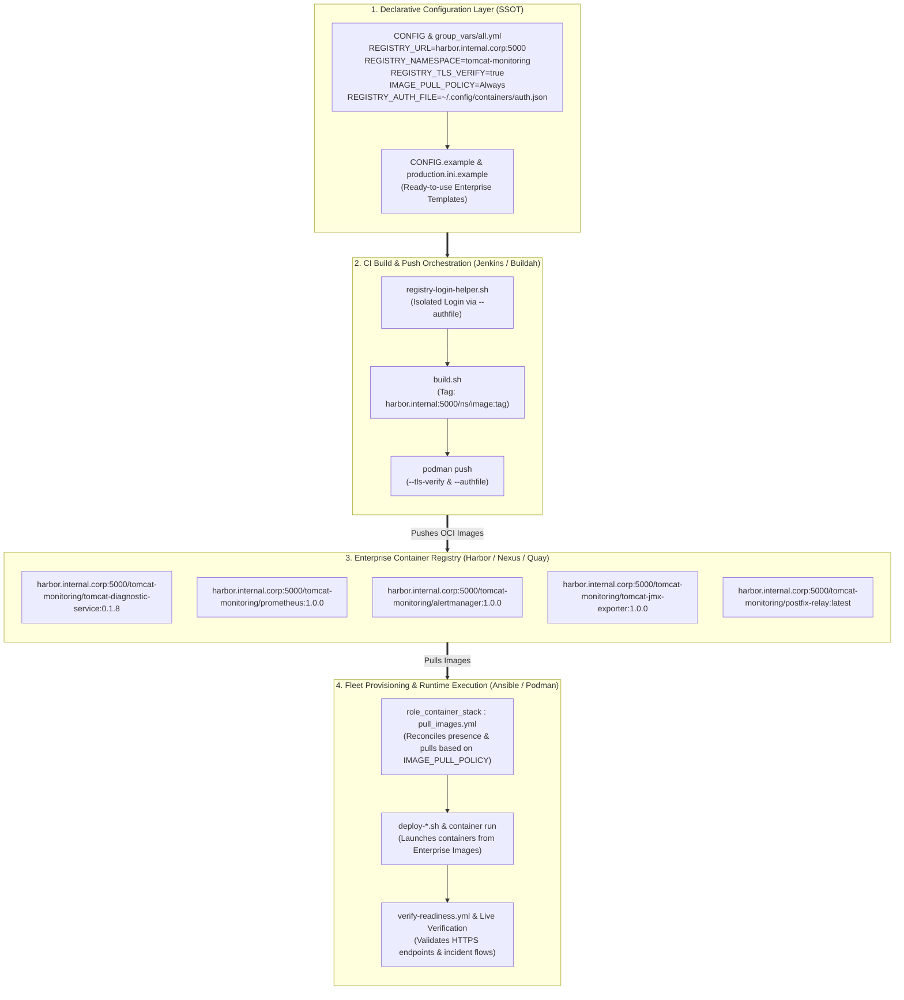

# TN-010 — Implement Plug-and-Play Enterprise Container Registry Integration and Image Lifecycle Configuration

| Field | Value |
| --- | --- |
| Status | Completed |
| Activity Type | Architecture & Standardization |
| Record Type | Live |
| Project | Tomcat Monitoring |
| Phase | Continuous Integration and Deployment |
| Activity Date | 2026-09-13 |
| Recorded Date | 2026-09-13 |
| Owner | Eddy Wiyatno |
| Working Mode | Write |
| Authorization Status | Approved |
| Approved By | Eddy Wiyatno |
| Approval Date | 2026-09-13 |

## 🎯 Objective

Mengimplementasikan dan menstandarisasikan integrasi repositori citra kontainer tingkat enterprise (*Enterprise Container Registry Integration*) dan konfigurasi siklus hidup citra (*Image Lifecycle Configuration*) yang bersifat siap pakai (*Plug-and-Play*) di seluruh repositori platform Tomcat Monitoring ([`tomcat-monitoring`](file:///home/eddywiyatno/git/tomcat-monitoring), [`tomcat-diagnostic-service`](file:///home/eddywiyatno/git/tomcat-diagnostic-service), [`ansible-controller`](file:///home/eddywiyatno/git/ansible-controller), [`alertmanager`](file:///home/eddywiyatno/git/alertmanager), dan [`tomcat-diagnostic-event-collector`](file:///home/eddywiyatno/git/tomcat-diagnostic-event-collector)) sesuai dengan prinsip arsitektur [TM-ADR-0024](../../../../adr/tomcat-monitoring/adr-records/TM-ADR-0024.md), [TM-ADR-0025](../../../../adr/tomcat-monitoring/adr-records/TM-ADR-0025.md), dan [TM-ADR-0026](../../../../adr/tomcat-monitoring/adr-records/TM-ADR-0026.md), guna menuntaskan **TASK-TM-025**.

**Target Utama & Kriteria Keberhasilan:**

1. **Prinsip Siap Pakai Nir-Modifikasi Logika (*Zero Logic Modification Plug-and-Play*):** Memastikan platform dapat berpindah dari lingkungan laboratorium lokal ke repositori citra kantor (seperti Harbor, Nexus, Quay, atau GitLab/Gitea Registry) **hanya dengan mengubah berkas konfigurasi deklaratif (`CONFIG` dan `inventories/group_vars/all.yml` / `inventories/production.ini`)**, tanpa mengubah kode logika pada skrip shell, Containerfile/Dockerfile, Jenkinsfile, maupun Ansible Tasks.
2. **Standardisasi Parameter Registri Deklaratif Lengkap (*Declarative Registry Parameters*):** Mendukung parameter konfigurasi registri enterprise secara menyeluruh di seluruh repositori:
   - `REGISTRY_URL` / `REGISTRY_HOST` (contoh: `localhost`, `harbor.internal.corp:5000`, `nexus.internal:8443`, `registry.gitlab.com`).
   - `REGISTRY_NAMESPACE` / `PROJECT_NAME` (contoh: `library`, `tomcat-monitoring`, `devops-platform`).
   - `REGISTRY_TLS_VERIFY` (`true` / `false` / path direktori sertifikat CA kustom).
   - `IMAGE_PULL_POLICY` (`Always`, `IfNotPresent`, `Never`).
   - `REGISTRY_AUTH_FILE` (penyimpanan kredensial otentikasi terisolasi).
3. **Penyediaan Template Lingkungan Enterprise (*Enterprise Templates Baseline*):** Menyediakan berkas contoh `CONFIG.example` pada seluruh repositori dan `inventories/production.ini.example` pada `tomcat-monitoring` sebagai acuan baku konfigurasi server produksi kantor.
4. **Isolasi Kredensial Registri & Pencegahan Kebocoran (*Isolated Registry Authentication & Zero Secret Leakage*):** Membangun skrip pembantu autentikasi `scripts/registry-login-helper.sh` yang memanfaatkan opsi `--authfile` sementara tanpa mencemari berkas autentikasi global pengguna pada host.
5. **Kebijakan Penarikan Citra Ansible Otomatis (*Declarative Ansible Image Pull Reconciliation*):** Mengintegrasikan task `pull_images.yml` pada `role_container_stack` untuk memverifikasi dan menarik citra kontainer dari registri enterprise sebelum eksekusi deployment kontainer.
6. **Jaminan Kualitas Mutlak Tanpa Regresi (*Zero Regression & 100% Quality Gates*):** Menjaga kelulusan 100% pada seluruh rangkaian validasi statis (`scripts/validate.sh`), validasi sintaksis Ansible (`scripts/validate-ansible.sh`), serta verifikasi insiden *live* (`verify-postfix-relay.sh`, `verify-alertmanager-webhook.sh`, `test-tomcatdown-live.sh`).

---

## 🌍 Background

Pada tahap pengembangan awal dan pengujian laboratorium, platform Tomcat Monitoring menggunakan referensi citra lokal statis berbasis prefiks `localhost/` (seperti `localhost/tomcat-diagnostic-service:latest`, `localhost/prometheus:1.0.0`, `localhost/alertmanager:1.0.0`). 

Ketika platform dipersiapkan untuk penerapan pada infrastruktur enterprise nyata di kantor, timbul beberapa kendala portabilitas:
- **Keterikatan Jalur Citra (*Hardcoded Local Image References*):** Penamaan citra `localhost/...` yang tertanam langsung pada skrip deployment dan playbook Ansible mengharuskan dilakukannya perubahan kode manual ketika ingin menggunakan server registri privat perusahaan (seperti VMware Harbor atau Sonatype Nexus).
- **Kebutuhan Isolasi Autentikasi Registri Privat (*Isolated Auth Storage*):** Server registri internal enterprise umumnya mewajibkan otentikasi akun pengguna (*username/password* atau *robot token*) dan verifikasi sertifikat TLS internal. Penyimpanan kredensial ini tidak boleh mencemari berkas konfigurasi bersama pada server pengendali (*Ansible Controller* / *Jenkins Agent*).
- **Penegakan Kebijakan Penarikan Citra (*Image Pull Policy Enforcement*):** Pada kluster armada multi-node (*fleet nodes*), sebagian peladen target belum memiliki citra lokal sebelum aplikasi dijalankan, sehingga diperlukan mekanisme rekonsiliasi penarikan citra secara otomatis yang selaras dengan kebijakan operasional (`Always` atau `IfNotPresent`).

Untuk mengatasi hal tersebut, dirancang arsitektur integrasi registri deklaratif yang memisahkan konfigurasi penamaan citra dan endpoint registri dari logika eksekusi orkestrasi.

---

## 📚 Scope

Pekerjaan standardisasi dan integrasi Enterprise Container Registry mencakup 5 repositori ekosistem Tomcat Monitoring:

1. **[`tomcat-monitoring`](file:///home/eddywiyatno/git/tomcat-monitoring):**
   - Pembaruan berkas deklaratif [`CONFIG`](file:///home/eddywiyatno/git/tomcat-monitoring/CONFIG) dengan variabel registri (`REGISTRY_URL`, `REGISTRY_NAMESPACE`, `REGISTRY_TLS_VERIFY`, `IMAGE_PULL_POLICY`, `REGISTRY_AUTH_FILE`) dan konstruksi citra dinamis.
   - Pembuatan berkas templat [`CONFIG.example`](file:///home/eddywiyatno/git/tomcat-monitoring/CONFIG.example) dan [`inventories/production.ini.example`](file:///home/eddywiyatno/git/tomcat-monitoring/inventories/production.ini.example).
   - Pembaruan [`inventories/group_vars/all.yml`](file:///home/eddywiyatno/git/tomcat-monitoring/inventories/group_vars/all.yml) dengan parameter registri global.
   - Pembuatan skrip autentikasi terisolasi [`scripts/registry-login-helper.sh`](file:///home/eddywiyatno/git/tomcat-monitoring/scripts/registry-login-helper.sh).
   - Penambahan task [`roles/role_container_stack/tasks/pull_images.yml`](file:///home/eddywiyatno/git/tomcat-monitoring/roles/role_container_stack/tasks/pull_images.yml) dan pembaruan `defaults/main.yml` serta `tasks/main.yml`.
   - Refaktorisasi skrip [`scripts/deploy-diagnostic-service.sh`](file:///home/eddywiyatno/git/tomcat-monitoring/scripts/deploy-diagnostic-service.sh) untuk mendukung flag `--pull` dinamis.
   - Pembaruan skrip validasi [`scripts/validate.sh`](file:///home/eddywiyatno/git/tomcat-monitoring/scripts/validate.sh) dan [`scripts/validate-ansible.sh`](file:///home/eddywiyatno/git/tomcat-monitoring/scripts/validate-ansible.sh).
2. **[`tomcat-diagnostic-service`](file:///home/eddywiyatno/git/tomcat-diagnostic-service):**
   - Pembaruan [`CONFIG`](file:///home/eddywiyatno/git/tomcat-diagnostic-service/CONFIG) dan penyediaan [`CONFIG.example`](file:///home/eddywiyatno/git/tomcat-diagnostic-service/CONFIG.example).
   - Pembuatan skrip pembantu [`scripts/registry-login-helper.sh`](file:///home/eddywiyatno/git/tomcat-diagnostic-service/scripts/registry-login-helper.sh).
   - Refaktorisasi [`scripts/build.sh`](file:///home/eddywiyatno/git/tomcat-diagnostic-service/scripts/build.sh) dan [`scripts/test-image.sh`](file:///home/eddywiyatno/git/tomcat-diagnostic-service/scripts/test-image.sh) untuk mendukung namespace, TLS verify, dan authfile.
   - Pembaruan [`Jenkinsfile`](file:///home/eddywiyatno/git/tomcat-diagnostic-service/Jenkinsfile) dengan parameter `REGISTRY_NAMESPACE`, `REGISTRY_TLS_VERIFY`, dan `REGISTRY_CREDENTIALS_ID`.
   - Pembaruan [`scripts/validate.sh`](file:///home/eddywiyatno/git/tomcat-diagnostic-service/scripts/validate.sh).
3. **[`ansible-controller`](file:///home/eddywiyatno/git/ansible-controller):**
   - Pembaruan [`CONFIG`](file:///home/eddywiyatno/git/ansible-controller/CONFIG) dan pembuatan [`CONFIG.example`](file:///home/eddywiyatno/git/ansible-controller/CONFIG.example).
   - Pembuatan skrip pembantu [`scripts/registry-login-helper.sh`](file:///home/eddywiyatno/git/ansible-controller/scripts/registry-login-helper.sh).
   - Refaktorisasi [`scripts/build.sh`](file:///home/eddywiyatno/git/ansible-controller/scripts/build.sh) dan [`scripts/run.sh`](file:///home/eddywiyatno/git/ansible-controller/scripts/run.sh).
4. **[`alertmanager`](file:///home/eddywiyatno/git/alertmanager):**
   - Pembaruan [`CONFIG`](file:///home/eddywiyatno/git/alertmanager/CONFIG) dan pembuatan [`CONFIG.example`](file:///home/eddywiyatno/git/alertmanager/CONFIG.example).
   - Pembuatan skrip pembantu [`scripts/registry-login-helper.sh`](file:///home/eddywiyatno/git/alertmanager/scripts/registry-login-helper.sh).
   - Pembaruan [`scripts/build.sh`](file:///home/eddywiyatno/git/alertmanager/scripts/build.sh).
5. **[`tomcat-diagnostic-event-collector`](file:///home/eddywiyatno/git/tomcat-diagnostic-event-collector):**
   - Pembaruan [`CONFIG`](file:///home/eddywiyatno/git/tomcat-diagnostic-event-collector/CONFIG) dan pembuatan [`CONFIG.example`](file:///home/eddywiyatno/git/tomcat-diagnostic-event-collector/CONFIG.example).
   - Pembuatan skrip pembantu [`scripts/registry-login-helper.sh`](file:///home/eddywiyatno/git/tomcat-diagnostic-event-collector/scripts/registry-login-helper.sh).
   - Pembaruan [`scripts/validate.sh`](file:///home/eddywiyatno/git/tomcat-diagnostic-event-collector/scripts/validate.sh).

---

## 🏛️ Architecture and Registry Abstraction Design



### Logika Resolusi Penamaan Citra Deklaratif

Di seluruh berkas `CONFIG` dan inventori Ansible, resolusi penamaan citra didefinisikan secara dinamis:

```bash
# Jika REGISTRY_URL=localhost dan REGISTRY_NAMESPACE kosong:
# Output: localhost/tomcat-diagnostic-service:latest
#
# Jika REGISTRY_URL=harbor.internal.corp:5000 dan REGISTRY_NAMESPACE=tomcat-monitoring:
# Output: harbor.internal.corp:5000/tomcat-monitoring/tomcat-diagnostic-service:latest
DIAGNOSTIC_IMAGE="${REGISTRY_URL}${REGISTRY_NAMESPACE:+/${REGISTRY_NAMESPACE}}/tomcat-diagnostic-service:latest"
```

---

## 🧭 Implementation Plan

### Step 1: Perform Discovery & Readiness Audit
Melakukan audit mendalam terhadap seluruh titik referensi citra kontainer, skrip build, pipeline Jenkinsfile, dan tasks Ansible untuk memetakan penamaan statis `localhost/` serta flag penarikan citra.

### Step 2: Standardize Declarative Configurations and SSOT Templates
Memperbarui berkas `CONFIG` pada 5 repositori dan `inventories/group_vars/all.yml` di `tomcat-monitoring`, serta menyediakan template `CONFIG.example` dan `inventories/production.ini.example`.

### Step 3: Implement Isolated Registry Authentication Helper
Membangun pustaka `scripts/registry-login-helper.sh` pada repositori terkait untuk menjamin isolasi kredensial otentikasi tanpa mencemari konfigurasi global host.

### Step 4: Upgrade CI Build Scripts and Jenkins Pipelines
Memperbarui `scripts/build.sh`, `scripts/test-image.sh`, dan `Jenkinsfile` untuk mendukung penandaan namespace, inspeksi verifikasi TLS, dan dorongan (*push*) ke registri privat.

### Step 5: Implement Ansible Declarative Image Pull Tasks
Menambahkan task `pull_images.yml` pada `roles/role_container_stack` untuk memverifikasi dan menarik citra secara idempoten sesuai kebijakan `IMAGE_PULL_POLICY` (`Always`, `IfNotPresent`, `Never`).

### Step 6: Execute Comprehensive Quality Gates & Live Verification
Menjalankan validasi sintaksis Bash, validasi statis Ansible, eksekusi playbook Ansible, serta rangkaian uji insiden *live* (`verify-postfix-relay.sh`, `verify-alertmanager-webhook.sh`, `test-tomcatdown-live.sh`).

### Step 7: Consolidate Documentation and Synchronize Handbook
Menulis Technical Note TN-010, menyusun SOP Panduan Migrasi Registri Enterprise, memperbarui indeks dokumentasi dan backlog tugas, serta menyinkronkan situs MkDocs.

---

## ⚙️ Execution and Verification Evidence

### 1. Verifikasi Validasi Statis Komponen `tomcat-diagnostic-service`
Eksekusi validasi statis tata kelola dan 62 *unit/schema test suites*:

```bash
bash scripts/validate.sh
```
**Hasil:**
```text
Static validation passed: schema, migration, source, and dependency boundaries are consistent.
```

Eksekusi 62 unit & schema test suites via container:
```text
✔ 62 tests passed (100% success rate)
ℹ duration_ms 534.248826
```

---

### 2. Pengujian Pembangunan Citra dengan Parameter Registri Enterprise Kustom
Pembangunan citra dengan simulasi registri Harbor kantor:

```bash
REGISTRY_URL=harbor.internal.corp:5000 REGISTRY_NAMESPACE=tomcat-monitoring IMAGE_TAG=0.1.8 PUSH_IMAGE=false bash scripts/build.sh
```
**Hasil:**
```text
STEP 15/15: CMD ["node", "src/main.js", "--config", "/run/tomcat-diagnostic/application.json"]
COMMIT harbor.internal.corp:5000/tomcat-monitoring/tomcat-diagnostic-service:0.1.8
Successfully tagged harbor.internal.corp:5000/tomcat-monitoring/tomcat-diagnostic-service:latest
Successfully tagged harbor.internal.corp:5000/tomcat-monitoring/tomcat-diagnostic-service:0.1.8
Successfully tagged localhost/tomcat-diagnostic-service:latest
Successfully tagged localhost/tomcat-diagnostic-service:0.1.8
```

Verifikasi integritas citra registri enterprise via `scripts/test-image.sh`:
```bash
REGISTRY_URL=harbor.internal.corp:5000 REGISTRY_NAMESPACE=tomcat-monitoring IMAGE_TAG=0.1.8 bash scripts/test-image.sh
```
**Hasil:** `Exit Code 0 (All Metadata, Non-Root User, WorkingDir, and Node Version Assertions Passed)`.

---

### 3. Verifikasi Validasi Tata Kelola & Sintaksis `tomcat-monitoring`
Validasi sintaksis Ansible dan konsistensi berkas kontrak:

```bash
bash scripts/validate-ansible.sh && bash scripts/validate.sh
```
**Hasil:**
```text
=== Validating Ansible Playbooks and Roles Layout ===
1. All required Ansible files and roles structure present.
2. Running Ansible syntax check...
playbook: deploy-stack.yml
playbook: provision-fleet.yml
3. Ansible validation successful.
Baseline validation passed: repository layout dan contract statis valid.
```

---

### 4. Verifikasi Eksekusi Ansible Playbook & Image Pull Reconciliation
Eksekusi deployment tumpukan monitoring via Ansible Playbook:

```bash
./scripts/run-ansible-playbook.sh deploy-stack.yml
```
**Hasil Rekapitulasi Playbook:**
```text
TASK [role_container_stack : Reconcile and pull container images] **********************
TASK [role_container_stack : Build list of container stack images to inspect] **********
ok: [localhost]
TASK [role_container_stack : Check existence of images locally] ************************
ok: [localhost] => (item=ghcr.io/axllent/mailpit:v1.31.0@sha256:c96991d9bef73594c246d89ca81411d4e916f03e76a7d2d72fa2ab5dd3c9ce24)
ok: [localhost] => (item=localhost/tomcat-jmx-exporter:1.0.0)
ok: [localhost] => (item=localhost/prometheus:1.0.0)
ok: [localhost] => (item=localhost/alertmanager:1.0.0)
ok: [localhost] => (item=localhost/tomcat-diagnostic-service:latest)
ok: [localhost] => (item=localhost/postfix-relay:latest)
...
TASK [role_container_stack : Stack readiness summary] **********************************
ok: [localhost] => {
    "msg": "All monitoring stack services (Mailpit, Prometheus, Alertmanager, Diagnostic Service, Tomcat JMX) are healthy and ready."
}

PLAY RECAP *****************************************************************************
localhost                  : ok=35   changed=0    unreachable=0    failed=0    skipped=20   rescued=0    ignored=1
```

---

### 5. Verifikasi Insiden Live dan Notifikasi Email (Zero Regression)
Eksekusi rangkaian pengujian insiden end-to-end melalui jembatan Postfix Enterprise SMTP Relay:

```bash
bash scripts/verify-postfix-relay.sh && bash scripts/test-tomcatdown-live.sh
```
**Hasil:**
```text
======================================================================
▶ 6. Mailpit Web UI & SRE 7-Section Report Content Verification
======================================================================
✔ PASS: Header RFC Enterprise dan Laporan 7-Seksi SRE lengkap diterima di Mailpit via Postfix Relay
✔ PASS: Postfix Queue bersih (0 pesan tertahan / Mail queue is empty)

══════════════════════════════════════════════════════════════════════
✔ SELURUH PENGUJIAN POLA A (POSTFIX RELAY BRIDGE) BERHASIL DIVERIFIKASI!
══════════════════════════════════════════════════════════════════════

======================================================================
▶ 4. Audit Laporan Insiden TomcatDown FIRING di Mailpit API
======================================================================
✔ PASS: Laporan TomcatDown (FIRING) terverifikasi: Subjek CRITICAL, 4 Header RFC valid, dan 7 Seksi SRE lengkap

======================================================================
▶ 6. Audit Notifikasi Pemulihan TomcatDown RESOLVED di Mailpit API
======================================================================
✔ PASS: Notifikasi TomcatDown (RESOLVED) terverifikasi: Subjek RESTORED, X-Priority: 3, dan Auto-Submitted valid

══════════════════════════════════════════════════════════════════════
✔ SELURUH PENGUJIAN INSIDEN TOMCATDOWN TELAH BERHASIL DIVERIFIKASI!   
══════════════════════════════════════════════════════════════════════
```

---

## 🎓 Lessons Learned

1. **Pemisahan Konfigurasi dan Kode Mencegah Modifikasi Saat Rilis (*Separation of Configuration and Logic*):** Dengan mendefinisikan seluruh variabel penamaan citra, registri privat, dan kebijakan penarikan pada berkas deklaratif tunggal (`CONFIG` dan `group_vars/all.yml`), proses migrasi antar lingkungan (Lab $\rightarrow$ Staging $\rightarrow$ Production Enterprise) dapat dilakukan dalam hitungan detik tanpa risiko timbulnya kesalahan logika (*human error*).
2. **Isolasi Berkas Autentikasi Menjamin Keamanan Multi-Tenant (*Isolated Credentials Store*):** Menggunakan opsi `--authfile` dengan jalur file terisolasi pada skrip pembantu login mencegah potensi tereksposnya token registri privat ke pengguna lain pada server bersama (*shared builder host*).
3. **Rekonsiliasi Citra Idempoten Menjamin Ketersediaan Layanan (*Idempotent Image Preflight*):** Pengecekan keberadaan citra sebelum peluncuran kontainer di Ansible memastikan kluster armada multi-node tidak mengalami kegagalan mendadak (*crashloop*) akibat keterlambatan jaringan registri.

---

## 🔗 Related Documentation

- [Continuous Integration and Deployment Engineering Journal Index](index.md)
- [TN-009 — Implement and Verify Ansible Fleet Provisioning and Deployment Playbooks](TN-009-implement-and-verify-ansible-fleet-provisioning-and-deployment-playbooks.md)
- [TN-008 — Implement and Standardize Multi-Engine Container Runtime Portability](TN-008-implement-and-standardize-multi-engine-container-runtime-portability.md)
- [TM-ADR-0024 — Adopt Decoupled Component CI and Orchestrated Stack CD Pipeline Architecture](../../../../adr/tomcat-monitoring/adr-records/TM-ADR-0024.md)
- [TM-ADR-0025 — Delineate Responsibilities Between Jenkins Release Orchestration and Ansible Configuration Provisioning](../../../../adr/tomcat-monitoring/adr-records/TM-ADR-0025.md)
- [TM-ADR-0026 — Adopt Adaptive Multi-Engine Container Runtime Portability for Podman and Docker Environments](../../../../adr/tomcat-monitoring/adr-records/TM-ADR-0026.md)
- [SOP: Panduan Migrasi Enterprise Container Registry](../../operations/enterprise-container-registry-migration-guide.md)
- [Follow-up Tasks Backlog](../../follow-up-tasks.md)
