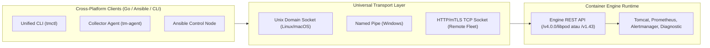
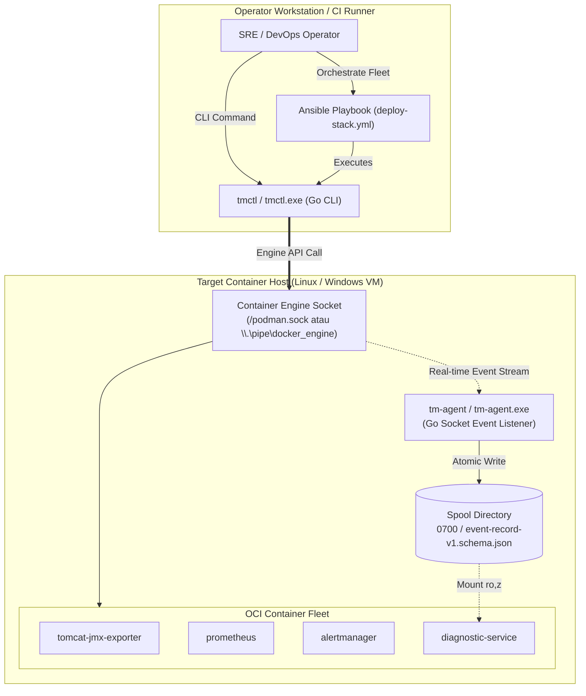

# TN-011 — Design Cross-Platform Container Engine API Orchestration, Unified Go CLI, and Multi-OS Agent Architecture

| Field | Value |
| --- | --- |
| Status | Completed |
| Activity Type | Architecture & Design |
| Record Type | Live |
| Project | Tomcat Monitoring |
| Phase | Continuous Integration and Deployment |
| Activity Date | 2026-09-13 |
| Recorded Date | 2026-09-13 |
| Owner | Eddy Wiyatno |
| Working Mode | Write |
| Authorization Status | Approved |
| Approved By | Eddy Wiyatno |
| Approval Date | 2026-09-13 |

---

## 🎯 Objective

Merancang dan membakukan arsitektur orkestrasi lintas sistem operasi (*Cross-Platform Multi-OS Orchestration*) untuk platform Tomcat Monitoring berbasis **Container Engine Socket API** (Podman / Docker) serta mendefinisikan desain teknis untuk dua kakas baru berbasis **Go (Golang)**:
1. **`tmctl` (Unified Operator CLI):** Kakas baris perintah terpadu lintas OS untuk menggantikan kumpulan skrip imperatif Bash pada mode manual.
2. **`tm-agent` (Unified Event Collector Daemon):** Agen pengumpul event kontainer berbasis soket API untuk menggantikan daemon shell `systemd --user` pada target host.
3. **Refaktorisasi Ansible Roles Deklaratif:** Menghilangkan eksekusi skrip shell imperatif di target host dengan memanfaatkan pemanggilan `tmctl` dan modul kontainer deklaratif native yang dilengkapi *OS Fact Branching*.

Aktivitas ini menindaklanjuti keputusan arsitektur [TM-ADR-0027](../../../../adr/tomcat-monitoring/adr-records/TM-ADR-0027.md) guna merealisasikan **TASK-TM-026**.

---

## 🌍 Background & Problem Statement

Pada evaluasi mendalam terhadap portabilitas platform, ditemukan bahwa meskipun seluruh beban kerja aplikasi (*workloads*) telah dikemas dalam kontainer OCI (*Container-Native*), **lapisan orkestrasi dan agen pengumpul event masih terkunci pada primitif sistem operasi Linux (*Linux-Centric Lock-in*)**:

### 1. Keterikatan Jalur Manual pada Shell Bash (`scripts/*.sh`)
Skrip orkestrasi lokal (`deploy-tomcat.sh`, `deploy-prometheus.sh`, `deploy-alertmanager.sh`, `deploy-diagnostic-service.sh`, `ingest-rule.sh`, `validate.sh`) ditulis murni dalam format Bash (`#!/usr/bin/env bash`) dengan dependensi utilitas POSIX. Ketika dijalankan di lingkungan Windows native (tanpa lapisan emulasi WSL2 atau Git Bash), skrip ini tidak dapat dieksekusi oleh Command Prompt (`cmd.exe`) maupun PowerShell.

### 2. Keterikatan Ansible Roles pada Eksekusi Skrip Shell Target Host
Pada role Ansible [`roles/role_container_stack/tasks/`](file:///home/eddywiyatno/git/tomcat-monitoring/roles/role_container_stack/tasks/), deployment kontainer masih memanfaatkan *wrapper* modul shell:
```yaml
- name: Deploy Tomcat JMX Exporter via deploy script
  ansible.builtin.shell: >
    bash {{ stack_project_root }}/scripts/deploy-tomcat.sh
```
Pola ini memaksa server target memiliki biner Bash dan berkas fisik `.sh`. Jika target armada (`[tomcat_fleet]`) adalah server Windows yang menjalankan kontainer Podman/Docker, tugas Ansible tersebut mengalami kegagalan fatal.

### 3. Keterikatan Event Collector pada Daemon Systemd Linux
Daemon pengamat event [`tomcat-diagnostic-event-collector`](file:///home/eddywiyatno/git/tomcat-diagnostic-event-collector) dibangun menggunakan skrip Bash (`src/collector.sh`) yang mendengarkan subshell perintah `podman events` dan didaftarkan sebagai `systemd --user` unit. Di lingkungan Windows, sistem init `systemd` tidak tersedia.

### 4. Fondasi 100% Container-Native
Seluruh aplikasi pada platform Tomcat Monitoring (Tomcat JMX Exporter, Prometheus, Alertmanager, Diagnostic Service, Mailpit) adalah **kontainer OCI murni**. Oleh karena itu, pengamatan status dan pengelolaan siklus hidup kontainer seharusnya tidak bergantung pada utilitas host OS, melainkan langsung berinteraksi dengan **Container Engine API**.

---

## 💡 Keunggulan Container Engine Socket API sebagai Single Source of Truth

Container Engine API (Podman Socket `/run/user/.../podman.sock` dan Docker Socket `/var/run/docker.sock` / Windows Named Pipe `\\.\pipe\docker_engine` / TCP Socket) menyediakan lapisan abstraksi universal yang melampaui batasan sistem operasi:



### 5 Keunggulan Utama Container Engine Socket API:

1. **Abstraksi Transport Universal (OS-Agnostic):**
   Protokol REST API yang sama persis dapat diakses melalui Unix Domain Socket di Linux, Named Pipe di Windows (`\\.\pipe\docker_engine`), atau soket TCP terenkripsi mTLS untuk kluster server jarak jauh.
2. **Protokol Streaming Asli (*HTTP Chunked Event Stream*):**
   Mendengarkan event siklus hidup kontainer secara langsung melalui endpoint streaming (`GET /events` pada Docker atau `GET /v4.0.0/libpod/events` pada Podman) tanpa overhead pembuatan subshell `podman events` atau *piping* proses Bash.
3. **Kontrak Data Terstruktur (*Structured JSON Contract*):**
   Respon API berbentuk JSON valid yang menghilangkan kerapuhan pembacaan string (*fragile CLI text scraping*), manipulasi `awk`/`sed`, dan perbedaan *line endings* (`CRLF`/`LF`).
4. **Semantik Status Presisi (*Deterministic Lifecycle Semantics*):**
   Menyediakan sinyal status kontainer yang akurat dan terstandardisasi (`died`, `oom`, `exit_code: 137`, `restart`, `health_status`).
5. **Keamanan Terisolasi Non-Root (*Rootless Security Isolation*):**
   Dapat diakses secara aman oleh proses pengguna rootless tanpa memerlukan hak akses administratif *host root* atau izin `sudo`.

---

## 🏛️ Arsitektur Tiga Komponen (Target State)



---

### Komponen 1: `tmctl` — Unified Operator CLI (Go)

Kakas baris perintah tunggal (*Single Static Binary*) yang mendistribusikan seluruh fungsionalitas manajemen platform tanpa memerlukan instalasi dependensi (Python, Node.js, atau Bash) pada workstation operator.

#### Subperintah Utama:
```bash
# Manajemen Lifecycle Stack Kontainer
tmctl stack deploy [--target <name>] [--env <name>] [--engine <podman|docker>]
tmctl stack status
tmctl stack clean [--all]

# Manajemen Aturan Diagnostik AI
tmctl rules ingest <path/to/rulepack.json> [--token <bearer_token>]
tmctl rules export [--category <name>] [--output <path.json>]

# Autentikasi Registri Kontainer Enterprise
tmctl registry login <host:port> <username> [--token-file <path>] [--auth-file <path>]

# Validasi & Pengujian Kepatuhan
tmctl validate [--layout] [--schemas] [--ansible]
```

#### Karakteristik Distribusi:
- Dikompilasi untuk target Linux (`tmctl`), Windows (`tmctl.exe`), dan macOS (`tmctl`).
- Distribusi instan (*zero-install / portable executable*).

---

### Komponen 2: `tm-agent` — Unified Event Collector Daemon (Go)

Agen background berkinerja tinggi yang menggantikan skrip `collector.sh` untuk memantau event kontainer dan mencatat bukti insiden ke direktori spool.

#### Alur Kerja Teknis:
1. **Koneksi Soket:** Mendeteksi dan membuka koneksi ke soket lokal (`/run/user/.../podman.sock`, `/var/run/docker.sock`, atau `\\.\pipe\docker_engine`).
2. **Event Filter:** Melakukan streaming filter pada event `container=tomcat-jmx-exporter` dengan jenis event `died`, `oom`, `restart`, `stop`.
3. **Validasi Skema:** Memvalidasi payload snapshot sebelum penulisan ke skema [`event-record-v1.schema.json`](file:///home/eddywiyatno/git/tomcat-diagnostic-event-collector/config/schemas/event-record-v1.schema.json).
4. **Penulisan Atomik & Retensi:** Menulis ke berkas sementara `.tmp` dengan izin `0600`, memverifikasi kuota, melakukan `rename` atomik ke `.json`, dan menjalankan *FIFO retention pruning* (maks 1000 berkas / 24 jam).

#### Mode Eksekusi Host:
- **Linux:** Berjalan sebagai daemon `systemd --user` unit.
- **Windows:** Berjalan sebagai *Windows Service* (menggunakan pustaka `golang.org/x/sys/windows/svc`) atau *Background Task*.

---

### Komponen 3: Refaktorisasi Ansible Roles Deklaratif

Ansible dipertahankan sebagai mesin orkestrasi multi-node enterprise ([TM-ADR-0025](../../../../adr/tomcat-monitoring/adr-records/TM-ADR-0025.md)), tetapi tugas eksekusinya direfaktor menjadi *thin declarative orchestrator*:

```yaml
# tasks/tomcat.yml (Refactored)
- name: Reconcile Tomcat Workload Desired State via tmctl
  ansible.builtin.command: >
    tmctl stack deploy --target tomcat --env {{ deploy_env }}
  changed_when: true
```

Untuk pendaftaran daemon `tm-agent`, Ansible menggunakan *OS Fact Branching*:
```yaml
# tasks/agent_daemon.yml
- name: Register tm-agent daemon on Linux host
  ansible.builtin.systemd:
    name: tm-agent.service
    state: started
    enabled: true
    scope: user
  when: ansible_os_family != "Windows"

- name: Register tm-agent service on Windows host
  ansible.windows.win_service:
    name: TomcatMonitoringAgent
    path: "C:\\monitoring\\bin\\tm-agent.exe"
    state: started
    start_mode: auto
  when: ansible_os_family == "Windows"
```

---

## 📊 Matriks Analisis Kesiapan Multi-OS

| Dimensi Evaluasi | Kondisi Eksisting | Target Arsitektur Baru (Go & Engine API) |
| :--- | :--- | :--- |
| **Jalur Manual Linux** | Skrip `scripts/*.sh` (Bash) ✅ | `tmctl` CLI binary (Go) ✅ *(Skrip .sh tetap dipertahankan)* |
| **Jalur Manual Windows** | ❌ Gagal (Tidak ada biner Bash di CMD/PowerShell) | `tmctl.exe` CLI binary (Go) ✅ |
| **Jalur CI/CD Ansible** | ⚠️ Wrapper shell `bash scripts/*.sh` (Hanya Linux) | `tmctl` invocation / declarative native module ✅ |
| **Event Collector Host** | `collector.sh` + `systemd --user` (Linux Only) | `tm-agent` binary via Container Socket API (Linux & Windows) ✅ |
| **Dependensi Target Host** | Wajib ada Bash, Linux coreutils, script files | **Zero-Script** (Hanya butuh Container Engine Socket) ✅ |
| **Integritas Kontrak Data** | Skema `event-record-v1.schema.json` | 100% Identik & Kompatibel Mundur (*Zero Breaking Change*) ✅ |

---

## 🗺️ Roadmap & Action Plan Eksekusi

```text
[ FASE 1: Perancangan & Pembangunan tmctl (Go CLI) ]
  ├── 1.1 Inisialisasi modul Go (go.mod) dan struktur package CLI.
  ├── 1.2 Implementasi adapter Container Engine API (Podman / Docker socket client).
  ├── 1.3 Implementasi subperintah: stack deploy/status/clean, rules ingest/export, registry login.
  ├── 1.4 Konfigurasi cross-compilation matrix (Linux amd64/arm64 & Windows amd64).
  └── 1.5 Pengujian unit dan integrasi CLI.

[ FASE 2: Pembangunan tm-agent (Go Event Collector Daemon) ]
  ├── 2.1 Implementasi socket event streaming client (/events endpoint).
  ├── 2.2 Implementasi format snapshot event sesuai event-record-v1.schema.json.
  ├── 2.3 Implementasi atomic file writer (mode 0600) & FIFO retention pruning engine.
  ├── 2.4 Integrasi lifecycle Windows Service (golang.org/x/sys/windows/svc) dan Linux systemd.
  └── 2.5 Uji verifikasi korelasi bukti insiden pada Diagnostic Service.

[ FASE 3: Refaktorisasi Ansible Roles & Integrasi Pipeline ]
  ├── 3.1 Refaktorisasi role_container_stack untuk memanggil tmctl alih-alih bash .sh.
  ├── 3.2 Implementasi OS Fact Branching pada role_event_collector (systemd vs win_service).
  ├── 3.3 Validasi eksekusi playbook deploy-stack.yml pada inventory multi-node.
  └── 3.4 Pembaruan dokumentasi operasional dan buku panduan SRE.
```

---

## 📖 Referensi ADR & Kontrak Terkait

* **[TM-ADR-0027 — Adopt Container Engine Socket API and Unified Cross-Platform Tooling for Multi-OS Orchestration](../../../../adr/tomcat-monitoring/adr-records/TM-ADR-0027.md)**
* **[TM-ADR-0026 — Adopt Adaptive Multi-Engine Container Runtime Portability](../../../../adr/tomcat-monitoring/adr-records/TM-ADR-0026.md)**
* **[TM-ADR-0025 — Delineate Responsibilities Between Jenkins CI/CD and Ansible](../../../../adr/tomcat-monitoring/adr-records/TM-ADR-0025.md)**
* **[TM-ADR-0008 — Use a Restricted Host Event Collector with a Normalized Evidence Spool](../../../../adr/tomcat-monitoring/adr-records/TM-ADR-0008.md)**
* **[Event Record JSON Schema v1](file:///home/eddywiyatno/git/tomcat-diagnostic-event-collector/config/schemas/event-record-v1.schema.json)**
