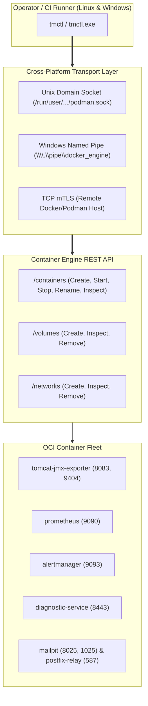

# TN-012 — Implement Unified Cross-Platform Operator CLI tmctl for Container Engine API Orchestration

| Field | Value |
| --- | --- |
| Status | Completed |
| Activity Type | Implementation & Tooling |
| Record Type | Live |
| Project | Tomcat Monitoring |
| Phase | Continuous Integration and Deployment |
| Activity Date | 2026-09-14 |
| Recorded Date | 2026-09-14 |
| Owner | Eddy Wiyatno |
| Working Mode | Write |
| Authorization Status | Approved |
| Approved By | Eddy Wiyatno |
| Approval Date | 2026-09-14 |

---

## 🎯 Objective

Mengimplementasikan kakas baris perintah tunggal (*Single Static Binary*) berbasis bahasa Go (**`tmctl`** / **`tmctl.exe`**) yang berkomunikasi langsung dengan **Container Engine Socket API** (Podman / Docker) untuk orkestrasi kontainer dan manajemen platform secara seragam lintas sistem operasi (*Linux & Windows*), mengeliminasi ketergantungan pada kumpulan skrip imperatif Bash `scripts/*.sh`.

Aktivitas ini merupakan realisasi fisik Fase 1 dari keputusan arsitektur [TM-ADR-0027](../../../../adr/tomcat-monitoring/adr-records/TM-ADR-0027.md) dan desain teknis [TN-011](TN-011-design-cross-platform-container-engine-api-orchestration-and-agent-architecture.md) guna menuntaskan **TASK-TM-027**.

---

## 🌍 Background & Problem Statement

Pada evaluasi arsitektur sebelumnya ([TM-ADR-0027](../../../../adr/tomcat-monitoring/adr-records/TM-ADR-0027.md)), diidentifikasi bahwa seluruh alur kerja manual operator masih bergantung pada kumpulan skrip shell Bash (`scripts/deploy-*.sh`, `scripts/ingest-rule.sh`, `scripts/export-rules.sh`, `scripts/registry-login-helper.sh`, `scripts/validate.sh`). Ketergantungan ini menimbulkan hambatan operasional:

1. **Kegagalan Eksekusi di Windows Native:** Operator di lingkungan Windows tidak dapat menjalankan skrip `.sh` melalui PowerShell atau Command Prompt tanpa memasang lapisan emulasi tambahan (*WSL2 / Git Bash*).
2. **Kerapuhan CLI Scraping & String Parsing:** Skrip imperatif rentan terhadap perbedaan *line endings* (`CRLF`/`LF`), hak akses oktal POSIX, dan perbedaan perilaku utilitas coreutils.
3. **Ketiadaan Antarmuka CLI Tunggal (*Unified Tooling*):** Operator harus mengingat dan mengeksekusi banyak skrip terpisah alih-alih berinteraksi melalui kakas standar berbasis subperintah deklaratif.

Untuk mengatasi permasalahan tersebut, dibangun biner mandiri `tmctl` yang memanfaatkan soket REST API Container Engine sebagai antarmuka universal.

---

## 🏛️ Arsitektur & Desain Komponen `tmctl`

`tmctl` dirancang dengan prinsip **Zero External Runtime Dependency** dan **CGO_ENABLED=0** (*Pure Static Binary*), memastikan biner dapat langsung dieksekusi tanpa instalasi runtime Python, Node.js, atau Bash pada workstation operator.



### Struktur Paket Go (*Package Layout*)

Modul Go diinisialisasi pada repositori mandiri [`tmctl`](file:///home/eddywiyatno/git/tmctl) dengan struktur direktori standar:

```text
tmctl/
├── go.mod                              # Inisialisasi modul Go (github.com/eddywiyatno/tmctl)
├── Makefile                            # Automasi kompilasi native dan matriks cross-compilation
├── Jenkinsfile                         # Declarative CI/CD pipeline
├── cmd/
│   └── tmctl/
│       └── main.go                     # Entrypoint CLI & command routing
├── internal/
│   ├── buildinfo/
│   │   └── version.go                  # Versioning, git commit SHA, build date, & OS/Arch
│   ├── config/
│   │   ├── config.go                   # Parser konfigurasi deklaratif (CONFIG, env, defaults)
│   │   └── config_test.go              # Unit test parser konfigurasi
│   ├── engine/
│   │   ├── client.go                   # EngineClient interface & socket auto-discovery
│   │   ├── engine_adapter.go           # REST API client implementation (Podman & Docker)
│   │   ├── socket_unix.go              # Unix Domain Socket dialer (Linux/Darwin)
│   │   ├── socket_windows.go           # Windows Named Pipe & TCP dialer (Windows)
│   │   └── types.go                    # Struct DTO untuk Container, Volume, Network, Image
│   ├── orchestrator/
│   │   ├── deployer.go                 # Orchestrator alur deployment & auto-rollback
│   │   ├── readiness.go                # Multi-endpoint readiness probing (HTTP/HTTPS/TCP)
│   │   ├── status.go                   # Inspeksi status kontainer & tabel ASCII
│   │   ├── cleaner.go                  # Pembersihan kontainer, volume, dan network
│   │   ├── specs.go                    # Builder spesifikasi deklaratif per workload
│   │   └── specs_test.go               # Unit test spesifikasi kontainer
│   ├── rules/
│   │   ├── ingest.go                   # Klien REST API Ingestion & Batch Payload Handler
│   │   └── export.go                   # Klien REST API Export & Category Aggregator
│   ├── registry/
│   │   ├── auth.go                     # Authfile manager & isolated login/logout
│   │   └── auth_test.go                # Unit test registry credential isolation
│   └── validator/
│       ├── validate.go                 # Validator layout direktori, schema JSON, dan forbidden files
│       └── validator_test.go           # Unit test validator
├── pkg/
│   └── termutil/
│       └── printer.go                  # Formatter output berwarna & tabel terminal
└── scripts/
    ├── build.sh                        # Skrip kompilasi silang multi-OS
    ├── test.sh                         # Skrip eksekusi unit test
    └── validate.sh                     # Skrip validasi kontrak repositori
```

---

## 🛠️ Implementasi Subperintah `tmctl`

### 1. Manajemen Siklus Hidup Stack (`tmctl stack`)

Subperintah `stack` mengelola pembuatan, pemantauan, dan pembersihan kontainer platform:

* **`tmctl stack deploy [--target <name>] [--env <name>] [--engine <podman|docker>]`:**
  - Melakukan rekonsiliasi jaringan bridge (`devops-lab`) dan named volumes (`tomcat_logs`, `diagnostic_data`, `prometheus_data`, `alertmanager_data`, dll).
  - Menyematkan flag relabeling SELinux secara adaptif (`:z` / `:ro,z` pada Linux, `:ro` pada non-SELinux).
  - **Zero-Downtime Rollback:** Melakukan rename kontainer aktif ke `<name>-rollback-snapshot`, membuat dan menyalakan kontainer baru, menjalankan *readiness probe*. Jika probe gagal, kontainer baru dieliminasi dan snapshot lama dipulihkan secara otomatis.
* **`tmctl stack status`:**
  - Menampilkan ringkasan tabular status seluruh kontainer armada monitoring, port bindings, dan status kesehatan (*health status*).
* **`tmctl stack clean [--all]`:**
  - Menghentikan dan menghapus seluruh kontainer armada monitoring. Opsi `--all` mencakup pembersihan volume persisten dan jaringan bridge.

### 2. Manajemen Aturan Diagnostik AI (`tmctl rules`)

Subperintah `rules` menjembatani interaksi operator SRE dengan mesin *Diagnostic Service*:

* **`tmctl rules ingest <path/to/rulepack.json> [--token <bearer_token>]`:**
  - Membaca payload JSON baik dalam format objek tunggal maupun *batch array*.
  - Mengirimkan HTTP POST ke `/api/v1/rules` dengan otentikasi Bearer Token.
  - Menangani respon *5-Layer Guard*: `201 Created` (sukses), `409 Conflict` (skip duplikasi), dan `400/422` (tolak payload tidak valid).
* **`tmctl rules export [--category <name>] [--output <path.json>] [--categories]`:**
  - Mengambil katalog aturan aktif dari Diagnostic Service.
  - Mendukung penyaringan kategori dan ringkasan agregasi kategori aktif.

### 3. Autentikasi Registri Kontainer Enterprise (`tmctl registry`)

* **`tmctl registry login <host:port> <username> [--token-file <path>] [--auth-file <path>]`:**
  - Membuat atau memperbarui berkas autentikasi OCI terisolasi (`--auth-file`) dengan kredensial terenkripsi Base64 tanpa mencemari konfigurasi global host.
* **`tmctl registry logout [host:port] [--auth-file <path>]`:**
  - Menghapus kredensial registri dari berkas otentikasi terisolasi.

### 4. Validasi Kepatuhan & Kontrak (`tmctl validate`)

* **`tmctl validate [--layout] [--schemas] [--ansible] [--dir <path>]`:**
  - Memverifikasi keberadaan berkas kontrak wajib (`CONFIG`, `README.md`, `AGENTS.md`).
  - Mengaudit repositori dari keberadaan berkas sensitif yang dilarang (`.pem`, `.key`, `.p12`, `.env`).
  - Memvalidasi sintaksis skema JSON pada seluruh berkas konfigurasi.

---

## 📊 Matriks Kompilasi Silang (*Cross-Compilation Matrix*)

Proses kompilasi silang diotomatisasi melalui `Makefile` dan menghasilkan biner statis mandiri:

| Target OS | Target Arch | Biner Output | Ukuran Biner | Keterangan |
| :--- | :--- | :--- | :---: | :--- |
| **Linux** | `amd64` | `bin/linux_amd64/tmctl` | 5.7 MB | Biner ELF 64-bit statis untuk Linux Server & CI/CD Runner |
| **Linux** | `arm64` | `bin/linux_arm64/tmctl` | 5.5 MB | Biner ELF 64-bit statis untuk arsitektur ARM64 / Graviton |
| **Windows** | `amd64` | `bin/windows_amd64/tmctl.exe` | 5.9 MB | Biner PE 64-bit untuk Workstation Windows (PowerShell / CMD) |

---

## 🧪 Hasil Pengujian & Verifikasi

### 1. Verifikasi Unit Testing Go
Seluruh unit test internal paket lulus 100%:
```text
=== RUN   TestDefaultConfig
--- PASS: TestDefaultConfig (0.00s)
=== RUN   TestParseConfigFile
--- PASS: TestParseConfigFile (0.00s)
=== RUN   TestWorkloadSpecs
--- PASS: TestWorkloadSpecs (0.00s)
=== RUN   TestRegistryLoginAndLogout
--- PASS: TestRegistryLoginAndLogout (0.00s)
=== RUN   TestValidateSensitiveFiles
--- PASS: TestValidateSensitiveFiles (0.00s)
=== RUN   TestValidateJSONFiles
--- PASS: TestValidateJSONFiles (0.00s)
PASS (ok: config, orchestrator, registry, validator)
```

### 2. Verifikasi Eksekusi Subperintah `tmctl stack status`
```text
$ tmctl stack status
ℹ INFO: Inspecting platform containers on podman (/run/user/1000/podman/podman.sock)...

SERVICE NAME                   CONTAINER NAME       IMAGE                                                                                            STATUS                    PORTS
--------------                 ----------------     -------                                                                                          --------                  -------
Tomcat JMX Exporter            tomcat-jmx-exporter  localhost/tomcat-jmx-exporter:1.0.0                                                              Exited (143) 7 hours ago  8083->8080/tcp, 9404->9404/tcp
Prometheus TSDB                prometheus           localhost/prometheus:1.0.0                                                                       Exited (0) 7 hours ago    9090->9090/tcp
Alertmanager                   alertmanager         localhost/alertmanager:1.0.0                                                                     Exited (0) 7 hours ago    9093->9093/tcp
Tomcat Diagnostic Service      diagnostic-service   localhost/tomcat-diagnostic-service:latest                                                       Exited (0) 7 hours ago    8443->8443/tcp
Mailpit Test Inbox             mailpit              ghcr.io/axllent/mailpit@sha256:c96991d9bef73594c246d89ca81411d4e916f03e76a7d2d72fa2ab5dd3c9ce24  Exited (0) 7 hours ago    1025->1025/tcp, 8025->8025/tcp
Postfix Enterprise SMTP Relay  postfix-relay        localhost/postfix-relay:latest                                                                   Exited (0) 7 hours ago    -
```

### 3. Verifikasi Eksekusi Subperintah `tmctl validate`
```text
$ tmctl validate --dir /home/eddywiyatno/git/tomcat-monitoring
ℹ INFO: Starting baseline validation on project root: /home/eddywiyatno/git/tomcat-monitoring
[1/3] Validating repository layout and required contract files...
[2/3] Auditing repository for forbidden sensitive material files...
[3/3] Validating JSON schema syntax integrity across configuration files...
✔ SUCCESS: All platform validation assertions passed successfully.
```

---

## 📈 Kesimpulan & Dampak Arsitektur

1. **Eliminasi Hambatan Multi-OS:** Operator Windows kini dapat mengelola seluruh siklus hidup kontainer Tomcat Monitoring secara native menggunakan `tmctl.exe` tanpa perlu memasang WSL2 atau Git Bash.
2. **Standardisasi Antarmuka Baris Perintah:** Seluruh alur kerja operasional (`stack`, `rules`, `registry`, `validate`) terintegrasi rapi dalam satu kakas terpadu dengan semantic help dan output terstruktur.
3. **Preservasi Kompatibilitas Mundur:** Skrip `scripts/*.sh` eksisting tetap dipertahankan sebagai *convenience wrapper* bagi pengembang Linux lokal tanpa menimbulkan disrupsi pada alur kerja yang sudah ada.
4. **Kesiapan Fase 2 & Fase 3:** Fondasi biner Go dan adapter Socket API yang telah dibangun pada `tmctl` siap dilanjutkan untuk pembangunan **`tm-agent`** (*Go Event Collector Daemon*, TASK-TM-028) dan refaktorisasi Ansible Roles deklaratif (TASK-TM-029).

---

## 🔗 Referensi ADR & Technical Notes Terkait

* **[TM-ADR-0027 — Adopt Container Engine Socket API and Unified Cross-Platform Tooling for Multi-OS Orchestration](../../../../adr/tomcat-monitoring/adr-records/TM-ADR-0027.md)**
* **[TM-ADR-0026 — Adopt Adaptive Multi-Engine Container Runtime Portability](../../../../adr/tomcat-monitoring/adr-records/TM-ADR-0026.md)**
* **[TN-011 — Design Cross-Platform Container Engine API Orchestration, Unified Go CLI, and Multi-OS Agent Architecture](TN-011-design-cross-platform-container-engine-api-orchestration-and-agent-architecture.md)**
* **[TASK-TM-027 — Implement Unified Cross-Platform Operator CLI tmctl (Fase 1)](../../follow-up-tasks.md#task-tm-027-implementasi-kakas-operator-terpadu-tmctl-go-unified-cli-untuk-orkestrasi-multi-os-fase-1)**
