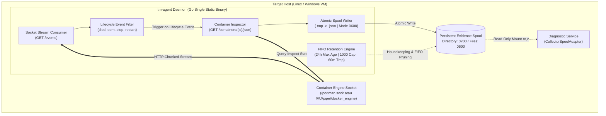

# TN-013 — Implement Unified Cross-Platform Event Collector Daemon tm-agent based on Container Engine Socket API

| Field | Value |
| --- | --- |
| Status | Completed |
| Activity Type | Implementation & Tooling |
| Record Type | Live |
| Project | Tomcat Monitoring |
| Phase | Continuous Integration and Deployment |
| Activity Date | 2026-09-14 |
| Recorded Date | 2026-09-14 |
| Owner | Eddy Wiyatno |
| Working Mode | Write |
| Authorization Status | Approved |
| Approved By | Eddy Wiyatno |
| Approval Date | 2026-09-14 |

---

## 🎯 Objective

Mengimplementasikan agen pengumpul event insiden tunggal (*Single Static Binary*) berbasis bahasa Go (**`tm-agent`** / **`tm-agent.exe`**) yang mengonsumsi *real-time streaming events* langsung dari **Container Engine Socket API** (Podman / Docker) dan menulis berkas bukti insiden (*evidence spool*) secara atomik ke direktori persisten berizin ketat sesuai kontrak kanonikal `event-record-v1.schema.json`.

Kakas ini mengeliminasi ketergantungan runtime pada skrip shell Bash (`collector.sh`) dan unit `systemd --user` Linux pada mesin target, serta merealisasikan Fase 2 dari keputusan arsitektur [TM-ADR-0027](../../../../adr/tomcat-monitoring/adr-records/TM-ADR-0027.md), [TM-ADR-0008](../../../../adr/tomcat-monitoring/adr-records/TM-ADR-0008.md), dan desain teknis [TN-011](TN-011-design-cross-platform-container-engine-api-orchestration-and-agent-architecture.md) guna menuntaskan **TASK-TM-028**.

---

## 🌍 Background & Problem Statement

Pada arsitektur diagnostik otonom platform Tomcat Monitoring, *Restricted Host Event Collector* bertindak sebagai komponen pengamat kejadian host/kontainer non-root yang mencatat bukti kejadian runtime (`container_state`, `runtime_oom`, `collector_status`) ke dalam berkas bukti (*evidence spool*) ternormalisasi untuk dianalisis oleh *Diagnostic Service*.

Namun, implementasi awal pada repositori `tomcat-diagnostic-event-collector` memiliki keterbatasan struktural:

1. **Keterikatan Host pada Shell Bash (`collector.sh`):**
   Daemon diimplementasikan menggunakan skrip shell Bash yang menjalankan subshell `podman events` atau `docker events` serta memanggil utilitas POSIX (`find`, `sort`, `wc`, `cat`, `date`, `chmod`). Skrip ini tidak dapat dijalankan secara native pada server target berbasis Windows (PowerShell / Command Prompt) tanpa lapisan emulasi WSL2.
2. **Keterikatan Init System pada Systemd Linux:**
   Daemon didaftarkan dan dikelola melalui `systemd --user` unit. Di lingkungan Windows Server, sistem init `systemd` tidak tersedia sehingga pengumpulan bukti insiden terhenti.
3. **Overhead Parsing Imperatif:**
   Pengolahan *event stream* melalui pipa proses shell imperatif (*bash process piping & string slicing*) rentan terhadap kegagalan konkurensi saat terjadi lonjakan event (*event storm*).

Untuk mengatasi kendala di atas, dibangun agen background mandiri `tm-agent` yang berinteraksi langsung dengan Container Engine Socket REST API dan beroperasi secara seragam di lingkungan Linux maupun Windows.

---

## 🏛️ Arsitektur & Desain Komponen `tm-agent`

`tm-agent` dirancang dengan prinsip **Zero External Runtime Dependency** (`CGO_ENABLED=0`), menghasilkan biner statis murni yang dapat langsung dieksekusi tanpa memerlukan instalasi Python, Bash, atau Linux coreutils pada host target.



---

### Struktur Paket Go (*Package Layout*)

Modul Go diinisialisasi pada repositori mandiri [`tm-agent`](file:///home/eddywiyatno/git/tm-agent) (`github.com/eddywiyatno/tm-agent`) dengan struktur direktori standar enterprise:

```text
tm-agent/
├── .gitignore                          # Git ignore rules untuk biner dan temporary files
├── AGENTS.md                           # Tata kelola agen dan instruksi operasional
├── CONFIG                              # Metadata non-secret konfigurasi baseline
├── CONFIG.example                      # Template enterprise baseline configuration
├── Jenkinsfile                         # Declarative CI/CD pipeline (4 Quality Gates)
├── Makefile                            # Automasi kompilasi native dan cross-compilation
├── PROJECT                             # Identitas proyek (tm-agent)
├── README.md                           # Panduan operasional dan dokumentasi biner
├── VERSION                             # Versi rilis semantik (0.1.0)
├── cmd/
│   └── tm-agent/
│       └── main.go                     # Entrypoint daemon, CLI flags, & runner routing
├── internal/
│   ├── buildinfo/
│   │   └── version.go                  # Metadata versi, commit SHA, tanggal build, OS/Arch
│   ├── config/
│   │   ├── config.go                   # Parser konfigurasi deklaratif (CONFIG, env, defaults)
│   │   └── config_test.go              # Unit test parser konfigurasi
│   ├── engine/
│   │   ├── client.go                   # Interface EngineClient & auto-discovery socket
│   │   ├── engine_adapter.go           # REST API client & streaming event consumer (/events)
│   │   ├── socket_unix.go              # Unix Domain Socket transport dialer (Linux/Darwin)
│   │   ├── socket_windows.go           # Windows Named Pipe & TCP transport dialer (Windows)
│   │   ├── types.go                    # Struct DTO untuk Container Event & Container Inspect
│   │   └── stream_test.go              # Unit test parser streaming event
│   ├── schema/
│   │   ├── record.go                   # Struct DTO kanonikal event-record-v1
│   │   ├── validator.go                # Validator payload & field assertions
│   │   └── schema_test.go              # Unit test validasi skema JSON event-record-v1
│   ├── spool/
│   │   ├── writer.go                   # Atomic file writer (.tmp -> .json dengan mode 0600)
│   │   ├── retention.go                # FIFO quota enforcement, stale tmp & json pruner
│   │   └── spool_test.go               # Unit test penulisan atomik, izin berkas, & FIFO cap
│   ├── collector/
│   │   ├── collector.go                # Core daemon orchestrator (streaming loop & snapshot logic)
│   │   └── collector_test.go           # Unit test workflow collector & snapshot mock
│   ├── service/
│   │   ├── service_unix.go             # Unix daemon runner (foreground / systemd signals)
│   │   └── service_windows.go          # Windows Service runner (golang.org/x/sys/windows/svc)
│   └── validator/
│       ├── validate.go                 # Static repository governance validator
│       └── validator_test.go           # Unit test validator
├── pkg/
│   └── termutil/
│       └── printer.go                  # Formatter output berwarna & log terstruktur terminal
├── scripts/
│   ├── build.sh                        # Skrip kompilasi silang multi-OS
│   ├── test.sh                         # Skrip eksekusi unit test Go
│   └── validate.sh                     # Skrip validasi kontrak repositori
└── systemd/
    └── tm-agent.service                # Template service unit systemd --user untuk Linux host
```

---

## 🛠️ Fitur & Implementasi Teknis `tm-agent`

### 1. Konsumsi Streaming Soket Event Kontainer (*Direct Socket Streaming*)

`tm-agent` membuka koneksi HTTP streaming persisten ke endpoint `GET /events` pada Container Engine REST API (Podman / Docker) dengan menyematkan filter `type=container` dan `container=<TARGET_CONTAINER>`.

* **Penyaringan Event Relevan:** Agen mendeteksi event siklus hidup kontainer target (`died`, `die`, `stop`, `start`, `unpause`, `oom`, `kill`, `restart`).
* **Resiliensi Koneksi Soket (*Auto-Reconnect*):** Jika koneksi soket terputus (misalnya engine di-restart), `tm-agent` secara otomatis melakukan *retry loop* dengan *backoff* 3 detik tanpa menghentikan daemon.

### 2. Kepatuhan Kontrak Data Kanonikal (*100% Schema Fidelity*)

Setiap event yang tertangkap memicu inspeksi kontainer melalui endpoint `GET /containers/{name}/json` dan diformat menjadi record bukti kanonikal sesuai [`event-record-v1.schema.json`](file:///home/eddywiyatno/git/tomcat-diagnostic-event-collector/config/schemas/event-record-v1.schema.json):

* **`container_state`:**
  - Status `collected` dengan payload `{"state": "running"}` atau `{"state": "exited"}`.
  - Status `not_found` dengan payload `{"state": "not_found", "container": "..."}` jika kontainer tidak terdaftar.
* **`runtime_oom`:**
  - Status `collected` dengan payload `{"oomKilled": bool, "exitCode": int}`.
* **`collector_status`:**
  - Status `unavailable` dengan payload `{"error": "..."}` jika komunikasi ke socket engine mengalami kegagalan.

### 3. Mesin Penulisan Atomik & Isolasi Hak Akses (*Atomic Spool Writer*)

* **Inisialisasi Direktori:** Memastikan direktori spool memiliki hak akses ketat `0700` (`rwx------`).
* **Penulisan Dua Tahap:**
  1. Data JSON ditulis ke berkas temporer `${timestamp}_${type}.tmp` dengan izin `0600` (`rw-------`).
  2. Verifikasi batas ukuran maksimal ($16\text{ KiB}$ / $16.384\text{ bytes}$). Berkas yang melampaui batas akan dibatalkan dan dihapus.
  3. Berkas di-*rename* secara atomik menjadi `${timestamp}_${type}.json` menggunakan Unix timestamp nanodetik presisi.

### 4. Kebijakan Retensi & Kuota Spool (*FIFO Retention Engine*)

Untuk mencegah penumpukan berkas tak terbatas (*Zero Unbounded Spool*), `tm-agent` menjalankan siklus pembersihan otomatis:
* **Pembersihan Berkas `.tmp` Terlantar:** Menghapus seluruh berkas `.tmp` yang berusia $> 60\text{ menit}$.
* **Pemangkasan Berkas `.json` Kadaluwarsa:** Menghapus seluruh berkas `.json` yang berusia $> 24\text{ jam}$.
* **Penegakan Kuota Kapasitas FIFO:** Membatasi jumlah berkas `.json` aktif maksimal 1000 berkas. Jika melebihi kuota, berkas tertua dihapus terlebih dahulu berdasarkan urutan leksikografis stempel waktu.

### 5. Multi-OS Background Runner

* **Linux:** Dijalankan di latar belakang melalui unit service `systemd --user` (`systemd/tm-agent.service`) dengan penanganan sinyal `SIGTERM` dan `SIGINT` untuk *graceful shutdown*.
* **Windows:** Mendukung eksekusi ganda: sebagai proses konsol interaktif (PowerShell / CMD) atau didaftarkan sebagai *Windows Service* resmi (`TomcatMonitoringAgent`) menggunakan pustaka `golang.org/x/sys/windows/svc`.

---

## 📊 Matriks Kompilasi Silang (*Cross-Compilation Matrix*)

Proses kompilasi silang diotomatisasi melalui `Makefile` dan `scripts/build.sh`, menghasilkan biner statis mandiri:

| Target OS | Target Arch | Biner Output | Ukuran Biner | Keterangan |
| :--- | :--- | :--- | :---: | :--- |
| **Linux** | `amd64` | `bin/linux_amd64/tm-agent` | 6.1 MB | Biner ELF 64-bit statis untuk Linux Server & systemd daemon |
| **Linux** | `arm64` | `bin/linux_arm64/tm-agent` | 5.6 MB | Biner ELF 64-bit statis untuk arsitektur ARM64 / Graviton |
| **Windows** | `amd64` | `bin/windows_amd64/tm-agent.exe` | 6.4 MB | Biner PE 64-bit untuk Windows Service & Background Process |

---

## 🧪 Hasil Pengujian & Verifikasi Kualitas

### 1. Verifikasi Unit Testing Go
Seluruh 10 unit test internal pada seluruh paket (`config`, `engine`, `schema`, `spool`, `collector`, `validator`) lulus 100%:

```text
=== RUN   TestCollectorRecordSnapshotRunningContainer
--- PASS: TestCollectorRecordSnapshotRunningContainer (0.00s)
=== RUN   TestCollectorRecordSnapshotNotFoundContainer
--- PASS: TestCollectorRecordSnapshotNotFoundContainer (0.00s)
=== RUN   TestCollectorRecordSnapshotEngineError
--- PASS: TestCollectorRecordSnapshotEngineError (0.00s)
=== RUN   TestCollectorRunOnce
--- PASS: TestCollectorRunOnce (0.00s)
=== RUN   TestNewDefaultConfig
--- PASS: TestNewDefaultConfig (0.00s)
=== RUN   TestLoadConfigFile
--- PASS: TestLoadConfigFile (0.00s)
=== RUN   TestApplyEnvOverrides
--- PASS: TestApplyEnvOverrides (0.00s)
=== RUN   TestEventMessageNormalization
--- PASS: TestEventMessageNormalization (0.00s)
=== RUN   TestStreamingEventParsing
--- PASS: TestStreamingEventParsing (0.00s)
=== RUN   TestValidEventRecords
--- PASS: TestValidEventRecords (0.00s)
=== RUN   TestInvalidEventRecords
--- PASS: TestInvalidEventRecords (0.00s)
=== RUN   TestWriteRecordAtomic
--- PASS: TestWriteRecordAtomic (0.00s)
=== RUN   TestWriteRecordSizeLimit
--- PASS: TestWriteRecordSizeLimit (0.00s)
=== RUN   TestPruneStaleTmpAndJson
--- PASS: TestPruneStaleTmpAndJson (0.00s)
=== RUN   TestPruneFIFOQuota
--- PASS: TestPruneFIFOQuota (0.00s)
=== RUN   TestValidateRepositoryValid
--- PASS: TestValidateRepositoryValid (0.00s)
PASS (ok: collector, config, engine, schema, spool, validator)
```

### 2. Verifikasi Eksekusi One-Shot Snapshot Live terhadap Podman Socket

Eksekusi snapshot langsung terhadap socket runtime Podman (`/run/user/1000/podman/podman.sock`) membuktikan pembentukan berkas bukti insiden secara atomik dan sesuai skema:

```text
$ ./bin/tm-agent --run-once --spool-dir /tmp/test-agent-spool --target tomcat-jmx-exporter
✔ SUCCESS: Connected to container engine: podman (API: 1.41, OS: linux)
ℹ INFO: Starting tm-agent Event Collector Daemon
ℹ INFO: Target Workload : lab/tomcat-01/default (tomcat-jmx-exporter)
ℹ INFO: Spool Directory : /tmp/test-agent-spool
ℹ INFO: Container Engine: podman (/run/user/1000/podman/podman.sock)
✔ SUCCESS: Initial snapshot recorded (2 evidence files written)
ℹ INFO: One-shot snapshot execution completed successfully

$ ls -la /tmp/test-agent-spool/
drwx------  2 eddywiyatno eddywiyatno  4096 Sep 14 07:52 .
-rw-------  1 eddywiyatno eddywiyatno   264 Sep 14 07:52 1789347140608638731_container_state.json
-rw-------  1 eddywiyatno eddywiyatno   282 Sep 14 07:52 1789347140608775839_runtime_oom.json
```

**Payload `container_state.json`:**
```json
{
  "schema_version": 1,
  "type": "container_state",
  "target_id": "lab/tomcat-01/default",
  "generation": 1,
  "observed_at": "2026-09-14T00:52:20Z",
  "status": "collected",
  "strength": "direct",
  "value": {
    "state": "exited"
  },
  "redacted": false
}
```

**Payload `runtime_oom.json`:**
```json
{
  "schema_version": 1,
  "type": "runtime_oom",
  "target_id": "lab/tomcat-01/default",
  "generation": 1,
  "observed_at": "2026-09-14T00:52:20Z",
  "status": "collected",
  "strength": "direct",
  "value": {
    "oomKilled": false,
    "exitCode": 143
  },
  "redacted": false
}
```

### 3. Verifikasi Tata Kelola Repositori & Kontrak

```text
$ ./bin/tm-agent --validate
ℹ INFO: Starting baseline validation on project root: .
[1/3] Validating repository layout and required contract files...
[2/3] Auditing repository for forbidden sensitive material files...
[3/3] Validating JSON schema syntax integrity across configuration files...
✔ SUCCESS: All platform validation assertions passed successfully.
```

---

## 📈 Kesimpulan & Dampak Arsitektur

1. **Eliminasi Total Ketergantungan Shell:** Mesin pengumpul bukti insiden tidak lagi memerlukan Bash, subshell `podman events`, awk, sed, atau Linux coreutils pada host target.
2. **Kesiapan Multi-OS Penuh (Linux & Windows Native):** `tm-agent` dapat beroperasi sebagai daemon background `systemd` di Linux dan *Windows Service* di Windows Server, memungkinkan pemantauan kontainer OCI berjalan mulus pada platform heterogen.
3. **Preservasi Kontrak 100% (*Zero Breaking Change*):** Berkas JSON yang dihasilkan oleh `tm-agent` mematuhi skema `event-record-v1.schema.json` secara presisi, menjamin kompatibilitas penuh dengan *Diagnostic Service* tanpa perubahan kode analitik.
4. **Kesiapan Menuju Fase 3:** Dengan selesainya `tmctl` (Fase 1) dan `tm-agent` (Fase 2), platform Tomcat Monitoring siap melangkah ke **Fase 3 (TASK-TM-029)** untuk merefaktor Ansible Roles menjadi *thin declarative orchestrator*.

---

## 🔗 Referensi ADR & Technical Notes Terkait

* **[TM-ADR-0027 — Adopt Container Engine Socket API and Unified Cross-Platform Tooling for Multi-OS Orchestration](../../../../adr/tomcat-monitoring/adr-records/TM-ADR-0027.md)**
* **[TM-ADR-0008 — Use a Restricted Host Event Collector with a Normalized Evidence Spool](../../../../adr/tomcat-monitoring/adr-records/TM-ADR-0008.md)**
* **[TM-ADR-0026 — Adopt Adaptive Multi-Engine Container Runtime Portability](../../../../adr/tomcat-monitoring/adr-records/TM-ADR-0026.md)**
* **[TN-011 — Design Cross-Platform Container Engine API Orchestration, Unified Go CLI, and Multi-OS Agent Architecture](TN-011-design-cross-platform-container-engine-api-orchestration-and-agent-architecture.md)**
* **[TN-012 — Implement Unified Cross-Platform Operator CLI tmctl for Container Engine API Orchestration](TN-012-implement-unified-cross-platform-operator-cli-tmctl.md)**
* **[TASK-TM-028 — Implement Unified Cross-Platform Event Collector Daemon tm-agent (Fase 2)](../../follow-up-tasks.md#task-tm-028-implementasi-agen-pengumpul-event-kontainer-tm-agent-go-daemon-berbasis-socket-api-fase-2)**
