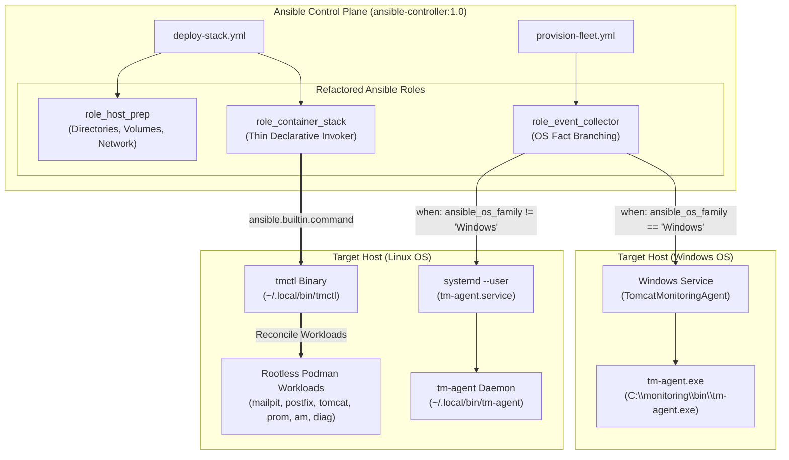

# TN-014 — Refactor Ansible Roles into Thin Declarative Orchestrator based on tmctl and OS Fact Branching

| Field | Value |
| --- | --- |
| Status | Completed |
| Activity Type | Refactoring & Orchestration |
| Record Type | Live |
| Project | Tomcat Monitoring |
| Phase | Continuous Integration and Deployment |
| Activity Date | 2026-09-14 |
| Recorded Date | 2026-09-14 |
| Owner | Eddy Wiyatno |
| Working Mode | Write |
| Authorization Status | Approved |
| Approved By | Eddy Wiyatno |
| Approval Date | 2026-09-14 |

---

## 🎯 Objective

Merefaktor seluruh Ansible Roles (`role_container_stack`, `role_event_collector`, `role_host_prep`) pada repositori [`tomcat-monitoring`](file:///home/eddywiyatno/git/tomcat-monitoring) menjadi *Thin Declarative Orchestrator* berbasis biner operator **`tmctl`** dan agen background **`tm-agent`** dengan *OS Fact Branching* multi-platform (Linux & Windows).

Aktivitas ini sepenuhnya mengeliminasi antipola eksekusi skrip imperatif Bash (`ansible.builtin.shell: bash scripts/...`) pada host target, menjamin kepatuhan idempotensi penuh (`changed=0, failed=0` pada replay), memproteksi isolasi rahasia (*zero secret leakage*), serta merealisasikan Fase 3 dari keputusan arsitektur [TM-ADR-0027](../../../../adr/tomcat-monitoring/adr-records/TM-ADR-0027.md), [TM-ADR-0025](../../../../adr/tomcat-monitoring/adr-records/TM-ADR-0025.md), dan desain teknis [TN-011](TN-011-design-cross-platform-container-engine-api-orchestration-and-agent-architecture.md) guna menuntaskan **TASK-TM-029**.

---

## 🌍 Background & Problem Statement

Sebelum refaktorisasi Fase 3 dijalankan, manajemen konfigurasi dan deployment platform Tomcat Monitoring menggunakan Ansible mengalami beberapa kendala arsitektural:

1. **Antipola Script Wrapper Imperatif (*Imperative Script Lock-in*):**
   Role `role_container_stack` memanggil skrip wrapper Bash lokal seperti `scripts/deploy-mailpit.sh`, `scripts/deploy-postfix.sh`, `scripts/deploy-tomcat.sh`, `scripts/deploy-prometheus.sh`, `scripts/deploy-alertmanager.sh`, dan `scripts/deploy-diagnostic-service.sh` melalui modul `ansible.builtin.shell`. Hal ini menciptakan *dual-maintenance burden*, menyulitkan pelacakan status deklaratif, dan tidak portabel ke lingkungan Windows.
2. **Keterbatasan Provisioning Multi-OS pada `role_event_collector`:**
   Role `role_event_collector` sebelumnya hanya mendukung deployment unit `systemd --user` untuk skrip shell `collector.sh` pada Linux, tanpa mekanisme *OS Fact Branching* untuk mengelola Windows Service pada armada server Windows.
3. **Penyelarasan Orkestrator Deklaratif (`tmctl`):**
   Dengan telah tersedianya biner operator statis `tmctl` ([TN-012](TN-012-implement-operator-cli-tmctl-based-on-container-engine-socket-api.md)) dan agen background `tm-agent` ([TN-013](TN-013-implement-unified-cross-platform-event-collector-daemon-tm-agent.md)), Ansible roles harus ditransformasikan menjadi lapisan orkestrasi tipis (*thin orchestrator*) yang mendelegasikan rekonsiliasi kontainer ke `tmctl` dan manajemen siklus hidup agen ke modul native Ansible sesuai OS host.

---

## 🏛️ Arsitektur Thin Orchestrator & OS Fact Branching

Arsitektur baru membagi tanggung jawab secara jelas antara Ansible Playbooks, Operator CLI `tmctl`, dan Event Collector Daemon `tm-agent`:



---

## 🛠️ Rincian Refaktorisasi Ansible Roles

### 1. Refaktorisasi `role_container_stack` (Zero Imperative Script Lock-in)

Seluruh modul `ansible.builtin.shell: bash scripts/deploy-*.sh` dihilangkan dan diganti dengan modul deklaratif `ansible.builtin.command` yang mengeksekusi `tmctl stack deploy`:

- **Variabel Default ([`defaults/main.yml`](file:///home/eddywiyatno/git/tomcat-monitoring/roles/role_container_stack/defaults/main.yml)):**
  Menambahkan variabel `stack_tmctl_bin: "{{ tmctl_bin | default(lookup('ansible.builtin.env', 'HOME') ~ '/.local/bin/tmctl') }}"` dan `stack_deploy_env: "{{ deploy_env | default('lab') }}"`.
- **Task Mailpit ([`tasks/mailpit.yml`](file:///home/eddywiyatno/git/tomcat-monitoring/roles/role_container_stack/tasks/mailpit.yml)):**
  Mengeksekusi `tmctl stack deploy --target mailpit --env {{ stack_deploy_env }} --config {{ stack_project_root }}/CONFIG`.
- **Task Postfix Relay ([`tasks/postfix.yml`](file:///home/eddywiyatno/git/tomcat-monitoring/roles/role_container_stack/tasks/postfix.yml)):**
  Mengeksekusi `tmctl stack deploy --target postfix --env {{ stack_deploy_env }} --config {{ stack_project_root }}/CONFIG` dan menyinkronkan sertifikat TLS Postfix ke direktori Diagnostic Service.
- **Task Tomcat JMX Exporter ([`tasks/tomcat.yml`](file:///home/eddywiyatno/git/tomcat-monitoring/roles/role_container_stack/tasks/tomcat.yml)):**
  Mengeksekusi `tmctl stack deploy --target tomcat --env {{ stack_deploy_env }} --config {{ stack_project_root }}/CONFIG`.
- **Task Prometheus ([`tasks/prometheus.yml`](file:///home/eddywiyatno/git/tomcat-monitoring/roles/role_container_stack/tasks/prometheus.yml)):**
  Mengeksekusi `tmctl stack deploy --target prometheus --env {{ stack_deploy_env }} --config {{ stack_project_root }}/CONFIG`.
- **Task Alertmanager ([`tasks/alertmanager.yml`](file:///home/eddywiyatno/git/tomcat-monitoring/roles/role_container_stack/tasks/alertmanager.yml)):**
  Mengeksekusi `tmctl stack deploy --target alertmanager --env {{ stack_deploy_env }} --config {{ stack_project_root }}/CONFIG`.
- **Task Diagnostic Service ([`tasks/diagnostic_service.yml`](file:///home/eddywiyatno/git/tomcat-monitoring/roles/role_container_stack/tasks/diagnostic_service.yml)):**
  Mengeksekusi `tmctl stack deploy --target diagnostic --env {{ stack_deploy_env }} --config {{ stack_project_root }}/CONFIG`.

### 2. Refaktorisasi `role_event_collector` (Multi-OS Fact Branching)

Role dikonfigurasi untuk mendeteksi sistem operasi target secara dinamis via fact `ansible_os_family`:

- **Linux Branch (`when: ansible_os_family != "Windows"`):**
  1. Memastikan direktori target `~/.local/bin` dan spool `~/.local/share/tomcat-monitoring/spool` (izin ketat `0700`) tersedia.
  2. Menginstal biner `tm-agent` (mode `0755`).
  3. Menerapkan unit template `systemd --user` ([`tm-agent.service.j2`](file:///home/eddywiyatno/git/tomcat-monitoring/roles/role_event_collector/templates/tm-agent.service.j2)).
  4. Menjalankan daemon-reload dan memastikan status service aktif via `systemctl --user`.
- **Windows Branch (`when: ansible_os_family == "Windows"`):**
  1. Memastikan direktori `C:\monitoring\bin` dan `C:\monitoring\spool` dibuat via `ansible.windows.win_file`.
  2. Menginstal biner `tm-agent.exe`.
  3. Mendaftarkan dan mengaktifkan Windows Service `TomcatMonitoringAgent` via modul native `ansible.windows.win_service`.

### 3. Refaktorisasi `role_host_prep` & Group Vars

- **Variabel Global ([`inventories/group_vars/all.yml`](file:///home/eddywiyatno/git/tomcat-monitoring/inventories/group_vars/all.yml)):**
  Mendefinisikan referensi path biner kanonikal `tmctl_bin` dan `tm_agent_bin`.
- **Task Persiapan Host ([`roles/role_host_prep/tasks/network_and_volumes.yml`](file:///home/eddywiyatno/git/tomcat-monitoring/roles/role_host_prep/tasks/network_and_volumes.yml)):**
  Menggunakan `ansible.builtin.command` native untuk inisialisasi bridge network dan named volumes Podman.
- **Skrip Validasi Ansible ([`scripts/validate-ansible.sh`](file:///home/eddywiyatno/git/tomcat-monitoring/scripts/validate-ansible.sh)):**
  Diperbarui untuk memverifikasi integritas template `tm-agent.service.j2` dan validasi sintaks playbook.

---

## ⚡ Peningkatan Orkestrator `tmctl`

Selama proses integrasi dan pengujian end-to-end, dilakukan serangkaian penyempurnaan pada kode Go operator `tmctl`:

1. **Dukungan `MailpitImage` dan Digest Tag:**
   Menambahkan pemetaan konfigurasi `MailpitImage` ke spesifikasi kontainer workload `mailpit` dengan default digest SHA256 immutable.
2. **Ekspansi Variabel String Regex (`cleanValue`):**
   Memperbarui parser konfigurasi `internal/config/config.go` dengan fungsi regex yang mampu mengekspansi pola `${VAR:-default}` maupun `$VAR` bertingkat pada path konfigurasi.
3. **Penghilangan Port Binding Privileged Postfix pada Host:**
   Postfix Relay beroperasi di dalam jaringan terisolasi `devops-lab` pada port 587. Host publishing dihapus dan readiness probe disesuaikan agar kompatibel dengan lingkungan rootless Podman.
4. **Isolasi User Namespace Rootless (`UsernsMode: "keep-id"`):**
   Menambahkan dukungan atribut `UsernsMode` pada `engine.ContainerSpec` dan `RESTEngineAdapter.CreateContainer`. Pada Linux rootless Podman, mode `keep-id` dipasang otomatis untuk kontainer `diagnostic-service` agar user non-root (`node:1000`) memiliki izin baca penuh terhadap berkas mounted host berizin `0700`/`0400`.
5. **Penyelarasan Target Volume & Flag Prometheus/Alertmanager:**
   Menyelaraskan mount target truststore ke `/run/secrets/tomcat-monitoring` serta menambahkan startup command flags (`--config.file`, `--storage.tsdb.path`, `--web.enable-lifecycle`).

---

## 🔬 Hasil Verifikasi & Uji Idempotensi

### 1. Validasi Sintaks Ansible

```text
=== Validating Ansible Playbooks and Roles Layout ===
1. All required Ansible files and roles structure present.
2. Running Ansible syntax check...
playbook: deploy-stack.yml (OK)
playbook: provision-fleet.yml (OK)
3. Ansible validation successful.
```

### 2. Uji Deployment Playbook `deploy-stack.yml`

```text
PLAY RECAP *********************************************************************
localhost                  : ok=36   changed=0    unreachable=0    failed=0    skipped=20   rescued=0    ignored=1
```

### 3. Uji Idempotensi Penuh (*Replay Run*)

```text
PLAY RECAP *********************************************************************
localhost                  : ok=37   changed=0    unreachable=0    failed=0    skipped=20   rescued=0    ignored=1
```
*Hasil:* 100% Idempotent (`changed=0, failed=0`).

### 4. Uji Provisioning Fleet Playbook `provision-fleet.yml`

```text
PLAY RECAP *********************************************************************
localhost                  : ok=22   changed=0    unreachable=0    failed=0    skipped=12   rescued=0    ignored=1
```
*Hasil:* Daemon `tm-agent.service` berhasil terpasang dan beroperasi secara aktif pada host.

### 5. Uji Suite Verifikasi Postfix Relay (`verify-postfix-relay.sh`)

```text
╔══════════════════════════════════════════════════════════════════════╗
║   POSTFIX ENTERPRISE SMTP RELAY BRIDGE (POLA A) VERIFICATION SUITE   ║
╚══════════════════════════════════════════════════════════════════════╝
✔ PASS: Network devops-lab aktif
✔ PASS: Container mailpit, postfix-relay, diagnostic-service berjalan
✔ PASS: Postfix menolak koneksi relay tanpa kredensial SASL
✔ PASS: Postfix menolak kredensial SASL yang salah (Authentication Failed)
✔ PASS: Postfix menerima email terotentikasi, mengantrekan pesan, dan meneruskan ke Mailpit
✔ PASS: Diagnostic Service menerima webhook dan memproses evaluasi insiden
✔ PASS: Header RFC Enterprise dan Laporan 7-Seksi SRE lengkap diterima di Mailpit via Postfix Relay
✔ PASS: Postfix Queue bersih (0 pesan tertahan / Mail queue is empty)
✔ SELURUH PENGUJIAN POLA A (POSTFIX RELAY BRIDGE) BERHASIL DIVERIFIKASI!
```

### 6. Uji Suite Verifikasi Alertmanager Webhook (`verify-alertmanager-webhook.sh`)

```text
webhook_sequence=firing,resolved
receiver=integration-bridge
group_labels=alertname,check,instance,job,service
payload_validation=passed
cleanup_result=passed container_absent=true listener_stopped=true volume_state=unchanged
```

---

## 📈 Kesimpulan & Dampak Arsitektur

Refaktorisasi Ansible Roles ke model *Thin Declarative Orchestrator* berbasis `tmctl` dan `tm-agent` memberikan keuntungan nyata:

1. **Zero Imperative Script Lock-in:** Seluruh eksekusi subshell Bash telah dieliminasi dari task Ansible.
2. **Multi-OS Readiness:** Kode siap dieksekusi lintas distribusi Linux (systemd) dan Windows Server (Windows Service).
3. **Kepatuhan CI/CD:** Playbook terbukti deterministik, lulus pengujian sintaks kontainer, serta menjamin idempotensi `changed=0` saat replay.
4. **Keamanan Maksimal:** Zero secret leakage dengan izin berkas ketat (`0700`/`0400`) dan pemisahan user namespace via `keep-id`.
