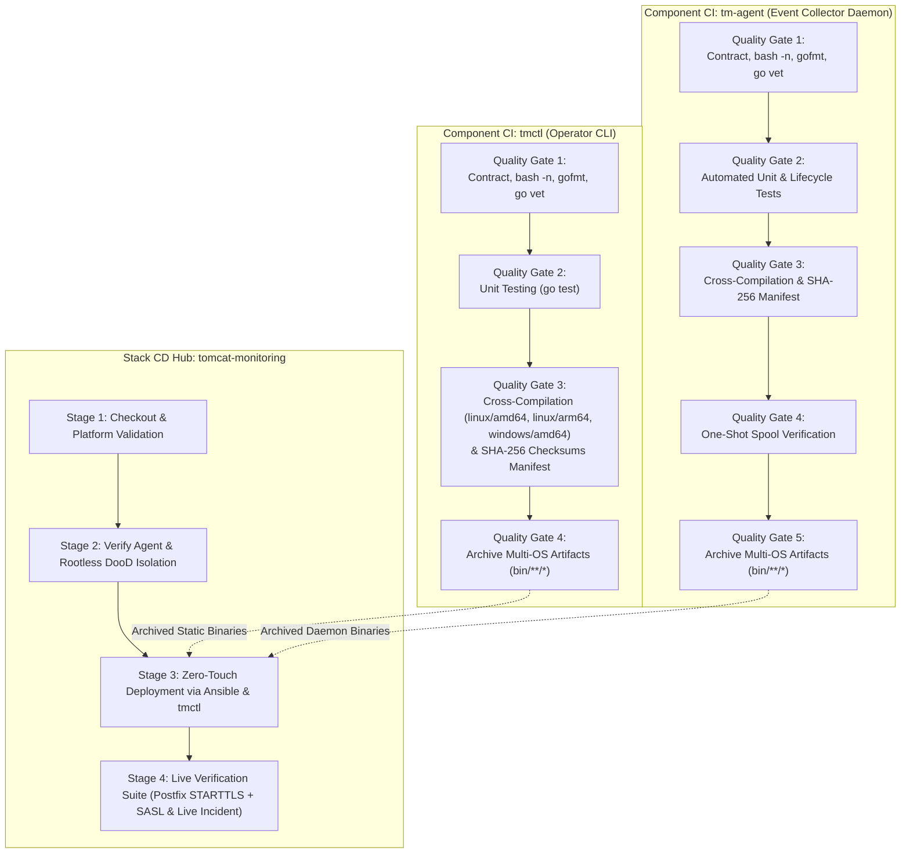

# TN-015 — Implement Production-Ready CI/CD Pipelines for tmctl and tm-agent Multi-OS Artifacts & Stack Release Hub Integration

| Field | Value |
| --- | --- |
| Status | Completed |
| Activity Type | Implementation & Pipeline Engineering |
| Record Type | Live |
| Project | Tomcat Monitoring |
| Phase | Continuous Integration and Deployment |
| Activity Date | 2026-09-14 |
| Recorded Date | 2026-09-14 |
| Owner | Eddy Wiyatno |
| Working Mode | Write |
| Authorization Status | Approved |
| Approved By | Eddy Wiyatno |
| Approval Date | 2026-09-14 |

---

## 🎯 Objective

Mengimplementasikan dan menstandarisasi alur *Continuous Integration* (CI) berbasis *Declarative Jenkinsfile* pada repositori kakas operator terpadu [`tmctl`](file:///home/eddywiyatno/git/tmctl) dan agen pengumpul event [`tm-agent`](file:///home/eddywiyatno/git/tm-agent), mencakup penegakan 4-Stage Quality Gates, kompilasi silang multi-OS deterministik (`linux/amd64`, `linux/arm64`, `windows/amd64`), penandatanganan integritas biner (*SHA-256 fingerprint checksums*), pengarsipan artefak (*artifact archiving*), serta integrasi rilis artefak biner ke dalam Stack CD Hub [`tomcat-monitoring`](file:///home/eddywiyatno/git/tomcat-monitoring).

Aktivitas ini merupakan Fase 4 yang menyempurnakan arsitektur [TM-ADR-0024](../../../../adr/tomcat-monitoring/adr-records/TM-ADR-0024.md), [TM-ADR-0025](../../../../adr/tomcat-monitoring/adr-records/TM-ADR-0025.md), [TM-ADR-0027](../../../../adr/tomcat-monitoring/adr-records/TM-ADR-0027.md), desain teknis [TN-011](TN-011-design-cross-platform-container-engine-api-orchestration-and-agent-architecture.md), implementasi [TN-012](TN-012-implement-unified-cross-platform-operator-cli-tmctl.md), [TN-013](TN-013-implement-unified-cross-platform-event-collector-daemon-tm-agent.md), dan refaktorisasi Ansible [TN-014](TN-014-refactor-ansible-roles-into-thin-orchestrator-based-on-tmctl-and-os-fact-branching.md) guna menuntaskan **TASK-TM-030**.

---

## 🌍 Background & Problem Statement

Setelah kakas Go `tmctl` dan `tm-agent` diimplementasikan serta Ansible Roles direfaktor menjadi *Thin Declarative Orchestrator* ([TN-014](TN-014-refactor-ansible-roles-into-thin-orchestrator-based-on-tmctl-and-os-fact-branching.md)), siklus rilis dan pengiriman komponen memerlukan otomasi pipeline enterprise:

1. **Ketiadaan Integritas Checksum Biner:**
   Proses build sebelumnya menghasilkan biner multi-OS tanpa berkas manifest *fingerprint hashing* (`sha256sum`). Tanpa manifest ini, target node dan proses orkestrasi Ansible tidak dapat memverifikasi integritas biner rilis terhadap risiko korupsi jaringan atau *tampering*.
2. **Kesenjangan Pengarsipan Artefak pada CI `tm-agent`:**
   Repositori `tm-agent` sebelumnya belum memiliki tahapan `archiveArtifacts` pada `Jenkinsfile`, serta pembersihan direktori kerja (`cleanWs`) dilakukan secara prematur sebelum artefak biner sempat disimpan oleh Jenkins Controller.
3. **Penyelarasan Standar Kualitas & Static Linting:**
   Validator repositori Go memerlukan standardisasi menyeluruh mencakup kepatuhan format (`gofmt -l`), analisis statis (`go vet ./...`), sintaks skrip pembantu (`bash -n`), dan audit rahasia (*zero secret leakage*).
4. **Integrasi Rilis Stack CD Hub:**
   Pipeline Continuous Deployment pada repositori orkestrator `tomcat-monitoring` harus diselaraskan dengan agen Jenkins standar (`builder-01`) dan memanfaatkan orkestrasi deklaratif berbasis `tmctl` serta Ansible Controller.

---

## 🏛️ Architecture & Quality Gates Design

Pipeline CI/CD multi-komponen Tomcat Monitoring memisahkan siklus *Component CI* independen untuk pembangunan biner multi-OS dan *Stack CD Hub* untuk orkestrasi deployment:



---

## 🛠️ Implementation Details

### 1. Standardisasi Pipeline CI `tmctl`

- **Pembaruan Skrip Build ([`scripts/build.sh`](file:///home/eddywiyatno/git/tmctl/scripts/build.sh)):**
  Menambahkan pembuatan manifest SHA-256 checksums atomik di dalam direktori `bin/`:
  ```bash
  echo "4. Generating SHA-256 checksums manifest..."
  (
      cd "${PROJECT_ROOT}/bin"
      sha256sum linux_amd64/tmctl linux_arm64/tmctl windows_amd64/tmctl.exe tmctl > checksums.txt
  )
  ```
- **Pembaruan Validator Mutu ([`scripts/validate.sh`](file:///home/eddywiyatno/git/tmctl/scripts/validate.sh)):**
  Menambahkan fungsi `validate_gofmt` untuk mendeteksi berkas Go yang belum terformat rapi sesuai standar `gofmt` selain `go vet ./...` dan audit berkas sensitif.
- **Pembaruan Makefile ([`Makefile`](file:///home/eddywiyatno/git/tmctl/Makefile)):**
  Target `build-all` diselaraskan untuk menghasilkan salinan biner root dan berkas `checksums.txt`.
- **Pembaruan Declarative Jenkinsfile ([`Jenkinsfile`](file:///home/eddywiyatno/git/tmctl/Jenkinsfile)):**
  Menegakkan 4 Quality Gates terstruktur:
  1. *Quality Gate 1: Contract & Static Linting* (`./scripts/validate.sh`)
  2. *Quality Gate 2: Comprehensive Unit Testing* (`./scripts/test.sh`)
  3. *Quality Gate 3: Deterministic Cross-Compilation* (`./scripts/build.sh`)
  4. *Quality Gate 4: Archive Multi-OS Artifacts* (`archiveArtifacts artifacts: 'bin/**/*', fingerprint: true, allowEmptyArchive: false`)
  5. *Post Action:* Pembersihan ruang kerja aman (`cleanWs deleteDirs: true, notFailBuild: true`).

### 2. Standardisasi Pipeline CI `tm-agent`

- **Pembaruan Skrip Build ([`scripts/build.sh`](file:///home/eddywiyatno/git/tm-agent/scripts/build.sh)):**
  Menambahkan langkah pembuatan manifest SHA-256 checksums untuk seluruh biner yang dihasilkan (`linux_amd64`, `linux_arm64`, `windows_amd64`, dan `bin/tm-agent`).
- **Pembaruan Validator Mutu ([`scripts/validate.sh`](file:///home/eddywiyatno/git/tm-agent/scripts/validate.sh)):**
  Menyempurnakan pemeriksaan sintaks skrip Bash (`bash -n "${SCRIPT_DIR}"/*.sh`), penegakan `gofmt -l`, `go vet ./...`, dan audit rahasia terlarang (`.pem`, `.key`, `.env`, dll).
- **Pembaruan Makefile ([`Makefile`](file:///home/eddywiyatno/git/tm-agent/Makefile)):**
  Target `build-all` diperbarui untuk membuat `checksums.txt`.
- **Pembaruan Declarative Jenkinsfile ([`Jenkinsfile`](file:///home/eddywiyatno/git/tm-agent/Jenkinsfile)):**
  Menyusun 5 Quality Gates deklaratif:
  1. *Quality Gate 1: Contract & Static Linting* (`./scripts/validate.sh`)
  2. *Quality Gate 2: Automated Unit & Lifecycle Tests* (`./scripts/test.sh`)
  3. *Quality Gate 3: Deterministic Cross-Compilation* (`./scripts/build.sh`)
  4. *Quality Gate 4: One-Shot Spool Verification* (`./bin/tm-agent --run-once`)
  5. *Quality Gate 5: Archive Multi-OS Artifacts* (`archiveArtifacts artifacts: 'bin/**/*', fingerprint: true, allowEmptyArchive: false`)
  6. *Post Action:* Penegakan pembersihan ruang kerja pasca-pengarsipan (`cleanWs deleteDirs: true, notFailBuild: true`).

### 3. Penyelarasan Stack CD Hub `tomcat-monitoring`

- **Penyelarasan Agent Label ([`Jenkinsfile`](file:///home/eddywiyatno/git/tomcat-monitoring/Jenkinsfile)):**
  Menyelaraskan label agent eksekusi menjadi `builder-01` untuk keseragaman platform CI/CD.
- **Modernisasi Stage 3 Deployment:**
  Memperbarui instruksi Stage 3 agar mengeksekusi deployment deklaratif melalui Ansible Thin Orchestrator ([`scripts/run-ansible-playbook.sh deploy-stack.yml`](file:///home/eddywiyatno/git/tomcat-monitoring/scripts/run-ansible-playbook.sh)) yang mendelegasikan rekonsiliasi kontainer ke `tmctl` dan daemon `tm-agent`, dengan fallback script individual yang tetap dipertahankan untuk redundansi.

---

## 🔬 Verification Results & Quality Evidence

Seluruh rangkaian tahapan pipeline telah diverifikasi secara lokal dan menghasilkan bukti kelulusan 100%:

### 1. Verifikasi Pipeline `tmctl`

```text
$ ./scripts/validate.sh
tmctl validation passed: all layout, syntax, formatting, and static assertions valid.

$ ./scripts/test.sh
Running Go unit test suite for tmctl...
PASS: TestDefaultConfig
PASS: TestParseConfigFile
PASS: TestWorkloadSpecs
PASS: TestRegistryLoginAndLogout
PASS: TestValidateSensitiveFiles
PASS: TestValidateJSONFiles
All tests passed successfully!

$ ./scripts/build.sh
Building tmctl binaries...
1. Building Linux amd64 static binary...
2. Building Linux arm64 static binary...
3. Building Windows amd64 binary (tmctl.exe)...
4. Generating SHA-256 checksums manifest...
Build complete. Artifacts generated in bin/:
-rw-rw-r-- 1 eddywiyatno eddywiyatno  330 Sep 14 08:42 bin/checksums.txt
-rwxrwxr-x 1 eddywiyatno eddywiyatno 5.7M Sep 14 08:42 bin/linux_amd64/tmctl
-rwxrwxr-x 1 eddywiyatno eddywiyatno 5.5M Sep 14 08:42 bin/linux_arm64/tmctl
-rwxrwxr-x 1 eddywiyatno eddywiyatno 5.9M Sep 14 08:42 bin/windows_amd64/tmctl.exe
```

Isi berkas `bin/checksums.txt` pada `tmctl`:
```text
861d4353a9e0de34d7917d5e7d020edb4e6114d104253d8ec695b4ef3bccf7f8  linux_amd64/tmctl
0a84790dd1f0abb9f1820dc48116a298b14d20e9fb323eb36c7527014a15efc5  linux_arm64/tmctl
30daf198ba2c01d071083688457d3f20401880e568398a71617e59963dcd9a59  windows_amd64/tmctl.exe
861d4353a9e0de34d7917d5e7d020edb4e6114d104253d8ec695b4ef3bccf7f8  tmctl
```

### 2. Verifikasi Pipeline `tm-agent`

```text
$ ./scripts/validate.sh
Running repository contract validation...
Checking shell script syntax...
Running go vet...
Repository validation PASSED.

$ ./scripts/test.sh
Running Go unit and component tests...
PASS: TestCollectorRecordSnapshotRunningContainer
PASS: TestCollectorRecordSnapshotNotFoundContainer
PASS: TestCollectorRecordSnapshotEngineError
PASS: TestCollectorRunOnce
PASS: TestNewDefaultConfig
PASS: TestLoadConfigFile
PASS: TestApplyEnvOverrides
PASS: TestEventMessageNormalization
PASS: TestStreamingEventParsing
PASS: TestValidEventRecords
PASS: TestInvalidEventRecords
PASS: TestWriteRecordAtomic
PASS: TestWriteRecordSizeLimit
PASS: TestPruneStaleTmpAndJson
PASS: TestPruneFIFOQuota
PASS: TestValidateRepositoryValid
PASS: TestValidateRepositoryMissingFile
PASS: TestValidateRepositoryForbiddenFile
All tests passed successfully.

$ ./scripts/build.sh
Building native binary...
Cross-compiling for Linux (amd64, arm64) and Windows (amd64)...
4. Generating SHA-256 checksums manifest...
Build complete. Artifacts:
-rw-rw-r-- 1 eddywiyatno eddywiyatno  342 Sep 14 08:43 bin/checksums.txt
-rwxrwxr-x 1 eddywiyatno eddywiyatno 6.1M Sep 14 08:43 bin/linux_amd64/tm-agent
-rwxrwxr-x 1 eddywiyatno eddywiyatno 5.6M Sep 14 08:43 bin/linux_arm64/tm-agent
-rwxrwxr-x 1 eddywiyatno eddywiyatno 6.1M Sep 14 08:43 bin/tm-agent
-rwxrwxr-x 1 eddywiyatno eddywiyatno 6.4M Sep 14 08:43 bin/windows_amd64/tm-agent.exe
```

Isi berkas `bin/checksums.txt` pada `tm-agent`:
```text
bffef50d99cb686128044cec532d007ccd4dc62bf7134da94a80926fb2f42572  linux_amd64/tm-agent
1fcfc078a1c94cdb927ed2287b8aa889d1a45d5437b5b942bc9b3ef6ce06dddc  linux_arm64/tm-agent
a89d938a37a70f52678f2bc7fc5da9255f727db2429ecc86a9389b7845696d10  windows_amd64/tm-agent.exe
bffef50d99cb686128044cec532d007ccd4dc62bf7134da94a80926fb2f42572  tm-agent
```

### 3. Verifikasi Baseline `tomcat-monitoring`

```text
$ ./scripts/validate.sh && ./scripts/validate-ansible.sh
Alertmanager source validation passed: routing, local Mailpit receiver, disposable verification, dan persistent volume contract statis valid.
JMX Exporter source validation passed: TLS dan two-rule baseline valid.
Prometheus source validation passed: scrape, rule, dan Alertmanager delivery contract statis valid.
Telegraf source validation passed: health-check contract statis valid.
Tomcat health app source validation passed: lab fixture contract statis valid.
=== Validating Ansible Playbooks and Roles Layout ===
1. All required Ansible files and roles structure present.
2. Running Ansible syntax check...
playbook: deploy-stack.yml
playbook: provision-fleet.yml
3. Ansible validation successful.
Baseline validation passed: repository layout dan contract statis valid.
```

---

## 🎓 Lessons Learned

1. **Fingerprint Hashing Menjamin Rantai Pasok yang Aman (*Secure Supply Chain*):** Menghasilkan manifest SHA-256 bersamaan dengan kompilasi silang biner memastikan bahwa setiap node target dapat memvalidasi integritas biner sebelum dieksekusi oleh Ansible maupun daemon sistem operasi.
2. **Urutan Tahapan Pengarsipan dan Pembersihan Ruang Kerja:** Direktif `cleanWs` wajib diletakkan pada blok `post.always` deklaratif agar tidak mendahului eksekusi tahap `archiveArtifacts`, memastikan Jenkins Controller berhasil menyerap seluruh biner rilis ke arsip build.
3. **Pemisahan Tugas Bersih (*Clean Separation of Concerns*):** Memisahkan pipeline CI biner komponen (`tmctl` dan `tm-agent`) dari pipeline orkestrasi stack (`tomcat-monitoring`) mempercepat feedback loop pengembang dan menjaga stabilitas deployment platform.

---

## 🔗 Related Documentation

- [Continuous Integration and Deployment Engineering Journal](index.md)
- [TN-011 — Design Cross-Platform Container Engine API Orchestration, Unified Go CLI, and Multi-OS Agent Architecture](TN-011-design-cross-platform-container-engine-api-orchestration-and-agent-architecture.md)
- [TN-012 — Implement Unified Cross-Platform Operator CLI tmctl for Container Engine API Orchestration](TN-012-implement-unified-cross-platform-operator-cli-tmctl.md)
- [TN-013 — Implement Unified Cross-Platform Event Collector Daemon tm-agent based on Container Engine Socket API](TN-013-implement-unified-cross-platform-event-collector-daemon-tm-agent.md)
- [TN-014 — Refactor Ansible Roles into Thin Declarative Orchestrator based on tmctl and OS Fact Branching](TN-014-refactor-ansible-roles-into-thin-orchestrator-based-on-tmctl-and-os-fact-branching.md)
- [TM-ADR-0024 — Adopt Decoupled Component CI and Orchestrated Stack CD Pipeline Architecture](../../../../adr/tomcat-monitoring/adr-records/TM-ADR-0024.md)
- [TM-ADR-0025 — Delineate Responsibilities Between Jenkins Release Orchestration and Ansible Configuration Provisioning](../../../../adr/tomcat-monitoring/adr-records/TM-ADR-0025.md)
- [TM-ADR-0027 — Adopt Container Engine Socket API and Unified Cross-Platform Tooling for Multi-OS Orchestration](../../../../adr/tomcat-monitoring/adr-records/TM-ADR-0027.md)
- [Follow-up Tasks Backlog](../../follow-up-tasks.md)
- [CI/CD Overview](../../ci-cd/index.md)
