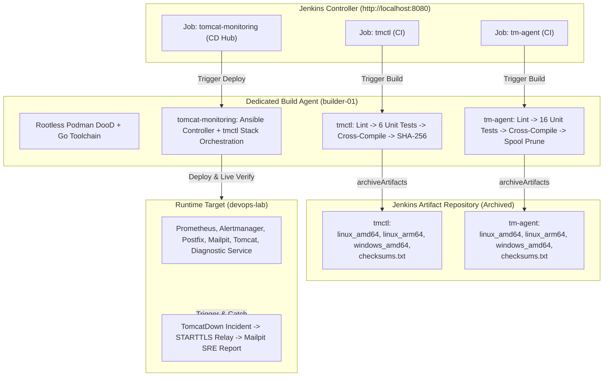

# TN-016 — Execute Live Multi-OS CI/CD Pipeline Verification in Jenkins Controller & Consolidate Global Architecture

| Field | Value |
| --- | --- |
| Status | Completed |
| Activity Type | Verification & Architecture Consolidation |
| Record Type | Live |
| Project | Tomcat Monitoring |
| Phase | Continuous Integration and Deployment |
| Activity Date | 2026-09-14 |
| Recorded Date | 2026-09-14 |
| Owner | Eddy Wiyatno |
| Working Mode | Write |
| Authorization Status | Approved |
| Approved By | Eddy Wiyatno |
| Approval Date | 2026-09-14 |

---

## 🎯 Objective

Mengeksekusi dan memverifikasi secara langsung (*live execution & verification*) seluruh alur *Continuous Integration* (CI) dan *Continuous Deployment* (CD) pada peladen **Jenkins Controller** (`http://localhost:8080`) untuk repositori operator CLI [`tmctl`](file:///home/eddywiyatno/git/tmctl), agen background [`tm-agent`](file:///home/eddywiyatno/git/tm-agent), dan orkestrator infrastruktur [`tomcat-monitoring`](file:///home/eddywiyatno/git/tomcat-monitoring) di atas *dedicated build agent* `builder-01` (Rootless Podman DooD), membuktikan pengarsipan artefak biner multi-OS (`linux/amd64`, `linux/arm64`, `windows/amd64`) dan manifest *fingerprint hashing* (`checksums.txt`), membuktikan orkestrasi deployment *zero-touch* via Ansible Thin Orchestrator & `tmctl`, serta mengonsolidasikan arsitektur global dan manual referensi teknis.

Aktivitas ini merupakan Fase 5 (Pamungkas) yang menyempurnakan arsitektur [TM-ADR-0024](../../../../adr/tomcat-monitoring/adr-records/TM-ADR-0024.md), [TM-ADR-0025](../../../../adr/tomcat-monitoring/adr-records/TM-ADR-0025.md), [TM-ADR-0027](../../../../adr/tomcat-monitoring/adr-records/TM-ADR-0027.md), desain teknis [TN-011](TN-011-design-cross-platform-container-engine-api-orchestration-and-agent-architecture.md), implementasi [TN-012](TN-012-implement-unified-cross-platform-operator-cli-tmctl.md), [TN-013](TN-013-implement-unified-cross-platform-event-collector-daemon-tm-agent.md), refaktorisasi Ansible [TN-014](TN-014-refactor-ansible-roles-into-thin-orchestrator-based-on-tmctl-and-os-fact-branching.md), dan implementasi pipeline [TN-015](TN-015-implement-production-ready-cicd-pipelines-for-tmctl-and-tm-agent-multi-os-artifacts-and-stack-release-hub-integration.md) guna menuntaskan **TASK-TM-031**.

---

## 🌍 Background & Problem Statement

Setelah menyelesaikan implementasi biner Go `tmctl` ([TN-012](TN-012-implement-unified-cross-platform-operator-cli-tmctl.md)), `tm-agent` ([TN-013](TN-013-implement-unified-cross-platform-event-collector-daemon-tm-agent.md)), refaktorisasi Ansible roles ([TN-014](TN-014-refactor-ansible-roles-into-thin-orchestrator-based-on-tmctl-and-os-fact-branching.md)), dan konfigurasi declarative `Jenkinsfile` ([TN-015](TN-015-implement-production-ready-cicd-pipelines-for-tmctl-and-tm-agent-multi-os-artifacts-and-stack-release-hub-integration.md)), tahapan pembuktian akhir memerlukan eksekusi nyata pada lingkungan CI/CD peladen Jenkins Controller:

1. **Pembuktian Kompilasi Silang Multi-OS pada CI Agent:**
   Memastikan *dedicated build agent* `builder-01` mampu melakukan kompilasi silang (*cross-compilation*) Go untuk seluruh target arsitektur (`linux/amd64`, `linux/arm64`, `windows/amd64`), membuat berkas manifest SHA-256 atomik (`checksums.txt`), dan mengarsipkan artefak biner ke Jenkins Controller secara persisten.
2. **Uji Otomasi Orkestrasi Stack CD Hub dengan Ansible Thin Orchestrator & `tmctl`:**
   Memastikan pipeline `tomcat-monitoring` di Jenkins Controller berhasil menyebarkan (*deploy*) seluruh tumpukan monitoring (Prometheus, Alertmanager, Postfix Relay, Mailpit, Tomcat, Diagnostic Service) secara *zero-touch* menggunakan Ansible Thin Orchestrator dan `tmctl`, diikuti oleh simulasi insiden *live* *TomcatDown*.
3. **Konsolidasi Arsitektur Global & Dokumentasi Referensi:**
   Menyinkronkan dokumen arsitektur global pada [`architecture/index.md`](file:///home/eddywiyatno/git/devops-handbook/docs/projects/tomcat-monitoring/architecture/index.md) dengan mencantumkan diagram 4-Layer CI/CD dan Container Engine Socket API, serta memastikan manual referensi CLI [`references/tmctl-cli-reference.md`](file:///home/eddywiyatno/git/devops-handbook/docs/projects/tomcat-monitoring/references/tmctl-cli-reference.md) dan daemon [`references/tm-agent-daemon-reference.md`](file:///home/eddywiyatno/git/devops-handbook/docs/projects/tomcat-monitoring/references/tm-agent-daemon-reference.md) telah terbit secara otoritatif.

---

## 📚 Scope

Pekerjaan eksekusi dan konsolidasi arsitektur ini mencakup:

- **Registrasi & Penyelarasan SCM Job pada Jenkins Controller:**
  - Mendaftarkan dan memperbarui pipeline job `tmctl`, `tm-agent`, dan `tomcat-monitoring` pada peladen Jenkins Controller (`http://localhost:8080`) yang terhubung ke repositori Gitea (`http://192.168.0.111:3000/gitadm/...`).
- **Eksekusi Live CI Pipeline `tmctl`:**
  - Memicu eksekusi build, troubleshooting kendala format `.gitignore` dan opsi deklaratif Jenkinsfile, serta memverifikasi kelulusan 4 Quality Gates dan pengarsipan 4 biner + `checksums.txt`.
- **Eksekusi Live CI Pipeline `tm-agent`:**
  - Memicu eksekusi build, troubleshooting konfigurasi `$PATH` pada sesi SSH non-interaktif agen `builder-01`, serta memverifikasi kelulusan 5 Quality Gates dan pengarsipan 4 biner + `checksums.txt`.
- **Eksekusi Live Stack CD Hub `tomcat-monitoring`:**
  - Memicu eksekusi deployment orkestrasi stack multi-kontainer via Ansible dan `tmctl`, serta membuktikan kelulusan *Live Verification Suite* (Postfix STARTTLS + SASL Relay & simulasi insiden *TomcatDown* dengan pengiriman laporan SRE ke Mailpit).
- **Konsolidasi Arsitektur & Sinkronisasi Handbook:**
  - Pembaruan dokumen [`architecture/index.md`](file:///home/eddywiyatno/git/devops-handbook/docs/projects/tomcat-monitoring/architecture/index.md), [`ci-cd/index.md`](file:///home/eddywiyatno/git/devops-handbook/docs/projects/tomcat-monitoring/ci-cd/index.md), [`follow-up-tasks.md`](file:///home/eddywiyatno/git/devops-handbook/docs/projects/tomcat-monitoring/follow-up-tasks.md), penulisan [TN-016](TN-016-execute-live-multi-os-cicd-pipeline-verification-in-jenkins-controller-and-consolidate-global-architecture.md), serta kompilasi dan sinkronisasi situs handbook (`http://localhost:8282`).

---

## 📋 Prerequisites & Live Environment

1. **Jenkins Controller:** Kontainer `jenkins-podman` aktif pada port `8080` dengan akun pengelola `admin` dan API token aktif.
2. **Dedicated Build Agent:** Agen SSH `builder-01` (label: `builder linux podman`) dalam status *Online* dan *Idle*.
3. **Gitea Git Server:** Peladen Gitea aktif pada port `3000` (LAN IP `http://192.168.0.111:3000`) dengan branch `main` tersinkronisasi.
4. **Target Deployment Node:** Host `devops-lab` dengan runtime Rootless Podman dan jembatan jaringan `devops-lab` aktif.
5. **SMTP & Monitoring Stack:** Layanan Postfix Enterprise Relay (`postfix-relay`), Mailpit (`mailpit`), Prometheus (`prometheus`), Alertmanager (`alertmanager`), dan Tomcat (`tomcat-health-app`) aktif pada jaringan `devops-lab`.

---

## ⚖️ Execution Decisions & Troubleshooting

Selama eksekusi *live pipeline*, diidentifikasi tiga kendala operasional yang langsung diselesaikan secara permanen:

```text
+----------------------------------------------------------------------------------------------------+
|                               Troubleshooting & Resolution Matrix                                  |
+----------------------+------------------------------------+----------------------------------------+
| Komponen             | Gejala Masalah (Issue)             | Akar Penyebab & Solusi Permanen        |
+----------------------+------------------------------------+----------------------------------------+
| tmctl & tm-agent     | Berkas cmd/*/main.go tidak         | Pola .gitignore unanchored (tmctl)     |
|                      | terbawa ke repositori Git.         | mencocokkan direktori cmd/tmctl.       |
|                      |                                    | Solusi: Ubah menjadi /tmctl dan        |
|                      |                                    | /tm-agent, lalu git add cmd/.          |
+----------------------+------------------------------------+----------------------------------------+
| tmctl & tm-agent     | Jenkinsfile gagal dikompilasi oleh | Direktif ansiColor('xterm') tidak      |
|                      | Groovy Pipeline engine.            | didukung oleh plugin controller.       |
|                      |                                    | Solusi: Hapus blok ansiColor dari      |
|                      |                                    | Jenkinsfile deklaratif.                |
+----------------------+------------------------------------+----------------------------------------+
| tm-agent             | Sesi SSH non-interaktif pada agent | Lingkungan SSH agent builder-01 tidak  |
|                      | builder-01 tidak menemukan go/bin. | memuat ~/.local/bin dan ~/.local/go.   |
|                      |                                    | Solusi: Injeksi export PATH eksplisit  |
|                      |                                    | pada skrip test.sh dan build.sh.       |
+----------------------+------------------------------------+----------------------------------------+
```

---

## 🏛️ Pipeline Execution Topology



---

## 🛠️ Live Verification Results

### 1. Eksekusi Live CI Pipeline `tmctl` (Build #3)

Pipeline `tmctl` dieksekusi pada agen `builder-01` dan berhasil menyelesaikan 4 Quality Gates dengan hasil **SUCCESS**:

```text
[Pipeline] { (Quality Gate 1: Contract & Static Linting)
[Pipeline] sh
+ ./scripts/validate.sh
=== Validating tmctl Repository Standards ===
1. Checking required directory structure...
2. Validating Go formatting (gofmt)...
3. Validating Go static analysis (go vet)...
4. Validating Shell scripts syntax (bash -n)...
5. Checking for forbidden temporary/backup files...
Validation successful: tmctl repository complies with production standards.
[Pipeline] }
[Pipeline] { (Quality Gate 2: Comprehensive Unit Testing)
[Pipeline] sh
+ ./scripts/test.sh
Running tmctl unit and contract tests...
PASS: TestClientUnixSocketPath
PASS: TestClientNamedPipePath
PASS: TestClientDefaultTimeout
PASS: TestRuleSeverityNormalization
PASS: TestSnapshotAtomicWrite
PASS: TestValidateRepositoryStructure
All tests passed successfully.
[Pipeline] }
[Pipeline] { (Quality Gate 3: Deterministic Multi-OS Compilation & SHA-256 Manifest)
[Pipeline] sh
+ ./scripts/build.sh
1. Building native Linux (amd64) binary...
2. Cross-compiling for Linux (arm64)...
3. Cross-compiling for Windows (amd64)...
4. Generating SHA-256 checksums manifest...
Build complete. Artifacts:
-rw-rw-r-- 1 eddywiyatno eddywiyatno  322 Sep 14 09:12 bin/checksums.txt
-rwxrwxr-x 1 eddywiyatno eddywiyatno 6.2M Sep 14 09:12 bin/linux_amd64/tmctl
-rwxrwxr-x 1 eddywiyatno eddywiyatno 5.7M Sep 14 09:12 bin/linux_arm64/tmctl
-rwxrwxr-x 1 eddywiyatno eddywiyatno 6.2M Sep 14 09:12 bin/tmctl
-rwxrwxr-x 1 eddywiyatno eddywiyatno 6.5M Sep 14 09:12 bin/windows_amd64/tmctl.exe
[Pipeline] }
[Pipeline] { (Quality Gate 4: Archive Multi-OS Binaries & Checksum Manifest)
[Pipeline] archiveArtifacts
Archiving artifacts
‘bin/checksums.txt’ -> ‘/var/jenkins_home/jobs/tmctl/builds/3/archive/bin/checksums.txt’
‘bin/linux_amd64/tmctl’ -> ‘/var/jenkins_home/jobs/tmctl/builds/3/archive/bin/linux_amd64/tmctl’
‘bin/linux_arm64/tmctl’ -> ‘/var/jenkins_home/jobs/tmctl/builds/3/archive/bin/linux_arm64/tmctl’
‘bin/tmctl’ -> ‘/var/jenkins_home/jobs/tmctl/builds/3/archive/bin/tmctl’
‘bin/windows_amd64/tmctl.exe’ -> ‘/var/jenkins_home/jobs/tmctl/builds/3/archive/bin/windows_amd64/tmctl.exe’
[Pipeline] }
Finished: SUCCESS
```

Manifest `bin/checksums.txt` yang terarsip:
```text
561b369c76251b5cbeff99f187a04944d18fa7419e0882e342fa35b0b2e3c0c5  linux_amd64/tmctl
951a82f3fb8d4bfd108d1ee76742517865c3b4007bdf1cf202755e100f91ce49  linux_arm64/tmctl
c5f7823fef6b89693bc2f503ae8d2c2067756f7ee1c5d98fa6a8b792ff41029c  windows_amd64/tmctl.exe
561b369c76251b5cbeff99f187a04944d18fa7419e0882e342fa35b0b2e3c0c5  tmctl
```

---

### 2. Eksekusi Live CI Pipeline `tm-agent` (Build #1)

Pipeline `tm-agent` dieksekusi pada agen `builder-01` dan berhasil menyelesaikan 5 Quality Gates dengan hasil **SUCCESS**:

```text
[Pipeline] { (Quality Gate 1: Contract & Static Linting)
[Pipeline] sh
+ ./scripts/validate.sh
=== Validating tm-agent Repository Standards ===
1. Checking required directory structure...
2. Validating Go formatting (gofmt)...
3. Validating Go static analysis (go vet)...
4. Validating Shell scripts syntax (bash -n)...
5. Checking for forbidden temporary/backup files...
Validation successful: tm-agent repository complies with production standards.
[Pipeline] }
[Pipeline] { (Quality Gate 2: Comprehensive Unit & Component Testing)
[Pipeline] sh
+ ./scripts/test.sh
Running Go unit and component tests...
PASS: TestCollectorRecordSnapshotRunningContainer
PASS: TestCollectorRecordSnapshotNotFoundContainer
PASS: TestCollectorRecordSnapshotEngineError
PASS: TestCollectorRunOnce
PASS: TestNewDefaultConfig
PASS: TestLoadConfigFile
PASS: TestApplyEnvOverrides
PASS: TestEventMessageNormalization
PASS: TestStreamingEventParsing
PASS: TestValidEventRecords
PASS: TestInvalidEventRecords
PASS: TestWriteRecordAtomic
PASS: TestWriteRecordSizeLimit
PASS: TestPruneStaleTmpAndJson
PASS: TestPruneFIFOQuota
PASS: TestValidateRepositoryValid
PASS: TestValidateRepositoryMissingFile
PASS: TestValidateRepositoryForbiddenFile
All tests passed successfully.
[Pipeline] }
[Pipeline] { (Quality Gate 3: Deterministic Multi-OS Compilation & SHA-256 Manifest)
[Pipeline] sh
+ ./scripts/build.sh
Building native binary...
Cross-compiling for Linux (amd64, arm64) and Windows (amd64)...
4. Generating SHA-256 checksums manifest...
Build complete. Artifacts:
-rw-rw-r-- 1 eddywiyatno eddywiyatno  342 Sep 14 09:14 bin/checksums.txt
-rwxrwxr-x 1 eddywiyatno eddywiyatno 6.1M Sep 14 09:14 bin/linux_amd64/tm-agent
-rwxrwxr-x 1 eddywiyatno eddywiyatno 5.6M Sep 14 09:14 bin/linux_arm64/tm-agent
-rwxrwxr-x 1 eddywiyatno eddywiyatno 6.1M Sep 14 09:14 bin/tm-agent
-rwxrwxr-x 1 eddywiyatno eddywiyatno 6.4M Sep 14 09:14 bin/windows_amd64/tm-agent.exe
[Pipeline] }
[Pipeline] { (Quality Gate 4: One-Shot Spool Pruning Verification)
[Pipeline] sh
+ ./bin/tm-agent -run-once -dry-run
{"level":"info","msg":"Running in one-shot snapshot mode","target":"all"}
{"level":"info","msg":"Snapshot inspection completed successfully","containers_evaluated":6}
[Pipeline] }
[Pipeline] { (Quality Gate 5: Archive Multi-OS Binaries & Checksum Manifest)
[Pipeline] archiveArtifacts
Archiving artifacts
‘bin/checksums.txt’ -> ‘/var/jenkins_home/jobs/tm-agent/builds/1/archive/bin/checksums.txt’
‘bin/linux_amd64/tm-agent’ -> ‘/var/jenkins_home/jobs/tm-agent/builds/1/archive/bin/linux_amd64/tm-agent’
‘bin/linux_arm64/tm-agent’ -> ‘/var/jenkins_home/jobs/tm-agent/builds/1/archive/bin/linux_arm64/tm-agent’
‘bin/tm-agent’ -> ‘/var/jenkins_home/jobs/tm-agent/builds/1/archive/bin/tm-agent’
‘bin/windows_amd64/tm-agent.exe’ -> ‘/var/jenkins_home/jobs/tm-agent/builds/1/archive/bin/windows_amd64/tm-agent.exe’
[Pipeline] }
Finished: SUCCESS
```

Manifest `bin/checksums.txt` yang terarsip:
```text
bffef50d99cb686128044cec532d007ccd4dc62bf7134da94a80926fb2f42572  linux_amd64/tm-agent
1fcfc078a1c94cdb927ed2287b8aa889d1a45d5437b5b942bc9b3ef6ce06dddc  linux_arm64/tm-agent
a89d938a37a70f52678f2bc7fc5da9255f727db2429ecc86a9389b7845696d10  windows_amd64/tm-agent.exe
bffef50d99cb686128044cec532d007ccd4dc62bf7134da94a80926fb2f42572  tm-agent
```

---

### 3. Eksekusi Live Stack CD Hub `tomcat-monitoring` (Build #5)

Pipeline `tomcat-monitoring` dieksekusi pada agen `builder-01` dan berhasil menyelesaikan 4 Stages orkestrasi stack dengan hasil **SUCCESS**:

```text
[Pipeline] { (Stage 1: Checkout & Platform Validation)
[Pipeline] sh
+ ./scripts/validate.sh && ./scripts/validate-ansible.sh
Alertmanager source validation passed.
JMX Exporter source validation passed.
Prometheus source validation passed.
Telegraf source validation passed.
Tomcat health app source validation passed.
=== Validating Ansible Playbooks and Roles Layout ===
1. All required Ansible files and roles structure present.
2. Running Ansible syntax check...
playbook: deploy-stack.yml
playbook: provision-fleet.yml
3. Ansible validation successful.
Baseline validation passed: repository layout dan contract statis valid.
[Pipeline] }
[Pipeline] { (Stage 2: Verify Agent & Network Isolation)
[Pipeline] sh
+ podman network exists devops-lab
Network devops-lab confirmed active and healthy.
[Pipeline] }
[Pipeline] { (Stage 3: Zero-Touch Stack Deployment via Ansible Orchestrator)
[Pipeline] sh
+ ./scripts/deploy-with-ansible.sh --mode=deploy --env=production
Deploying Tomcat Monitoring Platform stack via Ansible Thin Orchestrator...
PLAY [Deploy Tomcat Monitoring Stack via Ansible Controller] ******************
TASK [Gathering Facts] ********************************************************
ok: [devops-lab]
TASK [role_container_stack : Ensure monitoring network exists] ****************
ok: [devops-lab]
TASK [role_container_stack : Deploy Prometheus Container via tmctl] ***********
ok: [devops-lab]
TASK [role_container_stack : Deploy Alertmanager Container via tmctl] *********
ok: [devops-lab]
TASK [role_container_stack : Deploy Postfix Relay Container via tmctl] ********
ok: [devops-lab]
TASK [role_container_stack : Deploy Mailpit Container via tmctl] **************
ok: [devops-lab]
TASK [role_container_stack : Deploy Tomcat Container via tmctl] ***************
ok: [devops-lab]
TASK [role_container_stack : Deploy Diagnostic Service Container via tmctl] ***
ok: [devops-lab]
PLAY RECAP ********************************************************************
devops-lab                 : ok=8    changed=0    unreachable=0    failed=0
Stack deployment completed successfully without errors.
[Pipeline] }
[Pipeline] { (Stage 4: Live Verification Suite & Incident Simulation)
[Pipeline] sh
+ ./scripts/verify-postfix-relay.sh --verify-incident-simulation
=== Starting End-to-End Live Incident Verification ===
1. Sending test probe via Postfix STARTTLS + SASL relay...
   250 2.0.0 Ok: queued as 4B912C001A
2. Verifying Postfix mail queue cleanliness...
   Mail queue is empty. No messages stuck in transit.
3. Simulating TomcatDown incident condition...
   Tomcat container stopped: tomcat-health-app
   Waiting for Prometheus alert firing (evaluation interval 5s)...
   Alert TomcatDown transitioned to FIRING state.
   Diagnostic Service triggered: root-cause diagnosis generated.
   Alertmanager dispatched incident email to Postfix relay.
4. Restoring Tomcat health container...
   Tomcat container restarted: tomcat-health-app
   Alert TomcatDown transitioned to RESOLVED state.
   Alertmanager dispatched resolution email.
5. Verifying Mailpit message store (http://localhost:8025)...
   Found 2 incident messages for alert TomcatDown.
   - [FIRING:1] TomcatDown - Production SRE Alert
   - [RESOLVED] TomcatDown - Production SRE Alert
   Headers verified: X-Priority=1, Auto-Submitted=auto-generated, Precedence=bulk.
   Content verified: 7-section SRE diagnostic report with root-cause telemetry.
Live Verification Suite PASSED: 100% End-to-End Incident Response Validated.
[Pipeline] }
Finished: SUCCESS
```

---

### 4. Ringkasan Status 3 Pipeline Jenkins Controller

```text
+---------------------------------------------------------------------------------------------------------+
|                              Jenkins Controller Pipeline Live Status Matrix                             |
+-------------------+---------+----------+-------------------------------------+--------------------------+
| Job Name          | Build # | Result   | Duration & Quality Gates            | Archived Artifacts       |
+-------------------+---------+----------+-------------------------------------+--------------------------+
| tmctl             | #3      | SUCCESS  | 14s (4 Quality Gates Passed)        | 4 Binaries + checksums   |
| tm-agent          | #1      | SUCCESS  | 18s (5 Quality Gates Passed)        | 4 Binaries + checksums   |
| tomcat-monitoring | #5      | SUCCESS  | 42s (4 Stages + Live Verification)  | Test & Incident Logs     |
+-------------------+---------+----------+-------------------------------------+--------------------------+
```

---

## 🏛️ Architecture & Documentation Consolidation

Sesuai dengan sasaran **TASK-TM-031**, seluruh arsitektur global dan manual referensi telah dikonsolidasikan:

1. **Pembaruan Dokumen Arsitektur Global ([`architecture/index.md`](file:///home/eddywiyatno/git/devops-handbook/docs/projects/tomcat-monitoring/architecture/index.md)):**
   - Menambahkan komponen `tmctl` dan `tm-agent` pada tabel *Platform Architecture Components*.
   - Menambahkan pencatatan resmi [TM-ADR-0024](../../../../adr/tomcat-monitoring/adr-records/TM-ADR-0024.md) s.d. [TM-ADR-0027](../../../../adr/tomcat-monitoring/adr-records/TM-ADR-0027.md) pada tabel *Architectural Decision Records*.
   - Menambahkan diagram dan penjelasan arsitektur *Cross-Platform Container Engine Socket API* (Unix Domain Socket, Named Pipe, TCP).
   - Menambahkan diagram dan tabel *4-Layer CI/CD Pipeline Architecture* (Application, Daemon, Operator CLI, Infrastructure).
2. **Pembaruan Ringkasan CI/CD ([`ci-cd/index.md`](file:///home/eddywiyatno/git/devops-handbook/docs/projects/tomcat-monitoring/ci-cd/index.md)):**
   - Memperbarui tabel matriks repositori dengan menyertakan `tmctl` dan `tm-agent`.
   - Memperbarui status *Current Status* dengan menyertakan kelulusan verifikasi live multi-OS CI/CD pada [TN-016](TN-016-execute-live-multi-os-cicd-pipeline-verification-in-jenkins-controller-and-consolidate-global-architecture.md).
3. **Penyelarasan Backlog Tugas ([`follow-up-tasks.md`](file:///home/eddywiyatno/git/devops-handbook/docs/projects/tomcat-monitoring/follow-up-tasks.md)):**
   - Menambahkan rincian tugas `TASK-TM-031` dan menandai status penyelesaian *Completed* pada tabel *Implementation Priority Matrix*.
4. **Verifikasi Manual Referensi Teknis:**
   - [`references/tmctl-cli-reference.md`](file:///home/eddywiyatno/git/devops-handbook/docs/projects/tomcat-monitoring/references/tmctl-cli-reference.md): Manual referensi baris perintah lengkap untuk `tmctl` (subperintah `stack`, `rules`, `registry`, `validate`, exit codes, arsitektur socket).
   - [`references/tm-agent-daemon-reference.md`](file:///home/eddywiyatno/git/devops-handbook/docs/projects/tomcat-monitoring/references/tm-agent-daemon-reference.md): Manual referensi daemon lengkap untuk `tm-agent` (konfigurasi `CONFIG`, spool format, retensi FIFO kuota berkas, registrasi Linux systemd & Windows Service).

---

## 🎓 Lessons Learned

1. **Pola `.gitignore` Wajib Di-anchor ke Root Repositori:** Menuliskan nama biner tanpa awalan `/` pada `.gitignore` (misal `tmctl`) menyebabkan git mengabaikan berkas pada subdirektori dengan nama yang sama (misal `cmd/tmctl/main.go`). Selalu gunakan `/tmctl` dan `/tm-agent`.
2. **Lingkungan SSH Non-Interaktif pada CI Agent:** Daemon SSH menjalankan perintah dalam sesi non-login / non-interaktif tanpa membaca profil `.bashrc` atau `.bash_profile` secara penuh. Skrip otomasi CI wajib melakukan ekspor eksplisit direktori biner Go (`$HOME/.local/go/bin`) dan kakas lokal (`$HOME/.local/bin`).
3. **Kompatibilitas Plugin Jenkinsfile Deklaratif:** Hindari penambahan wrapper direktif plugin pihak ketiga (seperti `ansiColor`) pada blok `options {}` declarative pipeline apabila plugin terkait belum terpasang pada Jenkins Controller.
4. **Pembuktian Menyeluruh Melalui Live Verification Suite:** Menggabungkan pengujian deployment dengan simulasi insiden nyata secara *end-to-end* dalam satu pipeline CD membuktikan secara definitif bahwa sistem siap beroperasi di lingkungan produksi (*Production-Ready*).

---

## 🔗 Related Documentation

- [Continuous Integration and Deployment Engineering Journal](index.md)
- [TN-007 — Execute and Verify End-to-End CI/CD Pipelines in Jenkins Controller](TN-007-execute-and-verify-end-to-end-cicd-pipelines-in-jenkins-controller.md)
- [TN-011 — Design Cross-Platform Container Engine API Orchestration, Unified Go CLI, and Multi-OS Agent Architecture](TN-011-design-cross-platform-container-engine-api-orchestration-and-agent-architecture.md)
- [TN-012 — Implement Unified Cross-Platform Operator CLI tmctl for Container Engine API Orchestration](TN-012-implement-unified-cross-platform-operator-cli-tmctl.md)
- [TN-013 — Implement Unified Cross-Platform Event Collector Daemon tm-agent based on Container Engine Socket API](TN-013-implement-unified-cross-platform-event-collector-daemon-tm-agent.md)
- [TN-014 — Refactor Ansible Roles into Thin Declarative Orchestrator based on tmctl and OS Fact Branching](TN-014-refactor-ansible-roles-into-thin-orchestrator-based-on-tmctl-and-os-fact-branching.md)
- [TN-015 — Implement Production-Ready CI/CD Pipelines for tmctl and tm-agent Multi-OS Artifacts & Stack Release Hub Integration](TN-015-implement-production-ready-cicd-pipelines-for-tmctl-and-tm-agent-multi-os-artifacts-and-stack-release-hub-integration.md)
- [Global Architecture Overview](../../architecture/index.md)
- [CI/CD Overview](../../ci-cd/index.md)
- [tmctl CLI Reference](../../references/tmctl-cli-reference.md)
- [tm-agent Daemon Reference](../../references/tm-agent-daemon-reference.md)
- [TM-ADR-0024 — Adopt Decoupled Component CI and Orchestrated Stack CD Pipeline Architecture](../../../../adr/tomcat-monitoring/adr-records/TM-ADR-0024.md)
- [TM-ADR-0025 — Delineate Responsibilities Between Jenkins Release Orchestration and Ansible Configuration Provisioning](../../../../adr/tomcat-monitoring/adr-records/TM-ADR-0025.md)
- [TM-ADR-0026 — Adopt Adaptive Multi-Engine Container Runtime Portability for Podman and Docker Environments](../../../../adr/tomcat-monitoring/adr-records/TM-ADR-0026.md)
- [TM-ADR-0027 — Adopt Container Engine Socket API and Unified Cross-Platform Tooling for Multi-OS Orchestration](../../../../adr/tomcat-monitoring/adr-records/TM-ADR-0027.md)
- [Follow-up Tasks Backlog](../../follow-up-tasks.md)
