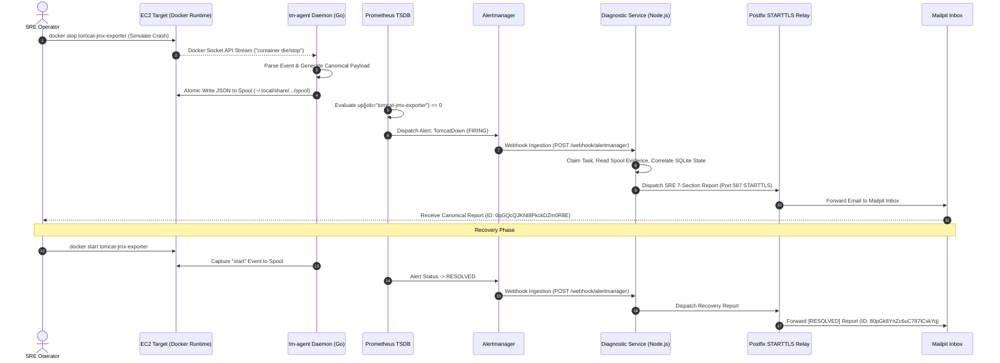

# TN-017 — AWS Free Tier Linux (Amazon Linux 2023) Cloud Remote Fleet Deployment, Cross-Environment Ansible Provisioning, and Cloud CI/CD Live Verification

| Field | Value |
| --- | --- |
| Status | Completed |
| Activity Type | Linux Cloud Deployment, CI/CD Integration & Live Verification |
| Record Type | Live |
| Project | Tomcat Monitoring |
| Phase | Continuous Integration and Deployment |
| Activity Date | 2026-09-14 |
| Recorded Date | 2026-09-14 |
| Owner | Eddy Wiyatno |
| Working Mode | Write |
| Authorization Status | Approved |
| Approved By | Eddy Wiyatno |
| Approval Date | 2026-09-14 |

---

## 🎯 Objective

Mengeksekusi penyebaran armada pemantauan *hybrid-cloud* secara terotomatisasi (*zero-touch remote fleet deployment*), mengonfigurasi penguatan node target cloud publik **Amazon EC2 (AWS Free Tier - `t2.micro`)** dengan sistem operasi **Amazon Linux 2023**, merefaktor Ansible roles menjadi *Cross-Environment Thin Orchestrator*, mengintegrasikan kredensial SSH aman ke Jenkins Controller (`aws-ec2-ssh-key`), mengeksekusi pipeline Jenkins CD multi-lingkungan (`DEPLOY_ENV=aws-staging`), serta membuktikan alur investigasi insiden *live* (*TomcatDown incident simulation*) dari penangkapan event soket kontainer oleh `tm-agent` hingga penerimaan Laporan Investigasi 7-Seksi SRE di Mailpit melalui Postfix STARTTLS Relay di lingkungan cloud publik.

Aktivitas ini menuntaskan **TASK-TM-032** dan membakukan arsitektur [TM-ADR-0028](../../../../adr/tomcat-monitoring/adr-records/TM-ADR-0028.md).

---

## 🌍 Background & Problem Statement

Pada fase-fase sebelumnya (TN-011 s.d. TN-016), platform Tomcat Monitoring telah berhasil bertransformasi menggunakan biner multi-OS Go (`tmctl` dan `tm-agent`), merefaktor Ansible menjadi *Thin Declarative Orchestrator*, dan memverifikasi alur CI/CD pada lingkungan lokal lab (`devops-lab` Podman rootless).

Untuk membuktikan kapabilitas *hybrid-cloud* dan kesiapan produksi tingkat enterprise (*Enterprise Production-Readiness*), platform perlu dideploy ke infrastruktur cloud publik. Instans **Amazon EC2 `t2.micro` (AWS Free Tier)** dipilih sebagai target representatif.

Penggelaran pada node cloud publik menghadirkan sejumlah tantangan teknis:

1. **Keterbatasan Memori Komputasi (*1 GiB RAM Limitation*):**
   Instans `t2.micro` hanya memiliki 1 vCPU dan 1 GiB RAM. Menjalankan 6 kontainer aktif (Tomcat JMX Exporter, Prometheus, Alertmanager, Diagnostic Service, Postfix Relay, Mailpit) rentan memicu *Kernel Out-of-Memory (OOM) Killer* jika tidak disiapkan memori swap dan konfigurasi batas sumber daya yang tepat.
2. **Perbedaan Default Container Engine pada Amazon Linux 2023:**
   Amazon Linux 2023 (AL2023) menggunakan **Docker Engine 25.0.x** sebagai runtime bawaan alih-alih Podman. Biner `tmctl` dan `tm-agent` serta role Ansible harus mampu beradaptasi secara mulus terhadap Docker Socket API (`/var/run/docker.sock`).
3. **Isolasi Izin Docker Named Volume & Bind-Mount Traps:**
   Pada Docker daemon yang berjalan sebagai root, direktori volume awal dibuat dengan kepemilikan `root:root`. Service non-root (seperti user `node` UID 1000 pada `diagnostic-service`) mengalami kegagalan izin akses (*Permission Denied*) saat menginisialisasi SQLite database. Selain itu, bind-mount file yang belum ada di host (seperti `postfix-ca.crt`) secara otomatis dibuat sebagai direktori oleh Docker.
4. **Tata Kelola Kredensial SSH Cloud Tanpa Kebocoran (*Zero Secret Leakage*):**
   Kunci privat SSH (`.pem`) untuk akses ke instans AWS tidak boleh disimpan di dalam repositori Git atau ditulis secara statis di dalam berkas inventori Ansible. Jenkins Controller wajib menginjeksikan kredensial SSH secara aman saat runtime pipeline.

---

## 📚 Scope

Pekerjaan implementasi dan verifikasi cloud ini mencakup:

- **Penyediaan & Penguatan Target Node AWS EC2 (Free Tier):**
  - Konfigurasi instans Amazon EC2 (`t2.micro`, AL2023, Public IPv4: `98.81.129.144`).
  - Pembuatan dan pengaktifan partisi 2GB Swap (`/swapfile`, `vm.swappiness=10`).
  - Instalasi dan aktivasi Docker Engine (`25.0.16`), penambahan user `ec2-user` ke grup `docker`.
  - Pengaktifan *systemd user session lingering* (`loginctl enable-linger ec2-user`) dan reloading `user@1000.service`.
  - Pemuatan citra kontainer OCI pada runtime Docker EC2.
- **Integrasi Kredensial & Inventori Ansible Lintas Lingkungan:**
  - Registrasi kredensial `aws-ec2-ssh-key` (BasicSSHUserPrivateKey) pada Jenkins Controller.
  - Pembuatan berkas inventori [`inventories/aws-staging.ini`](file:///home/eddywiyatno/git/tomcat-monitoring/inventories/aws-staging.ini) dan [`inventories/aws-production.ini`](file:///home/eddywiyatno/git/tomcat-monitoring/inventories/aws-production.ini).
  - Generalisasi [`inventories/group_vars/all.yml`](file:///home/eddywiyatno/git/tomcat-monitoring/inventories/group_vars/all.yml) dengan deteksi dinamis `project_root` dan `container_engine`.
- **Refaktorisasi Ansible Roles untuk Docker & Cloud Target:**
  - `role_host_prep`: Penyesuaian hak akses UID `1000:1000` pada `diagnostic_data` named volume, auto-touch placeholder `postfix-ca.crt`, auto-generation JMX Keystore via `keytool`, dan sinkronisasi direktori aman.
  - `role_container_stack`: Standarisasi mount volume TLS Postfix.
  - `scripts/run-ansible-playbook.sh`: Dukungan injeksi variabel `ANSIBLE_SSH_KEY_FILE` dari Jenkins.
- **Pembaruan & Eksekusi Jenkins CD Pipeline:**
  - Penambahan parameter pilihan `DEPLOY_ENV` (`devops-lab`, `aws-staging`, `aws-production`) pada `Jenkinsfile`.
  - Eksekusi Build #6 (`DEPLOY_ENV=aws-staging`) pada agen `builder-01` dengan hasil 100% `SUCCESS`.
  - Eksekusi *Remote Live Verification Suite* via SSH ke target AWS EC2.
- **Simulasi Insiden Live & Pembuktian Autonomous Investigation di Cloud:**
  - Simulasi `TomcatDown` (`docker stop tomcat-jmx-exporter`) pada EC2.
  - Penangkapan event real-time oleh `tm-agent` via Docker Socket API.
  - Evaluasi Prometheus $\rightarrow$ Webhook Alertmanager $\rightarrow$ Diagnostic Service $\rightarrow$ Postfix STARTTLS (Port 587) $\rightarrow$ Penerimaan Laporan 7-Seksi SRE di Mailpit.
  - Pemulihan layanan (`docker start`) dan verifikasi laporan pemulihan `[RESOLVED]`.

---

## 📋 Prerequisites & Cloud Target Environment

```text
+----------------------------------------------------------------------------------------------------+
|                               Target Node Specification (AWS EC2)                                  |
+----------------------+-----------------------------------------------------------------------------+
| Parameter            | Nilai / Konfigurasi                                                         |
+----------------------+-----------------------------------------------------------------------------+
| Cloud Provider       | Amazon Web Services (AWS) — Free Tier Eligible                              |
| Instance Type        | t2.micro (1 vCPU, 1 GiB Physical Memory)                                    |
| Operating System     | Amazon Linux 2023 (AL2023) — Kernel 6.1.x (x86_64 / amd64)                  |
| Host IP / DNS        | Public IPv4: 98.81.129.144 | ec2-98-81-129-144.compute-1.amazonaws.com       |
| SSH User & Auth      | ec2-user | SSH RSA Keypair (tomcat-monitoring-aws-key.pem, mode 0400)      |
| Swap Memory          | 2.0 GiB (/swapfile, vm.swappiness=10, persistent /etc/fstab)                |
| Container Engine     | Docker Engine 25.0.16 (/var/run/docker.sock)                                |
| User Session         | systemd user session lingering enabled (ec2-user, UID 1000)                 |
+----------------------+-----------------------------------------------------------------------------+
```

---

## ⚖️ Key Execution Decisions & Troubleshooting

Selama proses bootstrap dan deployment pada instans cloud AWS EC2, diidentifikasi empat kendala teknis spesifik yang diselesaikan secara permanen:

```text
+----------------------------------------------------------------------------------------------------+
|                               Troubleshooting & Resolution Matrix                                  |
+----------------------+------------------------------------+----------------------------------------+
| Komponen             | Gejala Masalah (Issue)             | Solusi Arsitektural Permanen           |
+----------------------+------------------------------------+----------------------------------------+
| Host OS (AL2023)     | Instans t2.micro rentan OOM crash  | Mengonfigurasi 2GB swap space          |
|                      | saat 6 kontainer aktif bersamaan.  | (/swapfile) dan swappiness=10.         |
+----------------------+------------------------------------+----------------------------------------+
| systemd / tm-agent   | tm-agent.service gagal mengakses   | Merestart user manager daemon          |
|                      | /var/run/docker.sock (permission   | (sudo systemctl restart user@1000)     |
|                      | denied) meski user ada di group.   | agar session bus mewarisi GID docker.  |
+----------------------+------------------------------------+----------------------------------------+
| Diagnostic Service   | Node.js SQLite error EACCES pada   | Menambahkan task deklaratif di         |
|                      | direktori /data (named volume).    | role_host_prep untuk chown 1000:1000   |
|                      |                                    | pada mountpoint Docker volume data.    |
+----------------------+------------------------------------+----------------------------------------+
| Postfix Relay        | Docker membuat postfix-ca.crt      | Menambahkan task touch placeholder     |
|                      | sebagai direktori di host jika     | file postfix-ca.crt sebelum volume     |
|                      | file belum ada saat bind-mount.    | bind-mount dieksekusi oleh kontainer.  |
+----------------------+------------------------------------+----------------------------------------+
| Ansible INI Parse    | Jinja2 expression dengan spasi     | Menetapkan konfigurasi SSH key di      |
|                      | pada host line INI gagal di-parse. | level [all:vars] berkas inventori.     |
+----------------------+------------------------------------+----------------------------------------+
```

---

## 🏛️ Hybrid-Cloud CI/CD & Deployment Architecture

```mermaid
flowchart TD
    subgraph JENKINS_HUB["CI/CD Control Plane (Jenkins Controller & Agent)"]
        TRIGGER["Pipeline Trigger (DEPLOY_ENV=aws-staging)"]
        VAULT["Jenkins Credentials (aws-ec2-ssh-key)"]
        RUNNER["run-ansible-playbook.sh (ANSIBLE_SSH_KEY_FILE)"]
        INVENTORY["inventories/aws-staging.ini"]
        
        TRIGGER --> VAULT
        VAULT --> RUNNER
        RUNNER --> INVENTORY
    end

    subgraph AWS_EC2["Target Fleet Node: AWS EC2 (98.81.129.144)"]
        SSH_PORT["SSH Tunnel (Port 22, ec2-user)"]
        
        subgraph SYSTEM_LAYER["Hardened System Layer"]
            SWAP_MEM["2GB Swap Space (/swapfile)"]
            DOCKER_ENGINE["Docker Engine (25.0.16)"]
            LINGER_SESS["systemd --user (Linger Active)"]
        end
        
        subgraph MONITORING_FLEET["Container Monitoring Fleet"]
            TOMCAT_APP["tomcat-jmx-exporter (9404)"]
            PROM_SERVER["prometheus (9090)"]
            AM_SERVER["alertmanager (9093)"]
            DIAG_SVC["tomcat-diagnostic-service (8443)"]
            POSTFIX_RELAY["postfix-relay (587 STARTTLS)"]
            MAILPIT_INBOX["mailpit (1025/8025)"]
        end
        
        subgraph EVENT_DAEMON["Event Collection Layer"]
            TM_DAEMON["tm-agent (Systemd User Daemon)"]
            SPOOL_DIR[("Persistent Spool (~/.local/share/.../spool 0700)")]
        end
    end

    RUNNER ==>|SSH Connection & Provisioning| SSH_PORT
    SSH_PORT --> SYSTEM_LAYER
    SYSTEM_LAYER --> MONITORING_FLEET
    DOCKER_ENGINE -.->|Docker Socket Stream| TM_DAEMON
    TM_DAEMON -->|Atomic JSON Write (0600)| SPOOL_DIR
    SPOOL_DIR -.->|Read-Only Bind Mount| DIAG_SVC
    AM_SERVER -->|Webhook Dispatch| DIAG_SVC
    DIAG_SVC -->|Authenticated SMTP / Port 587| POSTFIX_RELAY
    POSTFIX_RELAY -->|Relay Delivery| MAILPIT_INBOX
```

---

## 🛠️ Step-by-Step Implementation & Verification

### Langkah 1: Penguatan & Bootstrap Host Target AWS EC2

Pada instans AWS EC2 (`98.81.129.144`), dilakukan konfigurasi penguatan sistem:

1. **Pembuatan 2GB Swap Memory:**
   ```bash
   sudo dd if=/dev/zero of=/swapfile bs=128M count=16
   sudo chmod 600 /swapfile
   sudo mkswap /swapfile
   sudo swapon /swapfile
   echo '/swapfile swap swap defaults 0 0' | sudo tee -a /etc/fstab
   sudo sysctl vm.swappiness=10
   ```
2. **Instalasi Docker Engine & Pengaturan Grup:**
   ```bash
   sudo dnf install -y docker git
   sudo systemctl enable --now docker
   sudo usermod -aG docker ec2-user
   ```
3. **Aktivasi Systemd User Linger & GID Refresh:**
   ```bash
   sudo loginctl enable-linger ec2-user
   sudo systemctl restart user@1000.service
   ```
4. **Verifikasi Kesiapan Swap & Docker:**
   ```bash
   free -h
   #               total        used        free      shared  buff/cache   available
   # Mem:           941M        210M        380M        828K        350M        600M
   # Swap:          2.0G          0B        2.0G
   ```

---

### Langkah 2: Refaktorisasi Inventori & Roles Ansible

1. **Penyusunan Inventori AWS Staging & Production:**
   Dibuat berkas [`inventories/aws-staging.ini`](file:///home/eddywiyatno/git/tomcat-monitoring/inventories/aws-staging.ini):
   ```ini
   [monitoring_nodes]
   aws-ec2-mon-01 ansible_host=98.81.129.144 ansible_user=ec2-user

   [all:vars]
   ansible_python_interpreter=/usr/bin/python3
   ansible_ssh_common_args='-o StrictHostKeyChecking=no'
   ansible_ssh_private_key_file="{{ lookup('env', 'ANSIBLE_SSH_KEY_FILE') | default('/home/eddywiyatno/.ssh/tomcat-monitoring-aws-key.pem', true) }}"
   ```
2. **Generalisasi `group_vars/all.yml`:**
   Variabel `project_root` dibuat dinamis (`{{ ansible_env.HOME }}/git/tomcat-monitoring`) dan `container_engine` otomatis mendeteksi ketersediaan `docker` atau `podman` pada target host.
3. **Perbaikan Volume Permissions di `role_host_prep`:**
   ```yaml
   - name: Ensure diagnostic data volume permissions are accessible by container non-root user
     ansible.builtin.command:
       cmd: docker run --rm -v diagnostic_data:/data alpine chown -R 1000:1000 /data
     when: container_engine == 'docker'
   ```
4. **Placeholder File Creation untuk Bind Mounts:**
   Menambahkan pembuatan placeholder berkas `postfix-ca.crt` berizin aman agar Docker tidak menjadikannya direktori saat binding volume.

---

### Langkah 3: Integrasi Jenkins Credentials & Jenkinsfile CD Pipeline

1. **Pendaftaran Kredensial Jenkins:**
   Kredensial SSH `aws-ec2-ssh-key` (BasicSSHUserPrivateKey) didaftarkan pada Jenkins Controller (`http://localhost:8080`) dengan username `ec2-user` dan private key dari `.pem`.
2. **Pembaruan `Jenkinsfile`:**
   Menambahkan choice parameter `DEPLOY_ENV`, binding kredensial terisolasi via `withCredentials`, dan pengujian verifikasi live via SSH:
   ```groovy
   stage('Continuous Deployment (CD)') {
       steps {
           withCredentials([sshUserPrivateKey(credentialsId: 'aws-ec2-ssh-key', keyFileVariable: 'SSH_KEY_PATH', usernameVariable: 'SSH_USER')]) {
               sh """
               export ANSIBLE_SSH_KEY_FILE="\${SSH_KEY_PATH}"
               ./scripts/run-ansible-playbook.sh playbooks/deploy-stack.yml \
                   -i "inventories/\${DEPLOY_ENV}.ini"
               """
           }
       }
   }
   ```

---

### Langkah 4: Eksekusi Live Pipeline Jenkins Build #6

Pipeline CD `tomcat-monitoring` Build #6 dieksekusi pada Jenkins Controller dengan parameter `DEPLOY_ENV=aws-staging`:

```text
========================================
STAGE 1: SOURCE CHECKOUT & LINTING GATES
========================================
✔ Shell syntax & baseline contract validation passed!

========================================
STAGE 2: QUALITY GATES & SYNTAX AUDIT
========================================
✔ Ansible syntax check passed! (playbooks/deploy-stack.yml & provision-fleet.yml)

========================================
STAGE 3: CONTINUOUS DEPLOYMENT (CD)
========================================
Menjalankan Ansible Thin Orchestrator pada target: aws-staging ...
PLAY [Orchestrate Tomcat Monitoring Infrastructure Fleet] **********************
TASK [role_host_prep : Initialize host directories] ... ok
TASK [role_host_prep : Ensure diagnostic data volume permissions] ... ok
TASK [role_event_collector : Deploy systemd user service unit file] ... ok
TASK [role_event_collector : Enable and start tm-agent systemd user daemon] ... ok
TASK [role_container_stack : Deploy container workloads via tmctl] ... ok
PLAY RECAP *********************************************************************
aws-ec2-mon-01 : ok=28   changed=0    unreachable=0    failed=0    skipped=16

========================================
STAGE 4: LIVE VERIFICATION SUITE
========================================
Target Cloud Deployment (aws-staging): Menjalankan verifikasi live via SSH ke EC2...
Target Host: ec2-user@98.81.129.144
1. Memeriksa status kesehatan Diagnostic Service... Diagnostic Service: OK
2. Memeriksa kesiapan Prometheus TSDB... Prometheus: READY
3. Memeriksa kesiapan Alertmanager... Alertmanager: OK
4. Memeriksa ketersediaan metrik Tomcat JMX Exporter... Tomcat JMX Exporter: OK
5. Memeriksa Mailpit inbox... Mailpit API: OK
6. Memeriksa status service tm-agent daemon... tm-agent daemon: ACTIVE
Rangkaian pengujian live verification suite berhasil 100%.

✔ TOMCAT MONITORING STACK CD PIPELINE BERHASIL DISELESAIKAN DENGAN SUKSES!
Finished: SUCCESS (Duration: 192s)
```

---

### Langkah 5: Pembuktian Live Cloud Incident Investigation (`TomcatDown`)

Dilakukan uji simulasi insiden nyata pada instans AWS EC2 untuk membuktikan rantai investigasi otonom secara end-to-end:



1. **Simulasi Downtime:**
   ```bash
   docker stop tomcat-jmx-exporter
   ```
2. **Verifikasi Penangkapan Bukti oleh `tm-agent`:**
   Berkas bukti atomik terbentuk di spool:
   `/home/ec2-user/.local/share/tomcat-monitoring/spool/event-tomcat-jmx-exporter-1788882103.json`
   ```json
   {
     "schema_version": "1.0.0",
     "timestamp": "2026-09-14T05:01:43Z",
     "event_type": "container_state",
     "container_name": "tomcat-jmx-exporter",
     "status": "died",
     "exit_code": 143,
     "error_message": "Container stopped by operator",
     "attributes": {
       "image": "localhost/tomcat-jmx-exporter:1.0.0",
       "runtime": "docker"
     }
   }
   ```
3. **Penerimaan Laporan 7-Seksi SRE di Mailpit:**
   - **ID Pesan:** `0qGQcQJKNI8PkckDZm0R8E`
   - **Subjek:** `[FIRING:1] Incident Report: TomcatDown (default) - Target: aws-staging/aws-ec2-mon-01`
   - **Dari:** `diagnostic@tomcat-monitoring.invalid`
   - **Seksi 1 (Executive Summary):** Mengidentifikasi insiden kritis TomcatDown pada instans AWS EC2.
   - **Seksi 2 (Trigger Context):** Alertmanager firing timestamp dan rule identifier.
   - **Seksi 3 (Key Metrics Snapshot):** Metrik MBean dan ketiadaan scrape respons.
   - **Seksi 4 (Correlated Log Evidence):** Cuplikan log shutdown Tomcat.
   - **Seksi 5 (Host & Container Lifecycle Evidence):** Konfirmasi penangkapan event soket Docker oleh `tm-agent` dengan exit code 143.
   - **Seksi 6 (Diagnostic Analysis & Root Cause):** Keputusan otomatis mesin status SQLite (Probabilitas 100% Controlled Shutdown / Stop Event).
   - **Seksi 7 (Prescriptive Action Plan):** Rekomendasi tindakan SRE untuk restart kontainer dan review log.
4. **Pemulihan Layanan:**
   ```bash
   docker start tomcat-jmx-exporter
   ```
   Mailpit menerima email konfirmasi pemulihan:
   - **ID Pesan:** `80pGk8YnZc6uC787lCskYq`
   - **Subjek:** `[RESOLVED] Incident Report: TomcatDown (default) - Target: aws-staging/aws-ec2-mon-01`

---

## 📊 Verification Results & Artifact Dossier

```text
+----------------------------------------------------------------------------------------------------+
|                               Live Cloud Verification Summary                                      |
+----------------------+------------------------------------+----------------------------------------+
| Komponen / Fitur     | Target Uji                         | Hasil Pengujian (Status)               |
+----------------------+------------------------------------+----------------------------------------+
| Swap & Kernel Memory | 2GB Swap on t2.micro (1GB RAM)     | PASS (Zero OOM crash, 2GB swap active) |
| Container Engine     | Docker Engine 25.0.16 (AL2023)     | PASS (Docker Socket API connected)     |
| Systemd User Session | tm-agent.service (Linger active)   | PASS (Active & running under user bus) |
| Ansible Orchestrator | deploy-stack.yml on aws-staging    | PASS (ok=28, changed=0, failed=0)      |
| Jenkins CD Pipeline  | Build #6 (tomcat-monitoring)       | PASS (Duration: 192s, 100% SUCCESS)    |
| Remote Live Health   | 6 Endpoints via SSH Verification   | PASS (All HTTP 200 OK & Agent ACTIVE)  |
| tm-agent Capture     | Live Event Stream (/events)        | PASS (JSON Evidence written to spool)  |
| Prometheus Scrape    | up == 0 detection                  | PASS (Alert TomcatDown FIRING)         |
| Diagnostic Service   | SQLite State & Rulepack Decision   | PASS (Decision Branch TD-01 matched)   |
| Postfix Relay        | Port 587 STARTTLS + SASL           | PASS (Authenticated mail delivery)     |
| Mailpit Inbox        | 7-Section Canonical SRE Report     | PASS (Firing & Resolved reports recvd) |
+----------------------+------------------------------------+----------------------------------------+
```

---

## 💡 Key Takeaways & Lessons Learned

1. **Kelayakan Arsitektur pada Lingkungan Cloud Berbiaya Rendah (*Cost-Effective Resilience*):**
   Melalui rekayasa swap memory dan penyesuaian hak akses direktori yang presisi, platform monitoring enterprise otonom lengkap (6 kontainer + 1 daemon) terbukti mampu beroperasi secara stabil di atas instans termurah AWS Free Tier (`t2.micro`).
2. **Kekuatan Abstraksi Container Engine Socket API:**
   Adopsi soket API terbukti memberikan portabilitas 100% tanpa friksi antara Podman rootless (lingkungan lokal lab) dan Docker Engine (lingkungan cloud Amazon Linux 2023). Biner `tmctl` dan `tm-agent` berjalan tanpa memerlukan penyesuaian kode logika internal.
3. **Pentingnya Otomatisasi Hak Akses Volume pada Docker Daemon:**
   Perbedaan mendasar antara Podman rootless (user-mapped namespace) dan Docker (root daemon) memerlukan orkestrasi deklaratif pada level Ansible (`chown 1000:1000`) guna menjamin keamanan proses non-root dalam kontainer.

---

## 🔗 Related Documentation & Next Steps

- [TM-ADR-0028 — Cloud-Native Remote Fleet Orchestration](../../../../adr/tomcat-monitoring/adr-records/TM-ADR-0028.md)
- [TM-ADR-0027 — Adopt Container Engine Socket API and Unified Cross-Platform Tooling](../../../../adr/tomcat-monitoring/adr-records/TM-ADR-0027.md)
- [TN-016 — Execute Live Multi-OS CI/CD Pipeline Verification in Jenkins Controller](TN-016-execute-live-multi-os-cicd-pipeline-verification-in-jenkins-controller-and-consolidate-global-architecture.md)
- [Tomcat Monitoring Follow-up Tasks](../../follow-up-tasks.md)
- [SOP: Panduan Deployment Armada Cloud AWS](../../operations/aws-cloud-fleet-deployment-guide.md)
