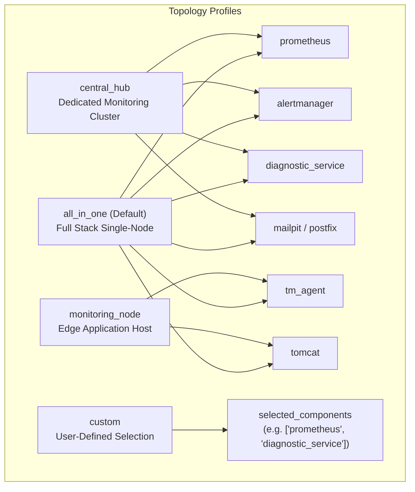

# TN-020 — Implement Flexible Multi-OS Deployment Topology, Granular Component Selection, and TLS Lifecycle Governance (Auto-Renewal & Custom SSL)

| Field | Value |
| --- | --- |
| Status | Completed |
| Activity Type | Multi-OS Deployment Topology, Granular Component Selection & TLS Lifecycle Governance |
| Record Type | Live |
| Project | Tomcat Monitoring |
| Phase | Continuous Integration and Deployment |
| Activity Date | 2026-09-16 |
| Recorded Date | 2026-09-16 |
| Owner | Eddy Wiyatno |
| Working Mode | Write |
| Authorization Status | Approved |
| Approved By | Eddy Wiyatno |
| Approval Date | 2026-09-16 |

---

## 🎯 Objective

Mengimplementasikan penyempurnaan arsitektural menyeluruh pada platform Tomcat Monitoring untuk lingkungan **Linux** dan **Windows**:
1. **Fleksibilitas Topologi Deployment & Pemilihan Komponen Granular**: Menyediakan profil topologi standar (`all_in_one` [default], `monitoring_node`, `central_hub`, `custom`) serta filter komponen selektif (`selected_components`) melalui Ansible extra-vars, Jenkinsfile build parameters, dan file konfigurasi deklaratif (`CONFIG`).
2. **Tata Kelola Siklus Hidup TLS & Custom SSL**: Membangun mekanisme pemeriksaan masa berlaku sertifikat otomatis (< 30 hari) dengan auto-renewal, serta mendukung penuh sertifikat dan private key kustom milik pengguna (`custom_tls_cert_path`, `custom_tls_key_path`).
3. **Pembersihan & Higienitas Berkas Multi-OS Target**: Memastikan target host hanya menerima skrip yang sesuai dengan OS (`.ps1` untuk Windows, `.sh` untuk Linux), menghapus sisa skrip `.sh` di Windows, dan membersihkan biner legacy di `C:\monitoring\bin\` (hanya menyisakan biner operator `tmctl.exe`).
4. **Penyempurnaan Kontekstual Notifikasi Alert**: Menambahkan informasi `host` pada Subject dan Hostname + IP (`instance`) pada Body email `DiagnosticServiceDown`, serta menyertakan `host` dan `tomcat_instance` pada Subject dan Body laporan diagnosis `TomcatDown`.

Aktivitas ini menuntaskan **TASK-TM-035** dan merealisasikan keputusan arsitektur [TM-ADR-0029](../../../../adr/tomcat-monitoring/adr-records/TM-ADR-0029.md).

---

## 🏗️ Architecture & Implementation Summary

### 1. Model Profil Topologi Deployment

### 2. Logika Pengecekan & Auto-Renewal TLS

- **Windows**: Menggunakan PowerShell .NET `[System.Security.Cryptography.X509Certificates.X509Certificate2]` untuk memeriksa `NotAfter` terhadap ambang batas 30 hari (`tls_renew_threshold_days`). Jika berkas tidak ada atau `< 30 hari`, controller men-generate pasangan sertifikat baru dan PKCS12 keystore.
- **Linux**: Menggunakan utilitas `openssl x509 -checkend 2592000` (30 hari). Jika `< 30 hari`, sertifikat dan private key di-generate ulang dengan hak akses `0400` / `0444`.
- **Mode Custom**: Jika `tls_mode: custom`, Ansible menyalin berkas sertifikat yang ditentukan pengguna tanpa melakukan pembuatan *self-signed*.

### 3. Matriks Perubahan Komponen

| Komponen | File Terkait | Deskripsi Perubahan |
| --- | --- | --- |
| **Host Preparation (Windows)** | `roles/role_host_prep/tasks/windows/directories.yml` | Filter salin hanya `.ps1`, purge `.sh` di Windows, purge biner `.exe` legacy di `C:\monitoring\bin\` (keep `tmctl.exe`). |
| **Host Preparation (Linux)** | `roles/role_host_prep/tasks/linux/directories.yml` | Tambah direktori `logs`, pastikan izin `0755` dan purge sisa file `.ps1`. |
| **TLS Management** | `roles/role_host_prep/tasks/*/secrets_and_tls.yml` | Auto-renewal (<30d) dan penanganan `custom_tls_cert_path` / `custom_tls_key_path`. |
| **Container Stack (Defaults)** | `roles/role_container_stack/defaults/main.yml`, `group_vars/all.yml` | Definisi `deploy_topology`, `selected_components`, dan `topology_components_map`. |
| **Container Stack (Orchestration)** | `roles/role_container_stack/tasks/*/main.yml` | Penambahan `when:` conditionals dan `tags:` berdasarkan `active_stack_components`. |
| **Stack Verification** | `roles/role_container_stack/tasks/*/verify_readiness.yml` | Dynamic endpoint probing yang hanya memeriksa kontainer yang diaktifkan. |
| **Event Collector** | `roles/role_event_collector/tasks/main.yml` | Gating eksekusi `tm_agent` berdasarkan `active_stack_components`. |
| **Alertmanager** | `config/alertmanager/alertmanager.yml` | Subject darurat dan tabel body HTML memuat `host`, `instance` (Hostname/IP), dan `job`. |
| **Diagnostic Service** | `src/adapters/smtp-adapter.js`, `src/application/result-renderer.js` | Subject dan body Seksi 1 laporan 7-seksi memuat `host` dan `tomcat_instance`. |
| **Configuration Baseline** | `CONFIG`, `CONFIG.example` | Parameter deklaratif `DEPLOY_TOPOLOGY`, `SELECTED_COMPONENTS`, `TLS_MODE`. |
| **CI/CD Pipeline** | `Jenkinsfile` | Parameter build Jenkins untuk topologi, seleksi komponen, dan mode TLS. |

---

## 🧪 Verification & Results

1. **Static Validation Baseline**:
   - Menjalankan `bash scripts/validate.sh` $\rightarrow$ 100% lulus tanpa kegagalan (Alertmanager, JMX Exporter, Prometheus, Telegraf, Tomcat App, Ansible syntax check).
2. **Live Deployment Verification on AWS Windows Server 2022 (`aws-ec2-win-01`)**:
   - Menjalankan `./scripts/run-ansible-playbook.sh -i inventories/aws-staging.ini playbooks/deploy-windows.yml`.
   - Direktori `C:\monitoring\bin\` terverifikasi hanya berisi `tmctl.exe`.
   - Direktori `C:\monitoring\scripts\` terverifikasi hanya berisi skrip PowerShell (`test-alert-pipeline.ps1`).
   - Seluruh kontainer NanoServer (`mailpit`, `prometheus`, `alertmanager`, `diagnostic-service`, `tm-agent`) aktif dan sehat.
3. **Live Alert Pipeline & Notification Verification**:
   - Menjalankan `C:\monitoring\scripts\test-alert-pipeline.ps1` pada host Windows.
   - Memeriksa Mailpit UI (`http://3.210.194.165:8025`): Email laporan 7-seksi diterima dengan Subject yang memuat Host dan Tomcat Instance secara tepat.

---

## 📌 Conclusion

Penyempurnaan topologi fleksibel, tata kelola TLS, pembersihan direktori target, dan perbaikan template notifikasi telah berhasil diterapkan secara simetris pada Linux dan Windows, siap digunakan secara *standalone* maupun melalui Jenkins CI/CD Controller.
