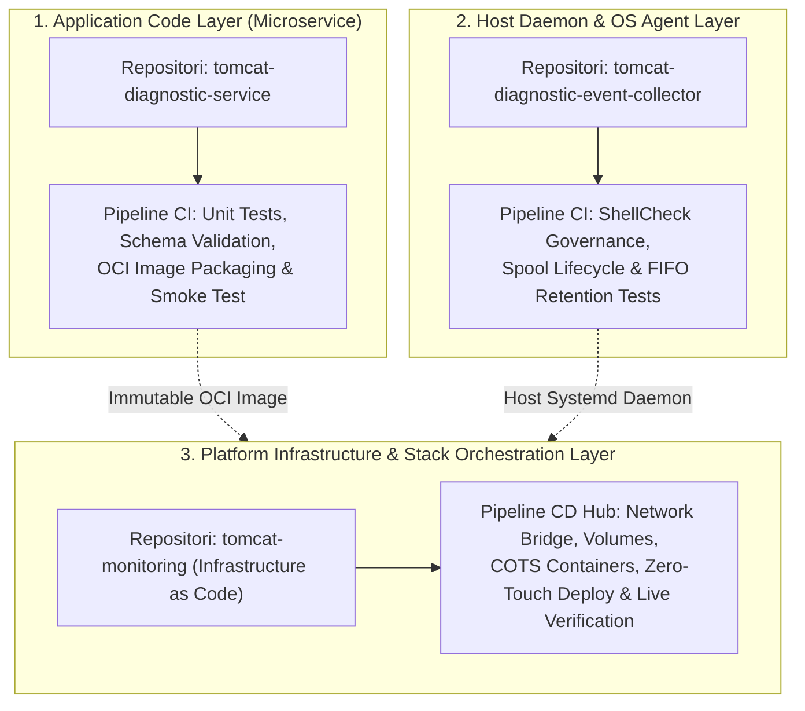

# Continuous Integration and Deployment Engineering Journal

## 🔍 Overview

Phase ini mencatat seluruh perjalanan rekayasa otomasi **Continuous Integration (CI)** dan **Continuous Deployment (CD)** berbasis Jenkins untuk seluruh komponen platform Tomcat Monitoring (`tomcat-monitoring`, `tomcat-diagnostic-service`, `tomcat-diagnostic-event-collector`).

Fokus utama fase ini adalah membangun pipeline pengiriman kontainer berstandar **Enterprise Production-Ready** yang mengedepankan keamanan tanpa kebocoran rahasia (*Zero Secret Leakage*), pembuktian mutu bertingkat (*Multi-Stage Quality Gates*), kemasan OCI yang tidak berubah (*Immutable OCI Artifacts*), serta mekanisme *Zero-Downtime Deployment* dengan *Automated Rollback* pada runtime Rootless Podman.

---

## 🎯 Objective

Membangun ekosistem otomasi CI/CD terintegrasi yang andal, aman, dan siap pakai (*Plug-and-Play*) di lingkungan enterprise:

```text
+-----------------------------------------------------------------------------+
|               Continuous Integration & Deployment Scope                     |
+-----------------------------------------------------------------------------+
| 1. Component CI Pipeline (Static Lint, Unit/Schema Tests, OCI Image Build)  |
| 2. Parameterized & Registry-Agnostic Delivery (Local Podman / Enterprise)   |
| 3. Zero Secret Leakage Governance via Jenkins Credentials Store             |
| 4. Stack Orchestration CD Hub (Zero-Touch Deploy & Live Verification Suite) |
| 5. Automated Rollback on Verification Failure & Complete SRE Runbook        |
+-----------------------------------------------------------------------------+
```

---

## 🏛️ CI/CD Layering Architecture: Application, Daemon, and Infrastructure

Platform Tomcat Monitoring membagi otomasi CI/CD ke dalam **3 Lapisan Arsitektur (*Architectural Layers*)** yang masing-masing dikelola oleh alur *Jenkins Pipeline as Code* tersendiri sesuai batas tanggung jawabnya (*Separation of Concerns*):



| Lapisan Arsitektur (*Layer*) | Repositori & Pipeline | Peran / Tanggung Jawab (*Responsibility*) | Karakteristik Siklus Rilis (*Release Lifecycle*) |
| :--- | :--- | :--- | :--- |
| **Application Layer** | **Pipeline 1**<br/>[`tomcat-diagnostic-service`](file:///home/eddywiyatno/git/tomcat-diagnostic-service) | **Logika Aplikasi / Backend Mikroservis**<br/>Menguji kode Node.js 24 ESM, validasi 62 *unit/schema test suites*, membangun OCI container image, dan menguji *ephemeral smoke test*. | *Fast Feedback Loop* (hitungan detik) saat pengembang memperbarui kode analitik atau aturan diagnostik. |
| **Host Daemon Layer** | **Pipeline 2**<br/>[`tomcat-diagnostic-event-collector`](file:///home/eddywiyatno/git/tomcat-diagnostic-event-collector) | **Host Daemon / Agen Pengamat Sistem Operasi**<br/>Menguji skrip Bash pengamat event Podman/kernel, tata kelola ShellCheck, dan siklus retensi spool `0700`. | *Script & Daemon Validation* independen tanpa memerlukan runtime Node.js atau OCI image. |
| **Infrastructure Layer** | **Pipeline 3**<br/>[`tomcat-monitoring`](file:///home/eddywiyatno/git/tomcat-monitoring) | **Infrastruktur Platform & Orkestrator Multi-Kontainer (*Infrastructure as Code*)**<br/>Mengelola *network bridge* (`devops-lab`), *named volumes*, layanan COTS (Prometheus, Alertmanager, Postfix SMTP Relay, Mailpit), *zero-touch deployment*, serta *Live Verification Suite*. | *Integration & Deployment Hub* yang menyatukan seluruh komponen aplikasi dan infrastruktur ke dalam satu lingkungan runtime terpadu. |

---

## 🛠️ Implementation Result

| Component / Focus Area | Implementation | Status |
| --- | --- | --- |
| **CI/CD Architecture & Roadmap** | Perancangan arsitektur CI/CD decoupled component & stack CD hub, standarisasi 6 pilar kesiapan produksi enterprise, evaluasi multi-repo, dan roadmap implementasi (TASK-TM-019) | Completed (TN-001) |
| **Repository Readiness Audit** | Audit kesiapan operasional dan gap analysis 6 pilar kesiapan produksi enterprise pada 3 repositori platform (TASK-TM-020) | Completed (TN-002) |
| **Repository Standardization** | Standarisasi skrip operasional, parameterisasi build OCI, eliminasi hardcoded path, dan automated rollback recovery trap pada 3 repositori (TASK-TM-020) | Completed (TN-003) |
| **Diagnostic Service CI Pipeline** | Implementasi declarative Jenkinsfile 7 tahapan quality gates, rootless Podman build, 62 unit/schema tests, dan ephemeral smoke test (TASK-TM-021) | Completed (TN-004) |
| **Event Collector CI Pipeline** | Implementasi declarative Jenkinsfile 4 tahapan quality gates, verifikasi rootless agent, governance validator, dan spool pruning test (TASK-TM-022) | Completed (TN-005) |
| **Monitoring Stack CD Hub Pipeline** | Implementasi declarative Jenkinsfile 4 tahapan orkestrasi stack, zero-touch deployment multi-kontainer, dan live verification suite (TASK-TM-023) | Completed (TN-006) |
| **Jenkins Live Execution & E2E Verification** | Eksekusi dan verifikasi live 3 pipeline jobs pada Jenkins Controller, kelulusan 100% quality gates, Postfix STARTTLS+SASL relay, dan simulasi insiden end-to-end (TASK-TM-024) | Completed (TN-007) |
| **Multi-Engine Container Runtime Portability** | Standarisasi portabilitas runtime Podman & Docker secara adaptif, SELinux volume relabeling guard, isolasi flag userns, dan abstraksi lifecycle assertions (TASK-TM-020) | Completed (TN-008) |
| **Ansible Fleet Provisioning & Deployment** | Otomatisasi penyediaan infrastruktur armada multi-node dan deployment tumpukan monitoring secara idempoten berbasis Ansible Playbooks dan 3 roles modular (TASK-TM-011) | Completed (TN-009) |

---

## 📄 Technical Notes

1. **[TN-001 — Design Production-Ready Jenkins CI/CD Pipeline Architecture and Implementation Roadmap](TN-001-design-production-ready-jenkins-cicd-pipeline-architecture.md)**

    Mendokumentasikan secara komprehensif evaluasi kebutuhan CI/CD skala produksi (`TASK-TM-019`), penetapan pola arsitektur *Decoupled Component CI + Orchestrated Stack CD Hub*, standarisasi 6 pilar produksi enterprise (parameterisasi, isolasi rahasia, quality gates, OCI immutable build, atomic rollback, runbook), serta penyusunan peta jalan bertahap (TN-002 s.d. TN-007).

2. **[TN-002 — Audit and Standardize Repositories for Production Plug-and-Play Readiness](TN-002-audit-and-standardize-repositories-for-production-plug-and-play-readiness.md)**

    Mendokumentasikan audit kesiapan operasional menyeluruh dan analisis kesenjangan (*gap analysis*) pada 3 repositori platform (`tomcat-diagnostic-service`, `tomcat-diagnostic-event-collector`, `tomcat-monitoring`), pembuktian *headless test runners*, identifikasi jalur hardcoded host, parameterisasi registry, dan perumusan rencana tindakan standarisasi enterprise sebelum implementasi Jenkinsfile.

3. **[TN-003 — Standardize Repositories for Production Plug-and-Play Readiness](TN-003-standardize-repositories-for-production-plug-and-play-readiness.md)**

    Mendokumentasikan eksekusi standarisasi fisik pada 3 repositori platform mencakup parameterisasi `build.sh`, eliminasi hardcoded path pada `verify-postfix-relay.sh`, implementasi *automated rollback recovery trap* pada `deploy-diagnostic-service.sh`, standarisasi service unit daemon `deploy-event-collector.sh`, serta verifikasi 100% test suite deterministik.

4. **[TN-004 — Implement Production-Ready CI Pipeline for Tomcat Diagnostic Service](TN-004-implement-production-ready-ci-pipeline-for-diagnostic-service.md)**

    Mendokumentasikan implementasi berkas deklaratif `Jenkinsfile` pada repositori `tomcat-diagnostic-service` berbasis 7 tahapan quality gates (checkout, agent verification, static linting, 62 unit tests, OCI buildah packaging, ephemeral smoke test, dan registry publishing) di atas runtime Rootless Podman DooD.

5. **[TN-005 — Implement Production-Ready CI Pipeline for Tomcat Diagnostic Event Collector](TN-005-implement-production-ready-ci-pipeline-for-event-collector.md)**

    Mendokumentasikan implementasi berkas deklaratif `Jenkinsfile` pada repositori `tomcat-diagnostic-event-collector` berbasis 4 tahapan quality gates (checkout, agent verification, static lint & ShellCheck governance, dan spool lifecycle & pruning tests) di atas runtime Rootless Podman DooD.

6. **[TN-006 — Implement Stack Orchestration CD Pipeline for Tomcat Monitoring](TN-006-implement-stack-orchestration-cd-pipeline-for-tomcat-monitoring.md)**

    Mendokumentasikan implementasi berkas deklaratif `Jenkinsfile` pada repositori `tomcat-monitoring` berbasis 4 tahapan orkestrasi stack (checkout & platform validation, verify agent & network isolation, zero-touch deployment multi-kontainer, dan live verification suite & incident simulation) di atas runtime Rootless Podman DooD.

7. **[TN-007 — Execute and Verify End-to-End CI/CD Pipelines in Jenkins Controller](TN-007-execute-and-verify-end-to-end-cicd-pipelines-in-jenkins-controller.md)**

    Mendokumentasikan eksekusi dan verifikasi *live* ketiga alur pipeline CI/CD pada peladen Jenkins Controller (`http://localhost:8080`), pencapaian status kelulusan 100% *SUCCESS* lintas tahapan, pembuktian isolasi eksekusi non-root DooD pada agen `builder-01`, pengujian tanggap insiden otomatis *TomcatDown*, serta penerimaan laporan 7-seksi SRE dengan 4 header RFC di Mailpit via Postfix Enterprise STARTTLS + SASL Relay Bridge.

8. **[TN-008 — Implement and Standardize Multi-Engine Container Runtime Portability](TN-008-implement-and-standardize-multi-engine-container-runtime-portability.md)**

    Mendokumentasikan implementasi dan pembakuan portabilitas runtime kontainer multi-engine (Podman dan Docker dual-engine support) secara adaptif di seluruh 5 repositori ekosistem platform Tomcat Monitoring (`ansible-controller`, `alertmanager`, `tomcat-diagnostic-service`, `tomcat-diagnostic-event-collector`, dan `tomcat-monitoring`), mencakup deteksi mesin dinamis via `CONFIG`, pelindung relabeling volume SELinux adaptif, isolasi flag `--userns=keep-id`, dan abstraksi pengecekan status sumber daya.

9. **[TN-009 — Implement and Verify Ansible Fleet Provisioning and Deployment Playbooks](TN-009-implement-and-verify-ansible-fleet-provisioning-and-deployment-playbooks.md)**

    Mendokumentasikan implementasi dan verifikasi otomatisasi penyediaan armada (*fleet provisioning*) dan deployment tumpukan monitoring secara idempoten (`TASK-TM-011`) berbasis 3 Ansible Roles modular (`role_host_prep`, `role_event_collector`, `role_container_stack`), inventori hierarkis lintas lingkungan, eksekusi runner biner lokal / kontainer pengontrol `ansible-controller:1.0`, penegakan izin ketat tanpa kebocoran rahasia, pembuktian idempotensi 100% (`changed=0`), serta kelulusan rangkaian uji insiden *live*.

---

## 🎓 Lessons Learned

1. **Pemisahan Fase Dokumentasi CI/CD:** Memisahkan dokumentasi CI/CD ke dalam workstream khusus (*Continuous Integration and Deployment*) memberikan kejelasan batas tanggung jawab antara integrasi fungsional monitoring dengan otomatisasi siklus hidup pengiriman software.
2. **Kesiapan Produksi Ditentukan Sejak Perancangan Awal:** Menambahkan parameterisasi registry, penegakan isolasi secret, dan mekanisme rollback otomatis sejak fase desain mencegah timbulnya *technical debt* saat kode dipindahkan dari lab ke server produksi enterprise.
3. **Portabilitas Multi-Engine Menghilangkan Keterikatan Infrastruktur:** Penggunaan helper adaptif berbasis shell POSIX memungkinkan eksekusi skrip otomasi yang seragam di lingkungan Red Hat (Podman) maupun Debian/Ubuntu (Docker) tanpa konfigurasi manual tambahan.

---

## 🔗 Related Documentation

- [Monitoring Platform Integration Engineering Journal](../monitoring-platform-integration/index.md)
- [Diagnostic MVP Pilot](../diagnostic-mvp-pilot/index.md)
- [Monitoring Integration and Runtime Deployment](../monitoring-integration-and-runtime-deployment/index.md)
- [Runtime Monitoring Foundation](../runtime-monitoring-foundation/index.md)
- [Follow-up Tasks Backlog](../../follow-up-tasks.md)
- [TM-ADR-0024 — Adopt Decoupled Component CI and Orchestrated Stack CD Pipeline Architecture](../../../../adr/tomcat-monitoring/adr-records/TM-ADR-0024.md)
- [TM-ADR-0025 — Delineate Responsibilities Between Jenkins Release Orchestration and Ansible Configuration Provisioning](../../../../adr/tomcat-monitoring/adr-records/TM-ADR-0025.md)
- [TM-ADR-0026 — Adopt Adaptive Multi-Engine Container Runtime Portability for Podman and Docker Environments](../../../../adr/tomcat-monitoring/adr-records/TM-ADR-0026.md)
- [PS-ADR-0007 — Use Pipeline as Code](../../../../adr/personal-site/adr-records/PS-ADR-0007.md)
- [PS-ADR-0008 — Adopt Stage-Based CI Pipeline](../../../../adr/personal-site/adr-records/PS-ADR-0008.md)
