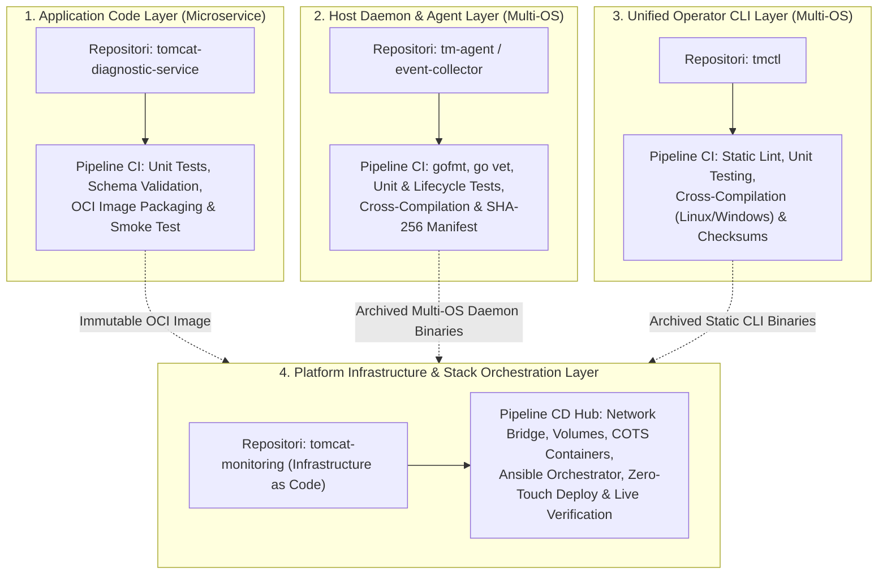

# Continuous Integration and Deployment Engineering Journal

## 🔍 Overview

Phase ini mencatat seluruh perjalanan rekayasa otomasi **Continuous Integration (CI)** dan **Continuous Deployment (CD)** berbasis Jenkins untuk seluruh komponen platform Tomcat Monitoring (`tomcat-monitoring`, `tomcat-diagnostic-service`, `tomcat-diagnostic-event-collector`).

Fokus utama fase ini adalah membangun pipeline pengiriman kontainer berstandar **Enterprise Production-Ready** yang mengedepankan keamanan tanpa kebocoran rahasia (*Zero Secret Leakage*), pembuktian mutu bertingkat (*Multi-Stage Quality Gates*), kemasan OCI yang tidak berubah (*Immutable OCI Artifacts*), serta mekanisme *Zero-Downtime Deployment* dengan *Automated Rollback* pada runtime Rootless Podman.

---

## 🎯 Objective

Membangun ekosistem otomasi CI/CD terintegrasi yang andal, aman, dan siap pakai (*Plug-and-Play*) di lingkungan enterprise:

```text
+-----------------------------------------------------------------------------+
|               Continuous Integration & Deployment Scope                     |
+-----------------------------------------------------------------------------+
| 1. Component CI Pipeline (Static Lint, Unit/Schema Tests, OCI Image Build)  |
| 2. Parameterized & Registry-Agnostic Delivery (Local Podman / Enterprise)   |
| 3. Zero Secret Leakage Governance via Jenkins Credentials Store             |
| 4. Stack Orchestration CD Hub (Zero-Touch Deploy & Live Verification Suite) |
| 5. Automated Rollback on Verification Failure & Complete SRE Runbook        |
+-----------------------------------------------------------------------------+
```

---

## 🏛️ CI/CD Layering Architecture: Application, Daemon, and Infrastructure

Platform Tomcat Monitoring membagi otomasi CI/CD ke dalam **4 Lapisan Arsitektur (*Architectural Layers*)** yang masing-masing dikelola oleh alur *Jenkins Pipeline as Code* tersendiri sesuai batas tanggung jawabnya (*Separation of Concerns*):



| Lapisan Arsitektur (*Layer*) | Repositori & Pipeline | Peran / Tanggung Jawab (*Responsibility*) | Karakteristik Siklus Rilis (*Release Lifecycle*) |
| :--- | :--- | :--- | :--- |
| **Application Layer** | **Pipeline 1**<br/>[`tomcat-diagnostic-service`](file:///home/eddywiyatno/git/tomcat-diagnostic-service) | **Logika Aplikasi / Backend Mikroservis**<br/>Menguji kode Node.js 24 ESM, validasi 62 *unit/schema test suites*, membangun OCI container image, dan menguji *ephemeral smoke test*. | *Fast Feedback Loop* (hitungan detik) saat pengembang memperbarui kode analitik atau aturan diagnostik. |
| **Host Daemon Layer** | **Pipeline 2**<br/>[`tm-agent`](file:///home/eddywiyatno/git/tm-agent) | **Host Daemon / Agen Pengamat Sistem Operasi Multi-OS**<br/>Menguji kode Go daemon, validasi siklus retensi spool `0700`, kompilasi silang multi-OS (`linux/amd64`, `linux/arm64`, `windows/amd64`), dan pengarsipan biner rilis dengan SHA-256 manifest. | *Daemon & Spool Validation* independen dengan penandatanganan integritas biner rilis. |
| **Operator CLI Layer** | **Pipeline 3**<br/>[`tmctl`](file:///home/eddywiyatno/git/tmctl) | **Kakas Baris Perintah Tunggal / Operator CLI**<br/>Menguji adapter Container Engine Socket API, kompilasi silang statis multi-OS, pembuatan SHA-256 manifest, dan pengarsipan biner operator rilis. | *Single Static Binary Release* yang siap dikonsumsi langsung oleh Ansible maupun operator sistem. |
| **Infrastructure Layer** | **Pipeline 4**<br/>[`tomcat-monitoring`](file:///home/eddywiyatno/git/tomcat-monitoring) | **Infrastruktur Platform & Orkestrator Multi-Kontainer (*Infrastructure as Code*)**<br/>Mengelola *network bridge* (`devops-lab`), *named volumes*, layanan COTS (Prometheus, Alertmanager, Postfix SMTP Relay, Mailpit), integrasi Ansible Thin Orchestrator, *zero-touch deployment*, serta *Live Verification Suite*. | *Integration & Deployment Hub* yang menyatukan seluruh komponen aplikasi, biner rilis, dan infrastruktur ke dalam satu lingkungan runtime terpadu. |


---

## 🛠️ Implementation Result

| Component / Focus Area | Implementation | Status |
| --- | --- | --- |
| **CI/CD Architecture & Roadmap** | Perancangan arsitektur CI/CD decoupled component & stack CD hub, standarisasi 6 pilar kesiapan produksi enterprise, evaluasi multi-repo, dan roadmap implementasi (TASK-TM-019) | Completed (TN-001) |
| **Repository Readiness Audit** | Audit kesiapan operasional dan gap analysis 6 pilar kesiapan produksi enterprise pada 3 repositori platform (TASK-TM-020) | Completed (TN-002) |
| **Repository Standardization** | Standarisasi skrip operasional, parameterisasi build OCI, eliminasi hardcoded path, dan automated rollback recovery trap pada 3 repositori (TASK-TM-020) | Completed (TN-003) |
| **Diagnostic Service CI Pipeline** | Implementasi declarative Jenkinsfile 7 tahapan quality gates, rootless Podman build, 62 unit/schema tests, dan ephemeral smoke test (TASK-TM-021) | Completed (TN-004) |
| **Event Collector CI Pipeline** | Implementasi declarative Jenkinsfile 4 tahapan quality gates, verifikasi rootless agent, governance validator, dan spool pruning test (TASK-TM-022) | Completed (TN-005) |
| **Monitoring Stack CD Hub Pipeline** | Implementasi declarative Jenkinsfile 4 tahapan orkestrasi stack, zero-touch deployment multi-kontainer, dan live verification suite (TASK-TM-023) | Completed (TN-006) |
| **Jenkins Live Execution & E2E Verification** | Eksekusi dan verifikasi live 3 pipeline jobs pada Jenkins Controller, kelulusan 100% quality gates, Postfix STARTTLS+SASL relay, dan simulasi insiden end-to-end (TASK-TM-024) | Completed (TN-007) |
| **Multi-Engine Container Runtime Portability** | Standarisasi portabilitas runtime Podman & Docker secara adaptif, SELinux volume relabeling guard, isolasi flag userns, dan abstraksi lifecycle assertions (TASK-TM-020) | Completed (TN-008) |
| **Ansible Fleet Provisioning & Deployment** | Otomatisasi penyediaan infrastruktur armada multi-node dan deployment tumpukan monitoring secara idempoten berbasis Ansible Playbooks dan 3 roles modular (TASK-TM-011) | Completed (TN-009) |
| **Enterprise Container Registry Integration** | Integrasi repositori citra enterprise deklaratif (Harbor/Nexus), resolusi penamaan citra dinamis, helper autentikasi terisolasi, dan task pull citra Ansible (TASK-TM-025) | Completed (TN-010) |
| **Cross-Platform Engine API & Go Tooling** | Perancangan arsitektur orkestrasi lintas OS berbasis Container Engine Socket API, spesifikasi Go CLI tmctl, Go daemon tm-agent, dan refaktorisasi Ansible deklaratif (TASK-TM-026) | Completed (TN-011) |
| **Unified Cross-Platform Operator CLI `tmctl`** | Implementasi kakas baris perintah tunggal berbasis Go (`tmctl` / `tmctl.exe`) untuk orkestrasi Container Engine Socket API (Linux & Windows) (TASK-TM-027) | Completed (TN-012) |
| **Unified Cross-Platform Event Collector `tm-agent`** | Implementasi agen background tunggal berbasis Go (`tm-agent` / `tm-agent.exe`) untuk pengumpulan event Container Engine Socket API (Linux & Windows) (TASK-TM-028) | Completed (TN-013) |
| **Ansible Roles Refactoring (`tmctl` & Multi-OS)** | Refaktorisasi Ansible roles menjadi thin orchestrator berbasis biner `tmctl` dan `tm-agent` dengan OS Fact Branching Linux systemd vs Windows Service (TASK-TM-029) | Completed (TN-014) |
| **Multi-OS CI Pipelines & Stack Release Hub** | Implementasi declarative Jenkinsfile multi-OS untuk `tmctl` dan `tm-agent`, penegakan 4-Stage Quality Gates, SHA-256 fingerprint hashing, artifact archiving, dan integrasi Stack CD Hub (TASK-TM-030) | Completed (TN-015) |
| **Live Multi-OS CI/CD Pipeline Verification & Architecture Consolidation** | Eksekusi dan verifikasi live pipeline multi-OS pada Jenkins Controller untuk `tmctl`, `tm-agent`, dan `tomcat-monitoring`, pengarsipan artefak biner lintas platform & manifest SHA-256, deployment zero-touch Ansible & `tmctl`, serta konsolidasi arsitektur global (TASK-TM-031) | Completed (TN-016) |
| **AWS Free Tier Cloud Remote Fleet Deployment & Live CI/CD Verification** | Penyediaan target node AWS EC2 (AL2023 t2.micro), 2GB swap hardening, integrasi Jenkins credentials `aws-ec2-ssh-key`, refaktorisasi Ansible cross-environment, eksekusi build #6, dan live incident simulation (TASK-TM-032) | Completed (TN-017) |
| **AWS Windows Fleet Deployment & Cross-Platform Provisioning** | Penyediaan target node AWS EC2 Windows Server 2022 (`aws-ec2-win-01`), integrasi OpenSSH, inventori `aws-staging.ini`, dan provisioning cross-platform Ansible (TASK-TM-033) | Completed (TN-018) |
| **Windows Container Migration (Docker NanoServer) & Multi-OS Refactoring** | Migrasi stack monitoring Windows ke Docker NanoServer process isolation, packaging Node.js diagnostic-service, modularisasi roles/docker multi-OS, dan verifikasi live (TASK-TM-034) | Completed (TN-019) |
| **Flexible Deployment Topology, Granular Component Selection & TLS Governance** | Implementasi profil topologi deployment (all_in_one, monitoring_node, central_hub, custom), parameter Jenkinsfile, TLS auto-renewal (<30d), custom SSL, pembersihan direktori target, dan penyempurnaan template alert (TASK-TM-035) | Completed (TN-020) |

---

## 📄 Technical Notes

1. **[TN-001 — Design Production-Ready Jenkins CI/CD Pipeline Architecture and Implementation Roadmap](TN-001-design-production-ready-jenkins-cicd-pipeline-architecture.md)**

    Mendokumentasikan secara komprehensif evaluasi kebutuhan CI/CD skala produksi (`TASK-TM-019`), penetapan pola arsitektur *Decoupled Component CI + Orchestrated Stack CD Hub*, standarisasi 6 pilar produksi enterprise (parameterisasi, isolasi rahasia, quality gates, OCI immutable build, atomic rollback, runbook), serta penyusunan peta jalan bertahap (TN-002 s.d. TN-007).

2. **[TN-002 — Audit and Standardize Repositories for Production Plug-and-Play Readiness](TN-002-audit-and-standardize-repositories-for-production-plug-and-play-readiness.md)**

    Mendokumentasikan audit kesiapan operasional menyeluruh dan analisis kesenjangan (*gap analysis*) pada 3 repositori platform (`tomcat-diagnostic-service`, `tomcat-diagnostic-event-collector`, `tomcat-monitoring`), pembuktian *headless test runners*, identifikasi jalur hardcoded host, parameterisasi registry, dan perumusan rencana tindakan standarisasi enterprise sebelum implementasi Jenkinsfile.

3. **[TN-003 — Standardize Repositories for Production Plug-and-Play Readiness](TN-003-standardize-repositories-for-production-plug-and-play-readiness.md)**

    Mendokumentasikan eksekusi standarisasi fisik pada 3 repositori platform mencakup parameterisasi `build.sh`, eliminasi hardcoded path pada `verify-postfix-relay.sh`, implementasi *automated rollback recovery trap* pada `deploy-diagnostic-service.sh`, standarisasi service unit daemon `deploy-event-collector.sh`, serta verifikasi 100% test suite deterministik.

4. **[TN-004 — Implement Production-Ready CI Pipeline for Tomcat Diagnostic Service](TN-004-implement-production-ready-ci-pipeline-for-diagnostic-service.md)**

    Mendokumentasikan implementasi berkas deklaratif `Jenkinsfile` pada repositori `tomcat-diagnostic-service` berbasis 7 tahapan quality gates (checkout, agent verification, static linting, 62 unit tests, OCI buildah packaging, ephemeral smoke test, dan registry publishing) di atas runtime Rootless Podman DooD.

5. **[TN-005 — Implement Production-Ready CI Pipeline for Tomcat Diagnostic Event Collector](TN-005-implement-production-ready-ci-pipeline-for-event-collector.md)**

    Mendokumentasikan implementasi berkas deklaratif `Jenkinsfile` pada repositori `tomcat-diagnostic-event-collector` berbasis 4 tahapan quality gates (checkout, agent verification, static lint & ShellCheck governance, dan spool lifecycle & pruning tests) di atas runtime Rootless Podman DooD.

6. **[TN-006 — Implement Stack Orchestration CD Pipeline for Tomcat Monitoring](TN-006-implement-stack-orchestration-cd-pipeline-for-tomcat-monitoring.md)**

    Mendokumentasikan implementasi berkas deklaratif `Jenkinsfile` pada repositori `tomcat-monitoring` berbasis 4 tahapan orkestrasi stack (checkout & platform validation, verify agent & network isolation, zero-touch deployment multi-kontainer, dan live verification suite & incident simulation) di atas runtime Rootless Podman DooD.

7. **[TN-007 — Execute and Verify End-to-End CI/CD Pipelines in Jenkins Controller](TN-007-execute-and-verify-end-to-end-cicd-pipelines-in-jenkins-controller.md)**

    Mendokumentasikan eksekusi dan verifikasi *live* ketiga alur pipeline CI/CD pada peladen Jenkins Controller (`http://localhost:8080`), pencapaian status kelulusan 100% *SUCCESS* lintas tahapan, pembuktian isolasi eksekusi non-root DooD pada agen `builder-01`, pengujian tanggap insiden otomatis *TomcatDown*, serta penerimaan laporan 7-seksi SRE dengan 4 header RFC di Mailpit via Postfix Enterprise STARTTLS + SASL Relay Bridge.

8. **[TN-008 — Implement and Standardize Multi-Engine Container Runtime Portability](TN-008-implement-and-standardize-multi-engine-container-runtime-portability.md)**

    Mendokumentasikan implementasi dan pembakuan portabilitas runtime kontainer multi-engine (Podman dan Docker dual-engine support) secara adaptif di seluruh 5 repositori ekosistem platform Tomcat Monitoring (`ansible-controller`, `alertmanager`, `tomcat-diagnostic-service`, `tomcat-diagnostic-event-collector`, dan `tomcat-monitoring`), mencakup deteksi mesin dinamis via `CONFIG`, pelindung relabeling volume SELinux adaptif, isolasi flag `--userns=keep-id`, dan abstraksi pengecekan status sumber daya.

9. **[TN-009 — Implement and Verify Ansible Fleet Provisioning and Deployment Playbooks](TN-009-implement-and-verify-ansible-fleet-provisioning-and-deployment-playbooks.md)**

    Mendokumentasikan implementasi dan verifikasi otomatisasi penyediaan armada (*fleet provisioning*) dan deployment tumpukan monitoring secara idempoten (`TASK-TM-011`) berbasis 3 Ansible Roles modular (`role_host_prep`, `role_event_collector`, `role_container_stack`), inventori hierarkis lintas lingkungan, eksekusi runner biner lokal / kontainer pengontrol `ansible-controller:1.0`, penegakan izin ketat tanpa kebocoran rahasia, pembuktian idempotensi 100% (`changed=0`), serta kelulusan rangkaian uji insiden *live*.

10. **[TN-010 — Implement Plug-and-Play Enterprise Container Registry Integration and Image Lifecycle Configuration](TN-010-implement-plug-and-play-container-registry-integration.md)**

    Mendokumentasikan implementasi dan standardisasi integrasi repositori citra enterprise (*Enterprise Container Registry*) yang siap pakai (*Plug-and-Play*) dan nir-modifikasi logika (`TASK-TM-025`) di 5 repositori platform, parameterisasi deklaratif lengkap (`REGISTRY_URL`, `REGISTRY_NAMESPACE`, `REGISTRY_TLS_VERIFY`, `IMAGE_PULL_POLICY`, `REGISTRY_AUTH_FILE`), penyediaan template enterprise (`CONFIG.example`, `production.ini.example`), helper autentikasi terisolasi (`registry-login-helper.sh`), task rekonsiliasi pull citra Ansible (`pull_images.yml`), serta kelulusan 100% verifikasi insiden *live*.

11. **[TN-011 — Design Cross-Platform Container Engine API Orchestration, Unified Go CLI, and Multi-OS Agent Architecture](TN-011-design-cross-platform-container-engine-api-orchestration-and-agent-architecture.md)**

    Mendokumentasikan analisis komprehensif kesiapan multi-OS, adopsi Container Engine Socket API (Podman / Docker socket & Named Pipe) sebagai antarmuka orkestrasi universal, perancangan kakas baris perintah tunggal `tmctl` (Go CLI) untuk menggantikan skrip imperatif Bash, perancangan agen background `tm-agent` (Go Daemon) untuk pengumpulan event kontainer, serta strategi refaktorisasi Ansible roles deklaratif (`TASK-TM-026`).

12. **[TN-012 — Implement Unified Cross-Platform Operator CLI tmctl for Container Engine API Orchestration](TN-012-implement-unified-cross-platform-operator-cli-tmctl.md)**

    Mendokumentasikan implementasi biner tunggal mandiri `tmctl` (Linux) dan `tmctl.exe` (Windows) berbasis Go yang berkomunikasi langsung dengan Container Engine Socket API (Unix Domain Socket, Named Pipe, TCP), penyediaan subperintah lengkap (`stack`, `rules`, `registry`, `validate`), otomasi zero-downtime rollback snapshot, matriks kompilasi silang lintas platform, dan kelulusan 100% pengujian statis serta inspeksi armada runtime (`TASK-TM-027`).

13. **[TN-013 — Implement Unified Cross-Platform Event Collector Daemon tm-agent based on Container Engine Socket API](TN-013-implement-unified-cross-platform-event-collector-daemon-tm-agent.md)**

    Mendokumentasikan implementasi biner tunggal mandiri `tm-agent` (Linux) dan `tm-agent.exe` (Windows) berbasis Go yang mengonsumsi streaming event kontainer secara *real-time* langsung dari Container Engine Socket API, format snapshot bukti kanonikal `event-record-v1.schema.json`, penulisan atomik `.tmp` $\rightarrow$ `.json` berizin `0600`/`0700`, mesin pemangkasan retensi FIFO kuota berkas, dan runner ganda Linux systemd serta Windows Service (`TASK-TM-028`).

14. **[TN-014 — Refactor Ansible Roles into Thin Declarative Orchestrator based on tmctl and OS Fact Branching](TN-014-refactor-ansible-roles-into-thin-orchestrator-based-on-tmctl-and-os-fact-branching.md)**

    Mendokumentasikan refaktorisasi seluruh Ansible roles (`role_container_stack`, `role_event_collector`, `role_host_prep`) menjadi *thin declarative orchestrator* berbasis biner operator `tmctl` dan agen background `tm-agent`, eliminasi total eksekusi skrip imperatif Bash `ansible.builtin.shell`, *OS Fact Branching* multi-platform Linux systemd vs Windows Service, pembuktian idempotensi 100% (`changed=0, failed=0`), penegakan isolasi rahasia tanpa kebocoran (*zero secret leakage*), serta kelulusan suite verifikasi live insiden (`TASK-TM-029`).

15. **[TN-015 — Implement Production-Ready CI/CD Pipelines for tmctl and tm-agent Multi-OS Artifacts & Stack Release Hub Integration](TN-015-implement-production-ready-cicd-pipelines-for-tmctl-and-tm-agent-multi-os-artifacts-and-stack-release-hub-integration.md)**

    Mendokumentasikan implementasi dan standardisasi alur *Continuous Integration* (CI) berbasis Declarative Jenkinsfile pada repositori kakas Go `tmctl` dan daemon `tm-agent`, penegakan 4-Stage Quality Gates, deterministik kompilasi silang multi-OS (`linux/amd64`, `linux/arm64`, `windows/amd64`), penandatanganan integritas manifest SHA-256 (`checksums.txt`), pengarsipan biner rilis (`archiveArtifacts`), serta integrasi rilis artefak ke dalam Stack CD Hub `tomcat-monitoring` (`TASK-TM-030`).

16. **[TN-016 — Execute Live Multi-OS CI/CD Pipeline Verification in Jenkins Controller & Consolidate Global Architecture](TN-016-execute-live-multi-os-cicd-pipeline-verification-in-jenkins-controller-and-consolidate-global-architecture.md)**

    Mendokumentasikan eksekusi dan verifikasi *live* alur *Continuous Integration* (CI) dan *Continuous Deployment* (CD) pada peladen Jenkins Controller (`http://localhost:8080`) untuk repositori operator CLI `tmctl`, agen background `tm-agent`, dan orkestrator stack `tomcat-monitoring` di atas *dedicated build agent* `builder-01` (Rootless Podman DooD), kelulusan 100% Quality Gates, pengarsipan artefak biner multi-OS (`linux/amd64`, `linux/arm64`, `windows/amd64`) dan manifest SHA-256 (`checksums.txt`), orkestrasi deployment *zero-touch* via Ansible Thin Orchestrator & `tmctl`, kelulusan pengujian tanggap insiden *TomcatDown* dengan pengiriman laporan SRE ke Mailpit via Postfix STARTTLS + SASL Relay, serta konsolidasi arsitektur global dan manual referensi teknis (`TASK-TM-031`).

17. **[TN-017 — AWS Free Tier Linux (Amazon Linux 2023) Cloud Remote Fleet Deployment, Cross-Environment Ansible Provisioning, and Cloud CI/CD Live Verification](TN-017-aws-free-tier-cloud-remote-fleet-deployment-cross-environment-ansible-provisioning-and-cloud-cicd-live-verification.md)**

    Mendokumentasikan penyediaan dan penguatan target node Amazon EC2 (AWS Free Tier t2.micro, Amazon Linux 2023, 2GB swap, Docker Engine, systemd linger), pendaftaran kredensial `aws-ec2-ssh-key` pada Jenkins Controller, refaktorisasi Ansible roles untuk Docker named volume UID fix & dynamic SSH injection, eksekusi otomatis pipeline CD Build #6 (`DEPLOY_ENV=aws-staging`) dengan status 100% SUCCESS, serta pembuktian simulasi insiden *live* `TomcatDown` dari penangkapan soket `tm-agent` hingga penerimaan Laporan 7-Seksi SRE di Mailpit via Postfix STARTTLS Relay di AWS Cloud (`TASK-TM-032`).

18. **[TN-018 — AWS Windows Fleet Deployment, Cross-Platform Ansible Provisioning, and Live Verification](TN-018-aws-windows-fleet-deployment-cross-platform-ansible-provisioning-and-live-verification.md)**

    Mendokumentasikan penyediaan target node AWS EC2 Windows Server 2022 (`aws-ec2-win-01`), integrasi OpenSSH host, inventori Ansible multi-OS (`inventories/aws-staging.ini`), provisioning lintas platform Ansible, dan eksekusi live verification (`TASK-TM-033`).

19. **[TN-019 — Windows Container Migration (Docker NanoServer), All-in-One Diagnostic Packaging, Multi-OS Modular Refactoring, and AWS Live Verification](TN-019-windows-container-migration-nanoserver-packaging-and-multi-os-modular-refactoring.md)**

    Mendokumentasikan migrasi menyeluruh Windows background executable ke Docker NanoServer process isolation containers (`prometheus`, `alertmanager`, `mailpit`, `tm-agent`, `diagnostic-service`), penyalinan netapi32.dll helper, modularisasi Ansible roles & Dockerfile multi-OS (`tasks/linux/` vs `tasks/windows/`), serta verifikasi live di AWS EC2 (`TASK-TM-034`).

20. **[TN-020 — Implement Flexible Multi-OS Deployment Topology, Granular Component Selection, and TLS Lifecycle Governance](TN-020-implement-flexible-multi-os-deployment-topology-and-ssl-lifecycle-governance.md)**

    Mendokumentasikan implementasi profil topologi deployment (`all_in_one`, `monitoring_node`, `central_hub`, `custom`), penambahan parameter Jenkinsfile & variabel konfigurasi, mekanisme auto-renewal TLS (<30d) dan custom SSL, pembersihan direktori Windows target (hanya `.ps1` dan `tmctl.exe`), serta penyempurnaan template alert (`DiagnosticServiceDown` dan `TomcatDown`) (`TASK-TM-035`).


---

## 🎓 Lessons Learned

1. **Pemisahan Fase Dokumentasi CI/CD:** Memisahkan dokumentasi CI/CD ke dalam workstream khusus (*Continuous Integration and Deployment*) memberikan kejelasan batas tanggung jawab antara integrasi fungsional monitoring dengan otomatisasi siklus hidup pengiriman software.
2. **Kesiapan Produksi Ditentukan Sejak Perancangan Awal:** Menambahkan parameterisasi registry, penegakan isolasi secret, dan mekanisme rollback otomatis sejak fase desain mencegah timbulnya *technical debt* saat kode dipindahkan dari lab ke server produksi enterprise.
3. **Portabilitas Multi-Engine Menghilangkan Keterikatan Infrastruktur:** Penggunaan helper adaptif berbasis shell POSIX memungkinkan eksekusi skrip otomasi yang seragam di lingkungan Red Hat (Podman) maupun Debian/Ubuntu (Docker) tanpa konfigurasi manual tambahan.
4. **Container Engine Socket API Melampaui Batasan OS:** Menggunakan antarmuka soket/API resmi kontainer engine membebaskan platform dari ketergantungan pada shell host OS (Bash vs PowerShell) dan menghasilkan interaksi streaming event yang jauh lebih tangguh dan terstruktur.
5. **Manajemen Swap & Volume Izin Kunci Ketahanan Cloud Murah:** Pada node cloud terbatas seperti AWS Free Tier (1GB RAM), konfigurasi swap 2GB dan otomatisasi perbaikan izin UID Docker (`chown 1000:1000`) pada named volume menjamin seluruh kontainer dan daemon beroperasi tanpa risiko OOM killer atau permission error.

---

## 🔗 Related Documentation

- [Monitoring Platform Integration Engineering Journal](../monitoring-platform-integration/index.md)
- [Diagnostic MVP Pilot](../diagnostic-mvp-pilot/index.md)
- [Monitoring Integration and Runtime Deployment](../monitoring-integration-and-runtime-deployment/index.md)
- [Runtime Monitoring Foundation](../runtime-monitoring-foundation/index.md)
- [Follow-up Tasks Backlog](../../follow-up-tasks.md)
- [SOP: Panduan Deployment Armada Cloud AWS](../../operations/aws-cloud-fleet-deployment-guide.md)
- [TM-ADR-0024 — Adopt Decoupled Component CI and Orchestrated Stack CD Pipeline Architecture](../../../../adr/tomcat-monitoring/adr-records/TM-ADR-0024.md)
- [TM-ADR-0025 — Delineate Responsibilities Between Jenkins Release Orchestration and Ansible Configuration Provisioning](../../../../adr/tomcat-monitoring/adr-records/TM-ADR-0025.md)
- [TM-ADR-0026 — Adopt Adaptive Multi-Engine Container Runtime Portability for Podman and Docker Environments](../../../../adr/tomcat-monitoring/adr-records/TM-ADR-0026.md)
- [TM-ADR-0027 — Adopt Container Engine Socket API and Unified Cross-Platform Tooling for Multi-OS Orchestration](../../../../adr/tomcat-monitoring/adr-records/TM-ADR-0027.md)
- [TM-ADR-0028 — Adopt Cloud-Native Remote Fleet Orchestration, Multi-Engine Socket API Portability, and AWS Free Tier Integration](../../../../adr/tomcat-monitoring/adr-records/TM-ADR-0028.md)
- [PS-ADR-0007 — Use Pipeline as Code](../../../../adr/personal-site/adr-records/PS-ADR-0007.md)
- [PS-ADR-0008 — Adopt Stage-Based CI Pipeline](../../../../adr/personal-site/adr-records/PS-ADR-0008.md)
