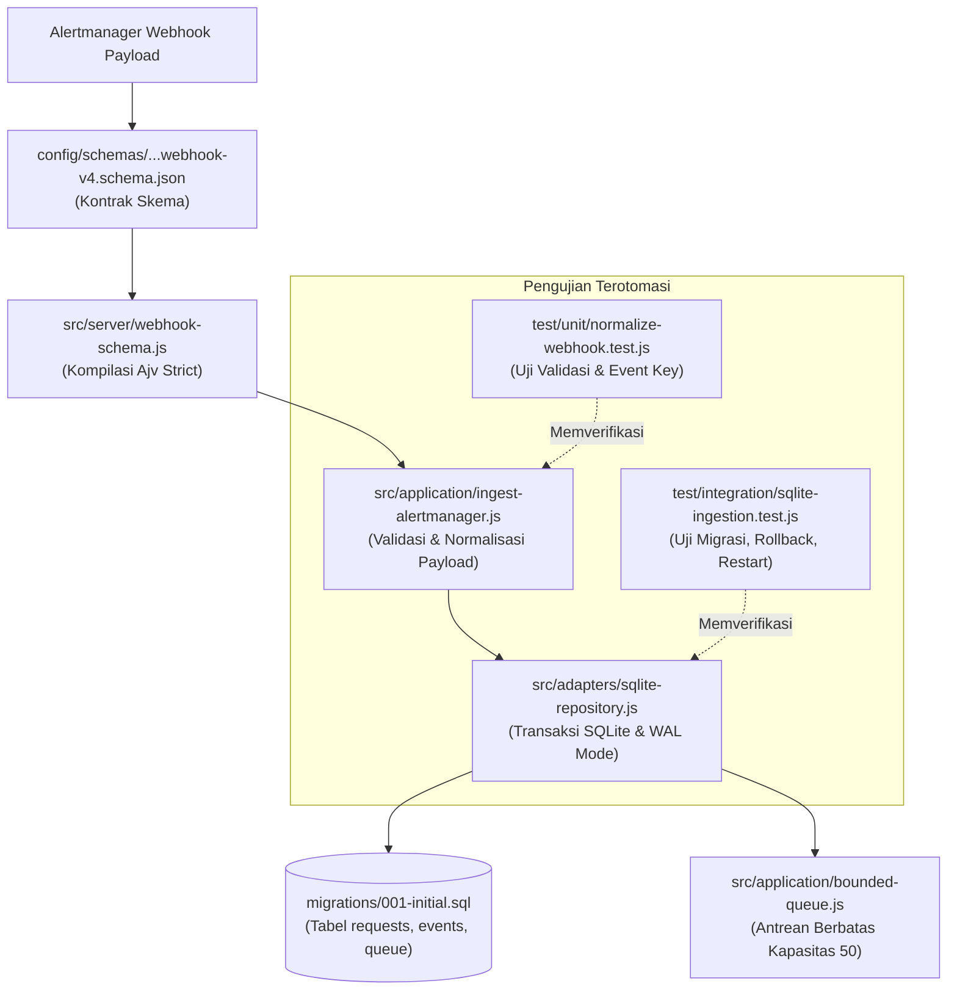

# TN-005 — Implement Durable Diagnostic Ingestion and Queue

| Field | Value |
| --- | --- |
| Status | Completed |
| Activity Type | Implementation |
| Record Type | Live |
| Project | Tomcat Monitoring |
| Phase | Diagnostic MVP Pilot |
| Activity Date | 2026-08-31 |
| Recorded Date | 2026-08-31 |
| Owner | Project owner |
| Working Mode | Write |
| Authorization Status | Approved |
| Approved By | Project owner |
| Approval Date | 2026-08-31 |

## 🎯 Objective

Membentuk schema, versioned migration, durable SQLite ingestion, deduplication,
dan bounded queue Diagnostic Service yang dapat diuji tanpa HTTP server atau
runtime persisten.

## 🌍 Background

TN-004 menyerahkan capability ini sebagai implementation berikutnya. Project
owner menyetujui source, dependency, test, dan documentation scope serta
meminta jurnal tetap ringkas, terutama untuk tahap yang belum menghasilkan
perubahan teknis.

## 📚 Scope

Perubahan mencakup exact-pinned JSON Schema validator, webhook schema v4,
forward migration, isolated `node:sqlite` adapter, durable event identity,
incident correlation, queue berkapasitas 50, tests, validator, README, dan
current-state documentation.

HTTP/TLS server, authentication transport, evidence adapter, diagnostic
engine, SMTP, image build, deployment, monitoring configuration, commit, dan
push tidak termasuk scope.

## 📋 Prerequisites

| Prerequisite | State |
| --- | --- |
| Diagnostic Service baseline | Commit `03f1296` |
| Toolchain decision | TM-ADR-0013 accepted |
| Runtime used for tests | Local image `localhost/nodejs:24.18.0` |
| Persistent database or container | Not used |
| Implementation authorization | Approved 2026-08-31 |

## ⚖️ Execution Decision

Ajv `8.20.0` dipin sebagai satu-satunya application dependency. Ia mendukung
JSON Schema draft-07 yang digunakan webhook schema. SQLite tetap diisolasi pada
satu adapter sesuai TM-ADR-0013.

## 🔄 Technical Workflow

Alur teknis penerimaan webhook Alertmanager hingga antrean SQLite dirancang deterministik dan tahan terhadap kegagalan jaringan maupun pengiriman ulang (*at-least-once delivery*):

```text
1. Webhook -> 2. schema/allowlist -> 3. normalize event key
           -> 4. one SQLite transaction: event + incident + queue item
           -> 5. accepted; duplicate does not create new work
```

### Rincian Aktivitas Alur Kerja

1. **Webhook:**
   Menerima permintaan HTTP POST payload notifikasi insiden dari Alertmanager v4 pada endpoint `/api/v1/alerts`.
2. **schema/allowlist:**
    - **schema:** Memvalidasi payload terhadap JSON Schema Draft-07 menggunakan pustaka Ajv mode strict (memeriksa struktur envelope, timestamp RFC3339, labels, dan annotations).
    - **allowlist:** Memverifikasi label target (`environment`, `host`, `tomcat_instance`) terhadap daftar target allowlist konfigurasi lokal yang valid.
3. **normalize event key:**
   Membentuk kunci event unik deterministik (`event_key` via SHA-256) dari kombinasi identitas target, `fingerprint` alert, status (`firing`/`resolved`), dan waktu `startsAt` untuk mencegah duplikasi pemrosesan.
4. **one SQLite transaction: event + incident + queue item:**
   Mengeksekusi satu transaksi tunggal SQLite yang atomik (*all-or-nothing*) untuk menjamin konsistensi data:
    - **event:** Menyimpan rekaman alert ke tabel `events` dan memeriksa apakah `event_key` telah ada sebelumnya (deduplikasi data).
    - **incident:** Melakukan *upsert* pembaruan status insiden pada tabel `incidents` berdasarkan alert fingerprint.
    - **queue item:** Memeriksa kapasitas antrean (`work_queue` < 50 item); jika aman, mendaftarkan tugas baru berstatus `queued` untuk diproses worker asinkron.
5. **accepted; duplicate does not create new work:**
    - **accepted:** Mengembalikan respons HTTP `202 Accepted` kepada Alertmanager segera setelah payload tersimpan aman di database.
    - **duplicate does not create new work:** Apabila alert yang diterima merupakan event duplikat yang telah tersimpan di database, transaksi tetap di-commit namun supresi diterapkan sehingga tidak ada antrean kerja baru yang dibuat pada `work_queue`.

## 🧭 Implementation Plan

| Tahap | Rencana |
| :--- | :--- |
| **Add Schema Validation** | Menambahkan validasi schema webhook menggunakan `ajv@8.20.0` dan mengunci dependensi pada `package.json`. |
| **Implement Durable Acceptance** | Mengembangkan skema migrasi database SQLite `001-initial.sql`, adapter repositori, dan antrean kerja berbatas. |
| **Verify Persistence and Queue Behavior** | Menjalankan uji sumber dan verifikasi socket/transaksi untuk memastikan persistensi event dan penanganan duplikasi. |

## ⚙️ Implementation

<div class="procedure" markdown>

<div class="procedure-step" markdown>

### Add Schema Validation

`package.json` dipin ke `ajv@8.20.0`. Schema v4 memeriksa envelope,
firing/resolved state, timestamps, fingerprint, dan required `TomcatDown`
labels. Lockfile dibuat dengan:

```bash
podman image exists localhost/nodejs:24.18.0
podman run --rm --name tomcat-diagnostic-tn005-node --userns=keep-id \
  -v /home/eddywiyatno/git/tomcat-diagnostic-service:/app:Z -w /app \
  localhost/nodejs:24.18.0 npm install --ignore-scripts --no-audit --no-fund
```

**Parameter:**

| Flag | Penjelasan |
|------|-----------|
| `podman run` | Menjalankan container baru |
| `--rm` | Otomatis hapus container setelah selesai |
| `--name tomcat-diagnostic-tn005-node` | Beri nama container untuk identifikasi |
| `--userns=keep-id` | Rootless mode - pertahankan user ID host |
| `-v /home/.../app:Z` | Mount source ke `/app` dengan SELinux relabel |
| `-w /app` | Working directory di dalam container |
| `localhost/nodejs:24.18.0` | Image runtime base |
| `npm install ...` | Instalasi dependency |

**Opsi npm:**

| Opsi | Penjelasan |
|------|-----------|
| `--ignore-scripts` | Jangan jalankan lifecycle script |
| `--no-audit` | Lewati audit kerentanan |
| `--no-fund` | Jangan tampilkan funding info |

**Tujuan:** Menginstal dependency `ajv@8.20.0` dan membuat `package-lock.json` dalam environment container yang terisolasi, tanpa menjalankan script yang berpotensi tidak aman.

!!! success "Expected Result"

    Schema dan lockfile tersedia tanpa framework atau ORM.

**Actual Result:** Ajv dan empat transitive packages tercatat pada lockfile.

</div>

<div class="procedure-step" markdown>

### Implement Durable Acceptance

Migration membuat `requests`, `events`, `incidents`, dan `work_queue`.
Normalizer menghitung:

```text
event_key = SHA-256(fingerprint + status + canonical event_time)
```

SQLite adapter mengaktifkan WAL dan menyimpan event, incident, serta queue item
dalam satu transaction. Unique event key mencegah duplicate work setelah
database dibuka ulang. Capacity diperiksa sebelum mutation; request di-rollback
bila event baru melewati batas 50.

!!! success "Expected Result"

    Event baru tersimpan bersama queue item; duplicate dan capacity rejection
    tidak membuat diagnostic work tambahan.

**Actual Result:** Source dan migration tersedia. HTTP `202` aktual belum diuji
karena HTTP server bukan scope TN-005.

</div>

<div class="procedure-step" markdown>

### Verify Persistence and Queue Behavior

```bash
./scripts/validate.sh
bash -n scripts/*.sh
podman run --rm --name tomcat-diagnostic-tn005-node --userns=keep-id \
  -v /home/eddywiyatno/git/tomcat-diagnostic-service:/app:Z -w /app \
  localhost/nodejs:24.18.0 npm test
```

**Step 1: Static Validation**

```bash
./scripts/validate.sh
```

Memvalidasi source code, dependency, schema, dan migration boundary tanpa menjalankan test runtime.

**Step 2: Shell Script Syntax Check**

```bash
bash -n scripts/*.sh
```

Memeriksa syntax Bash semua script tanpa mengeksekusinya (dry-run mode dengan opsi `-n` = noexec).

**Step 3: Run Tests dalam Container**

| Komponen | Penjelasan |
|----------|-----------|
| `podman run --rm` | Jalankan container baru dan hapus otomatis setelah selesai |
| `--userns=keep-id` | Rootless mode - pertahankan user ID host |
| `-v /home/.../app:Z` | Mount source ke `/app` dengan SELinux relabel |
| `-w /app` | Working directory di dalam container |
| `npm test` | Menjalankan test suite (unit + integration tests) |

**Tujuan:** Memvalidasi source code, script syntax, dan menjalankan keseluruhan test suite untuk memastikan migration, persistence, queue behavior, dan deduplication berfungsi dengan benar dalam environment container yang terisolasi.

Run pertama menghasilkan 6 pass dan 1 fail. Row SQLite benar, tetapi assertion
membandingkan null-prototype row dengan object biasa. Assertion diperbaiki
untuk memeriksa field contract. Capacity handling dan migration-failure test
juga diperketat, lalu command dijalankan ulang.

!!! success "Expected Result"

    Migration, rollback, commit persistence, restart deduplication, capacity
    rejection, dan firing/resolved correlation lulus pada temporary SQLite.

**Actual Result:** Run saat implementasi dilaporkan 8 entries tanpa failure.
Review evidence kemudian menemukan satu entry adalah fixture file, bukan test
case. Corrected command membuktikan 7 substantive TN-005 tests lulus. Container
dan temporary database tidak menjadi runtime persisten.

</div>

</div>

## 📁 Artifact Manifest

Bagian ini mencatat seluruh berkas (*artifacts*) pada repositori `tomcat-diagnostic-service` yang dibuat atau dimodifikasi selama aktivitas TN-005, terhitung dari commit baseline `03f1296`.

### Panduan Membaca Tabel

Tabel di bawah mengelompokkan berkas berdasarkan peran teknis dan lapisan (*layer*) arsitekturalnya:

- **Berkas (*Path*)**: Lokasi berkas relatif terhadap direktori utama (*root*) repositori `tomcat-diagnostic-service`.
- **Layer / Kategori**: Lapisan sistem dari komponen terkait (Dependensi, Kontrak Skema, Database, Logika Aplikasi, Adapter, Pengujian, atau Tata Kelola).
- **Status**: Status perubahan berkas dibandingkan kondisi baseline `03f1296` (`Baru` = berkas baru dibuat; `Modifikasi` = berkas template/existing diperbarui).
- **Tanggung Jawab Teknis**: Peran fungsional berkas tersebut dalam alur penyerapan alert (*alert ingestion*) dan antrean (*queue*).

### Tabel Manifest Berkas

| Berkas (*Path*) | Layer / Kategori | Status | Tanggung Jawab Teknis |
| --- | --- | :---: | --- |
| `package.json`<br/>`package-lock.json` | Dependensi & Tooling | Modifikasi<br/>Baru | Mengunci dependensi parser JSON Schema (Ajv `8.20.0`) secara eksak dan menyediakan antarmuka eksekusi `npm test`. |
| `config/schemas/alertmanager-webhook-v4.schema.json` | Kontrak Skema Data | Baru | Kontrak JSON Schema (draft-07) untuk memvalidasi struktur, tipe data, dan kelengkapan field payload webhook dari Alertmanager. |
| `migrations/001-initial.sql` | Basis Data (SQLite) | Baru | Skrip DDL migrasi awal untuk mendefinisikan tabel penerimaan request (`requests`), histori alert (`events`), status insiden (`incidents`), dan antrean persisten (`queue`). |
| `src/server/webhook-schema.js` | Server / Kompilasi Validasi | Baru | Mengompilasi skema validasi webhook v4 menggunakan compiler Ajv dengan mode strict agar siap dieksekusi cepat di runtime. |
| `src/application/ingest-alertmanager.js` | Logika Aplikasi (Ingestion) | Baru | Memvalidasi payload webhook, memeriksa kecocokan target terhadap allowlist, menormalisasi data, dan membuat kunci unik event (*event key*) untuk deduplikasi. |
| `src/application/bounded-queue.js` | Logika Aplikasi (Queue) | Baru | Mengelola antrean kerja di memori dengan kapasitas maksimum berbatas (50 item) serta membatasi operasi pengambilan (*claim*) dan penyelesaian (*complete*). |
| `src/adapters/sqlite-repository.js` | Adapter Infrastruktur | Baru | Mengisolasi akses `node:sqlite`, menangani eksekusi migrasi, mode WAL, penulisan transaksi penerimaan event secara atomik, deduplikasi, dan persistensi antrean ke disk. |
| `test/unit/normalize-webhook.test.js` | Pengujian Otomatis (Unit) | Baru | Menguji validitas skema JSON, ekstraksi identitas target, dan konsistensi pembentukan *deterministic event key*. |
| `test/integration/sqlite-ingestion.test.js` | Pengujian Otomatis (Integrasi) | Baru | Menguji siklus hidup lengkap integrasi SQLite: eksekusi migrasi, rollback transaksi saat error, pemulihan antrean pasca-restart, dan penanganan duplikasi alert. |
| `README.md`<br/>`scripts/validate.sh` | Tata Kelola Repositori | Modifikasi | Memperbarui dokumentasi status repositori dan skrip verifikasi statis (`validate.sh`) untuk memastikan kepatuhan standar kode sumber. |

### Alur Keterkaitan Antar-Berkas

Diagram berikut mengilustrasikan bagaimana berkas-berkas di atas saling berinteraksi saat sebuah webhook insiden diterima:



## 🧪 Test Scenario Matrix

| Scenario | Evidence |
| --- | --- |
| Valid firing normalization | Stable event key dan canonical timestamp |
| Unknown target | `IngestionValidationError` |
| Unsupported schema version | `IngestionValidationError` |
| First acceptance | Event dan queue item committed |
| Replay after database reopen | Duplicate accepted tanpa queue item baru |
| Queue full | `QueueCapacityError`; request transaction tidak bertambah |
| Firing followed by resolved | Satu incident berubah menjadi `resolved` |
| Invalid forward migration | Migration transaction rolled back |

## 🧭 Reproduction Boundary

Environment test adalah image lokal `localhost/nodejs:24.18.0` dengan
`node:sqlite`, Ajv lockfile, dan temporary SQLite directory. Execution sequence
ada pada procedure di atas.

TN-005 dan TN-006 source disimpan bersama pada commit `aa55170`. Untuk mereview
exact TN-005 delta dari baseline gunakan artifact manifest sebagai path filter:

```bash
git diff 03f1296 aa55170 -- package.json package-lock.json \
  config/schemas migrations src/server src/application/bounded-queue.js \
  src/application/ingest-alertmanager.js src/adapters/sqlite-repository.js \
  test/unit/normalize-webhook.test.js test/integration/sqlite-ingestion.test.js
```

Clean checkout `aa55170` ditambah exact test command pada TN ini membentuk
reproduction anchor; jurnal tidak menggantikan source revision tersebut.

## ✅ Verification

| Method | Expected Result | Actual Result |
| --- | --- | --- |
| `./scripts/validate.sh` | Source, dependency, schema, dan migration boundary konsisten | Passed |
| `bash -n scripts/*.sh` | Shell syntax valid | Passed |
| Exact TN-005 tests pada temporary Node.js `24.18.0` container | Menjalankan dua test files pemilik TN-005; fixture tidak dihitung sebagai test | Passed: 7 substantive tests |

Failed attempt dan perbaikannya dicatat pada procedure verification.
Angka awal 8 dikoreksi menjadi 7 setelah test discovery dibatasi ke
`*.test.js`; behavior yang diuji tidak berubah.

## 🖥️ Commands Executed

Command aktual ditempatkan pada procedure sesuai chronology. `npm test`
dijalankan dua kali. Source dibuat melalui workspace patch; tidak ada shell
command yang memutasinya. Discovery dibatasi pada TN-003, TN-004, accepted
contracts, repository instructions, dan documentation standards.

Read-only scope dan closure checks yang material:

```bash
git status --short --branch
rg --files | sort
git log -5 --oneline --decorate --stat
git diff --check
git status --short --branch
podman ps -a --filter name=tomcat-diagnostic-tn005-node --format '{{.Names}} {{.Status}}'
podman run --rm --name tomcat-diagnostic-tn005-evidence-correction --userns=keep-id \
  -v /home/eddywiyatno/git/tomcat-diagnostic-service:/app:Z -w /app \
  localhost/nodejs:24.18.0 node --test \
  test/unit/normalize-webhook.test.js test/integration/sqlite-ingestion.test.js
git add README.md package.json package-lock.json scripts/validate.sh config migrations src test
git diff --cached --check
git commit -m "feat(diagnostic-service): implement durable diagnostic engine foundation"
```

Source-control result: commit `aa55170`, shared oleh TN-005 dan TN-006 karena
keduanya merupakan satu verified diagnostic-engine foundation.

## 🧾 Outcome

Diagnostic Service sekarang memiliki source-level durable ingestion dan queue
boundary yang lulus static serta temporary-SQLite tests. Hasil ini belum
membuktikan HTTP `202`, bearer authentication, runtime persistence, diagnosis,
notification, atau integration flow.

## ⏭️ Next Steps

Implementasi berikutnya berfokus pada target isolation, bounded evidence
adapters, dan deterministic `TomcatDown` engine. Image work tetap digabungkan
dengan component verification ketika immutable base identity dan runtime scope
telah disetujui; tidak diperlukan TN dokumentasi-only tersendiri.

## 🔗 Related Documentation

- [TN-004 — Establish Diagnostic Service Repository Governance and Static Validation Baseline](TN-004-establish-diagnostic-service-repository-governance-and-static-validation-baseline.md)
- [Diagnostic MVP](../../diagnostic-mvp/index.md)
- [TM-ADR-0013](../../../../adr/tomcat-monitoring/adr-records/TM-ADR-0013.md)
