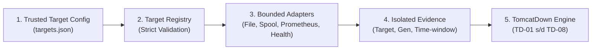
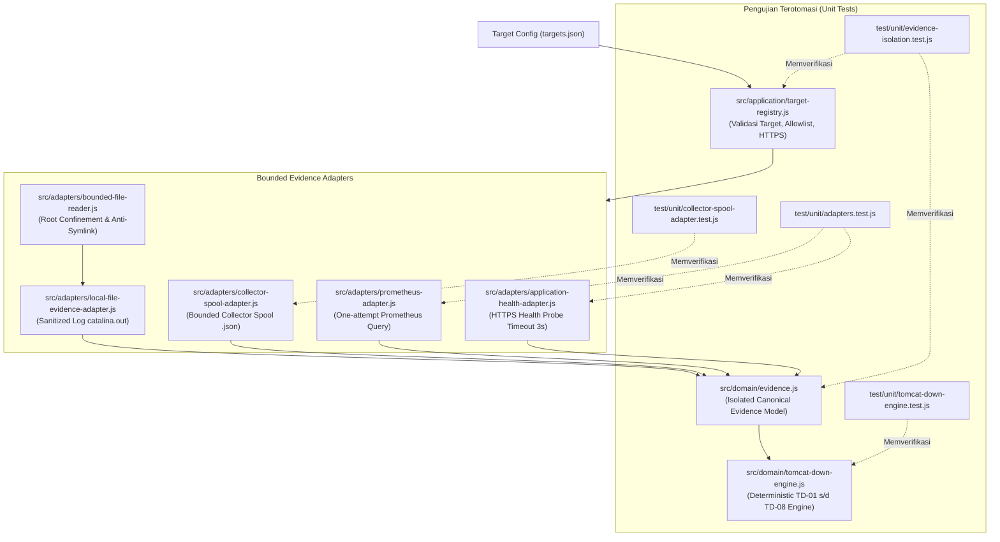

# TN-006 — Implement Target Isolation, Evidence Adapters, and TomcatDown Engine

| Field | Value |
| --- | --- |
| Status | Completed |
| Activity Type | Implementation |
| Record Type | Live |
| Project | Tomcat Monitoring |
| Phase | Diagnostic MVP Pilot |
| Activity Date | 2026-08-31 |
| Recorded Date | 2026-08-31 |
| Owner | Project owner |
| Working Mode | Write |
| Authorization Status | Approved |
| Approved By | Project owner |
| Approval Date | 2026-08-31 |

## 🎯 Objective

Mengimplementasikan registri target terisolasi, adapter pengumpul bukti berbatas (*bounded adapters*), dan engine evaluasi aturan deterministik `TomcatDown`.

**Target Utama & Kriteria Keberhasilan:**

1. **Target Isolation & Adapters:** Membangun validasi allowlist `targets.json`, adapter log dengan redaksi sensitif, spool collector, Prometheus query, dan probe health HTTP.
2. **Deterministic Rule Engine:** Mengimplementasikan pohon keputusan 8 cabang (`TD-01` s/d `TD-08`) dengan pemetaan tingkat keyakinan (*confidence level*).
3. **Boundary:** Pengujian menggunakan berkas *fixture* terisolasi; tanpa akses jaringan eksternal atau runtime container host hidup.

## 🌍 Background

TN-005 menyediakan durable ingestion dan queue. Tahap berikutnya harus
mengubah accepted alert menjadi evidence yang tidak dapat melintasi target,
generation, path, atau time window, lalu mengevaluasinya dengan decision table
yang telah diterima.

## 📚 Scope

Scope mencakup trusted target registry, canonical evidence, UTC/generation
window isolation, bounded local-file dan collector-spool reads, Prometheus dan
application-health adapters, TD-01 sampai TD-08 engine, tests, validator,
README, dan current-state documentation.

Collector service, HTTP server, notification, image, deployment, integration
configuration, commit, dan push tidak termasuk scope.

## 📋 Prerequisites

| Prerequisite | State |
| --- | --- |
| TN-005 source | Included in shared commit `aa55170` |
| Target and Evidence Contract | Accepted |
| TomcatDown Rule Specification | Accepted |
| Restricted Collector runtime | Not required; fixture spool only |
| External Prometheus or health endpoint | Not used; fetch fixtures only |
| Implementation authorization | Approved 2026-08-31 |

## 🔄 Technical Workflow

Alur teknis pengumpulan bukti terisolasi (*isolated evidence collection*) dan evaluasi pohon keputusan `TomcatDown`:



### Rincian Aktivitas Alur Kerja

1. **Trusted target config:**
   Konfigurasi non-secret `targets.json` lokal yang mendefinisikan target resmi yang diizinkan untuk dipantau (`environment`, `host`, `tomcat_instance`, health URL, query Prometheus, path log, dan path spool).
2. **target registry:**
   Registri target terisolasi yang memvalidasi integritas konfigurasi: menolak target di luar allowlist, menolak URL non-HTTPS, serta memblokir path berbahaya (path traversal `../`, symlink, atau path di luar direktori yang disetujui).
3. **bounded adapters:**
   Adapter bukti khusus yang dibatasi secara ketat untuk mencegah kebocoran data atau konsumsi sumber daya berlebih:
    - **local-file adapter:** Membaca cuplikan log aplikasi host (`catalina.out`) melalui pembaca berkas berbatas (*bounded reader* maks 500 baris / 512 KiB) dengan sensor redaksi data sensitif otomatis.
    - **collector-spool adapter:** Membaca rekaman spool status container atomik (`.tmp` $\to$ `.json`) dari direktori spool collector (maksimal 200 berkas).
    - **application-health adapter:** Melakukan probe endpoint HTTP `/health` dengan batas waktu timeout agresif (maksimal 3000ms).
    - **prometheus adapter:** Mengambil metrik telemetri via Prometheus API menggunakan label selector exact-match dan batas waktu query 5000ms.
4. **isolated evidence:**
   Pengumpulan dan agregasi seluruh bukti telemetri yang dibatasi hanya pada jendela waktu kejadian insiden (`startsAt ± 5 menit`) untuk memastikan bukti terisolasi dan spesifik pada insiden Tomcat terkait.
5. **TD-01 through TD-08:**
   Evaluasi bukti oleh Decision Engine deterministik terhadap 8 cabang aturan built-in (`TD-01` s/d `TD-08`) untuk menetapkan klasifikasi akar masalah (*root cause*), asesmen, dan tingkat keyakinan (*confidence*).

## 🧭 Implementation Plan

| Tahap | Rencana |
| :--- | :--- |
| **Establish Trusted Target Identity** | Membentuk registri target terisolasi dari konfigurasi lokal dan menolak identity atau path yang tidak valid. |
| **Implement Target-Isolated Adapters** | Mengimplementasikan adapter pembaca file berbatas, status container, dan scrape bukti Prometheus. |
| **Implement the TomcatDown Rule Engine** | Mengimplementasikan pohon keputusan deterministik 8 cabang (`TD-01` s/d `TD-08`). |
| **Run Source Verification** | Menjalankan validasi statis dan unit tests untuk membuktikan isolasi target dan akurasi evaluasi aturan. |

## ⚙️ Implementation

<div class="procedure" markdown>

<div class="procedure-step" markdown>

### Establish Trusted Target Identity

Target registry membentuk identity `environment/host/tomcat_instance` dari
local configuration. Ia menolak duplicate identity, unsafe path, non-HTTPS
health URL, dan Prometheus selector yang bukan exact label matcher. Webhook
tidak dapat memilih endpoint atau path evidence.

!!! success "Expected Result"

    Hanya target allowlisted yang memperoleh trusted evidence mapping.

**Actual Result:** Unknown target dan unsafe mapping ditolak oleh unit tests.

</div>

<div class="procedure-step" markdown>

### Implement Bounded Evidence Adapters

| Adapter | Implemented boundary |
| --- | --- |
| Prometheus | Trusted selector, one attempt, total timeout 5 seconds |
| Application health | Trusted HTTPS URL; hanya status HTTP disimpan |
| Log/crash file | Configured root, maksimum 500 lines/512 KiB, redaction |
| Collector spool | Read-only JSON, maksimum 16 KiB/record dan 200 files/run |

Traversal dan symbolic link ditolak. Evidence dinormalisasi dengan stable ID,
target, generation, UTC timestamp, status, strength, value, dan redaction
state. Evidence di luar identity, generation, atau time window dikeluarkan.

!!! success "Expected Result"

    Adapter menghasilkan bounded evidence tanpa menerima path atau endpoint
    dari alert payload.

**Actual Result:** Adapter tersedia sebagai source; tidak ada endpoint atau
host evidence aktual yang diakses.

</div>

<div class="procedure-step" markdown>

### Implement the TomcatDown Decision Table

| Branch | Decisive evidence | Assessment |
| --- | --- | --- |
| TD-01 | JMX gagal, health hidup, container running | JMX/TLS/scrape path probable |
| TD-02 | JMX dan health gagal plus OOM | Confirmed OOM |
| TD-03–TD-05 | Correlated crash, bind, atau stop evidence | Confirmed cause |
| TD-06 | Container exited tanpa cause evidence | Undetermined |
| TD-07 | Running, health timeout, long pause | Possible unresponsive Tomcat |
| TD-08 | Missing atau contradicting evidence | Undetermined |

Engine tidak menggunakan numeric score dan tidak menjalankan recommended
action.

!!! success "Expected Result"

    Evidence dan rule version yang sama selalu menghasilkan branch,
    classification, dan confidence yang sama.

**Actual Result:** TD-01 sampai TD-08 dan confidence mapping tersedia.

</div>

<div class="procedure-step" markdown>

### Verify Isolation and Rule Behavior

```bash
./scripts/validate.sh
bash -n scripts/*.sh
podman run --rm --name tomcat-diagnostic-tn006-node --userns=keep-id \
  -v /home/eddywiyatno/git/tomcat-diagnostic-service:/app:Z -w /app \
  localhost/nodejs:24.18.0 npm test
```

Run pertama lulus 16 tests. Review berikutnya menambahkan conflicting-state
fallback, exact-selector validation, HTTPS enforcement, dan spool-isolation
test. Run tersebut semula dilaporkan 18 entries; evidence correction kemudian
membatasi discovery ke `*.test.js` dan menghasilkan 17 substantive tests, 0
fail.

!!! success "Expected Result"

    Seluruh branch, timeout/no-retry, isolation, bounds, traversal, symlink,
    dan malformed-spool behavior lulus.

**Actual Result:** Run awal melaporkan 18 entries. Evidence review menemukan
satu entry adalah fixture file. Setelah `npm test` dibatasi ke `*.test.js`, 17
substantive tests lulus dan container dihapus otomatis dengan `--rm`.

</div>

</div>

## 📁 Artifact Manifest

Bagian ini mencatat seluruh berkas (*artifacts*) pada repositori `tomcat-diagnostic-service` yang dibuat atau dimodifikasi selama aktivitas TN-006 untuk mengimplementasikan isolasi target, adapter bukti berbatas, dan evaluasi aturan deterministik `TomcatDown`.

### Panduan Membaca Tabel

Tabel di bawah mengelompokkan berkas berdasarkan peran teknis dan lapisan (*layer*) arsitekturalnya:

- **Berkas (*Path*)**: Lokasi berkas relatif terhadap direktori utama (*root*) repositori `tomcat-diagnostic-service`.
- **Layer / Kategori**: Lapisan sistem dari komponen terkait (Registri Target, Model Domain, Engine Aturan, Adapter Infrastruktur, atau Pengujian Otomatis).
- **Status**: Status perubahan berkas dibandingkan kondisi baseline TN-005 (`Baru` = berkas baru dibuat; `Modifikasi` = berkas diperbarui).
- **Tanggung Jawab Teknis**: Peran fungsional berkas tersebut dalam isolasi target, pengumpulan bukti berbatas, dan evaluasi diagnosis insiden.

### Tabel Manifest Berkas

| Berkas (*Path*) | Layer / Kategori | Status | Tanggung Jawab Teknis |
| --- | --- | :---: | --- |
| `src/application/target-registry.js` | Logika Aplikasi (Registry) | Baru | Memvalidasi konfigurasi target resmi (`targets.json`), menegakkan allowlist, kewajiban HTTPS, serta memblokir injeksi selector Prometheus dan path traversal. |
| `src/domain/evidence.js` | Model Domain | Baru | Mendefinisikan struktur model bukti kanonikal (*canonical evidence*), isolasi jendela waktu kejadian insiden (UTC window), generation ID, status bukti, dan flag redaksi data. |
| `src/domain/tomcat-down-engine.js` | Engine Aturan (Domain) | Baru | Mengevaluasi sekumpulan bukti telemetri secara deterministik menggunakan pohon keputusan 8 cabang (`TD-01` s/d `TD-08`) tanpa skoring probabilitas. |
| `src/adapters/bounded-file-reader.js` | Adapter Infrastruktur (File) | Baru | Pembaca berkas berbatas aman: mengurung akses pada direktori root, menolak symlink/traversal, serta membatasi ukuran byte (512 KiB) dan jumlah baris (500 baris). |
| `src/adapters/local-file-evidence-adapter.js` | Adapter Infrastruktur (Log) | Baru | Membaca cuplikan log aplikasi (`catalina.out`) via bounded file reader dan melakukan redaksi otomatis token, password, atau credential sensitif. |
| `src/adapters/collector-spool-adapter.js` | Adapter Infrastruktur (Spool) | Baru | Membaca berkas spool status container atomik (`.tmp` $\to$ `.json`) secara read-only dan memfilter record berdasarkan target, generation, serta timestamp. |
| `src/adapters/prometheus-adapter.js` | Adapter Infrastruktur (Metrik) | Baru | Mengambil metrik telemetri dari endpoint Prometheus API dengan query tunggal (*one attempt*) dan batas timeout agresif (5 detik). |
| `src/adapters/application-health-adapter.js` | Adapter Infrastruktur (Probe) | Baru | Melakukan probe endpoint kesehatan HTTP `/health` via HTTPS dengan batas timeout 3 detik dan hanya mencatat status boolean up/down tanpa menyimpan response body. |
| `test/unit/evidence-isolation.test.js` | Pengujian Otomatis (Unit) | Baru | Menguji isolasi target registry, penolakan path traversal/symlink, serta pemfilteran evidence lintas target, generasi, dan jendela waktu. |
| `test/unit/adapters.test.js` | Pengujian Otomatis (Unit) | Baru | Menguji keandalan adapter Prometheus dan Application Health saat kondisi sukses, timeout eksplisit, maupun kegagalan koneksi. |
| `test/unit/collector-spool-adapter.test.js` | Pengujian Otomatis (Unit) | Baru | Menguji parsing berkas spool collector, penanganan berkas rusak (*malformed JSON*), serta isolasi target dan generation status container. |
| `test/unit/tomcat-down-engine.test.js` | Pengujian Otomatis (Unit) | Baru | Menguji determinisme evaluasi pohon keputusan seluruh cabang `TD-01` hingga `TD-08`, pemetaan tingkat keyakinan (*confidence*), dan penanganan bukti kontradiktif. |

### Alur Keterkaitan Antar-Berkas

Diagram berikut mengilustrasikan bagaimana berkas-berkas di atas saling berinteraksi saat sebuah insiden dievaluasi:



## 🧪 Test Scenario Matrix

| Boundary | Scenarios |
| --- | --- |
| Target registry | Accepted identity; unknown identity; unsafe path; selector injection; non-HTTPS URL |
| Filesystem | Traversal; symlink; byte and line truncation |
| Evidence isolation | Different target, generation, and UTC window rejected |
| Prometheus | Success; explicit timeout; exactly one attempt |
| Application health | HTTP `503` recorded as `up=false` without body persistence |
| Collector spool | Matching record accepted; wrong target/time and malformed JSON excluded |
| Rule engine | TD-01 through TD-08, contract confidence, conflicting direct state |

## 🧭 Reproduction Boundary

Tests menggunakan Node.js `24.18.0` temporary container, fixture-only HTTP
responses, temporary directories, dan no external network endpoint. Command
sequence tersedia pada procedure verification.

TN-005 dan TN-006 source disimpan bersama pada commit `aa55170`. Exact TN-006
files tercantum pada artifact manifest. Gunakan:

```bash
git checkout aa55170
./scripts/validate.sh
npm test
```

`npm test` membutuhkan Node.js `24.18.0`; gunakan temporary-container command
pada procedure bila host tidak menyediakan exact runtime. Commit ini masih
lokal dan belum membuktikan remote publication.

## ✅ Verification

| Method | Expected Result | Actual Result |
| --- | --- | --- |
| `./scripts/validate.sh` | Source dan forbidden-interface boundary konsisten | Passed |
| `bash -n scripts/*.sh` | Shell syntax valid | Passed |
| `npm test` pada temporary Node.js `24.18.0` container | Hanya `*.test.js` dijalankan; seluruh branch, timeout/no-retry, isolation, bounds, dan spool filtering lulus | Passed: 17 substantive tests |

Tidak ada network endpoint atau host evidence aktual yang diakses. Temporary
container dihapus otomatis dengan `--rm`.

## 🖥️ Commands Executed

Command aktual ditempatkan pada procedure sesuai chronology. `npm test`
dijalankan dua kali. Source dibuat melalui workspace patch; tidak ada shell
command yang memutasinya.

Read-only discovery dan closure checks yang material:

```bash
git status --short --branch
rg --files src test config migrations | sort
sed -n '1,320p' /home/eddywiyatno/git/devops-handbook/docs/projects/tomcat-monitoring/diagnostic-mvp/target-and-evidence-contract.md
sed -n '1,300p' /home/eddywiyatno/git/devops-handbook/docs/projects/tomcat-monitoring/diagnostic-mvp/diagnostic-result-and-confidence-contract.md
sed -n '1,220p' /home/eddywiyatno/git/devops-handbook/docs/projects/tomcat-monitoring/diagnostic-mvp/restricted-event-collector-contract.md
git diff --check
git status --short --branch
podman ps -a --filter name=tomcat-diagnostic-tn006-node --format '{{.Names}} {{.Status}}'
podman run --rm --name tomcat-diagnostic-test-evidence-correction --userns=keep-id \
  -v /home/eddywiyatno/git/tomcat-diagnostic-service:/app:Z -w /app \
  localhost/nodejs:24.18.0 npm test
git add README.md package.json package-lock.json scripts/validate.sh config migrations src test
git diff --cached --check
git commit -m "feat(diagnostic-service): implement durable diagnostic engine foundation"
```

Source-control result: commit `aa55170`, shared oleh TN-005 dan TN-006.

## 🧾 Outcome

Target and evidence boundary serta deterministic rule engine tersedia dan
lulus isolated tests. Hasil ini belum membuktikan worker orchestration,
canonical-result persistence, HTTP runtime, notification, atau end-to-end
diagnosis.

## ⏭️ Next Steps

Tahap berikutnya mengimplementasikan worker orchestration, canonical result
version 1, persistence, health/metrics model, dan Mailpit renderer. Image dan
component runtime tetap digabungkan pada verification teknis berikutnya, bukan
TN dokumentasi-only.

## 🔗 Related Documentation

- [TN-005 — Implement Durable Diagnostic Ingestion and Queue](TN-005-implement-durable-diagnostic-ingestion-and-queue.md)
- [TN-007 — Implement Worker Canonical Result and Renderers](TN-007-implement-worker-canonical-result-and-renderers.md)
- [Target and Evidence Contract](../../diagnostic-mvp/target-and-evidence-contract.md)
- [TomcatDown Rule Specification](../../diagnostic-mvp/tomcat-down-rule-specification.md)
