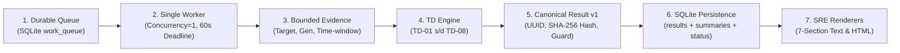
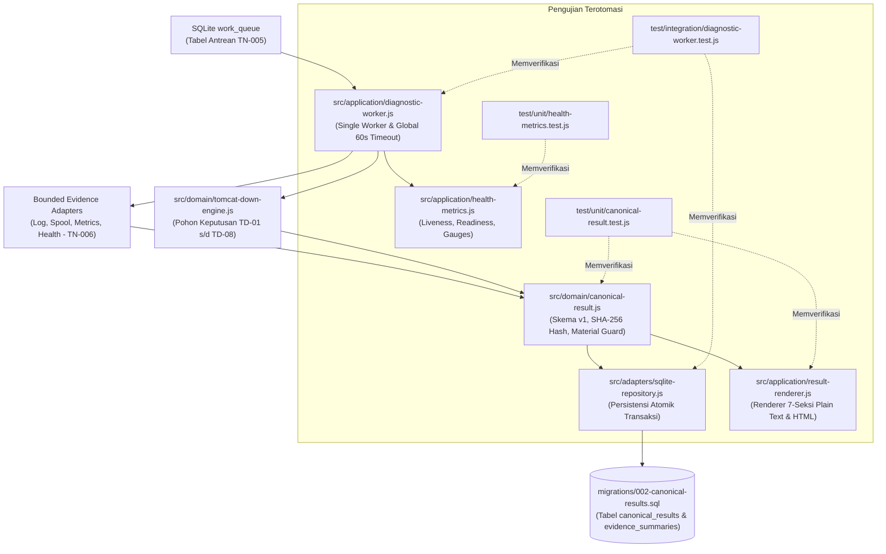

# TN-007 — Implement Worker, Canonical Result, and Renderers

| Field | Value |
| --- | --- |
| Status | Completed |
| Activity Type | Implementation |
| Record Type | Live |
| Project | Tomcat Monitoring |
| Phase | Diagnostic MVP Pilot |
| Activity Date | 2026-08-31 |
| Recorded Date | 2026-08-31 |
| Owner | Project owner |
| Working Mode | Write |
| Authorization Status | Approved |
| Approved By | Project owner |
| Approval Date | 2026-08-31 |

## 🎯 Objective

Mengubah durable queue item menjadi persisted canonical result melalui satu worker asinkron, lalu membentuk laporan diagnosis 7-seksi SRE (Plain Text dan HTML) serta model status operasional.

**Target Utama & Kriteria Keberhasilan:**

1. **Worker Orchestration & Persistence:** Membangun *single worker loop* dengan batas waktu *global deadline* 60 detik, persistensi database DDL migrasi `002-canonical-results.sql`, dan proteksi *material-update*.
2. **Canonical Result & Renderers:** Mengimplementasikan semantik skema *canonical result* v1, hash deterministik SHA-256 (*volatile timestamp exclusion*), status *health/metrics*, serta *renderer* laporan 7-seksi SRE multipart (Plain Text dan HTML dengan proteksi *HTML escaping*).
3. **Boundary:** Pengujian unit dan integrasi berbasis kontainer sementara (*temporary container*) dan SQLite terisolasi; tanpa HTTP/TLS server aktif, runtime SMTP, atau Mailpit live.

## 🌍 Background

TN-005 menyediakan mekanisme *durable ingestion* dan antrean kerja berbatas, sementara TN-006 mengimplementasikan registri target terisolasi, *bounded adapters*, dan engine pohon keputusan `TomcatDown`. Tahap ini mengorkestrasi seluruh komponen tersebut melalui satu *worker* asinkron untuk memproses antrean menjadi *canonical result* yang terpersistensi secara atomik ke database SQLite lokal dan merendernya menjadi laporan insiden terstruktur.

## 📚 Scope

Pekerjaan yang disetujui mencakup:
- Migration `002-canonical-results.sql`, *single worker*, *global deadline* 60 detik;
- Semantik *canonical result* v1, hash deterministik, proteksi *material-change*, dan persistensi SQLite;
- Model status operasional *health/metrics*;
- *Renderer* laporan 7-seksi (Plain Text dan HTML);
- Unit tests, integration tests, validator, README, dan dokumentasi *current-state*.

Pekerjaan yang dikecualikan mencakup HTTP/TLS, SMTP, runtime Mailpit, build image, deployment, commit, dan push.

## 📋 Prerequisites

| Item | State |
| --- | --- |
| TN-005/TN-006 source | Commit `aa55170`, tersinkronisasi dengan `origin/main` |
| Node runtime | Local image `localhost/nodejs:24.18.0` |
| Decision Baseline | TM-ADR-0013, TM-ADR-0014, TM-ADR-0015, TM-ADR-0016 accepted |
| Tests | Container sementara (*temporary container*) dan SQLite saja |
| Implementation authorization | Approved 2026-08-31 |

## ⚖️ Execution Decision

Implementasi menerapkan [TM-ADR-0013](../../../../adr/tomcat-monitoring/adr-records/TM-ADR-0013.md) untuk isolasi persistensi `node:sqlite`, [TM-ADR-0014](../../../../adr/tomcat-monitoring/adr-records/TM-ADR-0014.md) dengan memastikan renderer dan worker tidak mengeksekusi tindakan otomatis (*Zero Automatic Remediation*), [TM-ADR-0015](../../../../adr/tomcat-monitoring/adr-records/TM-ADR-0015.md) untuk antrean *single worker claim*, dan [TM-ADR-0016](../../../../adr/tomcat-monitoring/adr-records/TM-ADR-0016.md) untuk otoritas notifikasi kanonikal berdasar hash SHA-256 stabil.

## 🔄 Technical Workflow

Alur teknis pemrosesan antrean kerja oleh *single worker loop*, pembentukan hasil diagnosis kanonikal, hingga rendering laporan insiden:



### Rincian Aktivitas Alur Kerja

1. **durable queue:**
   Antrean kerja persisten (`work_queue`) pada database SQLite lokal yang menampung event alert terverifikasi berstatus `queued`.
2. **single worker:**
   Worker asinkron loop tunggal (*concurrency = 1*) yang secara sekuensial mengklaim item tertua dari antrean dan mengubah statusnya menjadi `processing` untuk mencegah *lock contention* pada SQLite dengan batas waktu eksekusi global 60 detik.
3. **bounded evidence:**
   Pengumpulan bukti telemetri terisolasi (log catalina, rekaman spool atomik, metrik JMX Prometheus, dan status health) yang dibatasi pada jendela waktu kejadian insiden untuk target terkait.
4. **TD engine:**
   Evaluasi seluruh bukti yang terkumpul oleh Decision Engine deterministik terhadap basis aturan keputusan `TomcatDown` (`TD-01` s/d `TD-08`).
5. **canonical result v1:**
   Penyusunan hasil diagnosis kanonikal standar v1:
    - **diagnostic_id:** Pembuatan pengidentifikasi unik diagnosis (UUID v4).
    - **result_hash:** Perhitungan SHA-256 hash deterministik dengan mengecualikan timestamp volatil (*volatile timestamp exclusion*).
    - **material update guard:** Pengecekan perubahan materiil insiden untuk membatasi pengiriman notifikasi berulang (maksimal 1 kali pembaruan).
6. **SQLite persistence:**
   Persistensi atomik hasil kanonikal ke tabel `canonical_results` dan ringkasan bukti ke `evidence_summaries`, lalu memperbarui status item antrean `work_queue` menjadi `completed`.
7. **SRE renderers:**
   Transformasi hasil kanonikal menjadi format presentasi laporan diagnosis 7-seksi SRE:
    - **plain text renderer:** Format teks polos (*plain text*) 7-seksi SRE sebagai payload fallback email.
    - **HTML renderer:** Format HTML responsif 7-seksi SRE untuk rendering visual email insiden dengan pengamanan karakter khusus (*escaping*).

## 🧭 Implementation Plan

| Tahap | Rencana |
| :--- | :--- |
| **Add Result Persistence** | Menambahkan migrasi `002-canonical-results.sql` dan persistensi canonical results pada repositori SQLite. |
| **Build and Render the Canonical Result** | Mengembangkan skema canonical result v1, hash deterministik, serta format renderer laporan diagnosis 7-seksi (HTML dan Plain Text). |
| **Run the Single Worker** | Mengimplementasikan pemrosesan antrean sekuensial tunggal (single worker loop) dengan timeout global 60 detik. |
| **Verify the Complete Source** | Menjalankan validasi statis dan pengujian integrasi berbasis kontainer sementara. |

## ⚙️ Implementation

<div class="procedure" markdown>
<div class="procedure-step" markdown>

### Add Result Persistence

Skrip `002-canonical-results.sql` menambahkan tabel `canonical_results`, `evidence_summaries` terbatas, dan satu counter *material-update* per insiden. Method repositori memuat event dari antrean, menyimpan hasil diagnosis dan bukti, serta mereservasi satu kali izin pembaruan material secara atomik.

!!! success "Expected Result"

    Canonical result dan bukti tersimpan di database sebelum status antrean berubah menjadi *completed*.

**Actual Result:** Pengujian integrasi temporary-SQLite membuktikan penyimpanan hasil, perubahan status antrean menjadi *completed*, dan reservasi pembaruan material berhasil (panggilan pertama `true`, panggilan kedua `false`).

</div>
<div class="procedure-step" markdown>

### Build and Render the Canonical Result

Modul canonical result memvalidasi status pemrosesan serta klasifikasi/confidence, mengurutkan bukti, mencatat sumber bukti yang tidak tersedia, dan melakukan hashing terhadap konten stabil dengan mengecualikan timestamp dinamis. Format Plain Text dan HTML menggunakan 7 seksi terurut yang sama; HTML melakukan escaping terhadap nilai yang tidak tepercaya.

!!! success "Expected Result"

    Input semantik yang sama menghasilkan hash yang identik, dan kedua renderer menjaga urutan pesan yang disetujui tanpa memperkuat asesmen secara sepihak.

**Actual Result:** Seluruh pengujian hash, material-change, penolakan confidence tidak valid, urutan seksi, dan HTML escaping lulus 100%.

</div>
<div class="procedure-step" markdown>

### Run the Single Worker

Worker mengambil satu item antrean, menerapkan batas waktu global 60 detik, mengevaluasi aturan TD-01 s/d TD-08, menyimpan canonical result ke SQLite, lalu menyelesaikan item antrean. Jika terjadi kegagalan, item ditandai sebagai *failed*. Status health/metrics hanya memuat label operasional terbatas.

!!! success "Expected Result"

    Tepat satu item diproses dan tidak ada timer deadline yang tetap aktif setelah pengumpulan bukti selesai.

**Actual Result:** Eksekusi pertama sempat menggantung (*hung*) karena timer `Promise.race` yang kalah tidak dibersihkan. Proses dihentikan paksa, menyisakan container sementara. Worker diperbaiki dengan menambahkan pembersihan timer pada blok `finally`; container yang tertinggal dihapus setelah persetujuan dan pengujian diulang.

</div>
<div class="procedure-step" markdown>

### Verify the Complete Source

```bash
./scripts/validate.sh
bash -n scripts/*.sh
podman run --rm --name tomcat-diagnostic-tn007-node --userns=keep-id \
  -v /home/eddywiyatno/git/tomcat-diagnostic-service:/app:Z -w /app \
  localhost/nodejs:24.18.0 npm test
```

!!! success "Expected Result"

    Pengujian ingest/isolasi yang ada dan pengujian baru worker/result/renderer seluruhnya lulus hanya menggunakan state sementara.

**Actual Result:** Eksekusi akhir meluluskan 22 pengujian, 0 gagal. Container dihapus secara otomatis.

</div>
</div>

## 📁 Artifact Manifest

Bagian ini mencatat seluruh berkas (*artifacts*) pada repositori `tomcat-diagnostic-service` yang dibuat atau dimodifikasi selama aktivitas TN-007 untuk mengimplementasikan orkestrasi worker, pembentukan canonical result, perenderan laporan 7-seksi, dan status health/metrics.

### Panduan Membaca Tabel

Tabel di bawah mengelompokkan berkas berdasarkan peran teknis dan lapisan (*layer*) arsitekturalnya:

- **Berkas (*Path*)**: Lokasi berkas relatif terhadap direktori utama (*root*) repositori `tomcat-diagnostic-service`.
- **Layer / Kategori**: Lapisan sistem dari komponen terkait (Tata Kelola, Basis Data, Model Domain, Logika Aplikasi, Adapter Infrastruktur, atau Pengujian Otomatis).
- **Status**: Status perubahan berkas dibandingkan kondisi baseline TN-006 (`Baru` = berkas baru dibuat; `Modifikasi` = berkas diperbarui).
- **Tanggung Jawab Teknis**: Peran fungsional berkas tersebut dalam pemrosesan antrean, evaluasi insiden, persistensi data, dan perenderan laporan.

### Tabel Manifest Berkas

| Berkas (*Path*) | Layer / Kategori | Status | Tanggung Jawab Teknis |
| --- | --- | :---: | --- |
| `README.md` | Tata Kelola Repositori | Modifikasi | Memperbarui dokumentasi status implementasi worker, canonical result, dan status pengujian. |
| `scripts/validate.sh` | Tata Kelola Repositori | Modifikasi | Menambahkan aturan validasi berkas migrasi `002`, dependensi, dan batasan impor komponen worker. |
| `migrations/002-canonical-results.sql` | Basis Data (SQLite) | Baru | Skrip DDL migrasi untuk tabel penyimpanan hasil diagnosis (`canonical_results`), ringkasan bukti (`evidence_summaries`), dan kolom proteksi *material update*. |
| `src/domain/canonical-result.js` | Model Domain | Baru | Mendefinisikan struktur model hasil diagnosis kanonikal v1, pembuatan UUID v4, hashing SHA-256 deterministik, dan pendeteksi *material change*. |
| `src/application/diagnostic-worker.js` | Logika Aplikasi (Worker) | Baru | Mengelola siklus hidup *single worker loop*, klaim antrean sekuensial, orkestrasi pengumpulan bukti & aturan, serta *global deadline* timeout 60 detik. |
| `src/application/result-renderer.js` | Logika Aplikasi (Renderer) | Baru | Merender laporan diagnosis insiden 7-seksi SRE dalam format Plain Text dan HTML responsif dengan sanitasi *HTML escaping*. |
| `src/application/health-metrics.js` | Logika Aplikasi (Metrics) | Baru | Menyediakan status liveness, readiness, counters, dan gauges operasional tanpa mengekspos label sensitif target. |
| `src/adapters/sqlite-repository.js` | Adapter Infrastruktur | Modifikasi | Memperluas adapter SQLite untuk mendukung persistensi hasil diagnosis, penyimpanan ringkasan bukti, dan reservasi *material-update* atomik. |
| `test/unit/canonical-result.test.js` | Pengujian Otomatis (Unit) | Baru | Menguji kestabilan hash SHA-256, validasi semantik skema, deteksi *material change*, dan urutan 7-seksi render serta HTML escaping. |
| `test/unit/health-metrics.test.js` | Pengujian Otomatis (Unit) | Baru | Menguji status operasional health liveness/readiness dan metrik Prometheus internal tanpa label target. |
| `test/integration/diagnostic-worker.test.js` | Pengujian Otomatis (Integrasi) | Baru | Menguji siklus transaksi lengkap dari klaim antrean (`queue`), pengumpulan bukti, evaluasi engine, hingga persistensi `canonical_results`. |

### Alur Keterkaitan Antar-Berkas

Diagram berikut mengilustrasikan bagaimana berkas-berkas di atas saling berinteraksi saat sebuah item antrean dievaluasi dan dirender:



## 🧪 Test Scenario Matrix

| Boundary | Scenarios |
| --- | --- |
| Worker | Single claim, persistensi sebelum penyelesaian antrean, pembersihan timer |
| Canonical result | Hash stabil, confidence valid, deteksi material change |
| SQLite | Migration 002, baris evidence, reservasi satu kali material update |
| Renderer | Urutan 7-seksi dan proteksi HTML escaping |
| Health/metrics | Status live/ready, counter/gauge, tanpa label target |
| Regression | Seluruh pengujian TN-005 dan TN-006 tetap lulus |

## 🖥️ Commands Executed

Perintah kronologis ditampilkan pada prosedur implementasi. Perintah pembersihan container yang gagal:

```bash
podman rm -f tomcat-diagnostic-tn007-node
```

Perintah pengujian dijalankan tiga kali: eksekusi pertama dihentikan akibat bug timer, eksekusi kedua meluluskan 21 pengujian, dan eksekusi akhir meluluskan 22 pengujian setelah penambahan cakupan *material-update* dan *health/metrics*. Berkas source dibuat melalui patch workspace, bukan mutasi shell.

Source-control handoff kemudian diotorisasi dan dijalankan:

```bash
git add README.md scripts/validate.sh migrations/002-canonical-results.sql \
  src/adapters/sqlite-repository.js src/application/diagnostic-worker.js \
  src/application/health-metrics.js src/application/result-renderer.js \
  src/domain/canonical-result.js test/integration/diagnostic-worker.test.js \
  test/unit/canonical-result.test.js test/unit/health-metrics.test.js
git diff --cached --check
git commit -m "feat(diagnostic-service): persist and render canonical results"
```

Hasil aktual adalah commit `1ea79fa`. Commit belum dipush pada penutupan TN-007.

## 🧭 Reproduction Guide

```bash
git checkout 1ea79fa
./scripts/validate.sh
podman run --rm --name tomcat-diagnostic-tn007-node --userns=keep-id \
  -v /home/eddywiyatno/git/tomcat-diagnostic-service:/app:Z -w /app \
  localhost/nodejs:24.18.0 npm test
```

Hasil yang diharapkan adalah validasi statis lulus dan 22 pengujian lulus. Gunakan clone/worktree bersih sebelum checkout agar perubahan lokal tidak tertimpa.

## ✅ Verification

| Method | Expected | Actual |
| --- | --- | --- |
| Static validator and Bash syntax | Kontrak source valid | Passed |
| `npm test` in Node.js 24.18.0 | Skenario baru dan regresi lulus | 22 passed |
| Runtime integration | Perilaku HTTP, SMTP, Mailpit | Not verified; excluded |

## 🧾 Outcome

Pemrosesan antrean menjadi canonical result, persistensi database SQLite, proteksi pembaruan material, status operasional, dan perenderan notifikasi telah diimplementasikan dan diuji secara lokal. Pengiriman jaringan dan endpoint service belum diimplementasikan pada tahap ini.

## ⏭️ Next Steps

Mengimplementasikan antarmuka service HTTP/TLS, autentikasi bearer, batasan ukuran request, endpoint health/metrics, dan adapter pengiriman SMTP; kemudian membangun dan menjalankan verifikasi komponen sementara (*disposable component verification*) di bawah otorisasi terpisah.

## 🔗 Related Documentation

- [TN-006 — Implement Target Isolation, Evidence Adapters, and TomcatDown Engine](TN-006-implement-target-isolation-evidence-adapters-and-tomcatdown-engine.md)
- [TN-008 — Implement Secure Service and SMTP Delivery Boundaries](TN-008-implement-secure-service-and-smtp-delivery-boundaries.md)
- [Diagnostic Result and Confidence Contract](../../diagnostic-mvp/diagnostic-result-and-confidence-contract.md)
- [Notification and Integration Contract](../../diagnostic-mvp/notification-and-integration-contract.md)
- [Target and Evidence Contract](../../diagnostic-mvp/target-and-evidence-contract.md)
- [TomcatDown Rule Specification](../../diagnostic-mvp/tomcat-down-rule-specification.md)
- [TM-ADR-0013 — Use Built-in node:sqlite for MVP Local Persistence](../../../../adr/tomcat-monitoring/adr-records/TM-ADR-0013.md)
- [TM-ADR-0014 — Enforce Zero Automatic Remediation for Diagnostic Service](../../../../adr/tomcat-monitoring/adr-records/TM-ADR-0014.md)
- [TM-ADR-0015 — Adopt Asynchronous Webhook Ingestion with Durable SQLite Acceptance Pattern](../../../../adr/tomcat-monitoring/adr-records/TM-ADR-0015.md)
- [TM-ADR-0016 — Designate Diagnostic Service as Canonical Incident Notification Authority](../../../../adr/tomcat-monitoring/adr-records/TM-ADR-0016.md)
- [TM-ADR-0017 — Adopt Vertical Slice Minimum Viable Product Scoping for Diagnostic Pilot](../../../../adr/tomcat-monitoring/adr-records/TM-ADR-0017.md)
