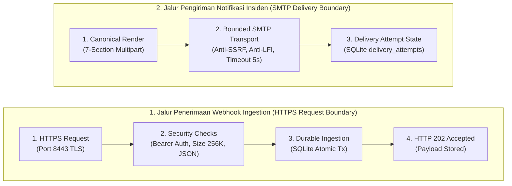
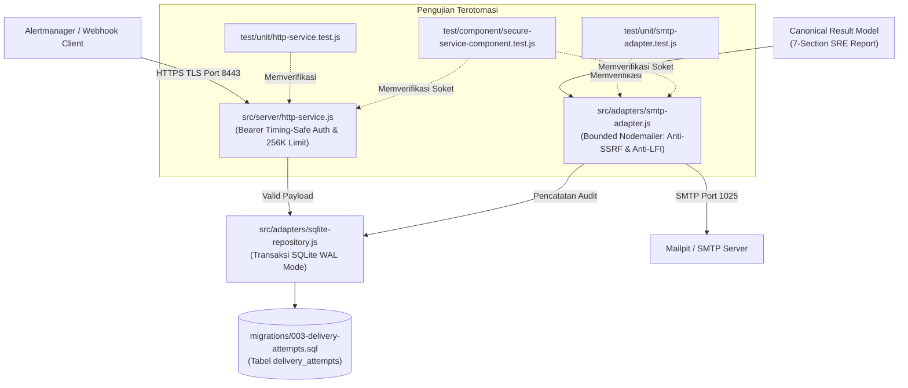

# TN-008 — Implement Secure Service and SMTP Delivery Boundaries

| Field | Value |
| --- | --- |
| Status | Completed |
| Activity Type | Implementation |
| Record Type | Live |
| Project | Tomcat Monitoring |
| Phase | Diagnostic MVP Pilot |
| Activity Date | 2026-08-31 |
| Recorded Date | 2026-08-31 |
| Owner | Project owner |
| Working Mode | Write |
| Authorization Status | Approved |
| Approved By | Project owner |
| Approval Date | 2026-08-31 |

## 🎯 Objective

Mengimplementasikan dan menguji antarmuka HTTPS webhook/health/metrics serta batasan pengiriman SMTP terbatas (*bounded SMTP delivery*) melalui pengujian komponen soket sementara sebelum pekerjaan pembuatan image dimulai.

**Target Utama & Kriteria Keberhasilan:**

1. **HTTPS Ingress & Security Boundaries:** Menyediakan server HTTPS native dengan autentikasi Bearer token waktu-konstan (`crypto.timingSafeEqual`), batas ukuran payload 256 KiB, validasi media type JSON, serta endpoint operasional `/health` dan `/metrics`.
2. **Bounded SMTP Egress:** Mengunci dependensi presisi `nodemailer@9.0.6` dengan *zero transitive dependencies*, menerapkan isolasi anti-LFI/anti-SSRF (`disableFileAccess: true`, `disableUrlAccess: true`), timeout soket 5000ms, skema migrasi `003-delivery-attempts.sql`, dan pencatatan riwayat pengiriman notifikasi multipart.
3. **Boundary:** Verifikasi komponen soket TLS/SMTP menggunakan sertifikat dan listener sementara (*ephemeral sockets*); tanpa runtime Mailpit persisten, container hidup jangka panjang, deployment, atau penyimpanan nilai rahasia (*secrets*) di Git.

## 🌍 Background

TN-007 menyelesaikan pemrosesan antrean *single worker*, pembentukan hasil diagnosis kanonikal, dan perenderan laporan insiden 7-seksi SRE. Sebelum menyatukan komponen menjadi runtime aplikasi utuh, tahap ini harus membangun batas keamanan penerimaan permintaan masuk (*HTTPS ingress boundary*) dari Alertmanager dan batas pengiriman notifikasi keluar (*SMTP egress boundary*) secara terisolasi serta membuktikannya melalui pengujian komponen soket sementara.

## 📚 Scope

Pekerjaan yang disetujui mencakup:
- Dependensi presisi Nodemailer dan skrip migrasi `003-delivery-attempts.sql`;
- Handler dan server HTTPS, autentikasi bearer waktu-konstan, batasan ukuran request 256 KiB, dan pemetaan respons kontrak;
- Adapter SMTP terbatas dengan proteksi anti-SSRF/LFI;
- Unit tests, component tests soket TLS/SMTP sementara, validator, README, dan dokumentasi *current-state*.

Pekerjaan yang dikecualikan mencakup build image, runtime Mailpit aktual, deployment, konfigurasi pemantauan Prometheus/Alertmanager, commit, dan push.

## 📋 Prerequisites

| Item | State |
| --- | --- |
| TN-007 source | Commit `1ea79fa`, tersinkronisasi dengan `origin/main` |
| Node runtime | Local image `localhost/nodejs:24.18.0` |
| Decision Baseline | TM-ADR-0013, TM-ADR-0014, TM-ADR-0015, TM-ADR-0016 accepted |
| Tests | Container sementara (*temporary container*), ephemeral TLS certs, dan mock SMTP listener |
| Implementation authorization | Approved 2026-08-31 |

## ⚖️ Execution Decision

Implementasi menegakkan [TM-ADR-0013](../../../../adr/tomcat-monitoring/adr-records/TM-ADR-0013.md) untuk minimalitas dependensi aplikasi, [TM-ADR-0014](../../../../adr/tomcat-monitoring/adr-records/TM-ADR-0014.md) dengan memastikan server dan transport SMTP hanya bertindak sebagai kanal notifikasi tanpa aksi remediasi otomatis, [TM-ADR-0015](../../../../adr/tomcat-monitoring/adr-records/TM-ADR-0015.md) untuk penerimaan webhook asinkron HTTP 202, dan [TM-ADR-0016](../../../../adr/tomcat-monitoring/adr-records/TM-ADR-0016.md) untuk pengiriman laporan insiden kanonikal via SMTP berbatas.

## 🔄 Technical Workflow

Alur teknis batas penerimaan permintaan HTTPS (*ingress*) dan pengiriman notifikasi email via SMTP (*egress*):



### Rincian Aktivitas Alur Kerja

#### 1. Jalur Penerimaan Permintaan Ingestion (HTTPS Request Boundary)

1. **HTTPS request:**
   Penerimaan koneksi masuk HTTPS pada port 8443 dengan enkripsi TLS internal menggunakan sertifikat server terverifikasi.
2. **security checks:**
   Pemeriksaan batas keamanan request sebelum pemrosesan:
    - **auth check:** Memvalidasi Bearer token menggunakan perbandingan waktu-konstan (`crypto.timingSafeEqual`) guna menangkal serangan *timing attack*.
    - **content check:** Memvalidasi header wajib `Content-Type: application/json`.
    - **size check:** Membatasi ukuran payload request maksimal 256 KiB (`413 Payload Too Large` jika terlampaui).
3. **durable ingestion:**
   Meneruskan payload yang valid ke modul ingestion SQLite untuk dipersistensikan secara atomik ke database lokal.
4. **202 accepted:**
   Mengembalikan respons HTTP `202 Accepted` kepada Alertmanager segera setelah transaksi database berhasil di-commit.

#### 2. Jalur Pengiriman Notifikasi Insiden (SMTP Delivery Boundary)

1. **canonical render:**
   Penerimaan laporan diagnosis 7-seksi SRE yang telah dirender dalam format multipart (HTML responsif dan Plain Text).
2. **bounded SMTP transport:**
   Pengiriman email notifikasi via SMTP (Nodemailer) dengan penegakan batasan keamanan:
    - **disableFileAccess:** Memblokir akses dan pelampiran file lokal (`disableFileAccess: true` - mitigasi LFI).
    - **disableUrlAccess:** Memblokir akses URL eksternal (`disableUrlAccess: true` - mitigasi SSRF).
    - **socket timeout:** Penerapan batas waktu timeout soket ketat (5000ms pada level koneksi, greeting, dan soket).
3. **delivery attempt state:**
   Pencatatan status hasil pengiriman pada tabel `delivery_attempts` (status `sent`, `failed`, kode error) dengan batas maksimal retry 3 kali (*exponential backoff*).

## 🧭 Implementation Plan

| Tahap | Rencana |
| :--- | :--- |
| **Pin the SMTP Client** | Mengunci dependensi presisi `nodemailer@9.0.6` dengan zero transitive dependencies pada container terisolasi. |
| **Implement Request and Delivery Boundaries** | Mengimplementasikan handler HTTPS aman, bearer auth timing-safe, batas ukuran 256 KiB, dan adapter SMTP terbatas. |
| **Run Source Tests** | Menjalankan validasi statis dan unit tests untuk membuktikan fungsi handler dan pesan multipart. |
| **Verify Ephemeral HTTPS and SMTP Sockets** | Menguji soket riil HTTPS dengan sertifikat sementara dan penerimaan pesan pada listener SMTP mock. |

## ⚙️ Implementation

<div class="procedure" markdown>
<div class="procedure-step" markdown>

### Pin the SMTP Client

```bash
podman run --rm --name tomcat-diagnostic-tn008-dependency --userns=keep-id \
  -v /home/eddywiyatno/git/tomcat-diagnostic-service:/app:Z -w /app \
  localhost/nodejs:24.18.0 npm install --save-exact nodemailer@9.0.6 \
  --ignore-scripts --no-audit --no-fund
```

!!! success "Expected Result"

    Dependensi presisi dan lockfile tersedia tanpa paket transitif (*zero transitive dependencies*).

**Actual Result:** Nodemailer `9.0.6` ditambahkan dengan nol dependensi transitif.

</div>
<div class="procedure-step" markdown>

### Implement Request and Delivery Boundaries

Skrip migrasi `003` menambahkan pencatatan riwayat pengiriman notifikasi (*notification attempts*). Handler HTTPS mengimplementasikan endpoint webhook, liveness, readiness, metrics, komparasi token bearer *constant-time*, validasi media type JSON, batas 256 KiB, dan kode respons kontrak. Adapter SMTP menonaktifkan akses berkas lokal dan URL serta menerapkan timeout pada level koneksi, greeting, dan socket.

!!! success "Expected Result"

    Batasan source terbentuk tanpa memuat nilai rahasia (*secrets*) atau endpoint environment hardcoded.

**Actual Result:** Berkas source dan unit fixtures tersedia; verifikasi level socket diselesaikan pada langkah pengujian komponen berikutnya.

</div>
<div class="procedure-step" markdown>

### Run Source Tests

```bash
./scripts/validate.sh
podman run --rm --name tomcat-diagnostic-tn008-node --userns=keep-id \
  -v /home/eddywiyatno/git/tomcat-diagnostic-service:/app:Z -w /app \
  localhost/nodejs:24.18.0 npm test
```

Validasi awal sempat gagal karena konfigurasi lock validator hanya mendaftarkan Ajv. Validator dikoreksi untuk mewajibkan Ajv dan Nodemailer secara presisi. Pengujian ulang meluluskan 25 pengujian.

!!! success "Expected Result"

    Pengujian existing dan pengujian baru batasan handler/MIME seluruhnya lulus.

**Actual Result:** 25 pengujian lulus, 0 gagal. Handler dipanggil secara langsung dan SMTP menggunakan stream transport; verifikasi komponen pada level socket dilakukan pada langkah berikutnya.

</div>
<div class="procedure-step" markdown>

### Verify Ephemeral HTTPS and SMTP Sockets

Sertifikat sementara dibuat hanya di bawah direktori yang disetujui:

```bash
test ! -e /tmp/tomcat-diagnostic-tn008-component
mkdir /tmp/tomcat-diagnostic-tn008-component
openssl req -x509 -newkey rsa:2048 -nodes -days 1 -subj /CN=localhost \
  -addext subjectAltName=DNS:localhost,IP:127.0.0.1 \
  -keyout /tmp/tomcat-diagnostic-tn008-component/server.key \
  -out /tmp/tomcat-diagnostic-tn008-component/server.crt
podman run --rm --name tomcat-diagnostic-tn008-component --userns=keep-id \
  -v /home/eddywiyatno/git/tomcat-diagnostic-service:/app:Z \
  -v /tmp/tomcat-diagnostic-tn008-component:/tmp/tn008-tls:ro,Z -w /app \
  -e TN008_TLS_KEY=/tmp/tn008-tls/server.key \
  -e TN008_TLS_CERT=/tmp/tn008-tls/server.crt \
  localhost/nodejs:24.18.0 npm run test:component
```

!!! success "Expected Result"

    Trusted CA berhasil terhubung, untrusted CA ditolak, endpoint HTTPS merespons dengan benar, dan listener SMTP tiruan menerima satu pesan multipart.

**Actual Result:** 2 pengujian komponen lulus. Pembersihan dilakukan secara presisi:

```bash
rm -r /tmp/tomcat-diagnostic-tn008-component
```

Pemeriksaan akhir memastikan direktori sementara telah dihapus dan tidak ada artefak `.key`, `.crt`, atau `.pem` yang tertinggal di repositori.

</div>
</div>

## 📁 Artifact Manifest

Bagian ini mencatat seluruh berkas (*artifacts*) pada repositori `tomcat-diagnostic-service` yang dibuat atau dimodifikasi selama aktivitas TN-008 untuk mengimplementasikan server HTTPS aman, adapter SMTP berbatas, dan pengujian soket sementara.

### Panduan Membaca Tabel

Tabel di bawah mengelompokkan berkas berdasarkan peran teknis dan lapisan (*layer*) arsitekturalnya:

- **Berkas (*Path*)**: Lokasi berkas relatif terhadap direktori utama (*root*) repositori `tomcat-diagnostic-service`.
- **Layer / Kategori**: Lapisan sistem dari komponen terkait (Tata Kelola, Dependensi, Basis Data, Server, Adapter, atau Pengujian Otomatis).
- **Status**: Status perubahan berkas dibandingkan kondisi baseline TN-007 (`Baru` = berkas baru dibuat; `Modifikasi` = berkas diperbarui).
- **Tanggung Jawab Teknis**: Peran fungsional berkas tersebut dalam penanganan request HTTPS, proteksi pengiriman email SMTP, dan pengujian komponen.

### Tabel Manifest Berkas

| Berkas (*Path*) | Layer / Kategori | Status | Tanggung Jawab Teknis |
| --- | --- | :---: | --- |
| `README.md` | Tata Kelola Repositori | Modifikasi | Memperbarui dokumentasi status implementasi batasan server HTTPS dan adapter SMTP. |
| `package.json`<br/>`package-lock.json` | Dependensi & Tooling | Modifikasi<br/>Modifikasi | Mengunci dependensi presisi `nodemailer@9.0.6` dengan *zero transitive dependencies* dan mendaftarkan skrip `npm run test:component`. |
| `scripts/validate.sh` | Tata Kelola Repositori | Modifikasi | Menambahkan aturan validasi lockfile untuk dependensi Nodemailer dan pemeriksaan skrip migrasi `003`. |
| `migrations/003-delivery-attempts.sql` | Basis Data (SQLite) | Baru | Skrip DDL migrasi untuk membuat tabel `delivery_attempts` guna mencatat audit jejak pengiriman email notifikasi. |
| `src/server/http-service.js` | Server / Antarmuka HTTPS | Baru | Handler server HTTPS: autentikasi Bearer waktu-konstan, batas payload 256 KiB, validasi media type, dan endpoint health/metrics. |
| `src/adapters/smtp-adapter.js` | Adapter Infrastruktur (SMTP) | Baru | Transport pengiriman SMTP Nodemailer terbatas dengan proteksi anti-LFI (`disableFileAccess`), anti-SSRF (`disableUrlAccess`), dan socket timeout 5s. |
| `src/adapters/sqlite-repository.js` | Adapter Infrastruktur (SQLite) | Modifikasi | Memperluas adapter repositori SQLite untuk mendukung pencatatan status dan percobaan pengiriman notifikasi ke database. |
| `test/unit/http-service.test.js` | Pengujian Otomatis (Unit) | Baru | Menguji handler HTTP: verifikasi bearer auth timing-safe, validasi JSON, batas payload 256 KiB, dan status health/metrics. |
| `test/unit/smtp-adapter.test.js` | Pengujian Otomatis (Unit) | Baru | Menguji pembuatan pesan multipart (Plain Text + HTML), headers MIME, dan penegakan opsi keamanan transport. |
| `test/component/secure-service-component.test.js` | Pengujian Otomatis (Komponen) | Baru | Menguji soket riil HTTPS dengan validasi sertifikat CA sementara dan pengiriman email ke listener SMTP tiruan (*mock server*). |

### Alur Keterkaitan Antar-Berkas

Diagram berikut mengilustrasikan bagaimana berkas-berkas di atas saling berinteraksi saat sebuah request HTTPS diterima dan email notifikasi dikirimkan:



## 🧪 Test Scenario Matrix

| Boundary | Scenarios |
| --- | --- |
| HTTPS Authentication | Bearer token valid diterima; invalid/missing token ditolak HTTP 401; timing-safe equality terbukti |
| Request Guard | Content-Type selain `application/json` ditolak HTTP 415; payload > 256 KiB ditolak HTTP 413 |
| Operational Endpoints | `GET /health` merespons status liveness/readiness; `GET /metrics` menghasilkan metrik Prometheus |
| SMTP Security | Transport menonaktifkan file attachment lokal (`disableFileAccess`) dan URL eksternal (`disableUrlAccess`) |
| SMTP Socket | Timeout soket koneksi, greeting, dan data terkonfigurasi 5000ms; penerimaan email multipart pada mock SMTP listener |
| Ephemeral TLS Socket | Koneksi dengan CA tepercaya berhasil; CA tidak tepercaya ditolak; sertifikat dibersihkan setelah pengujian |
| Regression | Seluruh 25 pengujian unit dan 2 pengujian komponen socket lulus |

## 🖥️ Commands Executed

Perintah kronologis ditampilkan pada prosedur implementasi. Source-control handoff diotorisasi setelah penutupan teknis:

```bash
git add README.md package.json package-lock.json scripts/validate.sh \
  migrations/003-delivery-attempts.sql src/adapters/sqlite-repository.js \
  src/adapters/smtp-adapter.js src/server/http-service.js \
  test/component/secure-service-component.test.js \
  test/unit/http-service.test.js test/unit/smtp-adapter.test.js
git diff --cached --check
git commit -m "feat(diagnostic-service): add secure service delivery boundaries"
```

Hasil aktual adalah commit `bc4b7ae`; push tidak dilakukan pada aktivitas ini.

## 🧭 Reproduction Guide

```bash
git checkout bc4b7ae
./scripts/validate.sh
podman run --rm --name tomcat-diagnostic-tn008-regression --userns=keep-id \
  -v /home/eddywiyatno/git/tomcat-diagnostic-service:/app:Z -w /app \
  localhost/nodejs:24.18.0 npm test
```

Hasil regresi yang diharapkan adalah 25 pengujian lulus. Reproduksi socket membutuhkan prosedur pembuatan sertifikat sementara di atas dan penghapusan direktori secara presisi setelahnya.

## ✅ Verification

| Layer | Actual result |
| --- | --- |
| Static validation | Passed |
| Unit/source integration | 25 passed |
| Actual HTTPS socket | Passed: trusted/untrusted CA and endpoints |
| Fake SMTP socket | Passed: multipart message received |
| Cleanup | Passed: direktori sementara dihapus; artefak sensitif 0 |

## 🧾 Outcome

Batasan source HTTPS dan SMTP telah diimplementasikan. 25 pengujian regresi dan 2 pengujian komponen socket sementara telah lulus tanpa menyimpan state persisten atau sertifikat di dalam repositori Git.

## ⏭️ Next Steps

Mendefinisikan kontrak konfigurasi dan startup aplikasi, kemudian menyiapkan pembuatan image dan verifikasi komponen sekali-pakai (*disposable component verification*) setelah identitas base image yang tidak dapat diubah disetujui.

## 🔗 Related Documentation

- [TN-007 — Implement Worker, Canonical Result, and Renderers](TN-007-implement-worker-canonical-result-and-renderers.md)
- [TN-009 — Implement Application Configuration and Startup Lifecycle](TN-009-implement-application-configuration-and-startup-lifecycle.md)
- [Alertmanager Webhook Contract](../../diagnostic-mvp/alertmanager-webhook-contract.md)
- [Notification and Integration Contract](../../diagnostic-mvp/notification-and-integration-contract.md)
- [Non-Functional and Security Contract](../../diagnostic-mvp/non-functional-and-security-contract.md)
- [TM-ADR-0013 — Use Built-in node:sqlite for MVP Local Persistence](../../../../adr/tomcat-monitoring/adr-records/TM-ADR-0013.md)
- [TM-ADR-0014 — Enforce Zero Automatic Remediation for Diagnostic Service](../../../../adr/tomcat-monitoring/adr-records/TM-ADR-0014.md)
- [TM-ADR-0015 — Adopt Asynchronous Webhook Ingestion with Durable SQLite Acceptance Pattern](../../../../adr/tomcat-monitoring/adr-records/TM-ADR-0015.md)
- [TM-ADR-0016 — Designate Diagnostic Service as Canonical Incident Notification Authority](../../../../adr/tomcat-monitoring/adr-records/TM-ADR-0016.md)
- [TM-ADR-0017 — Adopt Vertical Slice Minimum Viable Product Scoping for Diagnostic Pilot](../../../../adr/tomcat-monitoring/adr-records/TM-ADR-0017.md)
