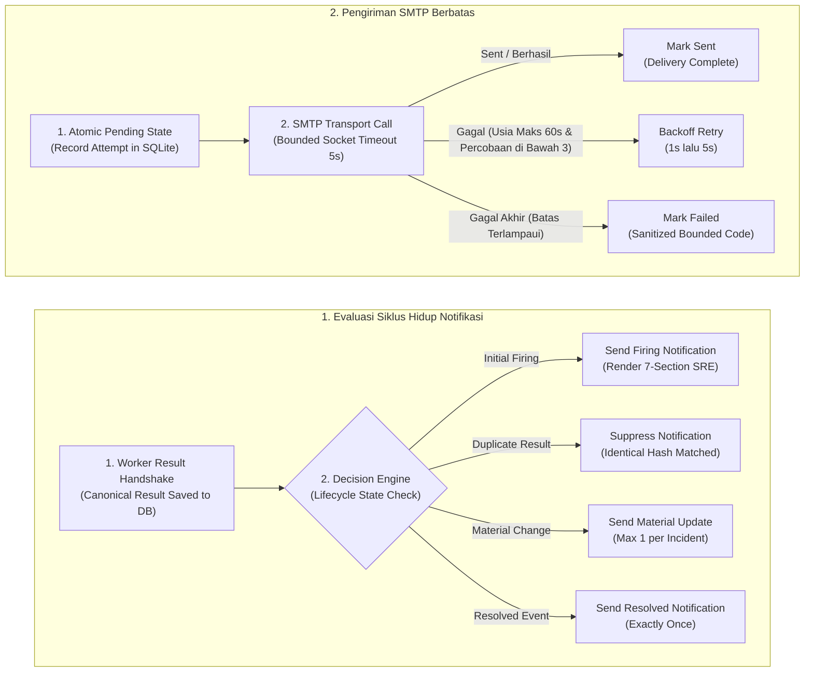
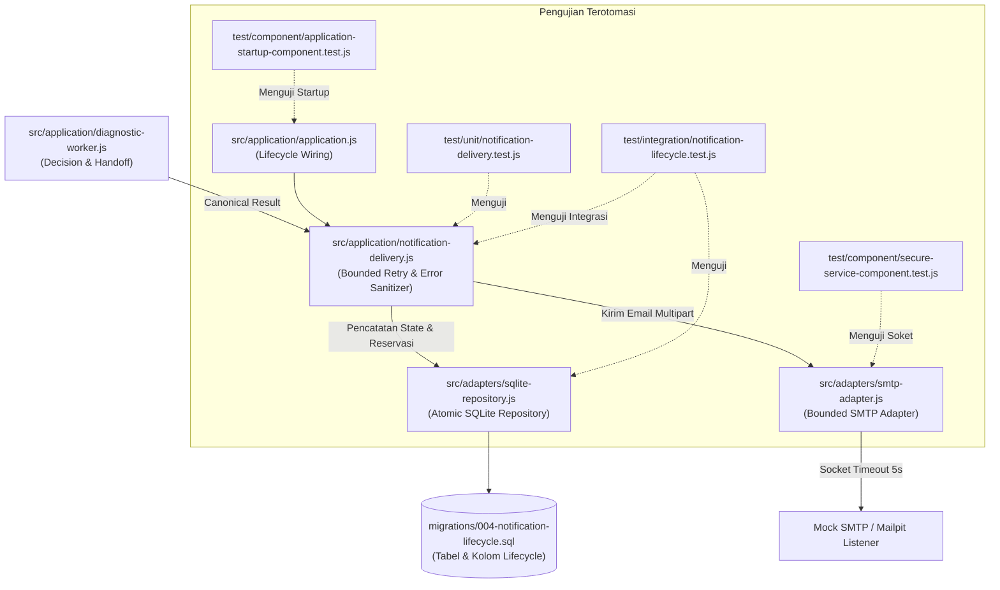

# TN-012 — Implement Bounded Notification Delivery Orchestration

| Field | Value |
| --- | --- |
| Status | Completed |
| Activity Type | Implementation |
| Record Type | Live |
| Project | Tomcat Monitoring |
| Phase | Diagnostic MVP Pilot |
| Activity Date | 2026-09-01 |
| Recorded Date | 2026-09-01 |
| Owner | Project owner |
| Working Mode | Mixed |
| Authorization Status | Approved |
| Approved By | Project owner |
| Approval Date | 2026-09-01 |

## 🎯 Objective

Menghubungkan hasil diagnosis kanonikal (*canonical result*) ke perender laporan insiden dan adapter SMTP dengan orkestrasi siklus hidup notifikasi (*notification lifecycle*), persistensi state sebelum pengiriman, serta mekanisme percobaan ulang berbatas (*bounded retry*) yang dapat diuji.

**Target Utama & Kriteria Keberhasilan:**

1. **Notification Lifecycle & Delivery Policies:** Mengimplementasikan orkestrasi notifikasi: pengiriman initial *firing* tepat sekali, penekanan alert duplikat (*identical-result suppression*), pembatasan pembaruan material (*maximum one material update*), pengiriman notifikasi pemulihan (*exactly one resolved notification*), serta penanganan resolved tanpa context firing sebelumnya.
2. **Bounded Retry & Sanitized Error Code:** Menerapkan kebijakan retry berbatas maksimal 3 percobaan dengan interval backoff (1s dan 5s), batas usia notifikasi (*maximum age* 60 detik), sanitasi kode kesalahan SMTP menjadi representasi bounded error, dan pencatatan state transisi atomik (`pending`, `sent`, `failed`) pada skema migrasi `004-notification-lifecycle.sql`.
3. **Queue & Persistence Invariant:** Mempertahankan arsitektur *single work queue* (kapasitas 50) tanpa membuat queue atau thread pengiriman kedua, serta menegakkan invariansi persistensi di mana *canonical result* wajib tersimpan ke SQLite sebelum upaya pengiriman SMTP dieksekusi.
4. **Boundary:** Verifikasi komponen soket menggunakan kontainer pengujian sementara (`tomcat-diagnostic-tn012-test`) dengan flag `--rm` dan digest Node.js tetap; tanpa build image baru, runtime Mailpit aktual, named volume persisten, deployment, atau penyimpanan rahasia di Git.

## 🌍 Background

TN-011 menetapkan runtime contract dan menemukan bahwa renderer, SMTP adapter, serta tabel `notification_attempts` tersedia tetapi belum terhubung ke worker. GAP-010 belum menetapkan retry; GAP-016 memblokir Mailpit multi-component test.

## 📚 Scope

Scope yang disetujui meliputi source, schema bila diperlukan, unit/integration/component tests, validator, README, current-state documentation, dan live journal. Policy yang diterima: maksimal tiga attempts, backoff 1 dan 5 detik, maximum age 60 detik, serta existing work queue berkapasitas 50 tanpa queue kedua.

Verification memakai exact ephemeral container `tomcat-diagnostic-tn012-test`, immutable Node.js base, dan `--rm`. Tidak ada image build, Mailpit runtime, network, volume, deployment, commit, atau push. Disposable multi-component runtime dipindahkan ke TN-013.

## 📋 Prerequisites

| Item | State |
| --- | --- |
| Diagnostic Service baseline | `3c81a30`, clean, aligned with `origin/main` |
| Handbook baseline | `7ffaff4`, clean, aligned with `origin/main` |
| Decision Baseline | TM-ADR-0013, TM-ADR-0014, TM-ADR-0015, TM-ADR-0016, TM-ADR-0017 accepted |
| Renderer, SMTP adapter, migration 003 | Tersedia |
| Retry policy | Disetujui 2026-09-01 (Maks 3 attempts, backoff 1s/5s, max age 60s) |
| Test runtime | Immutable Node.js digest (`localhost/nodejs@sha256:76b1444d507be3398f3196f37bd20f7a97a703871ed2716fa91a1a9520fc482d`) |
| Runtime/cleanup authorization | Exact test container dan `--rm` disetujui |

## ⚖️ Execution Decision

Implementasi menegakkan [TM-ADR-0013](../../../../adr/tomcat-monitoring/adr-records/TM-ADR-0013.md) untuk isolasi persistensi `node:sqlite` dan integritas transaksi migrasi skema `004`, [TM-ADR-0014](../../../../adr/tomcat-monitoring/adr-records/TM-ADR-0014.md) dengan menjamin notifikasi murni bersifat informatif tanpa remediasi otomatis (*Zero Automatic Remediation*), [TM-ADR-0015](../../../../adr/tomcat-monitoring/adr-records/TM-ADR-0015.md) untuk pemrosesan durable work queue tunggal tanpa antrean sekunder (*no-second-queue invariant*), [TM-ADR-0016](../../../../adr/tomcat-monitoring/adr-records/TM-ADR-0016.md) untuk kepatuhan siklus hidup otoritas notifikasi kanonikal (*firing*, *material update*, *resolved*), serta [TM-ADR-0017](../../../../adr/tomcat-monitoring/adr-records/TM-ADR-0017.md) untuk pengujian komponen terisolasi tanpa deployment dini.

## 🔄 Technical Workflow

Alur teknis orkestrasi siklus hidup notifikasi, evaluasi pembaruan material/pemulihan, dan pengiriman email SMTP berbatas (*bounded retry*):



### Rincian Aktivitas Alur Kerja

#### 1. Evaluasi Siklus Hidup Notifikasi (Notification Lifecycle Decision)

1. **Worker Result Handshake:**
   Worker menyelesaikan diagnosa dan menyimpan *canonical result* ke database SQLite terlebih dahulu (`result-before-delivery persistence`).
2. **Decision Engine:**
   Mengevaluasi status insiden berdasarkan riwayat pada database:
   - **Initial Firing:** Mengirimkan email notifikasi insiden pertama kali dengan laporan 7-seksi SRE lengkap.
   - **Duplicate Result:** Menekan pengiriman email (*suppressed*) apabila hash hasil diagnosa identik dengan notifikasi yang telah terkirim sebelumnya.
   - **Material Change:** Mengizinkan pembaruan laporan insiden maksimal 1 kali jika terdapat perubahan akar masalah (*root cause*) atau keparahan (*severity*).
   - **Resolved Event:** Mengirimkan notifikasi pemulihan tepat 1 kali (*exactly-one resolved*) dengan memanfaatkan konteks insiden firing sebelumnya.

#### 2. Pengiriman SMTP Berbatas (Bounded Retry & Sanitized Error)

1. **Atomic Pending State:**
   Mencatat percobaan pengiriman dengan status `pending` pada tabel database SQLite secara atomik sebelum membuka koneksi soket SMTP.
2. **SMTP Transport Call:**
   Mengirimkan pesan email multipart (HTML + Plain Text) melalui adapter SMTP Nodemailer berbatas dengan timeout soket 5000ms.
3. **Delivery Outcome & Retry Handling:**
   - **Success:** Status diperbarui menjadi `sent` dan waktu pengiriman dicatat.
   - **Backoff Retry:** Jika pengiriman gagal dan usia notifikasi masih $\le 60$ detik serta percobaan $< 3$, lakukan retry dengan jeda backoff (1 detik pada percobaan ke-2, 5 detik pada percobaan ke-3).
   - **Final Failure:** Jika batas percobaan terlampaui, status ditandai `failed` dengan kode kesalahan yang telah disanitasi (*sanitized bounded error code*).

## 🧭 Implementation Plan

| Tahap | Rencana |
| --- | --- |
| **Catat Baseline** | Catat source, contract, authorization, gap, dan failed discovery. |
| **Implementasikan Notification Lifecycle** | Tambahkan decision, persistence, renderer/SMTP wiring, retry, dan metrics. |
| **Verifikasi Source dan Socket** | Jalankan validator, regression, component tests, dan exact cleanup check. |
| **Konsolidasikan Dokumentasi** | Perbarui README, contract, gap/traceability, current state, navigation, dan TN. |

## ⚙️ Implementation

<div class="procedure" markdown>

<div class="procedure-step" markdown>

### Catat Baseline

Command material yang telah dijalankan:

```bash
git status --short --branch
git log -2 --oneline --decorate
sed -n '/^## 🧾 Outcome/,$p' docs/projects/tomcat-monitoring/engineering-journal/diagnostic-mvp-pilot/TN-011-define-diagnostic-service-runtime-configuration-contract.md
rg -n 'GAP-010|GAP-016|retry|notification|TN-012|TN-013' docs/projects/tomcat-monitoring/diagnostic-mvp docs/projects/tomcat-monitoring/engineering-journal/diagnostic-mvp-pilot
rg --files src test migrations config
rg -n 'render|material_update|notification_attempt|recordNotificationAttempt|reserveMaterialUpdate|lifecycleStatus|resultHash' src test migrations config
```

Review juga memakai `sed` pada application, worker, repository, renderer,
SMTP adapter, migrations, schema, tests, serta notification/rule contracts.

**Actual Result:** Baseline dan gap terpetakan. `saveCanonicalResult()` belum
mengembalikan result ID; lifecycle notification dan retry belum tersedia.

!!! success "Expected Result"

    Implementation dimulai dari exact baseline dan accepted policy.

</div>

<div class="procedure-step" markdown>

### Implementasikan Notification Lifecycle

Perubahan manual memakai `apply_patch`. Implementasi menambahkan coordinator
retry, wiring application/worker, result-ID handoff, lookup firing result,
attempt transition, atomic material/resolved reservation, migration 004,
metrics, serta unit/integration/socket scenarios.

Review setelah test awal menemukan duplicate resolved dengan `endsAt` berbeda
masih dapat mengirim ulang. Resolution menambahkan
`resolved_notification_count` dan atomic reservation; migration expectations
serta image-static checks diperbarui.

**Actual Result:** Initial firing, satu material update, exactly one resolved,
resolved tanpa firing, bounded retry, sanitized error code, dan result-before-
delivery persistence diimplementasikan tanpa dependency atau queue baru.

!!! success "Expected Result"

    Source mengirim notification sesuai lifecycle dan merekam retry bounded.

</div>

<div class="procedure-step" markdown>

### Verifikasi Source dan Socket

Static checks dijalankan berulang setelah source berubah:

```bash
bash -n scripts/*.sh
./scripts/validate.sh
git diff --check
```

Regression dan component command memakai exact container yang sama:

```bash
test ! "$(podman ps -aq --filter name=^tomcat-diagnostic-tn012-test$)" && \
podman run --rm --name tomcat-diagnostic-tn012-test --userns=keep-id \
  -v /home/eddywiyatno/git/tomcat-diagnostic-service:/app:Z -w /app \
  localhost/nodejs@sha256:76b1444d507be3398f3196f37bd20f7a97a703871ed2716fa91a1a9520fc482d \
  npm test && \
test ! "$(podman ps -aq --filter name=^tomcat-diagnostic-tn012-test$)"

test ! "$(podman ps -aq --filter name=^tomcat-diagnostic-tn012-test$)" && \
podman run --rm --name tomcat-diagnostic-tn012-test --userns=keep-id \
  -v /home/eddywiyatno/git/tomcat-diagnostic-service:/app:Z -w /app \
  localhost/nodejs@sha256:76b1444d507be3398f3196f37bd20f7a97a703871ed2716fa91a1a9520fc482d \
  npm run test:component && \
test ! "$(podman ps -aq --filter name=^tomcat-diagnostic-tn012-test$)"
```

**Actual Result:** Final regression 36 passed, 0 failed/skipped. Component
suite 2 passed dan 2 skipped; skip adalah TLS/config scenarios lama yang
memerlukan external certificate fixture. SMTP adapter socket dan new complete
worker-to-SMTP socket scenario passed. Exact container absent setelah setiap
`--rm`.

Final source verification diulang pada 2026-09-02 terhadap working tree yang
sama. Bash/static checks, 36 regression tests, 2 SMTP component scenarios, dan
exact cleanup kembali menghasilkan result yang sama; dua external-fixture
scenarios tetap terlihat sebagai skipped.

!!! success "Expected Result"

    Static validation, regression, socket component, dan cleanup lulus.

</div>

<div class="procedure-step" markdown>

### Konsolidasikan Dokumentasi

README, runtime/notification contracts, gap register, traceability,
current-state pages, phase navigation, dan TN-012 diperbarui dengan
`apply_patch`. Runtime resource prefix berpindah dari TN-012 ke TN-013.

**Actual Result:** GAP-010 dan GAP-016 ditutup berdasarkan source/socket
evidence. TN-010 image dinyatakan stale terhadap TN-012 source; rebuilt image,
Mailpit, dan runtime tetap tidak diklaim.

!!! success "Expected Result"

    Current state, gaps, evidence, dan next runtime boundary konsisten.

</div>

</div>

## 🛠️ Troubleshooting

| Attempt | Actual result | Resolution |
| --- | --- | --- |
| Membaca `src/presentation/diagnostic-renderer.js` | Path tidak ada | Renderer ditemukan di `src/application/result-renderer.js` |
| Menjalankan `node --version` pada host | `node` tidak tersedia | Test akan memakai immutable Node.js container |
| Inspect image Node.js dalam sandbox | Podman metadata read-only | Gunakan authorized container execution saat verification |
| Regression Podman pertama dalam sandbox | Sticky-bit metadata gagal pada read-only runtime path | Rerun authorized di luar restricted sandbox; 36 tests passed |
| Component run pertama | SMTP passed; dua TLS/config tests skipped | Tambahkan worker-to-SMTP socket scenario; final 2 passed, 2 fixture-dependent skipped |
| Lifecycle review setelah test | Resolved event berbeda dapat mengirim lebih dari sekali | Tambahkan migration 004 dan atomic resolved reservation; rerun passed |

## ⚙️ Commands Executed

Command aktual ditempatkan pada procedure sesuai chronology. Tidak ada command
yang menulis source; perubahan memakai `apply_patch`. Podman commands hanya
membuat exact ephemeral test container dengan automatic `--rm`.

## 📁 Artifact Manifest

Bagian ini mencatat seluruh berkas (*artifacts*) pada repositori `tomcat-diagnostic-service` yang dibuat atau dimodifikasi selama aktivitas TN-012 untuk mengimplementasikan siklus hidup notifikasi, bounded retry, persistensi status pengiriman, dan pengujian soket SMTP terintegrasi.

### Panduan Membaca Tabel

Tabel di bawah mengelompokkan berkas berdasarkan peran teknis dan lapisan (*layer*) arsitekturalnya:

- **Berkas (*Path*)**: Lokasi berkas relatif terhadap direktori utama (*root*) repositori `tomcat-diagnostic-service`.
- **Layer / Kategori**: Lapisan sistem dari komponen terkait (Tata Kelola, Otomasi & Tooling, Basis Data, Aplikasi & Worker, Adapter, atau Pengujian Otomatis).
- **Status**: Status perubahan berkas dibandingkan kondisi baseline TN-011 (`Baru` = berkas baru dibuat; `Modifikasi` = berkas diperbarui).
- **Tanggung Jawab Teknis**: Peran fungsional berkas tersebut dalam orkestrasi notifikasi, kebijakan retry, migrasi DDL, dan pengujian komponen.

### Tabel Manifest Berkas

| Berkas (*Path*) | Layer / Kategori | Status | Tanggung Jawab Teknis |
| --- | --- | :---: | --- |
| `README.md` | Tata Kelola Repositori | Modifikasi | Memperbarui dokumentasi status siklus hidup notifikasi, kebijakan bounded retry, dan batasan worker. |
| `scripts/validate.sh` | Tata Kelola Repositori | Modifikasi | Menambahkan aturan validasi integritas skema migrasi `004` dan dependensi modul pengiriman notifikasi. |
| `scripts/test-image.sh` | Otomasi & Tooling | Modifikasi | Memperbarui ekspektasi skrip pengujian image terhadap skema migrasi database baru. |
| `migrations/004-notification-lifecycle.sql` | Basis Data (SQLite) | Baru | Skrip migrasi DDL untuk kolom `resolved_notification_count` dan pelacakan state notifikasi pemulihan. |
| `src/application/notification-delivery.js` | Aplikasi & Orkestrasi Notifikasi | Baru | Koordinator pengiriman: implementasi retry berbatas (3 attempts, backoff 1s/5s, max age 60s), sanitasi error code, dan metrik. |
| `src/application/diagnostic-worker.js` | Aplikasi & Worker | Modifikasi | Menghubungkan keputusan firing/material/resolved, perenderan hasil, dan handoff ke modul pengiriman notifikasi. |
| `src/application/application.js` | Aplikasi & Orkestrasi Lifecycle | Modifikasi | Menghubungkan konfigurasi SMTP dan inisialisasi koordinator notifikasi ke dalam lifecycle aplikasi. |
| `src/adapters/sqlite-repository.js` | Adapter Infrastruktur (SQLite) | Modifikasi | Menambahkan fungsi pengembalian result ID, pencarian riwayat firing, transisi state percobaan, dan reservasi atomik. |
| `test/unit/notification-delivery.test.js` | Pengujian Otomatis (Unit) | Baru | Menguji kebijakan retry berbatas, penghentian retry berdasarkan batas usia max, dan sanitasi kode error SMTP. |
| `test/integration/notification-lifecycle.test.js` | Pengujian Otomatis (Integrasi) | Baru | Menguji skenario lifecycle: initial firing, penekanan duplikat, material update max 1x, dan exactly-one resolved. |
| `test/component/secure-service-component.test.js` | Pengujian Otomatis (Komponen) | Modifikasi | Menambahkan skenario pengujian soket SMTP terintegrasi dari worker ke database dan listener SMTP tiruan. |
| `test/component/application-startup-component.test.js` | Pengujian Otomatis (Komponen) | Modifikasi | Menyesuaikan ekspektasi komponen startup terhadap 4 skrip migrasi database. |
| `test/component/image-runtime-database-probe.js` | Pengujian Otomatis (Komponen) | Modifikasi | Memperbarui probe database runtime terhadap skema migrasi `004`. |

### Alur Keterkaitan Antar-Berkas

Diagram berikut mengilustrasikan keterkaitan struktural dan interaksi pengujian antar-komponen aplikasi pada implementasi TN-012:



## 🧪 Test-Scenario Matrix

| Scenario | Layer | Actual result |
| --- | --- | --- |
| Three attempts with 1/5-second backoff | Unit | Passed |
| Maximum age stops an ineligible retry | Unit | Passed |
| SMTP error is reduced to bounded code | Unit | Passed |
| Initial firing and identical-result suppression | Integration | Passed |
| Maximum one material update | Integration | Passed |
| Exactly one resolved notification | Integration | Passed after migration 004 resolution |
| Resolved without stored firing | Integration | Passed; explicit undetermined result |
| Attempt persistence and queue completion | Integration | Passed |
| SMTP adapter actual socket | Socket component | Passed |
| Worker → SQLite → renderer → SMTP socket | Socket component | Passed |
| Existing TLS/config component fixtures | Socket component | 2 skipped; external fixtures not supplied |
| Mailpit, image, dan persistent runtime | Runtime | Not run; excluded |

## ✅ Verification

| Method | Expected result | Actual result | Evidence |
| --- | --- | --- | --- |
| `./scripts/validate.sh` | Source/dependency/migration boundary konsisten | Passed | Validator output |
| `bash -n scripts/*.sh` | Seluruh Bash valid | Passed | Exit `0` |
| `npm test` via immutable container | Seluruh regression lulus | 36 passed, 0 failed/skipped | Node test output |
| `npm run test:component` via immutable container | SMTP scenarios lulus; unavailable fixtures terlihat | 2 passed, 2 skipped | Node test output |
| Exact cleanup check | Container absent | Passed | `podman ps -aq` dan final `test !` |
| Documentation checks | Diff, heading, link, navigation, whitespace valid | Passed; MkDocs CLI verified via venv |

## 🖥️ Source-Control Handoff

Setelah technical closure, project owner memberikan authorization terpisah untuk commit. Staging memakai exact TN-012 source manifest, lalu dijalankan:

```bash
git diff --cached --check
git commit -m "feat(diagnostic-service): add bounded notification delivery"
```

**Actual Result:** Source commit `84c42c1`. Push tidak dilakukan.

## 🧹 Cleanup Evidence

`tomcat-diagnostic-tn012-test` dibuat hanya oleh `podman run --rm` dan absent setelah setiap failed/successful command. Tidak ada network, named volume, host temporary directory, certificate, database, atau image baru. Final read-only cleanup query menghasilkan `container_absent=true`.

## 🧭 Reproduction Boundary

Source baseline adalah `3c81a30` dan final TN-012 commit adalah `84c42c1`. Reproduction memerlukan commit tersebut, immutable Node.js digest, dan commands di atas. TN-010 image tidak memuat TN-012 source; image/Mailpit/runtime reproduction menjadi TN-013.

## 🧾 Outcome

Notification lifecycle dan bounded retry diimplementasikan dengan result-before-delivery persistence, maximum one material update, exactly one resolved notification, sanitized attempt state, serta no-second-queue boundary. Static/Bash checks, 36 regression tests, dan 2 SMTP socket component tests lulus. Dua TLS/config component scenarios tidak dijalankan karena external fixtures tidak tersedia. Exact container dibersihkan; image, Mailpit, dan persistent runtime tidak dibuat. Source telah dicommit sebagai `84c42c1`; push tidak dilakukan.

## ⏭️ Next Steps

Siapkan approved TN-013 untuk rebuild image dari exact TN-012 revision dan disposable Diagnostic Service–Mailpit verification. Persistent deployment dan actual Alertmanager route tetap memerlukan scope terpisah.

## 🔗 Related Documentation

- [TN-011 — Define Diagnostic Service Runtime Configuration Contract](TN-011-define-diagnostic-service-runtime-configuration-contract.md)
- [TN-013 — Rebuild and Verify Diagnostic Service–Mailpit Runtime](TN-013-rebuild-and-verify-diagnostic-service-mailpit-runtime.md)
- [Notification and Integration Contract](../../diagnostic-mvp/notification-and-integration-contract.md)
- [Runtime Configuration and Verification Contract](../../diagnostic-mvp/runtime-configuration-and-verification-contract.md)
- [Gap Register](../../diagnostic-mvp/gap-register.md)
- [Non-Functional and Security Contract](../../diagnostic-mvp/non-functional-and-security-contract.md)
- [SQLite Lifecycle Contract](../../diagnostic-mvp/sqlite-lifecycle-contract.md)
- [TM-ADR-0013 — Use Built-in node:sqlite for MVP Local Persistence](../../../../adr/tomcat-monitoring/adr-records/TM-ADR-0013.md)
- [TM-ADR-0014 — Enforce Zero Automatic Remediation for Diagnostic Service](../../../../adr/tomcat-monitoring/adr-records/TM-ADR-0014.md)
- [TM-ADR-0015 — Adopt Asynchronous Webhook Ingestion with Durable SQLite Acceptance Pattern](../../../../adr/tomcat-monitoring/adr-records/TM-ADR-0015.md)
- [TM-ADR-0016 — Designate Diagnostic Service as Canonical Incident Notification Authority](../../../../adr/tomcat-monitoring/adr-records/TM-ADR-0016.md)
- [TM-ADR-0017 — Adopt Vertical Slice Minimum Viable Product Scoping for Diagnostic Pilot](../../../../adr/tomcat-monitoring/adr-records/TM-ADR-0017.md)
