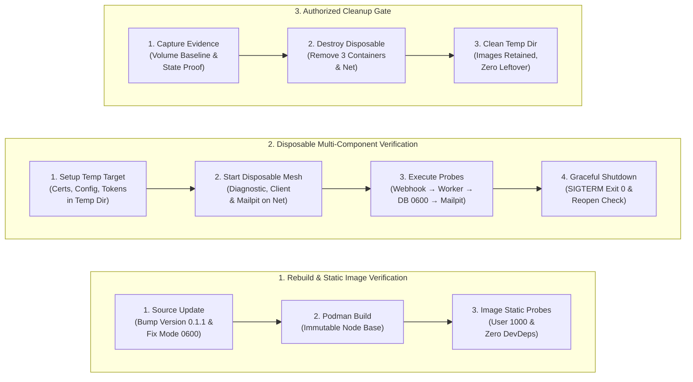
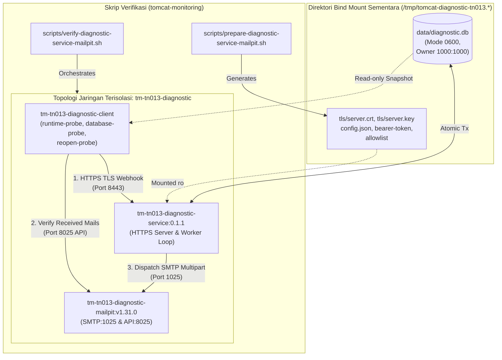

# TN-013 — Rebuild and Verify Diagnostic Service–Mailpit Runtime

| Field | Value |
| --- | --- |
| Status | Completed |
| Activity Type | Implementation and Verification |
| Record Type | Live |
| Project | Tomcat Monitoring |
| Phase | Diagnostic MVP Pilot |
| Activity Date | 2026-09-02 |
| Recorded Date | 2026-09-02 |
| Owner | Project owner |
| Working Mode | Mixed |
| Authorization Status | Source, build, runtime, replacement, and cleanup approved/executed |
| Approved By | Project owner |
| Approval Date | 2026-09-02 |

## 🎯 Objective

Membangun ulang image aplikasi Diagnostic Service dari source TN-012 sebagai versi baru (`0.1.1`) berbasis immutable Node.js digest dan membuktikan aliran *end-to-end* HTTPS-ke-SQLite-ke-SMTP menggunakan topologi pengujian sekali-pakai (*disposable runtime*) bersama Mailpit aktual tanpa membuat deployment persisten.

**Target Utama & Kriteria Keberhasilan:**

1. **Versioned Rebuild & Image Contract:** Memperbarui identitas versi aplikasi menjadi `0.1.1`, membangun ulang image lokal OCI/Docker dari base Node.js yang tidak dapat diubah (`sha256:76b1444d...`), dan memverifikasi integritas image statis (non-root user `1000:1000`, zero devDependencies, working directory `/app`, default command valid).
2. **Disposable Multi-Component Verification:** Mengorkestrasi topologi 3 kontainer sementara pada jaringan internal terisolasi (`tm-tn013-diagnostic`):
   - *Diagnostic Service Container (`0.1.1`):* Listener HTTPS (port 8443) dengan otentikasi Bearer, worker loop, dan adapter SMTP.
   - *Client Probe Container:* Pengujian handoff alert firing/duplicate/resolved, verifikasi sertifikat CA, pemeriksaan endpoint `/health` & `/metrics`, serta pembuktian snapshot SQLite.
   - *Mailpit SMTP Container (`v1.31.0`):* Penerimaan email notifikasi multipart kanonikal (Plain Text & HTML).
3. **Database Mode & Reopen Verification:** Menegakkan mode izin berkas database SQLite secara presisi (`0600` dengan kepemilikan `1000:1000`) saat pembuatan awal dan pembukaan ulang (*reopen*), serta memverifikasi status kesiapan (*readiness*) aplikasi setelah proses reopen.
4. **Boundary:** Seluruh kontainer berjalan tanpa publikasi port ke host (*no host port publishing*), tanpa restart policy (`no`), tanpa named volume, dan menggunakan direktori bind sementara (`/tmp/tomcat-diagnostic-tn013.pRPWNF`) yang dibersihkan total setelah otorisasi pengujian selesai.

## 🌍 Background

TN-012 menyelesaikan notification orchestration pada source commit `84c42c1`, tetapi image TN-010 masih berasal dari source lama dan belum memuat perubahan tersebut. Runtime contract TN-011 menyerahkan rebuild serta disposable multi-component verification kepada TN-013.

## 📚 Scope

Scope yang disetujui meliputi metadata patch version, integration verifier, validator/README terkait, live journal, static/source validation, local image build/test, dan pembuatan exact temporary directory. Disposable runtime hanya boleh berjalan setelah manifest exact memperoleh authorization berikutnya.

Persistent container, named volume, host port, deployment, actual Alertmanager route, image removal, commit, dan push tidak termasuk. Destructive cleanup memerlukan authorization terpisah setelah exact target tersedia.

## 📋 Prerequisites

| Item | State |
| --- | --- |
| Diagnostic Service baseline | Clean dan sinkron `origin/main` pada `84c42c1` |
| Handbook baseline | Clean dan sinkron `origin/main` pada `db2ade2` |
| Integration repository baseline | Clean dan sinkron `origin/main` pada `a672434` |
| Decision Baseline | TM-ADR-0013, TM-ADR-0014, TM-ADR-0015, TM-ADR-0016, TM-ADR-0017 accepted |
| TN-012 source verification | 36 regression dan 2 SMTP socket component tests passed |
| Immutable Node.js base | Accepted digest `sha256:76b1444d507be3398f3196f37bd20f7a97a703871ed2716fa91a1a9520fc482d` |
| Mailpit image | Accepted `v1.31.0` manifest digest dari runtime contract |
| Runtime contract | TN-011/current-state contract accepted |
| Current authorization | Source/docs edits, static validation, image build/test, dan temp directory approved |

## ⚖️ Execution Decision

Implementasi menegakkan [TM-ADR-0013](../../../../adr/tomcat-monitoring/adr-records/TM-ADR-0013.md) untuk penegakan isolasi persistensi `node:sqlite` dengan mode izin ketat `0600`, [TM-ADR-0014](../../../../adr/tomcat-monitoring/adr-records/TM-ADR-0014.md) dengan memastikan verifikasi runtime tidak melibatkan aksi remediasi otomatis (*Zero Automatic Remediation*), [TM-ADR-0015](../../../../adr/tomcat-monitoring/adr-records/TM-ADR-0015.md) untuk konsistensi penerimaan webhook asinkron dan persistensi antrean kerja, [TM-ADR-0016](../../../../adr/tomcat-monitoring/adr-records/TM-ADR-0016.md) untuk pembuktian pengiriman notifikasi multipart kanonikal ke Mailpit aktual, serta [TM-ADR-0017](../../../../adr/tomcat-monitoring/adr-records/TM-ADR-0017.md) untuk verifikasi multi-komponen sekali-pakai (*disposable vertical slice verification*) tanpa membuat deployment permanen.

## 🔄 Technical Workflow

Alur teknis pembangunan image aplikasi, orkestrasi pengujian multi-komponen disposable, dan sekuens pembersihan terotorisasi:



### Rincian Aktivitas Alur Kerja

#### 1. Pembangunan Image & Verifikasi Statis (Rebuild & Static Image Verification)

1. **Source Update:**
   Menaikkan versi aplikasi menjadi `0.1.1` pada `VERSION`, `package.json`, dan `package-lock.json`, serta memperbaiki adapter repositori SQLite untuk menegakkan permission mode berkas `0600` pada pembuatan awal dan reopen.
2. **Podman Build:**
   Membangun image lokal `localhost/tomcat-diagnostic-service:0.1.1` berbasis digest Node.js tetap (`localhost/nodejs@sha256:76b1444d...`) secara deterministik.
3. **Image Static Probes:**
   Memverifikasi kepatuhan atribut image: user non-root `node` (`1000:1000`), working directory `/app`, label OCI versi `0.1.1`, dan eliminasi seluruh paket devDependencies.

#### 2. Orkestrasi Pengujian Multi-Komponen Sekali-Pakai (Disposable Multi-Component Verification)

1. **Setup Temp Target:**
   Membuat direktori kerja sementara (`/tmp/tomcat-diagnostic-tn013.XXXXXX`) untuk menampung sertifikat TLS ephemeral, konfigurasi aplikasi JSON, allowlist, dan token bearer.
2. **Start Disposable Mesh:**
   Menjalankan 3 kontainer pada jaringan internal `tm-tn013-diagnostic`:
   - `tm-tn013-diagnostic-service`: Layanan diagnosa utama.
   - `tm-tn013-diagnostic-client`: Runner skrip pengujian/probe client.
   - `tm-tn013-diagnostic-mailpit`: SMTP server penerima email notifikasi.
3. **Execute Probes:**
   Menjalankan probe pengujian:
   - Validasi HTTPS CA trust, liveness, readiness, dan scraping metrik Prometheus.
   - Penolakan unauthorized request (Bearer token invalid).
   - Pengiriman alert firing, duplicate suppression, dan alert resolved.
   - Penerimaan 2 email notifikasi (Plain Text & HTML) pada Mailpit.
   - Pembuktian integritas database SQLite snapshot mode `0600` dan pengujian reopen database.
4. **Graceful Shutdown:**
   Mengirimkan sinyal `SIGTERM` ke service, memverifikasi penutupan teratur dengan kode keluar `0`.

#### 3. Pembersihan Terotorisasi (Authorized Cleanup Gate)

1. **Capture Evidence:**
   Mencatat bukti status kontainer, exit code, volume baseline comparison, dan digest image.
2. **Destroy Disposable:**
   Menghapus ketiga kontainer disposable dan jaringan internal `tm-tn013-diagnostic` dengan proteksi ID guard.
3. **Clean Temp Dir:**
   Menghapus direktori sementara `/tmp/tomcat-diagnostic-tn013.*` secara permanen dengan tetap mempertahankan image yang telah dibangun.

## 🛠️ Implementation Plan

| Tahap | Rencana |
| --- | --- |
| **Register Live Record** | Catat baseline, approval, scope, dan planned gates. |
| **Version and Verifier** | Bump metadata ke `0.1.1` dan tambahkan disposable verifier serta static contract. |
| **Source and Image Verification** | Jalankan Bash/static/regression checks, build, dan image-static tests. |
| **Resolve Runtime Manifest** | Buat exact temp directory, fixture non-secret, lalu publikasikan semua identity/mount/cleanup target. |
| **Runtime Verification** | Setelah approval, jalankan Diagnostic Service, client, dan Mailpit; kumpulkan evidence. |
| **Authorized Cleanup** | Setelah approval terpisah, hapus exact disposable resources dan buktikan tidak tersisa. |

## ⚙️ Implementation

<div class="procedure" markdown>

<div class="procedure-step" markdown>

### Register Live Record

Command discovery aktual:

```bash
git status --short --branch
git log -2 --oneline --decorate
git ls-remote --heads origin main
sed -n '1,260p' AGENTS.md
sed -n '/^## 🧾 Outcome/,$p' docs/projects/tomcat-monitoring/engineering-journal/diagnostic-mvp-pilot/TN-012-implement-bounded-notification-delivery-orchestration.md
sed -n '1,260p' PROJECT VERSION CONFIG package.json Containerfile scripts/build.sh scripts/test-image.sh scripts/test-image-component.sh
rg -n 'smtp|notification|mail|tls|bearer|ready|metrics|webhook|worker' README.md config src test scripts migrations
sed -n '1,360p' scripts/verify-alertmanager-mailpit.sh
sed -n '1,340p' scripts/verify-alertmanager-webhook.sh
sed -n '1,280p' scripts/validate.sh
```

**Actual Result:** Ketiga repository clean dan sinkron dengan remote. Source masih memakai `0.1.0`; rebuild pada versi tersebut akan mengaburkan artifact TN-010. `tomcat-monitoring` memiliki pola verifier disposable dengan identity guard, tetapi TN-013 memerlukan verifier khusus tanpa host publish.

!!! success "Expected Result"

    Exact source identity, ownership boundary, versioning gap, dan reusable verification pattern diketahui sebelum edit.

</div>

<div class="procedure-step" markdown>

### Version and Verifier

Perubahan manual memakai `apply_patch`. Diagnostic Service metadata dinaikkan dari `0.1.0` ke `0.1.1`; image test diperkuat dengan version-label dan command assertion. Integration repository menerima fixture preparation, runtime verifier, HTTPS/Mailpit probe, SQLite probe, validator contract, serta usage documentation.

Verifier tidak memiliki cleanup trap. Keputusan ini disengaja agar destructive cleanup tetap menjadi approval gate terpisah dan failed runtime evidence tidak hilang otomatis.

**Actual Result:** Source menyediakan versioned `0.1.1` lifecycle dan verifier memakai exact network/container/image identities dari accepted contract.

!!! success "Expected Result"

    Image lama tidak tertimpa secara semantik dan runtime interface memenuhi exact topology tanpa host port/named volume.

</div>

<div class="procedure-step" markdown>

### Source and Image Verification

Command aktual:

```bash
# tomcat-monitoring
chmod 0755 scripts/prepare-diagnostic-service-mailpit.sh scripts/verify-diagnostic-service-mailpit.sh
bash -n scripts/*.sh
./scripts/validate.sh
git diff --check

# tomcat-diagnostic-service
bash -n scripts/*.sh
./scripts/validate.sh
git diff --check

test ! "$(podman ps -aq --filter name=^tomcat-diagnostic-tn013-test$)" && \
podman run --rm --name tomcat-diagnostic-tn013-test --userns=keep-id \
  --volume /home/eddywiyatno/git/tomcat-diagnostic-service:/app:Z \
  --workdir /app \
  localhost/nodejs@sha256:76b1444d507be3398f3196f37bd20f7a97a703871ed2716fa91a1a9520fc482d \
  npm test && \
test ! "$(podman ps -aq --filter name=^tomcat-diagnostic-tn013-test$)"

./scripts/build.sh
./scripts/test-image.sh
podman image inspect localhost/tomcat-diagnostic-service:0.1.1 --format \
  'image_id={{.Id}} digest={{.Digest}} user={{.Config.User}} workdir={{.Config.WorkingDir}} command={{json .Config.Cmd}} version={{index .Config.Labels "org.opencontainers.image.version"}}'
podman run --rm --pull=never localhost/tomcat-diagnostic-service:0.1.1 id
```

**Actual Result:** Static/Bash/diff checks lulus. Regression menghasilkan 36 passed, 0 failed/skipped dan exact test container absent. Build menghasilkan image ID `e634d9914a4a022feb8dcc2fabc6b2b26166b9bee00d7f688e5393d45537f2f2` dengan digest `sha256:2bd61dee74da16f29775c7643255b63361101e00c86fdc57b797d278ed431ab2`. Image-static tests lulus dengan Node.js `v24.18.0`, exact production dependency, user `node` (`1000:1000`), workdir `/app`, version `0.1.1`, dan accepted command. Tag `latest` menunjuk digest baru; tag `0.1.0` tetap pada digest TN-010.

!!! success "Expected Result"

    Source tests lulus, image menggunakan immutable base, metadata/runtime-static contract sesuai, dan effective identity dapat dibuktikan.

</div>

<div class="procedure-step" markdown>

### Resolve Runtime Manifest

Command aktual:

```bash
mktemp -d /tmp/tomcat-diagnostic-tn013.XXXXXX
./scripts/prepare-diagnostic-service-mailpit.sh /tmp/tomcat-diagnostic-tn013.pRPWNF
find /tmp/tomcat-diagnostic-tn013.pRPWNF -maxdepth 2 \
  -printf '%M %u:%g %p\n' | sort
openssl x509 -in /tmp/tomcat-diagnostic-tn013.pRPWNF/tls/server.crt \
  -noout -subject -ext subjectAltName
```

**Actual Result:** Resolved path adalah `/tmp/tomcat-diagnostic-tn013.pRPWNF`. Seluruh directory mode `0700`, public input `0444`, private key/token `0400`, owner `eddywiyatno:eddywiyatno` (`1000:1000`), dan certificate memiliki `CN`/SAN `diagnostic-service`. Belum ada container atau network TN-013.

!!! success "Expected Result"

    Exact empty path berubah menjadi bounded fixture tree dengan accepted permissions dan certificate identity tanpa runtime mutation.

</div>

<div class="procedure-step" markdown>

### Runtime Verification

#### Percobaan Runtime 1 dan Resolusi Source

Setelah exact manifest disetujui, verifier dijalankan dengan initial image digest `sha256:2bd61dee74da16f29775c7643255b63361101e00c86fdc57b797d278ed431ab2`:

```bash
DIAGNOSTIC_IMAGE='localhost/tomcat-diagnostic-service@sha256:2bd61dee74da16f29775c7643255b63361101e00c86fdc57b797d278ed431ab2' \
  ./scripts/verify-diagnostic-service-mailpit.sh \
  /tmp/tomcat-diagnostic-tn013.pRPWNF
```

TLS trust, live/ready/metrics, bearer rejection, firing/duplicate/resolved, dua Mailpit messages, serta plain-text/HTML passed. Diagnostic container menerima SIGTERM dan exit `0`. Database probe kemudian gagal `unable to open database file` karena exact data bind dipasang read-only pada client sementara driver SQLite memerlukan locking access.

Read-only inspection membuktikan database dapat dibaca byte-for-byte dan Diagnostic Service exit `0`. Inspection juga menemukan defect contract: database dibuat mode `0644`, bukan `0600`. Source diperbaiki agar repository mengatur database ke `0600` saat create dan reopen. Probe diubah untuk membuka snapshot read-only setelah shutdown dan menambahkan application reopen/readiness verification.

Regression setelah fix kembali menghasilkan 36 passed, 0 failed/skipped. Rebuild dan image-static tests menghasilkan final candidate:

```text
image ID: 1c8261a2d47fe7c013fe943c72529a4ba9afc7383e6de0079478f36ddd4d7a6c
digest: sha256:94bf8fbe4ce75e60f3481b9346cb0e79bdb397a36d32e7de4e2adfbe9f5fa20f
```

#### Reset Terotorisasi dan Percobaan Runtime Final

Project owner mengizinkan exact failed-resource replacement. ID guard cocok, kemudian tiga failed containers, failed network, dan hanya exact `/tmp/tomcat-diagnostic-tn013.pRPWNF/data/diagnostic.db` dihapus. Certificate, configuration, token, directory, volume baseline, dan images dipertahankan.

Command final:

```bash
DIAGNOSTIC_IMAGE='localhost/tomcat-diagnostic-service@sha256:94bf8fbe4ce75e60f3481b9346cb0e79bdb397a36d32e7de4e2adfbe9f5fa20f' \
  ./scripts/verify-diagnostic-service-mailpit.sh \
  /tmp/tomcat-diagnostic-tn013.pRPWNF
```

**Actual Result:** Passed. HTTPS CA trust, live/ready, metrics, bearer rejection, firing/duplicate/resolved sequence, dua bounded text/HTML messages, schema migrations 1–4, dua events/results/completed queue items/sent attempts, SQLite snapshot, database mode `0600`, application database reopen, readiness setelah reopen, dan graceful SIGTERM exit `0` terbukti. Tidak ada host publish, restart policy `no`, dan volume state unchanged.

Final retained resource IDs:

| Resource | Exact ID/state |
| --- | --- |
| Network `tm-tn013-diagnostic` | `5287f6d8e668f7f909a8db55b1507d0a61783508e058b20fb9556726945be1b3` |
| Diagnostic Service | `2704173d623ff3c846231bb5787593c863215b45fbd5195160cd9c4bbbfd7ec1`; exited `0` |
| HTTPS client | `a41befdeee44d0c63c7e7e10d25685c35a86268b8805efe4825298fea8286ae7`; running |
| Mailpit | `8eaac4c6af9084b9275db598eee848251f69ddc50b9ad76d426d5d9f5c329b1e`; running |
| SQLite | `/tmp/tomcat-diagnostic-tn013.pRPWNF/data/diagnostic.db`; `0600`, `1000:1000` |

!!! success "Expected Result"

    Final exact digest memenuhi seluruh disposable runtime contract dan resource tetap tersedia sampai cleanup approval.

</div>

<div class="procedure-step" markdown>

### Authorized Cleanup

Setelah evidence dicatat, project owner mengizinkan cleanup exact successful resources. Command aktual menggunakan ID guard, membandingkan volume state sebelum dan sesudah container removal, menghapus resolved directory, lalu memeriksa resource absence serta retained images:

```bash
test "$(podman inspect tm-tn013-diagnostic-service --format '{{.Id}}')" = \
  '2704173d623ff3c846231bb5787593c863215b45fbd5195160cd9c4bbbfd7ec1'
test "$(podman inspect tm-tn013-diagnostic-client --format '{{.Id}}')" = \
  'a41befdeee44d0c63c7e7e10d25685c35a86268b8805efe4825298fea8286ae7'
test "$(podman inspect tm-tn013-diagnostic-mailpit --format '{{.Id}}')" = \
  '8eaac4c6af9084b9275db598eee848251f69ddc50b9ad76d426d5d9f5c329b1e'
test "$(podman network inspect tm-tn013-diagnostic --format '{{.Id}}')" = \
  '5287f6d8e668f7f909a8db55b1507d0a61783508e058b20fb9556726945be1b3'
test -d /tmp/tomcat-diagnostic-tn013.pRPWNF
podman volume ls --format '{{.Name}}' | sort | \
  cmp --silent /tmp/tomcat-diagnostic-tn013.pRPWNF/volume-baseline.txt -
podman rm --force \
  tm-tn013-diagnostic-service \
  tm-tn013-diagnostic-client \
  tm-tn013-diagnostic-mailpit
podman network rm tm-tn013-diagnostic
podman volume ls --format '{{.Name}}' | sort | \
  cmp --silent /tmp/tomcat-diagnostic-tn013.pRPWNF/volume-baseline.txt -
rm -rf -- /tmp/tomcat-diagnostic-tn013.pRPWNF
test ! -d /tmp/tomcat-diagnostic-tn013.pRPWNF
```

Absence checks memakai `podman container exists` untuk tiga exact names dan `podman network exists tm-tn013-diagnostic`; retained checks memakai `podman image exists` untuk `0.1.0`, `0.1.1`, `latest`, exact Node.js digest, dan exact Mailpit digest.

**Actual Result:** `cleanup_result=passed containers_absent=true network_absent=true temporary_root_absent=true volume_state=unchanged images_retained=true`. Idle client tidak berhenti dalam 10 detik sehingga Podman memakai `SIGKILL`; exact container tetap berhasil dihapus.

!!! success "Expected Result"

    Hanya disposable resources hilang, volume state tidak berubah, dan seluruh accepted images tetap tersedia.

</div>

</div>

## 🛠️ Troubleshooting

| Attempt | Actual result | Resolution |
| --- | --- | --- |
| Membaca `package-lock.json` dari integration repository | File tidak ada | Ulangi pembacaan dari repository Diagnostic Service |
| Patch journal evidence pertama | Context line tidak cocok | Baca ulang TN-013 dan terapkan patch terhadap exact current content |
| Runtime attempt 1 database probe | Client read-only bind tidak dapat membuka SQLite untuk locking | Probe exact file melalui read-only snapshot dan tambah application reopen check |
| Runtime attempt 1 file-mode inspection | Database mode aktual `0644` | Set `0600` pada repository create/reopen, tambah regression assertion, rebuild image |
| Read-only `ls -Z` dalam client | BusyBox `ls` tidak mendukung option `-Z` | Gunakan `stat`, byte-read, host label query, dan `podman unshare stat` |
| Patch journal runtime evidence pertama | Salah satu trailing context tidak cocok | Baca ulang exact section dan terapkan patch lebih kecil |
| Failed-resource removal | Idle client tidak berhenti dalam 10 detik; Podman memakai `SIGKILL` | Exact ID-guarded removal tetap berhasil; final client cleanup perlu mencatat behavior yang sama bila berulang |
| Network evidence template | `.Containers` dan `.containers` tidak tersedia pada inspect template | Gunakan container inspect sebagai membership evidence; jangan mengarang field network inspect |
| Final cleanup idle client | `SIGTERM` tidak menghentikan idle probe dalam 10 detik | Podman memakai `SIGKILL`; exact removal dan seluruh post-cleanup checks passed |

## ⚙️ Commands Executed

Command utama dicatat secara kronologis pada procedure. Perubahan file manual
dilakukan dengan `apply_patch`. Command diagnostic dan resolution aktual yang
melengkapi chronology adalah:

```bash
podman inspect tm-tn013-diagnostic-service --format \
  'diagnostic_id={{.Id}} state={{.State.Status}} exit={{.State.ExitCode}} mounts={{json .Mounts}}'
podman inspect tm-tn013-diagnostic-client --format \
  'client_id={{.Id}} state={{.State.Status}} user={{.Config.User}} mounts={{json .Mounts}}'
podman inspect tm-tn013-diagnostic-mailpit --format \
  'mailpit_id={{.Id}} state={{.State.Status}}'
podman network inspect tm-tn013-diagnostic --format 'network_id={{.Id}}'
podman exec tm-tn013-diagnostic-client id
podman exec tm-tn013-diagnostic-client sh -c \
  'stat -c "%a %u:%g %n" /runtime /runtime/data /runtime/data/diagnostic.db; test -r /runtime/data/diagnostic.db; head -c 16 /runtime/data/diagnostic.db | od -An -tx1'
find /tmp/tomcat-diagnostic-tn013.pRPWNF/data -maxdepth 1 \
  -printf '%M %u:%g %s %p\n'
podman logs tm-tn013-diagnostic-service
podman unshare stat -c '%a %u:%g %n' \
  /tmp/tomcat-diagnostic-tn013.pRPWNF/data \
  /tmp/tomcat-diagnostic-tn013.pRPWNF/data/diagnostic.db
```

Source resolution dan rebuild memakai:

```bash
bash -n scripts/*.sh
./scripts/validate.sh
git diff --check
podman run --rm --name tomcat-diagnostic-tn013-fix-test --userns=keep-id \
  --volume /home/eddywiyatno/git/tomcat-diagnostic-service:/app:Z \
  --workdir /app \
  localhost/nodejs@sha256:76b1444d507be3398f3196f37bd20f7a97a703871ed2716fa91a1a9520fc482d \
  npm test
test ! "$(podman ps -aq --filter name=^tomcat-diagnostic-tn013-fix-test$)"
podman exec tm-tn013-diagnostic-client node --check database-probe.js
podman exec tm-tn013-diagnostic-client node --check reopen-probe.js
./scripts/build.sh
./scripts/test-image.sh
podman image inspect localhost/tomcat-diagnostic-service:0.1.1 --format \
  'image_id={{.Id}} digest={{.Digest}} user={{.Config.User}} version={{index .Config.Labels "org.opencontainers.image.version"}}'
```

Failed-resource reset setelah authorization memakai exact ID guards yang sama
dengan final cleanup, `podman rm --force` untuk tiga failed names,
`podman network rm tm-tn013-diagnostic`, lalu:

```bash
rm -- /tmp/tomcat-diagnostic-tn013.pRPWNF/data/diagnostic.db
test ! -e /tmp/tomcat-diagnostic-tn013.pRPWNF/data/diagnostic.db
```

Final evidence memakai:

```bash
stat -c 'database_mode=%a owner=%u:%g size=%s path=%n' \
  /tmp/tomcat-diagnostic-tn013.pRPWNF/data/diagnostic.db
cmp --silent \
  /tmp/tomcat-diagnostic-tn013.pRPWNF/volume-baseline.txt \
  /tmp/tomcat-diagnostic-tn013.pRPWNF/volume-after-runtime.txt
podman image inspect localhost/tomcat-diagnostic-service:0.1.1 --format \
  'versioned_id={{.Id}} digest={{.Digest}}'
podman image inspect localhost/tomcat-diagnostic-service:latest --format \
  'latest_id={{.Id}} digest={{.Digest}}'
```

Network membership template attempts berikut gagal dan tidak dipakai sebagai
evidence:

```bash
podman network inspect tm-tn013-diagnostic --format \
  'network_id={{.Id}} containers={{len .Containers}}'
podman network inspect tm-tn013-diagnostic --format \
  'network_id={{.Id}} containers={{json .containers}}'
```

Final source/documentation verification setelah cleanup memakai:

```bash
# tomcat-diagnostic-service dan tomcat-monitoring
bash -n scripts/*.sh
./scripts/validate.sh
git diff --check

# exact ephemeral final regression
podman run --rm --name tomcat-diagnostic-tn013-final-test \
  --userns=keep-id \
  --volume /home/eddywiyatno/git/tomcat-diagnostic-service:/app:Z \
  --volume /home/eddywiyatno/git/tomcat-monitoring/fixtures/diagnostic-service-mailpit:/probe:ro,Z \
  --workdir /app \
  localhost/nodejs@sha256:76b1444d507be3398f3196f37bd20f7a97a703871ed2716fa91a1a9520fc482d \
  sh -eu -c 'npm test; node --check /probe/runtime-probe.js; node --check /probe/database-probe.js; node --check /probe/reopen-probe.js'
test ! "$(podman ps -aq --filter name=^tomcat-diagnostic-tn013-final-test$)"

# handbook
git diff --check
rg -n 'TN-013-rebuild-and-verify-diagnostic-service-mailpit-runtime\.md' \
  docs/projects/tomcat-monitoring/engineering-journal/diagnostic-mvp-pilot/index.md \
  docs/projects/tomcat-monitoring/engineering-journal/diagnostic-mvp-pilot/.pages
```

## 📁 Artifact Manifest

Bagian ini mencatat seluruh berkas (*artifacts*) pada repositori `tomcat-diagnostic-service` dan `tomcat-monitoring` yang dibuat atau dimodifikasi selama aktivitas TN-013 untuk membangun ulang image versi `0.1.1`, memvalidasi mode izin database `0600`, dan mengorkestrasi pengujian runtime multi-komponen dengan Mailpit.

### Panduan Membaca Tabel

Tabel di bawah mengelompokkan berkas berdasarkan repositori, peran teknis, dan lapisan (*layer*) arsitekturalnya:

- **Berkas (*Path*)**: Lokasi berkas relatif terhadap repositori terkait (`tomcat-diagnostic-service` atau `tomcat-monitoring`).
- **Repositori**: Repositori kepemilikan berkas terkait.
- **Layer / Kategori**: Lapisan sistem dari komponen terkait (Identitas & Build, Basis Data, Verifier & Probes, Tata Kelola & Validasi, atau Dokumentasi).
- **Status**: Status perubahan berkas dibandingkan baseline awal TN-012 (`Baru` = berkas baru dibuat; `Modifikasi` = berkas diperbarui).
- **Tanggung Jawab Teknis**: Peran fungsional berkas dalam pembuatan image, penegakan permission database, skrip verifikasi probe, dan orkestrasi runtime.

### Tabel Manifest Berkas

| Berkas (*Path*) | Repositori | Layer / Kategori | Status | Tanggung Jawab Teknis |
| --- | --- | --- | :---: | --- |
| `VERSION`<br/>`package.json`<br/>`package-lock.json`<br/>`Containerfile` | `tomcat-diagnostic-service` | Identitas & Build OCI | Modifikasi | Menaikkan versi rilis ke `0.1.1` dan memvalidasi konfigurasi build image dari base Node.js yang immutable. |
| `scripts/build.sh`<br/>`scripts/test-image.sh` | `tomcat-diagnostic-service` | Otomasi & Tooling | Modifikasi | Skrip automasi build Podman dan pengujian kepatuhan atribut statis image versi `0.1.1`. |
| `src/adapters/sqlite-repository.js` | `tomcat-diagnostic-service` | Basis Data (SQLite) | Modifikasi | Menegakkan izin mode berkas database secara presisi ke `0600` pada saat create dan reopen database. |
| `test/integration/sqlite-ingestion.test.js` | `tomcat-diagnostic-service` | Pengujian Otomatis (Integrasi) | Modifikasi | Menambahkan asersi pengujian integritas permission mode `0600` saat pembuatan dan pembukaan kembali SQLite. |
| `scripts/prepare-diagnostic-service-mailpit.sh` | `tomcat-monitoring` | Verifier & Fixtures | Baru | Menyiapkan struktur direktori sementara, sertifikat TLS ephemeral, konfigurasi aplikasi, dan token bearer. |
| `scripts/verify-diagnostic-service-mailpit.sh` | `tomcat-monitoring` | Verifier & Orkestrasi | Baru | Mengorkestrasi topologi 3 kontainer (Diagnostic, Client, Mailpit), menjalankan probe, dan memvalidasi respons. |
| `fixtures/diagnostic-service-mailpit/runtime-probe.js` | `tomcat-monitoring` | Verifier & Probes | Baru | Runner probe pengujian HTTPS TLS trust, liveness, readiness, auth rejection, dan Mailpit message assertions. |
| `fixtures/diagnostic-service-mailpit/database-probe.js` | `tomcat-monitoring` | Verifier & Probes | Baru | Probe verifikasi integritas snapshot SQLite read-only dan validasi jumlah baris event/delivery attempt. |
| `fixtures/diagnostic-service-mailpit/reopen-probe.js` | `tomcat-monitoring` | Verifier & Probes | Baru | Probe pembukaan kembali database (*reopen*) oleh Diagnostic Service dan verifikasi kesiapan readiness pasca-reopen. |
| `scripts/validate.sh`<br/>`README.md` | `tomcat-monitoring` | Tata Kelola & Validasi | Modifikasi | Memperbarui kontrak validasi statis dan panduan operasional verifier runtime multi-komponen. |
| `README.md` | `tomcat-diagnostic-service` | Tata Kelola Repositori | Modifikasi | Memperbarui dokumentasi digest image `0.1.1`, status build, dan kepatuhan runtime. |

### Alur Keterkaitan Antar-Berkas & Topologi Pengujian

Diagram berikut mengilustrasikan interaksi topologi jaringan dan relasi antar-komponen pengujian disposable runtime pada TN-013:



## 🧪 Test-Scenario Matrix

| Scenario | Layer | Current result |
| --- | --- | --- |
| Bash/static validation | Source/static | Passed in both repositories |
| Regression tests | Source/unit/integration | 36 passed, 0 failed/skipped |
| Image metadata/content | Image | Passed for exact `0.1.1` digest |
| TLS/live/ready/metrics/auth rejection | Runtime integration | Final digest passed |
| Webhook → worker → SQLite | Runtime integration | Final digest passed; database `0600` and reopen passed |
| SMTP attempt → Mailpit text/HTML | Runtime integration | Final digest passed; 2 sent attempts/messages |
| SIGTERM | Runtime integration | Passed twice; exit `0` |
| Exact cleanup | Runtime integration | Passed; images retained |

## ✅ Verification

| Method | Expected result | Actual result |
| --- | --- | --- |
| Bash/static/diff checks | Source contracts valid | Passed |
| Regression via exact ephemeral container | All source tests pass | 36 passed; container absent |
| Build | Versioned/latest image from immutable base | Passed |
| Image-static probes | Identity, content, dependency, user, command valid | Passed |
| Runtime integration attempt 1 | Full contract | Partial: notification flow passed; SQLite mode/reopen failed |
| Regression and rebuild after resolution | Mode `0600`, source and image valid | 36 passed; final candidate image-static passed |
| Final runtime integration | Full disposable contract | Passed |
| Resource/volume evidence | No host ports/volume mutation; exact IDs retained | Passed |
| Exact cleanup | Containers, network, and directory absent; images retained | Passed |
| Final regression and fixture syntax | Exact final working tree remains valid | 36 passed, 0 failed/skipped; three fixture files valid |
| Final cleanup re-audit | Exact resources remain absent and images available | Passed |
| Documentation validation | Diff, navigation, headings, links, whitespace | Passed; MkDocs CLI verified via venv |

## 🧹 Cleanup Evidence

Exact test containers, three final runtime containers, network `tm-tn013-diagnostic`, dan `/tmp/tomcat-diagnostic-tn013.pRPWNF` absent setelah authorized cleanup. Named/anonymous volume state unchanged. Images `0.1.0`, `0.1.1`, `latest`, immutable Node.js, dan immutable Mailpit tetap tersedia.

## 🧭 Reproduction Boundary

Baseline source adalah `84c42c1`, handbook `db2ade2`, dan integration repository `a672434`. Initial rebuilt working tree menghasilkan digest `sha256:2bd61dee74da16f29775c7643255b63361101e00c86fdc57b797d278ed431ab2`; runtime resolution menghasilkan final candidate digest `sha256:94bf8fbe4ce75e60f3481b9346cb0e79bdb397a36d32e7de4e2adfbe9f5fa20f`. Exact changed-file manifest tersedia pada Artifact Manifest; final source commits belum dibuat karena commit/push berada di luar approved technical scope. Cleanup evidence telah tersedia.

## 🖥️ Source-Control Handoff

Ketiga branch tetap pada published baselines `84c42c1`, `a672434`, dan `db2ade2`. Perubahan TN-013 belum di-commit atau di-push. Handbook juga memiliki perubahan pengguna pada TN-005 yang tidak termasuk manifest dan harus tetap dikecualikan dari staging TN-013.

## 🧾 Outcome

Runtime attempt 1 menemukan SQLite mode/reopen defect. Source fix, 36 regression tests, rebuilt image-static verification, final HTTPS/SQLite/Mailpit runtime, database reopen, mode `0600`, graceful shutdown, dan exact cleanup kemudian lulus. Tidak ada host port, named volume baru, persistent container, deployment, atau actual Alertmanager route. Images dipertahankan; commit dan push belum dilakukan.

## ⏭️ Next Steps

Lakukan source-control handoff hanya setelah authorization terpisah. TN berikutnya ([TN-014](TN-014-configure-tomcatdown-rule-and-alertmanager-diagnostic-route.md)) dapat menetapkan actual Alertmanager diagnostic route atau persistent Diagnostic Service deployment; collector dan end-to-end pilot tetap membutuhkan scope tersendiri.

## 🔗 Related Documentation

- [TN-012 — Implement Bounded Notification Delivery Orchestration](TN-012-implement-bounded-notification-delivery-orchestration.md)
- [TN-014 — Configure TomcatDown Rule and Alertmanager Diagnostic Route](TN-014-configure-tomcatdown-rule-and-alertmanager-diagnostic-route.md)
- [Runtime Configuration and Verification Contract](../../diagnostic-mvp/runtime-configuration-and-verification-contract.md)
- [Notification and Integration Contract](../../diagnostic-mvp/notification-and-integration-contract.md)
- [Non-Functional and Security Contract](../../diagnostic-mvp/non-functional-and-security-contract.md)
- [SQLite Lifecycle Contract](../../diagnostic-mvp/sqlite-lifecycle-contract.md)
- [TM-ADR-0013 — Use Built-in node:sqlite for MVP Local Persistence](../../../../adr/tomcat-monitoring/adr-records/TM-ADR-0013.md)
- [TM-ADR-0014 — Enforce Zero Automatic Remediation for Diagnostic Service](../../../../adr/tomcat-monitoring/adr-records/TM-ADR-0014.md)
- [TM-ADR-0015 — Adopt Asynchronous Webhook Ingestion with Durable SQLite Acceptance Pattern](../../../../adr/tomcat-monitoring/adr-records/TM-ADR-0015.md)
- [TM-ADR-0016 — Designate Diagnostic Service as Canonical Incident Notification Authority](../../../../adr/tomcat-monitoring/adr-records/TM-ADR-0016.md)
- [TM-ADR-0017 — Adopt Vertical Slice Minimum Viable Product Scoping for Diagnostic Pilot](../../../../adr/tomcat-monitoring/adr-records/TM-ADR-0017.md)
