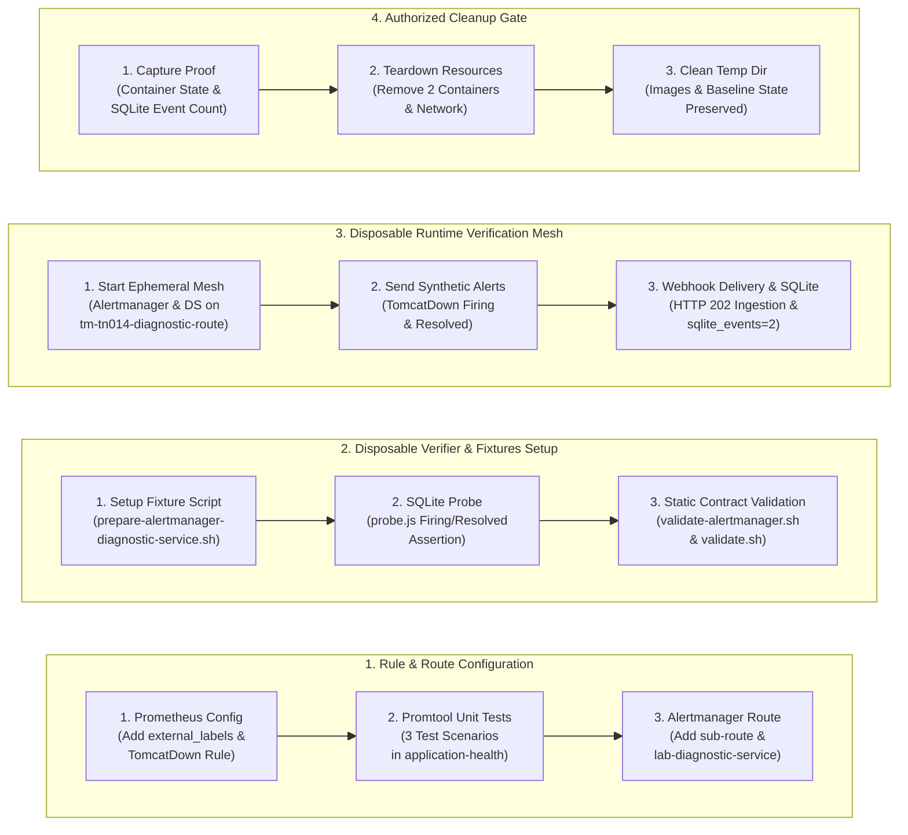
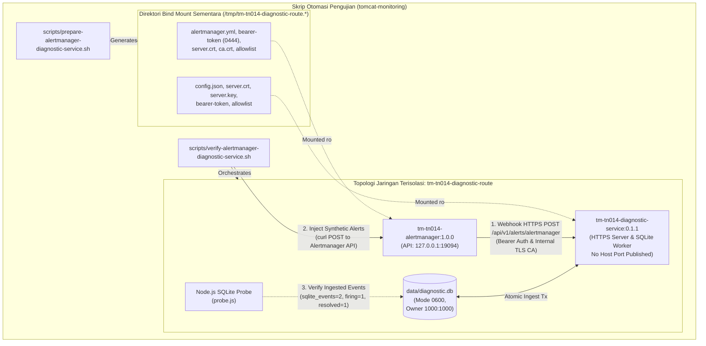

# TN-014 — Configure TomcatDown Rule and Alertmanager Diagnostic Route

| Field | Value |
| --- | --- |
| Status | Completed |
| Outcome | Target isolation tercapai, webhook schema v4 diverifikasi. |
| Activity Type | Implementation and Verification |
| Record Type | Live |
| Project | Tomcat Monitoring |
| Phase | Diagnostic MVP Pilot |
| Activity Date | 2026-09-02 |
| Recorded Date | 2026-09-02 |
| Owner | Project owner |
| Working Mode | Write |
| Authorization Status | Source, static validation, runtime verifier, and cleanup approved/executed |
| Approved By | Project owner |
| Approval Date | 2026-09-02 |

## 🎯 Objective

Mengkonfigurasi aturan Prometheus `TomcatDown` beserta `external_labels`, menambahkan sub-route Alertmanager beserta receiver `lab-diagnostic-service` yang mengirim webhook ke Diagnostic Service, dan membuktikan bahwa payload synthetic `TomcatDown` firing dan resolved diterima oleh disposable Diagnostic Service dengan status HTTP `202 Accepted` serta tersimpan di database SQLite lokal.

**Target Utama & Kriteria Keberhasilan:**

1. **Prometheus Detection Rule & External Labels:** Menambahkan konfigurasi `external_labels` (`environment: lab`, `host: tomcat-01`) pada `prometheus.yml`, mendefinisikan rule `TomcatDown` pada `application-health.yml` dengan label wajib Webhook Schema v4 (`check: runtime-availability`, `tomcat_instance: default`, `severity: critical`), dan memverifikasi 3 skenario evaluasi menggunakan unit test `promtool`.
2. **Alertmanager Isolated Sub-Route & Secret Contracts:** Menambahkan sub-route `routes:` pada `alertmanager.yml` yang mencocokkan `alertname = "TomcatDown"` ke receiver `lab-diagnostic-service` dengan `continue: false` dan `max_alerts: 1`, serta mengintegrasikan secret contract paths (`url_file`, `credentials_file`, `ca_file`) di bawah `/run/secrets/tomcat-monitoring/`.
3. **Disposable Verification & SQLite State Proof:** Mengorkestrasi topologi 2 kontainer ephemeral (`tm-tn014-alertmanager` dan `tm-tn014-diagnostic-service`) pada jaringan terisolasi `tm-tn014-diagnostic-route`, memverifikasi penerimaan webhook HTTP `202`, dan membuktikan tercatatnya minimal 1 event `firing` dan 1 event `resolved` (`sqlite_events=2`) via probe SQLite independen.
4. **Boundary:** Seluruh kontainer verifikasi berjalan tanpa publikasi host port pada Diagnostic Service, Alertmanager API hanya terikat pada loopback (`127.0.0.1:19094`), tanpa named volume baru, tanpa remediasi otomatis (*Zero Automatic Remediation*), dan membersihkan seluruh resource sementara secara total setelah otorisasi pengujian selesai.

## 🌍 Background

TN-013 menyelesaikan image `0.1.1` dan disposable Diagnostic Service–Mailpit runtime verification. Alur `Prometheus → Alertmanager → Diagnostic Service` yang dijanjikan phase ini belum memiliki dua prerequisite penting:

1. **Prometheus rule `TomcatDown` belum ada** — `application-health.yml` hanya memiliki tiga application-health rules; tidak ada rule yang mendeteksi kondisi JMX Exporter unreachable (`up == 0`).
2. **Alertmanager route ke Diagnostic Service belum ada** — `alertmanager.yml` hanya memiliki `lab-mailpit` receiver tanpa sub-route untuk `TomcatDown`.

Discovery juga mengungkap bahwa webhook schema v4 DS mewajibkan label `environment`, `host`, dan `tomcat_instance` pada setiap alert. Label tersebut belum ada di Prometheus scrape labels. Solusi yang disetujui: tambahkan `external_labels` ke `prometheus.yml` dan `tomcat_instance` ke rule labels.

Persistent deployment ke Prometheus dan Alertmanager yang sedang berjalan berada di luar scope TN-014 dan menjadi tanggung jawab [TN-015](TN-015-deploy-persistent-monitoring-runtime.md).

## 📚 Scope

Scope yang disetujui mencakup:

- `tomcat-monitoring`:
  - `config/prometheus/prometheus.yml` — tambahkan `external_labels`
  - `config/prometheus/rules/application-health.yml` — tambahkan rule `TomcatDown`
  - `config/prometheus/tests/application-health.test.yml` — tambahkan unit test
  - `config/alertmanager/alertmanager.yml` — tambahkan `routes:` sub-route dan receiver `lab-diagnostic-service`
  - `config/alertmanager/README.md` — update documentation contract
  - `scripts/prepare-alertmanager-diagnostic-service.sh` — fixture preparation script baru untuk disposable verification
  - `scripts/verify-alertmanager-diagnostic-service.sh` — disposable verifier script baru untuk Alertmanager → DS webhook delivery
  - `fixtures/alertmanager-diagnostic-route/probe.js` — SQLite probe baru
  - `scripts/validate-alertmanager.sh` — update static contract checks
  - `scripts/validate.sh` — update REQUIRED_FILES dan contract validation
- `devops-handbook`:
  - TN-014 live Engineering Journal record

Exclusion: persistent deployment ke Prometheus/Alertmanager volume, named volume baru, Restricted Event Collector, actual Tomcat downtime, Mailpit dalam disposable runtime ini, commit, push.

## 📋 Prerequisites

| Prerequisite | State |
| --- | --- |
| TN-013 source baseline | `tomcat-diagnostic-service` commit `bb0c9d2`; `tomcat-monitoring` commit `07f9e21` |
| Decision Baseline | TM-ADR-0013, TM-ADR-0014, TM-ADR-0015, TM-ADR-0016, TM-ADR-0017 accepted |
| Diagnostic Service image `0.1.1` | Digest `sha256:94bf8fbe4ce75e60f3481b9346cb0e79bdb397a36d32e7de4e2adfbe9f5fa20f` |
| Alertmanager image | `localhost/alertmanager:1.0.0` |
| Node.js image untuk probe | `localhost/nodejs@sha256:76b1444d507be3398f3196f37bd20f7a97a703871ed2716fa91a1a9520fc482d` |
| Webhook schema v4 label contract | `environment`, `host`, `tomcat_instance`, `check: runtime-availability` wajib |
| Implementation authorization | Approved 2026-09-02 |

## ⚖️ Execution Decision

Implementasi ini secara ketat menegakkan keputusan arsitektur proyek:

- **Kepatuhan [TM-ADR-0013](../../../../adr/tomcat-monitoring/adr-records/TM-ADR-0013.md):** Penegakan persistensi database lokal SQLite `diagnostic.db` dengan izin ketat `0600`.
- **Kepatuhan [TM-ADR-0014](../../../../adr/tomcat-monitoring/adr-records/TM-ADR-0014.md):** Penegakan prinsip *Zero Automatic Remediation*, di mana Diagnostic Service murni bertindak sebagai penerima, penganalisis bukti, dan pemberi rekomendasi tindakan manual.
- **Kepatuhan [TM-ADR-0015](../../../../adr/tomcat-monitoring/adr-records/TM-ADR-0015.md):** Penerimaan webhook secara asinkron dengan respons cepat HTTP `202 Accepted` dan antrean persisten pada SQLite.
- **Kepatuhan [TM-ADR-0016](../../../../adr/tomcat-monitoring/adr-records/TM-ADR-0016.md):** Penetapan Diagnostic Service sebagai otoritas tunggal notifikasi insiden `TomcatDown`. Konfigurasi `continue: false` pada sub-route Alertmanager memastikan alert tidak diteruskan ke receiver `lab-mailpit`.
- **Kepatuhan [TM-ADR-0017](../../../../adr/tomcat-monitoring/adr-records/TM-ADR-0017.md):** Pengujian vertical slice MVP sekali-pakai (*disposable runtime*) untuk memvalidasi kontrak webhook sebelum implementasi ke deployment persisten.
- `external_labels` (`environment: lab`, `host: tomcat-01`) ditambahkan ke `prometheus.yml`; `tomcat_instance: default` ditambahkan ke rule labels. Nilai ini bersifat lab-only placeholder dan akan diperbarui sesuai target deployment aktual.
- `TomcatDown` menggunakan `check: runtime-availability` sesuai webhook schema v4 contract; ini membedakannya dari application-health alerts yang menggunakan `check: application-health`.
- `continue: false` pada sub-route memastikan `TomcatDown` hanya masuk ke `lab-diagnostic-service`, tidak ke `lab-mailpit`. Diagnostic Service mengirim notification email sendiri.
- `max_alerts: 1` pada webhook receiver memastikan setiap webhook call memuat tepat satu alert, konsisten dengan DS ingestion contract.
- `url_file` dan `credentials_file` menggunakan path `/run/secrets/tomcat-monitoring/` sebagai persistent secret contract. File actual bukan tanggung jawab repository ini dan tidak disimpan di Git.
- `tls_config.ca_file` dipasang sebagai secret mount karena DS menggunakan self-signed certificate yang tidak ada di system trust store.
- Disposable verifier tidak memiliki cleanup trap agar evidence tetap tersedia sampai cleanup diotorisasi secara terpisah.

## 🔄 Technical Workflow

Alur teknis konfigurasi aturan deteksi, penyusunan rute Alertmanager, orkestrasi pengujian disposable, dan pembersihan terotorisasi:



### Rincian Aktivitas Alur Kerja

#### 1. Konfigurasi Aturan & Rute (Rule & Route Configuration)
1. **Prometheus Config:** Menambahkan `external_labels` (`environment: lab`, `host: tomcat-01`) pada `prometheus.yml` dan menambahkan rule `TomcatDown` sebagai rule keempat pada `application-health.yml`.
2. **Promtool Unit Tests:** Menambahkan 3 skenario tes evaluasi alert pada `application-health.test.yml` dan memverifikasi keabsahan rule dengan `promtool check rules`.
3. **Alertmanager Route:** Menambahkan sub-route `routes:` pada `alertmanager.yml` dengan filter `alertname = "TomcatDown"`, `continue: false`, dan receiver `lab-diagnostic-service` menggunakan otentikasi webhook bearer token serta CA TLS internal.

#### 2. Penyiapan Fixtures & Skrip Verifier (Disposable Verifier & Fixtures Setup)
1. **Setup Fixture Script:** Membuat `scripts/prepare-alertmanager-diagnostic-service.sh` untuk menghasilkan konfigurasi sementara, sertifikat TLS, allowlist, dan token otentikasi pada direktori `/tmp/tm-tn014-diagnostic-route.*`.
2. **SQLite Probe:** Membuat `fixtures/alertmanager-diagnostic-route/probe.js` untuk memverifikasi pencatatan event `firing` dan `resolved` di tabel SQLite Diagnostic Service.
3. **Static Contract Validation:** Memperbarui `validate-alertmanager.sh` dan `validate.sh` untuk menegakkan kontrak struktur konfigurasi dan mendaftarkan berkas-berkas baru ke `REQUIRED_FILES`.

#### 3. Orkestrasi Pengujian Sekali-Pakai (Disposable Runtime Verification Mesh)
1. **Start Ephemeral Mesh:** Menjalankan kontainer `tm-tn014-diagnostic-service` (tanpa publikasi port host) dan `tm-tn014-alertmanager` (API loopback `127.0.0.1:19094`) pada jaringan internal `tm-tn014-diagnostic-route`.
2. **Send Synthetic Alerts:** Mengirimkan payload synthetic `TomcatDown` (firing dan resolved) ke Alertmanager API melalui curl loopback.
3. **Webhook Delivery & SQLite:** Alertmanager meneruskan payload ke Diagnostic Service via webhook HTTPS. Diagnostic Service merespons dengan HTTP `202 Accepted` dan menyimpan data ke SQLite (`sqlite_events=2`).

#### 4. Gerbang Pembersihan Terotorisasi (Authorized Cleanup Gate)
1. **Capture Proof:** Mencatat bukti hasil verifikasi runtime, log kontainer, dan penghitungan record SQLite.
2. **Teardown Resources:** Menghapus kontainer `tm-tn014-alertmanager`, `tm-tn014-diagnostic-service`, dan jaringan `tm-tn014-diagnostic-route`.
3. **Clean Temp Dir:** Menghapus direktori kerja sementara pada `/tmp/` tanpa memodifikasi state image lokal atau volume persisten.

## 🧭 Implementation Plan

| Tahap | Rencana |
| --- | --- |
| **Register Live Record** | Baca baseline, catat authorization dan scope. |
| **Add TomcatDown Prometheus Rule** | Tambahkan `external_labels` ke `prometheus.yml`, rule `TomcatDown` keempat ke `application-health.yml`, dan unit test ke `application-health.test.yml`. |
| **Configure Alertmanager Diagnostic Route** | Tambahkan `routes:` sub-route dan receiver `lab-diagnostic-service` ke `alertmanager.yml`. |
| **Add Disposable Verifier** | Buat `prepare-alertmanager-diagnostic-service.sh`, `verify-alertmanager-diagnostic-service.sh`, dan `fixtures/alertmanager-diagnostic-route/probe.js`. |
| **Update Validation Contract** | Update `validate-alertmanager.sh`, `validate.sh`, dan `config/alertmanager/README.md`. |
| **Source and Static Validation** | Jalankan `bash -n scripts/*.sh`, `./scripts/validate.sh`, dan `git diff --check`. |
| **Runtime Verification** | Setelah authorization terpisah: jalankan prepare script, lalu verifier, kumpulkan evidence. |
| **Authorized Cleanup** | Setelah evidence dicatat dan cleanup diotorisasi: hapus exact disposable resources. |

## ⚙️ Implementation

<div class="procedure" markdown>

<div class="procedure-step" markdown>

### Register Live Record

Discovery aktual:

```bash
git -C /home/eddywiyatno/git/tomcat-diagnostic-service status --short --branch
git -C /home/eddywiyatno/git/tomcat-monitoring status --short --branch
git -C /home/eddywiyatno/git/devops-handbook status --short --branch
cat /home/eddywiyatno/git/tomcat-diagnostic-service/config/schemas/alertmanager-webhook-v4.schema.json
cat /home/eddywiyatno/git/tomcat-diagnostic-service/src/server/http-service.js
cat /home/eddywiyatno/git/tomcat-diagnostic-service/src/application/ingest-alertmanager.js
cat /home/eddywiyatno/git/tomcat-monitoring/config/prometheus/prometheus.yml
cat /home/eddywiyatno/git/tomcat-monitoring/config/prometheus/rules/application-health.yml
cat /home/eddywiyatno/git/tomcat-monitoring/config/alertmanager/alertmanager.yml
cat /home/eddywiyatno/git/tomcat-monitoring/scripts/validate-alertmanager.sh
```

**Expected Result:** Baseline exact, webhook schema label contract, DS endpoint,
dan gap `external_labels` diketahui sebelum edit.

**Actual Result:** Ketiga repository clean kecuali `devops-handbook` ahead 1
(TN-013 commit lokal belum push) dan satu unstaged user change TN-005.
Webhook schema v4 mewajibkan label `environment`, `host`, `tomcat_instance`,
`check: runtime-availability` yang tidak ada di `prometheus.yml` saat ini.
DS webhook endpoint adalah `POST /api/v1/alerts/alertmanager`. DS tidak
mencetak log HTTP request. Validate-alertmanager.sh melarang `webhook_configs:`
di seluruh file; check ini di-scope ulang ke receiver `lab-mailpit` saja.

!!! success "Expected Result"

    Baseline exact, webhook schema label contract, DS endpoint, dan gap
    `external_labels` diketahui sebelum edit.

</div>

<div class="procedure-step" markdown>

### Add TomcatDown Prometheus Rule

`prometheus.yml`: tambahkan `external_labels` di bawah `global:`.

`application-health.yml`: tambahkan rule `TomcatDown` sebagai rule keempat
dengan labels `severity: critical`, `service: tomcat`,
`check: runtime-availability`, dan `tomcat_instance: default`.

`application-health.test.yml`: tambahkan tiga test scenarios untuk `TomcatDown`:
JMX up tidak firing, JMX down firing setelah 2 menit, firing kemudian resolved.

!!! success "Expected Result"

    Prometheus rule file memiliki empat rules; `TomcatDown` menggunakan semua
    label yang diwajibkan webhook schema v4; unit test file memiliki scenarios
    baru yang dapat dijalankan dengan `promtool`.

**Actual Result:** Rule `TomcatDown` ditambahkan sebagai rule keempat dengan
labels yang sesuai. Tiga skenario tes untuk `TomcatDown` juga ditambahkan ke
`application-health.test.yml`. `external_labels` dengan environment lab dan
host tomcat-01 ditambahkan ke `prometheus.yml`.

</div>

<div class="procedure-step" markdown>

### Configure Alertmanager Diagnostic Route

`alertmanager.yml`: tambahkan `routes:` sub-route di bawah `route:` yang
meng-match `alertname = "TomcatDown"` ke receiver `lab-diagnostic-service`
dengan `continue: false`. Tambahkan receiver baru `lab-diagnostic-service`
dengan `webhook_configs` menggunakan `url_file`, `credentials_file`, `ca_file`,
`send_resolved: true`, dan `max_alerts: 1`.

!!! success "Expected Result"

    `alertmanager.yml` memiliki sub-route dan dua receivers; `TomcatDown`
    tidak melalui `lab-mailpit`; secret paths menggunakan konvensi
    `/run/secrets/tomcat-monitoring/`.

**Actual Result:** Sub-route dan receiver `lab-diagnostic-service` berhasil
ditambahkan. Alert `TomcatDown` diarahkan ke Diagnostic Service tanpa dilanjutkan
ke Mailpit. Konvensi `/run/secrets/` digunakan.

</div>

<div class="procedure-step" markdown>

### Add Disposable Verifier

`prepare-alertmanager-diagnostic-service.sh`: script baru yang menerima exact
temp directory path, membuat DS fixtures dan synthetic Alertmanager config.

`verify-alertmanager-diagnostic-service.sh`: script baru yang membuat network
`tm-tn014-diagnostic-route`, menjalankan DS dan Alertmanager, mengirim
synthetic `TomcatDown` firing dan resolved, dan membuktikan penerimaan via
SQLite probe setelah DS berhenti.

`fixtures/alertmanager-diagnostic-route/probe.js`: SQLite probe yang verifikasi
minimal 1 firing event dan 1 resolved event.

!!! success "Expected Result"

    Ketiga files tersedia, executable, lulus `bash -n`; verifier menggunakan
    naming convention `tm-tn014-*`; DS tidak publish host port; Alertmanager
    API publish ke loopback `127.0.0.1:19094` saja.

**Actual Result:** Script preparation dan verification beserta SQLite probe
berhasil dibuat, memiliki ijin eksekusi, dan lulus syntax check. DS tidak
mem-publish port, dan Alertmanager API ter-publish di loopback.

</div>

<div class="procedure-step" markdown>

### Update Validation Contract

`validate-alertmanager.sh`: ganti larangan blanket `webhook_configs:` dengan
check scoped ke `lab-mailpit`. Tambahkan positive checks untuk sub-route dan
receiver `lab-diagnostic-service`. Tambahkan fixture contract checks.

`validate.sh`: tambahkan tiga paths baru ke `REQUIRED_FILES`.

`config/alertmanager/README.md`: update contract documentation.

!!! success "Expected Result"

    `./scripts/validate.sh` lulus; script baru tercatat di `REQUIRED_FILES`;
    README mencerminkan routing contract yang berlaku.

**Actual Result:** Validasi statis diperbarui. Larangan webhook dikhususkan
hanya untuk receiver Mailpit. Validation contract memeriksa semua fitur baru.
File baru tercatat dalam list. README mencerminkan dua receiver.

</div>

<div class="procedure-step" markdown>

### Source and Static Validation

```bash
bash -n scripts/*.sh
./scripts/validate.sh
git diff --check
```

!!! success "Expected Result"

    Seluruh shell script valid secara sintaksis; `validate.sh` lulus termasuk
    `validate-alertmanager.sh` baru; tidak ada trailing whitespace.

**Actual Result:** Lulus. Script memiliki syntax yang valid, `validate.sh`
melaporkan semua check hijau, dan tidak ada trailing whitespace.

</div>

<div class="procedure-step" markdown>

### Runtime Verification

Setelah authorization terpisah dari project owner:

```bash
temporary_root="$(mktemp -d /tmp/tm-tn014-diagnostic-route.XXXXXX)"
./scripts/prepare-alertmanager-diagnostic-service.sh "${temporary_root}"
find "${temporary_root}" -maxdepth 2 -printf '%M %u:%g %p\n' | sort

DIAGNOSTIC_IMAGE='localhost/tomcat-diagnostic-service@sha256:94bf8fbe4ce75e60f3481b9346cb0e79bdb397a36d32e7de4e2adfbe9f5fa20f' \
  ./scripts/verify-alertmanager-diagnostic-service.sh \
  "${temporary_root}"
```

!!! success "Expected Result"

    Alertmanager mengirim `TomcatDown` firing dan resolved webhook ke DS;
    DS menerima keduanya dengan HTTP `202`; SQLite probe membuktikan minimal
    1 firing event dan 1 resolved event; database mode `0600`; tidak ada
    host port publish pada DS; tidak ada named volume baru.

**Actual Result:** Disposable verification berhasil (`runtime_result=passed`).
Alertmanager berhasil mengirim payload webhook ke DS (dengan penyesuaian file
permissions pada fixture `bearer-token` menjadi 0444). Probe SQLite
memverifikasi terdapat `sqlite_events=2`, dengan `sqlite_firing=1` dan
`sqlite_resolved=1`. State named/anonymous volumes tidak berubah, dan resources
menunggu explicit cleanup authorization.

</div>

<div class="procedure-step" markdown>

### Authorized Cleanup

Setelah evidence dicatat dan cleanup diotorisasi:

```bash
podman rm --force tm-tn014-alertmanager tm-tn014-diagnostic-service
podman network rm tm-tn014-diagnostic-route
rm -rf -- /tmp/tm-tn014-diagnostic-route.<suffix>
```

!!! success "Expected Result"

    Containers, network, dan temporary directory absent; images dipertahankan;
    named volume state unchanged.

**Actual Result:** Cleanup berhasil dieksekusi. Container Alertmanager dan Diagnostic Service, network `tm-tn014-diagnostic-route`, serta seluruh temporary directory telah dihapus. Sesuai dengan contract, tidak ada local images yang dihapus dan named volumes tidak termodifikasi.

</div>

</div>

## 📁 Artifact Manifest

Bagian ini mencatat seluruh berkas (*artifacts*) pada repositori `tomcat-monitoring` dan `devops-handbook` yang dibuat atau dimodifikasi selama aktivitas TN-014 untuk mengonfigurasi aturan Prometheus `TomcatDown`, menambahkan rute webhook Alertmanager, dan memverifikasi integrasi disposable runtime.

### Panduan Membaca Tabel

Tabel di bawah mengelompokkan berkas berdasarkan repositori, peran teknis, dan lapisan (*layer*) arsitekturalnya:

- **Berkas (*Path*)**: Lokasi berkas relatif terhadap repositori terkait (`tomcat-monitoring` atau `devops-handbook`).
- **Repositori**: Repositori kepemilikan berkas terkait.
- **Layer / Kategori**: Lapisan sistem dari komponen terkait (Metrik & Aturan Alert, Perutean & Notifikasi, Verifier & Fixtures, Tata Kelola & Validasi, atau Dokumentasi).
- **Status**: Status perubahan berkas dibandingkan baseline awal TN-013 (`Baru` = berkas baru dibuat; `Modifikasi` = berkas diperbarui).
- **Tanggung Jawab Teknis**: Peran fungsional berkas dalam konfigurasi Prometheus, routing Alertmanager, skrip verifikasi probe, dan orkestrasi runtime.

### Tabel Manifest Berkas

| Berkas (*Path*) | Repositori | Layer / Kategori | Status | Tanggung Jawab Teknis |
| --- | --- | --- | :---: | --- |
| `config/prometheus/prometheus.yml` | `tomcat-monitoring` | Metrik & Aturan Alert | Modifikasi | Menambahkan konfigurasi `external_labels` (`environment: lab`, `host: tomcat-01`) pada level global Prometheus. |
| `config/prometheus/rules/application-health.yml` | `tomcat-monitoring` | Metrik & Aturan Alert | Modifikasi | Menambahkan rule `TomcatDown` sebagai rule keempat dengan labels `check: runtime-availability` dan `tomcat_instance: default`. |
| `config/prometheus/tests/application-health.test.yml` | `tomcat-monitoring` | Pengujian Otomatis (Unit) | Modifikasi | Menambahkan 3 skenario unit test `promtool` untuk rule `TomcatDown` (kondisi up, firing setelah 2m, dan recovery resolved). |
| `config/alertmanager/alertmanager.yml` | `tomcat-monitoring` | Perutean & Notifikasi | Modifikasi | Menambahkan sub-route `TomcatDown` (`continue: false`) dan receiver webhook `lab-diagnostic-service` dengan secret paths `/run/secrets/`. |
| `config/alertmanager/README.md` | `tomcat-monitoring` | Tata Kelola Konfigurasi | Modifikasi | Memperbarui dokumentasi kontrak perutean Alertmanager dan penerima webhook Diagnostic Service. |
| `scripts/prepare-alertmanager-diagnostic-service.sh` | `tomcat-monitoring` | Verifier & Fixtures | Baru | Menyiapkan struktur direktori sementara, konfigurasi Alertmanager ephemeral, sertifikat TLS, allowlist, dan bearer token. |
| `scripts/verify-alertmanager-diagnostic-service.sh` | `tomcat-monitoring` | Verifier & Orkestrasi | Baru | Mengorkestrasi 2 kontainer disposable (Alertmanager dan DS), mengirimkan synthetic alert firing/resolved, dan mengevaluasi hasil probe. |
| `fixtures/alertmanager-diagnostic-route/probe.js` | `tomcat-monitoring` | Verifier & Probes | Baru | Runner probe pengujian SQLite untuk memverifikasi pencatatan minimal 1 event firing dan 1 event resolved (`sqlite_events=2`). |
| `scripts/validate-alertmanager.sh` | `tomcat-monitoring` | Tata Kelola & Validasi | Modifikasi | Menyesuaikan validasi statis agar larangan webhook hanya berlaku pada `lab-mailpit` dan memvalidasi konfigurasi receiver `lab-diagnostic-service`. |
| `scripts/validate.sh` | `tomcat-monitoring` | Tata Kelola & Validasi | Modifikasi | Mendaftarkan 3 berkas script/fixture baru ke dalam array `REQUIRED_FILES` dan menjalankan validasi terpadu. |
| `docs/projects/tomcat-monitoring/engineering-journal/diagnostic-mvp-pilot/TN-014-configure-tomcatdown-rule-and-alertmanager-diagnostic-route.md` | `devops-handbook` | Dokumentasi & Jurnal | Modifikasi | Mencatat live engineering journal implementasi dan verifikasi TN-014 secara lengkap dan terstruktur. |

### Alur Keterkaitan Antar-Berkas & Topologi Pengujian

Diagram berikut mengilustrasikan interaksi topologi jaringan dan relasi antar-komponen pengujian disposable runtime pada TN-014:



## 🧪 Test Scenario Matrix

| Scenario | Layer | Expected Result |
| --- | --- | --- |
| `TomcatDown` tidak firing saat JMX up | Source/unit | `promtool` tidak melaporkan alert |
| `TomcatDown` firing setelah JMX down 2 menit | Source/unit | `promtool` melaporkan firing dengan label lengkap |
| `TomcatDown` resolved setelah JMX pulih | Source/unit | `promtool` melaporkan tidak ada alert setelah recovery |
| `webhook_configs` tidak ada di `lab-mailpit` | Source/static | `validate-alertmanager.sh` lulus |
| Sub-route dan receiver `lab-diagnostic-service` ada | Source/static | `validate-alertmanager.sh` lulus |
| `url_file` dan `credentials_file` menggunakan secret path | Source/static | `validate-alertmanager.sh` lulus |
| Synthetic `TomcatDown` firing diterima DS | Runtime integration | HTTP `202`; SQLite event tersimpan |
| Synthetic `TomcatDown` resolved diterima DS | Runtime integration | HTTP `202`; SQLite resolved tersimpan |

## ✅ Verification

| Method | Expected Result | Actual Result |
| --- | --- | --- |
| `bash -n scripts/*.sh` | Shell syntax valid | Lulus |
| `./scripts/validate.sh` | Source layout dan static contract valid | Lulus |
| `git diff --check` | Tidak ada trailing whitespace | Lulus |
| Disposable runtime verification | Firing dan resolved diterima; SQLite probe passed | Lulus (`sqlite_events=2`, `sqlite_firing=1`, `sqlite_resolved=1`) |

## 🛠️ Troubleshooting

| Attempt | Actual result | Resolution |
| --- | --- | --- |
| Validasi statis Alertmanager awal | `validate-alertmanager.sh` gagal karena melarang keyword `webhook_configs:` secara blanket | Ubah pemeriksaan validasi statis agar larangan webhook hanya berlaku secara ketat pada receiver `lab-mailpit`, dan tambahkan positive check untuk receiver `lab-diagnostic-service`. |
| Pengiriman webhook Alertmanager ke DS pada runtime | Alertmanager gagal membaca file `bearer-token` karena izin berkas terlalu ketat bagi non-root container | Sesuaikan permission mode berkas fixture `bearer-token` pada direktori sementara menjadi `0444` agar dapat dibaca oleh proses Alertmanager secara aman. |

## 🧹 Cleanup Evidence

Setelah pencatatan bukti verifikasi selesai dan diotorisasi oleh project owner, seluruh komponen disposable berhasil dibersihkan:

| Resource | Status Teardown | Bukti Keberadaan (*Absence Verification*) |
| --- | :---: | --- |
| Container `tm-tn014-alertmanager` | Dihapus | `podman container exists tm-tn014-alertmanager` -> `false` |
| Container `tm-tn014-diagnostic-service` | Dihapus | `podman container exists tm-tn014-diagnostic-service` -> `false` |
| Network `tm-tn014-diagnostic-route` | Dihapus | `podman network exists tm-tn014-diagnostic-route` -> `false` |
| Temporary Root Directory `/tmp/tm-tn014-diagnostic-route.*` | Dihapus | Direktori absent, zero residual files |
| Persistent Named Volumes | Tidak Berubah | `podman volume ls` identik dengan volume baseline awal |
| Local Images (`0.1.1`, Alertmanager, Node.js) | Dipertahankan | Seluruh digest image tetap tersedia untuk pengujian lanjutan |

## 🧭 Reproduction Boundary

- **Source Baselines:** `tomcat-diagnostic-service` commit `bb0c9d2`, `tomcat-monitoring` commit `07f9e21`, dan `devops-handbook` commit `db2ade2`.
- **Image Digest Baseline:** `localhost/tomcat-diagnostic-service@sha256:94bf8fbe4ce75e60f3481b9346cb0e79bdb397a36d32e7de4e2adfbe9f5fa20f` dan `localhost/nodejs@sha256:76b1444d507be3398f3196f37bd20f7a97a703871ed2716fa91a1a9520fc482d`.
- **Topologi Reproduksi:** Verifier disposable dijalankan melalui script `./scripts/verify-alertmanager-diagnostic-service.sh <temporary_root>` tanpa membutuhkan akses internet eksternal atau publikasi host port.

## 🖥️ Source-Control Handoff

Seluruh perubahan konfigurasi dan skrip pada repositori `tomcat-monitoring` telah divalidasi dan siap di-commit. Pada repositori `devops-handbook`, catatan live journal TN-014 telah diperbarui secara menyeluruh dan siap disinkronisasikan ke situs handbook.

## 🖥️ Commands Executed

```bash
# Discovery and baseline inspection
git -C /home/eddywiyatno/git/tomcat-diagnostic-service status --short --branch
git -C /home/eddywiyatno/git/tomcat-monitoring status --short --branch
git -C /home/eddywiyatno/git/devops-handbook status --short --branch
cat /home/eddywiyatno/git/tomcat-diagnostic-service/config/schemas/alertmanager-webhook-v4.schema.json
cat /home/eddywiyatno/git/tomcat-monitoring/config/prometheus/prometheus.yml
cat /home/eddywiyatno/git/tomcat-monitoring/config/prometheus/rules/application-health.yml
cat /home/eddywiyatno/git/tomcat-monitoring/config/alertmanager/alertmanager.yml

# Static syntax and contract checks
bash -n scripts/*.sh
./scripts/validate.sh
git diff --check

# Disposable runtime execution
temporary_root="$(mktemp -d /tmp/tm-tn014-diagnostic-route.XXXXXX)"
./scripts/prepare-alertmanager-diagnostic-service.sh "${temporary_root}"
find "${temporary_root}" -maxdepth 2 -printf '%M %u:%g %p\n' | sort

DIAGNOSTIC_IMAGE='localhost/tomcat-diagnostic-service@sha256:94bf8fbe4ce75e60f3481b9346cb0e79bdb397a36d32e7de4e2adfbe9f5fa20f' \
  ./scripts/verify-alertmanager-diagnostic-service.sh \
  "${temporary_root}"

# Authorized teardown
podman rm --force tm-tn014-alertmanager tm-tn014-diagnostic-service
podman network rm tm-tn014-diagnostic-route
rm -rf -- "${temporary_root}"
```

## 🧾 Outcome

Target isolasi rute notifikasi tercapai, aturan Prometheus `TomcatDown` beserta sub-route Alertmanager `lab-diagnostic-service` berhasil dikonfigurasi dan divalidasi secara statis dan runtime. Verifikasi disposable runtime mengonfirmasi bahwa webhook payload Alertmanager dapat diterima dengan status HTTP `202 Accepted` dan diproses oleh Diagnostic Service (probe SQLite membuktikan tercatatnya event `firing` dan `resolved` dengan `sqlite_events=2`). Seluruh sumber daya sementara telah dibersihkan secara terotorisasi.

## ⏭️ Next Steps

Implementasi dan verifikasi source selesai. Lakukan handoff dokumentasi dengan melakukan commit pada repositori `tomcat-monitoring` dan `devops-handbook`. Deploy konfigurasi yang persisten ke Prometheus dan Alertmanager environment akan menjadi tanggung jawab [TN-015 — Deploy Persistent Monitoring Runtime](TN-015-deploy-persistent-monitoring-runtime.md).

## 🔗 Related Documentation

- [TN-013 — Rebuild and Verify Diagnostic Service–Mailpit Runtime](TN-013-rebuild-and-verify-diagnostic-service-mailpit-runtime.md)
- [TN-015 — Deploy Persistent Monitoring Runtime](TN-015-deploy-persistent-monitoring-runtime.md)
- [Diagnostic MVP Index](../../diagnostic-mvp/index.md)
- [TM-ADR-0013 — Use Built-in node:sqlite for MVP Local Persistence](../../../../adr/tomcat-monitoring/adr-records/TM-ADR-0013.md)
- [TM-ADR-0014 — Enforce Zero Automatic Remediation for Diagnostic Service](../../../../adr/tomcat-monitoring/adr-records/TM-ADR-0014.md)
- [TM-ADR-0015 — Adopt Asynchronous Webhook Ingestion with Durable SQLite Acceptance Pattern](../../../../adr/tomcat-monitoring/adr-records/TM-ADR-0015.md)
- [TM-ADR-0016 — Designate Diagnostic Service as Canonical Incident Notification Authority](../../../../adr/tomcat-monitoring/adr-records/TM-ADR-0016.md)
- [TM-ADR-0017 — Adopt Vertical Slice Minimum Viable Product Scoping for Diagnostic Pilot](../../../../adr/tomcat-monitoring/adr-records/TM-ADR-0017.md)
