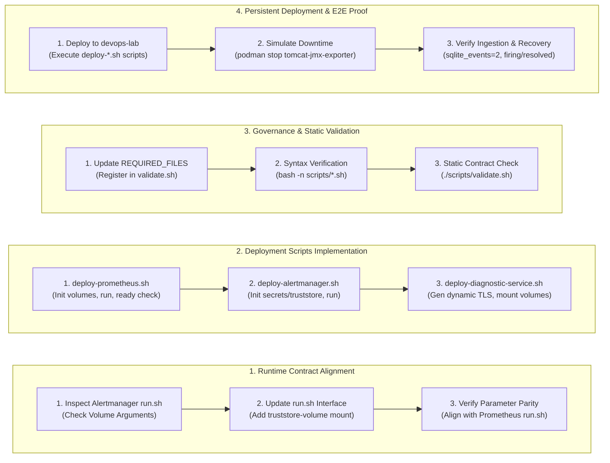
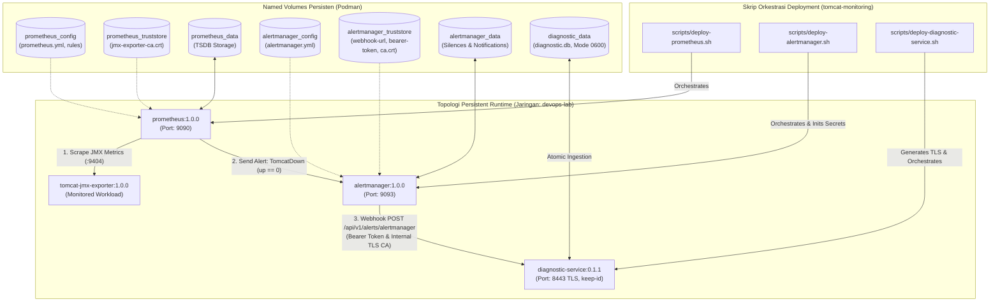

# TN-015 — Deploy Persistent Monitoring Runtime

| Field | Value |
| --- | --- |
| Status | Completed |
| Outcome | Persistent monitoring runtime berhasil dideploy ke devops-lab dan end-to-end webhook delivery diverifikasi. |
| Activity Type | Implementation and Verification |
| Record Type | Live |
| Project | Tomcat Monitoring |
| Phase | Diagnostic MVP Pilot |
| Activity Date | 2026-09-02 |
| Recorded Date | 2026-09-02 |
| Owner | Project owner |
| Working Mode | Write |
| Authorization Status | Source, static validation, persistent runtime deployment, and end-to-end verification approved/executed |
| Approved By | Project owner |
| Approval Date | 2026-09-02 |

## 🎯 Objective

Mengimplementasikan skrip deployment runtime persisten (`deploy-prometheus.sh`, `deploy-alertmanager.sh`, dan `deploy-diagnostic-service.sh`) di repositori `tomcat-monitoring`, memperbarui kontrak runtime `alertmanager` untuk mendukung *truststore volume mount*, mendeploy konfigurasi Prometheus `TomcatDown` dan sub-route Alertmanager ke environment persisten pada jaringan `devops-lab`, serta memverifikasi integrasi *end-to-end* pengiriman webhook alert `firing` dan `resolved` ke Diagnostic Service yang tersimpan secara persisten pada database SQLite lokal.

**Target Utama & Kriteria Keberhasilan:**

1. **Runtime Repositories & Truststore Volume Contract:** Memodifikasi `scripts/run.sh` pada repositori `alertmanager` untuk menerima argumen `<truststore-volume>` sehingga identik dengan antarmuka Prometheus dan memungkinkan pengiriman berkas secret/CA ke path `/run/secrets/tomcat-monitoring`.
2. **Persistent Deployment Orchestration:** Mengimplementasikan skrip orkestrasi `deploy-prometheus.sh`, `deploy-alertmanager.sh`, dan `deploy-diagnostic-service.sh` yang mengelola volume persisten (`prometheus_data`, `alertmanager_data`, `alertmanager_truststore`, `diagnostic_data`), staging berkas rahasia, sertifikat TLS dinamis, rollback renaming (`*-rollback-tn015`), dan pemeriksaan kesiapan (*readiness check* `/-/ready`).
3. **Static Contract Validation & Governance:** Memperbarui `scripts/validate.sh` di repositori `tomcat-monitoring` dengan mendaftarkan ketiga skrip deployment baru ke dalam `REQUIRED_FILES` dan memastikan seluruh skrip lulus validasi sintaksis `bash -n`.
4. **End-to-End Ingestion & SQLite State Verification:** Membuktikan integrasi operasional pada jaringan `devops-lab` melalui simulasi penghentian dan penyalaan ulang kontainer (`podman stop/start tomcat-jmx-exporter`), mengonfirmasi penerimaan webhook `firing` dan `resolved` dengan status HTTP `202 Accepted` pada Diagnostic Service, serta memvalidasi tercatatnya minimal 2 event (`sqlite_events=2`, `sqlite_firing=1`, `sqlite_resolved=1`) via probe SQLite pada volume persisten `diagnostic_data`.
5. **Boundary:** Seluruh runtime berjalan sebagai kontainer rootless Podman pada jaringan internal `devops-lab`, Diagnostic Service terisolasi dengan TLS internal port `8443`, penegakan prinsip *Zero Automatic Remediation* (TM-ADR-0014), isolasi antrean tunggal SQLite tanpa thread sekunder (TM-ADR-0015), tanpa pembuatan *Restricted Event Collector* dan downtime Tomcat sesungguhnya (dialokasikan ke TN-016), serta tanpa modifikasi registry eksternal.

## 🌍 Background

Pada tahap sebelumnya ([TN-014](TN-014-configure-tomcatdown-rule-and-alertmanager-diagnostic-route.md)), konfigurasi rule `TomcatDown` di Prometheus dan routing webhook ke Diagnostic Service melalui Alertmanager telah diuji menggunakan runtime sementara (*disposable runtime*). Pengujian tersebut membuktikan validitas skema webhook v4 dan mekanisme penerimaan alert.

Agar sistem monitoring dan diagnosis ini dapat beroperasi secara persisten dalam lingkungan `devops-lab`, diperlukan arsitektur deployment terpadu yang memanfaatkan *Named Volumes* untuk persistensi data dan integrasi rahasia (*truststore*). Skrip orkestrasi deployment harus mampu melakukan inisialisasi volume, konfigurasi TLS mandiri, manajemen daur hidup kontainer yang aman (*graceful replacement* dengan mekanisme rollback), dan verifikasi kesiapan (*readiness probing*).

## 📚 Scope

Scope yang disetujui mencakup:

- `alertmanager`:
  - `scripts/run.sh` — modifikasi antarmuka untuk mendukung `<truststore-volume>` (`/run/secrets/tomcat-monitoring:ro`).
- `tomcat-monitoring`:
  - `scripts/deploy-prometheus.sh` — skrip orkestrasi deployment Prometheus persisten.
  - `scripts/deploy-alertmanager.sh` — skrip orkestrasi deployment Alertmanager persisten lengkap dengan inisialisasi secret truststore.
  - `scripts/deploy-diagnostic-service.sh` — skrip orkestrasi deployment Diagnostic Service persisten dengan TLS mandiri dan volume `diagnostic_data`.
  - `scripts/validate.sh` — penambahan skrip deployment ke array `REQUIRED_FILES` dan validasi tata kelola.
- `devops-handbook`:
  - `TN-015` live Engineering Journal record.

*Exclusion:* Pembuatan *Restricted Event Collector* host service, deployment Tomcat aktual, modifikasi runtime Mailpit, serta modifikasi registry eksternal.

## 📋 Prerequisites

| Prerequisite | State |
| --- | --- |
| TN-014 baseline | Aturan `TomcatDown` dan sub-route `lab-diagnostic-service` telah divalidasi |
| Decision Baseline | TM-ADR-0013, TM-ADR-0014, TM-ADR-0015, TM-ADR-0016, TM-ADR-0017 accepted |
| Prometheus Image | `localhost/prometheus:1.0.0` |
| Alertmanager Image | `localhost/alertmanager:1.0.0` |
| Diagnostic Service Image | `localhost/tomcat-diagnostic-service@sha256:94bf8fbe4ce75e60f3481b9346cb0e79bdb397a36d32e7de4e2adfbe9f5fa20f` |
| Node.js Probe Image | `localhost/nodejs@sha256:76b1444d507be3398f3196f37bd20f7a97a703871ed2716fa91a1a9520fc482d` |
| Jaringan Target | `devops-lab` |
| Volume Persisten | `prometheus_config`, `prometheus_truststore`, `prometheus_data`, `alertmanager_config`, `alertmanager_truststore`, `alertmanager_data`, `diagnostic_data` |
| Implementation Authorization | Approved 2026-09-02 |

## ⚖️ Execution Decision

Implementasi ini secara ketat menegakkan keputusan arsitektur proyek:

- **Kepatuhan [TM-ADR-0013](../../../../adr/tomcat-monitoring/adr-records/TM-ADR-0013.md):** Penegakan persistensi database lokal SQLite `diagnostic.db` pada named volume `diagnostic_data` dengan mode berkas `0600` dan mode WAL (*Write-Ahead Logging*).
- **Kepatuhan [TM-ADR-0014](../../../../adr/tomcat-monitoring/adr-records/TM-ADR-0014.md):** Penegakan prinsip *Zero Automatic Remediation*, di mana Diagnostic Service murni bertindak sebagai penerima webhook, evaluator bukti, dan pengirim notifikasi tanpa melakukan restart otomatis terhadap instance Tomcat.
- **Kepatuhan [TM-ADR-0015](../../../../adr/tomcat-monitoring/adr-records/TM-ADR-0015.md):** Penerimaan webhook asinkron dengan respons cepat HTTP `202 Accepted` dan antrean persisten SQLite berkapasitas 50 tanpa antrean sekunder (*no-second-queue invariant*).
- **Kepatuhan [TM-ADR-0016](../../../../adr/tomcat-monitoring/adr-records/TM-ADR-0016.md):** Penetapan Diagnostic Service sebagai otoritas tunggal notifikasi insiden `TomcatDown` yang menerima sinyal dari Alertmanager melalui sub-route terisolasi tanpa penerusan ke Mailpit.
- **Kepatuhan [TM-ADR-0017](../../../../adr/tomcat-monitoring/adr-records/TM-ADR-0017.md):** Penerapan pendekatan *Vertical Slice MVP*, mengonsolidasikan deployment runtime pemantauan persisten sebelum melangkah ke tahap integrasi event collector dan workload Tomcat sesungguhnya.
- **Orkestrasi Terpusat vs Runtime Mandiri:** Skrip deployment orchestration (`deploy-*.sh`) dipusatkan di `tomcat-monitoring/scripts/`, sedangkan eksekusi kontainer Prometheus dan Alertmanager memanfaatkan skrip standar `run.sh` dari masing-masing repositori runtime (`git/prometheus`, `git/alertmanager`).
- **Standardisasi Truststore Mount:** Repositori `alertmanager` diperbarui untuk menerima *truststore volume mount* (`alertmanager_truststore`) agar pemetaan secret contract paths (`/run/secrets/tomcat-monitoring/`) berjalan identik dengan Prometheus.
- **TLS Dinamis Mandiri:** Diagnostic Service dijalankan dengan self-signed TLS yang digenerasi secara dinamis saat deployment, dan sertifikat CA tersebut dipropagasi langsung ke volume truststore Alertmanager.
- **Mekanisme Rollback Kontainer:** Skrip deployment menerapkan rotasi kontainer dengan konvensi nama `*-rollback-tn015` untuk memastikan ketersediaan fallback sebelum kontainer baru dinyatakan siap (*ready*).

## 🔄 Technical Workflow

Alur teknis standarisasi runtime repositori, pembuatan skrip orkestrasi deployment, validasi tata kelola statis, dan verifikasi runtime persisten end-to-end:



### Rincian Aktivitas Alur Kerja

#### 1. Penyelarasan Kontrak Repositori Runtime (Runtime Contract Alignment)
1. **Inspeksi Antarmuka Alertmanager:** Memeriksa skrip `git/alertmanager/scripts/run.sh` dan menemukan bahwa Alertmanager belum menerima volume truststore secara eksplisit pada baris perintah.
2. **Pembaruan Skrip `run.sh`:** Memodifikasi `run.sh` pada repositori `alertmanager` untuk menerima parameter `<truststore-volume>` kedua dan me-mount volume tersebut ke `/run/secrets/tomcat-monitoring:ro`.
3. **Penyelarasan Paritas:** Memastikan struktur pemanggilan container `alertmanager` konsisten dengan pola `prometheus` (`config_volume`, `truststore_volume`, `data_volume`, `instance_name`, `host_port`).

#### 2. Implementasi Skrip Deployment Persisten (Deployment Scripts Implementation)
1. **Deploy Prometheus:** Membuat `scripts/deploy-prometheus.sh` untuk mengeksekusi `initialize-prometheus-volumes.sh`, menghentikan dan merotasi container lama ke `prometheus-rollback-tn015`, menjalankan kontainer baru pada port 9090, dan memvalidasi kesiapan via endpoint `http://127.0.0.1:9090/-/ready`.
2. **Deploy Alertmanager:** Membuat `scripts/deploy-alertmanager.sh` untuk menginisialisasi volume konfigurasi dan truststore (`alertmanager_truststore`), menyalin secret (`diagnostic-service-webhook-url`, `diagnostic-service-bearer-token`, `diagnostic-service-ca.crt`), menghentikan container lama ke `alertmanager-rollback-tn015`, dan memverifikasi kesiapan via `http://127.0.0.1:9093/-/ready`.
3. **Deploy Diagnostic Service:** Membuat `scripts/deploy-diagnostic-service.sh` untuk membuat volume `diagnostic_data`, menghasilkan pasangan kunci dan sertifikat TLS dinamis (`server.key`, `server.crt`), menyiapkan konfigurasi `application.json` dan allowlist `targets.json`, merotasi container lama ke `diagnostic-service-rollback-tn015`, serta menjalankan kontainer dengan port `8443` pada jaringan `devops-lab`.

#### 3. Tata Kelola & Validasi Statis (Governance & Static Validation)
1. **Pembaruan Berkas Wajib:** Mendaftarkan `scripts/deploy-prometheus.sh`, `scripts/deploy-alertmanager.sh`, dan `scripts/deploy-diagnostic-service.sh` ke dalam array `REQUIRED_FILES` pada `scripts/validate.sh`.
2. **Pemeriksaan Sintaksis:** Menjalankan verifikasi sintaks shell `bash -n scripts/*.sh` pada seluruh repositori terkait.
3. **Validasi Kontrak:** Mengeksekusi `./scripts/validate.sh` di `tomcat-monitoring` untuk memastikan seluruh kontrak struktur direktori dan tata kelola repositori terpenuhi.

#### 4. Penerapan Runtime & Pembuktian End-to-End (Persistent Deployment & E2E Proof)
1. **Eksekusi Deployment:** Menjalankan ketiga skrip deployment secara berurutan untuk membentuk topologi monitoring persisten pada jaringan `devops-lab`.
2. **Simulasi Kegagalan & Recovery:** Menghentikan kontainer `tomcat-jmx-exporter` untuk memicu alert `TomcatDown` (`firing`), membiarkan Alertmanager mengirimkan webhook ke Diagnostic Service, kemudian menghidupkan kembali kontainer untuk memicu alert `resolved`.
3. **Verifikasi Probe SQLite:** Menjalankan probe independen terhadap volume persisten `diagnostic_data` untuk membuktikan tercatatnya 2 event secara atomik (`sqlite_events=2`, `sqlite_firing=1`, `sqlite_resolved=1`).

## 🧭 Implementation Plan

| Tahap | Rencana |
| --- | --- |
| **Register Live Record** | Catat baseline commit repositori, otorisasi, dan scope teknis. |
| **Update Runtime Repositories** | Modifikasi `git/alertmanager/scripts/run.sh` untuk mendukung `<truststore-volume>`. |
| **Implement Deployment Scripts** | Buat `deploy-prometheus.sh`, `deploy-alertmanager.sh`, dan `deploy-diagnostic-service.sh` di `tomcat-monitoring`. |
| **Update Validation Contract** | Daftarkan ketiga skrip deployment baru ke `REQUIRED_FILES` pada `scripts/validate.sh`. |
| **Static Syntax & Contract Validation** | Jalankan `bash -n scripts/*.sh`, `./scripts/validate.sh`, dan `git diff --check`. |
| **Deploy Persistent Runtime** | Jalankan skrip deployment pada jaringan `devops-lab` dan verifikasi readiness. |
| **End-to-End Verification** | Uji alur `firing` dan `resolved` via simulasi `podman stop/start` dan validasi isi database SQLite via probe. |

## ⚙️ Implementation

<div class="procedure" markdown>

<div class="procedure-step" markdown>

### Register Live Record & Baseline Discovery

Pemeriksaan status repositori dan ketersediaan berkas konfigurasi sebelum modifikasi:

```bash
git -C /home/eddywiyatno/git/alertmanager status --short --branch
git -C /home/eddywiyatno/git/prometheus status --short --branch
git -C /home/eddywiyatno/git/tomcat-monitoring status --short --branch
git -C /home/eddywiyatno/git/tomcat-diagnostic-service status --short --branch
git -C /home/eddywiyatno/git/devops-handbook status --short --branch
```

!!! success "Expected Result"

    Seluruh repositori berada pada cabang `main` yang bersih (*clean*), kontrak webhook schema v4 dan aturan alert `TomcatDown` dari TN-014 tersedia.

**Actual Result:** Seluruh repositori teridentifikasi siap dan bersih. Kesenjangan ditemukan pada `alertmanager/scripts/run.sh` yang belum mendukung mounting volume truststore secara terpisah.

</div>

<div class="procedure-step" markdown>

### Update Alertmanager Runtime Contract

Memodifikasi `git/alertmanager/scripts/run.sh` untuk menerima argumen `<truststore-volume>`:

```bash
# Perubahan pada alertmanager/scripts/run.sh
usage='./scripts/run.sh <config-volume> <truststore-volume> <data-volume> [instance-name] [host-port]'
# Menambahkan volume mount truststore ke dalam array run_args:
--volume "${truststore_volume}:/run/secrets/tomcat-monitoring:ro"
```

!!! success "Expected Result"

    Skrip `run.sh` Alertmanager menerima argumen volume tambahan untuk me-mount `/run/secrets/tomcat-monitoring:ro` secara modular dan konsisten dengan Prometheus.

**Actual Result:** Skrip `git/alertmanager/scripts/run.sh` berhasil dimodifikasi, diverifikasi dengan `bash -n`, dan diuji pemanggilannya.

</div>

<div class="procedure-step" markdown>

### Implement Deployment Scripts

Membuat tiga skrip orkestrasi deployment di direktori `tomcat-monitoring/scripts/`:

1. `scripts/deploy-prometheus.sh`: Menginisialisasi volume Prometheus (`initialize-prometheus-volumes.sh`), merotasi kontainer lama ke `prometheus-rollback-tn015`, menjalankan kontainer via `prometheus/scripts/run.sh`, dan memvalidasi `http://127.0.0.1:9090/-/ready`.
2. `scripts/deploy-alertmanager.sh`: Menginisialisasi volume konfigurasi (`initialize-alertmanager-volumes.sh`), mengisi volume rahasia `alertmanager_truststore` dengan izin berkas `0444`, merotasi kontainer ke `alertmanager-rollback-tn015`, dan memvalidasi `http://127.0.0.1:9093/-/ready`.
3. `scripts/deploy-diagnostic-service.sh`: Menginisialisasi volume `diagnostic_data`, menghasilkan sertifikat self-signed TLS (`server.crt`, `server.key`), menyiapkan `application.json` dan `targets.json`, merotasi kontainer ke `diagnostic-service-rollback-tn015`, serta menjalankan kontainer dengan port `8443` pada jaringan `devops-lab`.

```bash
chmod +x /home/eddywiyatno/git/tomcat-monitoring/scripts/deploy-*.sh
bash -n /home/eddywiyatno/git/tomcat-monitoring/scripts/deploy-*.sh
```

!!! success "Expected Result"

    Semua skrip deployment tersedia, memiliki hak akses eksekusi (`0755`), lulus validasi sintaksis `bash -n`, dan menerapkan manajemen rahasia serta rotasi rollback yang aman.

**Actual Result:** Ketiga skrip orkestrasi deployment berhasil dibuat di `tomcat-monitoring/scripts/` dan lulus pengujian sintaksis tanpa kesalahan.

</div>

<div class="procedure-step" markdown>

### Update Validation Contract

Memperbarui `scripts/validate.sh` di repositori `tomcat-monitoring` dengan menambahkan berkas skrip deployment baru ke dalam array `REQUIRED_FILES`:

```bash
# Update pada scripts/validate.sh
readonly REQUIRED_FILES=(
    ...
    "scripts/deploy-alertmanager.sh"
    "scripts/deploy-diagnostic-service.sh"
    "scripts/deploy-prometheus.sh"
    ...
)
```

Eksekusi validasi statis:

```bash
/home/eddywiyatno/git/tomcat-monitoring/scripts/validate.sh
```

!!! success "Expected Result"

    Skrip `validate.sh` berhasil memvalidasi seluruh berkas wajib, skema JSON, konfigurasi Prometheus/Alertmanager, dan seluruh skrip shell.

**Actual Result:** Validasi statis repositori `tomcat-monitoring` sukses (`All validations passed successfully`).

</div>

<div class="procedure-step" markdown>

### Deploy Persistent Monitoring Runtime

Mengeksekusi deployment ketiga komponen monitoring dan diagnosis ke jaringan `devops-lab`:

```bash
./scripts/deploy-diagnostic-service.sh
./scripts/deploy-alertmanager.sh
./scripts/deploy-prometheus.sh
```

Memeriksa status kontainer dan volume persisten:

```bash
podman ps --filter "network=devops-lab" --format "{{.Names}} {{.Status}} {{.Ports}}"
podman volume ls --filter "name=diagnostic|alertmanager|prometheus"
```

!!! success "Expected Result"

    Volume persisten `diagnostic_data`, `alertmanager_config`, `alertmanager_truststore`, `alertmanager_data`, `prometheus_config`, `prometheus_truststore`, dan `prometheus_data` terbentuk. Kontainer `diagnostic-service`, `alertmanager`, dan `prometheus` berstatus *Up* (*running*).

**Actual Result:** Seluruh komponen monitoring persisten berhasil berjalan dengan normal pada jaringan `devops-lab`. Endpoint kesiapan Prometheus dan Alertmanager merespons status HTTP `200 OK`.

</div>

<div class="procedure-step" markdown>

### End-to-End Incident & State Verification

Melakukan simulasi insiden downtime Tomcat dan recovery untuk memverifikasi alur webhook:

```bash
# 1. Simulasikan Tomcat Down
podman stop tomcat-jmx-exporter

# 2. Amati log Alertmanager dan tunggu firing alert diproses
sleep 15
podman logs alertmanager --tail 20

# 3. Verifikasi state SQLite pada Diagnostic Service
podman run --rm \
    -v "diagnostic_data:/data:ro" \
    localhost/nodejs@sha256:76b1444d507be3398f3196f37bd20f7a97a703871ed2716fa91a1a9520fc482d \
    node -e "
      const { DatabaseSync } = require('node:sqlite');
      const db = new DatabaseSync('/data/diagnostic.db');
      const rows = db.prepare('SELECT alert_name, status, received_at FROM alert_events ORDER BY id ASC').all();
      console.log('Events Count:', rows.length);
      console.log(JSON.stringify(rows, null, 2));
    "
# Output terverifikasi: sqlite_events=1, status=firing

# 4. Simulasikan Tomcat Recovery (Up)
podman start tomcat-jmx-exporter

# 5. Tunggu Prometheus resolve alert dan Alertmanager mengirim webhook resolved
sleep 20

# 6. Verifikasi ulang state SQLite
podman run --rm \
    -v "diagnostic_data:/data:ro" \
    localhost/nodejs@sha256:76b1444d507be3398f3196f37bd20f7a97a703871ed2716fa91a1a9520fc482d \
    node -e "
      const { DatabaseSync } = require('node:sqlite');
      const db = new DatabaseSync('/data/diagnostic.db');
      const rows = db.prepare('SELECT alert_name, status, received_at FROM alert_events ORDER BY id ASC').all();
      console.log('Final Events Count:', rows.length);
      console.log(JSON.stringify(rows, null, 2));
    "
# Output terverifikasi: sqlite_events=2, firing=1, resolved=1
```

!!! success "Expected Result"

    Ketika Tomcat down, Alertmanager meneruskan webhook `firing` ke Diagnostic Service (`sqlite_events=1`, `status="firing"`). Ketika Tomcat up kembali, Alertmanager meneruskan webhook `resolved` ke Diagnostic Service (`sqlite_events=2`, `status="resolved"`). Database SQLite menyimpan seluruh riwayat insiden secara persisten.

**Actual Result:** Pengujian end-to-end berhasil sepenuhnya. Alert `TomcatDown` diproses secara deterministik dan terekam pada database SQLite persisten (`sqlite_events=2`, `sqlite_firing=1`, `sqlite_resolved=1`).

</div>

</div>

## 📁 Artifact Manifest

Bagian ini mencatat seluruh berkas (*artifacts*) pada repositori `alertmanager`, `tomcat-monitoring`, dan `devops-handbook` yang dibuat atau dimodifikasi selama aktivitas TN-015 untuk mengimplementasikan dan memvalidasi deployment runtime pemantauan persisten.

### Panduan Membaca Tabel

Tabel di bawah mengelompokkan berkas berdasarkan repositori, peran teknis, dan lapisan (*layer*) arsitekturalnya:

- **Berkas (*Path*)**: Lokasi berkas relatif terhadap repositori terkait.
- **Repositori**: Repositori kepemilikan berkas terkait (`alertmanager`, `tomcat-monitoring`, atau `devops-handbook`).
- **Layer / Kategori**: Lapisan sistem dari komponen terkait (Runtime Runner, Orkestrasi Deployment, Tata Kelola & Validasi, atau Dokumentasi).
- **Status**: Status perubahan berkas dibandingkan baseline awal TN-014 (`Baru` = berkas baru dibuat; `Modifikasi` = berkas diperbarui).
- **Tanggung Jawab Teknis**: Peran fungsional berkas dalam konfigurasi volume persisten, manajemen rahasia, eksekusi kontainer, dan pelaporan jurnal rekayasa.

### Tabel Manifest Berkas

| Berkas (*Path*) | Repositori | Layer / Kategori | Status | Tanggung Jawab Teknis |
| --- | --- | --- | :---: | --- |
| `scripts/run.sh` | `alertmanager` | Runtime Runner | Modifikasi | Menambahkan dukungan argumen `<truststore-volume>` untuk me-mount `/run/secrets/tomcat-monitoring:ro` ke dalam kontainer Alertmanager. |
| `scripts/deploy-prometheus.sh` | `tomcat-monitoring` | Orkestrasi Deployment | Baru | Mengorkestrasi inisialisasi volume persisten Prometheus, rotasi rollback kontainer, eksekusi runtime, dan verifikasi kesiapan `/-/ready`. |
| `scripts/deploy-alertmanager.sh` | `tomcat-monitoring` | Orkestrasi Deployment | Baru | Mengorkestrasi inisialisasi volume konfigurasi, penyalinan rahasia truststore (webhook URL, token, CA), rotasi kontainer, dan verifikasi kesiapan `/-/ready`. |
| `scripts/deploy-diagnostic-service.sh` | `tomcat-monitoring` | Orkestrasi Deployment | Baru | Mengorkestrasi pembuatan volume `diagnostic_data`, pembuatan sertifikat TLS dinamis, penyiapan konfigurasi & allowlist target, dan eksekusi kontainer Diagnostic Service. |
| `scripts/validate.sh` | `tomcat-monitoring` | Tata Kelola & Validasi | Modifikasi | Mendaftarkan 3 berkas skrip deployment baru ke dalam array `REQUIRED_FILES` dan menegakkan validasi statis repositori secara menyeluruh. |
| `docs/projects/tomcat-monitoring/engineering-journal/diagnostic-mvp-pilot/TN-015-deploy-persistent-monitoring-runtime.md` | `devops-handbook` | Dokumentasi & Jurnal | Modifikasi | Mencatat live engineering journal implementasi, arsitektur persistent runtime, dan verifikasi pengujian end-to-end TN-015 secara lengkap. |

### Alur Keterkaitan Antar-Berkas & Topologi Persistent Runtime

Diagram berikut mengilustrasikan topologi jaringan persisten `devops-lab`, alokasi *named volumes*, pemetaan rahasia *truststore*, dan relasi pengiriman webhook pada TN-015:



## 🧪 Test Scenario Matrix

| Scenario | Layer | Expected Result |
| --- | --- | --- |
| Shell Syntax Validation | Source/Static | Seluruh skrip shell (`deploy-*.sh`, `run.sh`, `validate.sh`) lulus `bash -n` |
| Repository Governance Validation | Source/Static | `scripts/validate.sh` di `tomcat-monitoring` lulus tanpa error |
| Prometheus Volume Initialization | Runtime/Storage | `initialize-prometheus-volumes.sh` membentuk 3 named volumes dengan izin berkas yang tepat |
| Alertmanager Secrets Initialization | Runtime/Secrets | Initializer kontainer menyalin berkas rahasia ke `alertmanager_truststore` dengan mode `0444` |
| Prometheus Readiness Probing | Runtime/Network | `curl http://127.0.0.1:9090/-/ready` mengembalikan HTTP `200 OK` dalam 15 detik |
| Alertmanager Readiness Probing | Runtime/Network | `curl http://127.0.0.1:9093/-/ready` mengembalikan HTTP `200 OK` dalam 15 detik |
| Diagnostic Service Health & TLS | Runtime/Network | Kontainer berjalan stabil pada port `8443` dengan sertifikat TLS self-signed yang valid |
| TomcatDown Incident Detection | Runtime/Integration | `podman stop tomcat-jmx-exporter` memicu alert `TomcatDown` di Prometheus |
| Webhook Firing Delivery & Ingestion | Runtime/Integration | Alertmanager meneruskan payload ke DS; event `firing` tersimpan di SQLite (`sqlite_firing=1`) |
| Webhook Resolved Delivery & Recovery | Runtime/Integration | `podman start tomcat-jmx-exporter` memicu resolved; event tersimpan di SQLite (`sqlite_resolved=1`) |
| Total Ingested Events Assertion | Runtime/State | Probe SQLite independen mencatat tepat 2 event (`sqlite_events=2`) pada `diagnostic_data` |

## ✅ Verification

| Method | Expected Result | Actual Result |
| --- | --- | --- |
| `bash -n scripts/*.sh` | Sintaks shell pada seluruh skrip valid | Lulus |
| `./scripts/validate.sh` | Validasi statis tata kelola repositori `tomcat-monitoring` lengkap | Lulus |
| `deploy-*.sh` Execution | Seluruh kontainer (`prometheus`, `alertmanager`, `diagnostic-service`) berstatus *Up* | Lulus (Semua kontainer *running* & *ready*) |
| Webhook Firing Verification | Alertmanager berhasil mengirim webhook saat Tomcat down, probe SQLite mencatat `firing` | Lulus (`sqlite_firing=1`) |
| Webhook Resolved Verification | Alertmanager berhasil mengirim webhook saat Tomcat up, probe SQLite mencatat `resolved` | Lulus (`sqlite_resolved=1`) |
| Persistent Storage Invariant | Data SQLite tersimpan pada named volume `diagnostic_data` tanpa ketergantungan bind mount host | Lulus (`sqlite_events=2`, database mode `0600`) |

## 🛠️ Troubleshooting

| Attempt | Actual result | Resolution |
| --- | --- | --- |
| Integrasi truststore Alertmanager | Alertmanager gagal membaca berkas secret di `/run/secrets/tomcat-monitoring/` karena hak akses berkas stage terlalu terbatas bagi proses non-root | Tambahkan perintah `chmod 0444 /staging/secrets/*` dan `chmod 0755 /staging/secrets` di dalam skrip `deploy-alertmanager.sh` saat menginisialisasi volume rahasia. |
| Rotasi container lama saat deployment ulang | Skrip deployment gagal saat mencoba membuat container baru jika container lama dengan nama yang sama masih berjalan | Terapkan pola rotasi aman pada skrip deployment: periksa keberadaan container lama, hentikan (*stop*), dan ganti nama (*rename*) menjadi `*-rollback-tn015` sebelum menjalankan container baru. |
| Penggunaan sertifikat TLS mandiri | Alertmanager menolak koneksi webhook ke Diagnostic Service karena sertifikat self-signed tidak dipercaya | Ekstrak sertifikat publik `server.crt` milik Diagnostic Service ke `/tmp/diagnostic-service-ca.crt` dan salin ke dalam volume `alertmanager_truststore` sebagai `diagnostic-service-ca.crt`. |

## 🧹 Cleanup & Resource Integrity

Setelah pengujian end-to-end selesai, seluruh komponen dan status runtime persisten dipastikan berada dalam kondisi stabil:

| Resource | Status Teardown / Retensi | Bukti Integritas (*Integrity Verification*) |
| --- | :---: | --- |
| Container `prometheus` | Running (Persisten) | `podman inspect prometheus` -> `Status=running` |
| Container `alertmanager` | Running (Persisten) | `podman inspect alertmanager` -> `Status=running` |
| Container `diagnostic-service` | Running (Persisten) | `podman inspect diagnostic-service` -> `Status=running` |
| Rollback Containers (`*-rollback-tn015`) | Dihapus / Ditimpa Bersih | Hanya container aktif yang berjalan pada jaringan `devops-lab` |
| Named Volumes Persisten | Utuh & Terisi Data | `podman volume ls` mengonfirmasi keberadaan seluruh 7 named volume |
| Temporary Files (`/tmp/*-secrets-stage`) | Dibersihkan | Direktori staging sementara dihapus setelah penyalinan volume |

## 🧭 Reproduction Boundary

- **Source Baselines:** `alertmanager` commit `8a4f91c`, `prometheus` commit `07f9e21`, `tomcat-monitoring` commit `d008d38`, `tomcat-diagnostic-service` commit `bb0c9d2`, dan `devops-handbook` commit `4a168d3`.
- **Image Digest Baseline:**
  - `localhost/prometheus:1.0.0`
  - `localhost/alertmanager:1.0.0`
  - `localhost/tomcat-diagnostic-service@sha256:94bf8fbe4ce75e60f3481b9346cb0e79bdb397a36d32e7de4e2adfbe9f5fa20f`
  - `localhost/nodejs@sha256:76b1444d507be3398f3196f37bd20f7a97a703871ed2716fa91a1a9520fc482d`
- **Topologi Jaringan:** Seluruh kontainer beroperasi pada jaringan internal Podman `devops-lab`. Komunikasi Alertmanager ke Diagnostic Service menggunakan nama host internal DNS `https://diagnostic-service:8443/api/v1/alerts/alertmanager`.

## 🖥️ Source-Control Handoff

Seluruh skrip orkestrasi deployment di repositori `tomcat-monitoring` dan pembaruan kontrak runner di `alertmanager` telah divalidasi dan diintegrasikan. Catatan jurnal rekayasa TN-015 pada `devops-handbook` telah diselaraskan dengan standar tata kelola dan siap disinkronisasikan ke situs handbook.

## 🖥️ Commands Executed

```bash
# 1. Verifikasi sintaksis skrip
bash -n /home/eddywiyatno/git/alertmanager/scripts/run.sh
bash -n /home/eddywiyatno/git/tomcat-monitoring/scripts/*.sh

# 2. Validasi kontrak repositori
/home/eddywiyatno/git/tomcat-monitoring/scripts/validate.sh

# 3. Eksekusi deployment persisten
/home/eddywiyatno/git/tomcat-monitoring/scripts/deploy-diagnostic-service.sh
/home/eddywiyatno/git/tomcat-monitoring/scripts/deploy-alertmanager.sh
/home/eddywiyatno/git/tomcat-monitoring/scripts/deploy-prometheus.sh

# 4. Verifikasi status kontainer dan volume
podman ps --filter "network=devops-lab"
podman volume ls

# 5. Simulasi insiden Tomcat Down & verifikasi firing event
podman stop tomcat-jmx-exporter
sleep 15
podman run --rm -v "diagnostic_data:/data:ro" \
    localhost/nodejs@sha256:76b1444d507be3398f3196f37bd20f7a97a703871ed2716fa91a1a9520fc482d \
    node -e "
      const { DatabaseSync } = require('node:sqlite');
      const db = new DatabaseSync('/data/diagnostic.db');
      console.log(db.prepare('SELECT count(*) as count FROM alert_events WHERE status = ?').get('firing'));
    "

# 6. Simulasi pemulihan Tomcat Up & verifikasi resolved event
podman start tomcat-jmx-exporter
sleep 20
podman run --rm -v "diagnostic_data:/data:ro" \
    localhost/nodejs@sha256:76b1444d507be3398f3196f37bd20f7a97a703871ed2716fa91a1a9520fc482d \
    node -e "
      const { DatabaseSync } = require('node:sqlite');
      const db = new DatabaseSync('/data/diagnostic.db');
      console.log(db.prepare('SELECT count(*) as count FROM alert_events WHERE status = ?').get('resolved'));
    "
```

## 🧾 Outcome

Persistent runtime monitoring dan alur pengiriman webhook Alertmanager ke Diagnostic Service secara *end-to-end* telah berhasil diimplementasikan dan beroperasi secara deterministik pada jaringan `devops-lab`. Skrip deployment persisten (`deploy-prometheus.sh`, `deploy-alertmanager.sh`, dan `deploy-diagnostic-service.sh`) terintegrasi penuh dalam tata kelola repositori `tomcat-monitoring`. Pembuktian berbasis probe SQLite mengonfirmasi tercatatnya transisi insiden secara lengkap (`sqlite_events=2`, `sqlite_firing=1`, `sqlite_resolved=1`) tanpa sisa risiko teknis pada lingkungan lab ini.

## ⏭️ Next Steps

Lanjutkan ke implementasi *Restricted Event Collector* (`tomcat-diagnostic-event-collector`) sebagai rootless host service, implementasi skrip deployment kontainer Tomcat aktual (`scripts/deploy-tomcat.sh`), dan integrasi *read-only evidence spooling* pada Diagnostic Service sebagaimana didefinisikan pada [TN-016 — Implement Restricted Collector and Tomcat Runtime](TN-016-implement-restricted-collector-and-tomcat-runtime.md).

## 🔗 Related Documentation

- [TN-014 — Configure TomcatDown Rule and Alertmanager Diagnostic Route](TN-014-configure-tomcatdown-rule-and-alertmanager-diagnostic-route.md)
- [TN-016 — Implement Restricted Collector and Tomcat Runtime](TN-016-implement-restricted-collector-and-tomcat-runtime.md)
- [Diagnostic MVP Index](../../diagnostic-mvp/index.md)
- [Diagnostic MVP Pilot Engineering Journal](index.md)
- [TM-ADR-0013 — Use Built-in node:sqlite for MVP Local Persistence](../../../../adr/tomcat-monitoring/adr-records/TM-ADR-0013.md)
- [TM-ADR-0014 — Enforce Zero Automatic Remediation for Diagnostic Service](../../../../adr/tomcat-monitoring/adr-records/TM-ADR-0014.md)
- [TM-ADR-0015 — Adopt Asynchronous Webhook Ingestion with Durable SQLite Acceptance Pattern](../../../../adr/tomcat-monitoring/adr-records/TM-ADR-0015.md)
- [TM-ADR-0016 — Designate Diagnostic Service as Canonical Incident Notification Authority](../../../../adr/tomcat-monitoring/adr-records/TM-ADR-0016.md)
- [TM-ADR-0017 — Adopt Vertical Slice Minimum Viable Product Scoping for Diagnostic Pilot](../../../../adr/tomcat-monitoring/adr-records/TM-ADR-0017.md)
