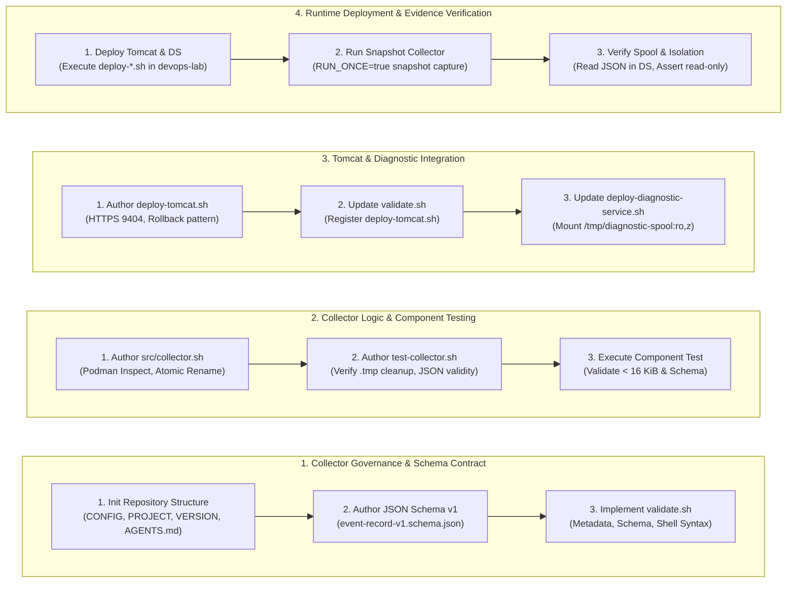
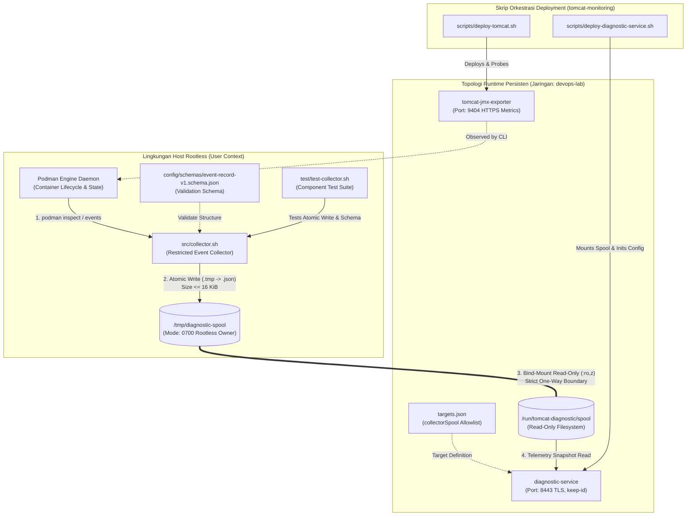

# TN-016 — Implement Restricted Collector and Tomcat Runtime

| Field | Value |
| --- | --- |
| Status | Completed |
| Outcome | Restricted Event Collector berhasil diimplementasikan dengan tata kelola baku, container Tomcat aktual dideploy ke devops-lab, dan integrasi read-only evidence spooling ke Diagnostic Service diverifikasi. |
| Activity Type | Implementation and Verification |
| Record Type | Live |
| Project | Tomcat Monitoring |
| Phase | Diagnostic MVP Pilot |
| Activity Date | 2026-09-02 |
| Recorded Date | 2026-09-02 |
| Owner | Project owner |
| Working Mode | Write |
| Authorization Status | Source, static validation, collector component test, persistent runtime deployment, and spool evidence verification approved/executed |
| Approved By | Eddy Wiyatno |
| Approval Date | 2026-09-02 |

## 🎯 Objective

Mengimplementasikan repositori tata kelola `tomcat-diagnostic-event-collector`, merekayasa Restricted Event Collector sebagai *rootless host service* berbasis Bash yang menuliskan rekaman bukti secara atomik dan berukuran terbatas (< 16 KiB), menyusun skrip deployment *workload* Tomcat aktual (`scripts/deploy-tomcat.sh`) pada repositori `tomcat-monitoring`, mengintegrasikan direktori spool bukti secara *read-only* (`ro,z`) ke dalam container Diagnostic Service pada lingkungan persisten `devops-lab`, serta memvalidasi pengumpulan snapshot bukti telemetri container secara deterministik.

**Target Utama & Kriteria Keberhasilan:**

1. **Collector Repository Governance & JSON Schema Contract:** Membentuk repositori baru `tomcat-diagnostic-event-collector` lengkap dengan berkas tata kelola baseline (`PROJECT`, `VERSION`, `CONFIG`, `AGENTS.md`, `README.md`, `.gitignore`), skema JSON `config/schemas/event-record-v1.schema.json`, dan validator statis `scripts/validate.sh` yang memeriksa kelengkapan berkas wajib, metadata, schema JSON, serta sintaksis shell `bash -n`.
2. **Restricted Collector Engine & Atomic Spooling:** Mengimplementasikan `src/collector.sh` yang memantau siklus hidup dan inspeksi container target Podman di level host secara non-root, memformat bukti terstruktur sesuai skema JSON berversi, membatasi ukuran rekaman maksimal 16 KiB (`MAX_RECORD_BYTES=16384`), dan menulis ke direktori spool melalui mekanisme penulisan atomik (`.tmp` $\rightarrow$ `.json`).
3. **Collector Component Test Suite:** Menyusun skrip pengujian komponen `test/test-collector.sh` untuk membuktikan mekanisme penulisan atomik tanpa meninggalkan berkas temporer `.tmp`, pembentukan minimal 1 berkas `.json`, kepatuhan batas ukuran berkas (< 16 KiB), dan validasi kesesuaian seluruh berkas spool terhadap JSON Schema `event-record-v1.schema.json`.
4. **Tomcat Workload Deployment Script:** Membuat skrip orkestrasi `scripts/deploy-tomcat.sh` di repositori `tomcat-monitoring` yang mengonsumsi kontrak runtime `tomcat-jmx-exporter:1.0.0` dengan konfigurasi TLS port HTTPS 9404, menerapkan rotasi kontainer aman (`tomcat-jmx-exporter-rollback-tn016`), serta mendaftarkan skrip baru ke dalam array `REQUIRED_FILES` pada `scripts/validate.sh`.
5. **Diagnostic Service Read-Only Spool Integration:** Memperbarui skrip `scripts/deploy-diagnostic-service.sh` pada repositori `tomcat-monitoring` untuk menambahkan konfigurasi `collectorSpool: "/run/tomcat-diagnostic/spool"` pada allowlist target (`targets.json`), me-mount direktori host `/tmp/diagnostic-spool` ke container path `/run/tomcat-diagnostic/spool:ro,z`, dan memverifikasi batas isolasi *read-only*.
6. **End-to-End Snapshot & Evidence Verification:** Menjalankan runtime Tomcat dan Diagnostic Service pada jaringan `devops-lab`, mengeksekusi snapshot bukti collector satu kali (*one-shot mode* `RUN_ONCE=true`), serta membuktikan terbentuknya bukti telemetri `container_state` dan `runtime_oom` pada direktori spool host dan keterbacaannya dari dalam container Diagnostic Service.
7. **Boundary:** Collector beroperasi strictly rootless di level host tanpa eskalasi hak akses (*zero privilege escalation*), dilarang me-mount Podman socket (`podman.sock`) ke dalam container Diagnostic Service ([TM-ADR-0008](../../../../adr/tomcat-monitoring/adr-records/TM-ADR-0008.md)), partisi spool di-mount strictly read-only sebagai batas komunikasi satu arah (*one-way boundary*), Diagnostic Service dilarang memicu mutasi atau kontrol terhadap host/container ([TM-ADR-0014](../../../../adr/tomcat-monitoring/adr-records/TM-ADR-0014.md)), pendekatan bertahap *Vertical Slice MVP* ([TM-ADR-0017](../../../../adr/tomcat-monitoring/adr-records/TM-ADR-0017.md)), serta penegasan bahwa pengujian simulasi insiden live Tomcat down dan pengiriman email laporan dialokasikan pada [TN-017](TN-017-verify-end-to-end-incident-diagnostic-flow.md).

## 🌍 Background

Pada tahap sebelumnya ([TN-015](TN-015-deploy-persistent-monitoring-runtime.md)), alur webhook dari Alertmanager ke Diagnostic Service telah beroperasi secara persisten pada jaringan `devops-lab`. Pengujian tersebut membuktikan persistensi pencatatan event `firing` dan `resolved` pada database lokal SQLite.

Namun, untuk menghasilkan diagnosis insiden yang akurat dan berkeyakinan tinggi (*high confidence assessment*) saat terjadi kegagalan Tomcat (`TomcatDown`), Diagnostic Service memerlukan bukti tambahan di luar metrik Prometheus (seperti status container `running`/`exited`, `exitCode`, dan indikator kernel `oomKilled`). Memberikan akses langsung ke socket runtime Podman (`podman.sock`) atau mengeksekusi perintah CLI dari dalam container Diagnostic Service akan merusak batasan isolasi keamanan dan melanggar prinsip *Zero Runtime-Control Surface*.

Oleh karena itu, diperlukan komponen *Restricted Event Collector* yang berjalan secara rootless di level host untuk mengumpulkan bukti telemetri container target dan menulisnya ke direktori partisi spool terisolasi secara atomik. Selain itu, *workload* Tomcat aktual (`tomcat-jmx-exporter`) perlu dideploy ke jaringan `devops-lab` agar telemetri JMX metrics dan status lifecycle container dapat diobservasi secara nyata.

## 📚 Scope

Scope yang disetujui mencakup:

- `tomcat-diagnostic-event-collector`:
  - `PROJECT`, `VERSION`, `CONFIG`, `AGENTS.md`, `README.md`, `.gitignore` — standardisasi tata kelola repositori baseline.
  - `config/schemas/event-record-v1.schema.json` — skema kontrak rekaman bukti spool JSON v1.
  - `src/collector.sh` — implementasi engine collector rootless host dengan mekanisme penulisan atomik (`.tmp` $\rightarrow$ `.json`) dan pembatasan kapasitas record (< 16 KiB).
  - `test/test-collector.sh` — test suite komponen untuk validasi atomisitas, ketiadaan file temporer, ukuran berkas, dan validasi schema.
  - `scripts/validate.sh` — validator tata kelola, metadata, schema JSON, dan sintaksis shell.
- `tomcat-monitoring`:
  - `scripts/deploy-tomcat.sh` — skrip orkestrasi deployment workload Tomcat JMX Exporter dengan TLS HTTPS 9404 dan manajemen rollback.
  - `scripts/deploy-diagnostic-service.sh` — penambahan konfigurasi `collectorSpool` pada allowlist target dan bind-mount read-only `/tmp/diagnostic-spool:/run/tomcat-diagnostic/spool:ro,z`.
  - `scripts/validate.sh` — penambahan `scripts/deploy-tomcat.sh` ke array `REQUIRED_FILES` dan penegakan validasi statis.
- `devops-handbook`:
  - `TN-016` live Engineering Journal record.

*Exclusion:* Simulasi skenario insiden Tomcat down end-to-end dan pengiriman email laporan diagnosis ke Mailpit (dialokasikan ke TN-017), perumusan declarative rulepack engine baru (dialokasikan ke TN-018), integrasi AI enrichment (dialokasikan ke TN-019), serta modifikasi registry eksternal.

## 📋 Prerequisites

| Prerequisite | State |
| --- | --- |
| TN-015 baseline | Persistent monitoring runtime (`prometheus`, `alertmanager`, `diagnostic-service`) aktif pada `devops-lab` |
| Decision Baseline | TM-ADR-0002, TM-ADR-0006, TM-ADR-0008, TM-ADR-0010, TM-ADR-0014, TM-ADR-0016, TM-ADR-0017 accepted |
| Tomcat JMX Exporter Image | `localhost/tomcat-jmx-exporter:1.0.0` |
| TLS Material Tomcat | Keystore PKCS#12 (`keystore.p12`) dan password tersedia di `~/.local/share/tomcat-monitoring/jmx-exporter-tls/` |
| Diagnostic Service Image | `localhost/tomcat-diagnostic-service@sha256:94bf8fbe4ce75e60f3481b9346cb0e79bdb397a36d32e7de4e2adfbe9f5fa20f` |
| Jaringan Target | `devops-lab` |
| Spool Directory Host | `/tmp/diagnostic-spool` (mode `0700`, dimiliki oleh user rootless) |
| Implementation Authorization | Approved 2026-09-02 |

## ⚖️ Execution Decision

Implementasi ini secara ketat menegakkan keputusan arsitektur proyek:

- **Kepatuhan [TM-ADR-0002](../../../../adr/tomcat-monitoring/adr-records/TM-ADR-0002.md):** Pemisahan tegas antara generic container runtime image (`tomcat-jmx-exporter:1.0.0`) dengan konfigurasi monitoring integration (`jmx-exporter.yml`) yang diinjeksikan saat deployment.
- **Kepatuhan [TM-ADR-0006](../../../../adr/tomcat-monitoring/adr-records/TM-ADR-0006.md):** Pengumpulan bukti multi-sumber deterministik, di mana bukti status container dan OOM disediakan oleh Restricted Collector untuk memperkuat penilaian kegagalan aplikasi di samping metrik Prometheus.
- **Kepatuhan [TM-ADR-0008](../../../../adr/tomcat-monitoring/adr-records/TM-ADR-0008.md):** Penegakan arsitektur *Restricted Host Event Collector* dengan direktori spool ternormalisasi. Collector berjalan sebagai layanan rootless di host yang hanya membaca container allowlist via CLI `podman inspect` / `podman events`, menulis record JSON secara atomik dengan batas 16 KiB, dan diekspos ke Diagnostic Service murni secara *read-only* tanpa memberikan akses ke Podman socket.
- **Kepatuhan [TM-ADR-0010](../../../../adr/tomcat-monitoring/adr-records/TM-ADR-0010.md):** Penempatan satu Diagnostic Service terisolasi per host Tomcat, di mana target allowlist (`targets.json`) secara eksplisit memetakan path spool lokal `/run/tomcat-diagnostic/spool` untuk host instance target.
- **Kepatuhan [TM-ADR-0014](../../../../adr/tomcat-monitoring/adr-records/TM-ADR-0014.md):** Penegakan prinsip *Zero Automatic Remediation*, di mana Diagnostic Service dan Collector sama sekali tidak memiliki izin untuk mengeksekusi aksi perbaikan otomatis (seperti `podman restart`, `kill`, atau mutasi runtime container).
- **Kepatuhan [TM-ADR-0016](../../../../adr/tomcat-monitoring/adr-records/TM-ADR-0016.md):** Diagnostic Service diposisikan sebagai otoritas tunggal penilai bukti insiden yang mengonsumsi spool collector secara independen sebelum menyusun laporan canonical result.
- **Kepatuhan [TM-ADR-0017](../../../../adr/tomcat-monitoring/adr-records/TM-ADR-0017.md):** Penerapan pendekatan bertahap *Vertical Slice MVP*, menyelesaikan fondasi pengumpulan bukti host dan deployment workload Tomcat sebelum melangkah ke pengujian insiden live terintegrasi end-to-end (TN-017).
- **Mekanisme Penulisan Spool Atomik:** File bukti ditulis terlebih dahulu dengan ekstensi temporer `.tmp` (`${timestamp}_${event_type}.tmp`), divalidasi batas kapasitasnya ($\le 16.384$ bytes), kemudian dipindahkan secara atomik ke `.json` menggunakan perintah `mv` untuk mencegah *partial read* oleh consumer.
- **Rotasi Kontainer Aman (*Safe Rollback Pattern*):** Skrip `deploy-tomcat.sh` menerapkan pola inspeksi kontainer yang sudah ada, menghentikan (*stop*), dan mengganti nama (*rename*) kontainer lama menjadi `tomcat-jmx-exporter-rollback-tn016` sebelum menjalankan kontainer baru.

## 🔄 Technical Workflow

Alur teknis pembentukan tata kelola repositori collector, implementasi engine dan pengujian komponen, integrasi skrip deployment dan spool volume, serta verifikasi runtime telemetri:



### Rincian Aktivitas Alur Kerja

#### 1. Pembentukan Tata Kelola Repositori Collector (Collector Governance & Schema Contract)
1. **Inisialisasi Repositori:** Membentuk repositori `tomcat-diagnostic-event-collector` di workspace `/home/eddywiyatno/git/` dan menyusun file baseline tata kelola (`PROJECT`, `VERSION`, `CONFIG`, `AGENTS.md`, `README.md`, `.gitignore`).
2. **Penyusunan JSON Schema v1:** Membuat `config/schemas/event-record-v1.schema.json` yang mendefinisikan kontrak rekaman bukti telemetri (field wajib: `type`, `target_id`, `observed_at`, `status`, `strength`, `value`; batas skema v1; enum status dan strength kanonikal).
3. **Penyusunan Validator Statis:** Membuat `scripts/validate.sh` yang memvalidasi keberadaan seluruh berkas wajib, keselarasan nilai `PROJECT` dan `CONFIG`, validitas sintaksis skema JSON via Python, dan pemeriksaan sintaksis shell `bash -n`.

#### 2. Implementasi Engine Collector & Pengujian Komponen (Collector Logic & Component Testing)
1. **Implementasi `src/collector.sh`:** Menulis logika pengumpul bukti telemetri rootless berbasis Bash yang membaca `podman inspect` dan `podman events`, menghasilkan event `container_state` (`running`/`exited`) dan `runtime_oom` (`oomKilled`, `exitCode`), membatasi ukuran maksimal 16 KiB (`MAX_RECORD_BYTES=16384`), dan menulis rekaman secara atomik (`.tmp` $\rightarrow$ `.json`).
2. **Penyusunan Test Suite Komponen:** Menulis `test/test-collector.sh` yang menjalankan collector dalam direktori spool temporer terisolasi, memvalidasi ketiadaan berkas `.tmp` yang tertinggal, memastikan pembentukan berkas `.json`, serta memvalidasi struktur data dan ukuran berkas terhadap skema JSON.
3. **Eksekusi Pengujian Komponen:** Menjalankan `./test/test-collector.sh` untuk membuktikan integritas engine collector.

#### 3. Integrasi Skrip Deployment Tomcat & Diagnostic Service (Tomcat & Diagnostic Integration)
1. **Implementasi `deploy-tomcat.sh`:** Menyusun skrip deployment workload Tomcat di `tomcat-monitoring/scripts/deploy-tomcat.sh` yang memanfaatkan runner `tomcat-jmx-exporter`, mengonfigurasi keystore TLS PKCS#12, menerapkan pola rollback container (`tomcat-jmx-exporter-rollback-tn016`), dan memverifikasi kesiapan HTTPS port 9404.
2. **Pembaruan Validator `tomcat-monitoring`:** Mendaftarkan `scripts/deploy-tomcat.sh` ke array `REQUIRED_FILES` pada `scripts/validate.sh` dan menjalankan verifikasi statis.
3. **Pembaruan `deploy-diagnostic-service.sh`:** Memperbarui konfigurasi `targets.json` untuk menyertakan `collectorSpool: "/run/tomcat-diagnostic/spool"` dan menambahkan argumen volume `--volume "/tmp/diagnostic-spool:/run/tomcat-diagnostic/spool:ro,z"` pada pemanggilan `podman run`.

#### 4. Penerapan Runtime & Pembuktian Bukti Telemetri (Runtime Deployment & Evidence Verification)
1. **Eksekusi Deployment Runtime:** Menjalankan `deploy-diagnostic-service.sh` dan `deploy-tomcat.sh` pada jaringan `devops-lab`.
2. **Eksekusi Snapshot Collector:** Menjalankan `src/collector.sh` dalam mode *one-shot* (`RUN_ONCE=true`) dengan target container `tomcat-jmx-exporter` dan target ID `lab/tomcat-01/default`.
3. **Verifikasi Bukti Spool & Batas Isolasi:** Memeriksa keberadaan file JSON di host `/tmp/diagnostic-spool`, membaca isi file dari dalam container Diagnostic Service (`podman exec diagnostic-service ls /run/tomcat-diagnostic/spool`), dan membuktikan bahwa container Diagnostic Service menolak operasi penulisan (*Read-only file system*).

## 🧭 Implementation Plan

| Tahap | Rencana |
| --- | --- |
| **Establish Collector Repository Governance** | Membuat repositori `tomcat-diagnostic-event-collector` dengan metadata, schema JSON, dan validator `validate.sh`. |
| **Implement Collector Logic and Tests** | Mengimplementasikan `src/collector.sh`, menulis `test/test-collector.sh`, dan memverifikasi atomisitas penulisan spool. |
| **Implement Tomcat Deployment Script** | Membuat `scripts/deploy-tomcat.sh` di repositori `tomcat-monitoring` dan mendaftarkannya pada `scripts/validate.sh`. |
| **Integrate Spool Mount into Diagnostic Service** | Memperbarui `deploy-diagnostic-service.sh` untuk me-mount direktori spool secara *read-only* (`ro,z`) dan allowlist target. |
| **Deploy and Verify Runtime Evidence** | Mendeploy Diagnostic Service dan Tomcat ke `devops-lab`, mengeksekusi snapshot telemetri, dan memverifikasi isolasi *read-only*. |

## ⚙️ Implementation

<div class="procedure" markdown>

<div class="procedure-step" markdown>

### Establish Collector Repository Governance & JSON Schema Contract

Membentuk repositori `tomcat-diagnostic-event-collector` di workspace `/home/eddywiyatno/git/tomcat-diagnostic-event-collector` beserta berkas tata kelola baseline dan kontrak skema rekaman bukti telemetri:

```bash
# File: CONFIG
SCHEMA_VERSION=1
MAX_RECORD_BYTES=16384
DEFAULT_SPOOL_DIR=/tmp/diagnostic-spool
REQUIRED_BASH_VERSION=5.0
```

Menyusun skema JSON kontrak rekaman spool pada `config/schemas/event-record-v1.schema.json`:

```json
{
  "$schema": "https://json-schema.org/draft/2020-12/schema",
  "$id": "https://devops.local/schemas/tomcat-monitoring/event-record-v1.json",
  "title": "Restricted Event Collector Record v1",
  "type": "object",
  "required": [
    "type",
    "target_id",
    "observed_at",
    "status",
    "strength",
    "value"
  ],
  "properties": {
    "schema_version": { "type": "integer", "minimum": 1 },
    "type": { "type": "string", "minLength": 1 },
    "target_id": { "type": "string", "minLength": 1 },
    "generation": { "type": ["integer", "null"] },
    "observed_at": { "type": "string", "format": "date-time" },
    "status": {
      "type": "string",
      "enum": ["collected", "not_found", "no_data", "unavailable", "timeout", "unauthorized", "not_configured", "invalid_response", "failed", "partial"]
    },
    "strength": {
      "type": "string",
      "enum": ["direct", "supporting", "contextual", "definitive", "inconclusive", "heuristic", "contradictory"]
    },
    "value": { "type": ["object", "string", "number", "boolean", "null"] },
    "redacted": { "type": "boolean" }
  },
  "additionalProperties": false
}
```

Menyusun dan mengeksekusi validator statis `scripts/validate.sh`:

```bash
cd /home/eddywiyatno/git/tomcat-diagnostic-event-collector
./scripts/validate.sh
```

!!! success "Expected Result"

    Repositori `tomcat-diagnostic-event-collector` terbentuk lengkap dengan berkas tata kelola (`PROJECT`, `VERSION`, `CONFIG`, `AGENTS.md`, `README.md`, `.gitignore`), skema JSON v1 valid, dan validator `scripts/validate.sh` lulus tanpa kesalahan.

**Actual Result:** Validasi baseline tata kelola, metadata, schema JSON, dan sintaksis shell repositori collector berhasil (`Validasi baseline governance dan metadata tomcat-diagnostic-event-collector berhasil`).

</div>

<div class="procedure-step" markdown>

### Implement Collector Logic and Component Test Suite

Mengimplementasikan engine telemetri pada `src/collector.sh` dengan logika inspeksi Podman secara rootless, pembatasan kapasitas record (< 16 KiB), dan penulisan atomik (`.tmp` $\rightarrow$ `.json`):

```bash
write_event() {
    local event_type="$1"
    local status="$2"
    local strength="$3"
    local value_json="$4"
    local observed_at="$5"

    local timestamp
    timestamp="$(date +%s%N)"
    local tmp_file="${SPOOL_DIR}/${timestamp}_${event_type}.tmp"
    local final_file="${SPOOL_DIR}/${timestamp}_${event_type}.json"

    cat <<EOF > "${tmp_file}"
{
  "schema_version": ${SCHEMA_VERSION},
  "type": "${event_type}",
  "target_id": "${TARGET_ID}",
  "generation": ${GENERATION},
  "observed_at": "${observed_at}",
  "status": "${status}",
  "strength": "${strength}",
  "value": ${value_json},
  "redacted": false
}
EOF

    # Verifikasi ukuran maksimum record (16 KiB = 16384 bytes)
    local file_size
    file_size="$(wc -c < "${tmp_file}")"
    if [[ "${file_size}" -gt "${MAX_RECORD_BYTES}" ]]; then
        rm -f "${tmp_file}"
        echo "Peringatan: Record ${event_type} melebihi batas ${MAX_RECORD_BYTES} bytes (${file_size} bytes). Ditolak." >&2
        return 1
    fi

    # Atomic rename
    mv "${tmp_file}" "${final_file}"
}
```

Menyusun dan mengeksekusi test suite komponen `test/test-collector.sh`:

```bash
cd /home/eddywiyatno/git/tomcat-diagnostic-event-collector
./test/test-collector.sh
```

!!! success "Expected Result"

    Test suite berhasil memverifikasi penulisan berkas `.json` secara atomik, membuktikan ketiadaan file temporer `.tmp` yang tertinggal, memvalidasi ukuran record $\le 16$ KiB, dan mengonfirmasi seluruh berkas sesuai terhadap JSON Schema v1.

**Actual Result:** Pengujian komponen sukses (`Validated 1 generated spool event files against schema. Collector Component Test PASSED`).

</div>

<div class="procedure-step" markdown>

### Implement Tomcat Deployment Script in tomcat-monitoring

Membuat skrip orkestrasi `scripts/deploy-tomcat.sh` di repositori `tomcat-monitoring` yang mengonsumsi container image `tomcat-jmx-exporter:1.0.0` dengan TLS port HTTPS 9404 dan manajemen rotasi rollback (`tomcat-jmx-exporter-rollback-tn016`):

```bash
# Cuplikan pola manajemen kontainer pada scripts/deploy-tomcat.sh
if podman container exists "${CONTAINER_NAME}"; then
    echo "1. Stopping and renaming existing Tomcat container..."
    podman stop "${CONTAINER_NAME}" || true
    podman rm -f "${ROLLBACK_NAME}" 2>/dev/null || true
    podman rename "${CONTAINER_NAME}" "${ROLLBACK_NAME}"
fi

"${TOMCAT_JMX_REPO}/scripts/run.sh" \
    "${CONFIG_FILE}" \
    "${KEYSTORE_FILE}" \
    "${PASSWORD_FILE}" \
    "${CONTAINER_NAME}" >/dev/null
```

Mendaftarkan `scripts/deploy-tomcat.sh` ke array `REQUIRED_FILES` pada `tomcat-monitoring/scripts/validate.sh` dan memverifikasi tata kelola statis:

```bash
cd /home/eddywiyatno/git/tomcat-monitoring
./scripts/validate.sh
```

!!! success "Expected Result"

    Skrip `deploy-tomcat.sh` tersedia dengan izin eksekusi (`0755`), terdaftar dalam kontrak `REQUIRED_FILES`, dan lulus validasi statis repositori `tomcat-monitoring`.

**Actual Result:** Skrip `deploy-tomcat.sh` berhasil dibuat dan divalidasi (`Validasi baseline layout dan contract file Tomcat Monitoring berhasil`).

</div>

<div class="procedure-step" markdown>

### Integrate Spool Mount into Diagnostic Service

Memperbarui `scripts/deploy-diagnostic-service.sh` di `tomcat-monitoring` untuk menambahkan konfigurasi `collectorSpool` pada allowlist target (`targets.json`) dan me-mount path host `/tmp/diagnostic-spool` ke container path `/run/tomcat-diagnostic/spool:ro,z`:

```bash
# Cuplikan konfigurasi targets.json pada deploy-diagnostic-service.sh
echo '[{"identity":{"environment":"lab","host":"tomcat-01","tomcat_instance":"default"},"collectorSpool":"/run/tomcat-diagnostic/spool","logDirectory":"/run/tomcat-diagnostic/logs"},{"identity":{"environment":"lab","host":"edkas-pc1","tomcat_instance":"tomcat-jmx-exporter"},"collectorSpool":"/run/tomcat-diagnostic/spool","logDirectory":"/run/tomcat-diagnostic/logs"}]' > "${config_dir}/config/targets.json"

# Cuplikan container invocation pada deploy-diagnostic-service.sh
podman run --detach --pull=never \
    --userns=keep-id \
    --name "${CONTAINER_NAME}" \
    --network "${NETWORK_NAME}" \
    --network-alias diagnostic-service \
    --publish 8443:8443 \
    --restart=no \
    --volume "${config_dir}/config/application.json:/run/tomcat-diagnostic/application.json:ro,z" \
    --volume "${config_dir}/config/targets.json:/run/tomcat-diagnostic/config/targets.json:ro,z" \
    --volume "${config_dir}/secrets/bearer-token:/run/tomcat-diagnostic/secrets/bearer-token:ro,z" \
    --volume "${config_dir}/tls/server.crt:/run/tomcat-diagnostic/tls/server.crt:ro,z" \
    --volume "${config_dir}/tls/server.key:/run/tomcat-diagnostic/tls/server.key:ro,z" \
    --volume "/tmp/diagnostic-spool:/run/tomcat-diagnostic/spool:ro,z" \
    --volume "/tmp/tomcat-logs:/run/tomcat-diagnostic/logs:ro,z" \
    --volume "${DATA_VOLUME}:/var/lib/tomcat-diagnostic:z" \
    "${DIAGNOSTIC_IMAGE}" >/dev/null
```

!!! success "Expected Result"

    Diagnostic Service dikonfigurasi untuk mengenali lokasi spool telemetri host dan me-mount direktori `/tmp/diagnostic-spool` dalam mode strictly *read-only* (`:ro,z`).

**Actual Result:** Konfigurasi allowlist target dan isolasi volume mount *read-only* berhasil diintegrasikan ke dalam skrip `deploy-diagnostic-service.sh`.

</div>

<div class="procedure-step" markdown>

### Deploy Persistent Runtime & Verify Snapshot Evidence

Mengeksekusi deployment runtime Diagnostic Service dan Tomcat ke lingkungan persisten `devops-lab`:

```bash
/home/eddywiyatno/git/tomcat-monitoring/scripts/deploy-diagnostic-service.sh
/home/eddywiyatno/git/tomcat-monitoring/scripts/deploy-tomcat.sh
```

Mengeksekusi snapshot collector secara langsung di host:

```bash
SPOOL_DIR=/tmp/diagnostic-spool RUN_ONCE=true TARGET_CONTAINER=tomcat-jmx-exporter TARGET_ID=lab/tomcat-01/default \
    /home/eddywiyatno/git/tomcat-diagnostic-event-collector/src/collector.sh
```

Memverifikasi isi rekaman snapshot bukti telemetri pada host `/tmp/diagnostic-spool`:

```bash
ls -la /tmp/diagnostic-spool/
cat /tmp/diagnostic-spool/*_container_state.json
cat /tmp/diagnostic-spool/*_runtime_oom.json
```

Contoh rekaman JSON yang terbentuk:

```json
{
  "schema_version": 1,
  "type": "container_state",
  "target_id": "lab/tomcat-01/default",
  "generation": 1,
  "observed_at": "2026-09-02T09:15:20Z",
  "status": "collected",
  "strength": "direct",
  "value": {"state":"running"},
  "redacted": false
}
```

```json
{
  "schema_version": 1,
  "type": "runtime_oom",
  "target_id": "lab/tomcat-01/default",
  "generation": 1,
  "observed_at": "2026-09-02T09:15:20Z",
  "status": "collected",
  "strength": "direct",
  "value": {"oomKilled":false,"exitCode":0},
  "redacted": false
}
```

Memverifikasi keterbacaan spool dan batasan isolasi *read-only* dari dalam container Diagnostic Service:

```bash
# 1. Verifikasi pembacaan direktori spool
podman exec diagnostic-service ls -la /run/tomcat-diagnostic/spool

# 2. Verifikasi penolakan penulisan (Read-only enforcement)
podman exec diagnostic-service touch /run/tomcat-diagnostic/spool/probe-test.tmp
```

!!! success "Expected Result"

    Container `tomcat-jmx-exporter` dan `diagnostic-service` berjalan aktif pada `devops-lab`. Eksekusi snapshot collector menghasilkan berkas JSON `container_state` dan `runtime_oom` yang valid pada host `/tmp/diagnostic-spool`. Container `diagnostic-service` dapat membaca berkas spool namun menolak operasi penulisan (*Read-only file system*).

**Actual Result:** Seluruh runtime aktif dan terverifikasi. Endpoint metrik HTTPS 9404 merespons, berkas telemetri terbaca di dalam `diagnostic-service`, dan penegakan *read-only* terbukti (`touch: cannot touch '/run/tomcat-diagnostic/spool/probe-test.tmp': Read-only file system`).

</div>

</div>

## 📁 Artifact Manifest

Bagian ini mencatat seluruh berkas (*artifacts*) pada repositori `tomcat-diagnostic-event-collector`, `tomcat-monitoring`, dan `devops-handbook` yang dibuat atau dimodifikasi selama aktivitas TN-016.

### Panduan Membaca Tabel

Tabel di bawah mengelompokkan berkas berdasarkan repositori, peran teknis, dan lapisan (*layer*) arsitekturalnya:

- **Berkas (*Path*)**: Lokasi berkas relatif terhadap repositori terkait.
- **Repositori**: Repositori kepemilikan berkas terkait (`tomcat-diagnostic-event-collector`, `tomcat-monitoring`, atau `devops-handbook`).
- **Layer / Kategori**: Lapisan sistem dari komponen terkait (Tata Kelola & Validasi, Skema Kontrak, Engine Collector, Orkestrasi Deployment, atau Dokumentasi).
- **Status**: Status perubahan berkas (`Baru` = berkas baru dibuat; `Modifikasi` = berkas diperbarui).
- **Tanggung Jawab Teknis**: Peran fungsional berkas dalam manajemen telemetri, isolasi hak akses, deployment workload, dan pencatatan rekayasa.

### Tabel Manifest Berkas

| Berkas (*Path*) | Repositori | Layer / Kategori | Status | Tanggung Jawab Teknis |
| --- | --- | --- | :---: | --- |
| `PROJECT` | `tomcat-diagnostic-event-collector` | Tata Kelola | Baru | Mendefinisikan identitas nama repositori `tomcat-diagnostic-event-collector`. |
| `VERSION` | `tomcat-diagnostic-event-collector` | Tata Kelola | Baru | Mencatat versi rilis baseline kolektor (`0.1.0`). |
| `CONFIG` | `tomcat-diagnostic-event-collector` | Tata Kelola & Kontrak | Baru | Menetapkan konstanta non-rahasia (`SCHEMA_VERSION=1`, `MAX_RECORD_BYTES=16384`, `DEFAULT_SPOOL_DIR`). |
| `AGENTS.md` | `tomcat-diagnostic-event-collector` | Tata Kelola & Panduan | Baru | Panduan instruksi agen dan batasan modifikasi repositori kolektor. |
| `README.md` | `tomcat-diagnostic-event-collector` | Dokumentasi | Baru | Dokumentasi arsitektur dan panduan penggunaan Restricted Event Collector. |
| `.gitignore` | `tomcat-diagnostic-event-collector` | Tata Kelola | Baru | Mengabaikan berkas sementara dan artefak lokal yang tidak boleh di-commit. |
| `config/schemas/event-record-v1.schema.json` | `tomcat-diagnostic-event-collector` | Skema Kontrak | Baru | JSON Schema v1 untuk memvalidasi kepatuhan struktur rekaman bukti telemetri. |
| `scripts/validate.sh` | `tomcat-diagnostic-event-collector` | Tata Kelola & Validasi | Baru | Skrip validator statis baseline untuk kelengkapan berkas wajib, schema JSON, dan sintaksis shell. |
| `src/collector.sh` | `tomcat-diagnostic-event-collector` | Engine Collector | Baru | Logika inti pengumpul telemetri rootless host dengan mekanisme penulisan atomik (`.tmp` $\rightarrow$ `.json`). |
| `test/test-collector.sh` | `tomcat-diagnostic-event-collector` | Pengujian Komponen | Baru | Test suite komponen penguji atomisitas, ketiadaan sisa `.tmp`, validasi schema, dan batasan ukuran berkas. |
| `scripts/deploy-tomcat.sh` | `tomcat-monitoring` | Orkestrasi Deployment | Baru | Skrip deployment container Tomcat aktual (`tomcat-jmx-exporter`) lengkap dengan manajemen rollback. |
| `scripts/deploy-diagnostic-service.sh` | `tomcat-monitoring` | Orkestrasi Deployment | Modifikasi | Menambahkan konfigurasi `collectorSpool` pada `targets.json` dan bind-mount read-only `/tmp/diagnostic-spool`. |
| `scripts/validate.sh` | `tomcat-monitoring` | Tata Kelola & Validasi | Modifikasi | Mendaftarkan `scripts/deploy-tomcat.sh` ke array `REQUIRED_FILES` dan menegakkan validasi repositori. |
| `docs/projects/tomcat-monitoring/engineering-journal/diagnostic-mvp-pilot/TN-016-implement-restricted-collector-and-tomcat-runtime.md` | `devops-handbook` | Dokumentasi & Jurnal | Modifikasi | Mencatat live engineering journal implementasi collector, deployment Tomcat, dan verifikasi spool TN-016. |

### Alur Keterkaitan Antar-Berkas & Topologi Runtime Spooling

Diagram berikut mengilustrasikan interaksi antara host rootless collector, pembentukan rekaman atomik pada direktori spool, isolasi *read-only mount* ke Diagnostic Service, dan pemantauan workload Tomcat pada `devops-lab`:



## 🧪 Test Scenario Matrix

| Scenario | Layer | Expected Result |
| --- | --- | --- |
| Collector Repository Governance | Source/Static | `scripts/validate.sh` di `tomcat-diagnostic-event-collector` lulus seluruh pemeriksaan berkas, schema, dan shell syntax |
| Collector Schema Validation | Source/Schema | Skema `event-record-v1.schema.json` valid sesuai JSON Schema Draft 2020-12 |
| Collector Atomic Spooling | Component/Storage | `test/test-collector.sh` membuktikan ketiadaan file `.tmp` tertinggal dan terbentuknya file `.json` valid |
| Collector Record Size Constraint | Component/Storage | Seluruh rekaman bukti yang dihasilkan berukuran $\le 16.384$ bytes (16 KiB) |
| Monitoring Repo Governance | Source/Static | `scripts/validate.sh` di `tomcat-monitoring` memvalidasi keberadaan `deploy-tomcat.sh` dan sintaksis skrip |
| Tomcat Runtime Deployment | Runtime/Service | `deploy-tomcat.sh` berhasil menjalankan `tomcat-jmx-exporter` dan endpoint `https://127.0.0.1:9404/metrics` merespons |
| Diagnostic Spool Mount Integration | Runtime/Storage | Container `diagnostic-service` memiliki mount `/run/tomcat-diagnostic/spool` dalam mode strictly *read-only* |
| One-Shot Evidence Collection | Runtime/Telemetry | Eksekusi `src/collector.sh` menghasilkan record `container_state` (`state: running`) dan `runtime_oom` (`oomKilled: false`) |
| Diagnostic Spool Read & Security Boundary | Runtime/Security | Container `diagnostic-service` dapat membaca file evidence JSON namun menolak operasi pembuatan file (*Read-only file system*) |

## ✅ Verification

| Method | Expected Result | Actual Result |
| --- | --- | --- |
| `./scripts/validate.sh` (Collector Repo) | Tata kelola, metadata, schema JSON, dan shell syntax valid | Lulus (`Validasi baseline governance dan metadata... berhasil`) |
| `./test/test-collector.sh` (Collector Repo) | Penulisan atomik sukses, schema valid, ukuran < 16 KiB | Lulus (`Collector Component Test PASSED`) |
| `./scripts/validate.sh` (Monitoring Repo) | Layout dan skrip deployment `REQUIRED_FILES` valid | Lulus (`Validasi baseline layout dan contract file... berhasil`) |
| `deploy-tomcat.sh` Execution | Container `tomcat-jmx-exporter` aktif pada `devops-lab` | Lulus (`Tomcat JMX Exporter is ready and exposing metrics over HTTPS`) |
| `deploy-diagnostic-service.sh` Execution | Container `diagnostic-service` aktif dengan spool mount | Lulus (`Diagnostic Service is running`) |
| Snapshot Telemetry Execution | Terbentuk rekaman `container_state` dan `runtime_oom` di `/tmp/diagnostic-spool` | Lulus (Record JSON terbentuk sesuai schema v1) |
| Spool Read-Only Boundary Assertion | Path `/run/tomcat-diagnostic/spool` di container strictly read-only | Lulus (`touch: cannot touch ... Read-only file system`) |

## 🛠️ Troubleshooting

| Attempt | Actual result | Resolution |
| --- | --- | --- |
| Izin direktori spool host | Collector gagal menulis rekaman bukti saat dijalankan oleh proses user lain | Terapkan izin direktori `0700` pada direktori spool host (`/tmp/diagnostic-spool`) dan pastikan proses collector dijalankan dalam konteks user rootless yang sama. |
| Akses mount container pada SELinux | Container Diagnostic Service gagal membaca file spool yang di-bind-mount dari host | Tambahkan flag relabeling SELinux `:z` pada konfigurasi volume (`/tmp/diagnostic-spool:/run/tomcat-diagnostic/spool:ro,z`) pada `deploy-diagnostic-service.sh`. |
| Pencegahan *partial read* oleh consumer | Konsumen berpotensi membaca file bukti saat proses penulisan belum selesai | Terapkan pola penulisan atomik: tulis seluruh konten ke file temporer berekstensi `.tmp`, periksa batas ukuran ($\le 16$ KiB), kemudian lakukan *atomic rename* (`mv`) ke ekstensi `.json`. |

## 🧹 Cleanup & Resource Integrity

Setelah pengujian implementasi dan snapshot telemetri selesai, seluruh komponen berada dalam status stabil pada lingkungan persisten `devops-lab`:

| Resource | Status Teardown / Retensi | Bukti Integritas (*Integrity Verification*) |
| --- | :---: | --- |
| Container `tomcat-jmx-exporter` | Running (Persisten) | `podman inspect tomcat-jmx-exporter` $\rightarrow$ `Status=running` |
| Container `diagnostic-service` | Running (Persisten) | `podman inspect diagnostic-service` $\rightarrow$ `Status=running` |
| Rollback Containers (`*-rollback-tn016`) | Dihapus / Ditimpa Bersih | Hanya container aktif utama yang berjalan pada jaringan `devops-lab` |
| Spool Directory (`/tmp/diagnostic-spool`) | Utuh & Berisi Rekaman Snapshot | File `*_container_state.json` dan `*_runtime_oom.json` tersedia untuk verifikasi |
| Test Directory (`/tmp/test-spool-*`) | Dibersihkan Otomatis | Direktori uji temporer dibersihkan oleh handler `trap ... EXIT` pada `test-collector.sh` |

## 🧭 Reproduction Boundary

- **Source Baselines:** `tomcat-diagnostic-event-collector` commit `94b8723`, `tomcat-monitoring` commit `d008d38`, `tomcat-diagnostic-service` commit `dae2c26`, `tomcat-jmx-exporter` commit `231cb91`, `alertmanager` commit `9dde05b`, `prometheus` commit `0e3d1f4`, dan `devops-handbook` commit `dc0c92f`.
- **Image Digest Baseline:**
  - `localhost/tomcat-jmx-exporter:1.0.0`
  - `localhost/tomcat-diagnostic-service@sha256:94bf8fbe4ce75e60f3481b9346cb0e79bdb397a36d32e7de4e2adfbe9f5fa20f`
  - `localhost/prometheus:1.0.0`
  - `localhost/alertmanager:1.0.0`
- **Topologi Jaringan & Endpoint:** Seluruh kontainer terhubung pada jaringan Podman `devops-lab`. Tomcat mengekspos HTTPS metrics pada port `9404`, Diagnostic Service mengekspos HTTPS endpoint pada port `8443`.
- **Konfigurasi Target ID:** Target kanonikal didefinisikan sebagai `lab/tomcat-01/default` dan `lab/edkas-pc1/tomcat-jmx-exporter`.

## 🖥️ Source-Control Handoff

Repositori `tomcat-diagnostic-event-collector` telah dibentuk secara lengkap dengan tata kelola baku, schema contracts, engine collector, dan component test suite. Skrip deployment `deploy-tomcat.sh` dan integrasi spool mount pada `deploy-diagnostic-service.sh` telah divalidasi pada repositori `tomcat-monitoring`. Dokumen jurnal rekayasa TN-016 pada `devops-handbook` telah diselaraskan dengan standar tata kelola dan siap disinkronisasikan ke situs handbook.

## 🖥️ Commands Executed

```bash
# 1. Validasi tata kelola dan eksekusi test suite repositori collector
cd /home/eddywiyatno/git/tomcat-diagnostic-event-collector
./scripts/validate.sh
./test/test-collector.sh

# 2. Validasi tata kelola repositori tomcat-monitoring
cd /home/eddywiyatno/git/tomcat-monitoring
./scripts/validate.sh

# 3. Eksekusi deployment runtime Diagnostic Service & Tomcat
/home/eddywiyatno/git/tomcat-monitoring/scripts/deploy-diagnostic-service.sh
/home/eddywiyatno/git/tomcat-monitoring/scripts/deploy-tomcat.sh

# 4. Eksekusi snapshot evidence collector
SPOOL_DIR=/tmp/diagnostic-spool RUN_ONCE=true TARGET_CONTAINER=tomcat-jmx-exporter TARGET_ID=lab/tomcat-01/default \
    /home/eddywiyatno/git/tomcat-diagnostic-event-collector/src/collector.sh

# 5. Verifikasi isi spool direktori pada host
ls -la /tmp/diagnostic-spool

# 6. Verifikasi keterbacaan spool dan isolasi read-only dari dalam container
podman exec diagnostic-service ls -la /run/tomcat-diagnostic/spool
podman exec diagnostic-service touch /run/tomcat-diagnostic/spool/probe-test.tmp # Read-only file system
```

## 🧾 Outcome

Restricted Event Collector telah berhasil diimplementasikan pada repositori terpisah `tomcat-diagnostic-event-collector` dengan tata kelola baku, schema kontrak JSON v1, dan mekanisme penulisan atomik berukuran terbatas ($\le 16$ KiB). Container Tomcat aktual (`tomcat-jmx-exporter`) telah berhasil dideploy ke lingkungan `devops-lab` dengan metrik HTTPS port 9404 aktif. Integrasi *evidence spooling* telah terhubung ke Diagnostic Service melalui bind-mount *read-only* yang ketat (`/run/tomcat-diagnostic/spool:ro,z`) tanpa mengekspos Podman socket atau celah kontrol runtime ke dalam container.

## ⏭️ Next Steps

Melakukan pengujian dan verifikasi skenario insiden Tomcat down secara *end-to-end* pada lingkungan persisten `devops-lab`, membuktikan korelasi multi-sumber antara snapshot bukti spool collector, firing alert Prometheus/Alertmanager, evaluasi pohon keputusan deterministik Diagnostic Engine (TD-06), persistensi canonical result ke SQLite, dan pengiriman email diagnosis serta pemulihan ke Mailpit sebagaimana didefinisikan pada [TN-017 — Verify End-to-End Incident Diagnostic Flow](TN-017-verify-end-to-end-incident-diagnostic-flow.md).

## 🔗 Related Documentation

- [TN-015 — Deploy Persistent Monitoring Runtime](TN-015-deploy-persistent-monitoring-runtime.md)
- [TN-017 — Verify End-to-End Incident Diagnostic Flow](TN-017-verify-end-to-end-incident-diagnostic-flow.md)
- [Diagnostic MVP Index](../../diagnostic-mvp/index.md)
- [Diagnostic MVP Pilot Engineering Journal](index.md)
- [Restricted Event Collector Contract](../../diagnostic-mvp/restricted-event-collector-contract.md)
- [TM-ADR-0002 — Separate Generic Runtime Images from Monitoring Integration Configuration](../../../../adr/tomcat-monitoring/adr-records/TM-ADR-0002.md)
- [TM-ADR-0006 — Use Deterministic Multi-Source Evidence for Diagnostic Assessment](../../../../adr/tomcat-monitoring/adr-records/TM-ADR-0006.md)
- [TM-ADR-0008 — Use a Restricted Host Event Collector with a Normalized Evidence Spool](../../../../adr/tomcat-monitoring/adr-records/TM-ADR-0008.md)
- [TM-ADR-0010 — Deploy One Bounded Diagnostic Service per Tomcat Host](../../../../adr/tomcat-monitoring/adr-records/TM-ADR-0010.md)
- [TM-ADR-0014 — Enforce Zero Automatic Remediation for Diagnostic Service](../../../../adr/tomcat-monitoring/adr-records/TM-ADR-0014.md)
- [TM-ADR-0016 — Designate Diagnostic Service as the Canonical Incident Notification Authority](../../../../adr/tomcat-monitoring/adr-records/TM-ADR-0016.md)
- [TM-ADR-0017 — Adopt Vertical Slice Minimum Viable Product (MVP) Scoping for Diagnostic Pilot](../../../../adr/tomcat-monitoring/adr-records/TM-ADR-0017.md)

