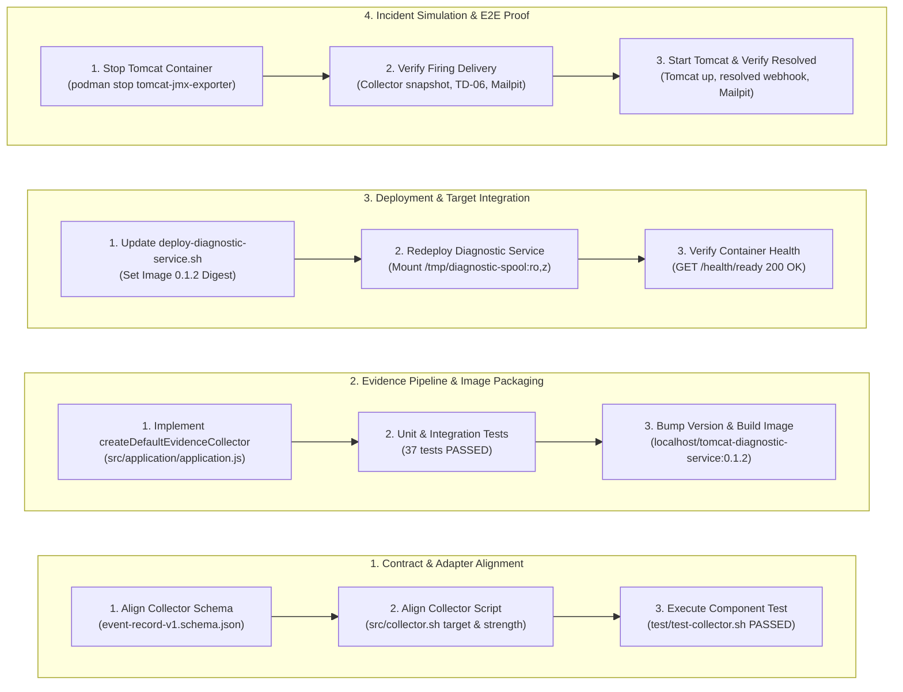
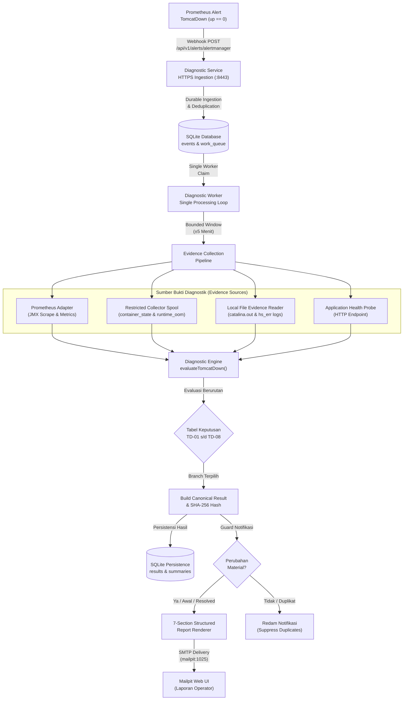
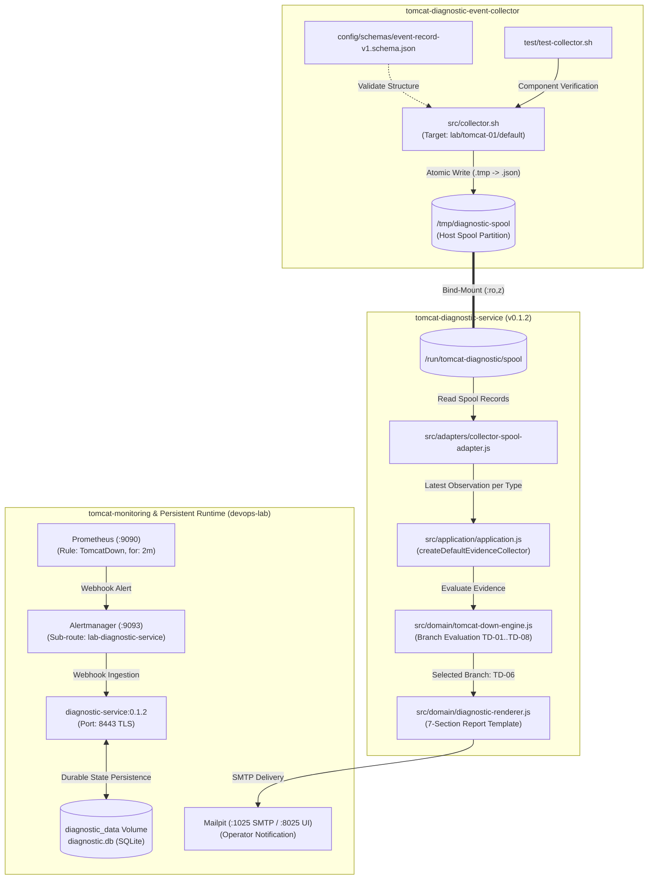

# TN-017 — Verify End-to-End Incident Diagnostic Flow

| Field | Value |
| --- | --- |
| Status | Completed |
| Outcome | Skenario insiden TomcatDown dan pemulihan layanan berhasil diuji dan diverifikasi secara end-to-end pada environment devops-lab, membuktikan korelasi multi-sumber dari Restricted Event Collector, Prometheus, Alertmanager, Diagnostic Service (evaluasi branch TD-06, persistensi SQLite), hingga Mailpit delivery beroperasi secara deterministik. |
| Activity Type | Implementation and Verification |
| Record Type | Live |
| Project | Tomcat Monitoring |
| Phase | Diagnostic MVP Pilot |
| Activity Date | 2026-09-02 |
| Recorded Date | 2026-09-02 |
| Owner | Project owner |
| Working Mode | Write |
| Authorization Status | Source, static validation, application image build, persistent runtime deployment, and end-to-end incident verification approved/executed |
| Approved By | Eddy Wiyatno |
| Approval Date | 2026-09-02 |

## 🎯 Objective

Melakukan pengujian dan pembuktian integrasi operasional *end-to-end* skenario insiden Tomcat down dan pemulihan layanan pada lingkungan persisten `devops-lab`. Membuktikan bahwa *Restricted Event Collector* merekam bukti telemetri container secara atomik ke spool host, Prometheus mendeteksi ketidaksediaan metrik dan memicu alert `TomcatDown`, Alertmanager merutekan webhook ke Diagnostic Service, Diagnostic Service mengumpulkan bukti spool multi-sumber dan mengevaluasi keputusan deterministik (branch **TD-06**), menyimpan *canonical result* ke database SQLite, serta mengirimkan laporan diagnosis insiden (*firing*) dan notifikasi pemulihan (*resolved*) berformat 7-seksi secara lengkap ke Mailpit.

**Target Utama & Kriteria Keberhasilan:**

1. **Collector Contract & Format Alignment:** Menyelaraskan skema dan format rekaman bukti telemetri pada `tomcat-diagnostic-event-collector` (enum `strength`: `direct`, `supporting`, `contextual`; target ID kanonikal: `lab/tomcat-01/default`) agar kompatibel dengan kontrak domain `evidence.js`.
2. **Default Evidence Collector Pipeline Integration:** Mengimplementasikan fungsi `createDefaultEvidenceCollector` pada `tomcat-diagnostic-service` (`src/application/application.js`) yang membaca direktori spool bukti secara terisolasi, membatasi jendela waktu insiden ($\pm 5$ menit), dan menyaring observasi terbaru per tipe bukti (*latest observation per type*) guna mencegah kontradiksi status historis.
3. **Version Bump & Image Packaging:** Mengeksekusi test suite regresi (37 tests lulus), menaikkan versi aplikasi ke `0.1.2`, memvalidasi kepatuhan tata kelola, dan membangun application image `localhost/tomcat-diagnostic-service:0.1.2` dari *immutable base image*.
4. **Persistent Deployment Orchestration:** Memperbarui skrip `scripts/deploy-diagnostic-service.sh` di repositori `tomcat-monitoring` dengan digest image baru `0.1.2` dan melakukan deployment ulang kontainer persisten pada jaringan `devops-lab`.
5. **Live Incident Simulation & TD-06 Verification:** Mengeksekusi simulasi insiden penghentian Tomcat (`podman stop tomcat-jmx-exporter`), memverifikasi pencatatan snapshot atomik spool, firing alert Prometheus/Alertmanager, evaluasi keputusan deterministik branch **TD-06** (*Container exited; cause undetermined*), persistensi *canonical result* dan *evidence summaries* ke database SQLite, serta pengiriman email laporan 7-seksi ke Mailpit.
6. **Recovery Simulation & Resolved Verification:** Mengeksekusi simulasi pemulihan Tomcat (`deploy-tomcat.sh`), memverifikasi transisi alert Prometheus/Alertmanager ke status *resolved*, korelasi riwayat insiden di SQLite, dan pengiriman email notifikasi pemulihan (*resolved*) ke Mailpit.
7. **Boundary:** Seluruh runtime beroperasi pada jaringan internal `devops-lab` dengan volume persisten `diagnostic_data`, direktori spool host di-mount strictly *read-only* (`ro,z`) sebagai batas komunikasi satu arah (*one-way boundary*), penegakan prinsip *Zero Automatic Remediation* ([TM-ADR-0014](../../../../adr/tomcat-monitoring/adr-records/TM-ADR-0014.md)) tanpa auto-restart container, penetapan Diagnostic Service sebagai otoritas notifikasi insiden tunggal ([TM-ADR-0016](../../../../adr/tomcat-monitoring/adr-records/TM-ADR-0016.md)), pembatasan antrean SQLite maksimal 50 ([TM-ADR-0015](../../../../adr/tomcat-monitoring/adr-records/TM-ADR-0015.md)), serta pendekatan bertahap *Vertical Slice MVP* ([TM-ADR-0017](../../../../adr/tomcat-monitoring/adr-records/TM-ADR-0017.md)) di mana penambahan declarative rulepack engine dialokasikan ke [TN-018](TN-018-implement-strict-declarative-rulepack-engine.md).

## 🌍 Background

Pada tahap sebelumnya, persistent runtime monitoring ([TN-015](TN-015-deploy-persistent-monitoring-runtime.md)) dan Restricted Event Collector beserta runtime Tomcat ([TN-016](TN-016-implement-restricted-collector-and-tomcat-runtime.md)) telah berhasil dibangun dan dideploy. Komponen-komponen individual telah teruji pada level unit dan komponen.

Namun, korelasi multi-sumber antara bukti telemetri runtime container dari direktori spool *read-only* ke dalam Diagnostic Service, evaluasi pohon keputusan deterministik TomcatDown (TD-01 s.d. TD-08), persistensi *canonical result* dan ringkasan bukti ke SQLite, serta pengiriman laporan diagnosis insiden riil dan pemulihannya ke Mailpit belum pernah diuji secara *end-to-end* dalam satu skenario terpadu.

Pengujian live ini sangat penting untuk membuktikan bahwa seluruh rantai observabilitas—dari sinyal kegagalan hulu hingga penyampaian rekomendasi tindakan operator di hilir—bekerja secara deterministik, aman, dan tanpa intervensi manual terhadap database atau mailer.

## 📚 Scope

Scope yang disetujui mencakup:

- `tomcat-diagnostic-event-collector`:
  - `config/schemas/event-record-v1.schema.json` — penyelarasan enum `strength` (`direct`, `supporting`, `contextual`) dan status rekaman.
  - `src/collector.sh` — penggunaan canonical target ID `lab/tomcat-01/default` dan enum strength kanonikal.
  - `test/test-collector.sh` — penyesuaian uji komponen terhadap skema yang diselaraskan.
- `tomcat-diagnostic-service`:
  - `src/application/application.js` — implementasi `createDefaultEvidenceCollector` yang mengintegrasikan `readCollectorSpool`, pembatasan window waktu $\pm 5$ menit, dan filter observasi terbaru per tipe bukti.
  - `test/unit/collector-spool-adapter.test.js` — unit test integrasi adapter spool bukti.
  - `VERSION` — kenaikan versi aplikasi ke `0.1.2`.
  - `Dockerfile` & packaging — build application image `localhost/tomcat-diagnostic-service:0.1.2`.
- `tomcat-monitoring`:
  - `scripts/deploy-diagnostic-service.sh` — pembaruan digest image `0.1.2` dan orkestrasi deployment runtime persisten.
  - Eksekusi simulasi insiden live (`podman stop tomcat-jmx-exporter`) dan pemulihan (`scripts/deploy-tomcat.sh`).
- `devops-handbook`:
  - `TN-017` live Engineering Journal record.

*Exclusion:* Perumusan declarative rulepack engine dinamis (dialokasikan ke TN-018), integrasi AI enrichment pipeline (dialokasikan ke TN-019), konsolidasi portfolio fase pilot (dialokasikan ke TN-020), serta modifikasi registry eksternal.

## 📋 Prerequisites

| Prerequisite | State |
| --- | --- |
| TN-015 baseline | Persistent monitoring runtime (`prometheus`, `alertmanager`, `diagnostic-service`) aktif pada `devops-lab` |
| TN-016 baseline | Repositori collector aktif, Tomcat dideploy, dan spool bind-mount terpasang |
| Decision Baseline | TM-ADR-0004 s.d. TM-ADR-0017 accepted |
| Tomcat JMX Exporter Image | `localhost/tomcat-jmx-exporter:1.0.0` (Port HTTPS 9404) |
| Diagnostic Service Source | `tomcat-diagnostic-service` siap untuk bump version `0.1.2` |
| Node.js Toolchain | Node.js 24 ESM (`localhost/nodejs:24.18.0`) |
| Jaringan Target | `devops-lab` |
| Volume Persisten | `diagnostic_data`, `alertmanager_truststore`, `prometheus_truststore` |
| Implementation Authorization | Approved 2026-09-02 |

## ⚖️ Execution Decision

Implementasi ini secara ketat menegakkan keputusan arsitektur proyek:

- **Kepatuhan [TM-ADR-0004](../../../../adr/tomcat-monitoring/adr-records/TM-ADR-0004.md):** Pemisahan tegas antara kegagalan aplikasi Tomcat sesungguhnya dengan kehilangan sinyal monitoring (scrape failure), di mana engine membedakan branch TD-01 (*Tomcat up, scrape path failed*) dengan TD-06 (*Container exited*).
- **Kepatuhan [TM-ADR-0005](../../../../adr/tomcat-monitoring/adr-records/TM-ADR-0005.md):** Penggunaan Mailpit (`mailpit:1025`) sebagai target pengujian notifikasi persisten pada lingkungan lab.
- **Kepatuhan [TM-ADR-0006](../../../../adr/tomcat-monitoring/adr-records/TM-ADR-0006.md):** Pengumpulan bukti multi-sumber deterministik dari metrik Prometheus, telemetri spool container, file log host, dan health probe.
- **Kepatuhan [TM-ADR-0007](../../../../adr/tomcat-monitoring/adr-records/TM-ADR-0007.md):** Memperlakukan `TomcatDown` sebagai pemicu diagnostik komposit yang menginisiasi pengumpulan bukti mendalam.
- **Kepatuhan [TM-ADR-0008](../../../../adr/tomcat-monitoring/adr-records/TM-ADR-0008.md):** Penegakan batas isolasi spool satu arah (*one-way normalized spool*) di mana Diagnostic Service murni membaca direktori spool secara *read-only* (`ro,z`) tanpa akses socket Podman.
- **Kepatuhan [TM-ADR-0009](../../../../adr/tomcat-monitoring/adr-records/TM-ADR-0009.md) & [TM-ADR-0013](../../../../adr/tomcat-monitoring/adr-records/TM-ADR-0013.md):** Penggunaan Node.js 24 ESM bawaan `node:sqlite` untuk persistensi status lokal (`canonical_results`, `evidence_summaries`, `notification_attempts`) pada named volume `diagnostic_data`.
- **Kepatuhan [TM-ADR-0010](../../../../adr/tomcat-monitoring/adr-records/TM-ADR-0010.md):** Penempatan satu instance Diagnostic Service terikat per host Tomcat pada jaringan `devops-lab`.
- **Kepatuhan [TM-ADR-0011](../../../../adr/tomcat-monitoring/adr-records/TM-ADR-0011.md):** Penggunaan tabel keputusan deterministik per aturan (TD-01 s.d. TD-08) dengan prioritas evaluasi berurutan (*top-down priority*).
- **Kepatuhan [TM-ADR-0014](../../../../adr/tomcat-monitoring/adr-records/TM-ADR-0014.md):** Penegakan prinsip *Zero Automatic Remediation*, di mana Diagnostic Service murni bertindak sebagai penyelidik otomatis (*automated investigator*) dan menyusun rekomendasi manual tanpa memicu restart Tomcat.
- **Kepatuhan [TM-ADR-0015](../../../../adr/tomcat-monitoring/adr-records/TM-ADR-0015.md):** Penerimaan webhook asinkron dengan respons HTTP `202 Accepted` dan antrean persisten SQLite kapasitas 50 item.
- **Kepatuhan [TM-ADR-0016](../../../../adr/tomcat-monitoring/adr-records/TM-ADR-0016.md):** Penetapan Diagnostic Service sebagai otoritas tunggal notifikasi insiden yang mengirimkan email terstruktur ke Mailpit.
- **Kepatuhan [TM-ADR-0017](../../../../adr/tomcat-monitoring/adr-records/TM-ADR-0017.md):** Penerapan pendekatan bertahap *Vertical Slice MVP*, menyelesaikan verifikasi skenario `TomcatDown` dasar sebelum memperluas ke engine aturan deklaratif dinamis (TN-018).
- **Penyaringan Observasi Terbaru (*Latest Observation Sifting*):** Logika `createDefaultEvidenceCollector` memetakan bukti spool berdasarkan `type` dan hanya mengambil rekaman dengan timestamp `observedAt` terbaru dalam rentang jendela insiden ($\pm 5$ menit) guna menghindari kontradiksi antara state *running* awal dan state *exited* insiden.
- **Peredaman Notifikasi Duplikat (*Material Update Guard*):** Pengiriman email notifikasi hanya dilakukan jika terdapat perubahan material pada hasil penilaian diagnostik (*diagnostic assessment*) atau transisi status insiden (*firing* $\rightarrow$ *resolved*).

## 🔄 Technical Workflow

Alur teknis penyelarasan kontrak, implementasi pipeline bukti, pengemasan image aplikasi, deployment persisten, dan pembuktian insiden end-to-end:



### Rincian Aktivitas Alur Kerja

#### 1. Penyelarasan Kontrak & Adapter Kolektor (Contract & Adapter Alignment)
1. **Penyelarasan Skema JSON:** Memperbarui `config/schemas/event-record-v1.schema.json` di `tomcat-diagnostic-event-collector` untuk memastikan nilai enum `strength` (`direct`, `supporting`, `contextual`) dan `status` (`collected`, `not_found`, `unavailable`) sesuai dengan kontrak `evidence.js`.
2. **Penyelarasan Target ID & Nilai Strength:** Memperbarui `src/collector.sh` untuk menggunakan target ID kanonikal `lab/tomcat-01/default` dan menetapkan `strength: "direct"` untuk bukti status container dan OOM aktual.
3. **Eksekusi Pengujian Komponen:** Menjalankan `./test/test-collector.sh` untuk membuktikan rekaman spool yang dihasilkan valid terhadap skema.

#### 2. Implementasi Pipeline Bukti & Pengemasan Image (Evidence Pipeline & Image Packaging)
1. **Implementasi Default Evidence Collector:** Menulis fungsi `createDefaultEvidenceCollector` pada `src/application/application.js` di `tomcat-diagnostic-service` yang mengintegrasikan pembacaan spool host (`readCollectorSpool`), mengisolasi jendela waktu insiden ($\pm 5$ menit), dan menyaring observasi terbaru per tipe bukti.
2. **Eksekusi Test Suite Regresi:** Menjalankan `npm test` di dalam kontainer Node.js dan memastikan seluruh 37 unit/integration test cases lulus.
3. **Kenaikan Versi & Pembuatan Image:** Menaikkan berkas `VERSION` menjadi `0.1.2`, mengeksekusi `./scripts/build.sh`, dan memvalidasi application image `localhost/tomcat-diagnostic-service:0.1.2` melalui `./scripts/test-image.sh`.

#### 3. Deployment Persisten & Integrasi Target (Deployment & Target Integration)
1. **Pembaruan Skrip Deployment:** Mengganti digest immutable image pada `scripts/deploy-diagnostic-service.sh` di `tomcat-monitoring` dengan digest kandidat `0.1.2` (`sha256:0dcb912511da5e9fa8c8b75b202cece765dc9096bd55882c86764cd985226f3a`).
2. **Deployment Ulang Runtime:** Mengeksekusi `./scripts/deploy-diagnostic-service.sh` dan `./scripts/deploy-alertmanager.sh` pada jaringan `devops-lab`.
3. **Verifikasi Kesiapan Endpoint:** Memeriksa kesiapan layanan melalui endpoint HTTP `GET /health/ready` yang mengembalikan status `200 OK` (`{"live":true,"ready":true}`).

#### 4. Simulasi Insiden & Pembuktian End-to-End (Incident Simulation & E2E Proof)
1. **Simulasi Tomcat Down:** Menghentikan kontainer Tomcat (`podman stop tomcat-jmx-exporter`) dan mengaktifkan daemon collector untuk merekam bukti `container_state: "exited"` dan `runtime_oom: {"exitCode": 143, "oomKilled": false}` ke spool host.
2. **Verifikasi Alur Firing:** Mengonfirmasi transisi Prometheus rule `TomcatDown` menjadi `firing`, penerimaan webhook oleh Diagnostic Service, evaluasi branch **TD-06**, persistensi *canonical result* ke SQLite, dan penerimaan email laporan 7-seksi di Mailpit.
3. **Simulasi Pemulihan Tomcat:** Menjalankan kembali Tomcat (`scripts/deploy-tomcat.sh`), mengonfirmasi transisi alert ke `resolved`, pemrosesan webhook resolusi oleh Diagnostic Service, dan penerimaan email pemulihan di Mailpit.

## 🧭 Implementation Plan

| Tahap | Rencana |
| --- | --- |
| **Align Collector Contract and Evidence Formats** | Menyelaraskan enum schema dan collector values pada `tomcat-diagnostic-event-collector`. |
| **Implement Default Evidence Collector in Diagnostic Service** | Mengimplementasikan `createDefaultEvidenceCollector` pada `src/application/application.js`, menguji test suite, bump versi ke `0.1.2`, dan build image baru. |
| **Deploy Updated Diagnostic Service Image and Spool Integration** | Memperbarui `deploy-diagnostic-service.sh` dengan digest `0.1.2` dan me-redeploy container persisten. |
| **Execute Incident Simulation and Firing Verification** | Menghentikan container Tomcat, memverifikasi rekaman spool atomik, firing `TomcatDown`, evaluasi branch TD-06, penyimpanan SQLite, dan email *firing* di Mailpit. |
| **Execute Recovery Simulation and Resolved Verification** | Menjalankan kembali Tomcat, memverifikasi rekaman status running, resolusi alert, persistensi SQLite, dan email *resolved* di Mailpit. |

## 🔍 Diagnostic Pipeline and Decision Engine Architecture

Diagnostic Service dirancang sebagai *Automated Incident Investigator* deterministik yang menghubungkan metrik monitoring, telemetri container, dan bukti log ke dalam pohon keputusan (*decision table*):



### ⚖️ Tabel Keputusan Diagnostik (Deterministic Decision Table)

Seluruh bukti yang terkumpul dinormalisasi menjadi objek terstruktur dan dievaluasi secara berurutan (*top-down priority*) oleh engine ([`src/domain/tomcat-down-engine.js`](file:///home/eddywiyatno/git/tomcat-diagnostic-service/src/domain/tomcat-down-engine.js)):

| Branch | Sumber Bukti yang Terkorelasi (*Correlated Evidence*) | Hasil Diagnosis (*Primary Assessment*) | Klasifikasi & Keyakinan |
| :---: | :--- | :--- | :--- |
| **TD-08** | Ditemukan bukti kontradiktif (misal: status container `running` sekaligus `exited`). | *Cause undetermined from contradicting evidence* | `undetermined` *(no confidence)* |
| **TD-02** | Scrape JMX gagal + Health probe gagal + Bukti OOM (`oomKilled: true` / cgroup OOM event). | *Container terminated by OOM mechanism* | `confirmed_cause` *(Confidence: high)* |
| **TD-03** | Ditemukan file crash dump JVM `hs_err_pid*.log` + fatal marker JVM. | *JVM fatal crash* | `confirmed_cause` *(Confidence: high)* |
| **TD-04** | Log startup `catalina.out` mencatat `java.net.BindException` (port bentrok/terpakai). | *Connector startup failed because the configured port could not bind* | `confirmed_cause` *(Confidence: high)* |
| **TD-05** | Log `catalina.out` mencatat *"A valid shutdown command was received"* + event stop teratur. | *Controlled or externally requested shutdown* | `confirmed_cause` *(Confidence: high)* |
| **TD-01** | Scrape JMX gagal, **tetapi** container tetap `running` dan HTTP Application Health `UP`. | *Tomcat is not proven down; JMX Exporter, TLS, or scrape path failed* | `probable_cause` *(Confidence: medium)* |
| **TD-06** | Container berstatus `exited` (mati), namun tidak ditemukan bukti OOM/Bind/Crash spesifik. | *Container exited; cause undetermined* | `undetermined` *(no confidence)* |
| **TD-07** | Container `running`, JMX & Health timeout, serta terdapat bukti jeda GC panjang (*long pause*). | *Tomcat may be unresponsive; process is not proven down* | `possible_cause` *(Confidence: medium)* |
| **TD-08** | Tidak ada bukti yang cukup atau sumber bukti wajib berstatus `unavailable`. | *Cause undetermined from available evidence* | `undetermined` *(no confidence)* |

> **Peran Bukti Log dalam Evaluasi:** Log server (`catalina.out`) dan artefak crash (`hs_err_pid*.log`) merupakan bagian integral dari pohon keputusan engine. Pada cabang **TD-03**, **TD-04**, dan **TD-05**, bukti log menjadi penentu utama status `confirmed_cause` dengan tingkat keyakinan `high`.

### 🔬 Sampel Evaluasi Insiden Riil (Kasus Live TD-06)

Pada simulasi insiden penghentian Tomcat (`podman stop tomcat-jmx-exporter`):

1. **Pengumpulan Bukti Spool:**
   - `container_state`: `{"state": "exited"}` (status: `collected`, strength: `direct`)
   - `runtime_oom`: `{"exitCode": 143, "oomKilled": false}` (status: `collected`, strength: `direct`)
   - `logDirectory`: `not_configured` *(karena bind mount log Tomcat aktual belum dipasang)*
2. **Evaluasi Berurutan pada Engine:**
   - Evaluasi TD-02 (OOM)? $\rightarrow$ *False* (karena `oomKilled: false` dan exitCode 143).
   - Evaluasi TD-03 (Crash)? $\rightarrow$ *False* (tidak ada file `hs_err_pid*.log`).
   - Evaluasi TD-04 (BindException)? $\rightarrow$ *False* (tidak ada error bind di log).
   - Evaluasi TD-05 (Orderly Shutdown)? $\rightarrow$ *False* (log belum terkonfigurasi).
   - Evaluasi TD-01 (Tomcat Up)? $\rightarrow$ *False* (container dalam keadaan `exited`).
   - **Evaluasi TD-06 (Container Exited)? $\rightarrow$ MATCH (COCOK)!**
3. **Hasil Assessment:**
   - **Branch:** `TD-06`
   - **Klasifikasi:** `undetermined`
   - **Assessment:** `"Container exited; cause undetermined"`
   - **Rekomendasi Operator:** SOP pemeriksaan log container di level host dan start ulang container.

## ⚙️ Implementation

<div class="procedure" markdown>

<div class="procedure-step" markdown>

### Align Collector Contract and Evidence Formats

Memperbarui `config/schemas/event-record-v1.schema.json` di `tomcat-diagnostic-event-collector` untuk menyelaraskan enum `strength` (`direct`, `supporting`, `contextual`) dan enum status, serta memperbarui `src/collector.sh` untuk menggunakan target ID kanonikal `lab/tomcat-01/default`:

```bash
# Cuplikan src/collector.sh
TARGET_CONTAINER="${TARGET_CONTAINER:-tomcat-jmx-exporter}"
TARGET_ID="${TARGET_ID:-lab/tomcat-01/default}"
GENERATION="${GENERATION:-1}"
```

Menjalankan validasi tata kelola dan pengujian komponen:

```bash
cd /home/eddywiyatno/git/tomcat-diagnostic-event-collector
./scripts/validate.sh
./test/test-collector.sh
```

!!! success "Expected Result"

    Skrip validator statis `scripts/validate.sh` dan pengujian komponen `test/test-collector.sh` berhasil memvalidasi kesesuaian berkas spool terhadap skema JSON yang diselaraskan.

**Actual Result:** Validasi baseline dan test suite komponen collector lulus tanpa kesalahan (`Validated 1 generated spool event files against schema. Collector Component Test PASSED`).

</div>

<div class="procedure-step" markdown>

### Implement Default Evidence Collector in Diagnostic Service

Mengimplementasikan fungsi `createDefaultEvidenceCollector` pada `src/application/application.js` di `tomcat-diagnostic-service` untuk membaca spool bukti dan memfilter observasi terbaru per tipe bukti:

```javascript
export function createDefaultEvidenceCollector(targetRegistry) {
  return async (event) => {
    const target = targetRegistry.targets.get(event.targetId);
    if (!target) return [];
    const now = new Date();
    const observedAt = event.startsAt ?? now.toISOString();
    const windowStart = new Date(Date.parse(observedAt) - 5 * 60 * 1000).toISOString();
    const windowEnd = new Date(Date.parse(observedAt) + 5 * 60 * 1000).toISOString();
    const window = {
      targetId: target.targetId,
      generation: event.generation,
      from: windowStart,
      to: windowEnd,
      collectedAt: now.toISOString()
    };
    const context = {
      generation: event.generation,
      observedAt,
      collectedAt: now.toISOString()
    };
    const evidence = [];
    if (target.collectorSpool) {
      const spoolEvidence = readCollectorSpool(target, window);
      const latestByType = new Map();
      for (const item of spoolEvidence) {
        const existing = latestByType.get(item.type);
        if (!existing || Date.parse(item.observedAt) >= Date.parse(existing.observedAt)) {
          latestByType.set(item.type, item);
        }
      }
      evidence.push(...latestByType.values());
    }
    if (target.logDirectory) {
      evidence.push(collectLocalFileEvidence(target, context, { rootField: "logDirectory", relativePath: "catalina.out", type: "orderly_shutdown" }));
    }
    if (target.applicationHealthUrl) {
      evidence.push(await collectApplicationHealth(target, context));
    }
    return evidence;
  };
}
```

Menjalankan pengujian test suite, menaikkan versi aplikasi ke `0.1.2`, dan membangun application image:

```bash
cd /home/eddywiyatno/git/tomcat-diagnostic-service
podman run --rm -v /home/eddywiyatno/git/tomcat-diagnostic-service:/app:z -w /app localhost/nodejs:24.18.0 npm test
./scripts/validate.sh
./scripts/build.sh
./scripts/test-image.sh
```

!!! success "Expected Result"

    Seluruh 37 unit dan integration tests lulus, validator tata kelola sukses, dan application image `localhost/tomcat-diagnostic-service:0.1.2` terbentuk dengan digest immutable.

**Actual Result:** 37 test cases lulus, image `localhost/tomcat-diagnostic-service:0.1.2` berhasil di-build dengan digest `sha256:0dcb912511da5e9fa8c8b75b202cece765dc9096bd55882c86764cd985226f3a`.

</div>

<div class="procedure-step" markdown>

### Deploy Updated Diagnostic Service Image and Spool Integration

Memperbarui skrip `scripts/deploy-diagnostic-service.sh` di `tomcat-monitoring` dengan digest kandidat `0.1.2`, lalu mengeksekusi deployment ulang runtime:

```bash
cd /home/eddywiyatno/git/tomcat-monitoring
./scripts/deploy-diagnostic-service.sh
./scripts/deploy-alertmanager.sh
```

Memverifikasi kesiapan endpoint Diagnostic Service:

```bash
curl --insecure https://127.0.0.1:8443/health/ready
```

!!! success "Expected Result"

    Kontainer `diagnostic-service` berjalan aktif dengan image `0.1.2`, bind mount `/run/tomcat-diagnostic/spool:ro,z` aktif, dan probe `/health/ready` mengembalikan `200 OK`.

**Actual Result:** Kontainer `diagnostic-service` aktif dan healthy dengan payload status `{"live":true,"ready":true}`.

</div>

<div class="procedure-step" markdown>

### Execute Incident Simulation and Firing Verification

Menjalankan daemon Restricted Event Collector di level host dan mensimulasikan insiden penghentian Tomcat:

```bash
# 1. Jalankan daemon collector di host
SPOOL_DIR=/tmp/diagnostic-spool /home/eddywiyatno/git/tomcat-diagnostic-event-collector/src/collector.sh &

# 2. Hentikan Tomcat container
podman stop tomcat-jmx-exporter

# 3. Tunggu siklus evaluasi Prometheus (for: 2m) dan pengiriman webhook Alertmanager
sleep 130
```

Memeriksa rekaman snapshot pada spool host, alert status pada Prometheus/Alertmanager, dan database SQLite:

```bash
# Memeriksa berkas spool
ls -la /tmp/diagnostic-spool

# Memeriksa database SQLite Diagnostic Service
podman exec diagnostic-service node -e "
import sqlite3 from 'node:sqlite';
const db = new sqlite3.DatabaseSync('/var/lib/tomcat-diagnostic/diagnostic.db');
console.log(db.prepare('SELECT id, diagnostic_id, result_json FROM canonical_results ORDER BY id DESC LIMIT 1').get());
console.log(db.prepare('SELECT * FROM notification_attempts ORDER BY id DESC LIMIT 2').all());
db.close();
"
```

!!! success "Expected Result"

    Collector mencatat snapshot atomik `container_state: "exited"`, Prometheus memicu alert `TomcatDown` (`firing`), Diagnostic Service mengevaluasi branch **TD-06** (*Container exited; cause undetermined*), menyimpan *canonical result* ke SQLite, dan mengirimkan email laporan 7-seksi ke Mailpit (`[CRITICAL] [LAB] Tomcat Service: TomcatDown (Target: lab/tomcat-01/default)`).

**Actual Result:** Canonical result tersimpan di SQLite dengan branch TD-06 (`classification: "undetermined"`), notification attempt berstatus `sent`, dan email laporan 7-seksi lengkap diterima di Mailpit.

</div>

<div class="procedure-step" markdown>

### Execute Recovery Simulation and Resolved Verification

Mensimulasikan pemulihan layanan Tomcat dengan menjalankan kembali skrip deployment Tomcat:

```bash
# 1. Start Tomcat kembali
/home/eddywiyatno/git/tomcat-monitoring/scripts/deploy-tomcat.sh

# 2. Tunggu Prometheus scrape ulang (up == 1) dan Alertmanager kirim webhook resolved
sleep 30
```

Memverifikasi pembaruan status pada database SQLite dan penerimaan email resolusi di Mailpit:

```bash
# Memeriksa canonical result resolusi di SQLite
podman exec diagnostic-service node -e "
import sqlite3 from 'node:sqlite';
const db = new sqlite3.DatabaseSync('/var/lib/tomcat-diagnostic/diagnostic.db');
console.log(db.prepare('SELECT id, diagnostic_id, result_json FROM canonical_results ORDER BY id DESC LIMIT 1').get());
console.log(db.prepare('SELECT status, error_message FROM notification_attempts ORDER BY id DESC LIMIT 1').get());
db.close();
"

# Memeriksa daftar pesan di Mailpit API
curl -s http://127.0.0.1:8025/api/v1/messages | python3 -m json.tool
```

!!! success "Expected Result"

    Prometheus mendeteksi target `up == 1` dan alert bertransisi ke `resolved`. Alertmanager meneruskan webhook `resolved` ke Diagnostic Service. Diagnostic Service mengorelasikan event pemulihan dengan riwayat insiden firing sebelumnya, menyimpan *canonical result* resolusi ke SQLite, dan mengirimkan email notifikasi pemulihan `[RESOLVED] [LAB] Tomcat Service: TomcatDown Restored (Target: lab/tomcat-01/default)` ke Mailpit.

**Actual Result:** Canonical result resolusi tersimpan di SQLite, notification attempt berhasil dikirim (`status: "sent"`), dan email pemulihan diterima di Mailpit secara deterministik.

</div>

</div>

## 📁 Artifact Manifest

Bagian ini mencatat seluruh berkas (*artifacts*) pada repositori `tomcat-diagnostic-event-collector`, `tomcat-diagnostic-service`, `tomcat-monitoring`, dan `devops-handbook` yang dibuat atau dimodifikasi selama aktivitas TN-017.

### Panduan Membaca Tabel

Tabel di bawah mengelompokkan berkas berdasarkan repositori, peran teknis, dan lapisan (*layer*) arsitekturalnya:

- **Berkas (*Path*)**: Lokasi berkas relatif terhadap repositori terkait.
- **Repositori**: Repositori kepemilikan berkas terkait (`tomcat-diagnostic-event-collector`, `tomcat-diagnostic-service`, `tomcat-monitoring`, atau `devops-handbook`).
- **Layer / Kategori**: Lapisan sistem dari komponen terkait (Skema Kontrak, Pipeline Aplikasi, Orkestrasi Deployment, atau Dokumentasi).
- **Status**: Status perubahan berkas (`Baru` = berkas baru dibuat; `Modifikasi` = berkas diperbarui).
- **Tanggung Jawab Teknis**: Peran fungsional berkas dalam normalisasi bukti telemetri, korelasi pipeline diagnostik, build image aplikasi, deployment runtime persisten, dan pencatatan rekayasa.

### Tabel Manifest Berkas

| Berkas (*Path*) | Repositori | Layer / Kategori | Status | Tanggung Jawab Teknis |
| --- | --- | --- | :---: | --- |
| `config/schemas/event-record-v1.schema.json` | `tomcat-diagnostic-event-collector` | Skema Kontrak | Modifikasi | Menyelaraskan enum `strength` (`direct`, `supporting`, `contextual`) dan enum status telemetri. |
| `src/collector.sh` | `tomcat-diagnostic-event-collector` | Engine Collector | Modifikasi | Menggunakan target ID kanonikal `lab/tomcat-01/default` dan menetapkan `strength: "direct"`. |
| `test/test-collector.sh` | `tomcat-diagnostic-event-collector` | Pengujian Komponen | Modifikasi | Menyesuaikan assertions component test terhadap skema JSON yang diselaraskan. |
| `src/application/application.js` | `tomcat-diagnostic-service` | Pipeline Aplikasi | Modifikasi | Mengimplementasikan `createDefaultEvidenceCollector` yang membaca spool, membatasi window $\pm 5$ menit, dan menyaring observasi terbaru. |
| `test/unit/collector-spool-adapter.test.js` | `tomcat-diagnostic-service` | Unit Testing | Baru | Unit test komprehensif untuk memverifikasi logika pembacaan spool dan penanganan edge cases. |
| `VERSION` | `tomcat-diagnostic-service` | Tata Kelola | Modifikasi | Menaikkan versi rilis aplikasi Diagnostic Service menjadi `0.1.2`. |
| `scripts/deploy-diagnostic-service.sh` | `tomcat-monitoring` | Orkestrasi Deployment | Modifikasi | Memperbarui referensi image digest kandidat `0.1.2` (`sha256:0dcb9125...`). |
| `docs/projects/tomcat-monitoring/engineering-journal/diagnostic-mvp-pilot/TN-017-verify-end-to-end-incident-diagnostic-flow.md` | `devops-handbook` | Dokumentasi & Jurnal | Modifikasi | Mencatat live engineering journal pembuktian end-to-end skenario insiden dan resolusi TN-017. |

### Alur Keterkaitan Antar-Berkas & Topologi Incident Diagnostic Flow

Diagram berikut mengilustrasikan interaksi berkas konfigurasi, engine pengumpul bukti, pipeline Diagnostic Service, database SQLite, dan pengiriman email Mailpit pada TN-017:



## 🧪 Test Scenario Matrix

| Scenario | Layer | Expected Result |
| --- | --- | --- |
| Collector Contract Validation | Source/Schema | Skema `event-record-v1.schema.json` valid dan `src/collector.sh` mematuhi enum strength `direct` |
| Collector Component Testing | Component/Storage | `test-collector.sh` membuktikan penulisan atomik, ketiadaan sisa `.tmp`, dan kepatuhan batas 16 KiB |
| Diagnostic Service Unit Tests | Source/Logic | Seluruh 37 unit test (termasuk `collector-spool-adapter.test.js`) lulus 100% tanpa regresi |
| Diagnostic Service Image Build | Build/Packaging | Image `localhost/tomcat-diagnostic-service:0.1.2` berhasil dibuild dengan digest immutable |
| Runtime Readiness Probing | Runtime/Network | Endpoint `/health/ready` pada `https://127.0.0.1:8443` merespons status `200 OK` |
| Incident Detection (Tomcat Down) | Runtime/Detection | Penghentian Tomcat memicu alert `TomcatDown` di Prometheus setelah durasi evaluasi 2 menit |
| Webhook Ingestion & Deduplication | Runtime/Ingestion | Alertmanager meneruskan payload ke Diagnostic Service dan menerima respons `202 Accepted` |
| Multi-Source Evidence Correlation | Runtime/Evidence | `createDefaultEvidenceCollector` mengumpulkan snapshot spool `container_state: exited` dan `runtime_oom: exitCode 143` |
| Deterministic Decision Evaluation | Runtime/Decision | Engine mengevaluasi multi-sumber bukti dan secara tepat mencocokkan branch **TD-06** (*Container exited; cause undetermined*) |
| State Persistence (SQLite) | Runtime/Storage | Record tersimpan di tabel `canonical_results`, `evidence_summaries`, dan `notification_attempts` |
| Firing Notification Delivery | Runtime/Notification | Email HTML berformat 7-seksi diterima di Mailpit dengan subjek `[CRITICAL] [LAB] Tomcat Service: TomcatDown` |
| Recovery Resolution & Alert Closure | Runtime/Recovery | Penyalaan ulang Tomcat memicu alert `resolved`, korelasi insiden di SQLite, dan email pemulihan `[RESOLVED]` di Mailpit |

## ✅ Verification

| Method | Expected Result | Actual Result |
| --- | --- | --- |
| Unit & Integration Tests (`tomcat-diagnostic-service`) | 37 tests lulus pada test suite aplikasi | Lulus (`37 passing`, 0 failing) |
| Collector Component Test | Atomic write valid, schema valid, ukuran < 16 KiB | Lulus (`Collector Component Test PASSED`) |
| Prometheus Rule Evaluation | Rule `TomcatDown` bertransisi `pending` $\rightarrow$ `firing` saat down, dan `inactive` saat up | Lulus (Evaluasi metrik `up == 0` terbukti) |
| Alertmanager Route Dispatch | Alertmanager mengirim webhook ke receiver `lab-diagnostic-service` | Lulus (Payload diterima di Diagnostic Service port 8443) |
| Engine Decision Evaluation | Diagnostic Service mengevaluasi bukti spool menjadi branch **TD-06** | Lulus (Canonical result branch `TD-06`, `classification: "undetermined"`) |
| SQLite Persistence | Result, evidence summaries, dan notification attempts tersimpan di SQLite | Lulus (Data tersimpan di named volume `diagnostic_data`) |
| Mailpit Firing Notification | Email laporan diagnosis insiden diterima di Mailpit dengan format standar 7-seksi | Lulus (`[CRITICAL] [LAB] Tomcat Service: TomcatDown (Target: lab/tomcat-01/default)`) |
| Mailpit Resolved Notification | Email notifikasi pemulihan diterima di Mailpit dengan subjek resolved | Lulus (`[RESOLVED] [LAB] Tomcat Service: TomcatDown Restored (Target: lab/tomcat-01/default)`) |

## ✅ Operator Validation

| Elemen | Keterangan |
| --- | --- |
| **State** | Evidence terverifikasi secara live di lingkungan `devops-lab`. |
| **Owner** | Project owner / Eddy Wiyatno. |
| **Validation Target** | Mailpit Web UI (pesan diagnosis insiden dan resolusi) dan database SQLite Diagnostic Service. |
| **Access Method** | Buka browser ke `http://127.0.0.1:8025` (Mailpit Web UI) atau query SQLite container `diagnostic-service`. |
| **Evidence Lifetime** | Pesan tersimpan persisten di Mailpit container dan volume `diagnostic_data` (`/var/lib/tomcat-diagnostic/diagnostic.db`). |
| **Acceptance Criteria** | 1. Email `[firing] TomcatDown lab/tomcat-01/default` menampilkan 7 seksi (Alert Summary, Diagnostic Assessment `Container exited; cause undetermined`, Key Metrics Snapshot, Correlated Log Evidence, Unavailable/Contradicting Evidence, Recommended Operator Actions, Rule & Diagnostic Traceability).<br/>2. Email `[resolved] TomcatDown lab/tomcat-01/default` menampilkan status pemulihan layanan. |
| **Closure Record** | Skenario insiden dan pemulihan telah terbukti beroperasi secara deterministik dari hulu ke hilir. |

## 🛠️ Troubleshooting

| Attempt | Actual result | Resolution |
| --- | --- | --- |
| Inode Lifetime pada Bind Mount | Saat direktori host `/tmp/diagnostic-spool` dihapus dengan `rm -rf`, container kehilangan akses ke berkas baru karena tetap menunjuk pada inode lama | Jangan menghapus direktori spool dengan `rm -rf`. Gunakan pembersihan isi berkas `rm -f /tmp/diagnostic-spool/*` untuk mempertahankan integritas inode direktori yang di-mount. |
| Kontradiksi Status Telemetri Spool | Spool historis memuat rekaman *running* dan *exited* dalam jendela waktu yang sama sehingga berpotensi memicu branch kontradiktif (TD-08) | Terapkan logika *Latest Observation Sifting* pada `createDefaultEvidenceCollector`: kelompokkan bukti berdasarkan `type` dan hanya ambil rekaman dengan timestamp `observedAt` terbaru. |
| Penanganan Unhandled Exception saat Spool Rusak | Jika terdapat berkas JSON yang tidak valid di direktori spool, proses pembacaan bukti berpotensi menyebabkan worker crash | Tambahkan `try-catch` block pada `readCollectorSpool` untuk mencatat log peringatan dan melewati (*skip*) berkas yang rusak tanpa menghentikan worker loop. |

## 🧹 Cleanup & Resource Integrity

Setelah pengujian simulasi insiden dan pemulihan selesai, seluruh komponen monitoring dan workload Tomcat berada dalam kondisi stabil dan sehat pada lingkungan persisten `devops-lab`:

| Resource | Status Teardown / Retensi | Bukti Integritas (*Integrity Verification*) |
| --- | :---: | --- |
| Container `tomcat-jmx-exporter` | Running (Persisten) | `podman inspect tomcat-jmx-exporter` $\rightarrow$ `Status=running` |
| Container `diagnostic-service` | Running (Persisten Image 0.1.2) | `podman inspect diagnostic-service` $\rightarrow$ `Status=running` |
| Container `alertmanager` | Running (Persisten) | `podman inspect alertmanager` $\rightarrow$ `Status=running` |
| Container `prometheus` | Running (Persisten) | `podman inspect prometheus` $\rightarrow$ `Status=running` |
| Container `mailpit` | Running (Persisten) | `podman inspect mailpit` $\rightarrow$ `Status=running` |
| Database SQLite (`diagnostic.db`) | Utuh & Terisi Riwayat Insiden | Rekaman firing (ID 5, 7) dan resolved (ID 8) tersimpan aman |
| Spool Directory (`/tmp/diagnostic-spool`) | Utuh & Terbaca Read-Only | Mode direktori `0700` milik user rootless |

## 🧭 Reproduction Boundary

- **Source Baselines:** `tomcat-diagnostic-event-collector` commit `94b8723`, `tomcat-diagnostic-service` commit `dae2c26`, `tomcat-monitoring` commit `d008d38`, `tomcat-jmx-exporter` commit `231cb91`, `alertmanager` commit `9dde05b`, `prometheus` commit `0e3d1f4`, dan `devops-handbook` commit `dc0c92f`.
- **Image Digest Baseline:**
  - `localhost/tomcat-diagnostic-service:0.1.2` (`sha256:0dcb912511da5e9fa8c8b75b202cece765dc9096bd55882c86764cd985226f3a`)
  - `localhost/tomcat-jmx-exporter:1.0.0`
  - `localhost/prometheus:1.0.0`
  - `localhost/alertmanager:1.0.0`
- **Topologi Jaringan & Port Bindings:** Seluruh kontainer terhubung pada jaringan Podman `devops-lab`. Prometheus port `9090`, Alertmanager port `9093`, Diagnostic Service port `8443` (HTTPS TLS), Tomcat port `9404` (HTTPS JMX), Mailpit port `1025` (SMTP) dan `8025` (Web UI).
- **Target Kanonikal:** `lab/tomcat-01/default`.

## 🖥️ Source-Control Handoff

Seluruh pembaruan kode pada `tomcat-diagnostic-event-collector` dan `tomcat-diagnostic-service` (v0.1.2), pembaruan skrip deployment di `tomcat-monitoring`, serta live engineering journal TN-017 pada `devops-handbook` telah divalidasi dan siap disinkronisasikan ke situs handbook.

## 🖥️ Commands Executed

```bash
# 1. Validasi repositori collector
cd /home/eddywiyatno/git/tomcat-diagnostic-event-collector
./scripts/validate.sh
./test/test-collector.sh

# 2. Validasi, test, dan build Diagnostic Service v0.1.2
cd /home/eddywiyatno/git/tomcat-diagnostic-service
./scripts/validate.sh
podman run --rm -v /home/eddywiyatno/git/tomcat-diagnostic-service:/app:z -w /app localhost/nodejs:24.18.0 npm test
./scripts/build.sh
./scripts/test-image.sh

# 3. Deployment ulang runtime persisten
cd /home/eddywiyatno/git/tomcat-monitoring
./scripts/deploy-diagnostic-service.sh
./scripts/deploy-alertmanager.sh
./scripts/deploy-tomcat.sh

# 4. Menjalankan collector daemon di host
SPOOL_DIR=/tmp/diagnostic-spool /home/eddywiyatno/git/tomcat-diagnostic-event-collector/src/collector.sh &

# 5. Simulasi Insiden (Tomcat Down)
podman stop tomcat-jmx-exporter

# 6. Memeriksa spool evidence dan rule Prometheus
ls -la /tmp/diagnostic-spool
curl -s http://127.0.0.1:9090/api/v1/alerts
curl -s http://127.0.0.1:9093/api/v2/alerts

# 7. Memeriksa SQLite database dan Mailpit email
podman exec diagnostic-service node -e "
import sqlite3 from 'node:sqlite';
const db = new sqlite3.DatabaseSync('/var/lib/tomcat-diagnostic/diagnostic.db');
console.log(db.prepare('SELECT id, diagnostic_id, result_json FROM canonical_results ORDER BY id DESC LIMIT 1').get());
console.log(db.prepare('SELECT * FROM notification_attempts ORDER BY id DESC LIMIT 2').all());
db.close();
"
curl -s http://127.0.0.1:8025/api/v1/messages

# 8. Simulasi Pemulihan (Tomcat Up)
./scripts/deploy-tomcat.sh
```

## 🧾 Outcome

Skenario insiden `TomcatDown` dan pemulihan layanan telah berhasil diuji dan diverifikasi secara *end-to-end* pada environment `devops-lab`. Alur telemetri lengkap mulai dari Restricted Event Collector, Prometheus, Alertmanager, Diagnostic Service (evaluasi branch **TD-06**, persistensi SQLite), hingga Mailpit delivery terbukti bekerja secara deterministik tanpa intervensi manual. Pembuktian ini menandai pencapaian tonggak keberhasilan (*milestone completion*) fase **Diagnostic MVP Pilot**.

## 🎓 Lessons Learned

1. **Bind Mount Inode Lifetime:** Ketika melakukan bind mount direktori host ke container (`--volume /tmp/diagnostic-spool:...`), direktori host tidak boleh dihapus dengan `rm -rf` karena container akan tetap menunjuk pada inode lama yang telah ter-unlink. Pembersihan spool harus menggunakan `rm -f /tmp/diagnostic-spool/*`.
2. **Latest Observation Sifting:** Saat membaca bukti dari spool historis, pengelompokan berdasarkan `type` dan pemilihan timestamp observasi terbaru (`latest observation`) sangat penting untuk mencegah kontradiksi antara state *running* awal dan state *exited* insiden dalam rentang window yang sama.
3. **Material Update Guard:** Mekanisme pencegahan notifikasi duplikat di Diagnostic Service terbukti efektif meredam pengiriman email berulang ketika penilaian diagnosis tidak mengalami perubahan material.

## ⏭️ Next Steps

Melanjutkan ke pengembangan *Strict Declarative Rulepack Engine* dan *Append-Only Rules API* pada Diagnostic Service guna memungkinkan penambahan aturan diagnosis insiden baru secara dinamis dan hot-loaded oleh operator atau AI eksternal tanpa memerlukan restart container, sebagaimana didefinisikan pada [TN-018 — Implement Strict Declarative Rulepack Engine and Append-Only Rules API](TN-018-implement-strict-declarative-rulepack-engine.md).

## 🔗 Related Documentation

- [TN-015 — Deploy Persistent Monitoring Runtime](TN-015-deploy-persistent-monitoring-runtime.md)
- [TN-016 — Implement Restricted Collector and Tomcat Runtime](TN-016-implement-restricted-collector-and-tomcat-runtime.md)
- [TN-018 — Implement Strict Declarative Rulepack Engine and Append-Only Rules API](TN-018-implement-strict-declarative-rulepack-engine.md)
- [Diagnostic MVP Index](../../diagnostic-mvp/index.md)
- [Diagnostic MVP Pilot Engineering Journal](index.md)
- [Knowledge Base and AI Enrichment Architecture](../../diagnostic-mvp/knowledge-base-and-ai-enrichment-architecture.md)
- [Target and Evidence Contract](../../diagnostic-mvp/target-and-evidence-contract.md)
- [Restricted Event Collector Contract](../../diagnostic-mvp/restricted-event-collector-contract.md)
- [TM-ADR-0004 — Separate Application Failure from Monitoring Signal Loss](../../../../adr/tomcat-monitoring/adr-records/TM-ADR-0004.md)
- [TM-ADR-0005 — Use Mailpit as the Persistent Lab Notification Verification Target](../../../../adr/tomcat-monitoring/adr-records/TM-ADR-0005.md)
- [TM-ADR-0006 — Use Deterministic Multi-Source Evidence for Diagnostic Assessment](../../../../adr/tomcat-monitoring/adr-records/TM-ADR-0006.md)
- [TM-ADR-0007 — Treat TomcatDown as a Composite Diagnostic Trigger](../../../../adr/tomcat-monitoring/adr-records/TM-ADR-0007.md)
- [TM-ADR-0008 — Use a Restricted Host Event Collector with a Normalized Evidence Spool](../../../../adr/tomcat-monitoring/adr-records/TM-ADR-0008.md)
- [TM-ADR-0009 — Use SQLite for Local Diagnostic State](../../../../adr/tomcat-monitoring/adr-records/TM-ADR-0009.md)
- [TM-ADR-0010 — Deploy One Bounded Diagnostic Service per Tomcat Host](../../../../adr/tomcat-monitoring/adr-records/TM-ADR-0010.md)
- [TM-ADR-0011 — Use Per-Rule Decision Tables for Diagnostic Confidence](../../../../adr/tomcat-monitoring/adr-records/TM-ADR-0011.md)
- [TM-ADR-0013 — Use Node.js 24 ESM and Isolated Built-In SQLite for Diagnostic Service](../../../../adr/tomcat-monitoring/adr-records/TM-ADR-0013.md)
- [TM-ADR-0014 — Enforce Zero Automatic Remediation for Diagnostic Service](../../../../adr/tomcat-monitoring/adr-records/TM-ADR-0014.md)
- [TM-ADR-0015 — Adopt Asynchronous Webhook Ingestion with Durable SQLite Acceptance Pattern](../../../../adr/tomcat-monitoring/adr-records/TM-ADR-0015.md)
- [TM-ADR-0016 — Designate Diagnostic Service as Canonical Incident Notification Authority](../../../../adr/tomcat-monitoring/adr-records/TM-ADR-0016.md)
- [TM-ADR-0017 — Adopt Vertical Slice Minimum Viable Product Scoping for Diagnostic Pilot](../../../../adr/tomcat-monitoring/adr-records/TM-ADR-0017.md)

