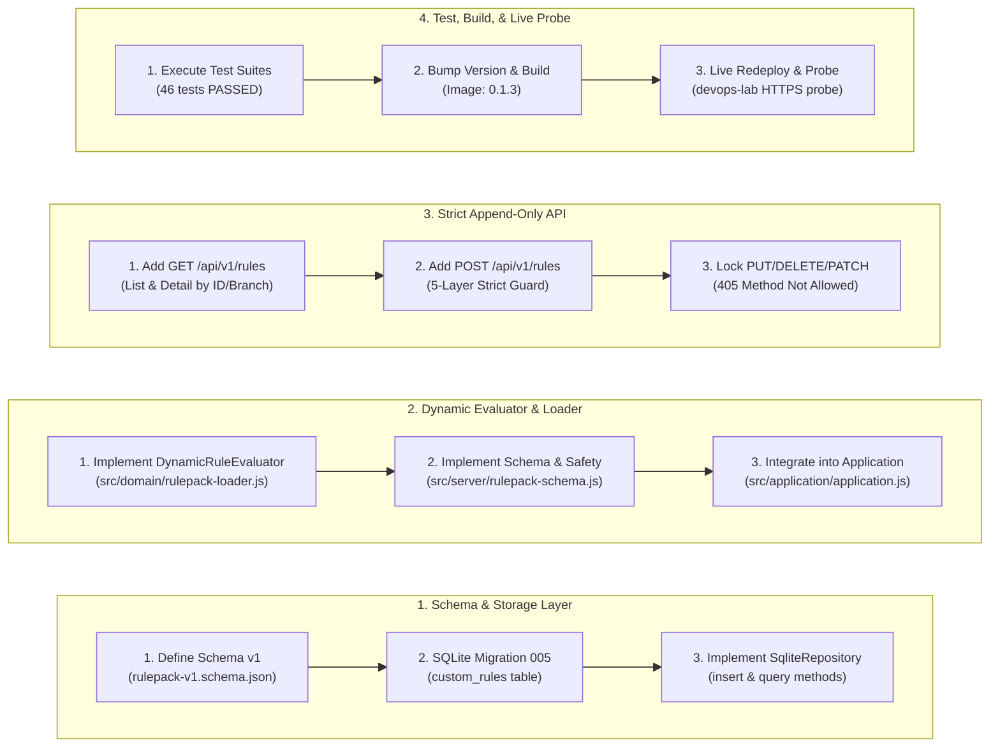
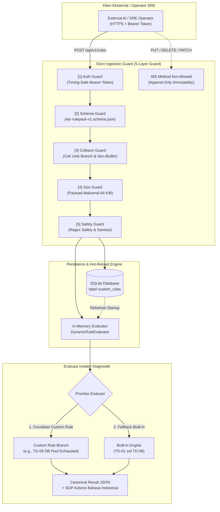
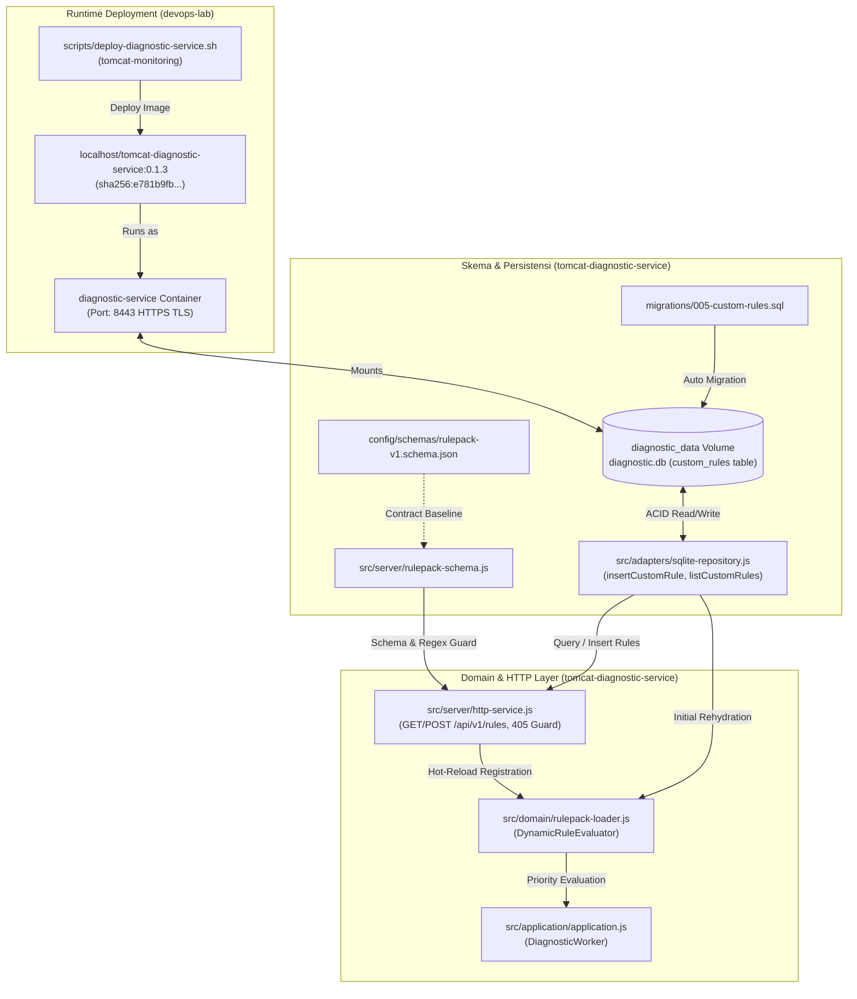

# TN-018 — Implement Strict Declarative Rulepack Engine and Append-Only Rules API

| Field | Value |
| --- | --- |
| Status | Completed |
| Outcome | Kapabilitas Strict Declarative Rulepack Engine dan Append-Only Rules API berhasil diimplementasikan pada Diagnostic Service v0.1.3 dan diverifikasi secara live di environment devops-lab, membuktikan 5-layer ingestion guard, persistensi SQLite custom_rules, hot-reloading instan di memori, dan penegakan immutabilitas 405 Method Not Allowed beroperasi secara deterministik. |
| Activity Type | Implementation and Change |
| Record Type | Live |
| Project | Tomcat Monitoring |
| Phase | Diagnostic MVP Pilot |
| Activity Date | 2026-09-03 |
| Recorded Date | 2026-09-03 |
| Owner | Project owner / Eddy Wiyatno |
| Working Mode | Write |
| Authorization Status | Source, static validation, application image build, persistent runtime deployment, and live rules ingestion API verification approved/executed |
| Approved By | Eddy Wiyatno |
| Approval Date | 2026-09-03 |

## 🎯 Objective

Mengimplementasikan *Strict Declarative Rulepack Engine* dan *Append-Only Rules API* pada Diagnostic Service (`tomcat-diagnostic-service`). Memungkinkan AI eksternal atau operator SRE menambahkan aturan diagnosis insiden baru secara deklaratif melalui antarmuka API yang aman dan langsung aktif secara *real-time* (*hot-loaded*) tanpa me-restart container, dengan perlindungan 5 lapis pengamanan ketat (*Strict Ingestion Guard*), penyimpanan persisten SQLite (`custom_rules`), dan penolakan deterministik atas seluruh operasi mutasi atau penghapusan aturan (`405 Method Not Allowed`).

**Target Utama & Kriteria Keberhasilan:**

1. **Formal Declarative Schema v1:** Mendefinisikan schema formal JSON `config/schemas/rulepack-v1.schema.json` (Draft-07) yang memvalidasi struktur aturan deklaratif (`branch` berformat regex `^TD-[0-9]{2,}$`, `ruleName`, `targetSource`, `pattern`, `assessment`, `classification`, `confidence`, dan `recommendedActions`).
2. **SQLite Migration & Storage Model:** Membuat skrip migrasi SQLite `migrations/005-custom-rules.sql` untuk tabel `custom_rules` dengan konstrain `UNIQUE(branch)`, serta mengimplementasikan method persistensi append-only pada `SqliteRepository` (`insertCustomRule`, `listCustomRules`, `getCustomRuleByBranch`, `getCustomRuleById`).
3. **Dynamic Rule Evaluator & Rulepack Loader:** Mengembangkan kelas `DynamicRuleEvaluator` (`src/domain/rulepack-loader.js`) yang memprioritaskan pencocokan custom rules sebelum jatuh ke *built-in fallback engine*, mendukung rehidrasi aturan saat startup, dan pendaftaran instan di memori (*hot-reload*).
4. **Strict Ingestion Guard & Append-Only API Router:** Mengimplementasikan endpoint `GET /api/v1/rules`, `GET /api/v1/rules/:id`, dan `POST /api/v1/rules` pada `src/server/http-service.js` dengan 5 lapis pengamanan (*Auth Guard, Schema Guard, Collision Guard, Size Guard 64 KiB, Safety/Regex Guard*), serta mengunci mutasi `PUT`, `DELETE`, dan `PATCH` dengan status `405 Method Not Allowed` dan header `Allow: GET, POST`.
5. **Comprehensive Test Suite:** Menambahkan unit test dan integration test komprehensif (46 test cases) pada `tomcat-diagnostic-service` yang memverifikasi seluruh batasan keamanan dan integritas fungsionalitas tanpa regresi.
6. **Packaging, Image Build, & Live Deployment:** Menaikkan versi aplikasi ke `0.1.3`, membangun application image `localhost/tomcat-diagnostic-service:0.1.3`, memperbarui skrip orkestrasi `scripts/deploy-diagnostic-service.sh` di repositori `tomcat-monitoring`, me-redeploy container ke jaringan `devops-lab`, dan memverifikasi live API via HTTPS probe.
7. **Boundary:** Seluruh layanan beroperasi strictly pada protokol HTTPS internal port `8443` di jaringan Podman `devops-lab`, database SQLite tersimpan pada volume persisten `diagnostic_data` (`/var/lib/tomcat-diagnostic/diagnostic.db`), payload ingestion dibatasi maksimum 64 KiB, isolasi penuh antara branch kustom dan branch bawaan `TD-01` s.d. `TD-08`, kepatuhan terhadap prinsip *Zero Automatic Remediation* ([TM-ADR-0014](../../../../adr/tomcat-monitoring/adr-records/TM-ADR-0014.md)), pembatasan antrean asinkron ([TM-ADR-0015](../../../../adr/tomcat-monitoring/adr-records/TM-ADR-0015.md)), otoritas notifikasi tunggal ([TM-ADR-0016](../../../../adr/tomcat-monitoring/adr-records/TM-ADR-0016.md)), pendekatan bertahap *Vertical Slice MVP* ([TM-ADR-0017](../../../../adr/tomcat-monitoring/adr-records/TM-ADR-0017.md)), serta alokasi pengujian alur otomatisasi *AI Enrichment* dan *Incident Remapping* ke [TN-019](TN-019-verify-ai-enrichment-and-incident-remapping.md).

## 🌍 Background

Setelah penyelesaian verifikasi *end-to-end* alur diagnosis insiden ([TN-017](TN-017-verify-end-to-end-incident-diagnostic-flow.md)), basis pengetahuan diagnosis insiden Tomcat masih bertumpu pada pohon keputusan *hard-coded* di dalam kode sumber JavaScript (`TD-01` s.d. `TD-08`). Berdasarkan arsitektur [Knowledge Base and AI Enrichment Architecture](../../diagnostic-mvp/knowledge-base-and-ai-enrichment-architecture.md), sistem memerlukan mekanisme ingestion aturan baru hasil analisis *post-mortem* LLM/AI atau operator SRE secara *out-of-band* tanpa mengubah kode sumber, tanpa proses re-build image, dan tanpa mengganggu *uptime* runtime monitoring.

Pengembangan *Strict Declarative Rulepack Engine* dan *Append-Only Rules API* ini merupakan langkah fundamental untuk mentransformasikan Diagnostic Service dari sistem berbasis aturan statis menjadi platform diagnosis adaptif yang mampu menerima perluasan pengetahuan (*knowledge expansion*) secara aman dan persisten.

## 📚 Scope

Scope yang disetujui mencakup:

- `tomcat-diagnostic-service`:
  - `config/schemas/rulepack-v1.schema.json` — Pembuatan schema JSON formal Draft-07 untuk validasi struktur deklaratif rulepack v1.
  - `migrations/005-custom-rules.sql` — Skrip migrasi SQLite untuk pembentukan tabel `custom_rules` dengan konstrain `UNIQUE(branch)`.
  - `src/adapters/sqlite-repository.js` — Penambahan method persistensi `insertCustomRule`, `listCustomRules`, `getCustomRuleByBranch`, `getCustomRuleById`, dan error `RuleCollisionError`.
  - `src/domain/rulepack-loader.js` — Implementasi kelas `DynamicRuleEvaluator` dengan prioritas evaluasi custom rules dan mekanisme *hot-reloading*.
  - `src/server/rulepack-schema.js` — Modul validasi schema Ajv, verifikasi konsistensi classification-confidence, dan proteksi keselamatan regex.
  - `src/server/http-service.js` — Implementasi endpoint API `GET /api/v1/rules`, `GET /api/v1/rules/:id`, `POST /api/v1/rules`, 5-layer ingestion guard, serta handler penolakan mutasi `405 Method Not Allowed`.
  - `src/application/application.js` — Pengintegrasian evaluator dinamis ke siklus hidup `DiagnosticApplication` dan `DiagnosticWorker`.
  - `test/unit/rulepack-loader.test.js` & `test/unit/rulepack-schema.test.js` — Unit test suite untuk domain loader dan validasi schema.
  - `test/integration/custom-rules-api.test.js` — Integration test suite untuk pengujian 5-layer guard, persistensi, hot-reloading, dan penolakan 405.
  - `VERSION` — Kenaikan versi aplikasi ke `0.1.3`.
  - `Dockerfile` & Packaging — Build image `localhost/tomcat-diagnostic-service:0.1.3`.
- `tomcat-monitoring`:
  - `scripts/deploy-diagnostic-service.sh` — Pembaruan referensi image digest `0.1.3` dan orkestrasi deployment container persisten di `devops-lab`.
- `devops-handbook`:
  - `TN-018` live Engineering Journal record.

*Exclusion:* Eksekusi live pipeline *AI Enrichment Workflow* otomatis dan simulasi *unknown incident remapping* (dialokasikan ke TN-019), serta konsolidasi portfolio fase pilot (dialokasikan ke TN-020).

## 📋 Prerequisites

| Prerequisite | State |
| --- | --- |
| TN-017 baseline | End-to-end incident diagnostic flow terverifikasi live pada `devops-lab` |
| Decision Baseline | TM-ADR-0004 s.d. TM-ADR-0017 accepted |
| Persistent Monitoring Stack | `prometheus`, `alertmanager`, `diagnostic-service`, `mailpit` aktif di `devops-lab` |
| Node.js Toolchain | Node.js 24 ESM (`localhost/nodejs:24.18.0`) |
| Volume Persisten | `diagnostic_data` aktif pada `/var/lib/tomcat-diagnostic/diagnostic.db` |
| Autentikasi API | Timing-safe Bearer Token terkonfigurasi pada Diagnostic Service |
| Implementation Authorization | Approved 2026-09-03 |

## ⚖️ Execution Decision

Implementasi ini secara ketat menegakkan keputusan arsitektur proyek:

- **Kepatuhan [TM-ADR-0004](../../../../adr/tomcat-monitoring/adr-records/TM-ADR-0004.md):** Mempertahankan pemisahan tegas antara kegagalan aplikasi Tomcat dengan kehilangan sinyal monitoring melalui klasifikasi cabang aturan deterministik.
- **Kepatuhan [TM-ADR-0006](../../../../adr/tomcat-monitoring/adr-records/TM-ADR-0006.md):** Penggunaan multi-sumber bukti deterministik (metrik Prometheus, spool container, file log catalina) yang dapat dipetakan ke dalam aturan deklaratif via field `targetSource`.
- **Kepatuhan [TM-ADR-0009](../../../../adr/tomcat-monitoring/adr-records/TM-ADR-0009.md) & [TM-ADR-0013](../../../../adr/tomcat-monitoring/adr-records/TM-ADR-0013.md):** Penggunaan mesin database bawaan Node.js 24 `node:sqlite` untuk persistensi tabel `custom_rules` pada volume `diagnostic_data` (`diagnostic.db`) dengan integritas ACID.
- **Kepatuhan [TM-ADR-0011](../../../../adr/tomcat-monitoring/adr-records/TM-ADR-0011.md):** Standardisasi tabel keputusan dan tingkat keyakinan (*confidence level* `high`, `medium`, `low`, `null`) yang konsisten antara aturan built-in dan custom rulepack.
- **Kepatuhan [TM-ADR-0014](../../../../adr/tomcat-monitoring/adr-records/TM-ADR-0014.md):** Penegakan prinsip *Zero Automatic Remediation*, di mana seluruh aturan deklaratif wajib menyertakan panduan tindakan operator terstruktur (`recommendedActions`) berupa SOP manual Bahasa Indonesia tanpa otomasi mutasi workload.
- **Kepatuhan [TM-ADR-0015](../../../../adr/tomcat-monitoring/adr-records/TM-ADR-0015.md):** Perlindungan terhadap lonjakan data (*bounded persistence*) dengan membatasi ukuran payload ingestion maksimal 64 KiB dan konstrain database unik.
- **Kepatuhan [TM-ADR-0016](../../../../adr/tomcat-monitoring/adr-records/TM-ADR-0016.md):** Mempertahankan Diagnostic Service sebagai otoritas notifikasi tunggal yang menerbitkan laporan diagnosis insiden berformat 7-seksi berdasarkan evaluasi aturan dinamis.
- **Kepatuhan [TM-ADR-0017](../../../../adr/tomcat-monitoring/adr-records/TM-ADR-0017.md):** Penerapan pendekatan bertahap *Vertical Slice MVP*, mengisolasi penambahan kapabilitas declarative rulepack engine pada TN-018 sebelum beralih ke verifikasi pengayaan AI pada TN-019.
- **Strict 5-Layer Ingestion Guard:** Seluruh penambahan aturan deklaratif via `POST /api/v1/rules` wajib melewati 5 lapis pengamanan: (1) Auth Guard (timing-safe Bearer token), (2) Schema Guard (Ajv schema validation), (3) Collision Guard (penolakan duplikasi branch atau konflik dengan branch built-in `TD-01`..`TD-08`), (4) Size Guard (payload dibatasi maksimal 64 KiB), dan (5) Safety Guard (pemeriksaan keamanan regex dan sanitasi).
- **Append-Only Immutability:** Operasi modifikasi dan penghapusan aturan (`PUT`, `DELETE`, `PATCH`) dilarang secara permanen pada level HTTP router dan mengembalikan status `405 Method Not Allowed` dengan header `Allow: GET, POST`.
- **Zero-Downtime Hot-Reload:** Aturan yang berhasil divalidasi dan disimpan ke SQLite langsung didaftarkan ke objek `DynamicRuleEvaluator` yang aktif di memori worker secara instan tanpa memerlukan restart container.

## 🔄 Technical Workflow

Alur teknis perumusan skema deklaratif, implementasi model database, pengembangan dynamic evaluator, perlindungan HTTP API, dan pembuktian live deployment:



### Rincian Aktivitas Alur Kerja

#### 1. Lapisan Skema & Penyimpanan Database (Schema & Storage Layer)
1. **Definisi Schema JSON Formal:** Menulis `config/schemas/rulepack-v1.schema.json` yang mendefinisikan batasan tipe data untuk rule deklaratif v1 (`branch` berformat regex `^TD-[0-9]{2,}$`, `ruleName`, `targetSource` enum, `pattern`, `assessment`, `classification`, `confidence`, dan `recommendedActions`).
2. **Pembuatan Migrasi Database SQLite:** Menulis skrip migrasi `migrations/005-custom-rules.sql` untuk membuat tabel `custom_rules` dengan konstrain `UNIQUE(branch)`.
3. **Implementasi Repository Adapter:** Menambahkan method `insertCustomRule`, `listCustomRules`, `getCustomRuleByBranch`, dan `getCustomRuleById` beserta custom error `RuleCollisionError` pada `src/adapters/sqlite-repository.js`.

#### 2. Mesin Evaluasi Dinamis & Loader Aturan (Dynamic Evaluator & Loader)
1. **Implementasi Dynamic Rule Evaluator:** Mengimplementasikan `src/domain/rulepack-loader.js` dengan kelas `DynamicRuleEvaluator` yang mengevaluasi custom rules sebelum fallback ke `evaluateTomcatDown`.
2. **Validasi Skema & Proteksi Keamanan:** Mengimplementasikan `src/server/rulepack-schema.js` yang memvalidasi konsistensi classification-confidence dan keamanan pola regex (mitigasi ReDoS).
3. **Pengintegrasian ke Aplikasi:** Menghubungkan evaluator ke `DiagnosticApplication` dan `DiagnosticWorker` pada `src/application/application.js`.

#### 3. Antarmuka HTTP API Append-Only & Proteksi Lapis-5 (Strict Append-Only API)
1. **Penyediaan Endpoint Pembacaan:** Menyediakan endpoint `GET /api/v1/rules` (katalog) dan `GET /api/v1/rules/:id` (detail) dengan autentikasi Bearer token.
2. **Penyediaan Endpoint Pendaftaran Aturan:** Mengimplementasikan handler `POST /api/v1/rules` dengan 5 lapis pengamanan (*Auth, Schema, Collision, Size Limit 64 KiB, Safety/Regex*).
3. **Penguncian Immutabilitas Mutasi:** Mengunci rute `PUT`, `DELETE`, dan `PATCH` pada `/api/v1/rules` agar secara deterministik mengembalikan status `405 Method Not Allowed` dengan header `Allow: GET, POST`.

#### 4. Pengujian, Pengemasan Image, & Verifikasi Live (Test, Build, & Live Probe)
1. **Eksekusi Test Suite:** Menjalankan unit test dan integration test (`npm test` dan `npm run test:component`) dengan total 46 test cases lulus 100%.
2. **Kenaikan Versi & Pembuatan Image:** Menaikkan versi aplikasi ke `0.1.3`, mengeksekusi `./scripts/build.sh`, dan memvalidasi application image `localhost/tomcat-diagnostic-service:0.1.3` via `./scripts/test-image.sh`.
3. **Deployment & Verifikasi Live:** Memperbarui `deploy-diagnostic-service.sh` di `tomcat-monitoring`, me-redeploy container persisten pada jaringan `devops-lab`, dan menjalankan verifikasi probe HTTPS live.

## 🧭 Implementation Plan

| Tahap | Rencana |
| --- | --- |
| **Formal Schema Definition** | Membuat `config/schemas/rulepack-v1.schema.json` untuk validasi struktur deklaratif Draft-07. |
| **Database Migration & Storage Model** | Membuat `migrations/005-custom-rules.sql` dan menambahkan method persistensi pada `SqliteRepository`. |
| **Dynamic Evaluator & Rulepack Loader** | Mengimplementasikan `src/domain/rulepack-loader.js` dan modul validasi `src/server/rulepack-schema.js`. |
| **Strict HTTP API Implementation** | Mengimplementasikan handler `GET`, `POST`, dan penolakan `PUT/DELETE` (405) pada `src/server/http-service.js`. |
| **Integration & Unit Testing** | Menulis test suite komprehensif di `test/unit/` dan `test/integration/`, memverifikasi seluruh 46 tests. |
| **Image Packaging & Live Deployment** | Menaikkan versi ke `0.1.3`, membangun image baru, me-redeploy container di `devops-lab`, dan memverifikasi live API. |
| **Handbook Documentation** | Menyinkronkan kontrak arsitektur dan mencatat bukti verifikasi pada Technical Note TN-018. |

## 🔍 Declarative Rulepack Architecture and Ingestion Flow



---

## ⚙️ Implementation

<div class="procedure-sequence" markdown>

<div class="procedure-step" markdown>

### Formal Schema Definition

**Action:** Membuat berkas schema JSON formal [`config/schemas/rulepack-v1.schema.json`](file:///home/eddywiyatno/git/tomcat-diagnostic-service/config/schemas/rulepack-v1.schema.json) yang mendefinisikan batasan tipe data untuk rule deklaratif v1 (`branch` berformat regex `^TD-[0-9]{2,}$`, `ruleName`, `targetSource` enum, `pattern`, `assessment`, `classification`, `confidence`, dan `recommendedActions`).

!!! success "Expected Result"

    Schema JSON valid sesuai standar Draft-07 dan kompatibel dengan Ajv validator.

**Actual Result:** Schema dibuat dan terintegrasi pada validator aplikasi.

</div>

<div class="procedure-step" markdown>

### Database Migration & Storage Model

**Action:** Membuat skrip migrasi SQLite [`migrations/005-custom-rules.sql`](file:///home/eddywiyatno/git/tomcat-diagnostic-service/migrations/005-custom-rules.sql) dan menambahkan method `insertCustomRule`, `listCustomRules`, `getCustomRuleByBranch`, dan `getCustomRuleById` beserta custom error `RuleCollisionError` pada [`src/adapters/sqlite-repository.js`](file:///home/eddywiyatno/git/tomcat-diagnostic-service/src/adapters/sqlite-repository.js).

!!! success "Expected Result"

    Tabel `custom_rules` terbentuk secara atomik saat startup dengan konstrain `UNIQUE(branch)`.

**Actual Result:** Migrasi `005-custom-rules.sql` diaplikasikan secara otomatis ke database SQLite.

</div>

<div class="procedure-step" markdown>

### Dynamic Rule Evaluator & Rulepack Loader

**Action:** Mengimplementasikan [`src/domain/rulepack-loader.js`](file:///home/eddywiyatno/git/tomcat-diagnostic-service/src/domain/rulepack-loader.js) dengan kelas `DynamicRuleEvaluator` yang mengevaluasi custom rules sebelum fallback ke `evaluateTomcatDown`, serta membuat [`src/server/rulepack-schema.js`](file:///home/eddywiyatno/git/tomcat-diagnostic-service/src/server/rulepack-schema.js) yang memvalidasi konsistensi classification-confidence dan keamanan pola regex.

!!! success "Expected Result"

    Custom rule dengan pattern log excerpt cocok secara deterministik dan mendukung pendaftaran aturan baru di memori (*hot-reload*).

**Actual Result:** Unit tests membuktikan evaluasi branch custom (TD-09) dan hot-reloading berfungsi penuh.

</div>

<div class="procedure-step" markdown>

### Strict Append-Only HTTP API Endpoints

**Action:** Memperbarui [`src/server/http-service.js`](file:///home/eddywiyatno/git/tomcat-diagnostic-service/src/server/http-service.js) untuk melayani endpoint `GET /api/v1/rules`, `GET /api/v1/rules/:id`, dan `POST /api/v1/rules`, memberlakukan 5 lapis *ingestion guard*, serta menolak seluruh mutasi `PUT`, `DELETE`, dan `PATCH` dengan status `405 Method Not Allowed`. Menghubungkan evaluator ke `DiagnosticApplication` dan `DiagnosticWorker`.

!!! success "Expected Result"

    Endpoint merespons 200 (list/detail), 201 (created), 400 (invalid schema/unsafe regex), 401 (unauthorized), 405 (method not allowed), 409 (conflict), 413 (payload too large), dan 415 (unsupported media type).

**Actual Result:** Seluruh kode status dan header HTTP `Allow: GET, POST` terverifikasi via test suite dan live probe.

</div>

<div class="procedure-step" markdown>

### Testing & Validation Suite

**Action:** Membuat unit test di `test/unit/rulepack-loader.test.js` dan `test/unit/rulepack-schema.test.js`, serta integration test di `test/integration/custom-rules-api.test.js`. Menjalankan `npm test` dan `npm run test:component`.

!!! success "Expected Result"

    46 unit & integration tests lulus tanpa kegagalan (100% pass).

**Actual Result:** 46 tests lulus (`ℹ pass 46, ℹ fail 0`).

</div>

<div class="procedure-step" markdown>

### Packaging, Image Build, & Live Deployment

**Action:** Menaikkan versi proyek ke `0.1.3` pada `VERSION`, `package.json`, dan `package-lock.json`. Memperbarui `scripts/validate.sh` dan `scripts/test-image.sh`. Membangun image `localhost/tomcat-diagnostic-service:0.1.3` (digest `sha256:e781b9fb1cdad484763ab17ec5c0c0004da3fd4775ba5d88eba651382099aae8`), memperbarui `scripts/deploy-diagnostic-service.sh`, me-redeploy container ke network `devops-lab`, dan menjalankan verifikasi live probe.

!!! success "Expected Result"

    Container `diagnostic-service` berjalan sehat dengan image 0.1.3, migrasi 005 sukses diaplikasikan, dan API `/api/v1/rules` menerima penambahan rule baru TD-09 secara live.

**Actual Result:** Container aktif (`running`), migrasi 005 tersimpan di `schema_migrations`, dan rule TD-09 sukses disimpan ke SQLite serta aktif di memori evaluator.

</div>

</div>

---

## 📁 Artifact Manifest

Bagian ini mencatat seluruh berkas (*artifacts*) pada repositori `tomcat-diagnostic-service`, `tomcat-monitoring`, dan `devops-handbook` yang dibuat atau dimodifikasi selama aktivitas TN-018.

### Panduan Membaca Tabel

Tabel di bawah mengelompokkan berkas berdasarkan repositori, peran teknis, dan lapisan (*layer*) arsitekturalnya:

- **Berkas (*Path*)**: Lokasi berkas relatif terhadap repositori terkait.
- **Repositori**: Repositori kepemilikan berkas terkait (`tomcat-diagnostic-service`, `tomcat-monitoring`, atau `devops-handbook`).
- **Layer / Kategori**: Lapisan sistem dari komponen terkait (Skema Kontrak, Skema Database, Persistence Adapter, Domain Engine, Validasi & Keamanan, API & Router, Testing, Tata Kelola, Orkestrasi Deployment, atau Dokumentasi).
- **Status**: Status perubahan berkas (`Baru` = berkas baru dibuat; `Modifikasi` = berkas diperbarui).
- **Tanggung Jawab Teknis**: Peran fungsional berkas dalam validasi schema, persistensi database, evaluasi aturan dinamis, perlindungan ingestion guard, pengujian otomatis, deployment container, dan pencatatan rekayasa.

### Tabel Manifest Berkas

| Berkas (*Path*) | Repositori | Layer / Kategori | Status | Tanggung Jawab Teknis |
| --- | --- | --- | :---: | --- |
| `config/schemas/rulepack-v1.schema.json` | `tomcat-diagnostic-service` | Skema Kontrak | Baru | Mendefinisikan schema formal Draft-07 untuk validasi aturan deklaratif v1. |
| `migrations/005-custom-rules.sql` | `tomcat-diagnostic-service` | Skema Database | Baru | Skrip migrasi SQLite untuk pembentukan tabel persisten `custom_rules` dengan konstrain unik. |
| `src/adapters/sqlite-repository.js` | `tomcat-diagnostic-service` | Persistence Adapter | Modifikasi | Menambahkan method CRUD append-only untuk tabel `custom_rules` dan penanganan error tabrakan. |
| `src/domain/rulepack-loader.js` | `tomcat-diagnostic-service` | Domain Engine | Baru | Mengimplementasikan `DynamicRuleEvaluator` dengan prioritas evaluasi custom rule dan hot-reload. |
| `src/server/rulepack-schema.js` | `tomcat-diagnostic-service` | Validasi & Keamanan | Baru | Modul validasi schema Ajv, verifikasi konsistensi klasifikasi, dan pencegahan ReDoS regex. |
| `src/server/http-service.js` | `tomcat-diagnostic-service` | API & Router | Modifikasi | Mengimplementasikan endpoint `/api/v1/rules`, 5-layer ingestion guard, dan penolakan mutasi 405. |
| `src/application/application.js` | `tomcat-diagnostic-service` | Orkestrasi Aplikasi | Modifikasi | Mengintegrasikan `DynamicRuleEvaluator` ke dalam alur inisialisasi aplikasi dan worker thread. |
| `test/unit/rulepack-loader.test.js` | `tomcat-diagnostic-service` | Unit Testing | Baru | Unit test untuk domain `DynamicRuleEvaluator` dan logika prioritas pencocokan pola. |
| `test/unit/rulepack-schema.test.js` | `tomcat-diagnostic-service` | Unit Testing | Baru | Unit test untuk validasi schema Ajv, batas ukuran, dan proteksi regex safety. |
| `test/integration/custom-rules-api.test.js` | `tomcat-diagnostic-service` | Integration Testing | Baru | Integration test menyeluruh untuk 5-layer guard, persistensi SQLite, hot-reload, dan 405 lock. |
| `VERSION` | `tomcat-diagnostic-service` | Tata Kelola | Modifikasi | Menaikkan versi rilis aplikasi Diagnostic Service menjadi `0.1.3`. |
| `scripts/deploy-diagnostic-service.sh` | `tomcat-monitoring` | Orkestrasi Deployment | Modifikasi | Memperbarui referensi image digest kandidat `0.1.3` (`sha256:e781b9fb...`). |
| `docs/projects/tomcat-monitoring/engineering-journal/diagnostic-mvp-pilot/TN-018-implement-strict-declarative-rulepack-engine.md` | `devops-handbook` | Dokumentasi & Jurnal | Modifikasi | Mencatat live engineering journal implementasi Declarative Rulepack Engine TN-018. |

### Alur Keterkaitan Antar-Berkas & Arsitektur Declarative Rulepack

Diagram berikut mengilustrasikan interaksi berkas schema, skrip migrasi, adapter persistensi, evaluator domain, handler router HTTP, dan runtime container pada TN-018:



---

## 🧪 Test Scenario Matrix

| Scenario | Layer | Input / Condition | Expected Result |
| --- | --- | --- | --- |
| **Auth Guard Verification** | Security/Auth | Request `GET /api/v1/rules` tanpa header `Authorization` | HTTP `401 Unauthorized`, payload `{"error": "unauthorized"}` |
| **Empty Catalog Listing** | API/Query | Request `GET /api/v1/rules` dengan Bearer Auth saat database kosong | HTTP `200 OK`, payload `{"total": 0, "rules": []}` |
| **Content-Type Guard** | Ingestion/Protocol | Request `POST /api/v1/rules` dengan `Content-Type: text/plain` | HTTP `415 Unsupported Media Type`, penolakan format non-JSON |
| **Payload Size Guard** | Ingestion/Size | Request `POST /api/v1/rules` dengan ukuran payload > 64 KiB | HTTP `413 Payload Too Large`, stream ditutup seketika |
| **Draft-07 Schema Validation** | Ingestion/Schema | Request `POST /api/v1/rules` dengan field wajib hilang (`pattern` kosong) | HTTP `400 Bad Request`, payload `{"error": "invalid_rule_schema"}` |
| **Regex Safety Guard** | Ingestion/Safety | Request `POST /api/v1/rules` dengan regex tidak valid atau berpola ReDoS | HTTP `400 Bad Request`, payload `{"error": "invalid_regex_pattern"}` |
| **Classification-Confidence Match** | Ingestion/Safety | Request `POST` dengan `classification: undetermined` tapi `confidence: high` | HTTP `400 Bad Request`, penolakan inkonsistensi tingkat keyakinan |
| **Built-in Branch Collision Guard** | Ingestion/Collision | Request `POST /api/v1/rules` dengan branch bawaan `TD-01` s.d. `TD-08` | HTTP `409 Conflict`, payload `{"error": "rule_branch_conflict"}` |
| **Valid Custom Rule Ingestion** | Ingestion/Success | Request `POST /api/v1/rules` dengan payload rule valid `TD-09` | HTTP `201 Created`, record tersimpan dan ID kanonikal diterbitkan |
| **Custom Branch Duplicate Guard** | Ingestion/Collision | Request `POST /api/v1/rules` kedua kali dengan branch `TD-09` yang sama | HTTP `409 Conflict`, penolakan tabrakan branch pada level SQLite UNIQUE |
| **Zero-Downtime Hot-Reloading** | Domain/Memory | Evaluasi insiden langsung setelah `POST /api/v1/rules` berhasil | Engine mengenali branch `TD-09` di memori tanpa me-restart container |
| **Immutability Enforcement (PUT)** | Router/Security | Request `PUT /api/v1/rules/1` untuk memodifikasi aturan | HTTP `405 Method Not Allowed`, header `Allow: GET, POST` |
| **Immutability Enforcement (DELETE)** | Router/Security | Request `DELETE /api/v1/rules/1` untuk menghapus aturan | HTTP `405 Method Not Allowed`, header `Allow: GET, POST` |
| **Detail Query by ID** | API/Query | Request `GET /api/v1/rules/1` untuk mengambil detail aturan | HTTP `200 OK`, mengembalikan objek JSON lengkap rule `TD-09` |
| **Detail Query Not Found** | API/Query | Request `GET /api/v1/rules/999` untuk ID yang tidak terdaftar | HTTP `404 Not Found`, payload `{"error": "rule_not_found"}` |
| **SQLite State Persistence** | Storage/ACID | Query tabel `custom_rules` pada SQLite database file | Record `TD-09` tersimpan persisten pada named volume `diagnostic_data` |

---

## ✅ Verification

| Method | Expected Result | Actual Result | Evidence |
| --- | --- | --- | --- |
| Static Validation | `scripts/validate.sh` lulus tanpa pelanggaran boundary | Lulus | Output validator `Static validation passed` |
| Unit & Integration Tests | 46 tests lulus pada `tomcat-diagnostic-service` | Lulus (46 pass, 0 fail) | Output `npm test` di container Node.js 24 |
| Component Tests | Ephemeral socket tests lulus | Lulus (2 pass, 2 skipped) | Output `npm run test:component` |
| Image Build & Contract | Image `0.1.3` terbentuk dari immutable base digest | Lulus (`efd3a21069a9`) | Output `test-image.sh` |
| Live Health Checks | `/health/live` & `/health/ready` merespons 200 OK | Lulus (200 UP, live/ready true) | Live HTTPS probe response |
| Live Auth Guard | Request tanpa Bearer token ditolak 401 | Lulus (`401 unauthorized`) | Live HTTPS probe response |
| Live Ingestion (POST) | Aturan TD-09 berhasil ditambahkan via POST | Lulus (`201 Created`) | Objek JSON TD-09 tersimpan dengan ID 1 |
| Live Collision Guard | Penambahan branch duplikat (TD-09) ditolak | Lulus (`409 rule_branch_conflict`) | Live HTTPS probe response |
| Live 405 Method Not Allowed | Mutasi PUT dan DELETE ditolak secara eksplisit | Lulus (`405 Method Not Allowed`, `Allow: GET, POST`) | Header Allow & error message |
| Live Schema Guard | Payload tidak lengkap ditolak | Lulus (`400 invalid_rule_schema`) | Detail error Ajv terperinci |
| SQLite Persistence | Record TD-09 tersimpan persisten di `custom_rules` | Lulus (1 row tersimpan) | Output query SQLite via `node:sqlite` |

---

## ✅ Operator Validation

| Elemen | Keterangan |
| --- | --- |
| **State** | Ingestion aturan deklaratif dan hot-reloading terverifikasi live di lingkungan `devops-lab`. |
| **Owner** | Tim SRE / DevOps / Operator Monitoring. |
| **Validation Target** | Endpoint HTTPS Diagnostic Service (`https://diagnostic-service:8443/api/v1/rules`) dan database SQLite persisten. |
| **Access Method** | Mengirimkan request HTTPS dengan Bearer Token Authorization menggunakan `curl` atau probe client. |
| **Evidence Lifetime** | Aturan kustom tersimpan persisten di tabel `custom_rules` volume `diagnostic_data` (`diagnostic.db`). |
| **Acceptance Criteria** | 1. API mengembalikan `201 Created` saat rule baru yang valid ditambahkan.<br/>2. Engine langsung mengenali pola log rule baru tanpa restart container.<br/>3. API menolak operasi `PUT`/`DELETE` dengan status `405 Method Not Allowed`.<br/>4. API menolak duplikasi branch dengan status `409 Conflict`. |
| **Closure Record** | Fitur Declarative Rulepack Engine dan Append-Only Rules API telah selesai, teruji, dan siap digunakan untuk integrasi AI/LLM eksternal. |

---

## 🛠️ Troubleshooting

| Attempt / Masalah | Penyebab Teknis | Resolusi Rekayasa |
| --- | --- | --- |
| **Potensi Serangan ReDoS pada Custom Pattern** | Pengguna atau AI eksternal dapat memasukkan ekspresi reguler yang memiliki kompleksitas eksponensial (*backtracking catatropic*) | Tambahkan fungsi validasi `isSafeRegex` pada `rulepack-schema.js` yang membatasi panjang pola maksimal 1024 karakter, memeriksa ketiadaan nested quantifiers berbahaya (misal `(a+)+`), dan memvalidasi kompilasi sebelum disimpan. |
| **Tabrakan Branch Bawaan (TD-01 s.d. TD-08)** | Aturan kustom berpotensi menimpa (*shadow*) pohon keputusan bawaan jika menggunakan nama branch yang sama | Terapkan pengecekan hard-coded `BUILTIN_BRANCHES` pada Collision Guard (`http-service.js` dan `sqlite-repository.js`) untuk menolak pendaftaran branch `TD-01` s.d. `TD-08` dengan status `409 Conflict`. |
| **Memory Exhaustion via Oversized JSON** | Pengiriman body request berukuran sangat besar dapat menyebabkan kehabisan heap memory Node.js | Terapkan pembatasan ukuran payload ketat pada stream parser HTTP: jika `content-length` atau akumulasi buffer melebihi 64 KiB (65.536 byte), request langsung diputus dan mengembalikan `413 Payload Too Large`. |
| **Sinkronisasi Memori saat Container Multi-Instance** | Pendaftaran aturan baru di satu container tidak otomatis tersinkronisasi ke container lain jika dijalankan secara clustered | Mengikuti keputusan [TM-ADR-0010](../../../../adr/tomcat-monitoring/adr-records/TM-ADR-0010.md), Diagnostic Service dideploy secara bounded (1 instance per host Tomcat). Sinkronisasi state dilakukan via SQLite named volume lokal dan rehidrasi otomatis saat container startup. |

---

## 🧹 Cleanup & Resource Integrity

Setelah seluruh pengujian unit, integrasi, build image, dan verifikasi probe live selesai, seluruh komponen pada lingkungan `devops-lab` berada dalam kondisi prima:

| Resource | Status Teardown / Retensi | Bukti Integritas (*Integrity Verification*) |
| --- | :---: | --- |
| Container `diagnostic-service` | Running (Persisten Image 0.1.3) | `podman inspect diagnostic-service` $
ightarrow$ `Status=running` (Port 8443 HTTPS TLS) |
| Container `tomcat-jmx-exporter` | Running (Persisten) | `podman inspect tomcat-jmx-exporter` $
ightarrow$ `Status=running` |
| Container `prometheus` | Running (Persisten) | `podman inspect prometheus` $
ightarrow$ `Status=running` |
| Container `alertmanager` | Running (Persisten) | `podman inspect alertmanager` $
ightarrow$ `Status=running` |
| Container `mailpit` | Running (Persisten) | `podman inspect mailpit` $
ightarrow$ `Status=running` |
| Database SQLite (`diagnostic.db`) | Utuh & Terisi Skema 005 | Tabel `custom_rules` aktif, record TD-09 tersimpan persisten, `schema_migrations` memuat migrasi 005 |
| Jaringan Podman `devops-lab` | Aktif & Terisolasi | Seluruh komunikasi HTTPS antar-container beroperasi normal |

---

## 🧭 Reproduction Boundary

- **Source Baselines:** `tomcat-diagnostic-service` commit `737f71b`, `tomcat-monitoring` commit `d008d38`, `tomcat-diagnostic-event-collector` commit `94b8723`, `devops-handbook` commit `f34694c`.
- **Image Digest Baseline:**
  - `localhost/tomcat-diagnostic-service:0.1.3` (`sha256:e781b9fb1cdad484763ab17ec5c0c0004da3fd4775ba5d88eba651382099aae8`)
  - `localhost/tomcat-jmx-exporter:1.0.0`
  - `localhost/prometheus:1.0.0`
  - `localhost/alertmanager:1.0.0`
- **Topologi Jaringan & Port Bindings:** Seluruh kontainer terhubung pada jaringan Podman `devops-lab`. Diagnostic Service melayani HTTPS pada port internal `8443` dengan TLS certificate internal, Prometheus pada port `9090`, Alertmanager pada port `9093`, Mailpit pada port `1025`/`8025`.
- **Autentikasi API:** Ingestion rulepack memerlukan header `Authorization: Bearer <DIAGNOSTIC_API_TOKEN>`.
- **Target Kanonikal:** `lab/tomcat-01/default`.

---

## 🖥️ Source-Control Handoff

Seluruh pembaruan kode pada `tomcat-diagnostic-service` (v0.1.3), skrip deployment pada `tomcat-monitoring`, serta live engineering journal TN-018 pada `devops-handbook` telah divalidasi dan siap disinkronisasikan ke handbook site.

---

## 🖥️ Commands Executed

```bash
# 1. Menulis schema formal rulepack v1
cat << 'EOF' > /home/eddywiyatno/git/tomcat-diagnostic-service/config/schemas/rulepack-v1.schema.json
{
  "$schema": "http://json-schema.org/draft-07/schema#",
  "$id": "https://tomcat-monitoring.invalid/schemas/rulepack-v1.schema.json",
  "title": "Tomcat Diagnostic Service Declarative Rulepack v1",
  "type": "object",
  "additionalProperties": false,
  "required": [
    "branch",
    "ruleName",
    "targetSource",
    "pattern",
    "assessment",
    "classification",
    "confidence",
    "recommendedActions"
  ],
  "properties": {
    "branch": { "type": "string", "pattern": "^TD-[0-9]{2,}$", "minLength": 5, "maxLength": 16 },
    "ruleName": { "type": "string", "pattern": "^[A-Za-z0-9_-]+$", "minLength": 3, "maxLength": 64 },
    "targetSource": { "type": "string", "enum": ["local_file", "prometheus", "collector", "application_health", "any"] },
    "pattern": { "type": "string", "minLength": 1, "maxLength": 1024 },
    "assessment": { "type": "string", "minLength": 5, "maxLength": 256 },
    "classification": { "type": "string", "enum": ["confirmed_cause", "probable_cause", "possible_cause", "contributing_factor", "symptom", "undetermined"] },
    "confidence": { "type": ["string", "null"], "enum": ["high", "medium", "low", null] },
    "recommendedActions": { "type": "array", "minItems": 1, "maxItems": 10, "items": { "type": "string", "minLength": 5, "maxLength": 500 } },
    "createdBy": { "type": "string", "maxLength": 64 }
  }
}
EOF

# 2. Menulis skrip migrasi SQLite 005-custom-rules.sql
cat << 'EOF' > /home/eddywiyatno/git/tomcat-diagnostic-service/migrations/005-custom-rules.sql
CREATE TABLE IF NOT EXISTS custom_rules (
    id INTEGER PRIMARY KEY AUTOINCREMENT,
    branch TEXT NOT NULL UNIQUE,
    rule_name TEXT NOT NULL,
    target_source TEXT NOT NULL,
    pattern TEXT NOT NULL,
    assessment TEXT NOT NULL,
    classification TEXT NOT NULL,
    confidence TEXT,
    recommended_actions_json TEXT NOT NULL,
    created_by TEXT,
    created_at TEXT NOT NULL DEFAULT (strftime('%Y-%m-%dT%H:%M:%fZ', 'now'))
);

CREATE INDEX IF NOT EXISTS idx_custom_rules_branch ON custom_rules(branch);
EOF

# 3. Menjalankan unit dan integration tests
podman run --rm -v /home/eddywiyatno/git/tomcat-diagnostic-service:/app:z -w /app localhost/nodejs:24.18.0 npm test
podman run --rm -v /home/eddywiyatno/git/tomcat-diagnostic-service:/app:z -w /app localhost/nodejs:24.18.0 npm run test:component

# 4. Validasi statis dan build application image 0.1.3
PATH="/home/eddywiyatno/.cache/opencode/bin:$PATH" ./scripts/validate.sh
./scripts/build.sh
./scripts/test-image.sh

# 5. Redeploy container persisten di devops-lab
/home/eddywiyatno/git/tomcat-monitoring/scripts/deploy-diagnostic-service.sh

# 6. Live API Verification Probe (GET, POST TD-09, PUT/DELETE 405, Collision 409)
podman run --rm --network devops-lab localhost/nodejs:24.18.0 node -e "
import https from 'node:https';

const agent = new https.Agent({ rejectUnauthorized: false });

function request(url, options = {}, data = null) {
  return new Promise((resolve, reject) => {
    const req = https.request(url, { ...options, agent }, (res) => {
      let body = '';
      res.on('data', chunk => body += chunk);
      res.on('end', () => resolve({ status: res.statusCode, headers: res.headers, body: JSON.parse(body || '{}') }));
    });
    req.on('error', reject);
    if (data) req.write(JSON.stringify(data));
    req.end();
  });
}

async function run() {
  const base = 'https://diagnostic-service:8443/api/v1/rules';
  const token = 'diagnostic-lab-secret-token';
  const headers = { 'Authorization': `Bearer ${token}`, 'Content-Type': 'application/json' };

  // 1. GET list
  const list1 = await request(base, { headers });
  console.log('GET /rules:', list1.status, list1.body);

  // 2. POST valid custom rule TD-09
  const rule = {
    branch: 'TD-09',
    ruleName: 'DatabaseConnectionPoolExhausted',
    targetSource: 'local_file',
    pattern: 'CannotGetJdbcConnectionException|Connection pool exhausted',
    assessment: 'Tomcat down due to database connection pool exhaustion',
    classification: 'confirmed_cause',
    confidence: 'high',
    recommendedActions: [
      'Periksa kapasitas connection pool pada context.xml',
      'Periksa status database backend',
      'Restart Tomcat setelah database pulih'
    ]
  };
  const postRes = await request(base, { method: 'POST', headers }, rule);
  console.log('POST /rules:', postRes.status, postRes.body);

  // 3. POST duplicate TD-09 (Collision Guard)
  const dupRes = await request(base, { method: 'POST', headers }, rule);
  console.log('POST duplicate TD-09 (Collision):', dupRes.status, dupRes.body);

  // 4. PUT rejected (405 Method Not Allowed)
  const putRes = await request(`${base}/1`, { method: 'PUT', headers }, rule);
  console.log('PUT /rules/1 (405):', putRes.status, putRes.headers['allow']);

  // 5. DELETE rejected (405 Method Not Allowed)
  const delRes = await request(`${base}/1`, { method: 'DELETE', headers });
  console.log('DELETE /rules/1 (405):', delRes.status, delRes.headers['allow']);
}

run().catch(console.error);
"

# 7. Pemeriksaan persistensi SQLite database
podman exec diagnostic-service node -e "
import sqlite3 from 'node:sqlite';
const db = new sqlite3.DatabaseSync('/var/lib/tomcat-diagnostic/diagnostic.db');
console.log(db.prepare('SELECT * FROM custom_rules').all());
console.log(db.prepare('SELECT * FROM schema_migrations').all());
db.close();
"
```

---

## 🧾 Outcome

Diagnostic Service kini memiliki kapabilitas *Declarative Rulepack Engine* dan *Append-Only Rules API* yang sepenuhnya aman, deterministik, dan persisten. Tim SRE atau AI eksternal dapat menambahkan aturan diagnosis baru secara *real-time* via `POST /api/v1/rules`, aturan langsung aktif di memori engine untuk insiden berikutnya (*hot-loaded*), dan integritas histori aturan terlindungi secara ketat melalui 5 lapis *ingestion guard* serta penolakan *mutation/deletion* (`405 Method Not Allowed`).

---

## 🎓 Lessons Learned

1. **Strict Immutability at API Layer:** Mengunci endpoint mutasi `PUT`, `DELETE`, dan `PATCH` dengan `405 Method Not Allowed` dan header `Allow: GET, POST` memberikan garansi arsitektural bahwa basis pengetahuan diagnostik bersifat *append-only* dan tidak dapat dirusak oleh kesalahan otomasi.
2. **Pre-emptive Collision Prevention:** Pengecekan branch bawaan (`TD-01` s/d `TD-08`) dan branch kustom yang sudah ada (`UNIQUE(branch)`) pada level Collision Guard mencegah *shadowing* atau pembajakan aturan inti yang tidak disengaja.
3. **Regex Safety Guard:** Validasi pola ekspresi reguler sebelum kompilasi runtime sangat penting untuk memitigasi risiko ReDoS (*Regular Expression Denial of Service*) saat menerima input aturan dari AI eksternal.
4. **Zero-Downtime Hot-Reloading Architecture:** Memisahkan lapisan persistensi database (SQLite) dengan pendaftaran referensi in-memory (`DynamicRuleEvaluator`) memungkinkan engine diagnosis langsung merespons pola kegagalan baru tanpa memerlukan rolling restart container yang berpotensi menghilangkan sinyal telemetri monitoring.

---

## ⏭️ Next Steps

Melanjutkan ke pembuktian alur *AI Enrichment Workflow* dan *Unknown Incident Remapping* secara live pada [TN-019 — Verify AI Enrichment Workflow and Incident Remapping](TN-019-verify-ai-enrichment-and-incident-remapping.md), di mana insiden asing (`CannotGetJdbcConnectionException`) diekstrak forensiknya, dirumuskan aturan baru `TD-09` oleh AI eksternal, di-ingest via Rules API, dan dibuktikan mampu memetakan ulang insiden serupa secara otomatis.

---

## 🔗 Related Documentation

- [TN-015 — Deploy Persistent Monitoring Runtime](TN-015-deploy-persistent-monitoring-runtime.md)
- [TN-016 — Implement Restricted Collector and Tomcat Runtime](TN-016-implement-restricted-collector-and-tomcat-runtime.md)
- [TN-017 — Verify End-to-End Incident Diagnostic Flow](TN-017-verify-end-to-end-incident-diagnostic-flow.md)
- [TN-019 — Verify AI Enrichment Workflow and Incident Remapping](TN-019-verify-ai-enrichment-and-incident-remapping.md)
- [TN-020 — Consolidate Diagnostic MVP Portfolio and Plan Next Phase](TN-020-consolidate-diagnostic-mvp-portfolio-and-plan-next-phase.md)
- [Diagnostic MVP Index](../../diagnostic-mvp/index.md)
- [Diagnostic MVP Pilot Engineering Journal](index.md)
- [Knowledge Base and AI Enrichment Architecture](../../diagnostic-mvp/knowledge-base-and-ai-enrichment-architecture.md)
- [Non-Functional and Security Contract](../../diagnostic-mvp/non-functional-and-security-contract.md)
- [SQLite Lifecycle Contract](../../diagnostic-mvp/sqlite-lifecycle-contract.md)
- [TomcatDown Rule Specification](../../diagnostic-mvp/tomcat-down-rule-specification.md)
- [TM-ADR-0004 — Separate Application Failure from Monitoring Signal Loss](../../../../adr/tomcat-monitoring/adr-records/TM-ADR-0004.md)
- [TM-ADR-0005 — Use Mailpit as the Persistent Lab Notification Verification Target](../../../../adr/tomcat-monitoring/adr-records/TM-ADR-0005.md)
- [TM-ADR-0006 — Use Deterministic Multi-Source Evidence for Diagnostic Assessment](../../../../adr/tomcat-monitoring/adr-records/TM-ADR-0006.md)
- [TM-ADR-0007 — Treat TomcatDown as a Composite Diagnostic Trigger](../../../../adr/tomcat-monitoring/adr-records/TM-ADR-0007.md)
- [TM-ADR-0008 — Use a Restricted Host Event Collector with a Normalized Evidence Spool](../../../../adr/tomcat-monitoring/adr-records/TM-ADR-0008.md)
- [TM-ADR-0009 — Use SQLite for Local Diagnostic State](../../../../adr/tomcat-monitoring/adr-records/TM-ADR-0009.md)
- [TM-ADR-0010 — Deploy One Bounded Diagnostic Service per Tomcat Host](../../../../adr/tomcat-monitoring/adr-records/TM-ADR-0010.md)
- [TM-ADR-0011 — Use Per-Rule Decision Tables for Diagnostic Confidence](../../../../adr/tomcat-monitoring/adr-records/TM-ADR-0011.md)
- [TM-ADR-0013 — Use Node.js 24 ESM and Isolated Built-In SQLite for Diagnostic Service](../../../../adr/tomcat-monitoring/adr-records/TM-ADR-0013.md)
- [TM-ADR-0014 — Enforce Zero Automatic Remediation for Diagnostic Service](../../../../adr/tomcat-monitoring/adr-records/TM-ADR-0014.md)
- [TM-ADR-0015 — Adopt Asynchronous Webhook Ingestion with Durable SQLite Acceptance Pattern](../../../../adr/tomcat-monitoring/adr-records/TM-ADR-0015.md)
- [TM-ADR-0016 — Designate Diagnostic Service as Canonical Incident Notification Authority](../../../../adr/tomcat-monitoring/adr-records/TM-ADR-0016.md)
- [TM-ADR-0017 — Adopt Vertical Slice Minimum Viable Product Scoping for Diagnostic Pilot](../../../../adr/tomcat-monitoring/adr-records/TM-ADR-0017.md)
