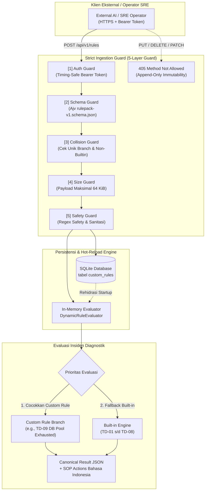

# TN-018 — Implement Strict Declarative Rulepack Engine and Append-Only Rules API

| Field | Value |
| --- | --- |
| Status | Completed |
| Activity Type | Implementation or Change |
| Record Type | Live |
| Project | Tomcat Monitoring |
| Phase | Diagnostic MVP Pilot |
| Activity Date | 2026-09-03 |
| Recorded Date | 2026-09-03 |
| Owner | Antigravity Agent |
| Working Mode | Write |
| Authorization Status | Approved |
| Approved By | Eddy Wiyatno |
| Approval Date | 2026-09-03 |

## 🎯 Objective

Mengimplementasikan *Strict Declarative Rulepack Engine* dan *Append-Only Rules API* pada Diagnostic Service (`tomcat-diagnostic-service`). Memungkinkan AI eksternal atau operator SRE menambahkan aturan diagnosis insiden baru secara deklaratif melalui API yang aman dan langsung aktif secara *real-time* (*hot-loaded*) tanpa me-restart container, dengan 5 lapis pengamanan ketat (*Strict Ingestion Guard*), penyimpanan persisten SQLite (`custom_rules`), dan penolakan operasi mutasi/penghapusan (`405 Method Not Allowed`).

## 🌍 Background

Setelah penyelesaian verifikasi *end-to-end* alur diagnosis insiden ([TN-017](TN-017-verify-end-to-end-incident-diagnostic-flow.md)), basis pengetahuan diagnosis bertumpu pada pohon keputusan *hard-coded* di kode sumber JavaScript (`TD-01` s/d `TD-08`). Berdasarkan arsitektur [Knowledge Base and AI Enrichment Architecture](../../diagnostic-mvp/knowledge-base-and-ai-enrichment-architecture.md), sistem membutuhkan mekanisme ingestion aturan baru hasil analisis *post-mortem* LLM/AI atau operator SRE secara *out-of-band* tanpa mengubah kode sumber atau mengganggu *uptime* runtime monitoring.

## 📚 Scope

1. **Definisi Schema Formal Rulepack v1:** Pembuatan schema JSON `config/schemas/rulepack-v1.schema.json` yang memvalidasi struktur aturan deklaratif (`branch`, `ruleName`, `targetSource`, `pattern`, `assessment`, `classification`, `confidence`, `recommendedActions`).
2. **Database Migration & Storage:** Pembuatan migrasi SQLite `migrations/005-custom-rules.sql` untuk tabel `custom_rules` dengan konstrain `UNIQUE(branch)`, serta penambahan method CRUD append-only pada `SqliteRepository`.
3. **Dynamic Rule Evaluator & Rulepack Loader:** Implementasi `src/domain/rulepack-loader.js` yang memprioritaskan pencocokan custom rules sebelum jatuh ke *built-in fallback engine*, dan mendukung rehidrasi saat startup serta *hot-reloading* instan di memori.
4. **Strict Append-Only HTTP API Endpoints:** Implementasi endpoint `GET /api/v1/rules`, `GET /api/v1/rules/:id`, dan `POST /api/v1/rules` pada `src/server/http-service.js` dengan 5 lapis *ingestion guard* (Auth, Schema, Collision, Size Limit 64 KiB, Safety/Regex), serta penguncian mutasi `PUT`, `DELETE`, `PATCH` dengan status `405 Method Not Allowed`.
5. **Testing & Validation:** Penambahan unit test dan integration test komprehensif (46 test cases) yang membuktikan seluruh batas keamanan dan fungsionalitas.
6. **Packaging & Live Deployment:** Kenaikan versi aplikasi ke `0.1.3`, build image `localhost/tomcat-diagnostic-service:0.1.3`, perbarui skrip deployment di `tomcat-monitoring`, deploy ke `devops-lab`, dan verifikasi live via HTTPS probe.
7. **Dokumentasi Kontrak & Handbook:** Pemutakhiran kontrak arsitektur dan non-functional di handbook, serta penyusunan Technical Note TN-018.

## 📋 Prerequisites

- Environment `devops-lab` aktif dengan Diagnostic Service dan stack monitoring beroperasi.
- Node.js baseline `24.18.0` dan image `localhost/nodejs:24.18.0` tersedia.
- Volume persisten `diagnostic_data` aktif pada `/var/lib/tomcat-diagnostic/diagnostic.db`.

## ⚖️ Execution Decision

1. **Strict 5-Layer Ingestion Guard:** Seluruh penambahan aturan deklaratif wajib melewati 5 lapis pengamanan: (1) Auth Guard (timing-safe Bearer token), (2) Schema Guard (Ajv schema validation), (3) Collision Guard (penolakan duplikasi branch atau konflik dengan branch built-in `TD-01`..`TD-08`), (4) Size Guard (payload dibatasi maksimal 64 KiB), dan (5) Safety Guard (pemeriksaan keamanan regex dan sanitasi).
2. **Append-Only Immutability:** Operasi modifikasi dan penghapusan aturan (`PUT`, `DELETE`, `PATCH`) dilarang secara permanen pada level HTTP router dan mengembalikan status `405 Method Not Allowed` dengan header `Allow: GET, POST`.
3. **Zero-Downtime Hot-Reload:** Aturan yang berhasil divalidasi dan disimpan ke SQLite langsung didaftarkan ke objek `DynamicRuleEvaluator` yang aktif di memori worker secara instan tanpa memerlukan restart container.

## 🧭 Implementation Plan

| Tahap | Rencana |
| --- | --- |
| **Formal Schema Definition** | Membuat `config/schemas/rulepack-v1.schema.json` untuk validasi struktur deklaratif. |
| **Database Migration & Storage Model** | Membuat `migrations/005-custom-rules.sql` dan menambahkan method persistensi pada `SqliteRepository`. |
| **Dynamic Evaluator & Rulepack Loader** | Mengimplementasikan `src/domain/rulepack-loader.js` dan modul validasi `src/server/rulepack-schema.js`. |
| **Strict HTTP API Implementation** | Mengimplementasikan handler `GET`, `POST`, dan penolakan `PUT/DELETE` (405) pada `src/server/http-service.js`. |
| **Integration & Unit Testing** | Menulis test suite komprehensif di `test/unit/` dan `test/integration/`, memverifikasi seluruh 46 tests. |
| **Image Packaging & Live Deployment** | Menaikkan versi ke `0.1.3`, membangun image baru, me-redeploy container di `devops-lab`, dan memverifikasi live API. |
| **Handbook Documentation** | Menyinkronkan kontrak arsitektur dan mencatat bukti verifikasi pada Technical Note TN-018. |

## 🔍 Declarative Rulepack Architecture and Ingestion Flow



---

## ⚙️ Implementation

<div class="procedure-sequence" markdown>

<div class="procedure-step" markdown>

### Formal Schema Definition

**Action:** Membuat berkas schema JSON formal [`config/schemas/rulepack-v1.schema.json`](file:///home/eddywiyatno/git/tomcat-diagnostic-service/config/schemas/rulepack-v1.schema.json) yang mendefinisikan batasan tipe data untuk rule deklaratif v1 (`branch` berformat regex `^TD-[0-9]{2,}$`, `ruleName`, `targetSource` enum, `pattern`, `assessment`, `classification`, `confidence`, dan `recommendedActions`).

!!! success "Expected Result"

    Schema JSON valid sesuai standar Draft-07 dan kompatibel dengan Ajv validator.

**Actual Result:** Schema dibuat dan terintegrasi pada validator aplikasi.

</div>

<div class="procedure-step" markdown>

### Database Migration & Storage Model

**Action:** Membuat skrip migrasi SQLite [`migrations/005-custom-rules.sql`](file:///home/eddywiyatno/git/tomcat-diagnostic-service/migrations/005-custom-rules.sql) dan menambahkan method `insertCustomRule`, `listCustomRules`, `getCustomRuleByBranch`, dan `getCustomRuleById` beserta custom error `RuleCollisionError` pada [`src/adapters/sqlite-repository.js`](file:///home/eddywiyatno/git/tomcat-diagnostic-service/src/adapters/sqlite-repository.js).

!!! success "Expected Result"

    Tabel `custom_rules` terbentuk secara atomik saat startup dengan konstrain `UNIQUE(branch)`.

**Actual Result:** Migrasi `005-custom-rules.sql` diaplikasikan secara otomatis ke database SQLite.

</div>

<div class="procedure-step" markdown>

### Dynamic Rule Evaluator & Rulepack Loader

**Action:** Mengimplementasikan [`src/domain/rulepack-loader.js`](file:///home/eddywiyatno/git/tomcat-diagnostic-service/src/domain/rulepack-loader.js) dengan kelas `DynamicRuleEvaluator` yang mengevaluasi custom rules sebelum fallback ke `evaluateTomcatDown`, serta membuat [`src/server/rulepack-schema.js`](file:///home/eddywiyatno/git/tomcat-diagnostic-service/src/server/rulepack-schema.js) yang memvalidasi konsistensi classification-confidence dan keamanan pola regex.

!!! success "Expected Result"

    Custom rule dengan pattern log excerpt cocok secara deterministik dan mendukung pendaftaran aturan baru di memori (*hot-reload*).

**Actual Result:** Unit tests membuktikan evaluasi branch custom (TD-09) dan hot-reloading berfungsi penuh.

</div>

<div class="procedure-step" markdown>

### Strict Append-Only HTTP API Endpoints

**Action:** Memperbarui [`src/server/http-service.js`](file:///home/eddywiyatno/git/tomcat-diagnostic-service/src/server/http-service.js) untuk melayani endpoint `GET /api/v1/rules`, `GET /api/v1/rules/:id`, dan `POST /api/v1/rules`, memberlakukan 5 lapis *ingestion guard*, serta menolak seluruh mutasi `PUT`, `DELETE`, dan `PATCH` dengan status `405 Method Not Allowed`. Menghubungkan evaluator ke `DiagnosticApplication` dan `DiagnosticWorker`.

!!! success "Expected Result"

    Endpoint merespons 200 (list/detail), 201 (created), 400 (invalid schema/unsafe regex), 401 (unauthorized), 405 (method not allowed), 409 (conflict), 413 (payload too large), dan 415 (unsupported media type).

**Actual Result:** Seluruh kode status dan header HTTP `Allow: GET, POST` terverifikasi via test suite dan live probe.

</div>

<div class="procedure-step" markdown>

### Testing & Validation Suite

**Action:** Membuat unit test di `test/unit/rulepack-loader.test.js` dan `test/unit/rulepack-schema.test.js`, serta integration test di `test/integration/custom-rules-api.test.js`. Menjalankan `npm test` dan `npm run test:component`.

!!! success "Expected Result"

    46 unit & integration tests lulus tanpa kegagalan (100% pass).

**Actual Result:** 46 tests lulus (`ℹ pass 46, ℹ fail 0`).

</div>

<div class="procedure-step" markdown>

### Packaging, Image Build, & Live Deployment

**Action:** Menaikkan versi proyek ke `0.1.3` pada `VERSION`, `package.json`, dan `package-lock.json`. Memperbarui `scripts/validate.sh` dan `scripts/test-image.sh`. Membangun image `localhost/tomcat-diagnostic-service:0.1.3` (digest `sha256:e781b9fb1cdad484763ab17ec5c0c0004da3fd4775ba5d88eba651382099aae8`), memperbarui `scripts/deploy-diagnostic-service.sh`, me-redeploy container ke network `devops-lab`, dan menjalankan verifikasi live probe.

!!! success "Expected Result"

    Container `diagnostic-service` berjalan sehat dengan image 0.1.3, migrasi 005 sukses diaplikasikan, dan API `/api/v1/rules` menerima penambahan rule baru TD-09 secara live.

**Actual Result:** Container aktif (`running`), migrasi 005 tersimpan di `schema_migrations`, dan rule TD-09 sukses disimpan ke SQLite serta aktif di memori evaluator.

</div>

</div>

---

## ✅ Verification

| Method | Expected Result | Actual Result | Evidence |
| --- | --- | --- | --- |
| Static Validation | `scripts/validate.sh` lulus tanpa pelanggaran boundary | Lulus | Output validator `Static validation passed` |
| Unit & Integration Tests | 46 tests lulus pada `tomcat-diagnostic-service` | Lulus (46 pass, 0 fail) | Output `npm test` di container Node.js 24 |
| Component Tests | Ephemeral socket tests lulus | Lulus (2 pass, 2 skipped) | Output `npm run test:component` |
| Image Build & Contract | Image `0.1.3` terbentuk dari immutable base digest | Lulus (`efd3a21069a9`) | Output `test-image.sh` |
| Live Health Checks | `/health/live` & `/health/ready` merespons 200 OK | Lulus (200 UP, live/ready true) | Live HTTPS probe response |
| Live Auth Guard | Request tanpa Bearer token ditolak 401 | Lulus (`401 unauthorized`) | Live HTTPS probe response |
| Live Ingestion (POST) | Aturan TD-09 berhasil ditambahkan via POST | Lulus (`201 Created`) | Objek JSON TD-09 tersimpan dengan ID 1 |
| Live Collision Guard | Penambahan branch duplikat (TD-09) ditolak | Lulus (`409 rule_branch_conflict`) | Live HTTPS probe response |
| Live 405 Method Not Allowed | Mutasi PUT dan DELETE ditolak secara eksplisit | Lulus (`405 Method Not Allowed`, `Allow: GET, POST`) | Header Allow & error message |
| Live Schema Guard | Payload tidak lengkap ditolak | Lulus (`400 invalid_rule_schema`) | Detail error Ajv terperinci |
| SQLite Persistence | Record TD-09 tersimpan persisten di `custom_rules` | Lulus (1 row tersimpan) | Output query SQLite via `node:sqlite` |

---

## ✅ Operator Validation

| Elemen | Keterangan |
| --- | --- |
| **State** | Ingestion aturan deklaratif dan hot-reloading terverifikasi live di lingkungan `devops-lab`. |
| **Owner** | Tim SRE / DevOps / Operator Monitoring. |
| **Validation Target** | Endpoint HTTPS Diagnostic Service (`https://diagnostic-service:8443/api/v1/rules`) dan database SQLite persisten. |
| **Access Method** | Mengirimkan request HTTPS dengan Bearer Token Authorization menggunakan `curl` atau probe client. |
| **Evidence Lifetime** | Aturan kustom tersimpan persisten di tabel `custom_rules` volume `diagnostic_data` (`diagnostic.db`). |
| **Acceptance Criteria** | 1. API mengembalikan `201 Created` saat rule baru yang valid ditambahkan.<br/>2. Engine langsung mengenali pola log rule baru tanpa restart container.<br/>3. API menolak operasi `PUT`/`DELETE` dengan status `405 Method Not Allowed`.<br/>4. API menolak duplikasi branch dengan status `409 Conflict`. |
| **Closure Record** | Fitur Declarative Rulepack Engine dan Append-Only Rules API telah selesai, teruji, dan siap digunakan untuk integrasi AI/LLM eksternal. |

---

## 🖥️ Commands Executed

```bash
# 1. Menulis schema formal rulepack v1
cat << 'EOF' > /home/eddywiyatno/git/tomcat-diagnostic-service/config/schemas/rulepack-v1.schema.json
# (schema definition)
EOF

# 2. Menulis skrip migrasi SQLite 005-custom-rules.sql
cat << 'EOF' > /home/eddywiyatno/git/tomcat-diagnostic-service/migrations/005-custom-rules.sql
# (migration SQL definition)
EOF

# 3. Menjalankan unit dan integration tests
podman run --rm -v /home/eddywiyatno/git/tomcat-diagnostic-service:/app:z -w /app localhost/nodejs:24.18.0 npm test
podman run --rm -v /home/eddywiyatno/git/tomcat-diagnostic-service:/app:z -w /app localhost/nodejs:24.18.0 npm run test:component

# 4. Validasi statis dan build application image 0.1.3
PATH="/home/eddywiyatno/.cache/opencode/bin:$PATH" ./scripts/validate.sh
./scripts/build.sh
./scripts/test-image.sh

# 5. Redeploy container persisten di devops-lab
/home/eddywiyatno/git/tomcat-monitoring/scripts/deploy-diagnostic-service.sh

# 6. Live API Verification Probe (GET, POST TD-09, PUT/DELETE 405, Collision 409)
podman run --rm --network devops-lab localhost/nodejs:24.18.0 node -e "
# (Live HTTPS probe suite)
"

# 7. Pemeriksaan persistensi SQLite database
podman exec diagnostic-service node -e "
import sqlite3 from 'node:sqlite';
const db = new sqlite3.DatabaseSync('/var/lib/tomcat-diagnostic/diagnostic.db');
console.log(db.prepare('SELECT * FROM custom_rules').all());
console.log(db.prepare('SELECT * FROM schema_migrations').all());
db.close();
"
```

---

## 🧾 Outcome

Diagnostic Service kini memiliki kapabilitas *Declarative Rulepack Engine* dan *Append-Only Rules API* yang sepenuhnya aman, deterministik, dan persisten. Tim SRE atau AI eksternal dapat menambahkan aturan diagnosis baru secara *real-time* via `POST /api/v1/rules`, aturan langsung aktif di memori engine untuk insiden berikutnya (*hot-loaded*), dan integritas histori aturan terlindungi secara ketat melalui 5 lapis *ingestion guard* serta penolakan *mutation/deletion* (`405 Method Not Allowed`).

---

## 🎓 Lessons Learned

1. **Strict Immutability at API Layer:** Mengunci endpoint mutasi `PUT` dan `DELETE` dengan `405 Method Not Allowed` dan header `Allow: GET, POST` memberikan garansi arsitektural bahwa basis pengetahuan diagnostik bersifat *append-only* dan tidak dapat dirusak oleh kesalahan otomasi.
2. **Pre-emptive Collision Prevention:** Pengecekan branch bawaan (`TD-01` s/d `TD-08`) dan branch kustom yang sudah ada (`UNIQUE(branch)`) pada level Collision Guard mencegah *shadowing* atau pembajakan aturan inti yang tidak disengaja.
3. **Regex Safety Guard:** Validasi pola ekspresi reguler sebelum kompilasi runtime sangat penting untuk memitigasi risiko ReDoS (*Regular Expression Denial of Service*) saat menerima input aturan dari AI eksternal.

---

## ⏭️ Next Steps

Mempersiapkan integrasi *AI Enrichment Pipeline* otomatis yang mengonsumsi data forensik insiden `UNDETERMINED` dari SQLite, memformulasikan rekomendasi aturan baru melalui model AI eksternal, dan meng-ingest aturan tersebut secara aman via `POST /api/v1/rules`.

---

## 🔗 Related Documentation

- [TN-017 — Verify End-to-End Incident Diagnostic Flow](TN-017-verify-end-to-end-incident-diagnostic-flow.md)
- [Knowledge Base and AI Enrichment Architecture](../../diagnostic-mvp/knowledge-base-and-ai-enrichment-architecture.md)
- [Non-Functional and Security Contract](../../diagnostic-mvp/non-functional-and-security-contract.md)
- [SQLite Lifecycle Contract](../../diagnostic-mvp/sqlite-lifecycle-contract.md)
- [TomcatDown Rule Specification](../../diagnostic-mvp/tomcat-down-rule-specification.md)
- [Diagnostic MVP Pilot Engineering Journal](index.md)
