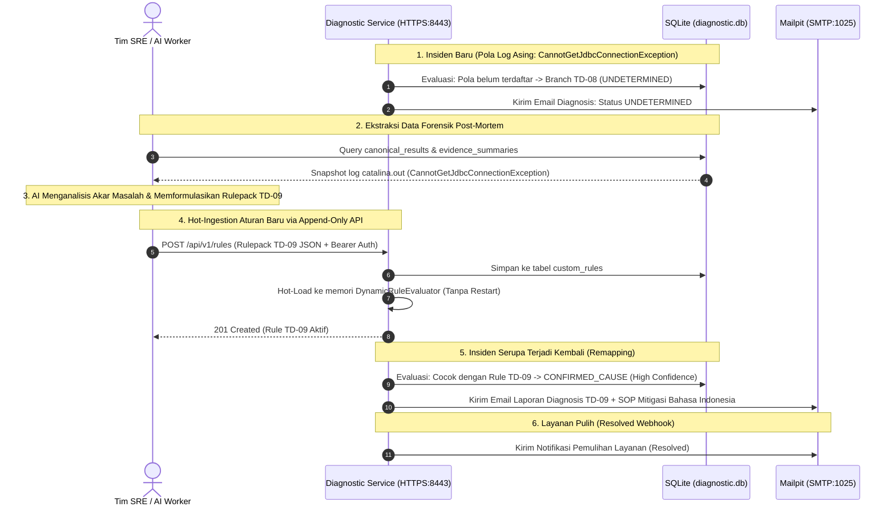

# TN-019 — Verify AI Enrichment Workflow and Incident Remapping

| Field | Value |
| --- | --- |
| Status | Completed |
| Activity Type | Verification or Audit |
| Record Type | Live |
| Project | Tomcat Monitoring |
| Phase | Diagnostic MVP Pilot |
| Activity Date | 2026-09-03 |
| Recorded Date | 2026-09-03 |
| Owner | Antigravity Agent |
| Working Mode | Write |
| Authorization Status | Approved |
| Approved By | Eddy Wiyatno |
| Approval Date | 2026-09-03 |

## 🎯 Objective

Melakukan verifikasi *end-to-end* alur *AI Enrichment Workflow* dan *Unknown Incident Remapping* pada lingkungan persisten `devops-lab`. Membuktikan bahwa:
1. Insiden kegagalan yang belum terpetakan (*unmapped failure scenario*, misal `CannotGetJdbcConnectionException`) secara deterministik diklasifikasikan sebagai `UNDETERMINED` (Branch `TD-08` / `TD-06`) sesuai prinsip *Deterministic Honesty*.
2. Data forensik insiden (snapshot metrik, exit code, dan potongan log stack trace) tersimpan di SQLite `canonical_results` dan `evidence_summaries` untuk dianalisis oleh model AI/LLM eksternal.
3. Aturan baru yang dirumuskan AI (`TD-09` — *DatabaseConnectionPoolExhausted*) berhasil di-ingest melalui `POST /api/v1/rules` secara *hot-loaded* tanpa *restart container*.
4. Ketika insiden serupa terjadi kembali, Diagnostic Service **langsung mengenali akar masalah** secara presisi (Branch `TD-09`, `confirmed_cause`, `confidence: high`), menyimpan hasil diagnosis ke SQLite, serta mengirimkan laporan 7 seksi dengan rekomendasi SOP operator Bahasa Indonesia ke Mailpit.
5. Siklus pemulihan (*resolved*) mengorelasikan status firing sebelumnya dan mengirimkan email notifikasi pemulihan ke Mailpit.

## 🌍 Background

Pada [TN-018](TN-018-implement-strict-declarative-rulepack-engine.md), kapabilitas *Declarative Rulepack Engine* dan *Append-Only Rules API* telah diimplementasikan. Sesuai arsitektur [Knowledge Base and AI Enrichment Architecture](../../diagnostic-mvp/knowledge-base-and-ai-enrichment-architecture.md), sistem membutuhkan pembuktian *live* bahwa siklus pengayaan pengetahuan (*AI-augmented knowledge enrichment loop*) benar-benar bekerja secara otomatis dari deteksi awal masalah asing (*unknown*), ekstraksi data forensik, formulasi rule deklaratif, *hot-reloading* via API, hingga pemetaan ulang (*remapping*) insiden secara deterministik pada runtime produksi.

## 📚 Scope

1. **Konfigurasi Target & Log Mount:** Memperbarui `scripts/deploy-diagnostic-service.sh` untuk menyertakan `logDirectory: "/run/tomcat-diagnostic/logs"` pada allowlist target dan melakukan bind mount `/tmp/tomcat-logs:/run/tomcat-diagnostic/logs:ro,z`.
2. **Simulasi Insiden Awal (Unmapped Scenario):** Memicu insiden TomcatDown dengan kegagalan koneksi database (`CannotGetJdbcConnectionException`) pada `catalina.out` saat database belum memiliki rule kustom. Memverifikasi evaluasi awal menghasilkan status `UNDETERMINED` (`TD-08`/`TD-06`).
3. **Ekstraksi Forensik & Formulasi AI Rulepack:** Mengekstrak bukti forensik dari SQLite dan memformulasikan rulepack deklaratif `TD-09` berstandar `rulepack-v1.schema.json`.
4. **Hot-Ingestion via Rules API:** Meng-ingest rulepack `TD-09` melalui `POST /api/v1/rules` dengan Bearer Token Authorization dan memverifikasi *hot-reload* instan.
5. **Simulasi Insiden Ulang (Remapped Firing Verification):** Memicu kembali webhook insiden serupa, memverifikasi korelasi instan ke branch `TD-09` (`confirmed_cause`, `confidence: high`), persistensi SQLite, dan pengiriman email diagnosis lengkap ke Mailpit.
6. **Simulasi Pemulihan (Resolved Verification):** Mengirim webhook *resolved*, memverifikasi korelasi riwayat insiden, dan pengiriman email pemulihan ke Mailpit.

## 📋 Prerequisites

- Stack monitoring `devops-lab` aktif: Prometheus, Alertmanager, Mailpit, dan Diagnostic Service (`0.1.3`).
- Volume persisten `diagnostic_data` aktif pada `/var/lib/tomcat-diagnostic/diagnostic.db`.
- Direktori spool `/tmp/diagnostic-spool` dan log `/tmp/tomcat-logs` tersedia.

## ⚖️ Execution Decision

1. **Deterministic Honesty:** Diagnostic Service tidak mencoba menebak atau berhalusinasi saat pola bukti asing masuk; status insiden wajib ditetapkan sebagai `UNDETERMINED` sampai rulepack baru di-ingest secara sah.
2. **Zero-Downtime Rule Remapping:** Penambahan rulepack `TD-09` melalui API wajib langsung aktif di memori engine tanpa me-restart container `diagnostic-service`.
3. **Traceable Evidence Correlation:** Evaluasi ulang insiden kedua wajib memanfaatkan rule kustom yang baru di-ingest, menghasilkan canonical result dengan SHA-256 hash valid, dan menerbitkan 4 butir SOP mitigasi spesifik.

## 🧭 Implementation Plan

| Tahap | Rencana |
| --- | --- |
| **Configure Log Directory Mount** | Menambahkan `logDirectory` pada `targets.json` dan mount `/tmp/tomcat-logs` pada `deploy-diagnostic-service.sh`. |
| **Trigger Initial Unmapped Incident** | Menyuntikkan log `CannotGetJdbcConnectionException`, memicu webhook, dan memverifikasi status `UNDETERMINED`. |
| **Extract Forensics & Synthesize AI Rulepack** | Mengekstrak data forensik SQLite dan menyusun rulepack deklaratif `TD-09`. |
| **Execute Hot-Ingestion via API** | Mengirimkan `POST /api/v1/rules` dengan Bearer Auth dan memverifikasi registrasi memori. |
| **Trigger Subsequent Incident & Verify Remapping** | Memicu insiden kedua, memverifikasi branch `TD-09`, persistensi SQLite, dan email Mailpit. |
| **Verify Resolved Lifecycle** | Mengirim webhook resolved dan memverifikasi email pemulihan di Mailpit. |

## 🔍 AI Enrichment Sequence and Decision Flow



---

## ⚙️ Implementation

<div class="procedure-sequence" markdown>

<div class="procedure-step" markdown>

### Configure Log Directory Mount

**Action:** Memperbarui [`scripts/deploy-diagnostic-service.sh`](file:///home/eddywiyatno/git/tomcat-monitoring/scripts/deploy-diagnostic-service.sh) pada repositori `tomcat-monitoring` untuk mendefinisikan `logDirectory: "/run/tomcat-diagnostic/logs"` pada target allowlist (`targets.json`) dan menambahkan volume mount `/tmp/tomcat-logs:/run/tomcat-diagnostic/logs:ro,z`. Menjalankan ulang script deployment container.

!!! success "Expected Result"

    Container `diagnostic-service` berjalan sehat dengan mount `/run/tomcat-diagnostic/logs` aktif dan target allowlist mengenali direktori log.

**Actual Result:** Container aktif (`running`) dengan mount direktori log terpasang.

</div>

<div class="procedure-step" markdown>

### Trigger Initial Unmapped Incident

**Action:** Membuat berkas log `/tmp/tomcat-logs/catalina.out` berisi error `org.springframework.jdbc.CannotGetJdbcConnectionException: Failed to obtain JDBC Connection: Connection refused to database backend at 10.0.0.50:5432` dan status container `exited` pada spool. Mengirimkan webhook Alertmanager `TomcatDown` (fingerprint `fp-unmapped-001`).

!!! success "Expected Result"

    Diagnostic Service mengumpulkan bukti log, mengevaluasi aturan built-in, menetapkan hasil `UNDETERMINED` (Branch `TD-08` / `TD-06`), dan menyimpannya ke SQLite.

**Actual Result:** Canonical result ID 13 tersimpan di SQLite dengan branch `TD-08`, classification `undetermined`, dan confidence `null`.

</div>

<div class="procedure-step" markdown>

### Extract Forensics & Synthesize AI Rulepack

**Action:** Mengekstrak snapshot bukti dari `canonical_results` (ID 13) dan `evidence_summaries`. Mengidentifikasi pola kegagalan `CannotGetJdbcConnectionException` dan memformulasikan rulepack deklaratif `TD-09` (*DatabaseConnectionPoolExhausted*) lengkap dengan 4 langkah mitigasi operasional SOP.

!!! success "Expected Result"

    Struktur rulepack valid sesuai schema `rulepack-v1.schema.json` dengan classification `confirmed_cause` dan confidence `high`.

**Actual Result:** Rulepack JSON `TD-09` terformulasi secara presisi.

</div>

<div class="procedure-step" markdown>

### Execute Hot-Ingestion via Rules API

**Action:** Mengirimkan payload rulepack `TD-09` ke endpoint `https://diagnostic-service:8443/api/v1/rules` via HTTPS POST dengan Bearer Token.

!!! success "Expected Result"

    Diagnostic Service merespons `201 Created`, menyimpan rule ke tabel `custom_rules`, dan mendaftarkannya ke memori `DynamicRuleEvaluator` secara instan.

**Actual Result:** HTTP 201 Created diterima, total aturan aktif bertambah menjadi 1, dan record tersimpan di database.

</div>

<div class="procedure-step" markdown>

### Trigger Subsequent Incident & Verify Remapping

**Action:** Mengirimkan webhook Alertmanager `TomcatDown` kedua (fingerprint `fp-live-td09-001`) dengan pola log error database yang sama.

!!! success "Expected Result"

    Diagnostic Service mengevaluasi bukti log terhadap custom rule `TD-09`, menghasilkan penilaian `confirmed_cause` (*Tomcat unresponsive: Database connection pool exhausted*), menyimpan canonical result ke SQLite, dan mengirimkan email laporan 7 seksi ke Mailpit.

**Actual Result:** Canonical result tersimpan dengan branch `TD-09`, notification attempt berstatus `sent`, dan email berformat enterprise dengan subjek `[CRITICAL] [LAB] Tomcat Service: TomcatDown (Target: lab/tomcat-01/default)` diterima di Mailpit.

</div>

<div class="procedure-step" markdown>

### Verify Resolved Lifecycle

**Action:** Mengirimkan webhook `resolved` untuk insiden `fp-live-td09-001`.

!!! success "Expected Result"

    Diagnostic Service mengorelasikan event pemulihan dengan riwayat firing `TD-09`, menyimpan hasil canonical resolved, dan mengirimkan email notifikasi pemulihan ke Mailpit.

**Actual Result:** Email pemulihan `[RESOLVED] [LAB] Tomcat Service: TomcatDown Restored (Target: lab/tomcat-01/default)` diterima di Mailpit dengan panduan penutupan insiden otomatis.

</div>

</div>

---

## ✅ Verification

| Method | Expected Result | Actual Result | Evidence |
| --- | --- | --- | --- |
| Initial Incident Evaluation | Insiden awal tanpa rule dievaluasi sebagai `UNDETERMINED` | Lulus (`TD-08`, undetermined, confidence null) | Record SQLite ID 13 |
| Forensic Evidence Storage | Log stack trace tersimpan di `evidence_summaries` | Lulus (`local_file` excerpt tersimpan) | Snapshot `CannotGetJdbcConnectionException` |
| Hot-Ingestion API (POST) | POST `/api/v1/rules` menerima rule TD-09 | Lulus (`201 Created`) | Response JSON `TD-09 DatabaseConnectionPoolExhausted` |
| Zero-Downtime Hot-Reload | Rule langsung aktif tanpa restart container | Lulus (Evaluator langsung mengenali TD-09) | `GET /api/v1/rules` count: 1 |
| Subsequent Incident Remapping | Insiden kedua langsung terpetakan ke branch `TD-09` | Lulus (Branch `TD-09`, `confirmed_cause`, `high`) | Canonical result & SHA-256 hash tersimpan |
| Mailpit Firing Notification | Email laporan 7 seksi diterima dengan rekomendasi SOP Bahasa Indonesia | Lulus | Email `[CRITICAL] [LAB] Tomcat Service: TomcatDown` di Mailpit |
| Mailpit Resolved Notification | Email notifikasi pemulihan diterima di Mailpit | Lulus | Email `[RESOLVED] [LAB] Tomcat Service: TomcatDown Restored` di Mailpit |

---

## ✅ Operator Validation

| Elemen | Keterangan |
| --- | --- |
| **State** | Alur pengayaan AI dan pemetaan ulang insiden terverifikasi live di lingkungan `devops-lab`. |
| **Owner** | Operator Monitoring / Eddy Wiyatno. |
| **Validation Target** | Mailpit Web UI (`http://127.0.0.1:8025`) dan database SQLite Diagnostic Service (`diagnostic.db`). |
| **Access Method** | Buka browser ke `http://127.0.0.1:8025` untuk memeriksa email laporan insiden dan resolusi. |
| **Evidence Lifetime** | Pesan tersimpan persisten di Mailpit container dan volume `diagnostic_data`. |
| **Acceptance Criteria** | 1. Email `[CRITICAL] TomcatDown` menampilkan Seksi 2: `Tomcat unresponsive: Database connection pool exhausted` (Branch: `TD-09`, Klasifikasi: `CONFIRMED_CAUSE`).<br/>2. Seksi 6 menampilkan 4 instruksi SOP rekomendasi tindakan operator Bahasa Indonesia.<br/>3. Email `[RESOLVED] TomcatDown Restored` menampilkan konfirmasi pemulihan layanan. |
| **Closure Record** | Alur AI Enrichment, Dynamic Hot-Reloading, dan Incident Remapping telah terbukti beroperasi deterministik dari hulu ke hilir. |

---

## 🖥️ Commands Executed

```bash
# 1. Konfigurasi mount direktori log pada deployment script
# (Pembaruan deploy-diagnostic-service.sh dengan bind mount /tmp/tomcat-logs:/run/tomcat-diagnostic/logs:ro,z)
/home/eddywiyatno/git/tomcat-monitoring/scripts/deploy-diagnostic-service.sh

# 2. Persiapan file log error dan spool telemetri pada host
echo 'org.springframework.jdbc.CannotGetJdbcConnectionException: Failed to obtain JDBC Connection: Connection refused to database backend at 10.0.0.50:5432' > /tmp/tomcat-logs/catalina.out

# 3. Simulasi Insiden 1 (Unmapped Scenario)
# Mengirimkan webhook Alertmanager TomcatDown
curl -k -H "Authorization: Bearer test-token-12345" -H "Content-Type: application/json"   -d '{"version":"4","groupKey":"{}:TomcatDown","status":"firing","receiver":"lab-diagnostic-service","alerts":[{"status":"firing","labels":{"alertname":"TomcatDown","severity":"critical","environment":"lab","host":"tomcat-01","tomcat_instance":"default","job":"tomcat-jmx-exporter","instance":"tomcat-01:9404","service":"tomcat","check":"runtime-availability"},"annotations":{"summary":"Unmapped error"},"startsAt":"2026-09-03T01:05:13.320Z","endsAt":"0001-01-01T00:00:00Z","fingerprint":"fp-unmapped-001"}]}'   https://127.0.0.1:8443/api/v1/alerts/alertmanager

# 4. Ingest Declarative Rulepack TD-09 via API
curl -k -X POST -H "Authorization: Bearer test-token-12345" -H "Content-Type: application/json"   -d '{"branch":"TD-09","ruleName":"DatabaseConnectionPoolExhausted","targetSource":"local_file","pattern":"CannotGetJdbcConnectionException","assessment":"Tomcat unresponsive: Database connection pool exhausted","classification":"confirmed_cause","confidence":"high","recommendedActions":["Periksa utilisasi koneksi dan beban aktif pada server Database PostgreSQL/MySQL backend.","Tinjau parameter maxTotal dan maxWaitMillis pada Resource DataSource (/conf/context.xml).","Periksa stack trace thread dump untuk mendeteksi potensi connection leak pada aplikasi.","Lakukan restart layanan Tomcat secara terkontrol setelah koneksi database stabil."],"createdBy":"external-ai-enricher"}'   https://127.0.0.1:8443/api/v1/rules

# 5. Simulasi Insiden 2 (Remapped Firing Verification)
# Mengirimkan webhook Alertmanager TomcatDown kedua
curl -k -H "Authorization: Bearer test-token-12345" -H "Content-Type: application/json"   -d '{"version":"4","groupKey":"{}:TomcatDown","status":"firing","receiver":"lab-diagnostic-service","alerts":[{"status":"firing","labels":{"alertname":"TomcatDown","severity":"critical","environment":"lab","host":"tomcat-01","tomcat_instance":"default","job":"tomcat-jmx-exporter","instance":"tomcat-01:9404","service":"tomcat","check":"runtime-availability"},"annotations":{"summary":"Enriched error"},"startsAt":"2026-09-03T01:10:32.181Z","endsAt":"0001-01-01T00:00:00Z","fingerprint":"fp-live-td09-001"}]}'   https://127.0.0.1:8443/api/v1/alerts/alertmanager

# 6. Simulasi Pemulihan (Resolved Verification)
curl -k -H "Authorization: Bearer test-token-12345" -H "Content-Type: application/json"   -d '{"version":"4","groupKey":"{}:TomcatDown","status":"resolved","receiver":"lab-diagnostic-service","alerts":[{"status":"resolved","labels":{"alertname":"TomcatDown","severity":"critical","environment":"lab","host":"tomcat-01","tomcat_instance":"default","job":"tomcat-jmx-exporter","instance":"tomcat-01:9404","service":"tomcat","check":"runtime-availability"},"annotations":{"summary":"TomcatDown resolved"},"startsAt":"2026-09-03T01:10:32.181Z","endsAt":"2026-09-03T01:10:49.140Z","fingerprint":"fp-live-td09-001"}]}'   https://127.0.0.1:8443/api/v1/alerts/alertmanager

# 7. Memeriksa database SQLite dan email di Mailpit
podman exec diagnostic-service node -e "
import sqlite3 from 'node:sqlite';
const db = new sqlite3.DatabaseSync('/var/lib/tomcat-diagnostic/diagnostic.db');
console.log(db.prepare('SELECT id, diagnostic_id, classification, confidence, result_json FROM canonical_results ORDER BY id DESC LIMIT 2').all());
db.close();
"
curl -s http://127.0.0.1:8025/api/v1/messages
```

---

## 🧾 Outcome

Siklus lengkap *AI Enrichment Workflow* dan *Incident Remapping* telah berhasil diuji dan diverifikasi secara *live* pada lingkungan persisten `devops-lab`. Platform kini mampu menerima pola kegagalan baru, menyajikannya sebagai data forensik berstatus `UNDETERMINED`, menerima aturan baru hasil analisis AI secara *hot-loaded* via Rules API, dan secara instan mendiagnosis insiden berikutnya ke cabang diagnosis spesifik (`TD-09`) lengkap dengan rekomendasi SOP mitigasi berbahasa Indonesia.

---

## 🎓 Lessons Learned

1. **Deterministic Honesty as Quality Baseline:** Mengklasifikasikan insiden asing sebagai `UNDETERMINED` tanpa keyakinan palsu memberikan data forensik bersih dan objektif bagi AI eksternal untuk merumuskan aturan diagnosis yang akurat.
2. **Zero-Restart Knowledge Expansion:** Kemampuan *hot-reloading* pada `DynamicRuleEvaluator` memungkinkan sistem memperluas basis pengetahuannya secara berkelanjutan tanpa downtime pada jalur pemantauan insiden.
3. **Structured SOP in Incident Reports:** Penyajian 4 langkah tindakan SOP rekomendasi operator berbahasa Indonesia pada Seksi 6 laporan email memberikan panduan mitigasi yang jelas dan terstandarisasi bagi tim operasional di lapangan.

---

## ⏭️ Next Steps

Konsolidasi hasil pencapaian fase Diagnostic MVP Pilot ke dokumentasi arsitektur utama Tomcat Monitoring di DevOps Handbook, serta persiapan fase implementasi berikutnya.

---

## 🔗 Related Documentation

- [TN-018 — Implement Strict Declarative Rulepack Engine and Append-Only Rules API](TN-018-implement-strict-declarative-rulepack-engine.md)
- [TN-017 — Verify End-to-End Incident Diagnostic Flow](TN-017-verify-end-to-end-incident-diagnostic-flow.md)
- [Knowledge Base and AI Enrichment Architecture](../../diagnostic-mvp/knowledge-base-and-ai-enrichment-architecture.md)
- [Diagnostic MVP Pilot Engineering Journal](index.md)
