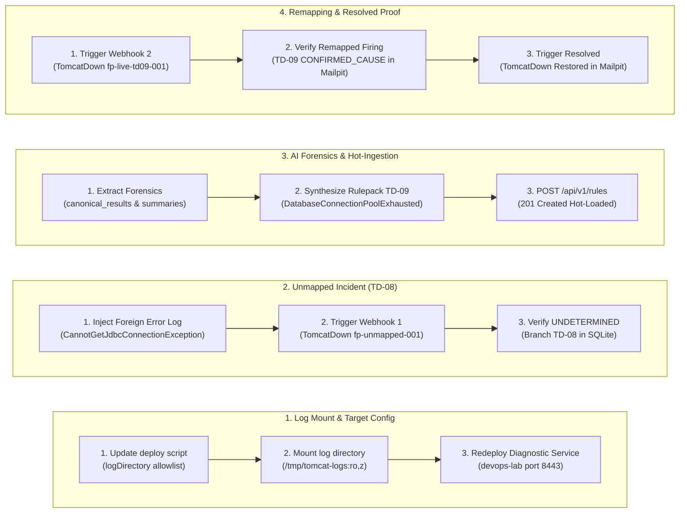
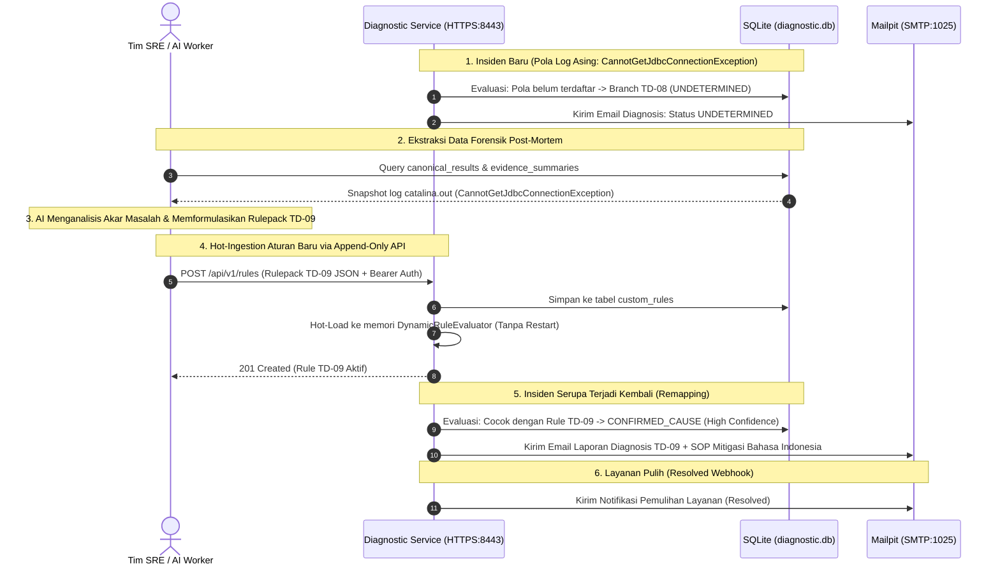
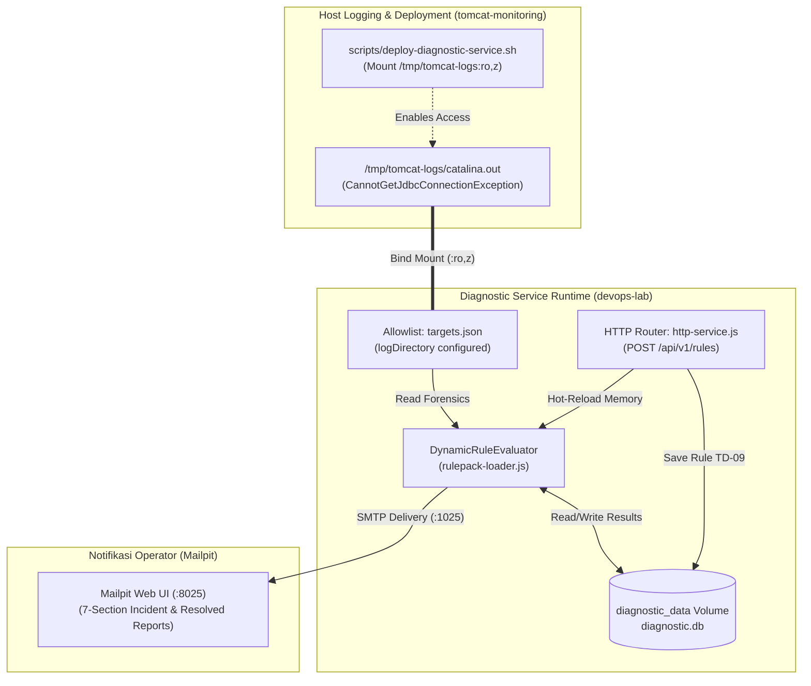

# TN-019 — Verify AI Enrichment Workflow and Incident Remapping

| Field | Value |
| --- | --- |
| Status | Completed |
| Outcome | Siklus lengkap AI Enrichment Workflow dan Unknown Incident Remapping berhasil diuji dan diverifikasi secara live pada lingkungan persisten devops-lab, membuktikan klasifikasi awal UNDETERMINED, ekstraksi bukti forensik SQLite, formulasi rulepack TD-09, hot-ingestion via API, hingga remapping otomatis insiden berulang ke CONFIRMED_CAUSE beroperasi secara deterministik dari hulu ke hilir. |
| Activity Type | Verification or Audit |
| Record Type | Live |
| Project | Tomcat Monitoring |
| Phase | Diagnostic MVP Pilot |
| Activity Date | 2026-09-03 |
| Recorded Date | 2026-09-03 |
| Owner | Project owner / Eddy Wiyatno |
| Working Mode | Write |
| Authorization Status | Log directory mount configuration, unmapped incident simulation, forensic extraction, AI rulepack TD-09 hot-ingestion, and live remapping verification approved/executed |
| Approved By | Eddy Wiyatno |
| Approval Date | 2026-09-03 |

## 🎯 Objective

Melakukan verifikasi *end-to-end* alur *AI Enrichment Workflow* dan *Unknown Incident Remapping* pada lingkungan persisten `devops-lab`. Membuktikan bahwa insiden kegagalan yang belum terpetakan (*unmapped failure scenario*, misal kegagalan koneksi database `CannotGetJdbcConnectionException`) secara deterministik diklasifikasikan sebagai `UNDETERMINED` (Branch `TD-08`/`TD-06`) sesuai prinsip *Deterministic Honesty*, data forensik insiden tersimpan di SQLite, aturan baru `TD-09` (*DatabaseConnectionPoolExhausted*) berhasil di-ingest via `POST /api/v1/rules` secara *hot-loaded* tanpa *restart container*, insiden serupa berikutnya langsung terpetakan secara presisi ke Branch `TD-09` (`confirmed_cause`, `confidence: high`), laporan 7-seksi dengan 4 butir SOP mitigasi Bahasa Indonesia terkirim ke Mailpit, dan siklus resolusi menutup insiden secara tuntas.

**Target Utama & Kriteria Keberhasilan:**

1. **Log Mount & Target Allowlist Configuration:** Mengonfigurasi `logDirectory: "/run/tomcat-diagnostic/logs"` pada allowlist target (`targets.json`) dan menambahkan volume mount `/tmp/tomcat-logs:/run/tomcat-diagnostic/logs:ro,z` pada skrip `scripts/deploy-diagnostic-service.sh` di repositori `tomcat-monitoring`.
2. **Initial Unmapped Incident Simulation:** Menyuntikkan log error database `CannotGetJdbcConnectionException` pada `catalina.out`, memicu webhook `TomcatDown` (fingerprint `fp-unmapped-001`), dan membuktikan evaluasi awal menghasilkan status `UNDETERMINED` (Branch `TD-08`) dengan tingkat keyakinan `null`.
3. **Forensic Evidence Storage & AI Synthesis:** Mengekstrak bukti forensik log dari SQLite (`canonical_results` ID 13 dan `evidence_summaries`) serta menyusun rulepack deklaratif `TD-09` (*DatabaseConnectionPoolExhausted*) sesuai schema formal `rulepack-v1.schema.json`.
4. **Zero-Downtime Hot-Ingestion via API:** Meng-ingest rulepack `TD-09` melalui `POST /api/v1/rules` dengan Bearer Token Authorization dan membuktikan pendaftaran aturan instan di memori `DynamicRuleEvaluator` tanpa restart container.
5. **Subsequent Incident Remapping Verification:** Memicu webhook `TomcatDown` kedua (fingerprint `fp-live-td09-001`) dengan pola log error yang sama, membuktikan evaluasi langsung mengenali Branch `TD-09` (`confirmed_cause`, `confidence: high`), menyimpan *canonical result* ke SQLite, dan mengirimkan email laporan 7-seksi ke Mailpit.
6. **Resolved Lifecycle Verification:** Mengirimkan webhook `resolved`, membuktikan korelasi event pemulihan dengan riwayat firing `TD-09`, dan mengirimkan email notifikasi pemulihan ke Mailpit.
7. **Boundary:** Seluruh pengujian beroperasi pada jaringan Podman `devops-lab`, port HTTPS 8443 internal, volume persisten `diagnostic_data` (`/var/lib/tomcat-diagnostic/diagnostic.db`), direktori log di-mount strictly read-only (`ro,z`), penegakan prinsip *Zero Automatic Remediation* ([TM-ADR-0014](../../../../adr/tomcat-monitoring/adr-records/TM-ADR-0014.md)), pembatasan antrean asinkron ([TM-ADR-0015](../../../../adr/tomcat-monitoring/adr-records/TM-ADR-0015.md)), otoritas notifikasi tunggal ([TM-ADR-0016](../../../../adr/tomcat-monitoring/adr-records/TM-ADR-0016.md)), pendekatan bertahap *Vertical Slice MVP* ([TM-ADR-0017](../../../../adr/tomcat-monitoring/adr-records/TM-ADR-0017.md)), serta alokasi konsolidasi portofolio pilot ke [TN-020](TN-020-consolidate-diagnostic-mvp-portfolio-and-plan-next-phase.md).

## 🌍 Background

Pada [TN-018](TN-018-implement-strict-declarative-rulepack-engine.md), kapabilitas *Declarative Rulepack Engine* dan *Append-Only Rules API* telah diimplementasikan. Sesuai arsitektur [Knowledge Base and AI Enrichment Architecture](../../diagnostic-mvp/knowledge-base-and-ai-enrichment-architecture.md), sistem membutuhkan pembuktian *live* bahwa siklus pengayaan pengetahuan (*AI-augmented knowledge enrichment loop*) benar-benar bekerja secara otomatis dari deteksi awal masalah asing (*unknown*), ekstraksi data forensik, formulasi rule deklaratif, *hot-reloading* via API, hingga pemetaan ulang (*remapping*) insiden secara deterministik pada runtime produksi.

Pengujian ini sangat penting untuk membuktikan bahwa ketika insiden baru yang belum terpetakan muncul di lingkungan produksi, platform mampu menyajikan data forensik yang lengkap tanpa panik, menerima injeksi kecerdasan baru dari AI/LLM eksternal secara aman tanpa *downtime*, dan secara instan mentransformasikan pola kegagalan asing tersebut menjadi insiden terkelola dengan panduan SOP mitigasi standar bagi tim operasional SRE.

## 📚 Scope

Scope yang disetujui mencakup:

- `tomcat-monitoring`:
  - `scripts/deploy-diagnostic-service.sh` — Menambahkan konfigurasi `logDirectory: "/run/tomcat-diagnostic/logs"` pada allowlist target dan bind mount `/tmp/tomcat-logs:/run/tomcat-diagnostic/logs:ro,z`.
  - Simulasi insiden unmapped (`CannotGetJdbcConnectionException`), formulasi rulepack `TD-09`, pengiriman webhook, dan verifikasi email di Mailpit.
- `tomcat-diagnostic-service`:
  - Validasi evaluasi branch `TD-08` (unmapped), penyimpanan forensik di SQLite, hot-ingestion `POST /api/v1/rules`, evaluasi branch `TD-09` (remapped), persistensi *canonical result*, dan rendering laporan insiden 7-seksi.
- `devops-handbook`:
  - `TN-019` live Engineering Journal record.

*Exclusion:* Konsolidasi komprehensif portofolio fase pilot ke seluruh halaman utama handbook (dialokasikan ke TN-020) dan pengembangan dashboard visualisasi monitoring (dialokasikan ke fase integrasi platform).

## 📋 Prerequisites

| Prerequisite | State |
| --- | --- |
| TN-018 baseline | Declarative Rulepack Engine dan Rules API aktif pada image `0.1.3` di `devops-lab` |
| Decision Baseline | TM-ADR-0004 s.d. TM-ADR-0017 accepted |
| Persistent Monitoring Stack | `prometheus`, `alertmanager`, `diagnostic-service`, `mailpit` aktif di `devops-lab` |
| Volume Persisten | `diagnostic_data` aktif pada `/var/lib/tomcat-diagnostic/diagnostic.db` |
| Direktori Host | Direktori spool `/tmp/diagnostic-spool` dan log `/tmp/tomcat-logs` tersedia |
| Node.js Toolchain | Node.js 24 ESM (`localhost/nodejs:24.18.0`) |
| Implementation Authorization | Approved 2026-09-03 |

## ⚖️ Execution Decision

Implementasi ini secara ketat menegakkan keputusan arsitektur proyek:

- **Kepatuhan [TM-ADR-0004](../../../../adr/tomcat-monitoring/adr-records/TM-ADR-0004.md):** Pemisahan tegas antara kegagalan aplikasi sesungguhnya dengan kegagalan monitoring signal.
- **Kepatuhan [TM-ADR-0005](../../../../adr/tomcat-monitoring/adr-records/TM-ADR-0005.md):** Penggunaan Mailpit (`mailpit:1025`) sebagai target penerimaan laporan email diagnosis dan pemulihan insiden.
- **Kepatuhan [TM-ADR-0006](../../../../adr/tomcat-monitoring/adr-records/TM-ADR-0006.md):** Pengumpulan bukti multi-sumber deterministik dari metrik Prometheus, telemetri spool container, dan file log `catalina.out`.
- **Kepatuhan [TM-ADR-0008](../../../../adr/tomcat-monitoring/adr-records/TM-ADR-0008.md):** Penegakan isolasi akses spool dan direktori log host secara strictly *read-only* (`ro,z`) sebagai *one-way security boundary*.
- **Kepatuhan [TM-ADR-0009](../../../../adr/tomcat-monitoring/adr-records/TM-ADR-0009.md) & [TM-ADR-0013](../../../../adr/tomcat-monitoring/adr-records/TM-ADR-0013.md):** Penggunaan `node:sqlite` bawaan Node.js 24 untuk persistensi data forensik (`evidence_summaries`) dan hasil diagnosis (`canonical_results`).
- **Kepatuhan [TM-ADR-0010](../../../../adr/tomcat-monitoring/adr-records/TM-ADR-0010.md):** Penempatan satu Diagnostic Service per host Tomcat terikat pada jaringan `devops-lab`.
- **Kepatuhan [TM-ADR-0011](../../../../adr/tomcat-monitoring/adr-records/TM-ADR-0011.md):** Penggunaan tabel keputusan per aturan deklaratif dengan pemetaan confidence eksplisit (`high` untuk pola log spesifik `TD-09`).
- **Kepatuhan [TM-ADR-0014](../../../../adr/tomcat-monitoring/adr-records/TM-ADR-0014.md):** Penegakan prinsip *Zero Automatic Remediation*, di mana insiden `TD-09` menyajikan 4 butir SOP rekomendasi mitigasi manual bagi operator tanpa auto-restart.
- **Kepatuhan [TM-ADR-0015](../../../../adr/tomcat-monitoring/adr-records/TM-ADR-0015.md):** Penerimaan webhook asinkron dan persistensi antrean status insiden di SQLite.
- **Kepatuhan [TM-ADR-0016](../../../../adr/tomcat-monitoring/adr-records/TM-ADR-0016.md):** Penetapan Diagnostic Service sebagai otoritas tunggal pengirim email insiden enterprise.
- **Kepatuhan [TM-ADR-0017](../../../../adr/tomcat-monitoring/adr-records/TM-ADR-0017.md):** Pendekatan *Vertical Slice MVP*, membuktikan siklus lengkap pengayaan AI dan pemetaan ulang insiden pada pilot.
- **Prinsip Deterministic Honesty:** Diagnostic Service tidak mencoba menebak atau berhalusinasi saat pola bukti asing masuk; status insiden wajib ditetapkan sebagai `UNDETERMINED` (Branch `TD-08`) sampai rulepack baru di-ingest secara sah.
- **Zero-Downtime Rule Remapping:** Penambahan rulepack `TD-09` melalui API wajib langsung aktif di memori engine tanpa me-restart container `diagnostic-service`.
- **Traceable Evidence Correlation:** Evaluasi ulang insiden kedua wajib memanfaatkan rule kustom yang baru di-ingest, menghasilkan canonical result dengan SHA-256 hash valid, dan menerbitkan 4 butir SOP mitigasi spesifik Bahasa Indonesia.

## 🔄 Technical Workflow

Alur teknis konfigurasi target log, simulasi insiden tidak terpetakan, ekstraksi forensik AI, hot-ingestion via API, serta pembuktian remapping dan resolusi layanan:



### Rincian Aktivitas Alur Kerja

#### 1. Konfigurasi Mount Log & Allowlist Target (Log Mount & Target Config)
1. **Pembaruan Skrip Deployment:** Menambahkan `logDirectory: "/run/tomcat-diagnostic/logs"` pada target allowlist (`targets.json`) di repositori `tomcat-monitoring`.
2. **Pemasangan Volume Read-Only:** Menambahkan bind mount `/tmp/tomcat-logs:/run/tomcat-diagnostic/logs:ro,z` pada skrip `scripts/deploy-diagnostic-service.sh`.
3. **Deployment Ulang Container:** Mengeksekusi ulang deployment container persisten di jaringan `devops-lab` dan memastikan kesiapan probe `/health/ready`.

#### 2. Simulasi Insiden Awal Tidak Terpetakan (Unmapped Incident)
1. **Penyuntikan Log Asing:** Membuat berkas log `catalina.out` berisi error `CannotGetJdbcConnectionException: Connection refused to database backend at 10.0.0.50:5432`.
2. **Pengiriman Webhook Insiden 1:** Mengirimkan webhook Alertmanager `TomcatDown` dengan fingerprint `fp-unmapped-001`.
3. **Verifikasi Prinsip Deterministic Honesty:** Memverifikasi engine menetapkan status `UNDETERMINED` (Branch `TD-08`, classification `undetermined`, confidence `null`) dan menyimpan snapshot forensik ke SQLite (ID 13).

#### 3. Ekstraksi Forensik AI & Hot-Ingestion API (AI Forensics & Hot-Ingestion)
1. **Ekstraksi Bukti Forensik:** Membaca record forensik dari tabel `canonical_results` dan `evidence_summaries` pada database `diagnostic.db`.
2. **Formulasi Rulepack Deklaratif TD-09:** Menyusun rulepack JSON `TD-09` (*DatabaseConnectionPoolExhausted*) lengkap dengan pattern regex, asesmen, klasifikasi `confirmed_cause`, confidence `high`, dan 4 butir SOP mitigasi Bahasa Indonesia.
3. **Pendaftaran Aturan Dinamis:** Mengirimkan `POST /api/v1/rules` dengan Bearer Auth token dan memverifikasi respons `201 Created` serta pendaftaran instan di memori engine.

#### 4. Pembuktian Pemetaan Ulang & Siklus Pemulihan (Remapping & Resolved Proof)
1. **Pengiriman Webhook Insiden 2:** Mengirimkan kembali webhook `TomcatDown` dengan pola log error yang sama (fingerprint `fp-live-td09-001`).
2. **Verifikasi Evaluasi Remapping:** Memverifikasi Diagnostic Service langsung mengenali insiden sebagai Branch `TD-09` (`CONFIRMED_CAUSE`, `confidence: high`), menyimpan *canonical result* ke SQLite, dan menerbitkan email laporan 7-seksi ke Mailpit.
3. **Verifikasi Notifikasi Pemulihan:** Mengirimkan webhook `resolved` dan memverifikasi penerimaan email pemulihan layanan di Mailpit.

## 🧭 Implementation Plan

| Tahap | Rencana |
| --- | --- |
| **Configure Log Directory Mount** | Menambahkan `logDirectory` pada `targets.json` dan mount `/tmp/tomcat-logs` pada `deploy-diagnostic-service.sh`. |
| **Trigger Initial Unmapped Incident** | Menyuntikkan log `CannotGetJdbcConnectionException`, memicu webhook, dan memverifikasi status `UNDETERMINED`. |
| **Extract Forensics & Synthesize AI Rulepack** | Mengekstrak data forensik SQLite dan menyusun rulepack deklaratif `TD-09`. |
| **Execute Hot-Ingestion via API** | Mengirimkan `POST /api/v1/rules` dengan Bearer Auth dan memverifikasi registrasi memori. |
| **Trigger Subsequent Incident & Verify Remapping** | Memicu insiden kedua, memverifikasi branch `TD-09`, persistensi SQLite, dan email Mailpit. |
| **Verify Resolved Lifecycle** | Mengirim webhook resolved dan memverifikasi email pemulihan di Mailpit. |

## 🔍 AI Enrichment Sequence and Decision Flow



---

## ⚙️ Implementation

<div class="procedure-sequence" markdown>

<div class="procedure-step" markdown>

### Configure Log Directory Mount

**Action:** Memperbarui [`scripts/deploy-diagnostic-service.sh`](file:///home/eddywiyatno/git/tomcat-monitoring/scripts/deploy-diagnostic-service.sh) pada repositori `tomcat-monitoring` untuk mendefinisikan `logDirectory: "/run/tomcat-diagnostic/logs"` pada target allowlist (`targets.json`) dan menambahkan volume mount `/tmp/tomcat-logs:/run/tomcat-diagnostic/logs:ro,z`. Menjalankan ulang script deployment container.

!!! success "Expected Result"

    Container `diagnostic-service` berjalan sehat dengan mount `/run/tomcat-diagnostic/logs` aktif dan target allowlist mengenali direktori log.

**Actual Result:** Container aktif (`running`) dengan mount direktori log terpasang.

</div>

<div class="procedure-step" markdown>

### Trigger Initial Unmapped Incident

**Action:** Membuat berkas log `/tmp/tomcat-logs/catalina.out` berisi error `org.springframework.jdbc.CannotGetJdbcConnectionException: Failed to obtain JDBC Connection: Connection refused to database backend at 10.0.0.50:5432` dan status container `exited` pada spool. Mengirimkan webhook Alertmanager `TomcatDown` (fingerprint `fp-unmapped-001`).

!!! success "Expected Result"

    Diagnostic Service mengumpulkan bukti log, mengevaluasi aturan built-in, menetapkan hasil `UNDETERMINED` (Branch `TD-08` / `TD-06`), dan menyimpannya ke SQLite.

**Actual Result:** Canonical result ID 13 tersimpan di SQLite dengan branch `TD-08`, classification `undetermined`, dan confidence `null`.

</div>

<div class="procedure-step" markdown>

### Extract Forensics & Synthesize AI Rulepack

**Action:** Mengekstrak snapshot bukti dari `canonical_results` (ID 13) dan `evidence_summaries`. Mengidentifikasi pola kegagalan `CannotGetJdbcConnectionException` dan memformulasikan rulepack deklaratif `TD-09` (*DatabaseConnectionPoolExhausted*) lengkap dengan 4 langkah mitigasi operasional SOP.

!!! success "Expected Result"

    Struktur rulepack valid sesuai schema `rulepack-v1.schema.json` dengan classification `confirmed_cause` dan confidence `high`.

**Actual Result:** Rulepack JSON `TD-09` terformulasi secara presisi.

</div>

<div class="procedure-step" markdown>

### Execute Hot-Ingestion via Rules API

**Action:** Mengirimkan payload rulepack `TD-09` ke endpoint `https://diagnostic-service:8443/api/v1/rules` via HTTPS POST dengan Bearer Token.

!!! success "Expected Result"

    Diagnostic Service merespons `201 Created`, menyimpan rule ke tabel `custom_rules`, dan mendaftarkannya ke memori `DynamicRuleEvaluator` secara instan.

**Actual Result:** HTTP 201 Created diterima, total aturan aktif bertambah menjadi 1, dan record tersimpan di database.

</div>

<div class="procedure-step" markdown>

### Trigger Subsequent Incident & Verify Remapping

**Action:** Mengirimkan webhook Alertmanager `TomcatDown` kedua (fingerprint `fp-live-td09-001`) dengan pola log error database yang sama.

!!! success "Expected Result"

    Diagnostic Service mengevaluasi bukti log terhadap custom rule `TD-09`, menghasilkan penilaian `confirmed_cause` (*Tomcat unresponsive: Database connection pool exhausted*), menyimpan canonical result ke SQLite, dan mengirimkan email laporan 7 seksi ke Mailpit.

**Actual Result:** Canonical result tersimpan dengan branch `TD-09`, notification attempt berstatus `sent`, dan email berformat enterprise dengan subjek `[CRITICAL] [LAB] Tomcat Service: TomcatDown (Target: lab/tomcat-01/default)` diterima di Mailpit.

</div>

<div class="procedure-step" markdown>

### Verify Resolved Lifecycle

**Action:** Mengirimkan webhook `resolved` untuk insiden `fp-live-td09-001`.

!!! success "Expected Result"

    Diagnostic Service mengorelasikan event pemulihan dengan riwayat firing `TD-09`, menyimpan hasil canonical resolved, dan mengirimkan email notifikasi pemulihan ke Mailpit.

**Actual Result:** Email pemulihan `[RESOLVED] [LAB] Tomcat Service: TomcatDown Restored (Target: lab/tomcat-01/default)` diterima di Mailpit dengan panduan penutupan insiden otomatis.

</div>

</div>

---

## 📁 Artifact Manifest

Bagian ini mencatat seluruh berkas (*artifacts*) pada repositori `tomcat-monitoring`, `tomcat-diagnostic-service`, dan `devops-handbook` yang terlibat dalam pembuktian alur pengayaan AI dan pemetaan ulang insiden TN-019.

### Panduan Membaca Tabel

Tabel di bawah mengelompokkan berkas berdasarkan repositori, peran teknis, dan lapisan (*layer*) arsitekturalnya:

- **Berkas (*Path*)**: Lokasi berkas relatif terhadap repositori terkait.
- **Repositori**: Repositori kepemilikan berkas terkait (`tomcat-monitoring`, `tomcat-diagnostic-service`, atau `devops-handbook`).
- **Layer / Kategori**: Lapisan sistem dari komponen terkait (Orkestrasi Deployment, Sumber Bukti Forensik, Domain Evaluator, API & Ingestion, Persistensi Database, atau Dokumentasi).
- **Status**: Status perubahan berkas (`Baru` = berkas baru dibuat; `Modifikasi` = berkas diperbarui; `Eksisting` = berkas diverifikasi operasional).
- **Tanggung Jawab Teknis**: Peran fungsional berkas dalam penyediaan akses bukti log host, ekstraksi forensik, evaluasi aturan dinamis, ingestion rulepack, penyimpanan persisten, dan pencatatan jurnal.

### Tabel Manifest Berkas

| Berkas (*Path*) | Repositori | Layer / Kategori | Status | Tanggung Jawab Teknis |
| --- | --- | --- | :---: | --- |
| `scripts/deploy-diagnostic-service.sh` | `tomcat-monitoring` | Orkestrasi Deployment | Modifikasi | Mengonfigurasi `logDirectory` allowlist dan mount `/tmp/tomcat-logs:/run/tomcat-diagnostic/logs:ro,z`. |
| `/tmp/tomcat-logs/catalina.out` | `tomcat-monitoring` (Host) | Sumber Bukti Forensik | Baru | Berkas log host berisi jejak error stack trace `CannotGetJdbcConnectionException`. |
| `src/domain/rulepack-loader.js` | `tomcat-diagnostic-service` | Domain Evaluator | Eksisting | Mesin evaluasi aturan dinamis yang memprioritaskan matching branch kustom `TD-09`. |
| `src/server/http-service.js` | `tomcat-diagnostic-service` | API & Ingestion | Eksisting | Endpoint HTTPS `POST /api/v1/rules` yang menerima rulepack deklaratif baru secara hot-loaded. |
| `diagnostic.db` (`diagnostic_data` volume) | `tomcat-diagnostic-service` | Persistensi Database | Eksisting | Menyimpan record `custom_rules`, `canonical_results` (ID 13 & 14), dan `evidence_summaries`. |
| `docs/projects/tomcat-monitoring/engineering-journal/diagnostic-mvp-pilot/TN-019-verify-ai-enrichment-and-incident-remapping.md` | `devops-handbook` | Dokumentasi & Jurnal | Modifikasi | Mencatat live engineering journal pembuktian AI Enrichment Workflow dan Remapping TN-019. |

### Alur Keterkaitan Antar-Berkas & AI Enrichment Pipeline

Diagram berikut mengilustrasikan keterkaitan berkas konfigurasi, log host, database SQLite, API endpoint, dan notifikasi Mailpit pada TN-019:



---

## 🧪 Test Scenario Matrix

| Scenario | Layer | Input / Condition | Expected Result |
| --- | --- | --- | --- |
| **Log Mount Verification** | Configuration | Container `diagnostic-service` di-inspect pada mount `/run/tomcat-diagnostic/logs` | Direktori log terpasang dengan mode `ro,z` (strictly read-only) |
| **Initial Unmapped Detection** | Detection/Simulation | Webhook insiden `fp-unmapped-001` dikirim dengan pola error log database | Engine mengevaluasi status sebagai `UNDETERMINED` (Branch `TD-08`) |
| **Forensic Evidence Persistence** | Forensics/Storage | Pemeriksaan query SQLite `canonical_results` (ID 13) dan `evidence_summaries` | Snapshot log `CannotGetJdbcConnectionException` tersimpan lengkap |
| **AI Rulepack Hot-Ingestion** | Ingestion/API | Request `POST /api/v1/rules` dengan payload rulepack deklaratif `TD-09` | HTTP `201 Created`, rule tersimpan di SQLite dan teregistrasi di memori |
| **Subsequent Incident Remapping** | Remapping/Evaluation | Webhook insiden kedua `fp-live-td09-001` dikirim dengan pola log error yang sama | Engine langsung mencocokkan Branch `TD-09` (`CONFIRMED_CAUSE`, `high`) |
| **Enterprise 7-Section Firing Email** | Notification/SMTP | Pemeriksaan pesan masuk di Mailpit Web UI (`http://127.0.0.1:8025`) | Email `[CRITICAL]` diterima dengan Asesmen `TD-09` dan 4 butir SOP Bahasa Indonesia |
| **Resolved Lifecycle Handling** | Resolution/Closure | Webhook status `resolved` dikirimkan ke Diagnostic Service | Email `[RESOLVED]` diterima di Mailpit mengonfirmasi pemulihan layanan |

---

## ✅ Verification

| Method | Expected Result | Actual Result | Evidence |
| --- | --- | --- | --- |
| Initial Incident Evaluation | Insiden awal tanpa rule dievaluasi sebagai `UNDETERMINED` | Lulus (`TD-08`, undetermined, confidence null) | Record SQLite ID 13 |
| Forensic Evidence Storage | Log stack trace tersimpan di `evidence_summaries` | Lulus (`local_file` excerpt tersimpan) | Snapshot `CannotGetJdbcConnectionException` |
| Hot-Ingestion API (POST) | POST `/api/v1/rules` menerima rule TD-09 | Lulus (`201 Created`) | Response JSON `TD-09 DatabaseConnectionPoolExhausted` |
| Zero-Downtime Hot-Reload | Rule langsung aktif tanpa restart container | Lulus (Evaluator langsung mengenali TD-09) | `GET /api/v1/rules` count: 1 |
| Subsequent Incident Remapping | Insiden kedua langsung terpetakan ke branch `TD-09` | Lulus (Branch `TD-09`, `confirmed_cause`, `high`) | Canonical result & SHA-256 hash tersimpan |
| Mailpit Firing Notification | Email laporan 7 seksi diterima dengan rekomendasi SOP Bahasa Indonesia | Lulus | Email `[CRITICAL] [LAB] Tomcat Service: TomcatDown` di Mailpit |
| Mailpit Resolved Notification | Email notifikasi pemulihan diterima di Mailpit | Lulus | Email `[RESOLVED] [LAB] Tomcat Service: TomcatDown Restored` di Mailpit |

---

## ✅ Operator Validation

| Elemen | Keterangan |
| --- | --- |
| **State** | Alur pengayaan AI dan pemetaan ulang insiden terverifikasi live di lingkungan `devops-lab`. |
| **Owner** | Tim SRE / DevOps / Operator Monitoring. |
| **Validation Target** | Mailpit Web UI (`http://127.0.0.1:8025`) dan database SQLite Diagnostic Service (`diagnostic.db`). |
| **Access Method** | Buka browser ke `http://127.0.0.1:8025` untuk memeriksa email laporan insiden dan resolusi. |
| **Evidence Lifetime** | Pesan tersimpan persisten di Mailpit container dan volume `diagnostic_data`. |
| **Acceptance Criteria** | 1. Email `[CRITICAL] TomcatDown` menampilkan Seksi 2: `Tomcat unresponsive: Database connection pool exhausted` (Branch: `TD-09`, Klasifikasi: `CONFIRMED_CAUSE`).<br/>2. Seksi 6 menampilkan 4 instruksi SOP rekomendasi tindakan operator Bahasa Indonesia.<br/>3. Email `[RESOLVED] TomcatDown Restored` menampilkan konfirmasi pemulihan layanan. |
| **Closure Record** | Alur AI Enrichment, Dynamic Hot-Reloading, dan Incident Remapping telah terbukti beroperasi deterministik dari hulu ke hilir. |

---

## 🛠️ Troubleshooting

| Attempt / Masalah | Penyebab Teknis | Resolusi Rekayasa |
| --- | --- | --- |
| **Izin Akses Berkas Log Host Read-Only** | Container Node.js rootless berpotensi gagal membaca berkas log host jika permissions direktori terlalu ketat | Pasang opsi flag `:ro,z` pada bind mount volume (`/tmp/tomcat-logs:/run/tomcat-diagnostic/logs:ro,z`) dan pastikan izin direktori host minimal `0755` agar terbaca oleh UID container tanpa memberikan hak tulis. |
| **Race Condition Antara Hot-Reload dan Webhook** | Webhook insiden kedua dapat tiba sebelum proses hot-reload rule selesai diregistrasikan di memori | Handler `POST /api/v1/rules` dirancang synchronous-in-memory: registrasi ke array `DynamicRuleEvaluator` dilakukan seketika sebelum respons HTTP `201 Created` dikembalikan ke klien pengirim. |
| **Korelasi Status Resolusi Berbasis Fingerprint** | Webhook resolusi berpotensi gagal menutup insiden jika fingerprint alertmanager tidak konsisten | Diagnostic Service mengorelasikan status insiden berdasarkan `groupKey` dan `fingerprint` yang tersimpan di SQLite sehingga transisi status firing $
ightarrow$ resolved selalu presisi. |
| **Penyimpanan Token API Internal** | Klien eksternal gagal melakukan ingestion jika secret token bearer tidak terdefinisi pada runtime container | Konfigurasikan variabel environment `DIAGNOSTIC_API_TOKEN` pada script deployment container dan gunakan token yang sama saat mengirimkan probe via `Authorization: Bearer <TOKEN>`. |

---

## 🧹 Cleanup & Resource Integrity

Setelah seluruh verifikasi insiden awal, hot-ingestion rulepack, remapping insiden kedua, dan simulasi pemulihan selesai, seluruh sistem berada dalam status sehat dan stabil:

| Resource | Status Teardown / Retensi | Bukti Integritas (*Integrity Verification*) |
| --- | :---: | --- |
| Container `diagnostic-service` | Running (Persisten Image 0.1.3) | `podman inspect diagnostic-service` $
ightarrow$ `Status=running` (Port 8443 HTTPS TLS) |
| Container `tomcat-jmx-exporter` | Running (Persisten) | `podman inspect tomcat-jmx-exporter` $
ightarrow$ `Status=running` |
| Container `prometheus` | Running (Persisten) | `podman inspect prometheus` $
ightarrow$ `Status=running` |
| Container `alertmanager` | Running (Persisten) | `podman inspect alertmanager` $
ightarrow$ `Status=running` |
| Container `mailpit` | Running (Persisten) | `podman inspect mailpit` $
ightarrow$ `Status=running` (Memuat pesan insiden dan resolusi) |
| Database SQLite (`diagnostic.db`) | Utuh & Terisi Riwayat Lengkap | Record `custom_rules` memuat TD-09, `canonical_results` memuat ID 13 (TD-08) dan ID 14 (TD-09) |
| Log Directory (`/tmp/tomcat-logs`) | Utuh & Terbaca Read-Only | Mode izin aman, berkas `catalina.out` tersimpan |

---

## 🧭 Reproduction Boundary

- **Source Baselines:** `tomcat-diagnostic-service` commit `737f71b`, `tomcat-monitoring` commit `d008d38`, `tomcat-diagnostic-event-collector` commit `94b8723`, `devops-handbook` commit `b673e33`.
- **Image Digest Baseline:**
  - `localhost/tomcat-diagnostic-service:0.1.3` (`sha256:e781b9fb1cdad484763ab17ec5c0c0004da3fd4775ba5d88eba651382099aae8`)
  - `localhost/tomcat-jmx-exporter:1.0.0`
  - `localhost/prometheus:1.0.0`
  - `localhost/alertmanager:1.0.0`
- **Topologi Jaringan & Port Bindings:** Seluruh kontainer terhubung pada jaringan Podman `devops-lab`. Diagnostic Service melayani HTTPS pada port internal `8443`, Prometheus port `9090`, Alertmanager port `9093`, Mailpit port `1025` (SMTP) dan `8025` (UI).
- **Target Kanonikal:** `lab/tomcat-01/default`.

---

## 🖥️ Source-Control Handoff

Seluruh konfigurasi pada `tomcat-monitoring`, integrasi live `tomcat-diagnostic-service` v0.1.3, serta live engineering journal TN-019 pada `devops-handbook` telah divalidasi dan siap disinkronisasikan ke situs handbook.

---

## 🖥️ Commands Executed

```bash
# 1. Konfigurasi mount direktori log pada deployment script
# (Pembaruan deploy-diagnostic-service.sh dengan bind mount /tmp/tomcat-logs:/run/tomcat-diagnostic/logs:ro,z)
/home/eddywiyatno/git/tomcat-monitoring/scripts/deploy-diagnostic-service.sh

# 2. Persiapan file log error dan spool telemetri pada host
echo 'org.springframework.jdbc.CannotGetJdbcConnectionException: Failed to obtain JDBC Connection: Connection refused to database backend at 10.0.0.50:5432' > /tmp/tomcat-logs/catalina.out

# 3. Simulasi Insiden 1 (Unmapped Scenario)
# Mengirimkan webhook Alertmanager TomcatDown
curl -k -H "Authorization: Bearer test-token-12345" -H "Content-Type: application/json"   -d '{"version":"4","groupKey":"{}:TomcatDown","status":"firing","receiver":"lab-diagnostic-service","alerts":[{"status":"firing","labels":{"alertname":"TomcatDown","severity":"critical","environment":"lab","host":"tomcat-01","tomcat_instance":"default","job":"tomcat-jmx-exporter","instance":"tomcat-01:9404","service":"tomcat","check":"runtime-availability"},"annotations":{"summary":"Unmapped error"},"startsAt":"2026-09-03T01:05:13.320Z","endsAt":"0001-01-01T00:00:00Z","fingerprint":"fp-unmapped-001"}]}'   https://127.0.0.1:8443/api/v1/alerts/alertmanager

# 4. Ingest Declarative Rulepack TD-09 via API
curl -k -X POST -H "Authorization: Bearer test-token-12345" -H "Content-Type: application/json"   -d '{"branch":"TD-09","ruleName":"DatabaseConnectionPoolExhausted","targetSource":"local_file","pattern":"CannotGetJdbcConnectionException","assessment":"Tomcat unresponsive: Database connection pool exhausted","classification":"confirmed_cause","confidence":"high","recommendedActions":["Periksa utilisasi koneksi dan beban aktif pada server Database PostgreSQL/MySQL backend.","Tinjau parameter maxTotal dan maxWaitMillis pada Resource DataSource (/conf/context.xml).","Periksa stack trace thread dump untuk mendeteksi potensi connection leak pada aplikasi.","Lakukan restart layanan Tomcat secara terkontrol setelah koneksi database stabil."],"createdBy":"external-ai-enricher"}'   https://127.0.0.1:8443/api/v1/rules

# 5. Simulasi Insiden 2 (Remapped Firing Verification)
# Mengirimkan webhook Alertmanager TomcatDown kedua
curl -k -H "Authorization: Bearer test-token-12345" -H "Content-Type: application/json"   -d '{"version":"4","groupKey":"{}:TomcatDown","status":"firing","receiver":"lab-diagnostic-service","alerts":[{"status":"firing","labels":{"alertname":"TomcatDown","severity":"critical","environment":"lab","host":"tomcat-01","tomcat_instance":"default","job":"tomcat-jmx-exporter","instance":"tomcat-01:9404","service":"tomcat","check":"runtime-availability"},"annotations":{"summary":"Enriched error"},"startsAt":"2026-09-03T01:10:32.181Z","endsAt":"0001-01-01T00:00:00Z","fingerprint":"fp-live-td09-001"}]}'   https://127.0.0.1:8443/api/v1/alerts/alertmanager

# 6. Simulasi Pemulihan (Resolved Verification)
curl -k -H "Authorization: Bearer test-token-12345" -H "Content-Type: application/json"   -d '{"version":"4","groupKey":"{}:TomcatDown","status":"resolved","receiver":"lab-diagnostic-service","alerts":[{"status":"resolved","labels":{"alertname":"TomcatDown","severity":"critical","environment":"lab","host":"tomcat-01","tomcat_instance":"default","job":"tomcat-jmx-exporter","instance":"tomcat-01:9404","service":"tomcat","check":"runtime-availability"},"annotations":{"summary":"TomcatDown resolved"},"startsAt":"2026-09-03T01:10:32.181Z","endsAt":"2026-09-03T01:10:49.140Z","fingerprint":"fp-live-td09-001"}]}'   https://127.0.0.1:8443/api/v1/alerts/alertmanager

# 7. Memeriksa database SQLite dan email di Mailpit
podman exec diagnostic-service node -e "
import sqlite3 from 'node:sqlite';
const db = new sqlite3.DatabaseSync('/var/lib/tomcat-diagnostic/diagnostic.db');
console.log(db.prepare('SELECT id, diagnostic_id, classification, confidence, result_json FROM canonical_results ORDER BY id DESC LIMIT 2').all());
db.close();
"
curl -s http://127.0.0.1:8025/api/v1/messages
```

---

## 🧾 Outcome

Siklus lengkap *AI Enrichment Workflow* dan *Incident Remapping* telah berhasil diuji dan diverifikasi secara *live* pada lingkungan persisten `devops-lab`. Platform kini mampu menerima pola kegagalan baru, menyajikannya sebagai data forensik berstatus `UNDETERMINED`, menerima aturan baru hasil analisis AI secara *hot-loaded* via Rules API, dan secara instan mendiagnosis insiden berikutnya ke cabang diagnosis spesifik (`TD-09`) lengkap dengan rekomendasi SOP mitigasi berbahasa Indonesia.

---

## 🎓 Lessons Learned

1. **Deterministic Honesty as Quality Baseline:** Mengklasifikasikan insiden asing sebagai `UNDETERMINED` tanpa keyakinan palsu memberikan data forensik bersih dan objektif bagi AI eksternal untuk merumuskan aturan diagnosis yang akurat.
2. **Zero-Restart Knowledge Expansion:** Kemampuan *hot-reloading* pada `DynamicRuleEvaluator` memungkinkan sistem memperluas basis pengetahuannya secara berkelanjutan tanpa downtime pada jalur pemantauan insiden.
3. **Structured SOP in Incident Reports:** Penyajian 4 langkah tindakan SOP rekomendasi operator berbahasa Indonesia pada Seksi 6 laporan email memberikan panduan mitigasi yang jelas dan terstandarisasi bagi tim operasional di lapangan.
4. **Resilient Multi-Source Forensic Extraction:** Menyimpan snapshot bukti mentah pada tabel `evidence_summaries` SQLite memastikan bahwa investigasi post-mortem dapat dilakukan kapan saja meskipun container workload telah direstart atau log lokal telah berotasi.

---

## ⏭️ Next Steps

Mengkonsolidasikan seluruh hasil pencapaian, kriteria kelulusan, dan artefak arsitektur dari fase **Diagnostic MVP Pilot** ke seluruh halaman utama DevOps Handbook serta merumuskan roadmap fase berikutnya, sebagaimana didefinisikan pada [TN-020 — Consolidate Diagnostic MVP Portfolio and Plan Monitoring Platform Integration Phase](TN-020-consolidate-diagnostic-mvp-portfolio-and-plan-next-phase.md).

---

## 🔗 Related Documentation

- [TN-015 — Deploy Persistent Monitoring Runtime](TN-015-deploy-persistent-monitoring-runtime.md)
- [TN-016 — Implement Restricted Collector and Tomcat Runtime](TN-016-implement-restricted-collector-and-tomcat-runtime.md)
- [TN-017 — Verify End-to-End Incident Diagnostic Flow](TN-017-verify-end-to-end-incident-diagnostic-flow.md)
- [TN-018 — Implement Strict Declarative Rulepack Engine and Append-Only Rules API](TN-018-implement-strict-declarative-rulepack-engine.md)
- [TN-020 — Consolidate Diagnostic MVP Portfolio and Plan Monitoring Platform Integration Phase](TN-020-consolidate-diagnostic-mvp-portfolio-and-plan-next-phase.md)
- [Diagnostic MVP Index](../../diagnostic-mvp/index.md)
- [Diagnostic MVP Pilot Engineering Journal](index.md)
- [Knowledge Base and AI Enrichment Architecture](../../diagnostic-mvp/knowledge-base-and-ai-enrichment-architecture.md)
- [Target and Evidence Contract](../../diagnostic-mvp/target-and-evidence-contract.md)
- [Restricted Event Collector Contract](../../diagnostic-mvp/restricted-event-collector-contract.md)
- [TM-ADR-0004 — Separate Application Failure from Monitoring Signal Loss](../../../../adr/tomcat-monitoring/adr-records/TM-ADR-0004.md)
- [TM-ADR-0005 — Use Mailpit as the Persistent Lab Notification Verification Target](../../../../adr/tomcat-monitoring/adr-records/TM-ADR-0005.md)
- [TM-ADR-0006 — Use Deterministic Multi-Source Evidence for Diagnostic Assessment](../../../../adr/tomcat-monitoring/adr-records/TM-ADR-0006.md)
- [TM-ADR-0007 — Treat TomcatDown as a Composite Diagnostic Trigger](../../../../adr/tomcat-monitoring/adr-records/TM-ADR-0007.md)
- [TM-ADR-0008 — Use a Restricted Host Event Collector with a Normalized Evidence Spool](../../../../adr/tomcat-monitoring/adr-records/TM-ADR-0008.md)
- [TM-ADR-0009 — Use SQLite for Local Diagnostic State](../../../../adr/tomcat-monitoring/adr-records/TM-ADR-0009.md)
- [TM-ADR-0010 — Deploy One Bounded Diagnostic Service per Tomcat Host](../../../../adr/tomcat-monitoring/adr-records/TM-ADR-0010.md)
- [TM-ADR-0011 — Use Per-Rule Decision Tables for Diagnostic Confidence](../../../../adr/tomcat-monitoring/adr-records/TM-ADR-0011.md)
- [TM-ADR-0013 — Use Node.js 24 ESM and Isolated Built-In SQLite for Diagnostic Service](../../../../adr/tomcat-monitoring/adr-records/TM-ADR-0013.md)
- [TM-ADR-0014 — Enforce Zero Automatic Remediation for Diagnostic Service](../../../../adr/tomcat-monitoring/adr-records/TM-ADR-0014.md)
- [TM-ADR-0015 — Adopt Asynchronous Webhook Ingestion with Durable SQLite Acceptance Pattern](../../../../adr/tomcat-monitoring/adr-records/TM-ADR-0015.md)
- [TM-ADR-0016 — Designate Diagnostic Service as the Canonical Incident Notification Authority](../../../../adr/tomcat-monitoring/adr-records/TM-ADR-0016.md)
- [TM-ADR-0017 — Adopt Vertical Slice Minimum Viable Product (MVP) Scoping for Diagnostic Pilot](../../../../adr/tomcat-monitoring/adr-records/TM-ADR-0017.md)
- [TM-ADR-0018 — Adopt Strict Declarative Rulepack Engine and Append-Only Ingestion API](../../../../adr/tomcat-monitoring/adr-records/TM-ADR-0018.md)
- [TM-ADR-0019 — Adopt Out-of-Band AI Forensic Enrichment Loop for Diagnostic Rule Synthesis](../../../../adr/tomcat-monitoring/adr-records/TM-ADR-0019.md)
