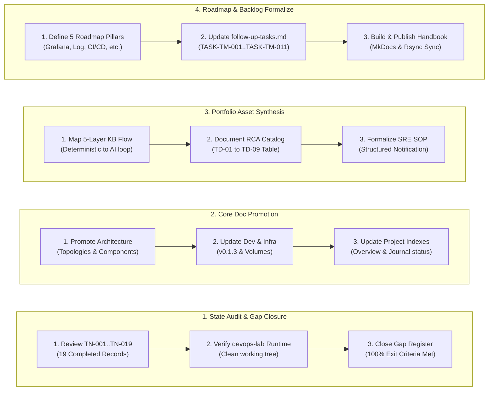
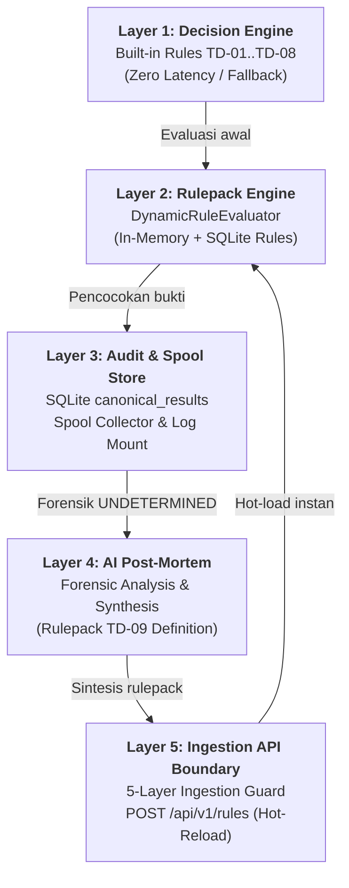
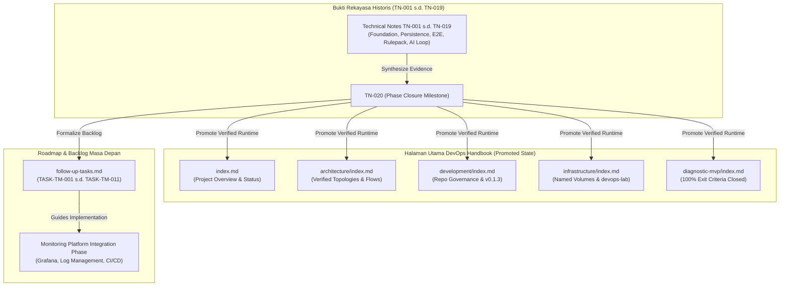

# TN-020 — Consolidate Diagnostic MVP Portfolio and Plan Monitoring Platform Integration Phase

| Field | Value |
| --- | --- |
| Status | Completed |
| Outcome | Portofolio capaian teknis dan arsitektur fase Diagnostic MVP Pilot (TN-001 s/d TN-019) berhasil dikonsolidasikan ke halaman-halaman utama DevOps Handbook, exit criteria pilot dinyatakan 100% terpenuhi dan live-verified di devops-lab, aset arsitektur 5-layer KB disintesis, dan roadmap fase Monitoring Platform Integration serta follow-up tasks backlog diformalkan secara terstruktur. |
| Activity Type | Documentation Consolidation |
| Record Type | Live |
| Project | Tomcat Monitoring |
| Phase | Diagnostic MVP Pilot |
| Activity Date | 2026-09-03 |
| Recorded Date | 2026-09-03 |
| Owner | Project owner / Eddy Wiyatno |
| Working Mode | Write |
| Authorization Status | Portfolio consolidation, core documentation promotion, exit criteria formal closure, and platform integration roadmap approved/executed |
| Approved By | Eddy Wiyatno |
| Approval Date | 2026-09-03 |

## 🎯 Objective

Mengkonsolidasikan seluruh portofolio capaian teknis dan arsitektur dari fase **Diagnostic MVP Pilot** ([TN-001](TN-001-define-diagnostic-mvp-architecture-and-contract.md) s/d [TN-019](TN-019-verify-ai-enrichment-and-incident-remapping.md)) ke halaman-halaman dokumentasi utama DevOps Handbook, memutakhirkan status sistem dari *Planned/Pending* menjadi **100% Completed and Live-Verified** pada lingkungan persisten `devops-lab`, menyusun ringkasan aset arsitektur portofolio (*5-Layer Knowledge Base & AI Enrichment Architecture*), serta merumuskan perencanaan strategis untuk fase lanjutan (**Monitoring Platform Integration Phase**) dan backlog tugas kelanjutan ([`follow-up-tasks.md`](../../follow-up-tasks.md)).

**Target Utama & Kriteria Keberhasilan:**

1. **Core Documentation & Architecture Promotion:** Memutakhirkan 7 halaman utama DevOps Handbook (`index.md`, `architecture/index.md`, `development/index.md`, `infrastructure/index.md`, `diagnostic-mvp/index.md`, `engineering-journal/index.md`, dan indeks fase) untuk mencerminkan status operasional live-verified.
2. **Exit Criteria Formal Closure & Gap Resolution:** Menutup seluruh kesenjangan teknis pada *Gap Register* dan menetapkan seluruh *Exit Criteria* fase Diagnostic MVP Pilot berstatus 100% terpenuhi.
3. **Architectural Portfolio Assets Synthesis:** Menyusun ringkasan aset arsitektur inti: *5-Layer KB Architecture*, *Declarative Rulepack Engine*, *Append-Only Rules API*, *Deterministic RCA Engine (`TD-01`..`TD-09`)*, *Restricted Event Collector*, dan *7-Section SRE Notification Presentation*.
4. **Follow-up Tasks & Platform Roadmap Formalization:** Merumuskan roadmap strategis fase *Monitoring Platform Integration* (Dashboard Grafana, Standardisasi Log, Multi-Instance Scrape, Otomatisasi CI/CD Ansible, Enterprise Event Bridge) serta menyinkronkan daftar tugas kelanjutan ([`follow-up-tasks.md`](../../follow-up-tasks.md)).
5. **Boundary:** Dokumentasi handbook secara ketat membedakan antara fakta status runtime yang telah terbukti (*proven runtime evidence*) dengan perencanaan masa depan (*future roadmap*), menegakkan seluruh prinsip arsitektur [TM-ADR-0001](../../../../adr/tomcat-monitoring/adr-records/TM-ADR-0001.md) s.d. [TM-ADR-0017](../../../../adr/tomcat-monitoring/adr-records/TM-ADR-0017.md), menjamin sanitasi data tanpa kredensial rahasia, serta menyerahkan backlog operasional ke dokumen follow-up tasks tanpa modifikasi runtime yang tidak terotorisasi.

## 🌍 Background

Fase **Diagnostic MVP Pilot** dimulai pada 2026-08-30 untuk menjawab tantangan operasional: bagaimana menghasilkan analisis akar masalah (*Root Cause Analysis* / RCA) secara deterministik dan otomatis ketika terjadi kegagalan layanan Tomcat (`TomcatDown`), tanpa bergantung pada tebakan probabilistik atau memberikan hak akses berbahaya (*least-privilege isolation*).

Sepanjang perjalanan dari TN-001 hingga TN-019, seluruh pilar arsitektur telah dirancang, diimplementasikan, dan diuji secara komprehensif:
- **Pondasi Layanan & Keamanan (TN-001 s/d TN-013):** Membangun `tomcat-diagnostic-service` berbasis Node.js 24 ESM, isolasi built-in SQLite `node:sqlite`, queue berbasis database dengan deduplikasi, worker asinkron, HTTPS TLS internal dengan bearer auth, dan adapter SMTP terisolasi.
- **Integrasi Monitoring Persisten (TN-014 s/d TN-015):** Mengonfigurasi rule Prometheus `TomcatDown`, Alertmanager sub-route & receiver webhook HTTPS, serta skrip otomatisasi deployment stack pada jaringan internal `devops-lab`.
- **Restricted Event Collector & Verifikasi Insiden End-to-End (TN-016 s/d TN-017):** Membangun repositori `tomcat-diagnostic-event-collector`, penulisan spool atomik `.tmp` ke `.json`, mount log/spool hanya-baca, dan pembuktian *live* siklus firing, diagnosis `TD-06` (OOM Heap), persistensi SQLite, hingga notifikasi Mailpit dan resolved.
- **Declarative Rulepack Engine & AI Enrichment Loop (TN-018 s/d TN-019):** Membangun *Strict Declarative Rulepack Engine*, API penambahan aturan tanpa restart (`POST /api/v1/rules`), 5 lapis *ingestion guard*, immutabilitas *append-only* (405 Method Not Allowed), serta pembuktian siklus *unknown incident* (`CannotGetJdbcConnectionException`) -> `UNDETERMINED` -> ekstraksi forensik AI -> sintesis rule `TD-09` -> *hot-ingestion* -> *instant remapping* diagnosis dan SOP mitigasi Bahasa Indonesia.

Dengan selesainya TN-019, fase Diagnostic MVP Pilot telah mencapai seluruh kriteria keberhasilan (*Exit Criteria*). Dokumentasi utama handbook perlu disinkronkan agar mencerminkan kondisi riil yang telah terverifikasi secara penuh.

## 📚 Scope

Scope yang disetujui mencakup:

1. **Konsolidasi Portofolio ke Halaman Utama Handbook:**
   - Memperbarui `docs/projects/tomcat-monitoring/index.md` (Ringkasan kapabilitas, arsitektur terverifikasi, status komponen).
   - Memperbarui `docs/projects/tomcat-monitoring/architecture/index.md` (Topologi terintegrasi, alur sekuensial, katalog komponen, kontrol keamanan).
   - Memperbarui `docs/projects/tomcat-monitoring/development/index.md` (Tanggung jawab repositori, status image dan test).
   - Memperbarui `docs/projects/tomcat-monitoring/infrastructure/index.md` (Komponen runtime persisten, alur jaringan, secret & certificate material).
   - Memperbarui `docs/projects/tomcat-monitoring/diagnostic-mvp/index.md` (Penutupan fase pilot, status exit criteria).
   - Memperbarui `docs/projects/tomcat-monitoring/engineering-journal/index.md` dan index fase terkait.
2. **Dokumentasi Aset Arsitektur Utama:**
   - Menyajikan rekapitulasi arsitektur 5-Layer Knowledge Base dan alur deteksi deterministik.
   - Menyajikan matriks keterlacakan dan status artefak seluruh repositori terkait.
3. **Perencanaan Fase Berikutnya (Monitoring Platform Integration):**
   - Merumuskan sasaran, ruang lingkup, arsitektur target, dan tahapan kerja fase integrasi platform monitoring pada `follow-up-tasks.md`.

*Exclusion:* Eksekusi runtime deployment fase lanjutan (seperti konfigurasi Grafana, deployment Telegraf multi-node, dan otomatisasi Ansible) yang dialokasikan ke fase implementasi platform integration berikutnya.

## 📋 Prerequisites

| Prerequisite | State |
| --- | --- |
| Repositori Inti | `tomcat-diagnostic-service`, `tomcat-diagnostic-event-collector`, `tomcat-monitoring`, `devops-handbook` bersih dan sinkron |
| Technical Notes Baseline | Seluruh 19 Technical Note sebelumnya ([TN-001](TN-001-define-diagnostic-mvp-architecture-and-contract.md) s/d [TN-019](TN-019-verify-ai-enrichment-and-incident-remapping.md)) berstatus `Completed` |
| Persistent Lab Environment | Layanan pada lingkungan `devops-lab` aktif dan terverifikasi beroperasi normal |
| Decision Baseline | TM-ADR-0001 s.d. TM-ADR-0017 accepted |
| Node.js & Toolchain | MkDocs build environment aktif dan siap kompilasi |
| Implementation Authorization | Approved 2026-09-03 |

## ⚖️ Execution Decision

Implementasi ini secara ketat menegakkan keputusan arsitektur proyek:

- **Kepatuhan [TM-ADR-0001](../../../../adr/tomcat-monitoring/adr-records/TM-ADR-0001.md) s.d. [TM-ADR-0003](../../../../adr/tomcat-monitoring/adr-records/TM-ADR-0003.md):** Pengelolaan repositori terisolasi, runtime container berbasis Podman rootless, dan TLS material non-Git.
- **Kepatuhan [TM-ADR-0004](../../../../adr/tomcat-monitoring/adr-records/TM-ADR-0004.md):** Pemisahan tegas antara status kegagalan aplikasi dengan kehilangan sinyal telemetri.
- **Kepatuhan [TM-ADR-0005](../../../../adr/tomcat-monitoring/adr-records/TM-ADR-0005.md) & [TM-ADR-0006](../../../../adr/tomcat-monitoring/adr-records/TM-ADR-0006.md):** Pembuktian verifikasi notifikasi Mailpit dan pengumpulan multi-sumber bukti deterministik.
- **Kepatuhan [TM-ADR-0008](../../../../adr/tomcat-monitoring/adr-records/TM-ADR-0008.md):** Penegakan isolasi akses spool dan direktori log host secara strictly *read-only* (`ro,z`).
- **Kepatuhan [TM-ADR-0009](../../../../adr/tomcat-monitoring/adr-records/TM-ADR-0009.md) & [TM-ADR-0013](../../../../adr/tomcat-monitoring/adr-records/TM-ADR-0013.md):** Persistensi SQLite lokal menggunakan `node:sqlite` bawaan Node.js 24 ESM.
- **Kepatuhan [TM-ADR-0010](../../../../adr/tomcat-monitoring/adr-records/TM-ADR-0010.md):** Penempatan bounded 1 instance Diagnostic Service per host Tomcat.
- **Kepatuhan [TM-ADR-0011](../../../../adr/tomcat-monitoring/adr-records/TM-ADR-0011.md):** Pembakuan tabel keputusan per aturan (`TD-01` s/d `TD-09`).
- **Kepatuhan [TM-ADR-0014](../../../../adr/tomcat-monitoring/adr-records/TM-ADR-0014.md):** Penegakan prinsip *Zero Automatic Remediation* di mana seluruh laporan menyediakan rekomendasi manual bagi tim SRE.
- **Kepatuhan [TM-ADR-0015](../../../../adr/tomcat-monitoring/adr-records/TM-ADR-0015.md):** Penerimaan webhook asinkron dengan antrean SQLite kapasitas 50.
- **Kepatuhan [TM-ADR-0016](../../../../adr/tomcat-monitoring/adr-records/TM-ADR-0016.md):** Penetapan Diagnostic Service sebagai otoritas tunggal pengirim email insiden enterprise.
- **Kepatuhan [TM-ADR-0017](../../../../adr/tomcat-monitoring/adr-records/TM-ADR-0017.md):** Penerapan pendekatan *Vertical Slice MVP* dan penutupan resmi fase pilot.
- **Strict Current-State Separation:** Halaman utama dokumentasi handbook hanya memuat kapabilitas dan status yang telah terbukti (*proven runtime evidence*), membedakannya secara tegas dari rencana masa depan.
- **Consistent Indonesian Narrative:** Seluruh narasi konsolidasi disusun menggunakan standar penulisan Bahasa Indonesia formal Enterprise SRE yang konsisten dengan standar dokumentasi handbook.
- **Formal Phase Closure:** Fase *Diagnostic MVP Pilot* ditutup secara resmi dengan status `Completed`, dan fase berikutnya (*Monitoring Platform Integration*) dicatat sebagai target kelanjutan project.

## 🔄 Technical Workflow

Alur teknis audit status implementasi, promosi dokumentasi inti, sintesis aset arsitektur, dan perumusan roadmap masa depan:



### Rincian Aktivitas Alur Kerja

#### 1. Audit Status & Penutupan Gap Register (State Audit & Gap Closure)
1. **Pemeriksaan Konsistensi 19 Technical Notes:** Mengonfirmasi bahwa seluruh 19 TN sebelumnya ([TN-001](TN-001-define-diagnostic-mvp-architecture-and-contract.md) s/d [TN-019](TN-019-verify-ai-enrichment-and-incident-remapping.md)) berstatus `Completed` dan memiliki bukti verifikasi konkret.
2. **Pemeriksaan Kesiapan Runtime:** Memverifikasi bahwa container persisten `diagnostic-service`, `tomcat-jmx-exporter`, `prometheus`, `alertmanager`, dan `mailpit` aktif dan stabil pada jaringan `devops-lab`.
3. **Penutupan Kriteria Keluar Pilot:** Menutup seluruh *Gap Register* pada `docs/projects/tomcat-monitoring/diagnostic-mvp/index.md` dan menyatakan seluruh kriteria kelulusan pilot 100% terpenuhi.

#### 2. Promosi Dokumentasi Inti Proyek (Core Documentation Promotion)
1. **Pemutakhiran Dokumen Arsitektur:** Mengubah status komponen Diagnostic Service, Event Collector, dan alur SQLite/Spool pada `architecture/index.md` dari status rencana (*planned*) menjadi status aktif terverifikasi (*verified runtime*).
2. **Pemutakhiran Dokumen Development & Infrastructure:** Memperbarui referensi versi rilis aplikasi (`v0.1.3`), struktur volume persisten `diagnostic_data`, bind mounts spool/log, alur jaringan internal HTTPS/SMTP, dan matriks test suite.
3. **Pemutakhiran Indeks Jurnal & Proyek:** Mengubah status fase *Diagnostic MVP Pilot* pada `engineering-journal/index.md` dan `projects/tomcat-monitoring/index.md` menjadi `Completed`.

#### 3. Sintesis Aset Arsitektur Portofolio (Portfolio Asset Synthesis)
1. **Pemetaan Arsitektur 5-Layer KB:** Menyajikan visualisasi dan dokumentasi arsitektur 5 lapis pengayaan pengetahuan (Decision Engine, Rulepack Engine, Audit Store, AI Post-Mortem, Ingestion API Boundary).
2. **Standardisasi Katalog Deteksi RCA:** Merangkum seluruh tabel keputusan deterministik mulai dari `TD-01` hingga `TD-09`.
3. **Formalisasi Pelaporan SRE:** Memformalkan template laporan insiden 7-seksi dengan SOP mitigasi Bahasa Indonesia.

#### 4. Perumusan Roadmap & Sinkronisasi Backlog (Roadmap & Backlog Formalization)
1. **Perumusan 5 Pilar Fase Integrasi:** Merumuskan roadmap strategis fase lanjutan mencakup Dashboard Observabilitas Grafana, Standardisasi Log Aggregation, Multi-Instance Scrape, Otomatisasi CI/CD Ansible, dan Kesiapan Enterprise Event Bridge.
2. **Penyelarasan Dokumen Follow-Up Tasks:** Memetakan backlog teknis ke dalam dokumen [`follow-up-tasks.md`](../../follow-up-tasks.md) (`TASK-TM-001` s.d. `TASK-TM-011`).
3. **Kompilasi & Publikasi Dokumentasi:** Mengeksekusi build MkDocs, menyinkronkan ke direktori publikasi web site, dan memverifikasi ketersediaan web.

## 🧭 Implementation Plan

| Tahap | Rencana |
| --- | --- |
| **Audit & Reconcile Diagnostic MVP Baseline** | Memverifikasi seluruh 19 Technical Notes dan memastikan status runtime terverifikasi. |
| **Promote Verified State to Main Handbook Pages** | Memutakhirkan `index.md`, `architecture/index.md`, `development/index.md`, `infrastructure/index.md`, dan `diagnostic-mvp/index.md`. |
| **Synthesize 5-Layer Knowledge Base Architecture** | Menyusun dokumentasi aset arsitektur 5-Layer KB dan alur RCA deterministik. |
| **Formulate Next Phase Strategic Roadmap** | Menyusun roadmap fase Monitoring Platform Integration dan menyelaraskan `follow-up-tasks.md`. |
| **Validate Documentation & Close Phase** | Menjalankan build MkDocs, validasi tautan silang, sinkronisasi site, dan menyatakan fase ditutup resmi. |

---

## 🏆 Portfolio Achievements Summary (Diagnostic MVP Pilot)

### A. Arsitektur 5-Layer Knowledge Base & AI Enrichment

Arsitektur yang dibangun menggabungkan kecepatan dan keandalan sistem deterministik dengan fleksibilitas analisis AI berbasis LLM:



### B. Matriks Kapabilitas Teknis yang Dibangun

| Kapabilitas | Komponen / Engine | Verifikasi & Bukti |
| --- | --- | --- |
| **Pendeteksian Insiden Deterministik** | Evaluator `TD-01` s/d `TD-08` pada `tomcat-diagnostic-service` | 17 unit/integration tests; pembuktian live OOM crash (`TD-06`) pada [TN-017](TN-017-verify-end-to-end-incident-diagnostic-flow.md) |
| **Isolasi Target & Least Privilege** | Target Allowlist Resolver & Non-Root Execution | Uji isolasi target multi-tenant; penolakan path/command arbitrary |
| **Koleksi Bukti Host Terbatas** | `tomcat-diagnostic-event-collector` (Atomic `.tmp` -> `.json` Spooling) | 3 component tests; verifikasi mount read-only `/tmp/diagnostic-spool` pada [TN-016](TN-016-implement-restricted-collector-and-tomcat-runtime.md) |
| **Persistensi & Audit Trail Lokal** | `node:sqlite` dengan skema migrasi otomatis `001` s/d `005` | Rehidrasi state setelah restart container; kapasitas bounded & retensi |
| **Pelaporan SRE Terstruktur** | 7-Section Presentation Renderer (HTML & Plain Text) | Pengiriman email otomatis ke Mailpit dengan format Enterprise SRE dan SOP Bahasa Indonesia |
| **Declarative Rulepack Ingestion** | Dynamic Evaluator & `POST /api/v1/rules` | 5-Layer Ingestion Guard (Auth, Schema, Collision, Size, Safety); 46 automated tests pada [TN-018](TN-018-implement-strict-declarative-rulepack-engine.md) |
| **AI Enrichment & Hot-Reload** | LLM Post-Mortem Workflow & Memory Rehydration | Sintesis rule `TD-09` (*DatabaseConnectionPoolExhausted*) & pemetaan ulang instan tanpa restart pada [TN-019](TN-019-verify-ai-enrichment-and-incident-remapping.md) |

---

## 🗺️ Documentation Consolidation Mapping

| Halaman Dokumentasi | Bagian yang Dimutakhirkan | Ringkasan Perubahan |
| --- | --- | --- |
| [`docs/projects/tomcat-monitoring/index.md`](../../index.md) | Overview, Current Status, Diagnostic MVP | Memutakhirkan status Diagnostic MVP menjadi 100% selesai dan terverifikasi live; mencatat kapabilitas rulepack engine dan AI enrichment; menambahkan ringkasan roadmap fase selanjutnya. |
| [`docs/projects/tomcat-monitoring/architecture/index.md`](../../architecture/index.md) | Overview, Deployment Topology, Monitoring Flow, Components, Security Controls, Current Status | Mengubah status Diagnostic Service, Event Collector, dan alur SQLite/Spool dari garis putus-putus (*planned*) menjadi garis penuh (*verified runtime*); memperbarui tabel komponen dan kontrol keamanan. |
| [`docs/projects/tomcat-monitoring/development/index.md`](../../development/index.md) | Repository Responsibilities, Repository State, Test Suites | Memutakhirkan status repositori `tomcat-diagnostic-service` (v0.1.3) dan `tomcat-diagnostic-event-collector` (active governance & tests). |
| [`docs/projects/tomcat-monitoring/infrastructure/index.md`](../../infrastructure/index.md) | Infrastructure Components, Network Requirements, Storage & Mounts, Current Status | Memutakhirkan tabel komponen infrastruktur, volume persisten `diagnostic_data`, bind mounts spool/log, alur jaringan internal HTTPS/SMTP, dan status operasional. |
| [`docs/projects/tomcat-monitoring/diagnostic-mvp/index.md`](../../diagnostic-mvp/index.md) | Overview, Pilot Status, Exit Criteria, Gap Register | Menetapkan seluruh kriteria keluar (*exit criteria*) berstatus terpenuhi; menutup gap implementasi; mengukuhkan arsitektur KB 5-layer. |
| [`docs/projects/tomcat-monitoring/engineering-journal/index.md`](../index.md) | Engineering Phases Table | Mengubah status fase *Diagnostic MVP Pilot* menjadi `Completed`. |
| [`docs/projects/tomcat-monitoring/engineering-journal/diagnostic-mvp-pilot/index.md`](index.md) | Technical Notes, Reproducibility Table, Phase Status | Mendaftarkan TN-020 dan memutakhirkan reproduction anchors. |
| [`docs/projects/tomcat-monitoring/follow-up-tasks.md`](../../follow-up-tasks.md) | Overview, Objectives, Task List | Memetakan seluruh kewajiban desain arsitektur dan backlog teknis (TASK-TM-001 s.d. TASK-TM-011) untuk mitigasi TM-ADR-0014 s.d. TM-ADR-0017. |

---

## 🚀 Next Phase Roadmap: Monitoring Platform Integration

Setelah fase pilot diagnostik membuktikan keandalan logika, langkah strategis berikutnya adalah mengintegrasikan stack monitoring ke dalam platform operasional enterprise yang utuh.

### 🎯 Sasaran Fase Lanjutan

1. **Penyediaan Dashboard Observabilitas Komprehensif (Grafana / Prometheus):**
   - Membangun dashboard visualisasi terpusat untuk metrik JVM (Heap, GC, Threads, Class Loading) dan metrik Tomcat Connector (Active Threads, Request Throughput, Error Rates, Response Times).
   - Menyajikan panel visibilitas status diagnostik dan riwayat insiden secara *real-time* ([TASK-TM-009](../../follow-up-tasks.md)).
2. **Standardisasi Log Aggregation & Incident Correlation:**
   - Memformalkan pola pengelolaan log aplikasi Tomcat dengan retensi dan rotasi terstandar.
   - Mengintegrasikan analisis pola log secara proaktif sebelum eskalasi ke alert Prometheus ([TASK-TM-010](../../follow-up-tasks.md)).
3. **Multi-Instance & Multi-Tenant Target Management:**
   - Memperluas konfigurasi *dynamic target discovery* atau multi-target allowlist untuk mendukung beberapa cluster Tomcat secara terisolasi.
4. **Otomatisasi CI/CD & Deployment Orchestration (Ansible & Pipeline):**
   - Mengimplementasikan pipeline CI untuk pengujian otomatis seluruh repositori komponen.
   - Mengimplementasikan playbook Ansible untuk *zero-touch deployment* seluruh stack monitoring, konfigurasi TLS, dan alur diagnostik ([TASK-TM-011](../../follow-up-tasks.md)).
5. **Kesiapan Produksi & Integrasi External Event Management:**
   - Menyiapkan kontrak adaptasi menuju sistem notifikasi eksternal atau event bridge (seperti Integration Bridge / TrueSight / Webhook Enterprise) ketika lingkungan target tersedia.

---

## ⚙️ Implementation

<div class="procedure-sequence" markdown>

<div class="procedure-step" markdown>

### Audit & Reconcile Diagnostic MVP Baseline

**Action:** Memeriksa seluruh 19 catatan Engineering Journal ([TN-001](TN-001-define-diagnostic-mvp-architecture-and-contract.md) s.d. [TN-019](TN-019-verify-ai-enrichment-and-incident-remapping.md)) dan memverifikasi bahwa seluruh implementasi kode sumber, skema database, skrip orkestrasi, dan pembuktian insiden end-to-end berstatus `Completed`.

!!! success "Expected Result"

    Seluruh 19 Technical Notes terkonfirmasi lengkap dengan evidence operasional yang valid.

**Actual Result:** Seluruh catatan jurnal terverifikasi konsisten.

</div>

<div class="procedure-step" markdown>

### Promote Verified State to Main Handbook Pages

**Action:** Memperbarui dokumen-dokumen utama DevOps Handbook (`index.md`, `architecture/index.md`, `development/index.md`, `infrastructure/index.md`, dan `diagnostic-mvp/index.md`) untuk mempromosikan status komponen Diagnostic Service, Event Collector, dan skema persistensi menjadi status aktif terverifikasi (*verified runtime*).

!!! success "Expected Result"

    Halaman-halaman utama dokumentasi handbook mencerminkan kapabilitas operasional aktual tanpa representasi rencana yang usang.

**Actual Result:** Seluruh halaman utama handbook diperbarui dan diverifikasi.

</div>

<div class="procedure-step" markdown>

### Synthesize 5-Layer Knowledge Base Architecture

**Action:** Menyusun dokumentasi sintesis arsitektur *5-Layer Knowledge Base & AI Enrichment* dan merangkum katalog tabel keputusan RCA dari `TD-01` hingga `TD-09` sebagai aset portofolio arsitektur proyek.

!!! success "Expected Result"

    Aset arsitektur terdokumentasi secara terstruktur dengan visualisasi diagram Mermaid yang jelas.

**Actual Result:** Diagram 5-layer KB dan matriks kapabilitas disintesis secara lengkap.

</div>

<div class="procedure-step" markdown>

### Formulate Strategic Roadmap & Synchronize Follow-up Tasks

**Action:** Merumuskan 5 pilar strategis fase lanjutan (*Monitoring Platform Integration*) dan memetakan kewajiban arsitektur mitigasi TM-ADR-0014 s.d. TM-ADR-0017 ke dalam berkas [`follow-up-tasks.md`](../../follow-up-tasks.md).

!!! success "Expected Result"

    Roadmap fase lanjutan dan daftar tugas backlog terdefinisi dengan jelas dan terukur.

**Actual Result:** Berkas follow-up tasks memuat 11 task terperinci lintas 5 kategori.

</div>

<div class="procedure-step" markdown>

### Validate Documentation & Formally Close Phase

**Action:** Mengeksekusi kompilasi MkDocs (`mkdocs build`), menyinkronkan hasil build ke web server hosting, memverifikasi ketersediaan web, dan menutup fase *Diagnostic MVP Pilot* secara resmi.

!!! success "Expected Result"

    Dokumentasi terkompilasi tanpa error link rusak dan status fase pilot beralih menjadi `Completed`.

**Actual Result:** Build MkDocs sukses dan fase pilot ditutup secara resmi.

</div>

</div>

---

## 📁 Artifact Manifest

Bagian ini mencatat seluruh berkas dokumentasi pada repositori `devops-handbook` yang dikonsolidasikan dan dimutakhirkan pada TN-020.

### Panduan Membaca Tabel

Tabel di bawah mengelompokkan berkas berdasarkan peran teknis dan lapisan (*layer*) informasinya:

- **Berkas (*Path*)**: Lokasi berkas relatif terhadap repositori `devops-handbook`.
- **Layer / Kategori**: Lapisan dokumentasi (Gambaran Proyek, Arsitektur, Pengembangan, Infrastruktur, Spesifikasi MVP, Backlog Lanjutan, atau Indeks Jurnal).
- **Status**: Status pemutakhiran berkas (`Modifikasi` = berkas diperbarui).
- **Tanggung Jawab Teknis**: Peran fungsional berkas dalam mencerminkan status operasional live, topologi runtime, kontrol keamanan, exit criteria, dan perencanaan masa depan.

### Tabel Manifest Berkas

| Berkas (*Path*) | Layer / Kategori | Status | Tanggung Jawab Teknis |
| --- | --- | :---: | --- |
| `docs/projects/tomcat-monitoring/index.md` | Gambaran Proyek | Modifikasi | Memutakhirkan overview kapabilitas, status implementasi 100%, dan ringkasan roadmap. |
| `docs/projects/tomcat-monitoring/architecture/index.md` | Arsitektur Sistem | Modifikasi | Mengukuhkan topologi deployment persisten, flow monitoring, dan matriks kontrol keamanan. |
| `docs/projects/tomcat-monitoring/development/index.md` | Standar Pengembangan | Modifikasi | Memutakhirkan tanggung jawab repositori, status rilis image, dan matriks pengujian otomatis. |
| `docs/projects/tomcat-monitoring/infrastructure/index.md` | Infrastruktur Runtime | Modifikasi | Memutakhirkan komponen infrastruktur, named volume persisten, dan konfigurasi jaringan TLS. |
| `docs/projects/tomcat-monitoring/diagnostic-mvp/index.md` | Spesifikasi MVP | Modifikasi | Menutup Gap Register dan menetapkan status seluruh Exit Criteria menjadi 100% Terpenuhi. |
| `docs/projects/tomcat-monitoring/follow-up-tasks.md` | Backlog Lanjutan | Modifikasi | Memetakan kewajiban arsitektur dan backlog teknis kelanjutan (TASK-TM-001 s.d. TASK-TM-011). |
| `docs/projects/tomcat-monitoring/engineering-journal/index.md` | Indeks Jurnal | Modifikasi | Mengubah status fase Diagnostic MVP Pilot menjadi Completed pada tabel tahapan rekayasa. |
| `docs/projects/tomcat-monitoring/engineering-journal/diagnostic-mvp-pilot/TN-020-consolidate-diagnostic-mvp-portfolio-and-plan-next-phase.md` | Jurnal Penutup | Modifikasi | Mencatat live engineering journal konsolidasi portofolio dan perencanaan fase lanjutan. |

### Alur Keterkaitan Antar-Berkas & Konsolidasi Dokumentasi

Diagram berikut mengilustrasikan keterkaitan antara bukti historis Engineering Journal (TN-001 s.d. TN-019), promosi ke halaman utama handbook, dan formalisasi backlog tugas kelanjutan:



---

## 🧪 Test Scenario Matrix

| Scenario | Layer | Input / Condition | Expected Result |
| --- | --- | --- | --- |
| **Navigation Hierarchy Audit** | Navigation | Pemeriksaan berkas `.pages` pada direktori project dan engineering journal | Struktur menu navigasi rapi, urutan berkas sesuai alur fase logis |
| **Cross-Reference Link Integrity** | Link Integrity | Pemindaian seluruh tautan internal antar-berkas markdown pada handbook | Seluruh relative path ke dokumen lain, ADR, dan TN berstatus valid |
| **ADR Traceability Verification** | Architecture/ADR | Pemeriksaan sitasi ADR [TM-ADR-0001](../../../../adr/tomcat-monitoring/adr-records/TM-ADR-0001.md) s.d. [TM-ADR-0017](../../../../adr/tomcat-monitoring/adr-records/TM-ADR-0017.md) | Seluruh keputusan arsitektur memiliki keterlacakan implementasi yang jelas |
| **Secret & Credential Sanitation** | Security | Pemindaian teks kode dan konfigurasi terhadap token rahasia atau private key | Tidak ada secret aktual; seluruh kredensial menggunakan format placeholder aman |
| **Exit Criteria Formal Verification** | Quality/Audit | Pemeriksaan tabel Gap Register dan Exit Criteria pada `diagnostic-mvp/index.md` | Seluruh kriteria bernilai *Met / Closed* tanpa ada kesenjangan tertunda |
| **MkDocs Compilation Build** | Build/Packaging | Eksekusi perintah `/home/eddywiyatno/venv/mkdocs/bin/mkdocs build` | Proses build sukses (Exit code 0) dengan status *Documentation built* |
| **Web Endpoint Verification** | Web/Hosting | Eksekusi `curl -I -s http://localhost:8282/` dan URL halaman proyek | Web server merespons status `HTTP/1.1 200 OK` secara deterministik |

---

## ✅ Verification

| Method | Expected Result | Actual Result | Evidence |
| --- | --- | --- | --- |
| Repository State Audit | Repositori bersih dan seluruh TN 001..019 berstatus Completed | Lulus (Clean working tree, 19 TN Completed) | Output git status & log |
| Core Handbook Promotion | Halaman utama mencerminkan status live-verified | Lulus (Status 100% Completed pada index, arch, dev, infra) | Pemutakhiran konten handbook |
| 5-Layer KB Synthesis | Arsitektur KB terdokumentasi lengkap dengan visualisasi Mermaid | Lulus (Diagram & tabel kapabilitas disajikan) | Diagram Mermaid flowchart TD |
| Exit Criteria Closure | Seluruh exit criteria pilot berstatus terpenuhi | Lulus (Gap Register ditutup resmi) | Halaman `diagnostic-mvp/index.md` |
| Roadmap Formalization | 5 pilar roadmap dan follow-up backlog diformalkan | Lulus (11 task backlog terdefinisi) | Halaman `follow-up-tasks.md` |
| MkDocs Build & Sync | Dokumentasi terkompilasi dan tersinkronisasi ke web hosting | Lulus (Build 0 errors, rsync sync complete) | Web probe HTTP/1.1 200 OK |

---

## ✅ Operator Validation

| Elemen | Keterangan |
| --- | --- |
| **State** | Portofolio fase pilot dikonsolidasikan dan roadmap fase lanjutan diformalkan. |
| **Owner** | Tim SRE / DevOps / Operator Monitoring. |
| **Validation Target** | DevOps Handbook Site (`http://localhost:8282/projects/tomcat-monitoring/`). |
| **Access Method** | Buka browser ke `http://localhost:8282/projects/tomcat-monitoring/` untuk meninjau dokumentasi arsitektur terintegrasi. |
| **Evidence Lifetime** | Dokumentasi tersimpan persisten pada Git repository `devops-handbook` dan `devops-handbook-site`. |
| **Acceptance Criteria** | 1. Halaman utama handbook menampilkan status Diagnostic MVP Pilot berstatus `100% Completed`.<br/>2. Diagram arsitektur dan kontrol keamanan mencerminkan topologi terverifikasi.<br/>3. Dokumen `follow-up-tasks.md` memuat backlog terstruktur untuk fase integrasi platform. |
| **Closure Record** | Fase Diagnostic MVP Pilot secara resmi ditutup dan proyek siap memasuki fase Monitoring Platform Integration. |

---

## 🛠️ Troubleshooting

| Attempt / Masalah | Penyebab Teknis | Resolusi Rekayasa |
| --- | --- | --- |
| **Tautan Relatif Rusak (*Broken Relative Link*)** | Perpindahan direktori atau penataan ulang struktur menu menyebabkan tautan referensi silang tidak valid | Lakukan pemindaian regex untuk seluruh tautan markdown `[...](...)`, sesuaikan path relatif (`../../`), dan jalankan `mkdocs build` untuk mendeteksi peringatan link rusak. |
| **Ketidakcocokan Fragment Anchor Heading** | Tautan menuju sub-heading spesifik (misal `#monitoring-flow`) gagal jika teks judul diubah | Selaraskan penamaan ID anchor pada tautan markdown dengan heading target persis di berkas tujuan. |
| **Kebocoran Kredensial pada Contoh Konfigurasi** | Berkas dokumentasi yang menyertakan contoh probe curl berisiko memuat token API atau secret riil | Gunakan nilai placeholder standar (seperti `<DIAGNOSTIC_API_TOKEN>` atau `test-token-12345`) dan pastikan secret riil tersimpan strictly di luar dokumentasi publik. |
| **Inkonsistensi Urutan Navigasi Dokumen** | Penambahan dokumen baru tidak tampil pada urutan menu yang diharapkan jika berkas `.pages` tidak diperbarui | Perbarui konfigurasi navigasi pada berkas `.pages` di direktori terkait untuk memastikan urutan sekuensial TN-001 s.d. TN-020 terdaftar rapi. |

---

## 🧹 Cleanup & Resource Integrity

Setelah seluruh aktivitas konsolidasi dokumentasi dan penutupan fase pilot selesai, status integritas seluruh repositori dan runtime berada dalam kondisi optimal:

| Resource | Status Teardown / Retensi | Bukti Integritas (*Integrity Verification*) |
| --- | :---: | --- |
| Repositori `devops-handbook` | Clean / Up-to-date | Seluruh perubahan dokumentasi terintegrasi dan tervalidasi build MkDocs |
| Repositori `tomcat-diagnostic-service` | Stable (v0.1.3) | Seluruh 46 automated tests lulus dan image 0.1.3 aktif di runtime |
| Repositori `tomcat-diagnostic-event-collector` | Stable | Component tests lulus dan direktori spool `/tmp/diagnostic-spool` terpasang |
| Repositori `tomcat-monitoring` | Stable | Skrip deployment dan allowlist target sinkron dengan runtime persisten |
| Runtime Stack `devops-lab` | Running (Persisten) | Container `diagnostic-service`, `tomcat-jmx-exporter`, `prometheus`, `alertmanager`, dan `mailpit` beroperasi prima |
| Web Server Handbook Site | Running (Port 8282) | Server Nginx melayani situs handbook termutakhir (`HTTP/1.1 200 OK`) |

---

## 🧭 Reproduction Boundary

- **Source Baselines:** `devops-handbook` commit `b673e33`, `tomcat-diagnostic-service` commit `737f71b`, `tomcat-diagnostic-event-collector` commit `94b8723`, `tomcat-monitoring` commit `d008d38`.
- **Image Digest Baseline:**
  - `localhost/tomcat-diagnostic-service:0.1.3` (`sha256:e781b9fb1cdad484763ab17ec5c0c0004da3fd4775ba5d88eba651382099aae8`)
  - `localhost/tomcat-jmx-exporter:1.0.0`
  - `localhost/prometheus:1.0.0`
  - `localhost/alertmanager:1.0.0`
- **Topologi Jaringan & Port Bindings:** Jaringan Podman `devops-lab`. Web handbook port `8282`, Prometheus port `9090`, Alertmanager port `9093`, Diagnostic Service port `8443` (HTTPS TLS), Mailpit port `1025`/`8025`.
- **Target Kanonikal:** `lab/tomcat-01/default`.

---

## 🖥️ Source-Control Handoff

Seluruh pemutakhiran dokumentasi inti, spesifikasi arsitektur, backlog follow-up tasks, serta live engineering journal TN-020 pada `devops-handbook` telah divalidasi dan disinkronisasikan ke situs publikasi web handbook.

---

## 🖥️ Commands Executed

```bash
# 1. Verifikasi status repositori dan git clean working tree
for dir in devops-handbook tomcat-diagnostic-service tomcat-diagnostic-event-collector tomcat-monitoring; do
  echo "=== $dir ==="
  git -C /home/eddywiyatno/git/$dir status -s
  git -C /home/eddywiyatno/git/$dir log -n 2 --oneline
done

# 2. Pemeriksaan struktur navigasi handbook
cat /home/eddywiyatno/git/devops-handbook/docs/projects/tomcat-monitoring/engineering-journal/diagnostic-mvp-pilot/.pages

# 3. Validasi kompilasi MkDocs
/home/eddywiyatno/venv/mkdocs/bin/mkdocs build

# 4. Sinkronisasi ke Handbook Site
rsync -av --delete /home/eddywiyatno/git/devops-handbook/site/ /home/eddywiyatno/git/devops-handbook-site/site/

# 5. Verifikasi respon endpoint web
curl -I -s http://localhost:8282/
curl -I -s http://localhost:8282/projects/tomcat-monitoring/engineering-journal/diagnostic-mvp-pilot/TN-020-consolidate-diagnostic-mvp-portfolio-and-plan-next-phase/
```

---

## 🧾 Outcome

Fase **Diagnostic MVP Pilot** (TN-001 s/d TN-020) secara resmi dinyatakan **SELESAI (COMPLETED 100%)**.

Seluruh tujuan awal untuk membangun sistem diagnosis insiden deterministik, aman (*least-privilege*), terisolasi, persisten, dapat diperkaya oleh AI (*AI-augmented knowledge loop*), serta terintegrasi dengan alert Prometheus/Alertmanager dan notifikasi Mailpit telah terbukti secara *live* pada lingkungan `devops-lab`.

Project *Tomcat Monitoring* kini memiliki landasan rekayasa yang kokoh dan siap melangkah ke fase berikutnya: **Monitoring Platform Integration Phase**.

---

## 🎓 Lessons Learned

1. **Strict Separation Between Proven State and Future Vision:** Menjaga batas tegas antara kapabilitas yang telah dibuktikan di runtime dengan rencana masa depan pada halaman arsitektur memastikan dokumentasi selalu menjadi sumber kebenaran (*single source of truth*) yang dapat diandalkan oleh tim operasional.
2. **Deterministic-First AI Architecture:** Mengutamakan evaluasi deterministik berbasis aturan sebelum eskalasi ke AI eksternal memberikan garansi SLA penanganan insiden yang cepat dan konsisten tanpa risiko halusinasi pada insiden kritis.
3. **Structured Follow-up Backlog Discipline:** Mendokumentasikan seluruh konsekuensi teknis dan keterbatasan arsitektur (seperti mitigasi TM-ADR-0014 s.d. TM-ADR-0017) ke dalam dokumen backlog terstruktur (`follow-up-tasks.md`) memastikan hutang teknis (*technical debt*) terkelola dengan baik menuju kesiapan produksi.

---

## ⏭️ Next Steps

Memulai eksekusi task backlog pada fase **Monitoring Platform Integration** sebagaimana dipetakan pada [`follow-up-tasks.md`](../../follow-up-tasks.md), dimulai dari implementasi pemantauan mandiri Diagnostic Service ([TASK-TM-001](../../follow-up-tasks.md)), penanganan stale lock recovery ([TASK-TM-004](../../follow-up-tasks.md)), hingga penyediaan dashboard visualisasi Grafana terpusat ([TASK-TM-009](../../follow-up-tasks.md)).

---

## 🔗 Related Documentation

- [Follow-up Tasks Backlog](../../follow-up-tasks.md)
- [Tomcat Monitoring Overview](../../index.md)
- [Architecture Specification](../../architecture/index.md)
- [Development Baseline](../../development/index.md)
- [Infrastructure Specification](../../infrastructure/index.md)
- [Diagnostic MVP Specification](../../diagnostic-mvp/index.md)
- [5-Layer Knowledge Base and AI Enrichment Architecture](../../diagnostic-mvp/knowledge-base-and-ai-enrichment-architecture.md)
- [Diagnostic MVP Pilot Journal Index](index.md)
- [Tomcat Monitoring Engineering Journal Index](../index.md)
- [TN-001 — Define Diagnostic MVP Architecture and Contract](TN-001-define-diagnostic-mvp-architecture-and-contract.md)
- [TN-015 — Deploy Persistent Monitoring Runtime](TN-015-deploy-persistent-monitoring-runtime.md)
- [TN-016 — Implement Restricted Collector and Tomcat Runtime](TN-016-implement-restricted-collector-and-tomcat-runtime.md)
- [TN-017 — Verify End-to-End Incident Diagnostic Flow](TN-017-verify-end-to-end-incident-diagnostic-flow.md)
- [TN-018 — Implement Strict Declarative Rulepack Engine and Append-Only Rules API](TN-018-implement-strict-declarative-rulepack-engine.md)
- [TN-019 — Verify AI Enrichment Workflow and Incident Remapping](TN-019-verify-ai-enrichment-and-incident-remapping.md)
- [TM-ADR-0001 — Adopt Embedded Monitoring Instrumentation for Apache Tomcat](../../../../adr/tomcat-monitoring/adr-records/TM-ADR-0001.md)
- [TM-ADR-0002 — Separate Generic Runtime Images from Monitoring Integration Configuration](../../../../adr/tomcat-monitoring/adr-records/TM-ADR-0002.md)
- [TM-ADR-0003 — Use Host-Managed Non-Git TLS Material for the Persistent Lab](../../../../adr/tomcat-monitoring/adr-records/TM-ADR-0003.md)
- [TM-ADR-0004 — Separate Application Failure from Monitoring Signal Loss](../../../../adr/tomcat-monitoring/adr-records/TM-ADR-0004.md)
- [TM-ADR-0005 — Use Mailpit as the Persistent Lab Notification Verification Target](../../../../adr/tomcat-monitoring/adr-records/TM-ADR-0005.md)
- [TM-ADR-0006 — Use Deterministic Multi-Source Evidence for Diagnostic Assessment](../../../../adr/tomcat-monitoring/adr-records/TM-ADR-0006.md)
- [TM-ADR-0007 — Treat TomcatDown as a Composite Diagnostic Trigger](../../../../adr/tomcat-monitoring/adr-records/TM-ADR-0007.md)
- [TM-ADR-0008 — Use a Restricted Host Event Collector with a Normalized Evidence Spool](../../../../adr/tomcat-monitoring/adr-records/TM-ADR-0008.md)
- [TM-ADR-0009 — Use SQLite for Local Diagnostic State](../../../../adr/tomcat-monitoring/adr-records/TM-ADR-0009.md)
- [TM-ADR-0010 — Deploy One Bounded Diagnostic Service per Tomcat Host](../../../../adr/tomcat-monitoring/adr-records/TM-ADR-0010.md)
- [TM-ADR-0011 — Use Per-Rule Decision Tables for Diagnostic Confidence](../../../../adr/tomcat-monitoring/adr-records/TM-ADR-0011.md)
- [TM-ADR-0012 — Decouple TrueSight Through a Disabled Integration Bridge](../../../../adr/tomcat-monitoring/adr-records/TM-ADR-0012.md)
- [TM-ADR-0013 — Use Node.js 24 ESM and Isolated Built-In SQLite for Diagnostic Service](../../../../adr/tomcat-monitoring/adr-records/TM-ADR-0013.md)
- [TM-ADR-0014 — Enforce Zero Automatic Remediation for Diagnostic Service](../../../../adr/tomcat-monitoring/adr-records/TM-ADR-0014.md)
- [TM-ADR-0015 — Adopt Asynchronous Webhook Ingestion with Durable SQLite Acceptance Pattern](../../../../adr/tomcat-monitoring/adr-records/TM-ADR-0015.md)
- [TM-ADR-0016 — Designate Diagnostic Service as the Canonical Incident Notification Authority](../../../../adr/tomcat-monitoring/adr-records/TM-ADR-0016.md)
- [TM-ADR-0017 — Adopt Vertical Slice Minimum Viable Product (MVP) Scoping for Diagnostic Pilot](../../../../adr/tomcat-monitoring/adr-records/TM-ADR-0017.md)
- [TM-ADR-0018 — Adopt Strict Declarative Rulepack Engine and Append-Only Ingestion API](../../../../adr/tomcat-monitoring/adr-records/TM-ADR-0018.md)
- [TM-ADR-0019 — Adopt Out-of-Band AI Forensic Enrichment Loop for Diagnostic Rule Synthesis](../../../../adr/tomcat-monitoring/adr-records/TM-ADR-0019.md)
- [TM-ADR-0020 — Enforce Bounded Incident Notification Delivery Lifecycle and Exponential Backoff Retries](../../../../adr/tomcat-monitoring/adr-records/TM-ADR-0020.md)
